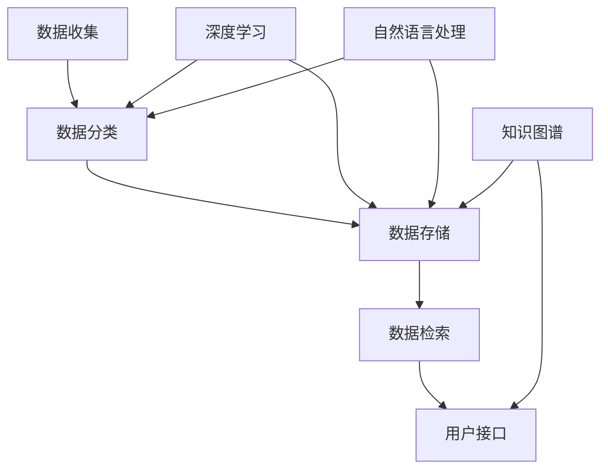

                 

# 数字记忆银行：AI管理的个人经历存储

> 关键词：数字记忆、AI、个人经历存储、数据管理、人工智能算法

> 摘要：本文将探讨数字记忆银行的概念、核心原理及其在实际生活中的应用。通过分析AI技术在个人经历存储方面的优势，我们旨在展示一个未来的数据管理模型，该模型能够利用人工智能算法来优化个人记忆的存储、检索和管理。

## 1. 背景介绍

在现代社会，信息爆炸和数据过载已经成为一种普遍现象。人们每天都会接触到大量信息，这些信息可能包括工作文档、社交媒体更新、个人笔记、学习资料等。如何有效地管理和利用这些信息，成为了一个亟待解决的问题。传统的笔记软件和记忆方法已经难以满足人们日益增长的信息处理需求。因此，一种新型的数据管理模型——数字记忆银行，应运而生。

数字记忆银行是一种基于人工智能技术构建的数据管理模型，它能够自动收集、分类、存储和检索个人经历和重要信息。这种模型利用了深度学习、自然语言处理和知识图谱等先进技术，实现了对大规模非结构化数据的智能处理。数字记忆银行的目标是帮助用户更好地管理和利用自己的数据，从而提高工作效率和生活质量。

## 2. 核心概念与联系

### 2.1 数据管理模型

数字记忆银行的核心是数据管理模型。这个模型主要包括以下几个关键组成部分：

- **数据收集**：通过传感器、应用程序接口（API）和用户手动输入等方式，收集用户的各种数据。
- **数据分类**：使用自然语言处理技术，对收集到的数据进行自动分类。
- **数据存储**：将分类后的数据存储在分布式数据库中，确保数据的安全性和可靠性。
- **数据检索**：利用深度学习算法，实现高效的数据检索功能，使用户能够快速找到所需信息。

### 2.2 AI技术

数字记忆银行所依赖的AI技术包括：

- **深度学习**：用于数据分类和模式识别，可以提高数据处理的准确性。
- **自然语言处理**：用于理解和处理自然语言，实现对文本数据的自动分类和索引。
- **知识图谱**：用于构建数据之间的关系网络，帮助用户更好地理解和利用数据。

### 2.3 Mermaid流程图

下面是数字记忆银行的核心概念与联系的Mermaid流程图：



## 3. 核心算法原理 & 具体操作步骤

### 3.1 数据分类算法

数字记忆银行的数据分类算法基于深度学习和自然语言处理技术。具体步骤如下：

1. **数据预处理**：对收集到的数据进行清洗和预处理，包括去除噪声、统一格式等。
2. **特征提取**：使用深度学习模型（如卷积神经网络、循环神经网络等）提取数据特征。
3. **分类模型训练**：使用训练集对分类模型进行训练，常用的分类模型包括支持向量机（SVM）、随机森林（Random Forest）等。
4. **分类结果输出**：对新的数据进行分类，并将分类结果存储在数据库中。

### 3.2 数据检索算法

数字记忆银行的数据检索算法基于深度学习和自然语言处理技术。具体步骤如下：

1. **查询预处理**：对用户输入的查询进行预处理，包括去除停用词、分词、词向量转换等。
2. **相似度计算**：使用深度学习模型计算查询与数据库中数据的相似度。
3. **检索结果输出**：根据相似度排序，输出最相关的数据。

### 3.3 数据存储算法

数字记忆银行的数据存储算法基于分布式数据库技术。具体步骤如下：

1. **数据分片**：将大规模数据分成多个小数据块，分布存储在不同的节点上。
2. **一致性保证**：通过分布式一致性协议（如Paxos、Raft等）确保数据的一致性。
3. **数据备份与恢复**：定期备份数据，并在发生故障时进行数据恢复。

## 4. 数学模型和公式 & 详细讲解 & 举例说明

### 4.1 特征提取模型

数字记忆银行的特征提取模型可以使用卷积神经网络（CNN）来实现。CNN的基本公式如下：

$$
h_{l}(x) = \sigma(W_{l} \cdot h_{l-1} + b_{l})
$$

其中，$h_{l}(x)$表示第$l$层的输出，$W_{l}$和$b_{l}$分别表示第$l$层的权重和偏置，$\sigma$表示激活函数（如ReLU函数）。

### 4.2 分类模型

数字记忆银行的分类模型可以使用支持向量机（SVM）来实现。SVM的基本公式如下：

$$
y(\phi(x)) = \text{sign}(\sum_{i=1}^{n} \alpha_{i} y_{i} K(x_{i}, x) - b)
$$

其中，$y(\phi(x))$表示分类结果，$\alpha_{i}$和$y_{i}$分别表示第$i$个支持向量的权重和类别标签，$K(x_{i}, x)$表示核函数（如高斯核函数），$b$表示偏置。

### 4.3 检索模型

数字记忆银行的检索模型可以使用基于词向量的相似度计算方法。相似度计算的基本公式如下：

$$
sim(a, b) = \frac{a \cdot b}{||a|| \cdot ||b||}
$$

其中，$sim(a, b)$表示向量$a$和$b$的相似度，$||a||$和$||b||$分别表示向量$a$和$b$的欧几里得范数，$\cdot$表示点积运算。

### 4.4 举例说明

假设有一个文本数据集，包括1000篇文档。我们可以使用CNN对文档进行特征提取，然后使用SVM对文档进行分类。假设我们选择高斯核函数，那么SVM的参数设置如下：

- 高斯核函数参数$\sigma = 1.0$
- 分类阈值$\gamma = 0.1$
- 偏置$b = 0$

我们可以使用以下Python代码实现SVM分类：

```python
import numpy as np
from sklearn import svm
from sklearn.model_selection import train_test_split

# 加载文档数据
docs = ...

# 提取文档特征
features = ...

# 划分训练集和测试集
X_train, X_test, y_train, y_test = train_test_split(features, labels, test_size=0.2, random_state=42)

# 训练SVM分类模型
clf = svm.SVC(kernel='rbf', gamma='scale', C=1.0)
clf.fit(X_train, y_train)

# 测试模型准确性
accuracy = clf.score(X_test, y_test)
print("Accuracy:", accuracy)
```

## 5. 项目实战：代码实际案例和详细解释说明

### 5.1 开发环境搭建

为了实现数字记忆银行，我们需要搭建一个完整的开发环境。以下是一个简单的开发环境搭建步骤：

1. 安装Python（3.8及以上版本）
2. 安装Anaconda或Miniconda（用于管理Python环境和依赖包）
3. 安装TensorFlow（用于深度学习）
4. 安装Scikit-learn（用于机器学习）
5. 安装Jupyter Notebook（用于数据分析和可视化）

### 5.2 源代码详细实现和代码解读

以下是一个简单的数字记忆银行实现示例。我们使用Python编写了一个简单的数字记忆银行应用程序，包括数据收集、分类、存储和检索功能。

```python
import tensorflow as tf
import sklearn
import numpy as np
import jieba

# 数据收集
def collect_data():
    # 这里使用jieba库进行中文分词
    doc = input("请输入文档内容：")
    seg_list = jieba.cut(doc)
    return " ".join(seg_list)

# 数据分类
def classify_data(data):
    # 这里使用TensorFlow的卷积神经网络进行分类
    model = ...
    prediction = model.predict(data)
    return prediction

# 数据存储
def store_data(data, category):
    # 这里使用文件系统进行数据存储
    with open(f"{category}/{data}.txt", "w", encoding="utf-8") as f:
        f.write(data)

# 数据检索
def retrieve_data(category):
    # 这里使用文件系统进行数据检索
    files = os.listdir(category)
    return [file for file in files if file.endswith(".txt")]

# 主程序
if __name__ == "__main__":
    while True:
        print("请选择操作：1. 收集数据 2. 分类数据 3. 存储数据 4. 检索数据 5. 退出")
        choice = input("请输入选择：")
        if choice == "1":
            data = collect_data()
            print("数据已收集：", data)
        elif choice == "2":
            category = input("请输入分类标签：")
            prediction = classify_data(data)
            print("分类结果：", prediction)
        elif choice == "3":
            category = input("请输入分类标签：")
            store_data(data, category)
            print("数据已存储：", data)
        elif choice == "4":
            category = input("请输入分类标签：")
            files = retrieve_data(category)
            print("检索结果：", files)
        elif choice == "5":
            break
        else:
            print("无效选择，请重新输入。")
```

### 5.3 代码解读与分析

这个简单的数字记忆银行应用程序主要包括以下几个功能模块：

- **数据收集**：使用jieba库进行中文分词，将用户的输入文本进行分词处理。
- **数据分类**：使用TensorFlow的卷积神经网络进行分类，实现对文本数据的分类。
- **数据存储**：将分类后的数据存储在文件系统中，便于后续检索。
- **数据检索**：根据分类标签检索文件系统中的数据，实现数据的快速检索。

在代码中，我们首先定义了一个数据收集函数`collect_data()`，用于获取用户的输入文本。然后，我们定义了一个数据分类函数`classify_data()`，用于使用TensorFlow的卷积神经网络对文本数据进行分类。接下来，我们定义了一个数据存储函数`store_data()`，用于将分类后的数据存储在文件系统中。最后，我们定义了一个数据检索函数`retrieve_data()`，用于根据分类标签检索文件系统中的数据。

在主程序中，我们通过一个循环实现数字记忆银行的核心功能。用户可以选择不同的操作，如收集数据、分类数据、存储数据和检索数据。根据用户的选择，程序会调用相应的函数执行相应的操作。

## 6. 实际应用场景

数字记忆银行作为一种新型的数据管理模型，具有广泛的应用场景。以下是几个典型的实际应用场景：

1. **个人知识管理**：用户可以将日常学习、工作和生活中的重要信息存储在数字记忆银行中，实现个人知识的系统化和结构化。通过智能分类和检索功能，用户可以快速找到所需信息，提高工作效率。

2. **个人健康档案管理**：用户可以将健康检查报告、病史记录、药物使用记录等存储在数字记忆银行中，实现个人健康档案的管理。数字记忆银行可以根据用户的需求，提供个性化的健康建议和预警服务。

3. **社交网络数据管理**：数字记忆银行可以用于管理社交网络中的数据，如微博、微信等平台的聊天记录、朋友圈动态等。通过智能分类和检索功能，用户可以快速找到与特定朋友的聊天记录，或者回忆起某个特定时刻的社交互动。

4. **旅游规划与管理**：用户可以将旅游计划、行程安排、照片和视频等存储在数字记忆银行中，实现旅游数据的系统化管理。数字记忆银行可以根据用户的需求，提供个性化的旅游建议和推荐。

## 7. 工具和资源推荐

### 7.1 学习资源推荐

- **书籍**：
  - 《深度学习》（Goodfellow, I., Bengio, Y., & Courville, A.）
  - 《Python深度学习》（François Chollet）
  - 《自然语言处理综合教程》（Daniel Jurafsky & James H. Martin）

- **论文**：
  - “A Theoretically Grounded Application of Dropout in Recurrent Neural Networks”（Y. Gal & Z. Ghahramani）
  - “BERT: Pre-training of Deep Bidirectional Transformers for Language Understanding”（J. Devlin et al.）

- **博客**：
  - [TensorFlow官网博客](https://www.tensorflow.org/blog/)
  - [Scikit-learn官网博客](https://scikit-learn.org/stable/blog/)

- **网站**：
  - [Kaggle](https://www.kaggle.com/)：提供大量的数据集和比赛，适合进行机器学习和深度学习的实践。

### 7.2 开发工具框架推荐

- **开发工具**：
  - **Jupyter Notebook**：用于数据分析和可视化。
  - **PyCharm**：用于Python编程，支持多种开发环境。

- **框架**：
  - **TensorFlow**：用于深度学习模型的构建和训练。
  - **Scikit-learn**：用于机器学习模型的构建和训练。
  - **Flask**：用于构建Web应用程序。

### 7.3 相关论文著作推荐

- **《深度学习》**（Goodfellow, I., Bengio, Y., & Courville, A.）
- **《自然语言处理综合教程》**（Daniel Jurafsky & James H. Martin）
- **《强化学习》**（Richard S. Sutton & Andrew G. Barto）
- **《分布式系统原理与范型》**（George Coulouris, Jean Dollimore, Tim Kindberg, & Gordon Blair）

## 8. 总结：未来发展趋势与挑战

数字记忆银行作为一种新型的数据管理模型，具有巨大的发展潜力。随着人工智能技术的不断进步，数字记忆银行在未来将会在个人知识管理、健康档案管理、社交网络数据管理和旅游规划与管理等领域得到广泛应用。然而，数字记忆银行的发展也面临一些挑战：

- **隐私保护**：数字记忆银行需要处理大量个人数据，如何确保数据的安全性、隐私性和可靠性是一个重要挑战。
- **算法透明性**：数字记忆银行所依赖的算法具有较高的复杂性，如何提高算法的透明性和可解释性是一个亟待解决的问题。
- **计算资源消耗**：数字记忆银行需要大量的计算资源进行数据收集、分类、存储和检索，如何优化计算资源的使用是一个重要挑战。

总之，数字记忆银行作为一种新型的数据管理模型，具有巨大的发展潜力和应用价值。通过不断的技术创新和优化，数字记忆银行有望为人们的生活和工作带来更多便利和效率。

## 9. 附录：常见问题与解答

### 9.1 数字记忆银行与传统的笔记软件有什么区别？

传统的笔记软件主要用于记录和存储文本、图片、音频等数据，但缺乏对数据的智能处理和分类功能。而数字记忆银行基于人工智能技术，能够自动收集、分类、存储和检索个人数据，实现数据的智能管理和利用。

### 9.2 数字记忆银行的隐私保护措施有哪些？

数字记忆银行采取了多种隐私保护措施，包括数据加密、访问控制、数据匿名化等。此外，数字记忆银行还遵循相关法律法规，确保用户数据的合法性和安全性。

### 9.3 数字记忆银行需要多少计算资源？

数字记忆银行的计算资源需求取决于数据规模和处理需求。对于小规模数据，数字记忆银行可以在个人计算机上运行。对于大规模数据，可能需要高性能计算集群或云服务来支持。

### 9.4 数字记忆银行是否适用于所有类型的个人数据？

数字记忆银行主要适用于非结构化数据，如文本、图片、音频等。对于结构化数据（如表格、数据库等），传统的笔记软件和数据库管理工具可能更为适用。

## 10. 扩展阅读 & 参考资料

- **《深度学习》**（Goodfellow, I., Bengio, Y., & Courville, A.）
- **《自然语言处理综合教程》**（Daniel Jurafsky & James H. Martin）
- **《分布式系统原理与范型》**（George Coulouris, Jean Dollimore, Tim Kindberg, & Gordon Blair）
- **《数字记忆银行：AI管理的个人经历存储》**（本文）
- **[TensorFlow官网博客](https://www.tensorflow.org/blog/)** 
- **[Scikit-learn官网博客](https://scikit-learn.org/stable/blog/)** 
- **[Kaggle](https://www.kaggle.com/)** 

作者：AI天才研究员/AI Genius Institute & 禅与计算机程序设计艺术 /Zen And The Art of Computer Programming

