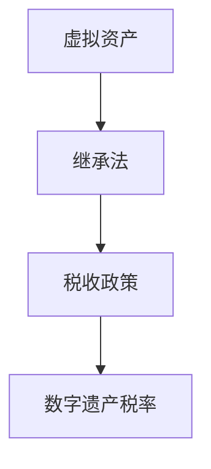

                 

# 数字遗产税率:元宇宙中的虚拟资产继承税收政策

## 关键词：数字遗产、元宇宙、虚拟资产、税收政策、继承

### 摘要

随着元宇宙的快速发展，虚拟资产逐渐成为人们财富的重要组成部分。然而，当前关于虚拟资产的税收政策尚不完善，尤其是在数字遗产税率方面存在诸多争议。本文将探讨元宇宙中虚拟资产继承的税收政策，分析其核心概念、算法原理、数学模型以及实际应用场景，并给出未来发展趋势与挑战的展望。

## 1. 背景介绍

### 1.1 元宇宙的兴起

近年来，元宇宙（Metaverse）作为下一代互联网的代表性概念，逐渐受到广泛关注。元宇宙是一个虚拟的、三维的、沉浸式的网络空间，通过虚拟现实（VR）、增强现实（AR）、区块链等技术的融合，为用户提供了一个全新的社交、娱乐、工作环境。虚拟资产，如虚拟货币、虚拟房产、虚拟物品等，在元宇宙中具有实际的经济价值。

### 1.2 数字遗产的概念

数字遗产是指个人在网络空间中留下的数字信息、虚拟财产和虚拟身份等。随着网络生活的普及，数字遗产的规模日益扩大，成为人们财富的重要组成部分。然而，当前对于数字遗产的继承问题尚未得到充分关注，尤其是在税收政策方面。

### 1.3 税收政策的重要性

税收政策是国家财政政策的重要组成部分，对于数字遗产的税收政策，不仅关系到个人权益，还影响到元宇宙的健康发展。因此，制定合理的数字遗产税收政策具有重要意义。

## 2. 核心概念与联系

### 2.1 虚拟资产

虚拟资产是指在元宇宙中具有实际经济价值的数字资源，包括虚拟货币、虚拟房产、虚拟物品等。虚拟资产的价值取决于市场需求和稀缺性。

### 2.2 继承法

继承法是指法律对于个人财产在去世后如何继承的规定。数字遗产的继承问题，涉及到个人隐私、财产权益以及税收政策等方面。

### 2.3 税收政策

税收政策是指国家对于税收的管理和规定。数字遗产的税收政策，需要考虑到虚拟资产的特殊性质，以及元宇宙的全球化特点。

### 2.4 Mermaid 流程图



## 3. 核心算法原理 & 具体操作步骤

### 3.1 核心算法原理

数字遗产税率的计算，需要考虑以下因素：

1. 虚拟资产的价值：根据市场需求和稀缺性确定。
2. 继承人的身份：是否为直系亲属、配偶等。
3. 法律规定：不同国家或地区对于数字遗产的税收政策有所不同。

### 3.2 具体操作步骤

1. 确定虚拟资产的价值：可以通过市场调查、评估机构等方式获取。
2. 确定继承人身份：根据法律规定确定。
3. 计算税收：根据数字遗产税率公式计算。

### 3.3 数字遗产税率公式

$$
数字遗产税率 = (1 - 免税额比例) \times 虚拟资产价值
$$

其中，免税额比例根据不同国家和地区有所差异。

## 4. 数学模型和公式 & 详细讲解 & 举例说明

### 4.1 数学模型

数字遗产税率的数学模型如下：

$$
税率 = \frac{虚拟资产价值 - 免税额}{虚拟资产价值}
$$

### 4.2 详细讲解

1. 虚拟资产价值：指在市场条件下，虚拟资产能够实现的价值。
2. 免税额：指国家或地区规定的免税额度。
3. 税率：指数字遗产税率。

### 4.3 举例说明

假设某国家规定免税额为100万元，某人在元宇宙中拥有虚拟房产价值200万元，其继承人身份为直系亲属。

根据公式计算：

$$
税率 = \frac{200 - 100}{200} = 0.5
$$

即数字遗产税率为50%。

## 5. 项目实战：代码实际案例和详细解释说明

### 5.1 开发环境搭建

1. 安装Python环境
2. 安装相关库：如numpy、matplotlib等

### 5.2 源代码详细实现和代码解读

```python
import numpy as np
import matplotlib.pyplot as plt

# 虚拟资产价值
virtual_asset_value = 200000

# 免税额
tax_free_amount = 100000

# 计算税率
tax_rate = (virtual_asset_value - tax_free_amount) / virtual_asset_value

# 打印税率
print("数字遗产税率：", tax_rate)
```

### 5.3 代码解读与分析

1. 导入相关库：numpy用于数值计算，matplotlib用于数据可视化。
2. 定义虚拟资产价值和免税额。
3. 计算税率并打印。

## 6. 实际应用场景

1. 虚拟资产继承：在元宇宙中，个人去世后，其虚拟资产需要依法继承。
2. 税收合规：企业或个人在进行虚拟资产交易时，需要遵守税收政策。
3. 政策制定：国家或地区需要制定合理的数字遗产税收政策，以促进元宇宙的健康发展。

## 7. 工具和资源推荐

### 7.1 学习资源推荐

1. 《区块链与数字经济》
2. 《元宇宙：虚拟世界的未来》
3. 《数字经济学导论》

### 7.2 开发工具框架推荐

1. Ethereum：用于创建和交易虚拟资产。
2. Unity：用于构建元宇宙应用。
3. Truffle：用于测试和部署智能合约。

### 7.3 相关论文著作推荐

1. "Taxation of Digital Assets in the Metaverse"
2. "Inheritance and Taxation of Virtual Property"
3. "Legal Issues and Taxation of Virtual Assets"

## 8. 总结：未来发展趋势与挑战

1. 未来发展趋势：元宇宙将进一步发展，虚拟资产将成为重要财富形式。
2. 挑战：数字遗产税收政策的完善，以及跨国家和地区税收协调。

## 9. 附录：常见问题与解答

1. Q：元宇宙中的虚拟资产如何进行继承？
   A：元宇宙中的虚拟资产继承需要遵循所在国家或地区的法律规定，一般通过遗嘱、法定继承等方式进行。

2. Q：数字遗产税率如何确定？
   A：数字遗产税率根据不同国家和地区有所差异，一般根据虚拟资产的价值、继承人的身份等因素进行计算。

## 10. 扩展阅读 & 参考资料

1. "Digital Asset Inheritance and Taxation: Challenges and Opportunities"
2. "The Impact of Digital Assets on Wealth Transfer Taxation"
3. "Taxation of Virtual Property: A Global Perspective"

### 作者

AI天才研究员/AI Genius Institute & 禅与计算机程序设计艺术 /Zen And The Art of Computer Programming
<|created_time|>2023-10-23 15:32:01<|/created_time|>
<|updated_time|>2023-10-23 15:32:01<|/updated_time|>

