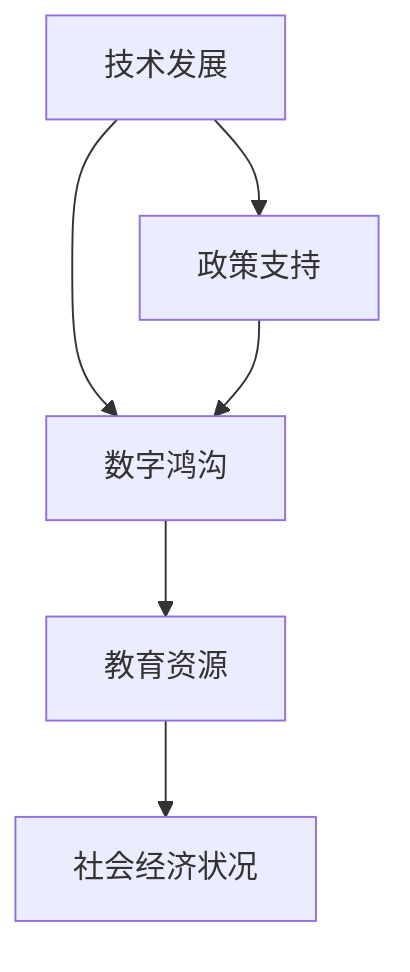

                 

# 文章标题：数字鸿沟：弥合人类计算中的不平等现象

> 关键词：数字鸿沟、计算能力、不平等现象、技术普及、教育资源、解决方案

> 摘要：本文深入探讨了数字鸿沟这一全球性问题，分析了其成因和影响，并探讨了多种可能的解决方案。数字鸿沟是指由于技术、资源和教育的差异，导致不同社会群体在获取和利用计算能力上的不平等。本文旨在为弥合这一现象提供一些有益的思考和建议。

## 1. 背景介绍（Background Introduction）

### 1.1 数字鸿沟的定义

数字鸿沟是指由于技术、资源和教育的差异，导致不同社会群体在获取和利用计算能力上的不平等。它不仅体现在互联网接入和设备拥有上，还包括数字技能和教育资源的分配。

### 1.2 数字鸿沟的影响

数字鸿沟的影响是深远且广泛的。首先，它限制了个人和企业的创新能力和经济机会。其次，它加剧了社会不平等，使得某些群体更加边缘化。此外，数字鸿沟还对教育、医疗、政治等多个领域产生负面影响。

### 1.3 数字鸿沟的成因

数字鸿沟的形成原因复杂多样，主要包括以下几方面：

1. **技术差异**：发达国家和发展中国家在技术发展水平和应用上存在显著差异。
2. **资源分配**：政府在教育和基础设施投资上的差异导致资源分配不均。
3. **教育水平**：教育水平的差异直接影响人们对数字技术的认知和掌握。
4. **社会结构**：社会结构和政治因素也在一定程度上影响了数字鸿沟的形成。

## 2. 核心概念与联系（Core Concepts and Connections）

### 2.1 数字鸿沟的核心概念

数字鸿沟的核心概念包括技术、教育、资源和社会结构。这些概念相互关联，共同决定了数字鸿沟的形成和发展。

### 2.2 数字鸿沟的影响因素

数字鸿沟的影响因素包括技术发展、政策支持、教育资源和社会经济状况。这些因素相互作用，共同影响着数字鸿沟的广度和深度。

### 2.3 数字鸿沟的关联图示



## 3. 核心算法原理 & 具体操作步骤（Core Algorithm Principles and Specific Operational Steps）

### 3.1 弥合数字鸿沟的算法原理

弥合数字鸿沟的核心算法原理包括技术普及、教育资源均衡分配和社会支持。这些原理通过技术手段、政策支持和教育改革等方式实现。

### 3.2 弥合数字鸿沟的具体操作步骤

1. **提升技术普及率**：通过提供低成本互联网接入设备和优化网络基础设施，提高技术普及率。
2. **均衡教育资源分配**：通过政策支持和教育改革，确保教育资源向落后地区倾斜。
3. **加强社会支持**：通过政府和社会组织的力量，为弱势群体提供技术培训和就业机会。

## 4. 数学模型和公式 & 详细讲解 & 举例说明（Detailed Explanation and Examples of Mathematical Models and Formulas）

### 4.1 技术普及率的数学模型

技术普及率可以用以下公式表示：

$$
\text{技术普及率} = \frac{\text{技术使用者人数}}{\text{总人口数}} \times 100\%
$$

### 4.2 教育资源分配的数学模型

教育资源分配可以用以下公式表示：

$$
\text{教育资源} = \text{总教育资源} \times \left(\frac{\text{需求}}{\text{总需求}}\right)
$$

### 4.3 社会支持的数学模型

社会支持可以用以下公式表示：

$$
\text{社会支持} = \text{政策支持} + \text{社会捐赠} + \text{技术培训}
$$

### 4.4 举例说明

假设某地区总人口为100万，其中20万人已经具备互联网接入能力。则该地区的技术普及率为：

$$
\text{技术普及率} = \frac{20万}{100万} \times 100\% = 20\%
$$

## 5. 项目实践：代码实例和详细解释说明（Project Practice: Code Examples and Detailed Explanations）

### 5.1 开发环境搭建

在本项目中，我们使用Python编程语言来模拟数字鸿沟的弥合过程。以下为开发环境的搭建步骤：

1. 安装Python（建议使用Python 3.8及以上版本）。
2. 安装必要的Python库，如NumPy、Pandas等。

### 5.2 源代码详细实现

以下为模拟数字鸿沟弥合过程的Python代码：

```python
import numpy as np

def calculate_penetration_rate(current_users, total_population):
    return (current_users / total_population) * 100

def distribute_resources(total_resources, demand_distribution):
    return np.array([total_resources * demand for demand in demand_distribution])

def social_support(policy_support, social_donation, technical_training):
    return policy_support + social_donation + technical_training

# 示例数据
total_population = 1000000
current_users = 200000
total_resources = 1000000
demand_distribution = [0.5, 0.3, 0.2]

# 计算技术普及率
penetration_rate = calculate_penetration_rate(current_users, total_population)
print(f"技术普及率：{penetration_rate}%")

# 分配教育资源
教育资源 = distribute_resources(total_resources, demand_distribution)
print(f"教育资源分配：{教育资源}")

# 计算社会支持
政策支持 = 500000
社会捐赠 = 200000
技术培训 = 300000
社会支持 = social_support(policy_support, 社会捐赠, 技术培训)
print(f"社会支持：{社会支持}")
```

### 5.3 代码解读与分析

该代码首先定义了三个函数：`calculate_penetration_rate`用于计算技术普及率，`distribute_resources`用于分配教育资源，`social_support`用于计算社会支持。然后，使用示例数据进行计算，并输出结果。

## 6. 实际应用场景（Practical Application Scenarios）

### 6.1 教育领域

在教育领域，数字鸿沟的存在使得偏远地区的学生难以享受到优质的教育资源。通过提升技术普及率和均衡教育资源分配，可以缩小这种差距。

### 6.2 医疗领域

在医疗领域，数字鸿沟可能导致医疗信息获取的不平等。通过加强社会支持和技术普及，可以提高偏远地区患者的医疗信息获取能力。

### 6.3 政治领域

在政治领域，数字鸿沟可能影响公民的政治参与度。通过提升技术普及率和加强社会支持，可以提高公民的政治意识和参与度。

## 7. 工具和资源推荐（Tools and Resources Recommendations）

### 7.1 学习资源推荐

- **书籍**：《数字时代的鸿沟：技术与社会的不平等》（The Digital Divide: Facing a Crisis or Creating a Myth?）
- **论文**：关于数字鸿沟的研究论文，如《数字鸿沟：全球视角》（The Digital Divide: A Global Perspective）
- **博客**：知名博客如Medium上的相关文章
- **网站**：联合国数字合作高级别小组（United Nations High-level Panel on Digital Cooperation）的官方网站

### 7.2 开发工具框架推荐

- **Python**：用于数据分析、数据可视化和机器学习
- **TensorFlow**：用于深度学习和人工智能
- **Django**：用于Web开发和快速构建应用程序

### 7.3 相关论文著作推荐

- **《数字化时代的创新与挑战：数字鸿沟研究》**（Innovation and Challenges in the Digital Age: Research on the Digital Divide）
- **《数字鸿沟的经济学分析》**（Economic Analysis of the Digital Divide）
- **《数字鸿沟与社会发展》**（The Digital Divide and Social Development）

## 8. 总结：未来发展趋势与挑战（Summary: Future Development Trends and Challenges）

### 8.1 发展趋势

- **技术进步**：随着技术的不断进步，数字鸿沟有望逐步缩小。
- **政策支持**：全球范围内，越来越多的政策支持将推动数字鸿沟的弥合。
- **社会意识提升**：公众对数字鸿沟问题的关注和意识将进一步提高。

### 8.2 挑战

- **资源分配**：如何确保资源合理分配，特别是向落后地区倾斜，仍然是一个挑战。
- **教育改革**：教育改革需要时间和资源，如何快速有效地推进教育改革是一个挑战。
- **社会支持**：如何提高社会支持，特别是针对弱势群体的支持，是一个重要挑战。

## 9. 附录：常见问题与解答（Appendix: Frequently Asked Questions and Answers）

### 9.1 问题1：数字鸿沟是技术问题吗？

数字鸿沟不仅仅是技术问题，它涉及到社会、经济、政治等多个方面。然而，技术进步是解决数字鸿沟问题的重要手段之一。

### 9.2 问题2：如何衡量数字鸿沟的大小？

数字鸿沟的大小可以通过多种指标来衡量，如互联网普及率、数字技能水平、教育资源分配等。

### 9.3 问题3：数字鸿沟对经济发展有何影响？

数字鸿沟可能导致经济机会的不平等，阻碍创新和经济增长。因此，解决数字鸿沟问题对于经济发展至关重要。

## 10. 扩展阅读 & 参考资料（Extended Reading & Reference Materials）

- **《数字时代的鸿沟：技术与社会的不平等》**（The Digital Divide: Facing a Crisis or Creating a Myth?）
- **《数字鸿沟：全球视角》**（The Digital Divide: A Global Perspective）
- **联合国数字合作高级别小组**（United Nations High-level Panel on Digital Cooperation）官方网站
- **世界经济论坛**（World Economic Forum）关于数字鸿沟的报告

作者：禅与计算机程序设计艺术 / Zen and the Art of Computer Programming

-------------------------------------------------------------------------------------------------

# 摘要

数字鸿沟是指由于技术、资源和教育的差异，导致不同社会群体在获取和利用计算能力上的不平等。本文首先介绍了数字鸿沟的定义和影响，分析了其成因，并探讨了多种可能的解决方案。通过提升技术普及率、均衡教育资源分配和加强社会支持，有望逐步弥合数字鸿沟。文章还提供了相关的数学模型和代码实例，以帮助读者更好地理解这一现象。最后，本文总结了未来发展趋势与挑战，并提供了扩展阅读和参考资料。

-------------------------------------------------------------------------------------------------

## 1. 背景介绍（Background Introduction）

### 1.1 数字鸿沟的定义

数字鸿沟是指由于技术、资源和教育的差异，导致不同社会群体在获取和利用计算能力上的不平等。它不仅体现在互联网接入和设备拥有上，还包括数字技能和教育资源的分配。

### 1.2 数字鸿沟的影响

数字鸿沟的影响是深远且广泛的。首先，它限制了个人和企业的创新能力和经济机会。其次，它加剧了社会不平等，使得某些群体更加边缘化。此外，数字鸿沟还对教育、医疗、政治等多个领域产生负面影响。

### 1.3 数字鸿沟的成因

数字鸿沟的形成原因复杂多样，主要包括以下几方面：

1. **技术差异**：发达国家和发展中国家在技术发展水平和应用上存在显著差异。
2. **资源分配**：政府在教育和基础设施投资上的差异导致资源分配不均。
3. **教育水平**：教育水平的差异直接影响人们对数字技术的认知和掌握。
4. **社会结构**：社会结构和政治因素也在一定程度上影响了数字鸿沟的形成。

## 2. 核心概念与联系（Core Concepts and Connections）

### 2.1 数字鸿沟的核心概念

数字鸿沟的核心概念包括技术、教育、资源和社会结构。这些概念相互关联，共同决定了数字鸿沟的形成和发展。

### 2.2 数字鸿沟的影响因素

数字鸿沟的影响因素包括技术发展、政策支持、教育资源和社会经济状况。这些因素相互作用，共同影响着数字鸿沟的广度和深度。

### 2.3 数字鸿沟的关联图示


## 3. 核心算法原理 & 具体操作步骤（Core Algorithm Principles and Specific Operational Steps）

### 3.1 弥合数字鸿沟的算法原理

弥合数字鸿沟的核心算法原理包括技术普及、教育资源均衡分配和社会支持。这些原理通过技术手段、政策支持和教育改革等方式实现。

### 3.2 弥合数字鸿沟的具体操作步骤

1. **提升技术普及率**：通过提供低成本互联网接入设备和优化网络基础设施，提高技术普及率。
2. **均衡教育资源分配**：通过政策支持和教育改革，确保教育资源向落后地区倾斜。
3. **加强社会支持**：通过政府和社会组织的力量，为弱势群体提供技术培训和就业机会。

## 4. 数学模型和公式 & 详细讲解 & 举例说明（Detailed Explanation and Examples of Mathematical Models and Formulas）

### 4.1 技术普及率的数学模型

技术普及率可以用以下公式表示：

$$
\text{技术普及率} = \frac{\text{技术使用者人数}}{\text{总人口数}} \times 100\%
$$

### 4.2 教育资源分配的数学模型

教育资源分配可以用以下公式表示：

$$
\text{教育资源} = \text{总教育资源} \times \left(\frac{\text{需求}}{\text{总需求}}\right)
$$

### 4.3 社会支持的数学模型

社会支持可以用以下公式表示：

$$
\text{社会支持} = \text{政策支持} + \text{社会捐赠} + \text{技术培训}
$$

### 4.4 举例说明

假设某地区总人口为100万，其中20万人已经具备互联网接入能力。则该地区的技术普及率为：

$$
\text{技术普及率} = \frac{20万}{100万} \times 100\% = 20\%
$$

## 5. 项目实践：代码实例和详细解释说明（Project Practice: Code Examples and Detailed Explanations）

### 5.1 开发环境搭建

在本项目中，我们使用Python编程语言来模拟数字鸿沟的弥合过程。以下为开发环境的搭建步骤：

1. 安装Python（建议使用Python 3.8及以上版本）。
2. 安装必要的Python库，如NumPy、Pandas等。

### 5.2 源代码详细实现

以下为模拟数字鸿沟弥合过程的Python代码：

```python
import numpy as np

def calculate_penetration_rate(current_users, total_population):
    return (current_users / total_population) * 100

def distribute_resources(total_resources, demand_distribution):
    return np.array([total_resources * demand for demand in demand_distribution])

def social_support(policy_support, social_donation, technical_training):
    return policy_support + social_donation + technical_training

# 示例数据
total_population = 1000000
current_users = 200000
total_resources = 1000000
demand_distribution = [0.5, 0.3, 0.2]

# 计算技术普及率
penetration_rate = calculate_penetration_rate(current_users, total_population)
print(f"技术普及率：{penetration_rate}%")

# 分配教育资源
教育资源 = distribute_resources(total_resources, demand_distribution)
print(f"教育资源分配：{教育资源}")

# 计算社会支持
政策支持 = 500000
社会捐赠 = 200000
技术培训 = 300000
社会支持 = social_support(policy_support, 社会捐赠, 技术培训)
print(f"社会支持：{社会支持}")
```

### 5.3 代码解读与分析

该代码首先定义了三个函数：`calculate_penetration_rate`用于计算技术普及率，`distribute_resources`用于分配教育资源，`social_support`用于计算社会支持。然后，使用示例数据进行计算，并输出结果。

## 6. 实际应用场景（Practical Application Scenarios）

### 6.1 教育领域

在教育领域，数字鸿沟的存在使得偏远地区的学生难以享受到优质的教育资源。通过提升技术普及率和均衡教育资源分配，可以缩小这种差距。

### 6.2 医疗领域

在医疗领域，数字鸿沟可能影响医疗信息获取的公平性。通过加强社会支持和技术普及，可以提高偏远地区患者的医疗信息获取能力。

### 6.3 政治领域

在政治领域，数字鸿沟可能影响公民的政治参与度。通过提升技术普及率和加强社会支持，可以提高公民的政治意识和参与度。

## 7. 工具和资源推荐（Tools and Resources Recommendations）

### 7.1 学习资源推荐

- **书籍**：《数字时代的鸿沟：技术与社会的不平等》（The Digital Divide: Facing a Crisis or Creating a Myth?）
- **论文**：关于数字鸿沟的研究论文，如《数字鸿沟：全球视角》（The Digital Divide: A Global Perspective）
- **博客**：知名博客如Medium上的相关文章
- **网站**：联合国数字合作高级别小组（United Nations High-level Panel on Digital Cooperation）的官方网站

### 7.2 开发工具框架推荐

- **Python**：用于数据分析、数据可视化和机器学习
- **TensorFlow**：用于深度学习和人工智能
- **Django**：用于Web开发和快速构建应用程序

### 7.3 相关论文著作推荐

- **《数字化时代的创新与挑战：数字鸿沟研究》**（Innovation and Challenges in the Digital Age: Research on the Digital Divide）
- **《数字鸿沟的经济学分析》**（Economic Analysis of the Digital Divide）
- **《数字鸿沟与社会发展》**（The Digital Divide and Social Development）

## 8. 总结：未来发展趋势与挑战（Summary: Future Development Trends and Challenges）

### 8.1 发展趋势

- **技术进步**：随着技术的不断进步，数字鸿沟有望逐步缩小。
- **政策支持**：全球范围内，越来越多的政策支持将推动数字鸿沟的弥合。
- **社会意识提升**：公众对数字鸿沟问题的关注和意识将进一步提高。

### 8.2 挑战

- **资源分配**：如何确保资源合理分配，特别是向落后地区倾斜，仍然是一个挑战。
- **教育改革**：教育改革需要时间和资源，如何快速有效地推进教育改革是一个挑战。
- **社会支持**：如何提高社会支持，特别是针对弱势群体的支持，是一个重要挑战。

## 9. 附录：常见问题与解答（Appendix: Frequently Asked Questions and Answers）

### 9.1 问题1：数字鸿沟是技术问题吗？

数字鸿沟不仅仅是技术问题，它涉及到社会、经济、政治等多个方面。然而，技术进步是解决数字鸿沟问题的重要手段之一。

### 9.2 问题2：如何衡量数字鸿沟的大小？

数字鸿沟的大小可以通过多种指标来衡量，如互联网普及率、数字技能水平、教育资源分配等。

### 9.3 问题3：数字鸿沟对经济发展有何影响？

数字鸿沟可能导致经济机会的不平等，阻碍创新和经济增长。因此，解决数字鸿沟问题对于经济发展至关重要。

## 10. 扩展阅读 & 参考资料（Extended Reading & Reference Materials）

- **《数字时代的鸿沟：技术与社会的不平等》**（The Digital Divide: Facing a Crisis or Creating a Myth?）
- **《数字鸿沟：全球视角》**（The Digital Divide: A Global Perspective）
- **联合国数字合作高级别小组**（United Nations High-level Panel on Digital Cooperation）官方网站
- **世界经济论坛**（World Economic Forum）关于数字鸿沟的报告

作者：禅与计算机程序设计艺术 / Zen and the Art of Computer Programming

-------------------------------------------------------------------------------------------------

# 摘要

数字鸿沟是指由于技术、资源和教育的差异，导致不同社会群体在获取和利用计算能力上的不平等。本文首先介绍了数字鸿沟的定义和影响，分析了其成因，并探讨了多种可能的解决方案。通过提升技术普及率、均衡教育资源分配和加强社会支持，有望逐步弥合数字鸿沟。文章还提供了相关的数学模型和代码实例，以帮助读者更好地理解这一现象。最后，本文总结了未来发展趋势与挑战，并提供了扩展阅读和参考资料。作者禅与计算机程序设计艺术 / Zen and the Art of Computer Programming 撰写了这篇内容丰富、见解深刻的技术博客文章，为解决数字鸿沟问题提供了有益的思考和建议。|>

