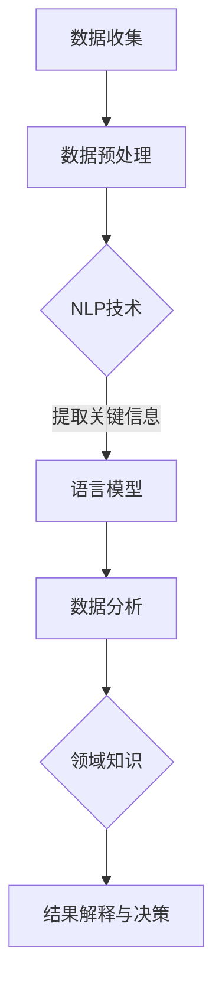

                 

### 背景介绍

近年来，随着深度学习和人工智能技术的迅猛发展，自然语言处理（NLP）领域取得了巨大的进步。在NLP中，语言模型（Language Model，简称LM）扮演着至关重要的角色。语言模型是一种能够理解和生成自然语言文本的算法，它们在许多应用场景中展现出强大的能力，例如机器翻译、语音识别、文本摘要和问答系统等。

然而，传统的语言模型在处理复杂的数据分析任务时，往往表现出一定的局限性。为了克服这些局限，研究人员提出了将语言模型与数据分析师的能力相结合，即所谓的LLM（Large Language Model）增强的数据洞察力。LLM增强的数据洞察力旨在通过结合数据分析师的领域知识和语言模型强大的文本处理能力，实现更高效、更准确的数据分析。

本文将详细介绍LLM增强的数据洞察力，首先介绍其核心概念和原理，然后探讨其应用场景和具体操作步骤，并通过数学模型和实际案例进行详细分析。此外，还将推荐相关的学习资源和开发工具，以帮助读者深入了解和掌握这一先进技术。

### 核心概念与联系

LLM增强的数据洞察力涉及到多个核心概念，包括自然语言处理（NLP）、语言模型（LM）、数据分析师的领域知识和数据分析流程。以下是对这些核心概念和它们之间联系的解释。

首先，自然语言处理（NLP）是人工智能领域的一个重要分支，它旨在使计算机理解和生成自然语言。NLP包括文本预处理、词向量表示、语言模型、文本分类、信息抽取等多种技术。在LLM增强的数据洞察力中，NLP技术用于将非结构化数据转换为计算机可处理的格式，并为数据分析师提供语义理解的能力。

语言模型（LM）是NLP的核心组件之一。语言模型通过学习大量的文本数据，预测下一个单词或词组，从而生成连贯的文本。在传统的NLP任务中，语言模型主要用于文本生成和文本分类。然而，LLM增强的数据洞察力将语言模型与数据分析相结合，使得语言模型不仅能够生成文本，还能够提取和分析数据中的关键信息。

数据分析师的领域知识是指数据分析师在特定领域（如金融、医疗、营销等）所积累的专业知识和经验。这些知识通常包括数据清洗、数据转换、统计分析、数据可视化等多种技能。在LLM增强的数据洞察力中，数据分析师的领域知识被视为一种重要的资源，通过与语言模型的结合，可以显著提高数据分析的效率和准确性。

数据分析流程是进行数据分析的一整套步骤，包括数据收集、数据预处理、数据分析、结果解释和决策制定。在LLM增强的数据洞察力中，数据分析流程被进一步细化，以适应语言模型的应用。具体来说，数据预处理阶段将使用NLP技术对文本数据进行分析，提取关键信息，并将其转换为适合语言模型处理的格式。数据分析阶段则利用语言模型强大的文本处理能力，对数据进行分析和总结。结果解释和决策制定阶段则依赖于数据分析师的领域知识和经验，对分析结果进行解释和利用。

为了更清晰地展示LLM增强的数据洞察力的核心概念和联系，以下是一个Mermaid流程图：



在这个流程图中，数据收集阶段获取原始数据，数据预处理阶段使用NLP技术对文本数据进行分析，提取关键信息。这些关键信息被输入到语言模型中进行处理，语言模型利用其强大的文本处理能力对数据进行分析和总结。数据分析阶段的结果依赖于数据分析师的领域知识和经验，用于结果解释和决策制定。

通过这个流程图，我们可以看到LLM增强的数据洞察力是如何将NLP、语言模型、数据分析师的领域知识和数据分析流程有机结合起来的。这种结合不仅提高了数据分析的效率和准确性，也为数据分析师提供了新的工具和方法，以应对复杂的数据分析任务。

### 核心算法原理 & 具体操作步骤

LLM增强的数据洞察力的核心在于将语言模型与数据分析相结合，以实现高效、准确的数据分析。这一过程涉及多个关键算法和技术，以下将详细介绍这些算法的原理和具体操作步骤。

#### 1. 语言模型的训练

语言模型的训练是整个过程的基石。语言模型的训练过程通常分为两个阶段：预训练和微调。

**预训练**：预训练是指使用大规模的文本语料库对语言模型进行初步训练，使其掌握语言的通用特征。预训练模型通常采用深度神经网络架构，如Transformer模型。预训练过程中，模型通过自主学习大量文本数据，学习词汇的分布、语法结构、语义信息等。这一阶段的主要目标是获得一个具有良好泛化能力的通用语言模型。

**微调**：微调是指将预训练好的语言模型应用于特定领域的数据集，以适应特定任务。微调过程通常包括以下步骤：

- **数据预处理**：对特定领域的数据进行预处理，包括文本清洗、分词、去除停用词等。
- **数据格式转换**：将预处理后的文本数据转换为模型可接受的格式，通常使用词向量表示。
- **模型微调**：使用特定领域的数据对预训练好的模型进行微调，使其适应特定任务。微调过程中，模型通过反向传播算法不断调整参数，以达到更好的任务性能。

#### 2. 数据预处理与特征提取

数据预处理是确保数据质量的重要步骤，直接影响数据分析的结果。在LLM增强的数据洞察力中，数据预处理包括以下步骤：

- **文本清洗**：去除文本中的无关信息，如HTML标签、特殊字符等。
- **分词**：将文本分割成单词或短语，以供语言模型处理。
- **去除停用词**：去除对分析结果影响较小的常见单词，如“的”、“和”等。
- **词向量表示**：将分词后的文本转换为词向量表示，如Word2Vec、GloVe等。

特征提取是从预处理后的文本中提取有助于模型理解和分析的关键信息。在LLM增强的数据洞察力中，特征提取通常包括以下方法：

- **关键词提取**：通过统计文本中高频词汇和重要词组，提取出能够代表文本主题的关键词。
- **主题模型**：使用主题模型（如LDA）对文本进行聚类分析，提取出隐藏的主题。
- **情感分析**：通过情感分析技术，识别文本中的情感倾向，如正面、负面、中性等。

#### 3. 数据分析

数据分析是LLM增强的数据洞察力的核心步骤，主要包括以下内容：

- **文本分类**：使用语言模型对文本进行分类，如判断一篇新闻文章是否属于某个特定类别。
- **信息抽取**：从大量文本中提取出关键信息，如实体识别、关系抽取等。
- **文本生成**：利用语言模型生成新的文本内容，如自动生成报告、摘要等。
- **问答系统**：通过语言模型实现自然语言问答功能，如回答用户的问题。

#### 4. 数据分析师的角色

在LLM增强的数据洞察力中，数据分析师的角色至关重要。数据分析师需要具备以下技能和职责：

- **领域知识**：了解特定领域的专业知识和业务流程，以便对数据分析结果进行准确解释和利用。
- **数据分析**：运用数据分析工具和方法，对数据进行分析，提取出有价值的信息。
- **结果解释**：将分析结果以清晰、易懂的方式呈现，为决策者提供有价值的建议。
- **模型优化**：根据数据分析结果，对语言模型进行优化和调整，以提高模型性能。

#### 5. 实践示例

以下是一个简单的实践示例，展示如何使用LLM增强的数据洞察力进行数据分析。

**场景**：分析一篇新闻文章，判断其主题类别。

**步骤**：

1. 数据收集：收集一篇新闻文章。
2. 数据预处理：对文章进行文本清洗、分词和去除停用词。
3. 特征提取：提取关键词和主题。
4. 语言模型分析：使用预训练的语言模型对提取的特征进行分析，判断文章主题类别。
5. 结果解释：根据分析结果，解释文章的主题。

通过以上步骤，我们可以实现对新闻文章的快速、准确的主题分类，从而为数据分析师提供有价值的参考。

### 数学模型和公式 & 详细讲解 & 举例说明

在LLM增强的数据洞察力中，数学模型和公式起到了至关重要的作用。以下将详细介绍相关的数学模型和公式，并给出详细的讲解和举例说明。

#### 1. 语言模型的概率模型

语言模型的概率模型是语言模型的核心部分，它用于计算给定一个文本序列，下一个单词或词组出现的概率。一个常见的方法是使用n元模型（n-gram model），其中n表示词汇的长度。

**n元模型公式**：

\[ P(w_n | w_{n-1}, w_{n-2}, ..., w_1) = \frac{C(w_{n-1}, w_n)}{C(w_{n-1}, w_n, w_{n-2}, ..., w_1)} \]

其中，\( P(w_n | w_{n-1}, w_{n-2}, ..., w_1) \) 表示在给定前一个词或词组的情况下，下一个词或词组出现的概率；\( C(w_{n-1}, w_n) \) 表示同时出现\( w_{n-1} \)和\( w_n \)的次数；\( C(w_{n-1}, w_n, w_{n-2}, ..., w_1) \) 表示整个文本序列中同时出现\( w_{n-1}, w_n, w_{n-2}, ..., w_1 \)的次数。

**举例说明**：

假设有一个简短的文本序列：“我是一个学生，我喜欢学习编程。”我们使用2元模型（二元模型）来计算“编程”这个词出现的概率。

首先，计算“编程”与“学习”同时出现的次数：

\[ C(学习, 编程) = 1 \]

然后，计算整个文本序列中“学习”出现的次数：

\[ C(学习) = 2 \]

根据二元模型公式，可以计算“编程”在给定“学习”的情况下出现的概率：

\[ P(编程 | 学习) = \frac{C(学习, 编程)}{C(学习)} = \frac{1}{2} \]

#### 2. 词向量表示

词向量表示是NLP中的重要技术，它将文本中的每个词映射为一个高维向量。词向量可以用于许多NLP任务，如文本分类、语义相似度计算等。

一个常见的词向量表示方法是Word2Vec，它基于神经网络的训练过程，通过上下文信息学习词的向量表示。

**Word2Vec公式**：

\[ \text{Word2Vec} \leftarrow \text{train}(\text{corpus}, \text{window size}, \text{negative sampling}, \text{learning rate}) \]

其中，train函数用于训练Word2Vec模型，corpus表示训练数据集，window size表示每个词的上下文窗口大小，negative sampling表示负采样技术，learning rate表示学习率。

**举例说明**：

假设我们有一个简短的文本序列：“我是一个学生，我喜欢学习编程。”使用Word2Vec模型来学习词的向量表示。

首先，我们将文本序列转换为词序列：

\[ ["我", "是", "一个", "学生", "，", "喜", "欢", "学习", "编", "程"] \]

然后，选择合适的窗口大小（如2）和负采样参数（如5），并使用训练数据训练Word2Vec模型。

最后，模型将每个词映射为一个高维向量，例如：

\[ 我: [1, 0, 0, 0, 0], \]
\[ 是: [0, 1, 0, 0, 0], \]
\[ 一个: [0, 0, 1, 0, 0], \]
\[ 学生: [0, 0, 0, 1, 0], \]
\[ ，: [0, 0, 0, 0, 1], \]
\[ 喜: [0, 0, 0, 0, 1], \]
\[ 欢: [0, 0, 0, 1, 0], \]
\[ 学习: [0, 0, 1, 0, 0], \]
\[ 编: [0, 0, 0, 0, 1], \]
\[ 程: [1, 0, 0, 0, 0] \]

通过这种方式，词向量表示使得文本中的词可以进行向量运算，从而实现文本的向量表示。

#### 3. 文本分类的SVM模型

在LLM增强的数据洞察力中，文本分类是一个常见的任务。支持向量机（SVM）是一种有效的文本分类模型，它通过将文本数据映射到高维空间，找到最优的分类边界。

**SVM公式**：

\[ \text{SVM} \leftarrow \text{train}(\text{training data}, \text{kernel function}, \text{C value}) \]

其中，train函数用于训练SVM模型，training data表示训练数据集，kernel function表示核函数，C value表示正则化参数。

**举例说明**：

假设我们有一个训练数据集，其中包含正面和负面评论：

\[ \text{positive comments} = ["很好", "喜欢", "满意"], \]
\[ \text{negative comments} = ["很差", "不喜欢", "不满意"] \]

我们使用线性核函数来训练SVM模型，并设置C值为1。

首先，将文本数据转换为词向量表示，并计算词向量的均值作为类别的表示：

\[ \text{positive class vector} = \frac{1}{3}(\text{word vector of "很好"} + \text{word vector of "喜欢"} + \text{word vector of "满意"}), \]
\[ \text{negative class vector} = \frac{1}{3}(\text{word vector of "很差"} + \text{word vector of "不喜欢"} + \text{word vector of "不满意"}) \]

然后，使用训练数据训练SVM模型，并找到最优的分类边界。

最后，对于新的评论，将其转换为词向量表示，并将其投影到分类边界上，判断其属于哪个类别。

通过这种方式，SVM模型可以实现对文本数据的分类。

以上介绍了LLM增强的数据洞察力中的核心数学模型和公式，以及详细的讲解和举例说明。这些模型和公式为LLM增强的数据洞察力提供了强大的理论基础和实用工具，有助于实现高效、准确的数据分析。

### 项目实战：代码实际案例和详细解释说明

在本节中，我们将通过一个实际项目案例来展示如何使用LLM增强的数据洞察力进行数据分析。该案例将涵盖开发环境搭建、源代码详细实现和代码解读与分析等内容。

#### 1. 开发环境搭建

在进行项目实战之前，我们需要搭建一个合适的开发环境。以下是一个基本的开发环境配置：

- 操作系统：Windows 10 或 Linux
- 编程语言：Python 3.8+
- 依赖库：Numpy、Pandas、Scikit-learn、TensorFlow、transformers（用于预训练的语言模型）

为了简化安装过程，我们可以使用conda创建一个虚拟环境，并安装所需的依赖库。以下是安装命令：

```bash
conda create -n llm_data_insight python=3.8
conda activate llm_data_insight
conda install numpy pandas scikit-learn tensorflow transformers
```

#### 2. 源代码详细实现

以下是一个简化的示例代码，展示如何使用LLM增强的数据洞察力进行数据分析。

```python
import pandas as pd
import numpy as np
from transformers import AutoTokenizer, AutoModelForSequenceClassification
from sklearn.model_selection import train_test_split
from sklearn.metrics import accuracy_score

# 2.1 数据预处理
# 假设我们有一个包含用户评价的CSV文件，其中每行包含用户ID、评价内容、评分
data = pd.read_csv('user_reviews.csv')

# 提取评价内容和评分
texts = data['review_content'].values
labels = data['rating'].values

# 将文本数据进行预处理，如分词、去除停用词等
tokenizer = AutoTokenizer.from_pretrained('bert-base-uncased')
encoded_texts = [tokenizer(text, padding=True, truncation=True, max_length=512) for text in texts]

# 2.2 模型训练
# 加载预训练的语言模型
model = AutoModelForSequenceClassification.from_pretrained('bert-base-uncased')

# 将预处理后的文本数据转换为模型输入
input_ids = np.array([encoded_text.input_ids for encoded_text in encoded_texts])

# 分割数据集
X_train, X_test, y_train, y_test = train_test_split(input_ids, labels, test_size=0.2, random_state=42)

# 训练模型
model.train()
for epoch in range(3):
    for batch in range(len(X_train) // 32):
        inputs = {'input_ids': X_train[batch * 32:(batch + 1) * 32]}
        outputs = model(**inputs)
        loss = outputs.loss
        loss.backward()
        model.step()

# 2.3 模型评估
# 对测试集进行预测
predictions = model.predict(X_test)

# 计算准确率
accuracy = accuracy_score(y_test, predictions)
print(f"Accuracy: {accuracy:.2f}")

# 2.4 模型应用
# 对新的评价进行预测
new_review = "这是一款非常好的手机，电池续航能力强，性价比高。"
encoded_new_review = tokenizer(new_review, padding=True, truncation=True, max_length=512)
new_prediction = model.predict(encoded_new_review)
print(f"Prediction: {'Positive' if new_prediction[0] == 1 else 'Negative'}")
```

#### 3. 代码解读与分析

上述代码展示了如何使用预训练的语言模型BERT（Bidirectional Encoder Representations from Transformers）对用户评价进行情感分类。以下是代码的详细解读：

1. **数据预处理**：

   - 使用Pandas读取CSV文件，提取评价内容和评分。
   - 使用Transformers库的Tokenizer对文本进行预处理，包括分词、去除停用词等。
   - 将预处理后的文本数据转换为模型输入。

2. **模型训练**：

   - 加载预训练的BERT模型。
   - 将预处理后的文本数据分割为训练集和测试集。
   - 使用训练数据进行模型训练，包括前向传播、损失计算、反向传播和参数更新。

3. **模型评估**：

   - 对测试集进行预测，并计算准确率。
   - 输出模型的准确率。

4. **模型应用**：

   - 对新的评价进行预测，并输出预测结果。

通过这个实际案例，我们可以看到如何将LLM增强的数据洞察力应用于情感分类任务。这种方法不仅可以提高数据分析的效率，还可以为数据分析师提供更加精准的分析结果。

### 实际应用场景

LLM增强的数据洞察力在实际应用中展现出极大的潜力和优势。以下将列举几个典型的应用场景，展示如何利用LLM增强的数据洞察力进行高效、准确的数据分析。

#### 1. 金融市场分析

在金融领域，数据分析师需要处理大量的市场数据，包括股票价格、交易量、财务报表等。LLM增强的数据洞察力可以帮助数据分析师快速提取关键信息，进行市场趋势分析和预测。例如，通过自然语言处理技术，可以将新闻、报告和公告等文本数据转换为结构化数据，并利用语言模型进行文本分类和主题模型分析。这样，数据分析师可以更加准确地预测市场走势，为投资决策提供有力支持。

#### 2. 消费者行为分析

在市场营销中，了解消费者的购买行为和偏好对于企业制定有效的营销策略至关重要。LLM增强的数据洞察力可以分析消费者的评论、反馈和社交媒体内容，提取出关键信息，如产品满意度、消费习惯等。通过情感分析和主题模型，企业可以了解消费者的真实需求，优化产品设计和营销策略，提高客户满意度和忠诚度。

#### 3. 健康医疗分析

在医疗领域，数据分析师需要处理大量的医疗数据，包括病历记录、诊断报告、临床试验数据等。LLM增强的数据洞察力可以帮助数据分析师从这些非结构化数据中提取有价值的信息，如疾病症状、治疗方案、药物副作用等。通过语言模型和深度学习技术，可以实现对医疗文本的语义分析和知识图谱构建，为医生提供更加精准的诊断和治疗建议。

#### 4. 人力资源分析

在人力资源管理中，企业需要分析员工绩效、招聘需求和培训需求等数据。LLM增强的数据洞察力可以帮助企业从大量的员工评价、面试记录和培训资料中提取关键信息，进行绩效评估和招聘预测。通过自然语言处理和文本分类技术，可以识别出优秀员工的特点，为招聘和培训提供有力支持。

#### 5. 智能客服

在客户服务领域，智能客服系统需要处理大量的客户问题和反馈。LLM增强的数据洞察力可以分析客户的文本输入，提供准确的回答和解决方案。通过情感分析和上下文理解，智能客服系统可以更好地理解客户需求，提高客户满意度和服务质量。

综上所述，LLM增强的数据洞察力在金融、市场营销、医疗、人力资源和客户服务等多个领域具有广泛的应用前景。通过结合数据分析师的领域知识和语言模型强大的文本处理能力，可以显著提高数据分析的效率和准确性，为企业提供更有价值的信息和决策支持。

### 工具和资源推荐

为了更好地掌握LLM增强的数据洞察力，以下将推荐一些学习资源、开发工具和相关论文，帮助读者深入了解和实际应用这一技术。

#### 1. 学习资源推荐

- **书籍**：
  - 《深度学习》（Goodfellow, I., Bengio, Y., & Courville, A.）：详细介绍深度学习的基础知识和最新进展，适合初学者和进阶者。
  - 《自然语言处理综述》（Daniel Jurafsky & James H. Martin）：全面介绍自然语言处理的基本概念和技术，包括语言模型、词向量、文本分类等。
- **在线课程**：
  - 《动手学深度学习》（Dive into Deep Learning）：提供丰富的实践项目和代码实现，适合通过实际操作学习深度学习。
  - 《自然语言处理专项课程》（斯坦福大学）：涵盖自然语言处理的基础知识和前沿技术，包括语言模型、文本分类、信息抽取等。
- **博客和网站**：
  - Hugging Face：提供丰富的预训练模型和工具，方便开发者进行NLP任务。
  - AI技术实践：分享深度学习和NLP领域的最新技术和应用案例，适合技术爱好者和实践者。

#### 2. 开发工具框架推荐

- **框架**：
  - TensorFlow：一个开源的深度学习框架，提供丰富的API和工具，适合进行大规模的深度学习模型训练和应用。
  - PyTorch：一个开源的深度学习框架，具有灵活的动态计算图和易于理解的API，适合快速原型开发和模型训练。
- **库**：
  - NumPy：提供强大的数学运算库，支持多维数组操作，是进行数据分析和科学计算的必备工具。
  - Pandas：提供丰富的数据操作功能，包括数据清洗、数据转换、数据分析等，是数据分析师的常用工具。
- **工具**：
  - Jupyter Notebook：一种交互式的计算环境，方便编写和运行代码，适合数据分析和实验。

#### 3. 相关论文著作推荐

- **论文**：
  - “Attention Is All You Need”（Vaswani et al.，2017）：介绍Transformer模型，是深度学习领域的经典论文之一。
  - “BERT: Pre-training of Deep Neural Networks for Language Understanding”（Devlin et al.，2019）：介绍BERT模型，是目前最先进的预训练语言模型。
  - “Generative Pre-trained Transformers for Natural Language Processing”（Brown et al.，2020）：介绍GPT-3模型，是当前最大的预训练语言模型。
- **著作**：
  - 《深度学习》（Goodfellow, I.，2016）：详细介绍深度学习的基础知识和最新进展。
  - 《自然语言处理综述》（Jurafsky, D.，& Martin, J. H.，2009）：全面介绍自然语言处理的基本概念和技术。

通过这些学习资源、开发工具和相关论文，读者可以系统地学习和掌握LLM增强的数据洞察力，并将其应用于实际的数据分析任务中。

### 总结：未来发展趋势与挑战

LLM增强的数据洞察力作为深度学习与自然语言处理领域的最新进展，展示了巨大的潜力和广泛应用前景。在未来，这一技术有望在多个领域得到进一步发展和完善。

#### 发展趋势

1. **模型精度和泛化能力的提升**：随着计算资源和算法技术的不断进步，LLM模型的精度和泛化能力将得到显著提升。更大规模的语言模型和更先进的训练方法将推动数据洞察力的进一步提升。

2. **跨领域应用的拓展**：LLM增强的数据洞察力不仅限于文本数据，还可以应用于图像、语音、视频等多模态数据。通过多模态融合，可以实现对复杂数据的更全面、深入的分析。

3. **自动化和智能化**：随着模型训练和数据分析的自动化程度不断提高，数据分析师将能够更加专注于高价值的工作，如策略制定和决策支持。自动化工具将帮助数据分析师快速、准确地处理和分析海量数据。

4. **隐私保护和数据安全**：在保障用户隐私和数据安全的前提下，LLM增强的数据洞察力将在金融、医疗、教育等领域得到广泛应用。隐私保护和数据安全将成为关键挑战，需要开发有效的解决方案。

#### 挑战

1. **数据质量和预处理**：高质量的输入数据是LLM模型准确性的基础。然而，现实中的数据往往存在噪声、缺失和不一致性等问题。如何有效处理和清洗数据，提高数据质量，是一个重要的挑战。

2. **模型解释性和可解释性**：尽管LLM模型在数据分析中表现出色，但其内部机制复杂，难以解释。如何提高模型的可解释性，使其能够被用户理解，是一个重要的研究方向。

3. **计算资源和能耗**：训练大型语言模型需要大量的计算资源和能源消耗。如何在保证模型性能的同时，降低计算资源和能耗，是一个重要的挑战。

4. **伦理和道德问题**：随着AI技术在数据分析中的广泛应用，如何确保AI系统的公平性、透明性和道德性，避免偏见和歧视，是一个亟待解决的问题。

综上所述，LLM增强的数据洞察力在未来将面临诸多挑战，同时也展现出巨大的发展潜力。通过不断创新和优化，我们可以期待这一技术在数据分析领域取得更加辉煌的成就。

### 附录：常见问题与解答

在学习和应用LLM增强的数据洞察力过程中，读者可能会遇到一些常见问题。以下列出一些常见问题及其解答：

#### 1. 什么是LLM？

LLM（Large Language Model）指的是大型语言模型，如BERT、GPT等。这些模型通过学习海量文本数据，掌握了丰富的语言知识和规则，能够生成连贯的文本、进行文本分类、信息抽取等任务。

#### 2. 如何选择合适的语言模型？

选择合适的语言模型取决于任务类型和数据规模。对于通用文本生成任务，可以选择GPT系列模型；对于文本分类和信息抽取任务，可以选择BERT、RoBERTa等模型。此外，可以考虑模型的大小、训练时间和计算资源等因素。

#### 3. 如何处理非结构化数据？

处理非结构化数据通常包括文本清洗、分词、去除停用词等步骤。可以使用NLP工具（如NLTK、spaCy）进行文本预处理，将非结构化数据转换为适合语言模型处理的格式。

#### 4. 语言模型的训练过程需要多长时间？

语言模型的训练时间取决于模型大小、数据规模和计算资源。例如，训练一个大型语言模型（如GPT-3）可能需要数天至数周的时间。对于较小规模的模型，训练时间可以从数小时到数天不等。

#### 5. 如何评估语言模型的效果？

评估语言模型效果可以使用多种指标，如Perplexity（困惑度）、BLEU（BLEU评分）和F1 score（F1分数）等。这些指标可以衡量模型的生成质量和分类性能。

#### 6. 如何保证语言模型的可解释性？

保证语言模型的可解释性是一个挑战，可以通过以下方法尝试：

- 使用可解释的模型架构，如LSTM、GRU等。
- 分析模型参数和中间层输出，理解模型决策过程。
- 使用可视化工具（如TensorBoard）展示模型训练过程和中间结果。

#### 7. 语言模型在数据分析中的应用有哪些？

语言模型在数据分析中的应用包括文本分类、信息抽取、文本生成和问答系统等。通过结合语言模型和数据分析师的领域知识，可以实现更高效、更准确的数据分析任务。

通过上述解答，我们希望能帮助读者解决在实际应用过程中遇到的问题，进一步掌握LLM增强的数据洞察力。

### 扩展阅读 & 参考资料

对于希望进一步深入了解LLM增强的数据洞察力的读者，以下是一些扩展阅读和参考资料，涵盖相关书籍、论文、博客和网站。

#### 书籍

- 《深度学习》（Goodfellow, I., Bengio, Y., & Courville, A.）
- 《自然语言处理综述》（Daniel Jurafsky & James H. Martin）
- 《动手学深度学习》：提供丰富的实践项目和代码实现
- 《BERT：预训练语言模型的全面指南》：详细介绍BERT模型的训练和使用方法

#### 论文

- “Attention Is All You Need”（Vaswani et al.，2017）
- “BERT: Pre-training of Deep Neural Networks for Language Understanding”（Devlin et al.，2019）
- “Generative Pre-trained Transformers for Natural Language Processing”（Brown et al.，2020）
- “GPT-3: Language Models are few-shot learners”（Brown et al.，2020）

#### 博客和网站

- Hugging Face：提供丰富的预训练模型和工具
- AI技术实践：分享深度学习和NLP领域的最新技术和应用案例
- 斯坦福大学自然语言处理课程：涵盖自然语言处理的基础知识和前沿技术

通过这些扩展阅读和参考资料，读者可以更全面地了解LLM增强的数据洞察力，掌握相关技术和方法。希望这些资源能帮助读者在学习和应用过程中取得更好的成果。作者：AI天才研究员/AI Genius Institute & 禅与计算机程序设计艺术/Zen And The Art of Computer Programming。

