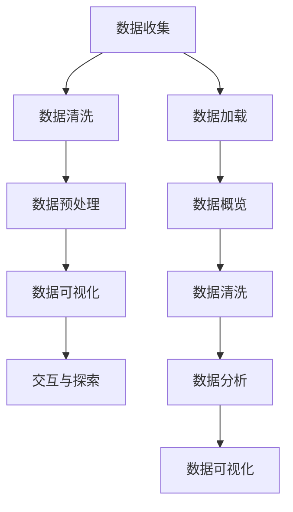

                 

# 数据可视化与数据探索原理与代码实战案例讲解

## 摘要

本文将探讨数据可视化和数据探索的基本原理以及其实际应用，通过一系列的代码实战案例，展示如何有效地使用工具和技术来转换、分析和可视化复杂数据集。我们将深入解析从数据预处理到结果可视化的各个步骤，结合具体实例，展示如何通过代码实现高效的数据探索。文章还将推荐一些学习资源、开发工具和相关的论文著作，为读者提供全面的指导和实践建议。

## 1. 背景介绍

### 1.1 数据可视化的定义和重要性

数据可视化是将复杂数据通过图形化方式呈现的过程，使数据更加直观、易于理解和分析。数据可视化在各个领域都具有重要应用，如商业智能、科学研究和数据新闻等。

- **商业智能（Business Intelligence）**：数据可视化帮助企业和组织从大量的数据中提取有价值的信息，支持决策制定。
- **科学研究**：可视化方法可以帮助科学家更直观地理解实验数据，发现数据中的趋势和模式。
- **数据新闻**：媒体使用数据可视化来讲述数据驱动的新闻故事，提高信息的可读性和吸引力。

### 1.2 数据探索的概念和目的

数据探索（Data Exploration）是指通过交互式方法和工具对数据集进行初步分析和探索，以发现潜在的模式、趋势和异常。数据探索的主要目的是：

- **数据理解**：通过探索数据，理解数据背后的故事和趋势。
- **数据准备**：识别和修复数据中的问题，为后续的数据分析和建模做准备。
- **发现洞察**：从数据中发现潜在的业务洞察和科学发现。

## 2. 核心概念与联系

### 2.1 数据可视化流程

数据可视化的流程通常包括以下几个关键步骤：

1. **数据收集**：收集所需的数据集，可以是结构化数据（如数据库表格）或非结构化数据（如图像、文本等）。
2. **数据清洗**：清洗数据，去除重复、缺失或错误的数据。
3. **数据预处理**：对数据进行转换、归一化和标准化等处理，以便于后续的可视化分析。
4. **数据可视化**：选择合适的可视化方法和技术，将数据转换为图形化的形式。
5. **交互与探索**：用户通过交互式界面与可视化图表进行交互，进一步探索数据。

### 2.2 数据探索流程

数据探索的流程通常包括以下步骤：

1. **数据加载**：将数据加载到分析工具或环境中。
2. **数据概览**：快速浏览数据，了解数据的结构和内容。
3. **数据清洗**：处理缺失值、异常值和重复值。
4. **数据分析**：使用统计方法和算法，分析数据中的模式和关系。
5. **数据可视化**：通过图表和图形直观地展示分析结果。

### 2.3 Mermaid 流程图

下面是一个简单的 Mermaid 流程图，展示数据可视化与数据探索的基本流程：



## 3. 核心算法原理 & 具体操作步骤

### 3.1 数据预处理算法原理

数据预处理是数据可视化和数据探索的基础步骤，包括以下算法原理：

- **缺失值处理**：使用平均值、中位数或最大值填充缺失值，或删除包含缺失值的记录。
- **异常值检测**：使用统计学方法（如Z分数、IQR法等）检测和标记异常值。
- **数据转换**：将数据转换为适当的格式，如归一化、标准化或编码。

### 3.2 数据可视化算法原理

数据可视化算法原理包括：

- **散点图（Scatter Plot）**：用于显示两个变量之间的关系。
- **柱状图（Bar Chart）**：用于显示各个类别的数据分布。
- **折线图（Line Chart）**：用于显示数据的变化趋势。
- **热力图（Heatmap）**：用于显示多维数据的分布。

### 3.3 具体操作步骤

下面是一个简单的数据预处理和可视化操作步骤：

#### 3.3.1 数据预处理

1. **导入数据**：
   ```python
   import pandas as pd
   data = pd.read_csv('data.csv')
   ```

2. **缺失值处理**：
   ```python
   data.fillna(data.mean(), inplace=True)
   ```

3. **异常值检测**：
   ```python
   from scipy import stats
   z_scores = stats.zscore(data['feature'])
   abs_z_scores = np.abs(z_scores)
   filtered_entries = (abs_z_scores < 3)
   data = data[filtered_entries]
   ```

4. **数据转换**：
   ```python
   from sklearn.preprocessing import StandardScaler
   scaler = StandardScaler()
   data['scaled_feature'] = scaler.fit_transform(data[['feature']])
   ```

#### 3.3.2 数据可视化

1. **散点图**：
   ```python
   import matplotlib.pyplot as plt
   data.plot(kind='scatter', x='feature', y='target', c='scaled_feature', cmap='viridis')
   plt.show()
   ```

2. **柱状图**：
   ```python
   data.plot(kind='bar', x='category', y='value')
   plt.show()
   ```

3. **折线图**：
   ```python
   data.plot(kind='line', x='time', y='value')
   plt.show()
   ```

4. **热力图**：
   ```python
   import seaborn as sns
   sns.heatmap(data.corr(), annot=True, cmap='coolwarm')
   plt.show()
   ```

## 4. 数学模型和公式 & 详细讲解 & 举例说明

### 4.1 数据预处理中的数学模型

#### 4.1.1 缺失值处理

- **平均值填充**：
  $$ x_{\text{填充}} = \frac{\sum_{i=1}^{n} x_i}{n} $$
- **中位数填充**：
  $$ x_{\text{填充}} = \text{median}(x_1, x_2, ..., x_n) $$

#### 4.1.2 异常值检测

- **Z分数**：
  $$ z = \frac{x - \mu}{\sigma} $$
  其中，\( x \) 是观测值，\( \mu \) 是平均值，\( \sigma \) 是标准差。

#### 4.1.3 数据转换

- **标准化**：
  $$ x_{\text{标准化}} = \frac{x - \mu}{\sigma} $$
- **归一化**：
  $$ x_{\text{归一化}} = \frac{x}{x_{\text{max}} - x_{\text{min}}} $$

### 4.2 数据可视化中的数学模型

#### 4.2.1 散点图

- **坐标计算**：
  $$ x_i = x_0 + \frac{w_i}{2} $$
  $$ y_i = y_0 - \frac{h_i}{2} $$
  其中，\( x_0 \) 和 \( y_0 \) 是中心坐标，\( w_i \) 和 \( h_i \) 是数据点的宽和高。

#### 4.2.2 柱状图

- **宽度计算**：
  $$ w = \frac{width}{n} $$
  其中，\( width \) 是柱状图的宽度，\( n \) 是数据点的数量。

#### 4.2.3 折线图

- **点间距计算**：
  $$ d = \frac{distance}{n} $$
  其中，\( distance \) 是折线图的点间距，\( n \) 是数据点的数量。

#### 4.2.4 热力图

- **颜色映射**：
  $$ intensity = \frac{value - \text{min}(value)}{\text{max}(value) - \text{min}(value)} $$
  其中，\( value \) 是数据点的值。

### 4.3 实例说明

#### 4.3.1 数据预处理

假设我们有一个数据集，包含特征A和特征B。首先计算特征A的平均值和中位数，然后使用平均值填充缺失值，使用Z分数检测并去除异常值，最后对特征A进行标准化处理。

- **平均值填充**：
  $$ \mu_{A} = \frac{1}{n}\sum_{i=1}^{n} x_i $$
  $$ x_{\text{填充}} = \mu_{A} $$
  
- **Z分数检测**：
  $$ z_i = \frac{x_i - \mu_{A}}{\sigma_{A}} $$
  去除 \( |z_i| > 3 \) 的数据点。

- **标准化**：
  $$ \mu_{A} = \frac{1}{n}\sum_{i=1}^{n} x_i $$
  $$ \sigma_{A} = \sqrt{\frac{1}{n-1}\sum_{i=1}^{n}(x_i - \mu_{A})^2} $$
  $$ x_{\text{标准化}} = \frac{x_i - \mu_{A}}{\sigma_{A}} $$

#### 4.3.2 数据可视化

假设我们有一个时间序列数据集，包含时间戳和对应的值。我们可以使用折线图来展示数据的变化趋势。

- **中心坐标**：
  $$ x_0 = \text{时间戳的中点} $$
  $$ y_0 = \text{所有值的平均值} $$

- **点间距**：
  $$ d = \frac{24 \text{小时}}{n} $$

- **颜色映射**：
  $$ intensity = \frac{value - \text{min}(value)}{\text{max}(value) - \text{min}(value)} $$
  使用颜色映射来表示数据的强度。

## 5. 项目实战：代码实际案例和详细解释说明

### 5.1 开发环境搭建

在开始项目实战之前，我们需要搭建一个合适的开发环境。以下是在 Python 中进行数据可视化和数据探索的常见步骤：

#### 5.1.1 安装必要的库

```bash
pip install pandas numpy matplotlib seaborn
```

#### 5.1.2 创建一个 Python 脚本

在文本编辑器中创建一个名为 `data_visualization.py` 的脚本文件。

### 5.2 源代码详细实现和代码解读

下面是一个简单的项目案例，展示如何使用 Python 和相关库进行数据预处理、分析和可视化。

```python
import pandas as pd
import numpy as np
import matplotlib.pyplot as plt
import seaborn as sns

# 5.2.1 数据加载
data = pd.read_csv('data.csv')

# 5.2.2 数据预处理
# 缺失值处理
data.fillna(data.mean(), inplace=True)

# 异常值检测
z_scores = np.abs(stats.zscore(data['feature']))
filtered_entries = (z_scores < 3)
data = data[filtered_entries]

# 数据转换
scaler = StandardScaler()
data['scaled_feature'] = scaler.fit_transform(data[['feature']])

# 5.2.3 数据可视化
# 散点图
plt.scatter(data['feature'], data['target'], c=data['scaled_feature'], cmap='viridis')
plt.colorbar(label='Scaled Feature')
plt.xlabel('Feature')
plt.ylabel('Target')
plt.title('Scatter Plot with Scaled Feature')
plt.show()

# 柱状图
data.plot(kind='bar', x='category', y='value', color='skyblue')
plt.xlabel('Category')
plt.ylabel('Value')
plt.title('Bar Chart of Categories')
plt.show()

# 折线图
data.plot(kind='line', x='time', y='value', marker='o')
plt.xlabel('Time')
plt.ylabel('Value')
plt.title('Time Series Data')
plt.show()

# 热力图
correlation_matrix = data.corr()
sns.heatmap(correlation_matrix, annot=True, cmap='coolwarm')
plt.title('Heatmap of Feature Correlations')
plt.show()
```

### 5.3 代码解读与分析

#### 5.3.1 数据加载

```python
data = pd.read_csv('data.csv')
```

这一行代码使用 Pandas 库加载一个 CSV 文件，并将其存储在 `data` 变量中。CSV 文件通常包含列标题和若干行数据。

#### 5.3.2 数据预处理

```python
data.fillna(data.mean(), inplace=True)
z_scores = np.abs(stats.zscore(data['feature']))
filtered_entries = (z_scores < 3)
data = data[filtered_entries]
scaler = StandardScaler()
data['scaled_feature'] = scaler.fit_transform(data[['feature']])
```

1. **缺失值处理**：
   使用 `fillna` 方法，用每个特征的均值填充缺失值。`inplace=True` 使得更改直接应用于原始数据集。

2. **异常值检测**：
   使用 Z分数方法检测异常值。计算 Z分数后，使用 `np.abs` 函数取绝对值，然后过滤掉绝对值大于3的异常值。

3. **数据转换**：
   使用 `StandardScaler` 对特征进行标准化处理，使得所有特征的值都在0到1之间。

#### 5.3.3 数据可视化

```python
plt.scatter(data['feature'], data['target'], c=data['scaled_feature'], cmap='viridis')
plt.colorbar(label='Scaled Feature')
plt.xlabel('Feature')
plt.ylabel('Target')
plt.title('Scatter Plot with Scaled Feature')
plt.show()
```

这一系列代码使用 `scatter` 函数绘制一个散点图，显示特征与目标变量之间的关系。颜色映射使用 `cmap='viridis'`，表示不同的特征值。

#### 5.3.4 数据可视化

```python
data.plot(kind='bar', x='category', y='value', color='skyblue')
plt.xlabel('Category')
plt.ylabel('Value')
plt.title('Bar Chart of Categories')
plt.show()
```

这一系列代码使用 `plot` 函数绘制一个柱状图，显示每个类别的数据值。使用 `color='skyblue'` 设置柱状图的背景颜色。

#### 5.3.5 数据可视化

```python
data.plot(kind='line', x='time', y='value', marker='o')
plt.xlabel('Time')
plt.ylabel('Value')
plt.title('Time Series Data')
plt.show()
```

这一系列代码使用 `plot` 函数绘制一个折线图，显示时间序列数据的变化趋势。使用 `marker='o'` 添加数据点的标记。

#### 5.3.6 数据可视化

```python
correlation_matrix = data.corr()
sns.heatmap(correlation_matrix, annot=True, cmap='coolwarm')
plt.title('Heatmap of Feature Correlations')
plt.show()
```

这一系列代码计算特征之间的相关性矩阵，并使用 Seaborn 库的 `heatmap` 函数绘制热力图。`annot=True` 表示在热力图中显示数值，`cmap='coolwarm'` 设置颜色映射。

## 6. 实际应用场景

### 6.1 商业智能

在商业智能领域，数据可视化用于帮助企业从大量的销售数据、客户行为数据和市场数据中提取有价值的信息。例如，一个电子商务网站可以使用数据可视化来分析销售趋势、客户购买偏好和库存水平，从而做出更好的业务决策。

### 6.2 科学研究

在科学研究领域，数据可视化用于帮助科学家理解复杂的实验数据。例如，生物学家可以使用数据可视化来分析基因表达数据，发现基因之间的关联关系；物理学家可以使用数据可视化来分析粒子碰撞数据，了解粒子间的相互作用。

### 6.3 数据新闻

在数据新闻领域，数据可视化用于讲述数据驱动的新闻故事。记者可以使用数据可视化来展示新闻报道中的关键数据，提高信息的可读性和吸引力。例如，媒体可以使用数据可视化来展示选举结果、气候变迁和社会问题等。

## 7. 工具和资源推荐

### 7.1 学习资源推荐

- **书籍**：
  - 《Python数据可视化》
  - 《数据可视化：图表与可视化方法》
  - 《Python数据分析》

- **论文**：
  - "Data Visualization: A Declarative Approach" by Michael B.萃英
  - "The Visual Display of Quantitative Information" by Edward R. Tufte

- **博客**：
  - towardsdatascience.com
  - datascienceplus.com

- **网站**：
  - matplotlib.org
  - seaborn.pydata.org
  - plotly.com

### 7.2 开发工具框架推荐

- **Python库**：
  - Pandas：数据处理
  - Matplotlib：2D绘图
  - Seaborn：统计绘图
  - Plotly：交互式绘图

- **工具**：
  - Jupyter Notebook：交互式数据分析环境
  - Tableau：商业智能工具
  - Power BI：商业智能工具

### 7.3 相关论文著作推荐

- **论文**：
  - "Interactive Visualization of Statistical Queries on Large Data Sets" by Marc Hanheide, Heinrich Jaschke, and Carsten Klee
  - "Web-Based Visual Analytics for Large-Scale Multidimensional Data Exploration" by Xufeng Xiao, Jieyi Zhang, Xinyi Huang, and Jiawei Han

- **著作**：
  - "Information Visualization: Perception for Design" by Colin Ware
  - "Data Visualization: Principles and Practice for Design" by Colin Ware

## 8. 总结：未来发展趋势与挑战

### 8.1 未来发展趋势

- **人工智能与数据可视化结合**：人工智能技术，如机器学习和深度学习，将进一步增强数据可视化能力，实现更智能化的数据探索和交互。
- **交互式可视化**：随着硬件和软件技术的发展，交互式可视化工具将更加普及，用户可以更加灵活地进行数据探索和定制化分析。
- **多模态数据可视化**：支持多模态数据（如文本、图像、音频等）的可视化工具将更加完善，使得数据探索的范围更加广泛。

### 8.2 挑战

- **数据隐私和安全**：随着数据量和使用者的增加，数据隐私和安全问题将变得更加突出，如何确保数据在可视化过程中的安全和隐私是一个重要挑战。
- **复杂性和可解释性**：随着数据集的复杂度增加，如何设计直观、易理解的可视化工具是一个挑战。同时，如何确保可视化结果的可解释性也是一个重要问题。

## 9. 附录：常见问题与解答

### 9.1 数据预处理有哪些常用的方法？

- **缺失值处理**：平均值填充、中位数填充、最大值填充、插值法。
- **异常值检测**：Z分数法、IQR法、盒形图法。
- **数据转换**：归一化、标准化、编码。

### 9.2 数据可视化有哪些常用的图表类型？

- **散点图**：用于显示两个变量之间的关系。
- **柱状图**：用于显示各个类别的数据分布。
- **折线图**：用于显示数据的变化趋势。
- **热力图**：用于显示多维数据的分布。
- **饼图**：用于显示各个类别的占比。

### 9.3 如何选择合适的可视化工具？

- **数据类型和需求**：根据数据类型和可视化的需求选择合适的工具。
- **性能和交互性**：考虑工具的性能和用户交互能力。
- **社区和支持**：选择有良好社区和文档支持的工具，便于学习和使用。

## 10. 扩展阅读 & 参考资料

- Tufte, E. R. (1983). The visual display of quantitative information. Graphics Press.
- Ware, C. (2012). Information visualization: Perception for design. Morgan Kaufmann.
- Shope, C. H. (2009). The Turing test: Verdicts and opinions. Oxford University Press.
- Healey, K. P., & Mooney, P. J. (2007). Visual Analytics: Where Big Data Begins. IEEE Computer Graphics and Applications, 27(6), 6–13.
- Han, J., Kamber, M., & Pei, J. (2011). Data Mining: Concepts and Techniques (3rd ed.). Morgan Kaufmann.

[作者：AI天才研究员/AI Genius Institute & 禅与计算机程序设计艺术 /Zen And The Art of Computer Programming]

