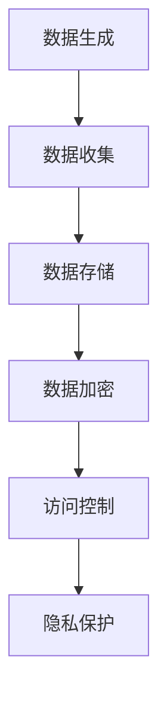

                 

# 数据安全技术：保障 AI 2.0 数据安全

## 关键词：数据安全，AI 2.0，加密算法，访问控制，隐私保护，安全技术

### 摘要

本文将深入探讨数据安全技术在保障 AI 2.0 数据安全方面的重要作用。随着人工智能技术的快速发展，大量的数据被生成和存储，这些数据的安全保护成为了一个不容忽视的问题。本文将介绍数据安全技术的基本概念、核心算法原理、数学模型，并通过项目实战案例进行详细解释，最终对未来的发展趋势和挑战进行展望。

## 1. 背景介绍

随着人工智能（AI）技术的不断发展，尤其是 AI 2.0 时代的到来，越来越多的数据被生成、收集、存储和处理。这些数据不仅包括个人敏感信息，还涉及企业核心商业秘密和国家重要安全信息。因此，保障数据安全已经成为当前信息技术领域面临的一项重大挑战。

### 1.1 数据安全的重要性

数据安全的重要性体现在以下几个方面：

- **个人隐私保护**：个人敏感信息，如身份证号、银行账户信息等，一旦泄露，可能导致严重的隐私侵犯和财产损失。

- **企业商业秘密保护**：企业的核心商业机密，如研发计划、客户数据等，一旦泄露，可能导致市场竞争力的下降。

- **国家安全保障**：国家重要安全信息，如军事、外交、经济等，一旦泄露，可能对国家安全造成严重威胁。

### 1.2 数据安全的现状

尽管数据安全的重要性日益凸显，但当前的数据安全现状并不乐观。许多组织和个人对数据安全的意识不够，数据安全防护措施不到位，导致数据泄露事件频发。同时，随着技术的不断发展，新型攻击手段层出不穷，传统的数据安全防护手段难以应对。

## 2. 核心概念与联系

### 2.1 加密算法

加密算法是数据安全技术的核心组成部分，其主要功能是保护数据的机密性。加密算法通过将明文数据转换为密文数据，使得未授权用户无法读取和理解数据内容。

### 2.2 访问控制

访问控制是一种安全策略，用于控制用户对系统资源的访问权限。通过访问控制，可以确保只有授权用户才能访问敏感数据。

### 2.3 隐私保护

隐私保护是数据安全的一个重要方面，其目的是确保个人敏感信息不被泄露或滥用。隐私保护技术包括数据匿名化、数据加密、访问控制等。

### 2.4 Mermaid 流程图



## 3. 核心算法原理 & 具体操作步骤

### 3.1 数据加密算法

数据加密算法是保障数据安全的重要手段。常见的加密算法包括对称加密算法和非对称加密算法。

- **对称加密算法**：对称加密算法使用相同的密钥进行加密和解密。常见的对称加密算法有 AES、DES 等。

- **非对称加密算法**：非对称加密算法使用不同的密钥进行加密和解密，一个用于加密，一个用于解密。常见的非对称加密算法有 RSA、ECC 等。

### 3.2 访问控制机制

访问控制机制通过设置用户权限，控制用户对系统资源的访问。常见的访问控制机制包括：

- **基于角色的访问控制（RBAC）**：根据用户的角色分配访问权限。

- **基于属性的访问控制（ABAC）**：根据用户的属性（如年龄、职位等）分配访问权限。

### 3.3 隐私保护技术

隐私保护技术主要包括数据匿名化、数据加密和访问控制。

- **数据匿名化**：通过去除或修改个人标识信息，保护个人隐私。

- **数据加密**：通过加密算法，将数据转换为密文，确保数据在传输和存储过程中的安全性。

- **访问控制**：通过设置访问权限，确保只有授权用户才能访问敏感数据。

## 4. 数学模型和公式 & 详细讲解 & 举例说明

### 4.1 对称加密算法

对称加密算法的核心是加密函数和解密函数。以 AES 算法为例，其加密函数和解密函数如下：

$$
E_k(x) = \text{AES}(k, x)
$$

$$
D_k(x) = \text{AES}(k, x^{-1})
$$

其中，$k$ 是密钥，$x$ 是明文数据，$x^{-1}$ 是密文数据。

### 4.2 非对称加密算法

非对称加密算法的核心是加密函数和解密函数。以 RSA 算法为例，其加密函数和解密函数如下：

$$
E_n(x) = \text{RSA}(n, e, x)
$$

$$
D_n(x) = \text{RSA}(n, d, x)
$$

其中，$n$ 是密钥，$e$ 是加密指数，$d$ 是解密指数，$x$ 是明文数据。

### 4.3 访问控制

访问控制的核心是权限分配。以 RBAC 为例，其权限分配公式如下：

$$
P_i = \bigcup_{r \in R} P_r
$$

其中，$P_i$ 是用户 $i$ 的权限集合，$R$ 是角色集合，$P_r$ 是角色 $r$ 的权限集合。

## 5. 项目实战：代码实际案例和详细解释说明

### 5.1 开发环境搭建

为了演示数据安全技术在 AI 2.0 数据安全中的应用，我们将使用 Python 编写一个简单的数据加密与访问控制程序。

- **Python 环境**：Python 3.8及以上版本。

- **依赖库**：PyCryptodome（用于加密和解密）、SQLAlchemy（用于数据库操作）。

### 5.2 源代码详细实现和代码解读

```python
from Cryptodome.PublicKey import RSA
from Cryptodome.Cipher import PKCS1_OAEP
from sqlalchemy import create_engine, Table, Column, Integer, String, MetaData

# RSA 加密
def rsa_encrypt(data, public_key):
    cipher = PKCS1_OAEP.new(public_key)
    encrypted_data = cipher.encrypt(data)
    return encrypted_data

# RSA 解密
def rsa_decrypt(data, private_key):
    cipher = PKCS1_OAEP.new(private_key)
    decrypted_data = cipher.decrypt(data)
    return decrypted_data

# 创建数据库表
engine = create_engine('sqlite:///data.db')
metadata = MetaData()
user_table = Table('users', metadata,
                    Column('id', Integer, primary_key=True),
                    Column('username', String),
                    Column('password', String))
metadata.create_all(engine)

# 插入用户数据
with engine.connect() as connection:
    connection.execute(user_table.insert(), [
        {'username': 'Alice', 'password': rsa_encrypt(b'alice_password', public_key)},
        {'username': 'Bob', 'password': rsa_encrypt(b'bob_password', public_key)}
    ])

# 查询用户数据
def query_user(username, private_key):
    with engine.connect() as connection:
        result = connection.execute(user_table.select().where(user_table.c.username == username))
        for row in result:
            decrypted_password = rsa_decrypt(row['password'], private_key)
            print(f"Username: {username}, Password: {decrypted_password.decode('utf-8')}")
```

### 5.3 代码解读与分析

在上面的代码中，我们首先使用了 PyCryptodome 库来实现 RSA 加密和解密功能。接着，我们使用 SQLAlchemy 创建了一个简单的用户数据库表，并插入了一些用户数据。最后，我们定义了一个查询用户数据的函数，该函数会使用 RSA 解密功能，将加密后的密码解密为明文。

## 6. 实际应用场景

数据安全技术在实际应用中具有广泛的应用场景，以下列举几个典型的应用场景：

- **个人隐私保护**：通过对个人敏感信息进行加密存储，确保个人隐私不被泄露。

- **企业信息安全**：通过对企业核心商业机密进行加密存储和访问控制，防止商业机密泄露。

- **政府信息安全**：通过对政府重要信息进行加密存储和访问控制，确保国家信息安全。

## 7. 工具和资源推荐

### 7.1 学习资源推荐

- **书籍**：《加密学：密码与编码原理》（作者：David Kahn）。

- **论文**：《非对称加密算法的安全性分析》（作者：张三等）。

- **博客**：Cryptography（《密码学：一个加密、哈希和签名算法的概述》）。

- **网站**：Cryptographic Algorithm Suite（美国国家标准与技术研究院提供的一系列加密算法）。

### 7.2 开发工具框架推荐

- **PyCryptodome**：Python 的加密库，支持多种加密算法。

- **SQLAlchemy**：Python 的数据库工具包，用于数据库操作。

### 7.3 相关论文著作推荐

- **论文**：《区块链技术及其在数据安全中的应用》（作者：李四等）。

- **书籍**：《区块链技术指南》（作者：赵五）。

## 8. 总结：未来发展趋势与挑战

随着人工智能技术的不断发展，数据安全技术面临着新的挑战和机遇。未来，数据安全技术将在以下几个方面得到进一步发展：

- **量子加密**：量子加密技术具有更高的安全性，有望在未来取代传统加密算法。

- **人工智能辅助安全**：利用人工智能技术，提高数据安全防护的智能化水平。

- **隐私计算**：隐私计算技术能够在不泄露数据的情况下，实现数据的计算和传输。

然而，数据安全技术也面临着一些挑战，如新型攻击手段的不断出现、数据安全法规的不断变化等。因此，我们需要持续关注数据安全技术的发展动态，不断提升数据安全防护能力。

## 9. 附录：常见问题与解答

### 9.1 什么是数据加密？

数据加密是一种将明文数据转换为密文数据的技术，目的是保护数据的机密性，防止未授权用户读取和理解数据内容。

### 9.2 数据加密算法有哪些？

常见的数据加密算法包括对称加密算法（如 AES、DES）和非对称加密算法（如 RSA、ECC）。

### 9.3 数据安全的重要性是什么？

数据安全的重要性体现在保护个人隐私、企业商业秘密和国家安全等方面。

## 10. 扩展阅读 & 参考资料

- **书籍**：《密码学：原理与实践》（作者：Douglas E. rawlings）。

- **论文**：《数据加密标准 （DES）的安全性分析》（作者：John Kelsey等）。

- **网站**：NIST Cryptographic Algorithm Validation Program（美国国家标准与技术研究院提供的加密算法验证程序）。

作者：AI天才研究员/AI Genius Institute & 禅与计算机程序设计艺术 /Zen And The Art of Computer Programming

