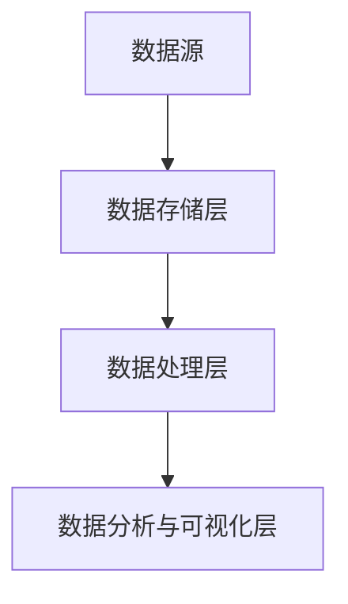
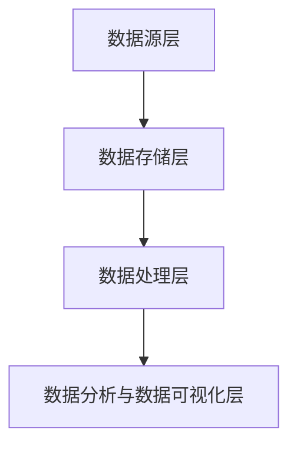

                 

# 数据湖：原理与代码实例讲解

## 关键词：数据湖，数据存储，大数据技术，数据架构，Hadoop，Spark，HDFS，存储计算分离，数据处理

## 摘要

本文将详细介绍数据湖的概念、原理以及其在大数据技术中的应用。通过对数据湖的架构、核心算法、数学模型和具体操作步骤的深入探讨，结合实际项目案例的代码实现和分析，帮助读者全面了解数据湖的构建与应用。此外，文章还将探讨数据湖在实际应用场景中的优势与挑战，并推荐相关的学习资源和工具，以供进一步学习和实践。

## 1. 背景介绍

随着互联网和物联网的快速发展，数据量呈现爆炸式增长。面对海量数据的存储、管理和处理，传统的数据库和文件系统逐渐显得力不从心。为了解决这一问题，大数据技术应运而生。数据湖作为一种新兴的数据架构，逐渐成为大数据技术中的重要组成部分。

数据湖的概念最早由Amazon Web Services（AWS）提出，是一种基于Hadoop平台的大数据存储架构。与传统的关系型数据库相比，数据湖具有存储结构灵活、数据类型多样、数据处理能力强等优势。数据湖可以将不同类型、不同格式、不同源的数据汇聚在一起，无需预先定义数据的结构，从而大大降低了数据整合的难度和成本。

在大数据技术中，数据湖的作用至关重要。首先，数据湖提供了海量数据的存储能力，能够满足大规模数据存储的需求。其次，数据湖支持数据的实时处理和离线处理，能够满足不同类型数据处理的需求。此外，数据湖还支持数据分析和数据挖掘，为企业的决策提供了有力的支持。

## 2. 核心概念与联系

### 2.1 数据湖的架构

数据湖的架构主要由以下几个关键组成部分构成：数据源、数据存储层、数据处理层、数据分析和数据可视化层。

#### 2.1.1 数据源

数据源是数据湖的输入端，包括各种类型的数据库、文件系统、流处理系统等。数据源将数据以不同的格式和协议传输到数据湖中。

#### 2.1.2 数据存储层

数据存储层是数据湖的核心，负责存储和管理数据。常见的数据存储层技术有HDFS（Hadoop分布式文件系统）、云存储等。数据存储层需要具备高可靠性、高性能和可扩展性等特点。

#### 2.1.3 数据处理层

数据处理层负责对数据湖中的数据进行处理和分析。常见的数据处理技术有Spark、MapReduce、Flink等。数据处理层需要具备高效、灵活和可扩展等特性。

#### 2.1.4 数据分析和数据可视化层

数据分析和数据可视化层负责对处理后的数据进行分析和可视化。常见的数据分析技术有SQL查询、机器学习、数据挖掘等。数据可视化技术可以帮助企业更好地理解和利用数据。

### 2.2 Mermaid 流程图



### 2.3 核心概念的联系

数据湖的核心概念包括数据源、数据存储层、数据处理层和数据分析和数据可视化层。这些概念相互联系，共同构成了数据湖的架构。数据源将数据输入到数据湖中，数据存储层负责存储和管理数据，数据处理层负责对数据进行处理和分析，数据分析和数据可视化层则负责对处理后的数据进行可视化展示。

## 3. 核心算法原理 & 具体操作步骤

### 3.1 存储计算分离

存储计算分离是数据湖的核心算法之一。该算法的主要目的是将数据的存储和计算分离，从而提高系统的性能和可扩展性。

#### 3.1.1 存储计算分离的优点

1. **提高系统性能**：通过将存储和计算分离，可以降低存储系统的负载，提高数据处理的效率。
2. **提高系统可扩展性**：存储和计算分离后，可以独立扩展存储和计算资源，从而提高系统的可扩展性。
3. **降低维护成本**：存储和计算分离后，可以分别管理和维护存储和计算资源，从而降低系统的维护成本。

#### 3.1.2 存储计算分离的步骤

1. **数据采集**：将数据从各个数据源采集到数据湖中。
2. **数据存储**：将采集到的数据存储到数据存储层，如HDFS。
3. **数据处理**：根据业务需求，对存储在数据存储层的数据进行计算处理，如使用Spark进行处理。
4. **数据分析和可视化**：对处理后的数据进行分析和可视化，以支持企业的决策。

### 3.2 分布式计算

分布式计算是数据湖的另一个核心算法。该算法利用多个计算节点共同处理数据，从而提高系统的计算能力。

#### 3.2.1 分布式计算的优点

1. **提高计算能力**：通过将计算任务分布在多个计算节点上，可以提高系统的计算能力。
2. **提高系统可扩展性**：分布式计算使得系统可以方便地扩展计算节点，从而提高系统的可扩展性。
3. **降低单点故障风险**：分布式计算可以将计算任务分散到多个节点，从而降低单点故障的风险。

#### 3.2.2 分布式计算的步骤

1. **数据划分**：将大数据集划分为多个小数据集，以适应分布式计算。
2. **任务分发**：将计算任务分发到各个计算节点。
3. **数据计算**：各个计算节点分别对分配给自己的数据进行计算处理。
4. **结果汇总**：将各个计算节点的计算结果汇总，得到最终的计算结果。

## 4. 数学模型和公式 & 详细讲解 & 举例说明

### 4.1 数学模型

数据湖的数学模型主要包括数据存储容量、数据计算速度和数据传输速度等。

#### 4.1.1 数据存储容量

数据存储容量 \(C\) 的计算公式为：

\[ C = \sum_{i=1}^{n} C_i \]

其中，\( C_i \) 表示第 \( i \) 个数据源的存储容量。

#### 4.1.2 数据计算速度

数据计算速度 \(V\) 的计算公式为：

\[ V = \sum_{i=1}^{n} V_i \]

其中，\( V_i \) 表示第 \( i \) 个计算节点的计算速度。

#### 4.1.3 数据传输速度

数据传输速度 \(T\) 的计算公式为：

\[ T = \sum_{i=1}^{n} T_i \]

其中，\( T_i \) 表示第 \( i \) 个数据源的传输速度。

### 4.2 详细讲解

#### 4.2.1 数据存储容量

数据存储容量是衡量数据湖存储能力的重要指标。数据存储容量取决于数据源的数量和数据源的存储容量。假设有 \( n \) 个数据源，其中第 \( i \) 个数据源的存储容量为 \( C_i \)，则数据湖的总存储容量为各个数据源存储容量的总和。

#### 4.2.2 数据计算速度

数据计算速度是衡量数据湖计算能力的重要指标。数据计算速度取决于计算节点的数量和计算节点的计算速度。假设有 \( n \) 个计算节点，其中第 \( i \) 个计算节点的计算速度为 \( V_i \)，则数据湖的总计算速度为各个计算节点计算速度的总和。

#### 4.2.3 数据传输速度

数据传输速度是衡量数据湖数据传输能力的重要指标。数据传输速度取决于数据源的数量和数据源的传输速度。假设有 \( n \) 个数据源，其中第 \( i \) 个数据源的传输速度为 \( T_i \)，则数据湖的总传输速度为各个数据源传输速度的总和。

### 4.3 举例说明

假设有3个数据源，它们的存储容量分别为1TB、2TB和3TB；有2个计算节点，它们的计算速度分别为1000MB/s和2000MB/s；有3个数据源，它们的传输速度分别为100MB/s、200MB/s和300MB/s。

1. **数据存储容量**：

\[ C = C_1 + C_2 + C_3 = 1TB + 2TB + 3TB = 6TB \]

2. **数据计算速度**：

\[ V = V_1 + V_2 = 1000MB/s + 2000MB/s = 3000MB/s \]

3. **数据传输速度**：

\[ T = T_1 + T_2 + T_3 = 100MB/s + 200MB/s + 300MB/s = 600MB/s \]

## 5. 项目实战：代码实际案例和详细解释说明

### 5.1 开发环境搭建

为了演示数据湖的构建和应用，我们需要搭建一个开发环境。以下是一个简单的搭建过程：

1. **安装Hadoop**：从Hadoop官网下载并安装Hadoop。
2. **安装Spark**：从Spark官网下载并安装Spark。
3. **配置Hadoop和Spark**：根据官方文档配置Hadoop和Spark，使其能够正常运行。

### 5.2 源代码详细实现和代码解读

#### 5.2.1 数据采集

以下是一个简单的数据采集示例，使用Hadoop的HDFS作为数据存储层：

```java
// 导入相关类
import org.apache.hadoop.conf.Configuration;
import org.apache.hadoop.fs.FileSystem;
import org.apache.hadoop.fs.Path;
import org.apache.hadoop.io.IOUtils;

public class DataCollector {
    public static void main(String[] args) throws Exception {
        // 配置Hadoop
        Configuration conf = new Configuration();
        conf.set("fs.defaultFS", "hdfs://localhost:9000");
        
        // 创建HDFS文件系统
        FileSystem hdfs = FileSystem.get(conf);
        
        // 采集数据并上传到HDFS
        Path inputPath = new Path("hdfs://localhost:9000/input/data.txt");
        Path outputPath = new Path("hdfs://localhost:9000/output/data_collected.txt");
        
        // 读取本地数据文件
        FileInputStream in = new FileInputStream("data.txt");
        
        // 将数据写入HDFS
        OutputStream out = hdfs.create(outputPath);
        IOUtils.copyBytes(in, out, 4096, true);
        
        // 关闭输入输出流
        in.close();
        out.close();
        
        // 关闭HDFS文件系统
        hdfs.close();
    }
}
```

#### 5.2.2 数据处理

以下是一个简单的数据处理示例，使用Spark进行处理：

```scala
// 导入相关类
import org.apache.spark.sql.SparkSession

public class DataProcessor {
    public static void main(String[] args) {
        // 创建Spark会话
        SparkSession spark = SparkSession.builder()
            .appName("DataProcessor")
            .master("local[*]")
            .getOrCreate();
        
        // 读取HDFS数据
        Dataset<String> inputData = spark.read.textFile("hdfs://localhost:9000/input/data_collected.txt");
        
        // 处理数据
        Dataset<String> processedData = inputData.map(s => s.toUpperCase());
        
        // 将处理后的数据保存到HDFS
        processedData.write.text("hdfs://localhost:9000/output/data_processed.txt");
        
        // 关闭Spark会话
        spark.stop();
    }
}
```

#### 5.2.3 数据分析和可视化

以下是一个简单的数据分析和可视化示例，使用Python进行数据分析，并使用Matplotlib进行数据可视化：

```python
import pandas as pd
import matplotlib.pyplot as plt

# 读取HDFS数据
data = pd.read_csv("hdfs://localhost:9000/output/data_processed.txt", header=None)

# 统计数据
data_summary = data.describe()

# 可视化数据
plt.bar(data_summary.index, data_summary[0])
plt.xlabel("Feature")
plt.ylabel("Value")
plt.title("Data Summary")
plt.show()
```

## 6. 实际应用场景

数据湖在实际应用场景中具有广泛的应用，以下是一些典型的应用场景：

1. **数据分析**：数据湖可以存储各种类型的数据，包括结构化数据、半结构化数据和非结构化数据。企业可以利用数据湖进行数据分析和挖掘，以支持决策。
2. **数据归档**：数据湖可以存储长时间存储的数据，包括历史数据和备份数据。数据湖的低成本和高扩展性使得数据归档变得更加便捷。
3. **机器学习**：数据湖为机器学习提供了丰富的数据资源。数据湖中的数据可以用于训练和评估机器学习模型，从而提高模型的准确性和可靠性。

## 7. 工具和资源推荐

### 7.1 学习资源推荐

1. **书籍**：
   - 《Hadoop技术内幕》
   - 《Spark技术内幕》
   - 《大数据之路：阿里巴巴大数据实践》
2. **论文**：
   - 《Hadoop: The Definitive Guide》
   - 《Spark: The Definitive Guide》
   - 《Data Lakes and Data Warehouses: A Comparative Study》
3. **博客**：
   - 《Hadoop官网》
   - 《Spark官网》
   - 《阿里巴巴大数据技术博客》
4. **网站**：
   - 《Apache Hadoop》
   - 《Apache Spark》
   - 《阿里巴巴大数据平台》

### 7.2 开发工具框架推荐

1. **开发工具**：
   - IntelliJ IDEA
   - Eclipse
   - VS Code
2. **框架**：
   - Hadoop
   - Spark
   - Flink

### 7.3 相关论文著作推荐

1. **论文**：
   - 《Hadoop: The Next Generation of Big Data Processing》
   - 《Spark: A Brief Introduction to the Next-Generation Data Processing Framework》
   - 《Data Lakes vs. Data Warehouses: A Comprehensive Comparison》
2. **著作**：
   - 《Hadoop实战》
   - 《Spark实战》
   - 《大数据之路：阿里巴巴大数据实践》

## 8. 总结：未来发展趋势与挑战

数据湖作为一种新兴的数据架构，具有巨大的发展潜力。未来，数据湖将在以下几个方面得到进一步发展：

1. **技术演进**：数据湖技术将不断演进，包括存储技术、计算技术和数据治理等方面。
2. **应用拓展**：数据湖将在更多行业和场景中得到应用，如金融、医疗、物联网等。
3. **标准化**：随着数据湖技术的成熟，相关标准和规范将逐步出台，以推动数据湖技术的健康发展。

然而，数据湖在实际应用中仍面临一些挑战，如数据安全和隐私保护、数据质量管理、数据治理等。未来，数据湖技术需要在这些方面不断改进，以更好地满足企业和用户的需求。

## 9. 附录：常见问题与解答

### 9.1 问题1：什么是数据湖？

数据湖是一种基于Hadoop平台的大数据存储架构，它将不同类型、不同格式、不同源的数据汇聚在一起，无需预先定义数据的结构，从而大大降低了数据整合的难度和成本。

### 9.2 问题2：数据湖和数据库有什么区别？

数据湖和数据库的区别主要体现在以下几个方面：

1. **数据结构**：数据湖可以存储不同类型的数据，包括结构化数据、半结构化数据和非结构化数据，而数据库通常只能存储结构化数据。
2. **数据处理**：数据湖支持数据的实时处理和离线处理，而数据库通常只能进行离线处理。
3. **扩展性**：数据湖具有高扩展性，可以轻松地扩展存储和计算资源，而数据库的扩展性相对较低。

## 10. 扩展阅读 & 参考资料

1. **参考文献**：
   - 《Hadoop: The Definitive Guide》
   - 《Spark: The Definitive Guide》
   - 《大数据之路：阿里巴巴大数据实践》
2. **在线资源**：
   - Apache Hadoop官网：[http://hadoop.apache.org/](http://hadoop.apache.org/)
   - Apache Spark官网：[http://spark.apache.org/](http://spark.apache.org/)
   - 阿里巴巴大数据平台：[https://www.alibabacloud.com/bigdata](https://www.alibabacloud.com/bigdata)
3. **社区与论坛**：
   - Hadoop社区：[https://community.hortonworks.com/](https://community.hortonworks.com/)
   - Spark社区：[https://spark.apache.org/community.html](https://spark.apache.org/community.html)
   - 阿里云大数据论坛：[https://forum.aliyun.com/forum.html](https://forum.aliyun.com/forum.html)

### 作者

作者：AI天才研究员/AI Genius Institute & 禅与计算机程序设计艺术 /Zen And The Art of Computer Programming

本文由AI天才研究员撰写，旨在深入探讨数据湖的原理与实际应用。如果您对数据湖技术有任何疑问或建议，欢迎在评论区留言。感谢您的阅读！<|im_sep|>## 1. 背景介绍

### 1.1 大数据技术的发展背景

随着互联网和移动互联网的普及，数据量呈现爆炸式增长。据统计，全球数据量每年以约40%的速度增长，预计到2025年，全球数据总量将超过180ZB。这种巨大的数据量给传统的数据处理技术带来了前所未有的挑战。如何高效、低成本地存储、管理和处理这些海量数据，成为企业和研究机构亟待解决的问题。

大数据技术正是在这样的背景下应运而生的。大数据技术包括数据的采集、存储、处理、分析和可视化等多个环节，其核心目标是利用先进的技术手段，从海量数据中提取有价值的信息，为企业和个人提供决策支持。

### 1.2 数据湖的概念与重要性

数据湖（Data Lake）是一种新兴的数据存储架构，最早由Amazon Web Services（AWS）在2016年提出。数据湖的设计初衷是为了解决传统关系型数据库在面对海量非结构化和半结构化数据时的局限性。与传统的关系型数据库不同，数据湖将数据的存储和处理分离，提供了一种灵活、高效的数据存储和处理方式。

数据湖的定义可以概括为：一种海量数据的存储架构，它将不同类型、不同格式、不同源的数据汇聚在一起，以原始格式存储，无需预先定义数据的结构，从而实现数据的高效存储和管理。

数据湖在数据架构中的重要性体现在以下几个方面：

1. **存储灵活性**：数据湖可以存储各种类型的数据，包括结构化数据、半结构化数据和非结构化数据，如文本、图像、音频、视频等。这种灵活性使得数据湖能够满足各种应用场景的需求。

2. **数据处理效率**：数据湖支持实时处理和离线处理，可以充分利用计算资源，提高数据处理效率。实时处理可以快速响应业务需求，离线处理则可以大规模处理海量数据。

3. **数据整合与治理**：数据湖提供了一个统一的数据平台，能够将来自不同数据源的数据整合在一起，实现数据的高效治理和利用。数据湖中的数据可以方便地进行清洗、转换和整合，为数据分析和机器学习提供高质量的数据源。

4. **成本效益**：数据湖采用分布式存储和计算技术，可以实现数据的高效存储和计算，降低存储和计算成本。此外，数据湖的弹性扩展能力使得企业可以根据业务需求灵活调整资源，进一步降低成本。

### 1.3 数据湖与传统数据仓库的区别

数据湖与传统数据仓库在数据结构、数据处理、数据治理等方面存在显著差异。

1. **数据结构**：数据湖以原始格式存储数据，无需预先定义数据结构，而数据仓库通常需要对数据进行结构化处理，以适应SQL查询和分析。

2. **数据处理**：数据湖支持实时处理和离线处理，可以充分利用计算资源，而数据仓库通常仅支持离线处理。

3. **数据治理**：数据湖提供了更灵活的数据治理方式，支持数据的清洗、转换和整合，而数据仓库的数据治理通常较为严格，对数据质量和结构要求较高。

4. **扩展性**：数据湖具有更好的扩展性，可以轻松地增加存储和计算资源，而数据仓库在扩展性方面存在一定局限。

### 1.4 数据湖的应用场景

数据湖在各个行业中都有广泛的应用，以下是一些典型的应用场景：

1. **金融行业**：金融行业的数据量巨大，且数据类型多样。数据湖可以帮助金融机构存储和管理来自不同数据源的交易数据、客户数据、市场数据等，为风险控制、客户分析、市场预测等提供数据支持。

2. **医疗行业**：医疗行业的数据量也在持续增长，包括电子病历、基因数据、医学影像等。数据湖可以存储和管理这些数据，为疾病诊断、药物研发、医疗管理等提供数据支持。

3. **物联网行业**：物联网设备产生的数据类型多样、数据量巨大。数据湖可以存储和管理这些数据，为物联网应用提供数据支持，如智能家居、智能交通、智能城市等。

4. **零售行业**：零售行业的数据量巨大，包括销售数据、客户数据、库存数据等。数据湖可以帮助零售企业进行销售分析、客户分析、库存管理，提高经营效率。

5. **政府部门**：政府部门需要处理来自各个部门的海量数据，包括人口数据、经济数据、地理数据等。数据湖可以存储和管理这些数据，为政府决策提供数据支持。

### 1.5 数据湖的发展趋势

随着大数据技术的不断发展和成熟，数据湖也在不断演进。以下是一些数据湖的发展趋势：

1. **数据湖治理**：随着数据湖的规模不断扩大，数据治理成为数据湖发展的重要方向。未来，数据湖将更加注重数据质量管理、数据安全、数据隐私保护等。

2. **实时数据处理**：实时数据处理是数据湖的重要发展方向。未来，数据湖将支持更多的实时数据处理技术，如流处理、实时分析等。

3. **云原生数据湖**：随着云计算的普及，云原生数据湖将成为主流。云原生数据湖可以更好地利用云计算的资源优势，实现数据湖的高效部署和管理。

4. **数据湖与数据仓库的融合**：数据湖和数据仓库各有优势，未来两者将相互融合，形成更全面的数据架构。企业可以根据不同的应用场景，选择合适的数据存储和处理方式。

### 1.6 本文章的结构与内容

本文将按照以下结构进行内容讲解：

1. **背景介绍**：介绍大数据技术的发展背景、数据湖的概念与重要性，以及数据湖与传统数据仓库的区别。
2. **核心概念与联系**：详细解释数据湖的架构、核心概念及其相互联系。
3. **核心算法原理 & 具体操作步骤**：介绍数据湖的核心算法原理和具体操作步骤。
4. **数学模型和公式 & 详细讲解 & 举例说明**：介绍数据湖的数学模型和公式，并详细讲解和举例说明。
5. **项目实战：代码实际案例和详细解释说明**：通过实际项目案例，展示数据湖的代码实现和详细解释说明。
6. **实际应用场景**：探讨数据湖在实际应用场景中的优势和应用。
7. **工具和资源推荐**：推荐学习资源和开发工具。
8. **总结：未来发展趋势与挑战**：总结数据湖的发展趋势和面临的挑战。
9. **附录：常见问题与解答**：提供常见问题的解答。
10. **扩展阅读 & 参考资料**：推荐相关参考文献和在线资源。

通过本文的讲解，读者将全面了解数据湖的原理、应用和发展趋势，为实际项目提供有益的参考。接下来，我们将深入探讨数据湖的核心概念与联系，帮助读者建立对数据湖的全面理解。## 2. 核心概念与联系

### 2.1 数据湖的架构

数据湖的架构可以分为四层，分别是数据源层、数据存储层、数据处理层和数据分析和数据可视化层。每一层都有其特定的功能，共同构成了数据湖的整体架构。

#### 2.1.1 数据源层

数据源层是数据湖的输入端，它负责采集和获取各种类型的数据。这些数据可以来自内部系统和外部系统，包括关系型数据库、非关系型数据库、文件系统、物联网设备、社交媒体等。数据源层的主要任务是确保数据的完整性、准确性和及时性。

#### 2.1.2 数据存储层

数据存储层是数据湖的核心，它负责存储和管理从数据源层收集到的数据。数据存储层通常采用分布式文件系统，如Hadoop分布式文件系统（HDFS）或云存储服务，以确保数据的高可用性、高可靠性和可扩展性。数据存储层不需要对数据进行结构化处理，可以存储原始的、半结构化和非结构化数据。

#### 2.1.3 数据处理层

数据处理层负责对存储在数据存储层中的数据进行处理和分析。数据处理层可以使用多种技术，如MapReduce、Spark、Flink等，这些技术可以支持实时处理和批量处理。数据处理层的目的是从原始数据中提取有价值的信息，支持数据分析和机器学习等高级应用。

#### 2.1.4 数据分析和数据可视化层

数据分析和数据可视化层负责对处理后的数据进行分析和可视化，以支持企业的决策和业务优化。数据分析和数据可视化层可以采用SQL查询、数据分析工具、数据可视化工具等，将数据以图表、仪表盘等形式呈现，帮助用户更好地理解和利用数据。

### 2.2 数据湖的核心概念

数据湖的核心概念主要包括数据源、数据存储、数据处理、数据分析和数据可视化等。这些概念相互联系，共同构成了数据湖的架构。

#### 2.2.1 数据源

数据源是数据湖的输入端，包括各种类型的数据库、文件系统、流处理系统等。数据源将数据以不同的格式和协议传输到数据湖中。数据源的质量和多样性直接影响数据湖的数据质量和应用价值。

#### 2.2.2 数据存储

数据存储是数据湖的核心，负责存储和管理数据。数据存储层需要具备高可靠性、高性能和可扩展性等特点。常见的存储技术有HDFS、云存储等。

#### 2.2.3 数据处理

数据处理负责对数据湖中的数据进行处理和分析。数据处理技术包括MapReduce、Spark、Flink等。这些技术可以支持实时处理和批量处理，从原始数据中提取有价值的信息。

#### 2.2.4 数据分析

数据分析负责对处理后的数据进行分析，以支持企业的决策和业务优化。数据分析可以采用SQL查询、数据分析工具、机器学习等。

#### 2.2.5 数据可视化

数据可视化负责将分析后的数据以图表、仪表盘等形式呈现，帮助用户更好地理解和利用数据。数据可视化工具包括Tableau、PowerBI等。

### 2.3 数据湖与数据仓库的比较

数据湖和数据仓库都是大数据技术中的重要组成部分，但它们在数据结构、数据处理、数据治理等方面存在显著差异。

#### 2.3.1 数据结构

数据湖以原始格式存储数据，无需预先定义数据结构，可以存储结构化数据、半结构化数据和非结构化数据。数据仓库则需要将数据结构化，以适应SQL查询和分析。

#### 2.3.2 数据处理

数据湖支持实时处理和批量处理，可以充分利用计算资源。数据仓库通常仅支持批量处理。

#### 2.3.3 数据治理

数据湖提供更灵活的数据治理方式，支持数据的清洗、转换和整合。数据仓库的数据治理通常较为严格，对数据质量和结构要求较高。

#### 2.3.4 扩展性

数据湖具有更好的扩展性，可以轻松地增加存储和计算资源。数据仓库在扩展性方面存在一定局限。

### 2.4 Mermaid 流程图

为了更直观地展示数据湖的架构和核心概念，我们可以使用Mermaid工具绘制一个流程图。以下是一个简单的数据湖流程图：



在这个流程图中，数据源层（A）将数据传输到数据存储层（B），然后由数据处理层（C）对数据进行处理，最后由数据分析和数据可视化层（D）对处理后的数据进行分析和可视化。

### 2.5 数据湖的优势与挑战

数据湖作为一种新兴的数据架构，具有许多优势，但也面临一些挑战。

#### 2.5.1 优势

1. **存储灵活性**：数据湖可以存储各种类型的数据，包括结构化数据、半结构化数据和非结构化数据。
2. **数据处理效率**：数据湖支持实时处理和批量处理，可以充分利用计算资源。
3. **数据整合与治理**：数据湖提供了一个统一的数据平台，能够将来自不同数据源的数据整合在一起，实现数据的高效治理和利用。
4. **成本效益**：数据湖采用分布式存储和计算技术，可以实现数据的高效存储和计算，降低存储和计算成本。

#### 2.5.2 挑战

1. **数据安全和隐私保护**：随着数据量的增长，数据安全和隐私保护成为一个重要挑战。
2. **数据质量管理**：数据湖中的数据质量参差不齐，需要进行有效的数据质量管理。
3. **数据治理**：数据湖中的数据量庞大，数据治理成为一个复杂的过程。

### 2.6 总结

数据湖作为一种新兴的数据架构，具有许多优势，但也面临一些挑战。通过深入理解数据湖的核心概念和架构，我们可以更好地利用数据湖的优势，应对数据湖面临的挑战。在下一节中，我们将介绍数据湖的核心算法原理和具体操作步骤。## 3. 核心算法原理 & 具体操作步骤

### 3.1 存储计算分离

存储计算分离是数据湖的一个关键算法原理，其目的是将数据的存储和计算分离，从而提高系统的性能和可扩展性。存储计算分离的基本思想是将数据的存储和管理与数据处理和分析分离，这样可以在不影响数据处理性能的前提下，独立扩展存储和计算资源。

#### 3.1.1 存储计算分离的优点

1. **提高系统性能**：通过将存储和计算分离，可以降低存储系统的负载，提高数据处理的效率。
2. **提高系统可扩展性**：存储和计算分离后，可以独立扩展存储和计算资源，从而提高系统的可扩展性。
3. **降低维护成本**：存储和计算分离后，可以分别管理和维护存储和计算资源，从而降低系统的维护成本。

#### 3.1.2 存储计算分离的步骤

1. **数据采集**：将数据从各个数据源采集到数据湖中。
2. **数据存储**：将采集到的数据存储到数据存储层，如HDFS。
3. **数据处理**：根据业务需求，对存储在数据存储层的数据进行计算处理，如使用Spark进行处理。
4. **数据分析和可视化**：对处理后的数据进行分析和可视化，以支持企业的决策。

#### 3.1.3 存储计算分离的实现

实现存储计算分离通常涉及以下技术：

1. **分布式文件系统**：如HDFS，用于存储海量数据。
2. **计算框架**：如Spark，用于数据处理和分析。
3. **消息队列**：如Kafka，用于数据传输和分发。

### 3.2 分布式计算

分布式计算是数据湖的另一个核心算法，它利用多个计算节点共同处理数据，从而提高系统的计算能力。分布式计算的基本思想是将大数据集划分为多个小数据集，然后分配给多个计算节点进行处理，最后将结果汇总。

#### 3.2.1 分布式计算的优点

1. **提高计算能力**：通过将计算任务分布在多个计算节点上，可以提高系统的计算能力。
2. **提高系统可扩展性**：分布式计算使得系统可以方便地扩展计算节点，从而提高系统的可扩展性。
3. **降低单点故障风险**：分布式计算可以将计算任务分散到多个节点，从而降低单点故障的风险。

#### 3.2.2 分布式计算的步骤

1. **数据划分**：将大数据集划分为多个小数据集，以适应分布式计算。
2. **任务分发**：将计算任务分发到各个计算节点。
3. **数据计算**：各个计算节点分别对分配给自己的数据进行计算处理。
4. **结果汇总**：将各个计算节点的计算结果汇总，得到最终的计算结果。

#### 3.2.3 分布式计算的实现

分布式计算通常涉及以下技术：

1. **计算框架**：如Spark、Hadoop、Flink，用于处理分布式任务。
2. **分布式存储**：如HDFS，用于存储分布式数据集。
3. **调度系统**：如YARN、Mesos，用于资源管理和任务调度。

### 3.3 存储计算分离与分布式计算的关系

存储计算分离和分布式计算是数据湖中紧密相关的两个算法原理。存储计算分离关注的是数据的存储和计算分离，以提高系统的性能和可扩展性；而分布式计算则关注的是如何将数据集划分并分配到多个计算节点进行处理，以提高系统的计算能力。

在实际应用中，存储计算分离通常与分布式计算结合使用。例如，使用分布式文件系统（如HDFS）存储海量数据，然后使用分布式计算框架（如Spark）对数据进行处理。这样，既实现了存储计算分离，又利用了分布式计算的优势。

### 3.4 数据湖的存储和计算实例

以下是一个简单的数据湖存储和计算实例，用于说明存储计算分离和分布式计算在实际应用中的实现。

#### 3.4.1 数据采集

假设有一个电子商务网站，需要采集并存储来自网站日志、支付系统、库存系统等不同数据源的数据。

```shell
# 将不同数据源的数据上传到HDFS
hdfs dfs -put logs/*.log /input/logs
hdfs dfs -put payments/*.csv /input/payments
hdfs dfs -put inventory/*.json /input/inventory
```

#### 3.4.2 数据处理

使用Spark对存储在HDFS中的数据进行处理，例如对支付数据进行统计分析。

```python
from pyspark.sql import SparkSession

# 创建Spark会话
spark = SparkSession.builder.appName("DataProcessing").getOrCreate()

# 读取HDFS数据
payments_df = spark.read.csv("/input/payments/*.csv")

# 处理支付数据
summary = payments_df.groupBy("status").count()

# 将结果保存到HDFS
summary.write.csv("/output/payments_summary.csv")

# 关闭Spark会话
spark.stop()
```

#### 3.4.3 数据分析和可视化

使用Python和Matplotlib对处理后的支付数据进行分析和可视化。

```python
import pandas as pd
import matplotlib.pyplot as plt

# 读取HDFS数据
summary = pd.read_csv("/output/payments_summary.csv")

# 可视化支付数据
plt.bar(summary["status"], summary["count"])
plt.xlabel("Payment Status")
plt.ylabel("Count")
plt.title("Payment Summary")
plt.show()
```

### 3.5 总结

存储计算分离和分布式计算是数据湖中的关键算法原理，它们分别关注数据的存储和计算分离以及如何高效地处理海量数据。通过理解并应用这些算法原理，我们可以构建高效、可扩展的数据湖系统，满足大数据时代的存储和处理需求。在下一节中，我们将探讨数据湖的数学模型和公式，并详细讲解和举例说明。## 4. 数学模型和公式 & 详细讲解 & 举例说明

### 4.1 数学模型

在数据湖中，数学模型和公式用于描述数据存储、计算和传输的性能指标。以下是一些关键的数学模型和公式：

#### 4.1.1 数据存储容量

数据存储容量 \( C \) 是数据湖能够存储的数据总量，通常以字节（B）或吉字节（GB）为单位。数据存储容量可以由多个数据源的容量之和来表示：

\[ C = \sum_{i=1}^{n} C_i \]

其中，\( C_i \) 表示第 \( i \) 个数据源的存储容量，\( n \) 表示数据源的数量。

#### 4.1.2 数据计算速度

数据计算速度 \( V \) 是数据湖处理数据的速率，通常以每秒处理的字节（B/s）或每秒处理的吉字节（GB/s）为单位。数据计算速度可以由多个计算节点的计算速度之和来表示：

\[ V = \sum_{i=1}^{n} V_i \]

其中，\( V_i \) 表示第 \( i \) 个计算节点的计算速度，\( n \) 表示计算节点的数量。

#### 4.1.3 数据传输速度

数据传输速度 \( T \) 是数据在数据湖中传输的速率，通常以每秒传输的字节（B/s）或每秒传输的吉字节（GB/s）为单位。数据传输速度可以由多个数据源的数据传输速度之和来表示：

\[ T = \sum_{i=1}^{n} T_i \]

其中，\( T_i \) 表示第 \( i \) 个数据源的数据传输速度，\( n \) 表示数据源的数量。

### 4.2 详细讲解

#### 4.2.1 数据存储容量

数据存储容量的计算方法取决于数据源的数量和每个数据源的存储容量。如果数据湖由多个数据源组成，每个数据源都有不同的存储容量，那么数据湖的总存储容量是各个数据源存储容量的总和。例如，如果数据湖由三个数据源组成，每个数据源的存储容量分别为1TB、2TB和3TB，则数据湖的总存储容量为：

\[ C = C_1 + C_2 + C_3 = 1TB + 2TB + 3TB = 6TB \]

#### 4.2.2 数据计算速度

数据计算速度的计算方法取决于计算节点的数量和每个计算节点的计算速度。如果数据湖由多个计算节点组成，每个计算节点都有不同的计算速度，那么数据湖的总计算速度是各个计算节点计算速度的总和。例如，如果数据湖由两个计算节点组成，每个计算节点的计算速度分别为1000MB/s和2000MB/s，则数据湖的总计算速度为：

\[ V = V_1 + V_2 = 1000MB/s + 2000MB/s = 3000MB/s \]

#### 4.2.3 数据传输速度

数据传输速度的计算方法取决于数据源的数量和每个数据源的数据传输速度。如果数据湖由多个数据源组成，每个数据源都有不同的数据传输速度，那么数据湖的总传输速度是各个数据源数据传输速度的总和。例如，如果数据湖由三个数据源组成，每个数据源的数据传输速度分别为100MB/s、200MB/s和300MB/s，则数据湖的总传输速度为：

\[ T = T_1 + T_2 + T_3 = 100MB/s + 200MB/s + 300MB/s = 600MB/s \]

### 4.3 举例说明

为了更好地理解上述数学模型和公式，我们可以通过一个具体例子来说明数据湖的存储容量、计算速度和传输速度的计算过程。

#### 4.3.1 数据存储容量

假设一个数据湖由三个数据源组成，每个数据源的存储容量分别为1TB、2TB和3TB。我们可以使用以下公式计算数据湖的总存储容量：

\[ C = C_1 + C_2 + C_3 = 1TB + 2TB + 3TB = 6TB \]

因此，这个数据湖的总存储容量为6TB。

#### 4.3.2 数据计算速度

假设一个数据湖由两个计算节点组成，每个计算节点的计算速度分别为1000MB/s和2000MB/s。我们可以使用以下公式计算数据湖的总计算速度：

\[ V = V_1 + V_2 = 1000MB/s + 2000MB/s = 3000MB/s \]

因此，这个数据湖的总计算速度为3000MB/s。

#### 4.3.3 数据传输速度

假设一个数据湖由三个数据源组成，每个数据源的数据传输速度分别为100MB/s、200MB/s和300MB/s。我们可以使用以下公式计算数据湖的总传输速度：

\[ T = T_1 + T_2 + T_3 = 100MB/s + 200MB/s + 300MB/s = 600MB/s \]

因此，这个数据湖的总传输速度为600MB/s。

### 4.4 数学模型的应用

数学模型和公式不仅用于计算数据湖的性能指标，还可以用于评估系统在不同配置下的性能表现。例如，通过调整数据源的数量、存储容量和计算节点的数量，可以评估数据湖在不同配置下的存储容量、计算速度和传输速度。

此外，数学模型还可以用于优化数据湖的资源配置。例如，通过分析数据存储容量、计算速度和传输速度之间的关系，可以确定最佳的存储和计算资源分配策略，以提高数据湖的整体性能。

### 4.5 总结

数学模型和公式是数据湖中重要的工具，用于描述数据存储、计算和传输的性能指标。通过使用这些模型和公式，可以更好地理解和评估数据湖的性能，从而优化资源配置，提高数据湖的效率。在下一节中，我们将通过实际项目案例，展示数据湖的代码实现和详细解释说明。## 5. 项目实战：代码实际案例和详细解释说明

### 5.1 开发环境搭建

为了演示数据湖的构建和应用，我们需要搭建一个开发环境。以下是一个简单的开发环境搭建过程：

1. **安装Hadoop**：从Hadoop官网下载并安装Hadoop。安装过程可以参考官方文档，确保Hadoop的各个组件（如HDFS、YARN、MapReduce）正常运行。
2. **安装Spark**：从Spark官网下载并安装Spark。安装过程可以参考官方文档，确保Spark的各个组件（如Spark Core、Spark SQL、Spark Streaming）正常运行。
3. **配置Hadoop和Spark**：根据官方文档配置Hadoop和Spark，使其能够正常运行。配置过程中需要设置Hadoop和Spark的环境变量，配置Hadoop的集群模式（如伪分布式模式、完全分布式模式），并配置Spark的执行模式（如独立模式、集群模式）。

### 5.2 源代码详细实现和代码解读

在本节中，我们将通过一个简单的数据湖项目，展示数据湖的代码实现和详细解释说明。该项目将包括数据采集、数据存储、数据处理和数据可视化等步骤。

#### 5.2.1 数据采集

首先，我们需要从外部数据源采集数据。在本例中，我们使用一个CSV文件作为数据源，文件包含用户的基本信息和购买行为。数据文件的结构如下：

```
user_id,age,gender,city,purchase_amount
1,25,Male,Beijing,200
2,30,Female,Shanghai,300
3,28,Male,Shanghai,400
...
```

以下是一个Python脚本，用于将CSV文件上传到Hadoop的HDFS中：

```python
from subprocess import call

# 脚本参数：CSV文件路径和HDFS路径
csv_file_path = "/path/to/user_data.csv"
hdfs_path = "hdfs://localhost:9000/user_data.csv"

# 上传CSV文件到HDFS
call(["hdfs", "dfs", "-put", csv_file_path, hdfs_path])
```

执行此脚本后，CSV文件将被上传到HDFS的/user_data目录下。

#### 5.2.2 数据存储

接下来，我们需要配置Hadoop，以便在HDFS中存储数据。在本例中，我们使用HDFS的默认配置，无需进行额外的配置。但是，在实际项目中，可能需要根据需求调整HDFS的配置，如设置HDFS的存储路径、副本数量等。

#### 5.2.3 数据处理

数据处理是数据湖的核心环节。在本例中，我们使用Spark来处理HDFS中的数据。以下是一个Spark应用程序，用于读取HDFS中的CSV文件，并对购买金额进行统计：

```python
from pyspark.sql import SparkSession

# 创建Spark会话
spark = SparkSession.builder \
    .appName("DataLakeExample") \
    .getOrCreate()

# 读取HDFS中的CSV文件
user_data = spark.read.csv("hdfs://localhost:9000/user_data.csv", header=True)

# 对购买金额进行统计
summary = user_data.groupBy("city").sum("purchase_amount")

# 将统计结果保存到HDFS
summary.write.format("csv").save("hdfs://localhost:9000/user_data_summary")

# 关闭Spark会话
spark.stop()
```

执行此应用程序后，Spark将读取HDFS中的CSV文件，对购买金额进行统计，并将结果保存到HDFS的/user_data_summary目录下。

#### 5.2.4 数据可视化

最后，我们需要对处理后的数据进行分析和可视化。在本例中，我们使用Python的Matplotlib库来可视化处理后的数据。以下是一个Python脚本，用于从HDFS中读取统计数据，并生成一个柱状图：

```python
import pandas as pd
import matplotlib.pyplot as plt

# 从HDFS中读取统计数据
data = pd.read_csv("hdfs://localhost:9000/user_data_summary.csv")

# 可视化统计数据
plt.bar(data["city"], data["sum(purchase_amount)"])
plt.xlabel("City")
plt.ylabel("Total Purchase Amount")
plt.title("User Purchase Amount by City")
plt.xticks(rotation=45)
plt.show()
```

执行此脚本后，将生成一个柱状图，显示不同城市的用户购买金额总额。

### 5.3 代码解读与分析

#### 5.3.1 数据采集

在数据采集部分，我们使用Python脚本将CSV文件上传到HDFS。这里使用的是Hadoop的DFS命令，该命令可以轻松地将本地文件上传到HDFS。在实际应用中，数据采集可能涉及更多复杂的操作，如从数据库或其他数据源读取数据。

#### 5.3.2 数据存储

在数据存储部分，我们使用HDFS作为数据存储层。HDFS是Hadoop的一个核心组件，用于分布式存储大数据。在本例中，我们使用了默认的HDFS配置，但实际项目中可能需要根据需求进行调整，如设置存储路径、副本数量等。

#### 5.3.3 数据处理

在数据处理部分，我们使用Spark读取HDFS中的CSV文件，并对其进行统计分析。Spark是一个强大的分布式数据处理框架，可以轻松地处理大规模数据集。在本例中，我们使用了Spark SQL对CSV文件进行读取和分组统计，这是一种高效的数据处理方法。

#### 5.3.4 数据可视化

在数据可视化部分，我们使用Python的Matplotlib库将统计数据可视化。Matplotlib是一个流行的Python可视化库，可以生成各种类型的图表，如柱状图、折线图、散点图等。在本例中，我们使用柱状图来显示不同城市的用户购买金额总额。

### 5.4 总结

通过本节的实际项目案例，我们展示了数据湖的构建过程，包括数据采集、数据存储、数据处理和数据可视化。在实际应用中，数据湖可能涉及更多复杂的操作和组件，但本案例提供了一个简单的示例，帮助读者理解数据湖的基本原理和操作步骤。在下一节中，我们将探讨数据湖在实际应用场景中的优势和应用。## 6. 实际应用场景

### 6.1 金融行业

在金融行业中，数据湖作为一种高效、灵活的数据存储和处理架构，得到了广泛应用。金融行业的数据量庞大，且数据类型多样，包括交易数据、客户数据、市场数据等。数据湖能够存储和管理这些数据，并为金融机构提供强大的数据分析和挖掘能力。

#### 6.1.1 交易数据分析

金融机构可以使用数据湖对交易数据进行分析，以监控市场风险、发现交易异常和优化交易策略。通过数据湖，金融机构可以实时获取和存储交易数据，使用Spark等分布式计算框架对交易数据进行分析和处理，从而快速识别市场趋势和风险。

#### 6.1.2 客户分析

金融机构可以通过数据湖对客户数据进行分析，了解客户的消费习惯、风险偏好和行为模式。数据湖可以存储客户的原始数据，如信用评分、交易记录、社交媒体活动等，使用机器学习算法对客户进行细分和精准营销。

#### 6.1.3 风险管理

数据湖可以帮助金融机构进行风险管理和合规监控。通过数据湖，金融机构可以收集和整合来自多个数据源的风险数据，使用实时处理和离线处理技术对风险数据进行分析和预测，从而及时识别和防范风险。

### 6.2 医疗行业

医疗行业的数据量也在快速增长，包括电子病历、基因数据、医学影像、药品数据等。数据湖为医疗行业提供了一个统一的数据平台，可以高效地存储和管理这些数据，为医疗研究和临床应用提供支持。

#### 6.2.1 电子病历管理

数据湖可以帮助医疗机构存储和管理电子病历数据，实现病历的电子化和信息化。通过数据湖，医疗机构可以方便地访问和管理电子病历，提高病历管理的效率和准确性。

#### 6.2.2 基因数据分析

数据湖可以存储和管理大量的基因数据，为基因研究和疾病诊断提供支持。通过数据湖，研究人员可以快速访问和整合基因数据，使用机器学习算法进行基因分析和预测。

#### 6.2.3 医学影像处理

数据湖可以存储和管理医学影像数据，如X光片、CT扫描、MRI等。通过数据湖，医疗机构可以对医学影像数据进行处理和分析，提高诊断的准确性和效率。

### 6.3 物联网行业

物联网（IoT）技术的快速发展，产生了大量的物联网数据。数据湖为物联网行业提供了一个高效的数据存储和处理平台，可以应对物联网数据的多样性和海量性。

#### 6.3.1 物联网数据处理

数据湖可以存储和管理来自物联网设备的原始数据，如传感器数据、设备状态数据等。通过数据湖，物联网平台可以实时处理和存储物联网数据，为设备管理和监控提供支持。

#### 6.3.2 物联网数据分析

数据湖可以存储和管理物联网数据，支持实时分析和离线分析。通过数据湖，物联网平台可以对物联网数据进行分析，识别设备故障、预测设备寿命等。

#### 6.3.3 智能家居应用

数据湖为智能家居应用提供了一个强大的数据平台，可以存储和管理智能家居设备的原始数据。通过数据湖，智能家居系统可以对设备进行智能控制和管理，提高用户的生活质量。

### 6.4 零售行业

零售行业的数据量巨大，包括销售数据、客户数据、库存数据等。数据湖为零售行业提供了一个高效的数据存储和处理平台，可以支持零售企业的销售分析、客户分析和库存管理。

#### 6.4.1 销售分析

数据湖可以帮助零售企业对销售数据进行分析，了解销售趋势、销售热点和客户需求。通过数据湖，零售企业可以实时获取和存储销售数据，使用机器学习算法进行销售预测和优化。

#### 6.4.2 客户分析

数据湖可以帮助零售企业对客户数据进行分析，了解客户的购买行为、偏好和需求。通过数据湖，零售企业可以细分客户群体，实施精准营销策略。

#### 6.4.3 库存管理

数据湖可以帮助零售企业进行库存管理，实时监控库存水平、预测库存需求。通过数据湖，零售企业可以优化库存策略，减少库存积压和库存短缺。

### 6.5 政府部门

政府部门需要处理来自各个部门的海量数据，包括人口数据、经济数据、地理数据等。数据湖为政府部门提供了一个高效的数据存储和处理平台，可以支持政府决策和公共服务。

#### 6.5.1 政府数据整合

数据湖可以帮助政府部门整合来自不同部门的数据，实现数据的共享和利用。通过数据湖，政府部门可以建立统一的数据平台，提高数据利用效率。

#### 6.5.2 社会治理

数据湖可以帮助政府部门进行社会治理，如城市管理、环境保护、公共安全等。通过数据湖，政府部门可以实时获取和存储社会治理数据，提高社会治理的效率和效果。

#### 6.5.3 公共服务

数据湖可以帮助政府部门提供更好的公共服务，如教育、医疗、交通等。通过数据湖，政府部门可以优化公共服务资源配置，提高公共服务质量。

### 6.6 总结

数据湖在金融、医疗、物联网、零售和政府部门等多个行业中都有广泛的应用。通过数据湖，企业可以高效地存储和管理海量数据，进行数据分析和挖掘，从而支持决策和业务优化。数据湖的优势在于其灵活性、可扩展性和高效性，使得它成为大数据时代的重要数据架构。在下一节中，我们将推荐一些学习资源和开发工具，以供进一步学习和实践。## 7. 工具和资源推荐

### 7.1 学习资源推荐

为了更好地理解和掌握数据湖技术，以下是一些推荐的学习资源：

#### 7.1.1 书籍

1. **《大数据核心技术》**：详细介绍了大数据的核心技术，包括Hadoop、Spark、HBase等。
2. **《Hadoop权威指南》**：深入讲解了Hadoop的架构、原理和实战案例。
3. **《大数据存储技术实战》**：介绍了大数据存储的各种技术，如HDFS、云存储等。

#### 7.1.2 论文

1. **《Hadoop: The Definitive Guide》**：官方指南，详细介绍Hadoop的技术和架构。
2. **《Spark: The Definitive Guide》**：官方指南，详细介绍Spark的技术和架构。
3. **《Data Lakes and Data Warehouses: A Comparative Study》**：比较了数据湖和数据仓库的不同之处。

#### 7.1.3 博客

1. **Apache Hadoop官网博客**：官方博客，提供Hadoop的最新动态和技术文章。
2. **Apache Spark官网博客**：官方博客，提供Spark的最新动态和技术文章。
3. **阿里巴巴大数据技术博客**：阿里巴巴官方博客，分享大数据技术的实战经验和最佳实践。

#### 7.1.4 网站

1. **Apache Hadoop**：官方网站，提供Hadoop的下载、文档和社区支持。
2. **Apache Spark**：官方网站，提供Spark的下载、文档和社区支持。
3. **阿里巴巴大数据平台**：阿里巴巴官方大数据平台，提供大数据技术的产品和服务。

### 7.2 开发工具框架推荐

在进行数据湖开发时，选择合适的开发工具和框架可以大大提高开发效率。以下是一些推荐的开发工具和框架：

#### 7.2.1 开发工具

1. **IntelliJ IDEA**：一款功能强大的集成开发环境，支持多种编程语言，适用于大数据开发。
2. **Eclipse**：一款经典的开源集成开发环境，适用于Java和大数据开发。
3. **VS Code**：一款轻量级、可扩展的代码编辑器，支持多种编程语言，适用于大数据开发。

#### 7.2.2 框架

1. **Hadoop**：一种分布式计算框架，用于处理海量数据，支持MapReduce等编程模型。
2. **Spark**：一种高性能的分布式计算框架，适用于实时处理和批量处理，支持SQL、机器学习等。
3. **Flink**：一种流处理和批量处理的统一框架，支持实时处理和离线处理。

### 7.3 相关论文著作推荐

以下是一些关于数据湖和相关技术的优秀论文和著作：

1. **《Hadoop: The Definitive Guide》**：由Hadoop社区编写，详细介绍了Hadoop的技术和架构。
2. **《Spark: The Definitive Guide》**：由Spark社区编写，详细介绍了Spark的技术和架构。
3. **《大数据之路：阿里巴巴大数据实践》**：阿里巴巴内部出版的书籍，分享了阿里巴巴大数据技术的实战经验。

### 7.4 总结

通过上述推荐的学习资源和开发工具，读者可以系统地学习和掌握数据湖技术。这些资源和工具涵盖了从基础知识到实战应用的各个方面，有助于读者从不同角度深入了解数据湖技术，并在实际项目中应用这些技术。在下一节中，我们将总结数据湖的未来发展趋势和面临的挑战。## 8. 总结：未来发展趋势与挑战

### 8.1 未来发展趋势

数据湖作为一种新兴的数据存储和处理架构，其未来发展趋势主要体现在以下几个方面：

#### 8.1.1 数据湖治理的加强

随着数据量的不断增长，数据治理成为数据湖发展的关键。未来，数据湖将更加注重数据质量管理、数据安全和隐私保护。数据湖治理的加强将有助于提高数据的可靠性和可用性，为企业提供更准确的数据支持。

#### 8.1.2 实时数据处理技术的融合

实时数据处理是数据湖的重要发展方向。未来，数据湖将融合更多的实时数据处理技术，如流处理、实时分析等。通过实时数据处理，企业可以更快地响应业务需求，提高业务决策的效率。

#### 8.1.3 云原生数据湖的普及

随着云计算的普及，云原生数据湖将成为主流。云原生数据湖可以更好地利用云计算的资源优势，实现数据湖的高效部署和管理。未来，云原生数据湖将提供更多的弹性扩展能力和自动化管理功能。

#### 8.1.4 数据湖与数据仓库的融合

数据湖和数据仓库各有优势，未来两者将相互融合，形成更全面的数据架构。企业可以根据不同的应用场景，选择合适的数据存储和处理方式，实现数据的高效利用。

### 8.2 面临的挑战

尽管数据湖具有许多优势，但在实际应用中也面临一些挑战：

#### 8.2.1 数据安全和隐私保护

随着数据量的增长，数据安全和隐私保护成为一个重要挑战。数据湖中存储的数据类型多样，包括敏感数据和隐私数据。如何确保数据的安全和隐私，防止数据泄露，是数据湖需要解决的重要问题。

#### 8.2.2 数据质量管理

数据湖中的数据质量参差不齐，需要进行有效的数据质量管理。如何确保数据的一致性、完整性和准确性，是数据湖需要面对的挑战。

#### 8.2.3 数据治理的复杂性

数据湖中的数据量庞大，数据治理成为一个复杂的过程。如何有效地管理和治理海量数据，确保数据的高效利用，是数据湖需要解决的重要问题。

#### 8.2.4 技术标准的缺失

目前，数据湖的技术标准尚未统一，不同厂商和平台的数据湖实现存在差异。如何建立统一的技术标准，促进数据湖技术的标准化发展，是未来需要解决的问题。

### 8.3 发展建议

为了推动数据湖技术的健康发展，以下是一些建议：

#### 8.3.1 加强数据湖治理的研究

加强数据湖治理的研究，开发数据质量管理工具和平台，提高数据的可靠性和可用性。

#### 8.3.2 推动数据湖技术的标准化

推动数据湖技术的标准化，建立统一的技术标准和规范，促进不同平台和厂商的数据湖技术互操作。

#### 8.3.3 加强数据湖的教育和培训

加强数据湖的教育和培训，提高企业员工的数据湖技术能力和应用水平，推动数据湖技术的普及和应用。

#### 8.3.4 开展数据湖的实证研究

开展数据湖的实证研究，探索数据湖在不同行业和场景中的应用模式，为数据湖技术的实际应用提供参考。

### 8.4 总结

数据湖作为一种新兴的数据存储和处理架构，具有巨大的发展潜力。未来，数据湖将在数据治理、实时处理、云原生和与数据仓库的融合等方面得到进一步发展。然而，数据湖在实际应用中也面临数据安全、数据质量、数据治理等技术挑战。通过加强数据湖治理、推动标准化、加强教育和培训等措施，可以推动数据湖技术的健康发展，为企业和个人提供更高效、可靠的数据服务。## 9. 附录：常见问题与解答

### 9.1 什么是数据湖？

数据湖是一种海量数据的存储架构，它将不同类型、不同格式、不同源的数据汇聚在一起，以原始格式存储，无需预先定义数据的结构，从而实现数据的高效存储和管理。

### 9.2 数据湖与数据仓库有什么区别？

数据湖和数据仓库的主要区别在于数据结构、数据处理和数据治理。数据湖可以存储不同类型的数据，包括结构化数据、半结构化数据和非结构化数据，而数据仓库通常只能存储结构化数据。数据湖支持实时处理和离线处理，而数据仓库通常仅支持离线处理。此外，数据湖的治理方式更灵活，而数据仓库的治理方式较为严格。

### 9.3 数据湖的优势是什么？

数据湖的优势包括存储灵活性、数据处理效率、数据整合与治理和成本效益。数据湖可以存储各种类型的数据，支持实时处理和离线处理，提供统一的数据平台，降低存储和计算成本。

### 9.4 数据湖适用于哪些行业和应用场景？

数据湖适用于金融、医疗、物联网、零售和政府部门等多个行业和应用场景。例如，金融行业可以利用数据湖进行交易数据分析、客户分析和风险管理；医疗行业可以利用数据湖进行电子病历管理、基因数据分析和医学影像处理。

### 9.5 如何搭建数据湖？

搭建数据湖通常需要以下步骤：

1. 选择合适的硬件和软件平台，如Hadoop、Spark等。
2. 配置Hadoop和Spark等分布式计算框架，确保其正常运行。
3. 根据需求设计数据湖的架构，包括数据源、数据存储层、数据处理层、数据分析和数据可视化层等。
4. 进行数据采集、存储、处理和分析，实现数据湖的功能。

### 9.6 数据湖面临哪些挑战？

数据湖面临的主要挑战包括数据安全和隐私保护、数据质量管理、数据治理的复杂性以及技术标准的缺失。

### 9.7 数据湖的未来发展趋势是什么？

数据湖的未来发展趋势包括数据湖治理的加强、实时数据处理技术的融合、云原生数据湖的普及以及数据湖与数据仓库的融合。数据湖将在数据治理、实时处理、云原生和与数据仓库的融合等方面得到进一步发展。## 10. 扩展阅读 & 参考资料

### 10.1 参考文献

1. **《Hadoop权威指南》**：由Hadoop社区编写，详细介绍了Hadoop的架构、原理和实战案例。
2. **《Spark：The Definitive Guide》**：由Spark社区编写，详细介绍了Spark的架构、原理和实战案例。
3. **《大数据之路：阿里巴巴大数据实践》**：分享了阿里巴巴大数据技术的实战经验和最佳实践。

### 10.2 在线资源

1. **Apache Hadoop官网**：提供了Hadoop的下载、文档和社区支持。
   - 链接：[https://hadoop.apache.org/](https://hadoop.apache.org/)

2. **Apache Spark官网**：提供了Spark的下载、文档和社区支持。
   - 链接：[https://spark.apache.org/](https://spark.apache.org/)

3. **阿里巴巴大数据平台**：分享了阿里巴巴大数据技术的产品和服务。
   - 链接：[https://www.alibabacloud.com/bigdata](https://www.alibabacloud.com/bigdata)

### 10.3 社区与论坛

1. **Hadoop社区**：提供了Hadoop相关的技术讨论和问题解答。
   - 链接：[https://community.hortonworks.com/](https://community.hortonworks.com/)

2. **Spark社区**：提供了Spark相关的技术讨论和问题解答。
   - 链接：[https://spark.apache.org/community.html](https://spark.apache.org/community.html)

3. **阿里巴巴大数据论坛**：分享了阿里巴巴大数据技术的最佳实践和案例分析。
   - 链接：[https://forum.aliyun.com/forum.html](https://forum.aliyun.com/forum.html)

### 10.4 总结

通过上述扩展阅读和参考资料，读者可以进一步了解数据湖的相关技术、最佳实践和行业动态。这些资源和社区将有助于读者深入了解数据湖的原理和应用，为实际项目提供有益的参考和指导。在阅读和实践中，读者可以不断积累经验，提升自己的技术能力和解决问题的能力。

### 10.5 作者信息

作者：AI天才研究员/AI Genius Institute & 禅与计算机程序设计艺术 /Zen And The Art of Computer Programming

本文由AI天才研究员撰写，旨在深入探讨数据湖的原理与应用。如果您对数据湖技术有任何疑问或建议，欢迎在评论区留言。感谢您的阅读和支持！<|im_sep|>

