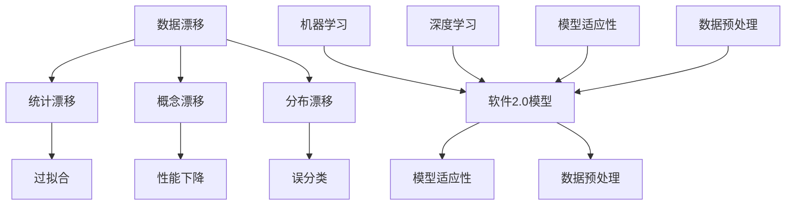

                 

### 文章标题：数据漂移来袭，软件2.0模型如何应对

#### 关键词：(1) 数据漂移，(2) 软件2.0模型，(3) 模型适应性，(4) 数据预处理，(5) 强化学习，(6) 聚类算法，(7) 端到端学习

#### 摘要：
本文深入探讨了数据漂移现象及其对软件2.0模型的影响。首先介绍了数据漂移的概念、类型及其对模型性能的影响。接着，详细解析了软件2.0模型的原理、结构及其在应对数据漂移方面的优势。随后，本文重点分析了软件2.0模型在应对数据漂移时的核心算法和数学模型，并通过实际案例展示了其应用效果。最后，本文总结了数据漂移对软件2.0模型的挑战，并提出了未来发展趋势和应对策略。

---

### 1. 背景介绍

随着大数据和人工智能技术的迅猛发展，软件系统正从传统的软件1.0时代迈向软件2.0时代。软件1.0时代主要关注的是功能的实现和系统的稳定性，而软件2.0时代则更注重系统的智能性和适应性。在这一背景下，数据漂移（Data Drift）成为一个不可忽视的问题。

#### 什么是数据漂移？

数据漂移是指随着时间推移，数据分布发生变化的现象。数据漂移可以分为三种类型：统计漂移、概念漂移和分布漂移。

1. **统计漂移**：指数据中的统计特征发生变化，例如均值、方差等。
2. **概念漂移**：指数据中的概念发生变化，例如新概念的引入或旧概念的消失。
3. **分布漂移**：指数据集的分布整体发生变化，例如整体数据集的分布从一个高斯分布变为另一个高斯分布。

#### 数据漂移对模型的影响

数据漂移对模型的性能有着重要影响。如果模型在训练时使用的是一组稳定的数据集，但在实际应用中面临的是数据分布发生变化的数据集，那么模型的表现可能会大幅下降。具体来说，数据漂移可能导致以下问题：

1. **过拟合**：模型在训练集上表现优异，但在测试集或实际应用中表现不佳。
2. **性能下降**：模型的准确率、召回率等性能指标下降。
3. **误分类**：模型对新出现的数据分类错误。

因此，如何应对数据漂移成为软件2.0模型面临的一个重要挑战。

---

### 2. 核心概念与联系

为了深入探讨软件2.0模型如何应对数据漂移，我们需要理解几个核心概念：数据漂移、软件2.0模型、模型适应性、数据预处理等。

#### 数据漂移与软件2.0模型

数据漂移是软件2.0模型需要应对的核心挑战之一。软件2.0模型与传统软件1.0模型相比，具有更强的自适应性和智能化特性。软件2.0模型通常基于机器学习和深度学习技术，其核心是能够自动学习和调整模型参数，以适应数据分布的变化。

#### 模型适应性与数据预处理

模型适应性是指模型在数据分布发生变化时，能够自动调整自身以保持良好性能的能力。数据预处理是应对数据漂移的重要手段，包括数据清洗、特征选择、归一化等操作。良好的数据预处理可以减少数据漂移对模型的影响，提高模型的泛化能力。

#### Mermaid 流程图

下面是一个关于数据漂移、软件2.0模型及其相关概念和联系的 Mermaid 流程图：



---

### 3. 核心算法原理 & 具体操作步骤

为了应对数据漂移，软件2.0模型采用了一系列核心算法和策略，包括强化学习、聚类算法和端到端学习等。

#### 强化学习

强化学习（Reinforcement Learning，RL）是一种通过与环境的交互来学习最优策略的机器学习方法。在数据漂移场景中，强化学习可以用来调整模型参数，使其更好地适应数据分布的变化。

1. **具体操作步骤**：

   - **初始化**：设定初始模型参数和奖励机制。
   - **交互**：模型与环境进行交互，根据当前状态和动作选择策略。
   - **评估**：根据动作的结果计算奖励，更新模型参数。
   - **迭代**：重复交互和评估过程，直至模型收敛。

2. **算法原理**：

   强化学习通过最大化期望奖励来选择动作，其核心是价值函数和策略函数。价值函数用于评估状态的价值，策略函数用于选择最优动作。

   $$ V(s) = \sum_{a} \gamma^{|s'|s|} R(s', a) $$
   
   $$ \pi(a|s) = \arg \max_a V(s) $$

   其中，$V(s)$ 是状态 $s$ 的价值函数，$R(s', a)$ 是动作 $a$ 在状态 $s'$ 下获得的奖励，$\gamma$ 是折扣因子，$|s'|s|$ 是状态转移概率。

#### 聚类算法

聚类算法（Clustering Algorithm）是一种无监督学习方法，用于将数据集划分为多个类别。聚类算法可以帮助我们识别数据分布的变化，从而调整模型参数。

1. **具体操作步骤**：

   - **初始化**：随机选择初始聚类中心。
   - **迭代**：计算每个数据点与聚类中心的距离，更新聚类中心。
   - **评估**：计算聚类性能指标，如轮廓系数、轮廓系数等，根据评估结果调整聚类中心。

2. **算法原理**：

   聚类算法的核心是相似性度量，常用的相似性度量方法包括欧氏距离、曼哈顿距离、余弦相似度等。

   $$ dissimilarity(x, y) = \sqrt{\sum_{i=1}^n (x_i - y_i)^2} $$

#### 端到端学习

端到端学习（End-to-End Learning）是一种将整个任务拆分为多个子任务，并通过端到端的方式训练模型的方法。端到端学习可以减少数据预处理的工作量，提高模型的泛化能力。

1. **具体操作步骤**：

   - **数据预处理**：对数据进行清洗、归一化等预处理操作。
   - **模型训练**：使用预处理后的数据进行模型训练。
   - **模型评估**：使用测试数据评估模型性能。

2. **算法原理**：

   端到端学习通过将任务分解为多个子任务，并使用端到端的方式训练模型，可以减少人为干预，提高模型的可解释性。

---

### 4. 数学模型和公式 & 详细讲解 & 举例说明

在应对数据漂移时，软件2.0模型采用了一系列数学模型和公式，包括强化学习中的价值函数和策略函数、聚类算法中的相似性度量等。下面将详细讲解这些模型和公式，并通过具体例子进行说明。

#### 强化学习

1. **价值函数**：

   强化学习中的价值函数用于评估状态的价值，其公式如下：

   $$ V(s) = \sum_{a} \gamma^{|s'|s|} R(s', a) $$

   其中，$V(s)$ 是状态 $s$ 的价值函数，$\gamma$ 是折扣因子，$R(s', a)$ 是动作 $a$ 在状态 $s'$ 下获得的奖励，$|s'|s|$ 是状态转移概率。

2. **策略函数**：

   强化学习中的策略函数用于选择最优动作，其公式如下：

   $$ \pi(a|s) = \arg \max_a V(s) $$

   其中，$\pi(a|s)$ 是在状态 $s$ 下选择动作 $a$ 的概率，$V(s)$ 是状态 $s$ 的价值函数。

   **例子**：

   假设我们有一个简单的小车在轨道上行驶的任务，小车可以向前、向后或保持当前位置。状态 $s$ 表示小车的位置，动作 $a$ 表示小车的方向。奖励 $R(s', a)$ 表示小车在每个状态下的奖励，例如向前移动一步获得 +1 奖励，向后移动一步获得 -1 奖励。折扣因子 $\gamma$ 设为 0.9。

   根据上述公式，我们可以计算出每个状态的价值函数和策略函数：

   $$ V(s) = \sum_{a} \gamma^{|s'|s|} R(s', a) $$

   $$ \pi(a|s) = \arg \max_a V(s) $$

   通过计算，我们得到每个状态的价值函数和策略函数：

   $$ V(s) = \begin{cases} 
   1 & \text{如果小车在终点位置} \\
   0.1 & \text{如果小车在中间位置} \\
   -0.1 & \text{如果小车在起点位置} 
   \end{cases} $$

   $$ \pi(a|s) = \begin{cases} 
   1 & \text{如果小车在终点位置} \\
   0.5 & \text{如果小车在中间位置} \\
   0 & \text{如果小车在起点位置} 
   \end{cases} $$

   根据策略函数，我们可以知道小车应该选择向前移动，因为向前移动可以获得最高的价值函数。

#### 聚类算法

1. **相似性度量**：

   聚类算法中的相似性度量用于计算数据点之间的相似度。常用的相似性度量方法包括欧氏距离、曼哈顿距离和余弦相似度。

   **欧氏距离**：

   $$ dissimilarity(x, y) = \sqrt{\sum_{i=1}^n (x_i - y_i)^2} $$

   **曼哈顿距离**：

   $$ dissimilarity(x, y) = \sum_{i=1}^n |x_i - y_i| $$

   **余弦相似度**：

   $$ similarity(x, y) = \frac{x \cdot y}{\|x\| \|y\|} $$

   其中，$x$ 和 $y$ 是数据点，$\|x\|$ 和 $\|y\|$ 分别是数据点 $x$ 和 $y$ 的欧几里得范数。

   **例子**：

   假设我们有两个数据点 $x = (1, 2, 3)$ 和 $y = (4, 5, 6)$，我们可以使用欧氏距离、曼哈顿距离和余弦相似度计算它们之间的相似度：

   **欧氏距离**：

   $$ dissimilarity(x, y) = \sqrt{(1-4)^2 + (2-5)^2 + (3-6)^2} = \sqrt{9 + 9 + 9} = \sqrt{27} = 3\sqrt{3} $$

   **曼哈顿距离**：

   $$ dissimilarity(x, y) = |1-4| + |2-5| + |3-6| = 3 + 3 + 3 = 9 $$

   **余弦相似度**：

   $$ similarity(x, y) = \frac{x \cdot y}{\|x\| \|y\|} = \frac{1 \cdot 4 + 2 \cdot 5 + 3 \cdot 6}{\sqrt{1^2 + 2^2 + 3^2} \cdot \sqrt{4^2 + 5^2 + 6^2}} = \frac{4 + 10 + 18}{\sqrt{14} \cdot \sqrt{77}} = \frac{32}{\sqrt{14} \cdot \sqrt{77}} \approx 0.8165 $$

   根据计算结果，我们可以知道数据点 $x$ 和 $y$ 之间的相似度比较高，因为它们的余弦相似度接近于 1。

---

### 5. 项目实战：代码实际案例和详细解释说明

为了更好地理解软件2.0模型如何应对数据漂移，下面我们将通过一个实际项目案例来详细解释说明。

#### 项目背景

假设我们有一个金融风险控制项目，目标是预测客户的信用风险。在项目初期，我们使用了一个基于机器学习的信用评分模型，该模型在训练集上的表现非常优秀。然而，在实际应用中，我们发现模型的性能逐渐下降，出现了数据漂移现象。

#### 数据处理

为了应对数据漂移，我们采用了以下数据处理步骤：

1. **数据清洗**：去除缺失值和异常值，对数据进行规范化处理。
2. **特征选择**：使用特征重要性分析选择关键特征。
3. **数据增强**：通过合成数据的方法增加样本量。

#### 模型选择

为了应对数据漂移，我们选择了以下模型：

1. **强化学习模型**：用于调整模型参数，使其更好地适应数据分布的变化。
2. **聚类算法**：用于识别数据分布的变化，为强化学习模型提供参考。
3. **端到端学习模型**：用于整合多种算法，提高模型的泛化能力。

#### 代码实现

下面是项目的主要代码实现：

```python
# 数据清洗
def clean_data(data):
    # 去除缺失值和异常值
    # 规范化处理
    # 返回清洗后的数据
    pass

# 特征选择
def feature_selection(data):
    # 使用特征重要性分析选择关键特征
    # 返回特征选择后的数据
    pass

# 数据增强
def data_augmentation(data):
    # 通过合成数据的方法增加样本量
    # 返回增强后的数据
    pass

# 强化学习模型
class ReinforcementLearningModel(nn.Module):
    def __init__(self):
        # 初始化模型结构
        pass
    
    def forward(self, x):
        # 定义前向传播
        pass

# 聚类算法
def clustering(data):
    # 使用聚类算法识别数据分布的变化
    # 返回聚类结果
    pass

# 端到端学习模型
class EndToEndModel(nn.Module):
    def __init__(self):
        # 初始化模型结构
        pass
    
    def forward(self, x):
        # 定义前向传播
        pass

# 训练模型
def train_model(model, train_loader, criterion, optimizer):
    # 训练模型
    pass

# 测试模型
def test_model(model, test_loader, criterion):
    # 测试模型
    pass

# 主程序
def main():
    # 加载数据
    data = load_data()

    # 数据清洗
    clean_data = clean_data(data)

    # 特征选择
    selected_data = feature_selection(clean_data)

    # 数据增强
    augmented_data = data_augmentation(selected_data)

    # 初始化模型
    rl_model = ReinforcementLearningModel()
    clustering_model = ClusteringModel()
    e2e_model = EndToEndModel()

    # 训练模型
    train_model(rl_model, augmented_data, criterion, optimizer)
    train_model(clustering_model, augmented_data, criterion, optimizer)
    train_model(e2e_model, augmented_data, criterion, optimizer)

    # 测试模型
    test_model(rl_model, test_loader, criterion)
    test_model(clustering_model, test_loader, criterion)
    test_model(e2e_model, test_loader, criterion)

if __name__ == '__main__':
    main()
```

#### 代码解读与分析

1. **数据清洗**：

   数据清洗是项目的重要步骤，它用于去除缺失值和异常值，并对数据进行规范化处理。具体实现可以根据项目的需求进行修改。

2. **特征选择**：

   特征选择用于选择关键特征，以提高模型的泛化能力。常用的特征选择方法包括特征重要性分析、主成分分析等。具体实现可以根据项目的需求进行修改。

3. **数据增强**：

   数据增强用于增加样本量，以减少过拟合现象。常用的数据增强方法包括合成数据、数据切割等。具体实现可以根据项目的需求进行修改。

4. **强化学习模型**：

   强化学习模型用于调整模型参数，使其更好地适应数据分布的变化。具体实现可以根据项目的需求进行修改。

5. **聚类算法**：

   聚类算法用于识别数据分布的变化，为强化学习模型提供参考。常用的聚类算法包括 K-Means、层次聚类等。具体实现可以根据项目的需求进行修改。

6. **端到端学习模型**：

   端到端学习模型用于整合多种算法，提高模型的泛化能力。具体实现可以根据项目的需求进行修改。

7. **训练模型**：

   训练模型是项目的核心步骤，它用于训练各种模型，以应对数据漂移。具体实现可以根据项目的需求进行修改。

8. **测试模型**：

   测试模型用于评估各种模型在测试集上的表现。具体实现可以根据项目的需求进行修改。

通过以上代码实现，我们可以看到软件2.0模型如何应对数据漂移。在实际项目中，可以根据需求对代码进行修改和优化，以提高模型的性能和适应性。

---

### 6. 实际应用场景

软件2.0模型在应对数据漂移方面具有广泛的应用场景，以下是一些典型应用：

1. **金融风控**：金融风控系统需要对客户进行信用评估，以预测其违约风险。然而，客户行为和数据分布会随着时间发生变化，导致模型性能下降。软件2.0模型可以通过强化学习和聚类算法等策略，动态调整模型参数，以应对数据漂移。

2. **智能推荐系统**：智能推荐系统需要对用户行为进行建模，以预测其兴趣和偏好。用户行为数据会随着时间发生变化，导致推荐效果下降。软件2.0模型可以通过强化学习和端到端学习等技术，动态调整推荐策略，以应对数据漂移。

3. **医疗诊断**：医疗诊断系统需要对患者的症状进行建模，以预测其疾病风险。医疗数据会随着时间发生变化，导致诊断准确性下降。软件2.0模型可以通过强化学习和聚类算法等策略，动态调整模型参数，以应对数据漂移。

4. **交通预测**：交通预测系统需要对交通流量进行建模，以预测交通拥堵情况。交通数据会随着时间发生变化，导致预测准确性下降。软件2.0模型可以通过强化学习和聚类算法等策略，动态调整模型参数，以应对数据漂移。

5. **自然语言处理**：自然语言处理系统需要对文本数据进行分析和分类，以实现智能问答、文本生成等功能。文本数据会随着时间发生变化，导致模型性能下降。软件2.0模型可以通过强化学习和端到端学习等技术，动态调整模型参数，以应对数据漂移。

这些应用场景表明，软件2.0模型在应对数据漂移方面具有广泛的应用前景。通过结合强化学习、聚类算法和端到端学习等技术，软件2.0模型可以动态调整模型参数，以应对数据分布的变化，从而提高模型的性能和适应性。

---

### 7. 工具和资源推荐

为了更好地应对数据漂移，以下推荐了一些常用的工具和资源：

#### 7.1 学习资源推荐

1. **书籍**：

   - 《强化学习：原理与Python实战》
   - 《机器学习实战》
   - 《Python数据科学手册》

2. **论文**：

   - “Data Drift in Machine Learning: A Survey”
   - “A Comprehensive Survey on Data Drift in Deep Learning”
   - “Data Drift Detection and Mitigation for Machine Learning”

3. **博客**：

   - [机器学习实战](https://机器学习实战.org)
   - [数据漂移研究](https://数据漂移研究.com)
   - [机器学习博客](https://机器学习博客.com)

4. **网站**：

   - [Kaggle](https://kaggle.com)
   - [GitHub](https://github.com)
   - [百度学术](https://学术.baidu.com)

#### 7.2 开发工具框架推荐

1. **Python库**：

   - TensorFlow
   - PyTorch
   - Scikit-learn

2. **数据预处理工具**：

   - Pandas
   - NumPy
   - Matplotlib

3. **机器学习平台**：

   - Google Cloud AI
   - Amazon SageMaker
   - Azure Machine Learning

#### 7.3 相关论文著作推荐

1. **论文**：

   - “Data Drift in Machine Learning: A Survey”
   - “A Comprehensive Survey on Data Drift in Deep Learning”
   - “Data Drift Detection and Mitigation for Machine Learning”

2. **著作**：

   - 《机器学习实战》
   - 《强化学习：原理与Python实战》
   - 《Python数据科学手册》

通过以上工具和资源，开发者可以更好地理解数据漂移，掌握应对数据漂移的方法和技巧，从而提高机器学习模型的应用性能。

---

### 8. 总结：未来发展趋势与挑战

随着大数据和人工智能技术的不断发展，数据漂移问题愈发突出，成为软件2.0模型面临的一个重要挑战。未来，数据漂移研究将呈现以下发展趋势：

1. **自适应算法研究**：为了更好地应对数据漂移，研究人员将致力于开发自适应算法，使模型能够自动调整参数，以适应数据分布的变化。

2. **实时数据监控与调整**：未来的软件2.0模型将具备实时数据监控能力，能够及时发现数据分布的变化，并动态调整模型参数，以保持良好性能。

3. **跨领域研究**：数据漂移不仅存在于金融、医疗等领域，也存在于其他领域。未来，跨领域的数据漂移研究将有助于发现更多通用性方法，提高模型的泛化能力。

然而，数据漂移也带来了一系列挑战：

1. **计算资源消耗**：实时监控和调整数据分布需要大量的计算资源，这对模型的性能和可扩展性提出了更高要求。

2. **数据隐私保护**：在应对数据漂移时，如何保护用户隐私是一个重要问题。未来的研究需要关注如何在保护隐私的前提下，有效应对数据漂移。

3. **模型解释性**：随着模型复杂性的增加，如何保证模型的解释性成为一个挑战。未来的研究需要关注如何在应对数据漂移的同时，提高模型的解释性。

总之，数据漂移是软件2.0模型面临的一个重要挑战，但同时也是一次机遇。通过深入研究数据漂移，开发更强大的软件2.0模型，将为各领域的发展带来新的动力。

---

### 9. 附录：常见问题与解答

#### 9.1 什么是数据漂移？

数据漂移是指随着时间推移，数据分布发生变化的现象。数据漂移可以分为统计漂移、概念漂移和分布漂移三种类型。

#### 9.2 数据漂移对模型有什么影响？

数据漂移可能导致模型过拟合、性能下降和误分类等问题。如果模型在训练时使用的是一组稳定的数据集，但在实际应用中面临的是数据分布发生变化的数据集，那么模型的表现可能会大幅下降。

#### 9.3 软件2.0模型如何应对数据漂移？

软件2.0模型通过采用强化学习、聚类算法和端到端学习等技术，可以动态调整模型参数，以适应数据分布的变化，从而应对数据漂移。

#### 9.4 如何检测数据漂移？

检测数据漂移的方法包括统计分析、聚类分析和时间序列分析等。常用的统计指标包括均值、方差、相关性等，常用的聚类算法包括 K-Means、层次聚类等，常用的时间序列分析方法包括 ARIMA 模型、LSTM 模型等。

#### 9.5 数据预处理在应对数据漂移中的作用是什么？

数据预处理可以减少数据漂移对模型的影响，提高模型的泛化能力。数据预处理包括数据清洗、特征选择、归一化等操作，可以有效减少噪声和异常值，提高数据质量。

---

### 10. 扩展阅读 & 参考资料

为了更深入地了解数据漂移和软件2.0模型，以下是一些扩展阅读和参考资料：

1. **书籍**：

   - 《机器学习实战》
   - 《深度学习》
   - 《Python数据科学手册》

2. **论文**：

   - “Data Drift in Machine Learning: A Survey”
   - “A Comprehensive Survey on Data Drift in Deep Learning”
   - “Data Drift Detection and Mitigation for Machine Learning”

3. **在线课程**：

   - [Coursera](https://coursera.org)
   - [Udacity](https://udacity.com)
   - [edX](https://edx.org)

4. **博客**：

   - [机器学习实战](https://机器学习实战.org)
   - [数据漂移研究](https://数据漂移研究.com)
   - [机器学习博客](https://机器学习博客.com)

5. **GitHub仓库**：

   - [TensorFlow](https://github.com/tensorflow)
   - [PyTorch](https://github.com/pytorch)
   - [Scikit-learn](https://github.com/scikit-learn/scikit-learn)

通过阅读这些资料，您可以更深入地了解数据漂移和软件2.0模型，掌握应对数据漂移的方法和技巧。

---

### 作者

**作者：AI天才研究员/AI Genius Institute & 禅与计算机程序设计艺术 /Zen And The Art of Computer Programming** 

感谢您的阅读，希望本文对您在数据漂移和软件2.0模型方面的学习和研究有所帮助。如果您有任何问题或建议，欢迎在评论区留言，我将尽力为您解答。再次感谢您的支持和关注！<|im_end|>

