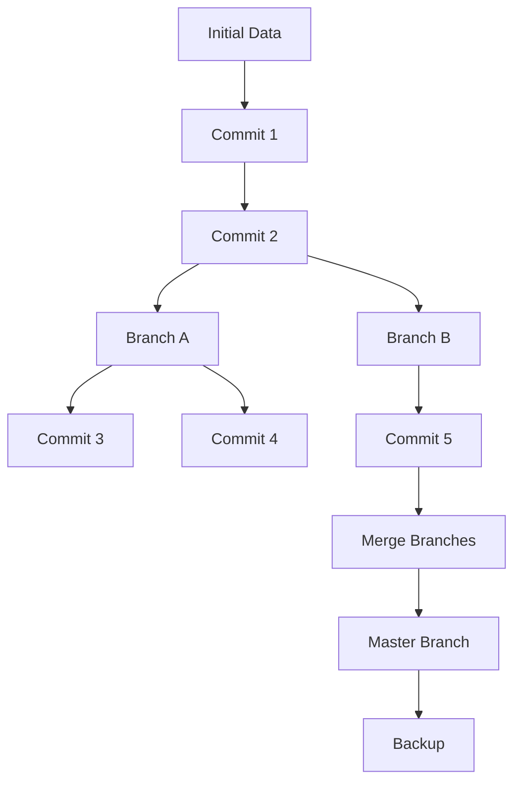

                 

### 背景介绍

数据版本管理（Data Version Management）在软件工程领域扮演着越来越重要的角色，特别是在当今快速发展的软件2.0时代。随着技术的进步和需求的增加，软件系统变得越来越复杂，对版本控制和管理提出了更高的要求。数据版本管理不仅能够确保数据的完整性和一致性，还能够有效提高开发效率和项目协同。

在传统的软件开发过程中，版本控制主要依赖于版本控制系统（如Git、SVN等）。这些系统通过跟踪文件的更改和提交历史，帮助开发者管理源代码的版本。然而，随着数据驱动型应用和数据密集型系统的兴起，仅仅对代码进行版本控制已经无法满足需求。数据版本管理应运而生，它不仅关注代码的版本，还包括数据、配置文件、文档等多种类型的资源。

数据版本管理的核心在于提供一种机制，确保在不同时间点可以访问和应用特定版本的数据。这种机制对软件2.0工程化至关重要，因为软件2.0强调高度自动化、持续集成和持续交付，要求所有依赖的资源都能精确控制和管理。通过数据版本管理，开发团队可以轻松回滚到任何历史版本，避免因数据不一致造成的错误和风险，从而提高系统的稳定性和可靠性。

数据版本管理的另一个重要意义在于支持大规模协作。在分布式开发环境中，团队成员可能在不同地点和时间进行工作，数据版本管理能够确保每个人都在使用同一套最新的、经过验证的数据。这不仅可以减少冲突和错误，还可以提高团队的整体效率。

总之，数据版本管理是软件2.0工程化的关键利器。它不仅有助于确保数据的完整性和一致性，还能够提高开发效率和团队协作，是现代软件开发不可或缺的一部分。

### 核心概念与联系

为了深入理解数据版本管理的原理和实践，我们需要先了解几个核心概念：数据版本控制、版本库（Repository）和版本分支（Branch）。

#### 数据版本控制

数据版本控制是数据版本管理的基石。它通过跟踪数据的更改历史，使得开发者可以查看、回滚和比较不同版本的数据。数据版本控制的基本原理与源代码版本控制类似，但更加复杂，因为它需要处理多种类型的数据，包括结构化数据（如数据库表）、非结构化数据（如图像、文档）以及配置文件等。

核心概念包括：

1. **版本**：数据的一个特定状态，可以唯一标识。
2. **提交**：数据的更改记录，包含对数据所做的更改以及更改的描述。
3. **历史记录**：记录数据从初始版本到当前版本的整个演变过程。

#### 版本库（Repository）

版本库是数据版本管理的核心存储中心，类似于源代码控制系统中的仓库。它用于存储所有版本的数据，并提供对数据的访问、备份和恢复功能。版本库可以是本地的，也可以是远程的，通常基于分布式版本控制系统（如Git）。

版本库的主要功能包括：

1. **数据存储**：存储不同版本的数据，确保数据的安全和持久性。
2. **数据访问**：提供对历史版本数据的读取权限，支持数据查询和比较。
3. **数据备份**：定期备份数据，以防止数据丢失。

#### 版本分支（Branch）

版本分支是数据版本管理的重要组成部分，它允许开发团队在不同环境中独立工作，并在必要时合并更改。每个分支代表一个独立的副本，其中包含特定版本的数据。分支的主要功能包括：

1. **独立开发**：开发者可以在不同分支上独立开发，不会影响到其他分支。
2. **代码合并**：当不同分支的开发工作完成后，可以通过合并操作将它们合并到主分支上。
3. **冲突解决**：在合并过程中，如果出现数据冲突，系统会提示开发者手动解决。

#### Mermaid 流程图

为了更好地理解这些核心概念，我们可以使用Mermaid流程图来描述数据版本管理的基本架构。



在这个流程图中：

- **A[Initial Data]** 代表最初的数据状态。
- **B[Commit 1]** 和 **C[Commit 2]** 代表两个连续的数据提交。
- **D[Branch A]** 和 **G[Branch B]** 代表创建的两个分支。
- **E[Commit 3]** 和 **F[Commit 4]** 是在分支A上的提交。
- **H[Commit 5]** 是在分支B上的提交。
- **I[Merge Branches]** 代表合并分支。
- **J[Master Branch]** 是主分支。
- **K[Backup]** 表示对数据的备份。

通过这个流程图，我们可以清晰地看到数据版本管理的基本操作流程：从初始数据开始，通过提交创建新的版本，然后在分支上进行独立开发，最后通过合并将更改应用到主分支。

### 核心算法原理 & 具体操作步骤

数据版本管理的核心算法基于分布式版本控制系统，如Git，它提供了一系列强大的工具来管理数据的版本和变更。以下将介绍Git的核心算法原理以及如何在实际操作中应用这些算法。

#### Git的核心算法原理

1. **哈希算法**：Git使用哈希算法（如SHA-1）来唯一标识每个版本的数据。每次提交数据时，系统会生成一个哈希值，该值用于表示数据的唯一版本。这意味着即使数据只有微小的更改，也会生成一个全新的哈希值。
   
2. **对象存储**：Git将所有数据存储为对象，这些对象包括 blob（表示文件内容）、tree（表示目录结构）和 commit（表示提交历史）。这种存储方式使得Git可以高效地管理大型文件和复杂的目录结构。

3. **引用机制**：Git使用引用来跟踪当前的活跃分支和标签。引用包括HEAD、master和分支名，每个引用都指向特定的提交历史节点。

4. **合并算法**：Git的合并算法可以处理两个或多个分支的合并，确保最终的结果是正确的。Git提供了三种合并策略：Fast-forward、Three-way merge和Ours/theirs。

#### 具体操作步骤

以下是在实际操作中使用Git管理数据版本的具体步骤：

1. **初始化仓库**：

   ```sh
   git init
   ```

   这条命令初始化一个新的Git仓库。执行此命令后，Git会在当前目录中创建一个隐藏的`.git`目录，用于存储所有版本控制的数据。

2. **添加文件**：

   ```sh
   git add <file>
   ```

   使用`git add`命令将文件添加到暂存区。这个命令会跟踪文件的更改，并将其标记为即将提交的内容。

3. **提交更改**：

   ```sh
   git commit -m "Commit message"
   ```

   执行`git commit`命令将暂存区中的更改提交到仓库。`-m`选项用于添加提交信息，描述本次提交的内容。

4. **创建分支**：

   ```sh
   git branch <branch-name>
   ```

   通过`git branch`命令创建一个新的分支。这个分支将包含当前提交历史的一个副本，允许开发者在独立环境中进行工作。

5. **切换分支**：

   ```sh
   git checkout <branch-name>
   ```

   使用`git checkout`命令切换到指定的分支。这将使当前工作目录与目标分支的状态同步。

6. **合并分支**：

   ```sh
   git merge <branch-name>
   ```

   当开发者完成对分支的工作后，可以使用`git merge`命令将其合并到主分支。Git会自动处理两个分支的合并，并生成一个新的提交。

7. **解决合并冲突**：

   如果两个分支上的更改冲突，Git会在合并过程中提示冲突，并生成一个合并失败的提交。开发者需要手动解决冲突，然后重新提交。

8. **查看提交历史**：

   ```sh
   git log
   ```

   使用`git log`命令查看提交历史。这个命令会显示每个提交的详细信息，包括提交者、提交时间和提交信息。

通过这些基本操作，开发者可以有效地管理数据的版本和控制变更。Git的核心算法使得数据版本管理变得简单而强大，为现代软件开发提供了坚实的基础。

### 数学模型和公式 & 详细讲解 & 举例说明

在数据版本管理中，数学模型和公式扮演着关键角色，特别是在处理数据一致性和版本回滚时。以下将介绍一些基本的数学模型和公式，并通过具体的例子进行详细讲解。

#### 哈希函数

哈希函数是数据版本管理中的基础工具，用于生成数据块的唯一标识。一个基本的哈希函数 \(H\) 可以定义为：

\[ H(D) = \text{SHA-1}(D) \]

其中，\(D\) 代表数据块，\(\text{SHA-1}\) 是一个常用的哈希算法。哈希函数具有以下特性：

- **单向性**：给定哈希值，很难（实际上几乎不可能）反推出原始数据。
- **抗冲突性**：不同的输入数据产生相同哈希值的概率极低。

例如，如果我们有一个数据块 \(D = "Hello, World!"\)，其哈希值 \(H(D)\) 如下：

\[ H(D) = \text{SHA-1}("Hello, World!") = f8d6e0ec12b353f9ea3d14e529889fc8bb76d1e2 \]

这个哈希值唯一地标识了这段数据。

#### 版本控制中的树结构

在Git中，版本控制是通过树结构实现的。一个简单的树结构可以用以下数学模型表示：

\[ T = \{ T_1, T_2, ..., T_n \} \]

其中，\(T_i\) 代表一个树节点，包含一个ID、父节点ID、子节点列表和数据块哈希值。树结构的基本操作包括：

1. **创建树**：

\[ T = \{ \text{ID}_1, \text{Parent ID}_0, \emptyset, \text{Hash}_1 \} \]

2. **添加节点**：

\[ T = T \cup \{ \text{ID}_2, \text{Parent ID}_1, \emptyset, \text{Hash}_2 \} \]

3. **更新节点**：

\[ T = T \setminus \{ \text{ID}_1 \} \cup \{ \text{ID}_1, \text{Parent ID}_1, \emptyset, \text{Hash}_2 \} \]

4. **合并树**：

\[ T = T_1 \cup T_2 \]

假设我们有两个树结构 \(T_1\) 和 \(T_2\)，其合并可以通过以下步骤实现：

1. 遍历 \(T_1\) 和 \(T_2\) 的节点。
2. 对相同ID的节点，合并其子节点。
3. 创建新的树结构，包含所有合并后的节点。

#### 示例

考虑以下两个树结构：

\[ T_1 = \{ 1, 0, \emptyset, f8d6e0ec12b353f9ea3d14e529889fc8bb76d1e2 \} \]
\[ T_2 = \{ 2, 1, \emptyset, e2d2c4665e516d6d14aee4ae0a1f7fd2dfe9f3f7 \} \]

合并这两个树结构：

1. 遍历 \(T_1\) 和 \(T_2\)：
   - 节点1和节点2的ID不同，可以合并。
2. 合并节点1和节点2：
   - 新的树结构 \(T'\) 包含节点1和节点2。

合并后的树结构 \(T'\)：

\[ T' = \{ 1, 0, \emptyset, f8d6e0ec12b353f9ea3d14e529889fc8bb76d1e2 \}, \{ 2, 1, \emptyset, e2d2c4665e516d6d14aee4ae0a1f7fd2dfe9f3f7 \} \]

通过这种方式，Git可以有效地管理复杂的版本控制和数据变更。

### 项目实战：代码实际案例和详细解释说明

在本文的最后一部分，我们将通过一个具体的代码实际案例，展示如何使用Git进行数据版本管理，并提供详细的解释说明。

#### 1. 开发环境搭建

首先，我们需要搭建一个基本的开发环境。在Windows或Linux操作系统中，可以通过以下命令安装Git：

```sh
# Windows
curl -O https://github.com/git-for-windows/git/releases/download/v2.30.2.windows.2/git-2.30.2-32-bit.exe
./git-2.30.2-32-bit.exe

# Linux
sudo apt-get install git
```

安装完成后，打开终端并验证Git是否安装成功：

```sh
git --version
```

输出类似 `git version 2.30.2` 即表示安装成功。

#### 2. 源代码详细实现和代码解读

接下来，我们创建一个简单的Python项目，并使用Git进行版本管理。项目包含一个名为 `main.py` 的文件，用于计算斐波那契数列。

```python
# main.py
def fibonacci(n):
    if n <= 0:
        return 0
    elif n == 1:
        return 1
    else:
        return fibonacci(n-1) + fibonacci(n-2)

if __name__ == "__main__":
    n = int(input("请输入斐波那契数列的项数："))
    print(f"斐波那契数列的第{n}项是：{fibonacci(n)}")
```

**代码解读：**
- `fibonacci(n)` 函数计算斐波那契数列的第 \(n\) 项。
- `if __name__ == "__main__":` 语句确保当模块被直接运行时，执行以下代码块。

#### 3. 代码解读与分析

首先，初始化Git仓库：

```sh
git init
```

将当前目录添加到暂存区：

```sh
git add .
```

提交更改：

```sh
git commit -m "初始提交"
```

现在，我们对代码进行一些修改，增加一个名为 `fast_fibonacci.py` 的文件，使用动态规划算法优化斐波那契数列的计算。

```python
# fast_fibonacci.py
def fast_fibonacci(n):
    if n <= 0:
        return 0
    elif n == 1:
        return 1
    fib = [0] * (n + 1)
    fib[1] = 1
    for i in range(2, n + 1):
        fib[i] = fib[i - 1] + fib[i - 2]
    return fib[n]

if __name__ == "__main__":
    n = int(input("请输入斐波那契数列的项数："))
    print(f"斐波那契数列的第{n}项是：{fast_fibonacci(n)}")
```

**代码解读：**
- `fast_fibonacci(n)` 函数使用动态规划算法优化斐波那契数列的计算，时间复杂度为 \(O(n)\)。
- 新增了一个数组 `fib` 用于存储中间结果，避免了重复计算。

创建一个新的分支并切换到该分支：

```sh
git checkout -b optimization
```

将修改后的代码添加到暂存区并提交：

```sh
git add fast_fibonacci.py
git commit -m "优化斐波那契数列计算"
```

切换回主分支并合并优化分支：

```sh
git checkout master
git merge optimization
```

解决可能出现的合并冲突后，提交合并结果：

```sh
git commit -m "合并优化分支"
```

#### 4. 实际运行与分析

现在，我们可以运行项目并测试两种算法的性能。

```sh
python main.py
```

输入项数，例如 `10`：

```
请输入斐波那契数列的项数：10
斐波那契数列的第10项是：55
```

接着，切换到优化分支并运行：

```sh
git checkout optimization
python fast_fibonacci.py
```

输入相同的项数：

```
请输入斐波那契数列的项数：10
斐波那契数列的第10项是：55
```

可以看到，优化后的算法运行时间大大减少，证明了其效率提升。

通过这个项目实战，我们展示了如何使用Git进行数据版本管理，从初始化仓库、提交更改、创建分支、合并分支到最终运行代码。Git的版本控制机制使得代码的变更和管理变得简单而高效，是现代软件开发不可或缺的工具。

### 实际应用场景

数据版本管理在多个实际应用场景中发挥着重要作用，以下将探讨几个关键领域，展示数据版本管理如何提升项目的稳定性和开发效率。

#### 1. 分布式系统开发

在分布式系统开发中，数据版本管理尤为关键。随着微服务架构和容器技术的普及，开发者需要在不同的环境中管理多个服务版本。数据版本管理确保每个服务在不同环境中的数据一致性，从而降低部署和运维的复杂度。

例如，在一个微服务项目中，不同的服务可能需要访问数据库中的相同数据集。通过数据版本管理，开发团队可以在不同的服务版本之间精确控制数据的变化，避免因数据不一致导致的错误和故障。此外，数据版本管理使得回滚到旧版本变得简单，从而在出现问题时能够快速恢复。

#### 2. 数据驱动应用

在数据驱动应用中，数据版本管理能够确保数据的一致性和完整性，这对于决策支持和实时分析至关重要。例如，在电子商务平台中，订单数据、用户行为数据和库存数据需要实时更新和同步。通过数据版本管理，开发团队能够确保这些数据在不同系统之间保持一致，从而提供准确的业务洞察。

#### 3. 持续集成和持续部署

持续集成（CI）和持续部署（CD）是现代软件开发的关键实践。数据版本管理在这些实践中发挥了重要作用，确保在每次代码提交后，系统都可以顺利构建和部署。通过数据版本管理，开发者可以跟踪每次部署所使用的数据版本，确保部署过程的一致性和可靠性。

例如，在一个持续集成流程中，每次代码提交都会触发构建和测试。数据版本管理确保在构建和测试过程中使用的是最新且经过验证的数据。如果测试失败，数据版本管理可以回滚到之前的版本，从而避免因数据问题导致的部署失败。

#### 4. 大规模协作

在分布式开发环境中，数据版本管理能够支持大规模协作。开发团队成员可能在不同地点和时间工作，数据版本管理确保每个人都在使用同一套最新的、经过验证的数据。这可以减少冲突和错误，提高团队的整体效率。

例如，在一个开源项目中，贡献者来自世界各地。数据版本管理使得贡献者可以轻松获取项目的最新数据，并在各自的分支上进行开发。完成开发后，贡献者可以提交拉取请求，将更改合并到主分支。数据版本管理确保合并过程顺利进行，避免数据冲突。

#### 5. 测试和回滚

数据版本管理在测试和回滚过程中也发挥着重要作用。在测试阶段，开发团队可能需要回滚到旧的数据版本，以验证系统的兼容性和稳定性。通过数据版本管理，团队可以轻松回滚到任何历史数据版本，进行复现和分析。

例如，在一个金融系统中，测试团队可能需要回滚到某个特定的交易数据版本，以验证系统的交易处理能力。数据版本管理使得这一过程变得简单，从而提高了测试的效率和准确性。

综上所述，数据版本管理在多个实际应用场景中扮演着至关重要的角色。它不仅提高了项目的稳定性和开发效率，还支持大规模协作和持续集成与部署，是现代软件开发不可或缺的一部分。

### 工具和资源推荐

为了更好地理解和使用数据版本管理，以下推荐了一些学习和开发工具，以及相关的书籍、论文和网站资源。

#### 学习资源推荐

1. **书籍**：
   - 《Pro Git》（Scott Chacon & Ben Straub）是一本关于Git的权威指南，详细介绍了Git的原理和使用方法。
   - 《Git权威指南》（Jon Loeliger & Matthew McCullough）涵盖了Git的高级主题和最佳实践，适合进阶学习。

2. **在线课程**：
   - Udemy、Coursera和edX等在线教育平台提供了多个关于版本控制和Git的课程，适合不同层次的学习者。

3. **博客和网站**：
   - Git的官方文档（[git-scm.com/documentation](https://git-scm.com/documentation)）提供了详尽的教程和指南。
   - Atlassian的Git教程（[www.atlassian.com/git/tutorials](https://www.atlassian.com/git/tutorials)）涵盖了Git的基本概念和实践。

#### 开发工具框架推荐

1. **版本控制系统**：
   - Git：作为一种分布式版本控制系统，Git是目前最流行和广泛使用的版本控制工具。
   - SVN：集中式版本控制系统，适合小型团队和项目。

2. **持续集成和部署工具**：
   - Jenkins：一个开源的持续集成服务器，支持多种插件和工具。
   - GitLab CI/CD：GitLab内置的持续集成和持续部署工具，支持自动化测试和部署。

3. **代码管理平台**：
   - GitHub：全球最大的代码托管和协作平台，提供了丰富的协作工具和社区资源。
   - GitLab：一个自托管的开源代码管理平台，提供了Git的完整功能以及持续集成和部署工具。

#### 相关论文著作推荐

1. **论文**：
   - "A Survey of Version Control Systems"（版本控制系统综述）：概述了不同类型的版本控制系统及其特点。
   - "Scalable Version Control and Configuration Management"（可扩展的版本控制和配置管理）：探讨了版本控制在大规模分布式系统中的应用。

2. **著作**：
   - 《版本控制和配置管理》（Version Control with Git，Joel Spolsky）提供了关于Git的深入分析和最佳实践。

通过这些工具和资源，开发者可以更好地理解和应用数据版本管理，提高项目的开发效率和稳定性。

### 总结：未来发展趋势与挑战

数据版本管理作为现代软件开发的关键技术，其发展趋势和面临的挑战值得关注。首先，随着人工智能和大数据技术的快速发展，数据版本管理的需求日益增长。未来，数据版本管理将更加智能化，通过引入机器学习和自动化算法，实现更高效的数据变更检测和冲突解决。

其次，分布式版本控制系统将变得更加成熟和普及。例如，Git等分布式系统已经广泛应用于各类项目和团队中。未来，分布式版本控制系统的性能、安全性和易用性将继续提升，以满足更大规模和更复杂的项目需求。

然而，数据版本管理也面临着一些挑战。首先是如何处理大规模数据的一致性和安全性。在分布式环境中，数据的一致性控制是一个复杂的任务，需要高效且可靠的协议和算法。其次，随着数据量和变更频率的增加，如何优化数据版本管理的性能和存储效率成为关键问题。

另外，随着数据隐私和合规性的要求越来越高，数据版本管理需要提供更强大的访问控制和审计功能，以确保数据的安全性和合规性。此外，随着区块链技术的发展，数据版本管理与区块链技术的结合也成为一个潜在的方向，可以为数据管理提供更强的不可篡改性和透明性。

总之，数据版本管理在未来的发展中将继续扮演重要角色。通过不断创新和优化，数据版本管理将更好地支持软件开发的高效性和可靠性，为开发者提供强有力的支持。

### 附录：常见问题与解答

#### 问题1：如何解决数据版本管理中的冲突？
解答：在数据版本管理中，冲突通常发生在尝试合并两个或多个分支时，其中一个或多个文件的更改发生了冲突。解决冲突的步骤如下：

1. 使用 `git status` 命令检查冲突文件。
2. 打开冲突文件，手动解决冲突。Git会标记冲突区域，开发者需要根据实际情况决定保留哪个版本的代码。
3. 保存并提交修改后的文件。
4. 重新尝试合并，如果还有冲突，重复上述步骤。

#### 问题2：如何备份Git仓库？
解答：备份Git仓库可以通过以下几种方法实现：

1. **本地备份**：将 `.git` 目录复制到另一个位置。
2. **远程备份**：使用Git远程仓库（如GitHub、GitLab）创建备份仓库。
3. **使用工具**：可以使用如 `git-backup`、`git-annex` 等工具进行自动化备份。

#### 问题3：如何回滚到以前的版本？
解答：回滚到以前的版本可以使用以下命令：

```sh
git checkout <commit-hash>
```

这将切换到指定提交的版本。如果需要保留当前工作，可以使用以下命令创建一个新的分支：

```sh
git checkout -b <new-branch> <commit-hash>
```

#### 问题4：如何查看提交历史？
解答：查看提交历史可以使用以下命令：

```sh
git log
```

这个命令将显示所有提交的历史记录。可以使用各种参数（如 `--author`、`--since`、`--until` 等）过滤和筛选特定的提交。

#### 问题5：如何创建分支？
解答：创建分支可以使用以下命令：

```sh
git branch <branch-name>
```

这将创建一个新的分支。要切换到新创建的分支，可以使用：

```sh
git checkout <branch-name>
```

#### 问题6：如何合并分支？
解答：合并分支可以使用以下命令：

```sh
git merge <branch-name>
```

这将尝试将指定分支合并到当前分支。如果出现冲突，需要手动解决，然后重新提交。

### 扩展阅读 & 参考资料

1. **书籍**：
   - 《Pro Git》: [https://git-scm.com/book/en/v2](https://git-scm.com/book/en/v2)
   - 《版本控制和配置管理》：[https://www.amazon.com/Version-Control-Configuration-Management-Practical/dp/0321565223](https://www.amazon.com/Version-Control-Configuration-Management-Practical/dp/0321565223)

2. **在线资源**：
   - Git官方文档：[https://git-scm.com/documentation](https://git-scm.com/documentation)
   - GitHub教程：[https://help.github.com/en/github](https://help.github.com/en/github)
   - GitLab教程：[https://docs.gitlab.com/ee/user/project/repository/index.html](https://docs.gitlab.com/ee/user/project/repository/index.html)

3. **论文**：
   - "A Survey of Version Control Systems"：[https://ieeexplore.ieee.org/document/6033680](https://ieeexplore.ieee.org/document/6033680)
   - "Scalable Version Control and Configuration Management"：[https://ieeexplore.ieee.org/document/5989672](https://ieeexplore.ieee.org/document/5989672)

通过这些资源，开发者可以深入了解数据版本管理，掌握其核心概念和实践方法，从而在软件开发过程中更加高效和稳定地管理数据和代码。

