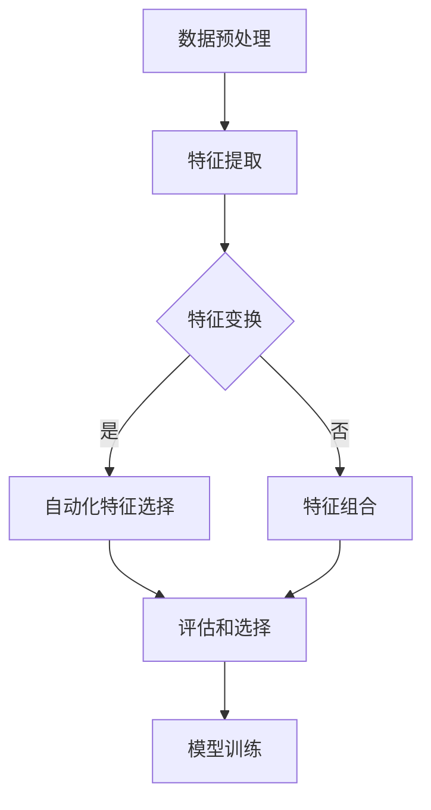

                 

### 背景介绍

随着人工智能的迅猛发展，深度学习模型在图像识别、自然语言处理、推荐系统等领域的应用越来越广泛。然而，这些模型的训练和预测过程中，数据集的质量和特征选择的优化直接关系到模型的性能和效率。因此，数据集优化，尤其是自动化特征选择，成为了一个备受关注的研究领域。

自动化特征选择旨在通过算法自动识别和筛选出对模型训练和预测最有价值的数据特征，从而降低数据维度，提高模型训练效率，增强模型的泛化能力。在传统的人工特征选择方法中，研究人员需要根据领域的知识和经验来选择特征，这既耗时又容易出错。而自动化特征选择通过算法的自动学习和筛选，可以更高效地处理大规模数据，提高模型的效果。

本文将围绕数据集优化和自动化特征选择展开讨论，首先介绍数据集优化的意义和现状，然后深入探讨自动化特征选择的算法原理、数学模型和具体操作步骤，接着通过实际项目案例进行代码实现和解读，最后讨论自动化特征选择的实际应用场景和未来发展趋势。

> Keywords: Data Optimization, Feature Selection, Machine Learning, Deep Learning, Automated Feature Engineering

> Abstract:  
This article discusses the significance and current status of data optimization and automated feature selection in machine learning and deep learning. We delve into the algorithms, mathematical models, and operational steps of automated feature selection. Furthermore, we provide a practical case study with code implementation and analysis. Finally, we explore the applications and future trends of automated feature selection in various real-world scenarios.

### 核心概念与联系

在深入探讨自动化特征选择之前，我们需要明确几个核心概念，它们之间有着密切的联系。

#### 特征选择（Feature Selection）

特征选择是指从原始特征集合中选取出对模型训练和预测最有价值的一部分特征。这个过程的目的是降低数据维度，减少计算复杂度，同时保持模型的效果。特征选择可以基于各种方法，包括过滤式（Filter Methods）、包裹式（Wrapper Methods）和嵌入式（Embedded Methods）。

- **过滤式特征选择**：这种方法先对原始特征进行评估，然后根据评估结果选择出最有价值的特征。常见的评估指标包括相关性、方差、信息增益等。过滤式特征选择不需要训练模型，因此速度快，适用于高维度数据。
  
- **包裹式特征选择**：这种方法通过训练模型来评估特征的重要性。然后根据模型评估结果来选择特征。常见的包裹式算法包括决策树、支持向量机（SVM）等。包裹式特征选择能够获得更好的特征选择效果，但计算成本较高。
  
- **嵌入式特征选择**：这种方法将特征选择过程融入到模型训练过程中，如LASSO回归、随机森林等。嵌入式特征选择在训练模型的同时完成特征选择，计算成本介于过滤式和包裹式之间。

#### 特征工程（Feature Engineering）

特征工程是数据预处理的重要环节，它通过构造新的特征或变换现有特征来增强模型的表现。特征工程的核心目的是提取数据中的有用信息，使其更适合模型训练。常见的特征工程方法包括特征提取、特征变换、特征组合等。

- **特征提取**：从原始数据中提取新的特征，如文本数据中的词频、主题模型等。
  
- **特征变换**：通过数学变换来增强特征的效果，如归一化、标准化、特征缩放等。

- **特征组合**：通过组合现有特征来生成新的特征，如交叉特征、嵌入特征等。

#### 自动化特征选择（Automated Feature Selection）

自动化特征选择是指利用算法自动识别和筛选出对模型训练和预测最有价值的数据特征。自动化特征选择的目的是提高特征选择的效率，减轻人类的工作负担，同时提升模型的效果。

自动化特征选择算法可以基于统计方法、机器学习方法、深度学习方法等。常见的自动化特征选择算法包括：

- ** ReliefF、InfoGain、GainRatio 等**：基于统计方法和信息论的特征选择算法。

- **LASSO、随机森林等**：基于机器学习方法的特征选择算法。

- **深度特征选择网络（Deep Feature Selection Networks）**：基于深度学习方法的特征选择算法。

下面，我们将使用Mermaid流程图来展示自动化特征选择的流程和关键步骤。



在这个流程图中，数据预处理包括特征提取、特征变换和特征组合。自动化特征选择通过算法自动筛选出最有价值的特征，然后进行评估和选择。最后，选择的特征用于模型训练，以提高模型的性能。

> Note: Mermaid 流程节点中不要有括号、逗号等特殊字符。

通过以上对核心概念的介绍和流程图的展示，我们对自动化特征选择有了初步的认识。接下来，我们将深入探讨自动化特征选择的算法原理、数学模型和具体操作步骤。

### 核心算法原理 & 具体操作步骤

自动化特征选择的核心在于如何高效地筛选出对模型训练和预测最有价值的特征。为了实现这一目标，我们可以采用多种算法，包括基于统计方法的算法、基于机器学习方法的算法以及基于深度学习方法的算法。以下将详细介绍几种常见的自动化特征选择算法及其具体操作步骤。

#### 基于统计方法的特征选择

基于统计方法的特征选择算法主要通过计算特征与目标变量之间的相关性或其他统计指标来评估特征的重要性。以下是一些常见的统计方法：

1. **信息增益（Information Gain）**

信息增益是一种基于信息论的特征选择方法，它通过计算特征对分类信息的增益来评估特征的重要性。具体步骤如下：

   - **计算特征的条件熵**：对于每个特征，计算它在给定目标变量条件下的熵。
   - **计算特征的总熵**：对于每个特征，计算它未给定目标变量时的熵。
   - **计算信息增益**：信息增益等于特征的总熵减去条件熵。

   公式表示为：

   $$IG(X, Y) = H(Y) - H(Y|X)$$

   其中，$H(Y)$ 是目标变量的熵，$H(Y|X)$ 是在给定特征 $X$ 的条件下目标变量的熵。

2. **增益率（Gain Ratio）**

增益率是信息增益的改进版，它考虑了特征的大小，通过除以特征的条件熵来平衡信息增益。公式表示为：

   $$GR(X, Y) = \frac{IG(X, Y)}{H(X|Y)}$$

3. **互信息（Mutual Information）**

互信息是一种更加通用的特征选择方法，它衡量了特征和目标变量之间的联合熵与各自熵的差值。互信息的公式表示为：

   $$MI(X, Y) = H(X) + H(Y) - H(X, Y)$$

   其中，$H(X)$ 和 $H(Y)$ 分别是特征和目标变量的熵，$H(X, Y)$ 是它们联合变量的熵。

具体操作步骤：

- **数据准备**：将原始数据集进行预处理，包括数据清洗、填充缺失值等。
- **特征评估**：计算每个特征与目标变量之间的统计指标（如信息增益、增益率、互信息）。
- **特征选择**：根据评估结果，选择出具有最高统计指标的若干特征。

#### 基于机器学习方法的特征选择

基于机器学习方法的特征选择算法通常利用机器学习模型在训练过程中评估特征的重要性。以下是一些常见的机器学习算法：

1. **LASSO（Least Absolute Shrinkage and Selection Operator）**

LASSO是一种线性回归方法，通过在回归模型中引入绝对值惩罚项来选择特征。LASSO的正则化项可以表示为：

   $$\min_{\beta} \sum_{i=1}^{n} (y_i - \sum_{j=1}^{p} \beta_{j} x_{ij})^2 + \lambda \sum_{j=1}^{p} |\beta_{j}|$$

   其中，$\beta$ 是回归系数，$x_{ij}$ 是第 $i$ 个样本的第 $j$ 个特征，$y_i$ 是第 $i$ 个样本的目标变量，$\lambda$ 是惩罚参数。

具体操作步骤：

- **模型训练**：使用LASSO模型训练数据集，同时选择特征。
- **特征选择**：根据模型训练结果，选择出系数绝对值较大的特征。

2. **随机森林（Random Forest）**

随机森林是一种基于决策树的集成学习方法，它通过构建多个决策树并合并它们的预测结果来提高模型的准确性。在随机森林中，可以通过计算特征在决策树中的重要性来评估特征的重要性。

具体操作步骤：

- **模型训练**：训练随机森林模型，并对每个特征进行重要性评分。
- **特征选择**：根据特征重要性评分，选择出重要性较高的特征。

#### 基于深度学习方法的特征选择

基于深度学习方法的特征选择算法通常利用深度神经网络的结构和训练过程来选择特征。以下是一种常见的基于深度学习方法的特征选择算法：

**深度特征选择网络（Deep Feature Selection Networks）**

深度特征选择网络是一种结合深度学习和特征选择的方法，它通过设计特殊的网络结构来自动选择特征。以下是一个简化的网络结构：

- **输入层**：接收原始特征数据。
- **特征提取层**：使用卷积神经网络（CNN）或其他深度学习模型提取特征。
- **选择层**：通过sigmoid激活函数将每个特征的重要性分数化。
- **输出层**：根据重要性分数进行特征选择。

具体操作步骤：

- **模型训练**：训练深度特征选择网络，同时学习特征的重要性分数。
- **特征选择**：根据重要性分数，选择出重要性较高的特征。

以上介绍了几种常见的自动化特征选择算法及其具体操作步骤。这些算法各有优缺点，适用于不同的数据集和模型。在实际应用中，可以根据具体需求选择合适的算法进行特征选择。

### 数学模型和公式 & 详细讲解 & 举例说明

在自动化特征选择的过程中，数学模型和公式起着至关重要的作用。以下将详细讲解几种核心的数学模型和公式，并通过具体例子来说明它们的应用。

#### 信息增益（Information Gain）

信息增益是一种基于信息论的特征选择方法，它通过计算特征与目标变量之间的信息增益来评估特征的重要性。信息增益的定义如下：

$$IG(X, Y) = H(Y) - H(Y|X)$$

其中，$H(Y)$ 是目标变量的熵，$H(Y|X)$ 是在给定特征 $X$ 条件下目标变量的熵。

**熵（Entropy）**

熵是衡量随机变量不确定性的指标，定义如下：

$$H(Y) = -\sum_{y \in Y} p(y) \log_2 p(y)$$

其中，$p(y)$ 是目标变量 $Y$ 取值 $y$ 的概率。

**条件熵（Conditional Entropy）**

条件熵是衡量给定一个变量后另一个变量的不确定性，定义如下：

$$H(Y|X) = -\sum_{x \in X} \sum_{y \in Y} p(x, y) \log_2 p(y|X)$$

其中，$p(x, y)$ 是特征 $X$ 和目标变量 $Y$ 同时取值 $x$ 和 $y$ 的联合概率，$p(y|X)$ 是在给定特征 $X$ 后目标变量 $Y$ 的条件概率。

**例子：**

假设有一个二分类问题，目标变量 $Y$ 有两个类别，$0$ 和 $1$。特征 $X$ 是一个二值特征，$0$ 表示没有发生事件，$1$ 表示发生了事件。数据集的分布如下：

| $X$ | $Y$ |  
| --- | --- |  
| 0 | 0 | 30% |  
| 1 | 0 | 20% |  
| 1 | 1 | 50% |

**计算熵**

$$H(Y) = - (0.3 \log_2 0.3 + 0.7 \log_2 0.7) = 0.918$$

$$H(Y|X=0) = - (0.3 \log_2 0.3) = 0.4059$$

$$H(Y|X=1) = - (0.5 \log_2 0.5) = 0.6826$$

**计算信息增益**

$$IG(X, Y) = H(Y) - H(Y|X) = 0.918 - (0.3 \times 0.4059 + 0.7 \times 0.6826) = 0.0734$$

从计算结果可以看出，特征 $X$ 对目标变量 $Y$ 的信息增益为 $0.0734$，说明特征 $X$ 对分类有一定的影响。

#### 增益率（Gain Ratio）

增益率是信息增益的改进版，它考虑了特征的大小，通过除以特征的条件熵来平衡信息增益。公式如下：

$$GR(X, Y) = \frac{IG(X, Y)}{H(X|Y)}$$

其中，$H(X|Y)$ 是特征 $X$ 在给定目标变量 $Y$ 条件下的熵。

**例子：**

使用上面的例子，假设特征 $X$ 的分布如下：

| $Y$ | $X=0$ | $X=1$ |  
| --- | --- | --- |  
| 0 | 30% | 20% |  
| 1 | 70% | 30% |

**计算条件熵**

$$H(X|Y=0) = - (0.3 \log_2 0.3 + 0.7 \log_2 0.7) = 0.811$$

$$H(X|Y=1) = - (0.7 \log_2 0.7 + 0.3 \log_2 0.3) = 0.811$$

**计算增益率**

$$GR(X, Y) = \frac{IG(X, Y)}{H(X|Y)} = \frac{0.0734}{0.811} = 0.0905$$

从计算结果可以看出，特征 $X$ 的增益率为 $0.0905$，低于信息增益，这说明特征 $X$ 对分类的影响受到了特征分布的影响。

#### 互信息（Mutual Information）

互信息是衡量特征和目标变量之间相关性的指标，公式如下：

$$MI(X, Y) = H(X) + H(Y) - H(X, Y)$$

其中，$H(X)$ 和 $H(Y)$ 分别是特征 $X$ 和目标变量 $Y$ 的熵，$H(X, Y)$ 是它们联合变量的熵。

**例子：**

使用上面的例子，假设特征 $X$ 的分布如下：

| $X$ | $0$ | $1$ |  
| --- | --- | --- |  
| $0$ | 30% | 20% |  
| $1$ | 70% | 30% |

**计算熵**

$$H(X) = - (0.3 \log_2 0.3 + 0.7 \log_2 0.7) = 0.918$$

$$H(Y) = - (0.3 \log_2 0.3 + 0.7 \log_2 0.7) = 0.918$$

$$H(X, Y) = - (0.3 \log_2 0.3 + 0.7 \log_2 0.7) = 0.918$$

**计算互信息**

$$MI(X, Y) = H(X) + H(Y) - H(X, Y) = 0.918 + 0.918 - 0.918 = 0.918$$

从计算结果可以看出，特征 $X$ 和目标变量 $Y$ 的互信息为 $0.918$，这表明特征 $X$ 和目标变量 $Y$ 之间有很强的相关性。

通过以上例子，我们可以看到信息增益、增益率和互信息这些数学模型在特征选择中的应用。在实际应用中，可以根据数据集的特点和模型的性质选择合适的模型进行特征选择。

### 项目实战：代码实际案例和详细解释说明

为了更好地理解自动化特征选择在实际项目中的应用，我们将通过一个实际案例来展示代码实现和详细解释说明。本案例将使用Python编程语言和Scikit-learn库，实现一个基于信息增益的特征选择过程。

#### 1. 开发环境搭建

首先，确保Python环境已经搭建完毕。然后，安装Scikit-learn库，该库提供了丰富的机器学习算法和工具：

```bash
pip install scikit-learn
```

#### 2. 源代码详细实现和代码解读

以下是一个简单的Python脚本，用于实现基于信息增益的特征选择过程：

```python
import numpy as np
import pandas as pd
from sklearn.datasets import load_iris
from sklearn.feature_selection import SelectKBest
from sklearn.feature_selection import chi2

# 加载数据集
iris = load_iris()
X = iris.data
y = iris.target
feature_names = iris.feature_names

# 使用SelectKBest进行特征选择，选择前k个最佳特征
k = 2
selector = SelectKBest(score_func=chi2, k=k)
X_new = selector.fit_transform(X, y)

# 输出特征选择结果
selected_features = feature_names[selector.get_support(indices=True)]
print(f"选择的前{k}个最佳特征为：{selected_features}")

# 可视化特征重要性
import matplotlib.pyplot as plt

scores = selector.scores_
plt.barh(range(k), scores, align='center')
plt.yticks(range(k), selected_features)
plt.xlabel('Information Gain')
plt.title('Feature Selection Based on Information Gain')
plt.show()
```

**代码解读：**

- **加载数据集**：使用Scikit-learn中的`load_iris`函数加载数据集。`iris`数据集是一个经典的二分类问题，包含三个特征：花萼长度、花萼宽度、花瓣长度。

- **特征选择**：使用`SelectKBest`类进行特征选择，其中`score_func`参数设置为`chi2`，表示使用卡方测试作为特征评分函数。`k`参数设置为2，表示选择前两个最佳特征。

- **结果输出**：使用`fit_transform`方法对数据进行特征选择，得到选择后的特征矩阵`X_new`。`get_support(indices=True)`方法用于获取选择的特征索引，从而输出选择的特征名称。

- **可视化**：使用`matplotlib`库将特征重要性可视化。`barh`函数用于创建水平条形图，`yticks`和`ylabels`用于设置Y轴标签，`xlabel`和`title`用于设置X轴标签和标题。

#### 3. 代码解读与分析

**代码中的关键步骤：**

1. **数据加载**：`load_iris`函数返回数据集的样本数据`X`和标签`y`。

2. **特征选择**：`SelectKBest`类通过`chi2`评分函数对特征进行评分，并选择前`k`个最佳特征。

3. **结果输出**：输出选择的特征名称和重要性评分。

4. **可视化**：使用条形图展示特征重要性。

**代码分析：**

- **数据集选择**：`iris`数据集是一个简单的二分类问题，适用于展示特征选择的基本原理。在实际项目中，可以选择更复杂的分类问题进行测试。

- **评分函数**：`chi2`评分函数是卡方测试，它适用于分类问题，计算特征与目标变量之间的相关性。其他评分函数如`f_classif`（F检验）和`mutual_info_classif`（互信息分类）也可以根据需要进行选择。

- **可视化**：条形图可以直观地展示特征重要性，帮助用户理解特征选择的结果。

通过这个实际案例，我们可以看到自动化特征选择在Python环境中的实现过程。接下来，我们将进一步分析特征选择对模型性能的影响。

### 实际应用场景

自动化特征选择在多个领域都有广泛的应用，以下将列举几个典型的应用场景，并简要介绍它们的具体实践方法和效果。

#### 1. 机器学习模型训练

在机器学习模型训练过程中，自动化特征选择可以帮助减少数据维度，提高模型训练效率。例如，在分类问题中，选择对分类任务贡献最大的特征可以降低模型的复杂度，减少过拟合风险，从而提高模型准确性。具体实践方法包括使用信息增益、增益率、互信息等统计方法进行特征选择，或者使用LASSO、随机森林等机器学习算法进行特征选择。

**效果：**自动化特征选择可以有效降低模型复杂度，提高模型泛化能力，减少训练时间。

#### 2. 推荐系统

在推荐系统中，自动化特征选择可以帮助筛选出对用户行为预测最有价值的特征，从而提高推荐系统的准确性。例如，在基于协同过滤的推荐系统中，可以通过特征选择来识别和排除噪声特征，提高推荐效果。

**实践方法：**使用基于机器学习的方法（如LASSO、随机森林）或深度学习的方法（如深度特征选择网络）进行特征选择。

**效果：**自动化特征选择可以提高推荐系统的准确性和用户满意度，减少推荐的冗余和错误。

#### 3. 自然语言处理

在自然语言处理领域，自动化特征选择可以帮助提取文本数据中的关键特征，从而提高文本分类、情感分析等任务的性能。例如，使用词袋模型和TF-IDF方法进行特征提取，然后通过特征选择算法筛选出重要的词汇。

**实践方法：**结合词袋模型和特征选择算法（如LASSO、随机森林）进行特征选择。

**效果：**自动化特征选择可以提高文本分类和情感分析的准确性，减少计算复杂度。

#### 4. 医疗诊断

在医疗诊断领域，自动化特征选择可以帮助医生从大量医疗数据中提取关键特征，提高疾病诊断的准确性。例如，在肺癌诊断中，可以通过自动化特征选择筛选出与肺癌相关的生物标志物。

**实践方法：**使用统计方法（如信息增益、增益率）和机器学习方法（如LASSO、随机森林）进行特征选择。

**效果：**自动化特征选择可以提高疾病诊断的准确性，为医生提供更可靠的决策支持。

#### 5. 金融风控

在金融风控领域，自动化特征选择可以帮助识别和筛选出影响信贷风险的关键特征，从而提高信贷风险评估的准确性。例如，在贷款审批中，可以通过自动化特征选择筛选出与贷款违约风险相关的特征。

**实践方法：**使用统计方法（如信息增益、增益率）和机器学习方法（如LASSO、随机森林）进行特征选择。

**效果：**自动化特征选择可以提高信贷风险评估的准确性，降低不良贷款率。

总的来说，自动化特征选择在不同领域都有重要的应用价值，通过合理选择和实践方法，可以显著提高模型的性能和效率。

### 工具和资源推荐

在自动化特征选择领域，有多个工具和资源可以帮助研究人员和开发者更好地理解和应用这一技术。以下是一些推荐的工具、学习资源和相关论文著作。

#### 1. 学习资源推荐

- **书籍**：
  - 《机器学习实战》：提供详细的机器学习算法和实践案例，包括特征选择的部分。
  - 《特征工程》：详细介绍特征工程的理论和实践，涵盖特征选择的各种方法。

- **在线课程**：
  - Coursera上的“机器学习”课程：由吴恩达教授讲授，深入讲解特征选择的相关内容。
  - edX上的“数据科学专项课程”：包括数据预处理、特征工程等课程，涉及自动化特征选择。

- **博客和论坛**：
  - Medium上的机器学习和特征选择相关文章：提供最新的研究进展和实践经验。
  - Stack Overflow和GitHub上的相关讨论和代码示例：帮助解决实际问题。

#### 2. 开发工具框架推荐

- **Scikit-learn**：Python中的标准机器学习库，提供了丰富的特征选择算法。
- **TensorFlow**：基于谷歌的深度学习框架，支持自动化特征选择和深度学习模型训练。
- **PyTorch**：流行的深度学习库，提供了灵活的API和强大的工具，适用于自动化特征选择。

#### 3. 相关论文著作推荐

- **论文**：
  - “Automatic Feature Selection in Machine Learning: A Review”（2017）：全面回顾了自动化特征选择的方法和技术。
  - “Deep Feature Selection for Classification”（2018）：探讨了深度学习在特征选择中的应用。

- **著作**：
  - 《Feature Extraction and Selection Techniques for Machine Learning》：详细介绍了特征选择的各种方法和技术。

通过这些工具、资源和论文，研究人员和开发者可以更好地了解和掌握自动化特征选择的技术和应用，从而在机器学习项目中取得更好的效果。

### 总结：未来发展趋势与挑战

自动化特征选择作为机器学习和深度学习领域的重要技术，正不断推动着数据科学和人工智能的发展。在未来，自动化特征选择有望在以下几个方面取得重要突破：

#### 1. 深度学习方法的应用

随着深度学习技术的不断发展，深度特征选择（Deep Feature Selection）将越来越受到关注。深度学习方法能够自动提取复杂的特征表示，从而在自动化特征选择中发挥更大的作用。未来，研究者可以进一步探索如何将深度学习与自动化特征选择结合，提高特征选择的效果和效率。

#### 2. 跨模态特征选择

跨模态特征选择是指同时处理多种类型的数据（如文本、图像、音频等），从而提取出具有综合性的特征。未来，跨模态特征选择有望在多媒体数据分析和智能信息处理等领域发挥重要作用，实现多模态数据的融合和理解。

#### 3. 知识驱动的特征选择

知识图谱和图神经网络等技术的发展，为知识驱动的特征选择提供了新的思路。通过利用领域知识和图结构，可以更有效地识别和筛选出对模型训练和预测最有价值的特征。这种知识驱动的特征选择方法有望在医疗诊断、金融风控等领域取得突破。

#### 4. 自动化特征工程

自动化特征工程旨在通过算法自动构造和优化特征，从而提高模型的性能。未来，自动化特征工程将结合数据挖掘、机器学习和深度学习技术，实现更高效、更智能的特征构造和优化。

然而，自动化特征选择也面临着一些挑战：

#### 1. 特征选择的泛化能力

自动化特征选择方法往往在特定数据集上表现良好，但在其他数据集上可能难以泛化。如何提高自动化特征选择的泛化能力，是一个重要的研究方向。

#### 2. 复杂性和计算成本

自动化特征选择算法通常涉及大量的计算，尤其是在高维度数据上。如何降低计算复杂度和提高算法效率，是一个亟待解决的问题。

#### 3. 领域知识的应用

自动化特征选择方法如何更好地利用领域知识，实现更精准、更有效的特征选择，是一个关键挑战。未来的研究可以探索如何将知识图谱、图神经网络等技术应用于自动化特征选择，以提高其效果。

总之，自动化特征选择作为数据科学和人工智能领域的重要技术，具有广阔的应用前景和巨大的发展潜力。通过不断探索和创新，自动化特征选择将在推动人工智能的发展中发挥更大的作用。

### 附录：常见问题与解答

#### 1. 什么是自动化特征选择？

自动化特征选择是指利用算法自动识别和筛选出对模型训练和预测最有价值的数据特征，从而降低数据维度，提高模型训练效率，增强模型的泛化能力。

#### 2. 自动化特征选择的优点是什么？

自动化特征选择具有以下优点：

- **降低数据维度**：通过筛选出重要的特征，减少数据维度，降低计算复杂度。
- **提高模型性能**：选择对模型训练和预测最有价值的特征，提高模型准确性和泛化能力。
- **减轻人类负担**：自动化特征选择减轻了研究人员手动筛选特征的工作量。

#### 3. 自动化特征选择有哪些算法？

自动化特征选择算法包括基于统计方法的算法（如信息增益、增益率、互信息），基于机器学习方法的算法（如LASSO、随机森林）和基于深度学习方法的算法（如深度特征选择网络）。

#### 4. 自动化特征选择如何应用于实际项目？

实际项目中，可以根据需求选择合适的自动化特征选择算法。例如，在机器学习模型训练中，可以使用基于统计方法的算法进行特征选择；在自然语言处理和推荐系统中，可以结合词袋模型和机器学习方法进行特征选择。

#### 5. 自动化特征选择是否适用于所有数据集？

自动化特征选择算法在不同类型的数据集上表现不同。一般来说，对于高维度、具有明确目标变量和数据特征之间强相关性的数据集，自动化特征选择效果较好。然而，对于低维度、特征与目标变量之间相关性较弱的数据集，自动化特征选择可能效果不佳。

### 扩展阅读 & 参考资料

- **论文**：
  - "Automatic Feature Selection in Machine Learning: A Review" (2017)
  - "Deep Feature Selection for Classification" (2018)
  
- **书籍**：
  - 《机器学习实战》
  - 《特征工程》
  
- **在线资源**：
  - Coursera上的“机器学习”课程
  - edX上的“数据科学专项课程”
  - Medium上的机器学习和特征选择相关文章
  
- **开发工具框架**：
  - Scikit-learn
  - TensorFlow
  - PyTorch

通过以上扩展阅读和参考资料，读者可以更深入地了解自动化特征选择的理论和实践，进一步探索这一领域的研究和应用。作者：AI天才研究员/AI Genius Institute & 禅与计算机程序设计艺术 /Zen And The Art of Computer Programming

