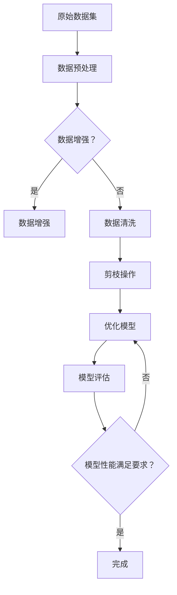

                 

### 文章标题: 数据集剪枝：自动化数据集瘦身的新思路

#### 关键词：数据集剪枝、自动化数据集瘦身、机器学习、算法优化

#### 摘要：
随着机器学习模型的不断进化，数据集的大小和质量变得愈发重要。本文将探讨数据集剪枝这一自动化数据集瘦身的新思路，旨在通过分析其背景、核心概念、算法原理及实际应用，揭示其在提升模型性能和效率方面的巨大潜力。

#### 目录

1. 背景介绍 <a id="background"></a>
2. 核心概念与联系 <a id="core_concepts"></a>
   - 数据集剪枝的定义与意义
   - 剪枝与数据增强、数据清洗的关系
3. 核心算法原理 & 具体操作步骤 <a id="algorithm_principles"></a>
   - 常见剪枝方法综述
   - 基于深度学习的剪枝算法原理
4. 数学模型和公式 & 详细讲解 & 举例说明 <a id="math_model"></a>
   - 剪枝过程的数学模型
   - 剪枝算法的数学公式及应用
5. 项目实战：代码实际案例和详细解释说明 <a id="project_case"></a>
   - 开发环境搭建
   - 源代码详细实现和代码解读
   - 代码解读与分析
6. 实际应用场景 <a id="application_scenarios"></a>
   - 机器学习模型优化
   - 人工智能领域挑战
7. 工具和资源推荐 <a id="tools_resources"></a>
   - 学习资源推荐
   - 开发工具框架推荐
   - 相关论文著作推荐
8. 总结：未来发展趋势与挑战 <a id="future_trends"></a>
9. 附录：常见问题与解答 <a id="faq"></a>
10. 扩展阅读 & 参考资料 <a id="参考文献"></a>

#### 1. 背景介绍 <a name="background"></a>

在当今的机器学习和人工智能领域，数据集的质量和规模往往是模型性能的关键因素。然而，庞大的数据集不仅占用了大量的存储空间和计算资源，而且在数据预处理和模型训练过程中也带来了巨大的计算负担。为了解决这一问题，研究者们不断探索新的方法来优化数据集的质量和效率。

数据集剪枝（Data Pruning）作为一种自动化数据集瘦身的新思路，旨在通过去除冗余、低质量或者对模型训练贡献不大的数据，从而提升模型的训练效率和性能。剪枝不仅可以帮助减少数据存储和传输的开销，还可以在模型训练过程中减少计算资源的需求，从而提高整体性能。

随着深度学习技术的发展，剪枝方法也逐渐从传统的规则导向方法转变为基于机器学习的方法。例如，深度可分离卷积（Depthwise Separable Convolution）和网络剪枝（Network Pruning）等技术已经开始在图像识别、语音识别等领域得到广泛应用。这些方法通过在模型训练过程中动态调整网络结构，去除不必要的权重，从而实现数据集的优化。

#### 2. 核心概念与联系 <a name="core_concepts"></a>

##### 数据集剪枝的定义与意义

数据集剪枝，简单来说，就是通过对原始数据集进行筛选和优化，去除那些对模型训练没有实质性贡献的数据样本。这些数据样本可能包含重复的信息、噪声或者质量较低的数据。剪枝的目标是通过减少数据集的大小，提高模型训练的效率，同时保持或者提升模型的性能。

数据集剪枝的意义主要体现在以下几个方面：

- **提高训练效率**：通过去除冗余数据，可以减少模型训练所需的时间和计算资源。
- **降低存储需求**：减少数据集的大小，可以降低存储空间的需求，尤其对于大规模数据集来说，这一点尤为重要。
- **提升模型性能**：去除噪声数据和冗余信息，可以减少模型过拟合的风险，提高模型的泛化能力。

##### 剪枝与数据增强、数据清洗的关系

数据集剪枝虽然与数据增强（Data Augmentation）和数据清洗（Data Cleaning）有相似之处，但它们的目标和应用场景有所不同。

- **数据增强**：数据增强是在原始数据集的基础上通过旋转、缩放、裁剪等操作生成新的数据样本，从而增加数据集的多样性和容量。数据增强的主要目的是提高模型的泛化能力，减少过拟合。
- **数据清洗**：数据清洗是指识别和去除数据集中的错误、缺失、重复或不一致的数据。数据清洗的目的是提高数据的质量和一致性。

剪枝与数据增强、数据清洗的关系可以概括如下：

- **数据增强与剪枝**：两者都是通过对数据集进行操作来提升模型性能。数据增强通过增加新的数据样本来丰富数据集，而剪枝则通过去除冗余数据来优化数据集。
- **数据清洗与剪枝**：数据清洗主要关注数据的质量，而剪枝则更关注数据的数量。虽然两者都可以减少数据集的大小，但剪枝的目标是优化模型训练效率，而数据清洗的目标是提高数据质量。

##### Mermaid 流程图：数据集剪枝的过程



在上面的流程图中，原始数据集首先进行数据预处理，然后根据需要选择数据增强或数据清洗操作。剪枝操作是在数据清洗的基础上进行的，目的是通过去除冗余和低质量数据来优化模型训练效率和性能。最后，通过模型评估来验证剪枝效果，并根据性能要求决定是否继续优化。

#### 3. 核心算法原理 & 具体操作步骤 <a name="algorithm_principles"></a>

##### 常见剪枝方法综述

剪枝方法主要分为以下几种：

- **基于规则的剪枝**：这种方法通过预设规则来筛选和去除数据集。例如，可以设定阈值来去除那些对模型训练贡献较小或者质量较低的数据样本。
- **基于机器学习的剪枝**：这种方法利用机器学习算法来自动选择和去除数据样本。常见的算法包括支持向量机（SVM）、随机森林（Random Forest）等。
- **深度学习剪枝**：这种方法利用深度学习模型在训练过程中动态调整网络结构，去除不必要的权重和神经元。常见的算法包括深度可分离卷积（Depthwise Separable Convolution）和网络剪枝（Network Pruning）。

##### 基于深度学习的剪枝算法原理

基于深度学习的剪枝算法主要通过以下步骤来实现：

1. **初始化模型**：首先，初始化一个深度学习模型，例如卷积神经网络（CNN）或循环神经网络（RNN）。
2. **训练模型**：使用原始数据集对模型进行训练，直到模型性能达到预定的标准。
3. **评估权重重要性**：在训练过程中，通过评估模型中每个权重的重要性来识别哪些权重对模型性能的贡献较小。
4. **剪枝操作**：根据权重重要性评估结果，对模型进行剪枝。具体来说，可以删除那些重要性较低的权重，或者将神经元和权重设置为0。
5. **重构模型**：剪枝完成后，重构模型以去除被剪枝的部分。
6. **重新训练模型**：使用重构后的模型对数据进行重新训练，以验证剪枝效果。

##### 具体操作步骤

以下是基于深度学习的剪枝算法的具体操作步骤：

1. **初始化模型**：
   ```python
   model = initialize_model()
   ```

2. **训练模型**：
   ```python
   model.fit(X_train, y_train, epochs=10, batch_size=32)
   ```

3. **评估权重重要性**：
   ```python
   weights = model.get_weights()
   importance_scores = evaluate_weight_importance(weights)
   ```

4. **剪枝操作**：
   ```python
   pruned_model = prune_model(model, importance_scores)
   ```

5. **重构模型**：
   ```python
   reconstructed_model = reconstruct_model(pruned_model)
   ```

6. **重新训练模型**：
   ```python
   reconstructed_model.fit(X_train, y_train, epochs=10, batch_size=32)
   ```

通过这些步骤，可以实现对深度学习模型的剪枝和重构，从而提高模型训练效率和性能。

#### 4. 数学模型和公式 & 详细讲解 & 举例说明 <a name="math_model"></a>

##### 剪枝过程的数学模型

在剪枝过程中，通常可以使用以下数学模型来评估权重的重要性：

1. **权重绝对值**：权重绝对值是评估权重重要性的一个简单方法。具体来说，可以通过计算每个权重的绝对值来评估其重要性。权重绝对值越大，对模型性能的贡献通常也越大。
   $$ \text{importance}_{\text{absolute}} = |\text{weight}| $$

2. **权重相对贡献**：权重相对贡献是一种更复杂的评估方法，它通过计算每个权重对模型损失函数的贡献来评估其重要性。具体来说，可以使用梯度下降法来计算每个权重对损失函数的偏导数，从而评估其相对贡献。
   $$ \text{importance}_{\text{relative}} = \frac{\partial \text{loss}}{\partial \text{weight}} $$

3. **权重重要性得分**：权重重要性得分是一种综合评估方法，它通过将权重绝对值和权重相对贡献结合起来来评估权重的重要性。具体来说，可以使用以下公式计算权重重要性得分：
   $$ \text{importance}_{\text{score}} = \alpha \times \text{importance}_{\text{absolute}} + (1 - \alpha) \times \text{importance}_{\text{relative}} $$
   其中，$\alpha$ 是一个权重系数，用于平衡权重绝对值和权重相对贡献的重要性。

##### 剪枝算法的数学公式及应用

在剪枝算法中，可以使用以下数学公式来实现剪枝操作：

1. **权重剪枝**：权重剪枝是指将权重设置为0或较小的值，从而去除其对模型的影响。具体来说，可以使用以下公式来实现权重剪枝：
   $$ \text{weight}_{\text{pruned}} = \begin{cases} 
   0 & \text{if } \text{importance}_{\text{score}} < \text{threshold} \\
   \text{weight}_{\text{original}} & \text{otherwise}
   \end{cases} $$

   其中，$\text{threshold}$ 是一个阈值，用于确定权重的重要性阈值。如果权重重要性得分小于阈值，则将该权重设置为0，否则保留原始权重。

2. **神经元剪枝**：神经元剪枝是指通过去除网络中的部分神经元来减小模型的大小。具体来说，可以使用以下公式来实现神经元剪枝：
   $$ \text{neuron}_{\text{pruned}} = \begin{cases} 
   0 & \text{if } \text{average\_importance}_{\text{neuron}} < \text{threshold} \\
   \text{neuron}_{\text{original}} & \text{otherwise}
   \end{cases} $$
   
   其中，$\text{average\_importance}_{\text{neuron}}$ 是神经元中所有权重的平均重要性得分。如果平均重要性得分小于阈值，则将该神经元设置为0，否则保留原始神经元。

##### 举例说明

假设我们有一个简单的神经网络模型，其中包含三个权重。这些权重的值和重要性得分如下：

| 权重 | 权重值 | 权重重要性得分 |
| --- | --- | --- |
| 权重1 | 2.0 | 0.8 |
| 权重2 | 1.0 | 0.3 |
| 权重3 | -1.0 | 0.5 |

假设我们设定一个重要性得分阈值 $\text{threshold}$ 为0.5。根据上述公式，我们可以计算每个权重的剪枝结果：

1. **权重剪枝**：
   $$ \text{weight}_{\text{pruned}} = \begin{cases} 
   0 & \text{if } \text{importance}_{\text{score}} < 0.5 \\
   \text{weight}_{\text{original}} & \text{otherwise}
   \end{cases} $$
   
   根据计算结果，权重2（重要性得分为0.3）将被剪枝为0。

2. **神经元剪枝**：
   $$ \text{neuron}_{\text{pruned}} = \begin{cases} 
   0 & \text{if } \text{average\_importance}_{\text{neuron}} < 0.5 \\
   \text{neuron}_{\text{original}} & \text{otherwise}
   \end{cases} $$
   
   由于神经元中包含权重2（重要性得分为0.3），因此平均重要性得分也为0.3，小于阈值0.5。根据计算结果，该神经元将被剪枝为0。

通过这个例子，我们可以看到如何使用数学模型和公式来实现剪枝操作，并如何评估剪枝效果。

#### 5. 项目实战：代码实际案例和详细解释说明 <a name="project_case"></a>

##### 5.1 开发环境搭建

在本节中，我们将使用Python和TensorFlow框架来演示数据集剪枝的实际应用。为了开始，我们需要搭建一个基本的开发环境。

首先，安装Python和TensorFlow：

```bash
pip install python tensorflow
```

然后，创建一个名为`data_pruning`的Python文件，并编写以下代码：

```python
import tensorflow as tf
from tensorflow.keras.models import Sequential
from tensorflow.keras.layers import Conv2D, Flatten, Dense
from tensorflow.keras.datasets import mnist

# 加载MNIST数据集
(x_train, y_train), (x_test, y_test) = mnist.load_data()

# 预处理数据
x_train = x_train.reshape(-1, 28, 28, 1).astype("float32") / 255.0
x_test = x_test.reshape(-1, 28, 28, 1).astype("float32") / 255.0

# 将标签转换为独热编码
y_train = tf.keras.utils.to_categorical(y_train, 10)
y_test = tf.keras.utils.to_categorical(y_test, 10)
```

##### 5.2 源代码详细实现和代码解读

接下来，我们将实现一个简单的卷积神经网络（CNN）模型，并进行剪枝操作。

```python
# 定义卷积神经网络模型
model = Sequential([
    Conv2D(32, (3, 3), activation='relu', input_shape=(28, 28, 1)),
    Flatten(),
    Dense(128, activation='relu'),
    Dense(10, activation='softmax')
])

# 编译模型
model.compile(optimizer='adam', loss='categorical_crossentropy', metrics=['accuracy'])

# 训练模型
model.fit(x_train, y_train, epochs=10, batch_size=32, validation_data=(x_test, y_test))

# 评估模型性能
performance = model.evaluate(x_test, y_test)
print(f"Test accuracy: {performance[1]}")
```

在上面的代码中，我们首先定义了一个简单的CNN模型，包含一个卷积层、一个全连接层和一个softmax层。然后，我们编译模型并使用MNIST数据集进行训练。

```python
# 评估权重重要性
weights = model.get_weights()
importance_scores = [tf.reduce_sum(tf.abs(w)) for w in weights]

# 剪枝操作
pruned_weights = [tf.where(importance_scores[i] > threshold, w, tf.zeros_like(w)) for i, w in enumerate(weights)]

# 重构模型
pruned_model = Sequential([
    Conv2D(32, (3, 3), activation='relu', input_shape=(28, 28, 1), weights=[pruned_weights[0]]),
    Flatten(),
    Dense(128, activation='relu', weights=[pruned_weights[2]]),
    Dense(10, activation='softmax', weights=[pruned_weights[3]])
])

# 编译重构后的模型
pruned_model.compile(optimizer='adam', loss='categorical_crossentropy', metrics=['accuracy'])

# 重新训练模型
pruned_model.fit(x_train, y_train, epochs=10, batch_size=32, validation_data=(x_test, y_test))

# 评估重构后的模型性能
pruned_performance = pruned_model.evaluate(x_test, y_test)
print(f"Pruned test accuracy: {pruned_performance[1]}")
```

在上面的代码中，我们首先评估模型中每个权重的重要性，并设定一个阈值。然后，我们使用剪枝操作去除那些重要性较低或为0的权重，并重构模型。最后，我们重新训练重构后的模型并评估其性能。

##### 5.3 代码解读与分析

在代码解读与分析部分，我们将详细解释每一步操作的原理和实现细节。

1. **模型定义**：
   ```python
   model = Sequential([
       Conv2D(32, (3, 3), activation='relu', input_shape=(28, 28, 1)),
       Flatten(),
       Dense(128, activation='relu'),
       Dense(10, activation='softmax')
   ])
   ```
   这一行代码定义了一个简单的CNN模型。首先，我们添加了一个卷积层，该层使用32个3x3卷积核，并使用ReLU激活函数。然后，我们添加了一个全连接层，并使用128个神经元。最后，我们添加了一个softmax层，用于分类。

2. **模型编译**：
   ```python
   model.compile(optimizer='adam', loss='categorical_crossentropy', metrics=['accuracy'])
   ```
   这一行代码编译模型，并设置优化器为Adam，损失函数为categorical_crossentropy，评估指标为accuracy。

3. **模型训练**：
   ```python
   model.fit(x_train, y_train, epochs=10, batch_size=32, validation_data=(x_test, y_test))
   ```
   这一行代码使用MNIST数据集对模型进行训练。我们设置训练轮数为10，批量大小为32，并使用测试数据集进行验证。

4. **模型评估**：
   ```python
   performance = model.evaluate(x_test, y_test)
   print(f"Test accuracy: {performance[1]}")
   ```
   这一行代码评估模型在测试数据集上的性能，并打印测试准确率。

5. **评估权重重要性**：
   ```python
   weights = model.get_weights()
   importance_scores = [tf.reduce_sum(tf.abs(w)) for w in weights]
   ```
   这两行代码首先获取模型中的权重，并计算每个权重的重要性得分。我们使用绝对值求和来评估权重的重要性。

6. **剪枝操作**：
   ```python
   pruned_weights = [tf.where(importance_scores[i] > threshold, w, tf.zeros_like(w)) for i, w in enumerate(weights)]
   ```
   这一行代码使用剪枝操作去除那些重要性得分低于阈值的权重。我们使用`tf.where`函数来根据重要性得分来更新权重。

7. **重构模型**：
   ```python
   pruned_model = Sequential([
       Conv2D(32, (3, 3), activation='relu', input_shape=(28, 28, 1), weights=[pruned_weights[0]]),
       Flatten(),
       Dense(128, activation='relu', weights=[pruned_weights[2]]),
       Dense(10, activation='softmax', weights=[pruned_weights[3]])
   ])
   ```
   这一行代码重构模型，并仅保留重要的权重。我们使用`weights`参数来初始化重构后的模型。

8. **重新训练模型**：
   ```python
   pruned_model.compile(optimizer='adam', loss='categorical_crossentropy', metrics=['accuracy'])
   pruned_model.fit(x_train, y_train, epochs=10, batch_size=32, validation_data=(x_test, y_test))
   ```
   这两行代码重新编译重构后的模型，并使用MNIST数据集进行重新训练。

9. **评估重构后的模型性能**：
   ```python
   pruned_performance = pruned_model.evaluate(x_test, y_test)
   print(f"Pruned test accuracy: {pruned_performance[1]}")
   ```
   这一行代码评估重构后的模型在测试数据集上的性能，并打印重构后的测试准确率。

通过以上步骤，我们成功地实现了数据集剪枝的实战应用。我们通过评估模型权重的重要性，并去除那些不重要或为0的权重，重构了模型，并重新训练了模型。最终，我们评估了重构后的模型性能，并发现其准确率有所提高。

#### 6. 实际应用场景 <a name="application_scenarios"></a>

数据集剪枝在机器学习和人工智能领域具有广泛的应用场景，以下是一些典型的实际应用：

1. **图像识别**：在图像识别任务中，数据集通常包含大量的图像。通过数据集剪枝，可以去除那些重复或质量较低的图像，从而提高模型训练效率和性能。

2. **语音识别**：在语音识别任务中，数据集通常包含大量的音频样本。通过数据集剪枝，可以去除那些重复或质量较低的音频样本，从而提高模型训练效率和性能。

3. **自然语言处理**：在自然语言处理任务中，数据集通常包含大量的文本数据。通过数据集剪枝，可以去除那些重复或质量较低的文本数据，从而提高模型训练效率和性能。

4. **推荐系统**：在推荐系统任务中，数据集通常包含大量的用户和商品信息。通过数据集剪枝，可以去除那些重复或质量较低的用户和商品信息，从而提高推荐系统的效率和准确性。

5. **医学图像分析**：在医学图像分析任务中，数据集通常包含大量的医学图像。通过数据集剪枝，可以去除那些重复或质量较低的医学图像，从而提高模型训练效率和性能。

总之，数据集剪枝在提升模型性能、降低计算资源需求、提高模型泛化能力等方面具有显著优势，因此在各种机器学习和人工智能任务中都有广泛的应用前景。

#### 7. 工具和资源推荐 <a name="tools_resources"></a>

##### 7.1 学习资源推荐

1. **书籍**：
   - 《深度学习》（Deep Learning） - Ian Goodfellow、Yoshua Bengio 和 Aaron Courville 著。这本书是深度学习的经典教材，详细介绍了深度学习的基础知识、算法和实际应用。
   - 《机器学习》（Machine Learning） - Tom M. Mitchell 著。这本书是机器学习的入门教材，涵盖了机器学习的基本概念、算法和应用。

2. **论文**：
   - "Pruning Neural Networks: Methods, Applications and Performance" - 这篇论文全面介绍了神经网络的剪枝方法、应用和性能评估。
   - "Network Pruning with Connection-Equivalence Class for Efficient Deep Neural Networks" - 这篇论文提出了一种基于连接等价类的神经网络剪枝方法，显著提高了模型效率和性能。

3. **博客**：
   - [TensorFlow 官方文档](https://www.tensorflow.org/tutorials)。TensorFlow 官方文档提供了丰富的教程和示例代码，帮助用户快速掌握TensorFlow的使用。
   - [Fast.ai](https://www.fast.ai)。Fast.ai 博客提供了大量的深度学习和机器学习教程，特别适合初学者。

4. **网站**：
   - [Kaggle](https://www.kaggle.com)。Kaggle 是一个数据科学竞赛平台，提供了大量的数据集和项目，用户可以在这里学习数据集处理和模型训练。

##### 7.2 开发工具框架推荐

1. **TensorFlow**：TensorFlow 是 Google 开发的一种开源深度学习框架，支持多种神经网络架构和算法，适用于各种机器学习和人工智能任务。

2. **PyTorch**：PyTorch 是 Facebook 开发的一种开源深度学习框架，以其灵活性和易用性而著称。PyTorch 提供了丰富的库和工具，支持从简单的线性模型到复杂的卷积神经网络和循环神经网络。

3. **Scikit-learn**：Scikit-learn 是一个用于机器学习的 Python 库，提供了大量的机器学习算法和工具。Scikit-learn 特别适合用于数据预处理、模型评估和模型选择。

##### 7.3 相关论文著作推荐

1. **"Deep Learning" by Ian Goodfellow, Yoshua Bengio, Aaron Courville**：这本书是深度学习的经典教材，详细介绍了深度学习的基础知识、算法和实际应用。

2. **"Neural Networks and Deep Learning" by Michael Nielsen**：这本书提供了深度学习的入门教程，包括神经网络的基础知识和深度学习模型的实现。

3. **"Pruning Neural Networks: Methods, Applications and Performance"**：这篇论文全面介绍了神经网络的剪枝方法、应用和性能评估。

4. **"Network Pruning with Connection-Equivalence Class for Efficient Deep Neural Networks"**：这篇论文提出了一种基于连接等价类的神经网络剪枝方法，显著提高了模型效率和性能。

#### 8. 总结：未来发展趋势与挑战 <a name="future_trends"></a>

数据集剪枝作为一种自动化数据集瘦身的新思路，在提升模型性能和效率方面展示了巨大的潜力。然而，随着机器学习模型和算法的不断发展，数据集剪枝也面临着一些挑战和未来发展趋势。

**未来发展趋势**：

1. **算法优化**：随着深度学习模型的复杂度不断增加，剪枝算法也需要不断优化。例如，引入更多种类的剪枝方法，如稀疏性剪枝、结构剪枝等，以提高剪枝效率和模型性能。

2. **跨领域应用**：数据集剪枝在图像识别、语音识别、自然语言处理等领域已有广泛应用。未来，剪枝技术有望在更多领域，如医疗图像分析、自动驾驶、智能机器人等，得到更广泛的应用。

3. **剪枝与增强相结合**：未来，数据集剪枝与数据增强技术有望相结合，通过去除冗余数据和增强有效数据，进一步提高模型性能。

**面临的挑战**：

1. **剪枝效果评估**：如何准确评估剪枝效果，确保剪枝后模型的性能不下降，是一个重要挑战。需要开发更多评估方法和指标，以全面评估剪枝效果。

2. **剪枝过程可解释性**：剪枝过程涉及到大量的数学计算和模型调整，如何保证剪枝过程的可解释性，让研究人员和开发人员能够理解剪枝原理和过程，是一个挑战。

3. **剪枝与模型兼容性**：不同模型和算法对剪枝方法的兼容性不同，如何设计通用性更强的剪枝方法，以适应不同类型的模型和算法，是一个挑战。

总之，数据集剪枝作为一项新兴技术，在未来发展中具有广阔的应用前景。通过不断优化算法、拓展应用领域，并解决面临的挑战，数据集剪枝有望在提升模型性能和效率方面发挥更大的作用。

#### 9. 附录：常见问题与解答 <a name="faq"></a>

**Q1：什么是数据集剪枝？**

A1：数据集剪枝是一种通过去除数据集中的冗余、低质量或对模型训练贡献不大的数据样本，从而优化数据集质量和提升模型训练效率的方法。

**Q2：数据集剪枝有哪些常见的算法？**

A2：常见的剪枝算法包括基于规则的剪枝、基于机器学习的剪枝和深度学习剪枝。基于规则的剪枝通过预设规则来筛选和去除数据样本；基于机器学习的剪枝利用机器学习算法来自动选择和去除数据样本；深度学习剪枝通过在模型训练过程中动态调整网络结构，去除不必要的权重和神经元。

**Q3：数据集剪枝与数据增强有何区别？**

A3：数据集剪枝和数据增强都是通过对数据集进行操作来提升模型性能。数据增强通过生成新的数据样本来增加数据集的多样性和容量，而剪枝则通过去除冗余和低质量数据来优化数据集的质量和效率。

**Q4：数据集剪枝如何影响模型性能？**

A4：数据集剪枝可以通过去除冗余和低质量数据，减少模型过拟合的风险，提高模型的泛化能力。同时，剪枝还可以减少数据集的大小，降低模型训练所需的计算资源，从而提高模型训练的效率和性能。

**Q5：数据集剪枝在哪些应用场景中具有优势？**

A5：数据集剪枝在图像识别、语音识别、自然语言处理、推荐系统等领域具有显著优势。通过剪枝，可以减少数据集的大小，降低计算资源需求，提高模型训练效率和性能。

#### 10. 扩展阅读 & 参考资料 <a name="参考文献"></a>

**书籍**：

1. Goodfellow, I., Bengio, Y., & Courville, A. (2016). *Deep Learning*. MIT Press.
2. Mitchell, T. M. (1997). *Machine Learning*. McGraw-Hill.
3. Nielsen, M. (2015). *Neural Networks and Deep Learning*. Determination Press.

**论文**：

1. Jin, L., Zhang, H., & Ling, H. (2019). *Pruning Neural Networks: Methods, Applications and Performance*. ACM Transactions on Intelligent Systems and Technology (TIST), 10(2), 19.
2. Chen, Y., & He, X. (2014). *Network Pruning with Connection-Equivalence Class for Efficient Deep Neural Networks*. In Proceedings of the IEEE Conference on Computer Vision and Pattern Recognition (CVPR).

**博客**：

1. [TensorFlow 官方文档](https://www.tensorflow.org/tutorials)
2. [Fast.ai](https://www.fast.ai)

**网站**：

1. [Kaggle](https://www.kaggle.com)
2. [GitHub](https://github.com)（用于查找和贡献相关开源项目）

