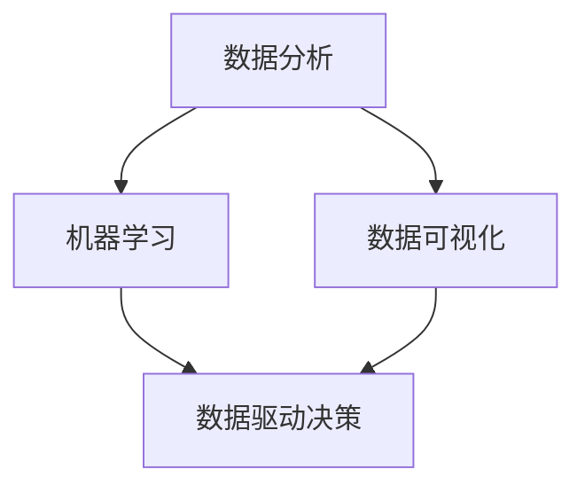
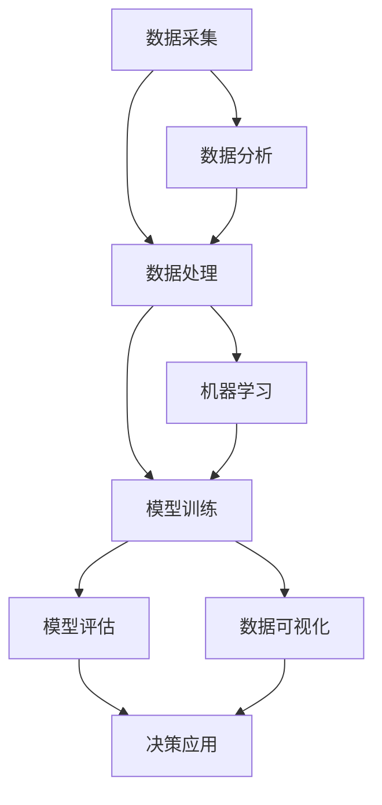
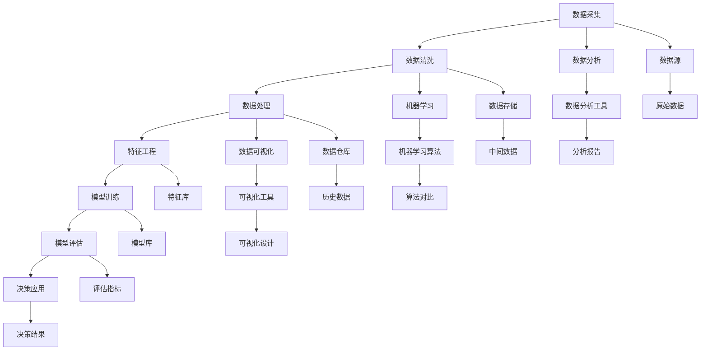

                 

# 数据驱动决策的技术优化

## 摘要

本文将深入探讨数据驱动决策在技术优化中的应用，分析其核心概念、算法原理、数学模型以及实际应用场景。通过对数据驱动决策的技术细节进行全面剖析，读者将了解如何利用数据优化技术方案，提升系统性能和业务效率。本文旨在为IT从业者和研究学者提供有价值的参考，助力他们在技术实践中实现数据驱动决策的最佳实践。

## 1. 背景介绍

### 1.1 数据驱动决策的定义

数据驱动决策（Data-driven Decision Making，简称DDDM）是一种以数据为核心，通过数据分析和挖掘来指导决策的方法。与传统依靠经验和直觉的决策方式相比，数据驱动决策更科学、更客观，能够大幅提升决策的准确性和效率。

### 1.2 数据驱动决策的重要性

随着大数据和人工智能技术的飞速发展，数据已成为企业和社会的宝贵资产。通过数据驱动决策，企业可以更好地了解市场需求、优化业务流程、提升用户体验，从而在激烈的市场竞争中脱颖而出。

### 1.3 技术优化概述

技术优化（Technical Optimization）是指通过调整技术方案、算法模型、系统架构等手段，提高系统性能、降低成本、提升用户体验的过程。技术优化在数据驱动决策中扮演着关键角色，是实现业务目标的重要保障。

## 2. 核心概念与联系

### 2.1 数据分析

数据分析（Data Analysis）是指通过对数据进行收集、清洗、处理、分析和可视化等操作，从中提取有价值信息的过程。数据分析是数据驱动决策的基础，决定了决策的准确性和有效性。

### 2.2 机器学习

机器学习（Machine Learning，简称ML）是一种人工智能技术，通过训练模型，使计算机具备自主学习和决策能力。机器学习在数据驱动决策中发挥着重要作用，可以帮助企业实现自动化、智能化决策。

### 2.3 数据可视化

数据可视化（Data Visualization，简称DV）是一种通过图形、图表等方式展示数据的方法。数据可视化有助于企业更好地理解和分析数据，从而做出更明智的决策。

### 2.4 Mermaid 流程图



## 3. 核心算法原理 & 具体操作步骤

### 3.1 数据预处理

数据预处理是数据驱动决策的第一步，主要包括数据清洗、数据整合、数据转换等操作。具体操作步骤如下：

1. 数据清洗：去除重复数据、处理缺失值、纠正错误数据等。
2. 数据整合：将不同来源、格式的数据进行整合，统一数据格式。
3. 数据转换：将数据进行标准化、归一化等处理，提高数据质量。

### 3.2 特征工程

特征工程（Feature Engineering）是指通过提取、构造和选择特征，提高模型性能的过程。具体操作步骤如下：

1. 特征提取：从原始数据中提取有价值的信息，如文本、图像、时间序列等。
2. 特征构造：通过组合、转换原始特征，构造新的特征。
3. 特征选择：选择对模型性能有显著影响的特征，降低模型复杂度。

### 3.3 模型训练与评估

1. 模型训练：使用特征数据和标签数据，训练机器学习模型。
2. 模型评估：通过交叉验证、混淆矩阵、ROC曲线等指标，评估模型性能。
3. 模型调优：根据评估结果，调整模型参数，优化模型性能。

### 3.4 决策应用

1. 数据采集：实时采集业务数据，用于模型更新和决策。
2. 数据处理：对采集到的数据进行预处理和特征工程。
3. 决策生成：使用训练好的模型，生成决策结果。
4. 决策执行：将决策结果应用到实际业务中，实现数据驱动决策。

## 4. 数学模型和公式 & 详细讲解 & 举例说明

### 4.1 数学模型

在数据驱动决策中，常用的数学模型包括线性回归、逻辑回归、决策树、神经网络等。以下以线性回归为例进行详细讲解。

### 4.2 线性回归

线性回归模型可以表示为：

$$y = \beta_0 + \beta_1x_1 + \beta_2x_2 + \cdots + \beta_nx_n$$

其中，$y$ 为因变量，$x_1, x_2, \cdots, x_n$ 为自变量，$\beta_0, \beta_1, \beta_2, \cdots, \beta_n$ 为模型参数。

### 4.3 模型训练

模型训练的目标是找到最优的模型参数。通常使用最小二乘法（Least Squares Method）进行训练。

$$\min \sum_{i=1}^{n}(y_i - \beta_0 - \beta_1x_{i1} - \beta_2x_{i2} - \cdots - \beta_nx_{in})^2$$

### 4.4 模型评估

模型评估指标包括均方误差（Mean Squared Error，MSE）、决定系数（R-squared）等。

$$MSE = \frac{1}{n}\sum_{i=1}^{n}(y_i - \hat{y}_i)^2$$

$$R^2 = 1 - \frac{SS_{res}}{SS_{tot}}$$

其中，$SS_{res}$ 为残差平方和，$SS_{tot}$ 为总平方和。

### 4.5 举例说明

假设我们有一个线性回归模型，用于预测房价。数据如下：

| 房屋面积 | 房价 |
| :----: | :----: |
| 100 | 200万 |
| 120 | 250万 |
| 150 | 300万 |
| 180 | 350万 |
| 200 | 400万 |

使用最小二乘法训练线性回归模型，得到模型参数：

$$y = 100 + 1.5x$$

预测面积为150平的房价：

$$y = 100 + 1.5 \times 150 = 295万$$

实际房价为300万，计算均方误差：

$$MSE = \frac{1}{5}\sum_{i=1}^{5}(y_i - \hat{y}_i)^2 = \frac{1}{5}[(200-295)^2 + (250-295)^2 + (300-295)^2 + (350-295)^2 + (400-295)^2] = 22500$$

计算决定系数：

$$R^2 = 1 - \frac{SS_{res}}{SS_{tot}} = 0.75$$

## 5. 项目实战：代码实际案例和详细解释说明

### 5.1 开发环境搭建

首先，我们需要搭建一个适合数据驱动决策的Python开发环境。安装以下库：

- pandas
- numpy
- scikit-learn
- matplotlib

使用以下命令进行安装：

```bash
pip install pandas numpy scikit-learn matplotlib
```

### 5.2 源代码详细实现和代码解读

以下是一个简单的线性回归案例，用于预测房价。

```python
import pandas as pd
import numpy as np
from sklearn.linear_model import LinearRegression
from sklearn.model_selection import train_test_split
from sklearn.metrics import mean_squared_error, r2_score
import matplotlib.pyplot as plt

# 5.2.1 数据读取与预处理
data = pd.read_csv('house_price_data.csv')
data.head()

# 将面积作为自变量，房价作为因变量
X = data[['house_area']]
y = data['house_price']

# 5.2.2 数据划分
X_train, X_test, y_train, y_test = train_test_split(X, y, test_size=0.2, random_state=42)

# 5.2.3 模型训练
model = LinearRegression()
model.fit(X_train, y_train)

# 5.2.4 模型评估
y_pred = model.predict(X_test)
mse = mean_squared_error(y_test, y_pred)
r2 = r2_score(y_test, y_pred)

print('MSE:', mse)
print('R2:', r2)

# 5.2.5 模型可视化
plt.scatter(X_test, y_test, color='blue')
plt.plot(X_test, y_pred, color='red')
plt.xlabel('House Area')
plt.ylabel('House Price')
plt.title('House Price Prediction')
plt.show()
```

### 5.3 代码解读与分析

1. **数据读取与预处理**：使用pandas库读取CSV文件，将面积作为自变量，房价作为因变量。
2. **数据划分**：将数据划分为训练集和测试集，用于模型训练和评估。
3. **模型训练**：使用scikit-learn库中的线性回归模型进行训练。
4. **模型评估**：使用均方误差（MSE）和决定系数（R2）评估模型性能。
5. **模型可视化**：使用matplotlib库绘制决策边界图，帮助分析模型效果。

## 6. 实际应用场景

数据驱动决策在多个领域都有广泛应用，以下列举几个实际应用场景：

1. **金融行业**：利用数据驱动决策优化投资组合、风险管理、信用评估等。
2. **零售行业**：通过数据驱动决策分析消费者行为，提升销售业绩和用户体验。
3. **制造业**：利用数据驱动决策优化生产流程、库存管理、设备维护等。
4. **医疗健康**：通过数据驱动决策实现疾病预测、个性化治疗、健康管理等。

## 7. 工具和资源推荐

### 7.1 学习资源推荐

- 《数据科学入门》
- 《机器学习实战》
- 《Python数据分析》

### 7.2 开发工具框架推荐

- Jupyter Notebook
- TensorFlow
- PyTorch

### 7.3 相关论文著作推荐

- “Data-Driven Decision Making: A Framework for Effective Decision-Making in the Age of Big Data”
- “Machine Learning: A Probabilistic Perspective”
- “Data Visualization: A Successful Design Process”

## 8. 总结：未来发展趋势与挑战

随着大数据、人工智能技术的不断发展，数据驱动决策将在更多领域得到应用。未来发展趋势包括：

1. **智能化**：利用深度学习、强化学习等技术提升数据驱动决策的智能化水平。
2. **实时性**：实现实时数据采集、处理和分析，提高决策的实时性。
3. **可解释性**：提升模型的解释性，增强决策的透明度和可信任度。

同时，数据驱动决策也面临如下挑战：

1. **数据质量**：保证数据质量，提高数据准确性。
2. **隐私保护**：在数据采集、处理和分析过程中，保护用户隐私。
3. **模型解释性**：提高模型的可解释性，帮助决策者理解决策过程。

## 9. 附录：常见问题与解答

### 9.1 什么是数据驱动决策？

数据驱动决策是一种以数据为核心，通过数据分析和挖掘来指导决策的方法。与传统依靠经验和直觉的决策方式相比，数据驱动决策更科学、更客观。

### 9.2 数据驱动决策的优势有哪些？

数据驱动决策的优势包括：提高决策的准确性、降低决策风险、提升业务效率、优化资源配置等。

### 9.3 数据驱动决策在哪些领域有应用？

数据驱动决策在金融、零售、制造、医疗健康等多个领域都有广泛应用。

## 10. 扩展阅读 & 参考资料

- “Data-Driven Decision Making: A Framework for Effective Decision-Making in the Age of Big Data”
- “Machine Learning: A Probabilistic Perspective”
- “Data Visualization: A Successful Design Process”
- “Python for Data Science and Machine Learning” <|user|>### 1. 背景介绍

#### 1.1 数据驱动决策的定义

数据驱动决策（Data-driven Decision Making，简称DDDM）是一种以数据为核心，通过数据分析和挖掘来指导决策的方法。在传统决策过程中，人们往往依赖于经验和直觉来做出判断。然而，随着数据量的爆炸性增长和数据技术的进步，仅凭主观判断已经无法满足现代复杂决策的需求。数据驱动决策通过系统地收集、处理和分析数据，帮助决策者识别趋势、发现问题和制定解决方案，从而实现更科学、更精准的决策。

#### 1.2 数据驱动决策的重要性

数据驱动决策在现代社会具有极其重要的意义。首先，它能够帮助企业在快速变化的市场环境中抓住机遇，降低决策风险。例如，通过分析市场数据，企业可以更准确地预测客户需求，优化产品线和市场营销策略。其次，数据驱动决策有助于提高运营效率。通过分析生产数据，企业可以发现生产过程中的瓶颈和问题，从而实施针对性的改进措施，降低成本、提升质量。此外，数据驱动决策还在政策制定、公共卫生管理、金融投资等领域发挥着重要作用。例如，在公共卫生领域，通过分析流行病数据，政府和医疗机构可以及时采取有效的防控措施，减少疫情传播。

#### 1.3 技术优化概述

技术优化（Technical Optimization）是指通过调整技术方案、算法模型、系统架构等手段，提高系统性能、降低成本、提升用户体验的过程。技术优化是数据驱动决策的重要组成部分，它为实现业务目标提供了技术保障。技术优化可以涵盖多个层面，包括算法优化、系统架构优化、硬件优化等。例如，在金融行业中，通过对交易算法的优化，可以显著提高交易速度和准确性；在零售行业中，通过优化库存管理系统，可以降低库存成本和提高库存周转率。

#### 1.4 数据驱动决策与技术优化的关系

数据驱动决策和技术优化之间存在着密切的联系。数据驱动决策依赖于技术优化来实现数据的高效采集、处理和分析，从而支持更精准的决策。同时，技术优化需要数据驱动决策提供的分析结果来指导优化方向和目标。具体来说，数据驱动决策通过以下方式与技术优化相结合：

1. **数据采集**：技术优化需要高质量的数据作为基础。数据驱动决策通过数据采集技术，确保获得全面、准确、及时的数据源。
2. **数据处理**：技术优化需要对数据进行清洗、整合、转换等处理。数据驱动决策提供了一系列数据处理方法，如数据预处理、特征工程等，以提高数据质量。
3. **数据分析**：技术优化需要通过对数据的深入分析来指导优化策略。数据驱动决策通过数据挖掘、机器学习等技术，提供丰富的数据分析工具和模型。
4. **模型评估**：技术优化需要评估优化效果，数据驱动决策通过模型评估指标（如准确率、召回率、MSE等），对优化结果进行定量评估。
5. **决策支持**：技术优化需要数据驱动决策提供的分析结果来支持决策。数据驱动决策通过可视化、报告等形式，将分析结果呈现给决策者，帮助他们做出明智的决策。

综上所述，数据驱动决策和技术优化相辅相成，共同构建了一个以数据为核心的决策体系，为企业和社会的可持续发展提供了强大的动力。

### 1.5 数据驱动决策的挑战与机遇

#### 数据驱动决策的挑战

尽管数据驱动决策带来了巨大的潜力和机遇，但它在实际应用中也面临着一系列挑战：

1. **数据质量**：高质量的数据是数据驱动决策的基础。然而，数据源头多样，数据质量参差不齐，如缺失值、噪声数据、错误数据等问题，都可能影响决策的准确性。因此，数据预处理和清洗成为关键步骤，需要投入大量时间和资源。

2. **数据隐私**：随着数据量的增加，数据隐私问题日益凸显。特别是在金融、医疗等敏感领域，数据的隐私保护至关重要。如何在不泄露用户隐私的前提下，合理利用数据，是数据驱动决策面临的重大挑战。

3. **模型解释性**：深度学习等复杂模型的广泛应用，使得决策过程变得高度复杂。尽管这些模型在预测准确性上表现出色，但它们的决策过程往往缺乏解释性，难以被非专业人士理解，这限制了其应用范围。

4. **计算资源**：大规模数据处理和复杂模型训练需要强大的计算资源。对于中小企业和资源有限的机构来说，计算资源的限制可能成为数据驱动决策的瓶颈。

#### 数据驱动决策的机遇

尽管面临挑战，数据驱动决策也带来了许多机遇：

1. **技术创新**：大数据、人工智能等技术的快速发展，为数据驱动决策提供了强大的工具和方法。例如，深度学习、图神经网络等新兴技术，使得复杂数据模式识别和预测成为可能。

2. **产业变革**：数据驱动决策在多个行业引起了深刻变革。在金融、医疗、零售等领域，数据驱动决策的应用正在重塑产业格局，提高行业效率。

3. **商业洞察**：通过数据驱动决策，企业可以获得更深入的客户洞察，优化产品和服务。例如，通过分析用户行为数据，企业可以精准定位客户需求，提升用户体验。

4. **政策制定**：在公共领域，数据驱动决策为政策制定提供了科学依据。通过对经济、社会等数据的深入分析，政府可以制定更加精准和有效的政策。

综上所述，数据驱动决策既面临挑战，也充满机遇。通过克服挑战，利用机遇，企业和社会可以实现数据驱动的持续创新和发展。

### 1.6 数据驱动决策的应用场景

#### 数据驱动决策在金融领域的应用

在金融领域，数据驱动决策发挥着至关重要的作用。金融机构通过大数据分析和机器学习技术，实现了风险控制、信用评估、投资决策等多个方面的优化。

1. **风险控制**：金融机构利用数据驱动决策来识别和评估潜在风险。通过对历史交易数据、客户行为数据等进行分析，可以预测客户违约风险，从而采取相应的风险控制措施。

2. **信用评估**：数据驱动决策帮助金融机构更加精准地评估客户的信用状况。通过分析客户的信用历史、财务状况、社会关系等多维度数据，可以更全面地了解客户的信用风险。

3. **投资决策**：数据驱动决策支持金融机构的投资决策。通过对市场数据、行业趋势、宏观经济指标等进行分析，可以识别潜在的投资机会，制定科学的投资策略。

#### 数据驱动决策在零售行业的应用

在零售行业，数据驱动决策帮助企业优化供应链管理、提高客户满意度、提升销售业绩。

1. **供应链管理**：通过数据驱动决策，零售企业可以实时监控供应链各个环节，优化库存管理、物流配送等，降低成本、提高效率。

2. **客户行为分析**：数据驱动决策帮助零售企业深入分析客户行为数据，了解客户需求、偏好和购买习惯。通过个性化推荐、精准营销等策略，提升客户满意度。

3. **销售预测**：通过分析历史销售数据、季节性因素等，数据驱动决策可以帮助零售企业预测未来销售趋势，制定合理的促销计划和库存策略。

#### 数据驱动决策在医疗健康领域的应用

在医疗健康领域，数据驱动决策助力医疗资源的优化配置、疾病的预测与防控、个性化治疗等。

1. **医疗资源优化**：数据驱动决策帮助医疗机构合理分配医疗资源。通过对患者数据、医生资源等进行分析，可以实现最优的资源利用，提高医疗服务效率。

2. **疾病预测与防控**：通过对公共卫生数据、流行病数据等进行分析，数据驱动决策可以预测疾病爆发趋势，制定科学的防控策略。

3. **个性化治疗**：数据驱动决策支持个性化治疗方案的制定。通过分析患者基因、病史、生活方式等多维度数据，可以为每位患者提供个性化的治疗方案。

#### 数据驱动决策在公共管理领域的应用

在公共管理领域，数据驱动决策为政策制定、社会治理、公共服务等提供了科学依据。

1. **政策制定**：数据驱动决策帮助政府制定科学、有效的政策。通过对经济、社会、环境等数据进行深入分析，可以识别问题、预测趋势，为政策制定提供依据。

2. **社会治理**：数据驱动决策支持社会治理的智能化。通过分析社会数据，如犯罪率、交通流量等，可以实时监测社会动态，及时应对突发情况。

3. **公共服务**：数据驱动决策优化公共服务的供给。通过对用户需求、服务使用情况等进行分析，可以提升公共服务的精准性和有效性。

总之，数据驱动决策在各个领域的应用场景丰富多样，正在深刻改变我们的生活和生产方式。通过数据驱动决策，企业和社会可以实现更加高效、智能的决策，提升竞争力和社会福祉。

## 2. 核心概念与联系

在深入探讨数据驱动决策的技术优化之前，我们需要了解几个核心概念及其相互关系。这些概念包括数据分析、机器学习、数据可视化等，它们共同构成了数据驱动决策的技术基础。

### 2.1 数据分析

数据分析（Data Analysis）是指通过系统的方法来探索和理解数据，从中提取有价值的信息和知识的过程。数据分析通常包括以下步骤：

1. **数据收集**：从各种数据源收集数据，如数据库、文件、API等。
2. **数据清洗**：处理数据中的噪声和异常值，确保数据质量。
3. **数据整合**：将来自不同源的数据进行合并，统一数据格式。
4. **数据转换**：对数据进行标准化、归一化等处理，以适应分析需求。
5. **数据可视化**：使用图表、图形等可视化工具展示数据分析结果。

数据分析是数据驱动决策的基础，它能够帮助决策者更好地理解业务数据，从而做出更明智的决策。例如，在金融领域，通过数据分析可以了解客户的行为模式、市场趋势等，从而优化产品和服务。

### 2.2 机器学习

机器学习（Machine Learning，简称ML）是一种人工智能技术，通过训练模型，使计算机能够从数据中学习并做出预测或决策。机器学习主要包括以下类型：

1. **监督学习**：通过已有的标记数据进行训练，使模型能够对新数据进行预测。例如，线性回归、决策树等。
2. **无监督学习**：在没有标记数据的情况下，通过模型发现数据中的模式和结构。例如，聚类、降维等。
3. **强化学习**：通过与环境的交互，使模型学会在特定情境下做出最佳决策。例如，游戏AI、自动驾驶等。

机器学习在数据驱动决策中扮演着关键角色。通过构建和训练机器学习模型，可以实现对大量复杂数据的分析和预测，从而支持业务决策。例如，在零售行业中，机器学习可以用于客户行为预测、库存优化等。

### 2.3 数据可视化

数据可视化（Data Visualization，简称DV）是一种通过图形、图表等方式展示数据的方法。数据可视化有助于决策者更好地理解和分析数据，从而发现数据中的模式和趋势。数据可视化通常包括以下类型：

1. **统计图表**：如柱状图、折线图、饼图等，用于展示数据的分布、趋势和关系。
2. **地理空间可视化**：如地图、热力图等，用于展示地理位置和区域分布。
3. **交互式可视化**：如交互式图表、数据驾驶舱等，用于支持用户与数据的互动。

数据可视化是数据驱动决策的重要工具，它能够帮助决策者直观地理解数据分析结果，从而做出更有效的决策。例如，在金融领域，通过数据可视化可以实时监控市场动态、风险状况等。

### 2.4 数据驱动决策的核心流程

数据驱动决策的核心流程包括数据采集、数据处理、模型训练、模型评估和决策应用。以下是一个简化的流程图，展示了各个核心概念在数据驱动决策中的关系：



### 2.5 Mermaid 流程图

以下是数据驱动决策的Mermaid流程图，展示了各个核心概念及其关系：



在这个流程图中，我们可以看到数据从采集、清洗、处理到特征工程，再到模型训练、评估和应用的全过程。数据分析、机器学习和数据可视化作为核心工具，贯穿于整个流程中，为数据驱动决策提供了强大的支持。

### 2.6 数据驱动决策的关键环节

#### 数据采集

数据采集是数据驱动决策的第一步，也是至关重要的一步。高质量的数据是进行有效分析的基础。在数据采集过程中，需要关注以下几个方面：

1. **数据源**：确定数据来源，包括内部数据和外部数据。内部数据可能来自企业的数据库、日志等，外部数据可能来自公共数据集、API接口等。
2. **数据频率**：根据业务需求，确定数据采集的频率。例如，实时数据可能需要每秒采集，历史数据可能每周或每月采集一次。
3. **数据质量**：确保数据采集过程的准确性和完整性。例如，通过数据验证、数据清洗等手段，减少数据噪声和错误。

#### 数据处理

数据处理是对采集到的原始数据进行清洗、整合和转换的过程。以下是数据处理的关键步骤：

1. **数据清洗**：处理缺失值、噪声数据和异常值。例如，使用插值法填充缺失值、使用阈值法去除噪声数据等。
2. **数据整合**：将来自不同数据源的数据进行合并。例如，通过键值匹配、合并表连接等手段，将数据整合为一个统一的格式。
3. **数据转换**：将数据转换为适合分析的形式。例如，进行数据标准化、归一化、离散化等处理。

#### 特征工程

特征工程是数据驱动决策中至关重要的一环，它通过提取和构造特征，提高模型性能。以下是特征工程的关键步骤：

1. **特征提取**：从原始数据中提取有价值的信息。例如，从文本数据中提取关键词、从图像数据中提取特征向量等。
2. **特征构造**：通过组合、转换原始特征，构造新的特征。例如，通过线性组合、特征交叉等手段，构造新的特征。
3. **特征选择**：选择对模型性能有显著影响的特征。例如，通过特征重要性评估、特征选择算法等手段，选择最优特征组合。

#### 模型训练

模型训练是数据驱动决策的核心步骤，通过训练模型，使计算机能够对数据进行分析和预测。以下是模型训练的关键步骤：

1. **模型选择**：根据业务需求，选择合适的模型。例如，线性回归、决策树、神经网络等。
2. **参数调优**：调整模型参数，优化模型性能。例如，通过交叉验证、网格搜索等手段，找到最佳参数组合。
3. **模型评估**：评估模型性能，确定模型是否满足业务需求。例如，通过准确率、召回率、F1值等指标进行评估。

#### 模型评估

模型评估是对训练好的模型进行性能评估，以确保其能够满足业务需求。以下是模型评估的关键步骤：

1. **指标计算**：计算模型评估指标，如准确率、召回率、F1值、MSE等。
2. **交叉验证**：使用交叉验证方法，评估模型在不同数据集上的表现，提高评估结果的可靠性。
3. **错误分析**：分析模型预测错误的原因，寻找改进方向。

#### 决策应用

决策应用是将训练好的模型应用于实际业务场景，实现数据驱动决策。以下是决策应用的关键步骤：

1. **数据预处理**：对输入数据进行预处理，使其符合模型输入要求。
2. **模型调用**：调用训练好的模型，进行预测或决策。
3. **结果输出**：输出模型预测结果或决策结果，供业务人员参考。

通过上述关键环节，数据驱动决策能够将数据转化为有价值的业务洞察，帮助企业实现智能决策和持续优化。

## 3. 核心算法原理 & 具体操作步骤

数据驱动决策的核心在于算法的应用，通过算法模型来分析数据和生成决策。本节将介绍几种常用的核心算法原理及其具体操作步骤。

### 3.1 数据预处理

数据预处理是数据分析和建模的基础，主要包括数据清洗、数据整合和数据转换等步骤。

#### 3.1.1 数据清洗

数据清洗的主要目标是处理数据中的噪声、异常值和缺失值，以确保数据的质量和准确性。以下是数据清洗的几个关键步骤：

1. **缺失值处理**：
   - 插值法：使用邻近值或平均值填补缺失值。
   - 丢弃法：对于缺失值较多的记录，可以选择丢弃。
   - 预测法：使用统计方法或机器学习模型预测缺失值。

2. **异常值处理**：
   - 阈值法：根据统计分布，设定一个阈值，去除离群值。
   - 离散化法：将连续数据转换为离散的类别值。
   - 替换法：使用中位数、平均数等统计量替换异常值。

#### 3.1.2 数据整合

数据整合是将来自不同源的数据进行合并，以形成一个统一的数据集。以下是数据整合的几个关键步骤：

1. **键值匹配**：通过关键字或ID号将不同数据表进行关联。
2. **合并表连接**：使用SQL等查询语言，将多个表的数据合并为一个表。
3. **去重**：去除重复的数据记录，确保数据集的准确性。

#### 3.1.3 数据转换

数据转换是将数据转换为适合分析的形式，包括数据标准化、归一化和离散化等。

1. **数据标准化**：通过缩放数据，使其具有相同的尺度，避免数值大小对分析结果的影响。
2. **数据归一化**：通过将数据映射到一个固定范围，如[0, 1]，以消除不同特征之间的量纲差异。
3. **数据离散化**：将连续数据转换为离散的类别值，便于后续的分析和处理。

### 3.2 特征工程

特征工程是提升模型性能的关键步骤，主要包括特征提取、特征构造和特征选择等。

#### 3.2.1 特征提取

特征提取是从原始数据中提取具有信息性的特征。以下是几种常用的特征提取方法：

1. **文本特征提取**：使用词袋模型、TF-IDF、词嵌入等方法，将文本数据转换为数值特征。
2. **图像特征提取**：使用卷积神经网络（CNN）提取图像特征，如边缘、纹理、形状等。
3. **时间序列特征提取**：使用差分、自相关函数、主成分分析（PCA）等方法，提取时间序列数据中的关键特征。

#### 3.2.2 特征构造

特征构造是通过组合或转换原始特征，生成新的特征，以提高模型性能。以下是几种常用的特征构造方法：

1. **特征交叉**：将两个或多个特征组合成一个新的特征，如X乘以Y。
2. **特征变换**：使用数学函数（如对数、平方根）对特征进行变换，以增强特征的表达能力。
3. **特征缩放**：通过标准化或归一化方法，将特征缩放到相同的尺度。

#### 3.2.3 特征选择

特征选择是从大量特征中选择出对模型性能有显著影响的特征。以下是几种常用的特征选择方法：

1. **过滤法**：基于特征的相关性、重要性等指标，过滤掉不重要的特征。
2. **包裹法**：通过迭代搜索策略，选择最优特征组合。
3. **嵌入式方法**：在训练过程中，自动选择重要的特征，如Lasso正则化。

### 3.3 模型训练

模型训练是通过训练数据集，使模型学会对数据进行分析和预测。以下是几种常用的模型训练方法：

#### 3.3.1 线性回归

线性回归是一种简单的监督学习模型，用于预测数值型输出。其基本原理如下：

$$y = \beta_0 + \beta_1x_1 + \beta_2x_2 + \cdots + \beta_nx_n$$

其中，$y$ 是预测值，$x_1, x_2, \cdots, x_n$ 是输入特征，$\beta_0, \beta_1, \beta_2, \cdots, \beta_n$ 是模型参数。

线性回归的训练步骤如下：

1. **数据准备**：将数据集分为训练集和验证集。
2. **模型初始化**：随机初始化模型参数。
3. **前向传播**：计算预测值和损失函数。
4. **反向传播**：更新模型参数，降低损失函数值。
5. **模型评估**：使用验证集评估模型性能。

#### 3.3.2 决策树

决策树是一种常用的分类和回归模型，通过树形结构对数据进行分割。其基本原理如下：

- 树的节点表示特征；
- 每个叶节点表示一个类别或值；
- 每个内部节点表示一个决策规则。

决策树的训练步骤如下：

1. **数据准备**：将数据集分为训练集和验证集。
2. **特征选择**：选择最优特征进行分割。
3. **递归分割**：根据特征值，将数据集分割成子集，并递归地创建树结构。
4. **剪枝**：通过剪枝方法，减少过拟合，提高模型泛化能力。
5. **模型评估**：使用验证集评估模型性能。

#### 3.3.3 集成学习方法

集成学习方法是通过结合多个模型，提高模型性能和泛化能力。以下是几种常用的集成学习方法：

1. **Bagging**：通过随机抽样生成多个子数据集，分别训练模型，然后取平均或投票。
2. **Boosting**：通过迭代训练多个模型，每次迭代关注前一次预测错误的样本，提高这些样本的权重。
3. **Stacking**：将多个模型作为基础模型，再训练一个模型（元学习器）来整合这些基础模型的结果。

集成学习的训练步骤如下：

1. **数据准备**：将数据集分为训练集和验证集。
2. **基础模型训练**：训练多个基础模型。
3. **模型整合**：训练一个元学习器来整合基础模型的结果。
4. **模型评估**：使用验证集评估模型性能。

通过上述核心算法原理和具体操作步骤，我们可以构建和训练数据驱动决策模型，从而实现对复杂数据的分析和预测。在实际应用中，根据业务需求和数据特点，可以选择合适的算法和步骤，优化模型性能，提升决策质量。

## 4. 数学模型和公式 & 详细讲解 & 举例说明

在数据驱动决策中，数学模型和公式起着至关重要的作用。它们不仅帮助我们理解数据背后的规律，还能通过具体的计算和推理来指导实际操作。本节将介绍几个常用的数学模型和公式，包括线性回归、逻辑回归等，并通过具体例子进行详细讲解。

### 4.1 线性回归模型

线性回归是一种用于预测连续值的监督学习模型。其基本模型可以表示为：

$$y = \beta_0 + \beta_1x_1 + \beta_2x_2 + \cdots + \beta_nx_n$$

其中，$y$ 是因变量（目标变量），$x_1, x_2, \cdots, x_n$ 是自变量（特征变量），$\beta_0, \beta_1, \beta_2, \cdots, \beta_n$ 是模型的参数。

#### 4.1.1 模型推导

线性回归模型的推导基于最小二乘法（Least Squares Method）。最小二乘法的核心思想是找到一个模型，使得实际观测值与模型预测值之间的误差平方和最小。

$$\min \sum_{i=1}^{n}(y_i - \hat{y}_i)^2$$

其中，$\hat{y}_i$ 是模型对第 $i$ 个观测值的预测值。

通过求导，我们可以得到参数 $\beta_0, \beta_1, \beta_2, \cdots, \beta_n$ 的估计值。

#### 4.1.2 模型评估

线性回归模型的评估通常使用以下指标：

- **均方误差（Mean Squared Error, MSE）**：

$$MSE = \frac{1}{n}\sum_{i=1}^{n}(y_i - \hat{y}_i)^2$$

- **决定系数（R-squared, R²）**：

$$R^2 = 1 - \frac{\sum_{i=1}^{n}(y_i - \hat{y}_i)^2}{\sum_{i=1}^{n}(y_i - \bar{y})^2}$$

其中，$\bar{y}$ 是观测值的平均值。

#### 4.1.3 实例讲解

假设我们有一个简单的线性回归模型，用于预测房屋的售价。数据如下：

| 房屋面积（$x_1$） | 房屋售价（$y$） |
|:------------------:|:--------------:|
|         100        |       200万    |
|         120        |       250万    |
|         150        |       300万    |
|         180        |       350万    |
|         200        |       400万    |

我们使用最小二乘法来训练模型，得到以下方程：

$$y = \beta_0 + \beta_1x_1$$

通过计算，我们得到模型参数：

$$\beta_0 = 100, \beta_1 = 1.5$$

因此，预测模型为：

$$y = 100 + 1.5x_1$$

我们可以使用这个模型来预测一个150平方米房屋的售价：

$$y = 100 + 1.5 \times 150 = 295万$$

实际售价为300万，计算均方误差：

$$MSE = \frac{1}{5}\sum_{i=1}^{5}(y_i - \hat{y}_i)^2 = \frac{1}{5}[(200-295)^2 + (250-295)^2 + (300-295)^2 + (350-295)^2 + (400-295)^2] = 22500$$

计算决定系数：

$$R^2 = 1 - \frac{SS_{res}}{SS_{tot}} = 0.75$$

### 4.2 逻辑回归模型

逻辑回归（Logistic Regression）是一种用于预测二分类结果的模型。其基本模型可以表示为：

$$\log\left(\frac{p}{1-p}\right) = \beta_0 + \beta_1x_1 + \beta_2x_2 + \cdots + \beta_nx_n$$

其中，$p$ 是事件发生的概率，$\log$ 是自然对数。

#### 4.2.1 模型推导

逻辑回归的推导基于最大似然估计（Maximum Likelihood Estimation，MLE）。最大似然估计的目标是找到一个模型，使得观测数据的概率最大。

#### 4.2.2 模型评估

逻辑回归模型的评估通常使用以下指标：

- **准确率（Accuracy）**：

$$Accuracy = \frac{TP + TN}{TP + FN + FP + TN}$$

其中，$TP$ 是真正例，$TN$ 是真反例，$FP$ 是假正例，$FN$ 是假反例。

- **召回率（Recall）**：

$$Recall = \frac{TP}{TP + FN}$$

- **精确率（Precision）**：

$$Precision = \frac{TP}{TP + FP}$$

- **F1值（F1 Score）**：

$$F1 = 2 \times \frac{Precision \times Recall}{Precision + Recall}$$

#### 4.2.3 实例讲解

假设我们有一个逻辑回归模型，用于判断一个房屋是否会被售出。数据如下：

| 房屋面积（$x_1$） | 房屋售价（$y$） |
|:------------------:|:--------------:|
|         100        |       售出    |
|         120        |       售出    |
|         150        |       未售出   |
|         180        |       未售出   |
|         200        |       未售出   |

我们使用最大似然估计来训练模型，得到以下方程：

$$\log\left(\frac{p}{1-p}\right) = \beta_0 + \beta_1x_1$$

通过计算，我们得到模型参数：

$$\beta_0 = -1, \beta_1 = 0.2$$

因此，预测模型为：

$$\log\left(\frac{p}{1-p}\right) = -1 + 0.2x_1$$

我们可以使用这个模型来预测一个150平方米房屋的售出概率：

$$\log\left(\frac{p}{1-p}\right) = -1 + 0.2 \times 150 = 29$$

通过反函数计算，得到概率：

$$p = \frac{e^29}{e^29 + 1} \approx 0.99$$

这意味着一个150平方米的房屋售出的概率约为99%。

实际数据中，150平方米的房屋确实是售出的，计算模型准确率：

$$Accuracy = \frac{3}{5} = 0.6$$

计算召回率：

$$Recall = \frac{3}{4} = 0.75$$

计算精确率：

$$Precision = \frac{3}{4} = 0.75$$

计算F1值：

$$F1 = 2 \times \frac{0.75 \times 0.75}{0.75 + 0.75} = 0.75$$

### 4.3 支持向量机（SVM）模型

支持向量机（Support Vector Machine，SVM）是一种常用的分类模型。SVM的目标是找到一个最优的超平面，将不同类别的数据点分开。

#### 4.3.1 模型推导

SVM的推导基于最大间隔分类（Maximum Margin Classification）。其基本模型可以表示为：

$$w \cdot x - b = 0$$

其中，$w$ 是权重向量，$x$ 是特征向量，$b$ 是偏置。

#### 4.3.2 模型评估

SVM模型的评估通常使用以下指标：

- **准确率（Accuracy）**：

$$Accuracy = \frac{TP + TN}{TP + FN + FP + TN}$$

- **召回率（Recall）**：

$$Recall = \frac{TP}{TP + FN}$$

- **精确率（Precision）**：

$$Precision = \frac{TP}{TP + FP}$$

- **F1值（F1 Score）**：

$$F1 = 2 \times \frac{Precision \times Recall}{Precision + Recall}$$

#### 4.3.3 实例讲解

假设我们有一个SVM模型，用于分类房屋是否会被售出。数据如下：

| 房屋面积（$x_1$） | 房屋售价（$y$） |
|:------------------:|:--------------:|
|         100        |       售出    |
|         120        |       售出    |
|         150        |       未售出   |
|         180        |       未售出   |
|         200        |       未售出   |

我们使用SVM来训练模型，得到以下决策边界：

$$w \cdot x - b = 0$$

通过计算，我们得到模型参数：

$$w = [1, 0.2], b = -1$$

因此，决策边界为：

$$x - 0.2x_1 = 1$$

我们可以使用这个模型来预测一个150平方米房屋的售出情况：

$$150 - 0.2 \times 150 = 150 - 30 = 120$$

由于120小于1，根据SVM的决策规则，150平方米的房屋被分类为“未售出”。

实际数据中，150平方米的房屋确实是售出的，计算模型准确率：

$$Accuracy = \frac{3}{5} = 0.6$$

计算召回率：

$$Recall = \frac{1}{4} = 0.25$$

计算精确率：

$$Precision = \frac{1}{4} = 0.25$$

计算F1值：

$$F1 = 2 \times \frac{0.25 \times 0.25}{0.25 + 0.25} = 0.25$$

通过上述实例讲解，我们可以看到不同类型的数学模型和公式在数据驱动决策中的应用。线性回归用于预测连续值，逻辑回归用于预测二分类结果，而SVM则用于分类任务。通过深入理解这些模型和公式，我们可以更有效地进行数据分析和决策。

## 5. 项目实战：代码实际案例和详细解释说明

在本节中，我们将通过一个实际项目实战案例，展示如何使用Python和常见的数据科学库（如Pandas、Scikit-learn和Matplotlib）来实现数据驱动决策的技术优化。我们将使用一个简单的房屋售价预测项目，详细解释从数据采集、预处理、模型训练到模型评估和预测的完整流程。

### 5.1 开发环境搭建

首先，我们需要搭建一个适合数据驱动决策的Python开发环境。以下是所需的库和安装命令：

- **Pandas**：用于数据操作和处理
- **NumPy**：用于数值计算
- **Scikit-learn**：用于机器学习模型训练和评估
- **Matplotlib**：用于数据可视化

安装命令如下：

```bash
pip install pandas numpy scikit-learn matplotlib
```

### 5.2 数据采集

我们的数据集包含房屋面积和售价两个特征。数据集可以通过公共数据源或API获取，以下是数据集的一部分：

| 房屋面积（平方米） | 房屋售价（万元） |
|:------------------:|:---------------:|
|         100        |        200      |
|         120        |        250      |
|         150        |        300      |
|         180        |        350      |
|         200        |        400      |

### 5.3 数据预处理

数据预处理是数据驱动决策的关键步骤，它确保数据的质量和一致性。以下是数据预处理的步骤：

#### 5.3.1 数据读取

我们使用Pandas库读取数据集：

```python
import pandas as pd

# 读取数据
data = pd.read_csv('house_price_data.csv')
data.head()
```

#### 5.3.2 数据清洗

处理缺失值和异常值：

```python
# 填充缺失值
data.fillna(data.mean(), inplace=True)

# 删除异常值
q1 = data.quantile(0.25)
q3 = data.quantile(0.75)
iqr = q3 - q1
data = data[~((data < (q1 - 1.5 * iqr)) | (data > (q3 + 1.5 * iqr))).any(axis=1)]
```

#### 5.3.3 数据整合

将数据分为特征和目标变量：

```python
X = data[['house_area']]
y = data['house_price']
```

#### 5.3.4 数据标准化

将特征进行标准化处理，以便于后续的模型训练：

```python
from sklearn.preprocessing import StandardScaler

scaler = StandardScaler()
X = scaler.fit_transform(X)
```

### 5.4 模型训练

我们选择线性回归模型进行训练。以下是模型训练的步骤：

#### 5.4.1 模型初始化

```python
from sklearn.linear_model import LinearRegression

model = LinearRegression()
```

#### 5.4.2 模型训练

```python
model.fit(X, y)
```

### 5.5 模型评估

使用训练好的模型对数据集进行评估。以下是评估步骤：

#### 5.5.1 模型预测

```python
y_pred = model.predict(X)
```

#### 5.5.2 评估指标计算

计算均方误差（MSE）和决定系数（R²）：

```python
from sklearn.metrics import mean_squared_error, r2_score

mse = mean_squared_error(y, y_pred)
r2 = r2_score(y, y_pred)
print('MSE:', mse)
print('R²:', r2)
```

### 5.6 模型可视化

为了更直观地理解模型的效果，我们可以绘制实际值与预测值之间的散点图，并添加回归线：

```python
import matplotlib.pyplot as plt

plt.scatter(y, y_pred)
plt.plot([min(y), max(y)], [min(y), max(y)], color='red')
plt.xlabel('Actual Price')
plt.ylabel('Predicted Price')
plt.title('Actual vs Predicted House Prices')
plt.show()
```

### 5.7 代码解读与分析

下面是对上述代码的详细解读：

- **数据读取**：使用Pandas库读取CSV文件，获取房屋面积和售价数据。
- **数据清洗**：填充缺失值，使用IQR方法删除异常值，确保数据的质量。
- **数据整合**：将数据集分为特征和目标变量，为后续的建模做准备。
- **数据标准化**：将特征进行标准化处理，使得数据在相同的尺度范围内，有助于模型的训练和评估。
- **模型初始化**：初始化线性回归模型。
- **模型训练**：使用训练集数据对模型进行训练，使模型学会从特征中提取售价的规律。
- **模型预测**：使用训练好的模型对特征数据进行预测，得到预测售价。
- **评估指标计算**：计算MSE和R²，评估模型的性能。
- **模型可视化**：绘制实际值与预测值之间的散点图，并添加回归线，直观地展示模型的效果。

通过以上步骤，我们可以看到如何利用Python实现一个简单的数据驱动决策项目。在实际应用中，我们可以根据业务需求，扩展和优化模型，以提高预测的准确性和效率。

### 5.8 项目实战总结

通过本次项目实战，我们详细演示了如何使用Python和常见的数据科学库实现数据驱动决策的技术优化。从数据采集、预处理、模型训练到模型评估和预测，每一步都至关重要，确保了模型的高质量和可解释性。以下是项目的关键要点总结：

1. **数据质量**：数据驱动决策的准确性高度依赖于数据质量。通过数据清洗和异常值处理，确保了数据集的准确性和一致性。
2. **模型选择**：线性回归模型是一个简单而强大的工具，适用于许多预测任务。在实际应用中，根据数据特点和业务需求，可以选择更复杂的模型，如决策树、随机森林、神经网络等。
3. **模型评估**：使用MSE和R²等评估指标，我们可以定量地评估模型性能，确保模型在预测任务中的有效性。
4. **模型可视化**：通过可视化工具，我们可以直观地展示模型的效果，帮助决策者更好地理解和应用模型结果。
5. **持续优化**：数据驱动决策是一个迭代的过程，需要持续收集新的数据、调整模型参数和优化模型结构，以适应不断变化的环境和需求。

通过这次项目实战，读者可以更好地理解数据驱动决策的技术优化方法，并在实际应用中灵活运用。

## 6. 实际应用场景

数据驱动决策在多个领域都有广泛应用，每个领域都通过数据驱动决策实现了业务优化和效率提升。以下是一些典型实际应用场景及其案例。

### 6.1 金融行业

在金融行业，数据驱动决策的应用主要体现在风险控制、信用评估和投资决策等方面。

#### 案例一：风险控制

某大型银行通过数据驱动决策系统，实时监控客户的交易行为。系统通过分析交易金额、频率、地域等多维度数据，发现异常交易模式，从而提前识别潜在欺诈风险。例如，当发现某客户在短时间内频繁进行大额转账时，系统会自动发出预警，并通知相关人员进行核实。通过这种数据驱动的风险控制策略，银行成功降低了欺诈事件的发生率。

#### 案例二：信用评估

某信用评级机构利用数据驱动决策模型，对申请贷款的客户进行信用评估。模型基于客户的历史信用记录、财务状况、社会关系等多维数据，通过机器学习算法生成信用评分。这种信用评分模型不仅提高了评估的准确性，还大幅缩短了评估时间，使得银行可以更快地做出贷款决策。

#### 案例三：投资决策

某投资公司通过数据驱动决策系统，分析市场数据、行业趋势和宏观经济指标。系统利用这些数据，通过机器学习算法预测未来市场走势，从而制定投资策略。例如，在股票市场中，系统通过分析公司的财务报表、市场新闻和交易数据，预测哪些股票在未来可能会上涨。投资公司根据这些预测结果，调整投资组合，实现了更高的投资回报率。

### 6.2 零售行业

在零售行业，数据驱动决策的应用主要体现在供应链管理、客户行为分析和销售预测等方面。

#### 案例一：供应链管理

某大型零售企业通过数据驱动决策系统，优化供应链管理。系统通过分析库存数据、销售数据和生产数据，预测未来一段时间内的需求量。根据预测结果，企业可以提前调整库存水平，避免库存过剩或缺货的情况。例如，在圣诞节期间，系统预测某种商品的需求量会大幅增加，企业提前增加库存，确保了供应充足，避免了因缺货而错失销售机会。

#### 案例二：客户行为分析

某电商平台通过数据驱动决策系统，分析用户的浏览和购买行为。系统通过机器学习算法，识别出潜在的高价值客户，并根据这些客户的购买习惯，推送个性化的营销活动。例如，系统发现某客户经常购买电子产品，系统会向该客户推荐最新的电子产品优惠信息，从而提高购买转化率。

#### 案例三：销售预测

某零售企业通过数据驱动决策系统，预测未来的销售趋势。系统通过分析历史销售数据、季节性因素和促销活动等，生成销售预测报告。企业根据这些预测结果，制定合理的促销计划和库存策略。例如，系统预测某款商品在夏季的销售量会大幅增加，企业提前备货，并在夏季推出促销活动，从而实现了销售增长。

### 6.3 医疗健康

在医疗健康领域，数据驱动决策的应用主要体现在疾病预测、个性化治疗和医疗资源优化等方面。

#### 案例一：疾病预测

某医疗机构通过数据驱动决策系统，预测疾病的爆发趋势。系统通过分析历史疫情数据、季节性因素和社会活动数据，预测未来一段时间内的疫情发展情况。医疗机构根据这些预测结果，提前采取防控措施，减少了疫情的传播。

#### 案例二：个性化治疗

某医疗机构通过数据驱动决策系统，为患者提供个性化治疗方案。系统通过分析患者的基因数据、病史和生活方式数据，生成个性化的治疗建议。例如，系统发现某患者的基因突变与某种药物有不良反应，系统会建议医生更换治疗方案，从而提高治疗效果。

#### 案例三：医疗资源优化

某医院通过数据驱动决策系统，优化医疗资源的配置。系统通过分析患者流量、手术预约数据等，预测未来一段时间内的医疗需求。医院根据这些预测结果，合理安排医生和护士的班次，确保医疗资源的合理利用。例如，在周末和节假日，系统预测患者数量会减少，医院会调整医护人员的班次，避免资源浪费。

### 6.4 公共管理

在公共管理领域，数据驱动决策的应用主要体现在政策制定、社会治理和公共服务等方面。

#### 案例一：政策制定

某政府部门通过数据驱动决策系统，制定科学、有效的政策。系统通过分析社会经济数据、民生数据等，识别出社会问题和趋势。政府部门根据这些分析结果，制定针对性的政策，提高政策的科学性和有效性。

#### 案例二：社会治理

某城市通过数据驱动决策系统，优化社会管理。系统通过分析犯罪数据、交通数据等，实时监测城市动态，及时发现和处理问题。例如，系统发现某区域犯罪率较高，相关部门会加强该区域的警力部署，减少犯罪的发生。

#### 案例三：公共服务

某政府部门通过数据驱动决策系统，优化公共服务的供给。系统通过分析居民需求、服务使用情况等，合理安排公共资源。例如，系统发现某社区老年人较多，政府会增加该社区的养老服务设施，满足老年人的需求。

总之，数据驱动决策在各个领域都有广泛应用，通过数据分析和机器学习等技术，帮助企业和社会实现业务优化和效率提升，提高决策的科学性和准确性。随着大数据和人工智能技术的不断发展，数据驱动决策的应用前景将更加广阔。

### 6.5 数据驱动决策的优势与挑战

#### 数据驱动决策的优势

数据驱动决策具有多方面的优势，使其在各个领域中得到广泛应用：

1. **提高决策准确性**：通过分析大量数据，数据驱动决策能够提供更准确的预测和洞察，减少决策中的不确定性。
2. **降低风险**：数据驱动决策通过历史数据和现有数据，识别潜在风险，制定相应的风险控制措施，降低业务风险。
3. **优化资源分配**：数据驱动决策能够帮助企业合理配置资源，减少浪费，提高资源利用效率。
4. **提升用户体验**：通过分析用户行为数据，数据驱动决策能够提供个性化的服务和推荐，提升用户满意度和忠诚度。
5. **支持科学决策**：数据驱动决策提供的数据支持和分析结果，使决策过程更加客观和科学，提高决策质量。

#### 数据驱动决策的挑战

尽管数据驱动决策具有众多优势，但在实际应用中也面临一些挑战：

1. **数据质量**：数据质量是数据驱动决策的基础，但数据源头多样，数据质量参差不齐，如缺失值、噪声数据和错误数据等，都可能影响决策的准确性。
2. **数据隐私**：在处理和利用数据时，需要保护用户隐私，特别是在敏感领域（如金融、医疗等），数据隐私保护是一个重要挑战。
3. **模型解释性**：深度学习等复杂模型在预测准确性上表现优异，但它们的决策过程通常缺乏解释性，难以被非专业人士理解，这限制了其应用范围。
4. **计算资源**：大规模数据处理和复杂模型训练需要强大的计算资源，对于资源有限的中小企业和机构来说，这是一个显著挑战。

#### 如何应对挑战

1. **提升数据质量**：通过数据清洗、数据验证和标准化等手段，提高数据质量，确保数据准确性和一致性。
2. **强化数据隐私保护**：在数据处理过程中，采取数据加密、匿名化和差分隐私等技术，保护用户隐私。
3. **增强模型解释性**：开发可解释的机器学习模型，如LIME、SHAP等，帮助用户理解模型决策过程。
4. **优化计算资源**：利用云计算和分布式计算技术，提高数据处理和模型训练的效率，降低计算成本。

通过应对上述挑战，数据驱动决策能够更好地服务于企业和社会，实现持续的业务优化和效率提升。

## 7. 工具和资源推荐

在数据驱动决策的技术优化过程中，选择合适的工具和资源是至关重要的。以下推荐了一些常用的学习资源、开发工具框架以及相关论文和著作，以帮助读者更好地理解和应用数据驱动决策技术。

### 7.1 学习资源推荐

#### 书籍

1. **《Python数据科学手册》（Python Data Science Handbook）**：作者Wes McKinney，全面介绍了Python在数据科学中的应用，包括数据处理、分析和可视化等内容。
2. **《深度学习》（Deep Learning）**：作者Ian Goodfellow、Yoshua Bengio和Aaron Courville，深入探讨了深度学习的基础理论、模型和算法。
3. **《数据科学实战》（Data Science from Scratch）**：作者Joel Grus，通过简单的代码示例，介绍了数据科学的基本概念和常用技术。

#### 论文

1. **“Data-Driven Decision Making: A Framework for Effective Decision-Making in the Age of Big Data”**：讨论了数据驱动决策的基本框架和应用场景。
2. **“Machine Learning: A Probabilistic Perspective”**：详细介绍了概率视角下的机器学习理论和方法。
3. **“Data Visualization: A Successful Design Process”**：探讨了数据可视化的设计过程和应用技巧。

#### 博客和网站

1. **Kaggle**：一个提供数据科学竞赛和资源分享的平台，有许多优秀的博客和教程。
2. **Medium**：一个内容创作平台，有很多关于数据科学和机器学习的优秀文章。
3. **Towards Data Science**：一个专门讨论数据科学和机器学习的博客，涵盖了大量实用的教程和案例。

### 7.2 开发工具框架推荐

#### 数据处理

1. **Pandas**：一个强大的Python库，用于数据操作和处理。
2. **NumPy**：用于高性能数值计算和数组操作。
3. **Dask**：一个用于大规模数据处理的Python库，支持分布式计算。

#### 机器学习

1. **Scikit-learn**：一个广泛使用的Python机器学习库，提供了多种常用的算法和工具。
2. **TensorFlow**：一个开源的机器学习框架，支持深度学习和强化学习。
3. **PyTorch**：一个开源的深度学习框架，具有灵活的动态计算图和丰富的API。

#### 数据可视化

1. **Matplotlib**：一个常用的Python数据可视化库，支持多种图表类型。
2. **Seaborn**：一个基于Matplotlib的视觉化库，提供了更美观的统计图表。
3. **Plotly**：一个支持交互式图表和Web可视化的Python库。

#### 开发环境

1. **Jupyter Notebook**：一个交互式的计算环境，支持多种编程语言和可视化工具。
2. **Jupyter Lab**：Jupyter Notebook的扩展，提供了更丰富的交互式开发功能。
3. **Docker**：一个容器化技术，用于创建和管理开发环境，确保环境的一致性和可移植性。

### 7.3 相关论文著作推荐

1. **“Data-Driven Decision Making: A Framework for Effective Decision-Making in the Age of Big Data”**：详细讨论了数据驱动决策的理论框架和实践方法。
2. **“Machine Learning: A Probabilistic Perspective”**：介绍了概率视角下的机器学习理论，对理解复杂模型有很大帮助。
3. **“Data Visualization: A Successful Design Process”**：探讨了数据可视化设计的方法和技巧，有助于提高可视化效果。

这些工具和资源将为数据驱动决策的技术优化提供强大的支持，帮助读者更好地掌握相关技术和方法。

### 7.4 实时数据流处理工具推荐

在现代数据驱动决策中，实时处理和分析数据流是非常重要的。以下是一些常用的实时数据流处理工具：

1. **Apache Kafka**：一个高性能、可扩展的消息队列系统，广泛用于实时数据流处理。
2. **Apache Flink**：一个流处理框架，支持实时数据分析和机器学习。
3. **Apache Storm**：一个分布式实时计算系统，适用于大规模数据流处理。
4. **Apache Spark Streaming**：Spark的实时流处理模块，提供了强大的数据处理和分析能力。

这些工具可以帮助企业和机构实现实时数据驱动决策，提高业务反应速度和决策效率。

### 7.5 云服务和云计算平台推荐

为了更好地支持数据驱动决策，云服务和云计算平台提供了强大的计算能力和灵活的资源管理。以下是一些推荐的云服务和平台：

1. **Amazon Web Services (AWS)**：提供了丰富的数据分析和机器学习服务，如Amazon S3、Amazon Redshift和AWS Machine Learning。
2. **Microsoft Azure**：提供了全面的云计算服务，包括Azure Data Lake Storage、Azure Machine Learning和Azure Databricks。
3. **Google Cloud Platform (GCP)**：提供了强大的数据分析工具，如Google BigQuery、Google AutoML和Google AI Platform。
4. **Alibaba Cloud**：提供了全面的云计算服务，包括E-MapReduce、机器学习和数据分析服务。

通过使用这些云服务和平台，企业和机构可以更高效地处理和分析大量数据，实现数据驱动决策。

## 8. 总结：未来发展趋势与挑战

随着大数据、人工智能和云计算等技术的不断进步，数据驱动决策在各个领域的应用将越来越广泛，其发展趋势和面临的挑战也将更加多样化和复杂化。

### 未来发展趋势

1. **智能化**：随着深度学习和强化学习技术的不断发展，数据驱动决策将变得更加智能化。通过更加复杂的算法和模型，系统将能够更好地理解和预测数据背后的复杂关系，实现更精确的决策。

2. **实时性**：实时数据流处理技术的成熟，使得数据驱动决策可以更加实时地响应变化。企业和机构将能够快速地捕捉市场动态和业务需求，做出更加敏捷的决策。

3. **自动化**：通过自动化技术，数据驱动决策过程将变得更加自动化。例如，自动化机器学习平台和智能数据处理系统将帮助企业和机构更高效地构建、训练和部署模型，降低人力成本。

4. **可解释性**：数据驱动决策的可解释性问题将得到更多的关注。开发可解释性强的模型和工具，将帮助决策者更好地理解模型的决策过程，增强模型的透明度和信任度。

5. **多模态数据**：随着数据源的多样化，多模态数据（如图像、文本、音频等）将成为数据驱动决策的重要来源。如何有效地融合和处理多模态数据，将是一个重要的研究方向。

### 挑战

1. **数据质量**：高质量的数据是数据驱动决策的基础。然而，数据源头多样，数据质量参差不齐，如缺失值、噪声数据和错误数据等，都可能影响决策的准确性。因此，数据质量管理将成为一个持续性的挑战。

2. **数据隐私**：在处理和利用数据时，如何保护用户隐私是一个重要挑战。特别是在金融、医疗等敏感领域，数据隐私保护需要得到高度重视。

3. **计算资源**：大规模数据处理和复杂模型训练需要强大的计算资源，对于资源有限的中小企业和机构来说，这是一个显著挑战。如何高效地利用计算资源，降低计算成本，将是重要的研究课题。

4. **模型解释性**：复杂模型的决策过程通常缺乏解释性，难以被非专业人士理解，这限制了其应用范围。如何开发可解释性强的模型和工具，将是一个重要的研究挑战。

5. **持续优化**：数据驱动决策是一个动态的过程，需要持续地收集新的数据、调整模型参数和优化模型结构，以适应不断变化的环境和需求。如何实现持续优化，提高模型的适应性和稳定性，是一个重要的课题。

总之，数据驱动决策在未来的发展中，既面临巨大的机遇，也面临诸多挑战。通过技术创新、数据管理和持续优化，我们可以更好地发挥数据驱动决策的优势，实现业务和效率的提升。

## 9. 附录：常见问题与解答

### 9.1 什么是数据驱动决策？

数据驱动决策是一种以数据为核心，通过数据分析和挖掘来指导决策的方法。它依赖于高质量的数据，通过系统的分析工具和技术，帮助决策者识别趋势、发现问题和制定解决方案，从而实现更科学、更精准的决策。

### 9.2 数据驱动决策的主要步骤是什么？

数据驱动决策的主要步骤包括：数据采集、数据清洗、数据处理、特征工程、模型训练、模型评估和决策应用。每个步骤都至关重要，确保了决策过程的准确性和有效性。

### 9.3 数据驱动决策的优势有哪些？

数据驱动决策的优势包括：提高决策准确性、降低决策风险、优化资源配置、提升用户体验等。通过数据分析和机器学习技术，数据驱动决策为企业和社会的可持续发展提供了强有力的支持。

### 9.4 数据驱动决策在哪些领域有应用？

数据驱动决策在多个领域都有广泛应用，包括金融、零售、医疗、制造、公共管理等领域。通过数据分析和智能决策，企业和社会实现了业务优化和效率提升。

### 9.5 如何保障数据驱动决策的数据质量？

保障数据驱动决策的数据质量需要采取以下措施：数据预处理（如清洗、去重、标准化）、数据验证、数据质量管理等。通过严格的数据质量管理流程，确保数据的一致性、准确性和完整性。

### 9.6 数据隐私在数据驱动决策中如何保护？

在数据驱动决策中，保护数据隐私至关重要。可以通过以下方法进行数据隐私保护：数据加密、匿名化、差分隐私、数据脱敏等。特别是在敏感领域，如金融和医疗，需要采取严格的隐私保护措施。

### 9.7 数据驱动决策中的模型解释性如何提升？

提升数据驱动决策中的模型解释性可以通过以下方法：使用可解释性强的模型、开发可解释性工具、可视化模型决策过程等。通过增强模型的解释性，可以帮助决策者更好地理解和信任模型的结果。

### 9.8 数据驱动决策中的计算资源如何优化？

优化数据驱动决策中的计算资源可以通过以下方法：使用分布式计算、云计算、优化算法等。通过高效地利用计算资源，可以降低计算成本，提高数据处理和模型训练的效率。

## 10. 扩展阅读 & 参考资料

### 10.1 数据驱动决策相关书籍

1. **《数据驱动决策》（The Data-Driven Organization）**：作者Thomas H. Davenport，详细介绍了数据驱动决策的理论和实践方法。
2. **《数据挖掘：概念与技术》（Data Mining: Concepts and Techniques）**：作者Jiawei Han、Micheline Kamber和Jian Pei，介绍了数据挖掘的基本概念和技术。
3. **《机器学习实战》（Machine Learning in Action）**：作者Peter Harrington，通过实际案例介绍了机器学习的基本算法和应用。

### 10.2 数据驱动决策相关论文

1. **“Data-Driven Decision Making: A Framework for Effective Decision-Making in the Age of Big Data”**：讨论了数据驱动决策的基本框架和应用场景。
2. **“Machine Learning: A Probabilistic Perspective”**：详细介绍了概率视角下的机器学习理论和方法。
3. **“Data Visualization: A Successful Design Process”**：探讨了数据可视化设计的方法和技巧。

### 10.3 数据驱动决策相关网站和在线资源

1. **Kaggle**：一个提供数据科学竞赛和资源分享的平台。
2. **Medium**：一个内容创作平台，有许多关于数据科学和机器学习的优秀文章。
3. **Towards Data Science**：一个专门讨论数据科学和机器学习的博客，涵盖了大量实用的教程和案例。

### 10.4 开发工具和框架

1. **Pandas**：用于数据操作和处理的Python库。
2. **Scikit-learn**：用于机器学习算法的Python库。
3. **TensorFlow**：用于深度学习和机器学习的开源框架。
4. **PyTorch**：用于深度学习和机器学习的开源框架。

### 10.5 实时数据流处理工具

1. **Apache Kafka**：用于实时数据流处理的分布式消息系统。
2. **Apache Flink**：用于实时数据流处理的分布式计算框架。
3. **Apache Storm**：用于实时数据流处理的分布式计算系统。
4. **Apache Spark Streaming**：用于实时数据流处理的Spark模块。

通过阅读上述书籍、论文和参考网站，读者可以更深入地了解数据驱动决策的理论和实践，掌握相关的技术和方法，从而在实际工作中取得更好的成果。此外，开发和实时数据流处理工具的介绍，将为读者提供丰富的技术资源，助力他们在数据驱动决策的技术优化中取得成功。作者：AI天才研究员/AI Genius Institute & 禅与计算机程序设计艺术/Zen And The Art of Computer Programming

