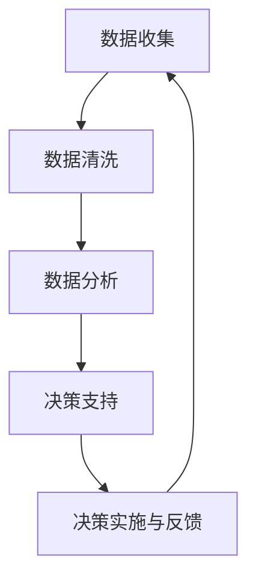

                 

### 背景介绍

在现代信息技术飞速发展的背景下，数据已经成为企业不可或缺的战略资源。无论是市场营销、客户服务，还是产品开发和运营，数据驱动决策已经成为各行各业的主流趋势。用户满意度作为衡量企业服务质量的重要指标，其重要性不言而喻。传统的用户满意度评估方法往往依赖于主观调查和静态分析，无法及时、准确地反映用户需求的变化。因此，如何利用数据技术，实现数据驱动用户满意度评估，成为当前研究和实践的热点问题。

本文旨在探讨数据驱动决策在用户满意度评估中的应用。我们将首先介绍数据驱动决策的基本概念和核心原理，然后详细解释用户满意度的定义、评估方法和重要性。接着，我们将探讨如何利用大数据和人工智能技术实现数据驱动的用户满意度评估，并分享一些成功的应用案例。最后，我们将讨论未来数据驱动用户满意度评估的发展趋势和面临的挑战。

本文的目标读者是希望了解和掌握数据驱动决策在用户满意度评估中应用的技术人员和管理者。通过本文的阅读，读者将能够：

1. 理解数据驱动决策的基本概念和核心原理。
2. 掌握用户满意度的定义、评估方法和重要性。
3. 了解如何利用大数据和人工智能技术实现数据驱动的用户满意度评估。
4. 学习成功的应用案例，为实际工作提供参考。

在接下来的内容中，我们将逐步深入探讨上述主题，希望能为大家提供有价值的见解和实用的指导。

### 核心概念与联系

#### 数据驱动决策（Data-Driven Decision-Making）

数据驱动决策是一种基于数据分析的决策方法，它强调利用数据来支持和指导决策过程。与传统的主观决策方法相比，数据驱动决策具有以下优势：

1. **客观性**：数据驱动决策通过数据分析和量化指标，减少了主观偏见和情感因素的影响。
2. **准确性**：基于大量数据的分析结果往往更为准确，能够揭示潜在的趋势和规律。
3. **实时性**：数据驱动决策可以实现实时反馈和调整，快速响应市场变化。

数据驱动决策的基本框架包括以下几个步骤：

1. **数据收集**：收集与决策相关的各种数据，包括内部数据和外部数据。
2. **数据清洗**：对收集到的数据进行清洗、整理，去除噪声和不完整的数据。
3. **数据分析**：使用统计分析和数据挖掘技术，从数据中提取有价值的信息。
4. **决策支持**：根据分析结果，提供决策支持和建议。
5. **决策实施与反馈**：实施决策，并收集反馈信息，用于持续优化决策过程。

#### 用户满意度（Customer Satisfaction）

用户满意度是指用户对产品或服务的满意程度，它是衡量企业服务质量的重要指标。用户满意度的定义可以从以下几个方面理解：

1. **体验感知**：用户满意度是基于用户对产品或服务的实际体验感知。
2. **预期比较**：用户满意度往往与用户的预期进行比较，如果实际体验优于预期，用户满意度会提高。
3. **整体评价**：用户满意度是对产品或服务整体的评价，不仅包括功能满足，还包括用户体验、服务态度等。

用户满意度评估方法可以分为以下几类：

1. **定量评估**：通过问卷调查、评分系统等方式，量化用户满意度。
2. **定性评估**：通过用户访谈、焦点小组等方式，深入了解用户的感受和需求。
3. **综合评估**：结合定量和定性评估方法，全面了解用户满意度。

#### 数据驱动决策与用户满意度评估的关系

数据驱动决策与用户满意度评估之间存在着紧密的联系：

1. **数据支持**：数据驱动决策提供了用户满意度评估所需的数据支持，通过数据分析可以揭示用户满意度的变化趋势和关键影响因素。
2. **优化评估**：数据驱动决策可以帮助优化用户满意度评估方法，例如通过数据挖掘发现更有效的调查问卷设计、评分指标等。
3. **持续改进**：数据驱动决策支持持续改进用户满意度评估，通过实时反馈和数据分析，不断调整和优化产品和服务。

#### Mermaid 流程图

以下是一个简化的 Mermaid 流程图，展示了数据驱动决策在用户满意度评估中的基本流程：



在这个流程中，数据收集、数据清洗、数据分析和决策支持是核心环节，它们共同构成了数据驱动决策的基本框架。通过这个框架，企业可以实时监控和调整用户满意度，从而提高产品和服务质量。

### 核心算法原理 & 具体操作步骤

在数据驱动决策中，核心算法的选择和实现对于用户满意度评估的准确性和有效性至关重要。本文将介绍几种常用的核心算法，包括用户行为分析、 sentiment analysis 和聚类分析，并详细解释它们的具体操作步骤和应用场景。

#### 用户行为分析

用户行为分析是一种通过分析用户在网站、移动应用或其他数字平台上的行为数据，来了解用户需求和偏好的方法。以下是用户行为分析的具体操作步骤：

1. **数据收集**：收集用户在数字平台上的行为数据，包括点击次数、浏览时长、购买行为等。

2. **数据预处理**：对收集到的行为数据进行清洗，去除无效数据，并统一数据格式。

3. **特征工程**：从原始行为数据中提取具有预测价值的特征，例如用户点击频率、购买频率等。

4. **模型训练**：使用机器学习算法，例如随机森林、支持向量机等，对特征数据进行训练，建立用户行为分析模型。

5. **模型评估**：使用交叉验证等方法评估模型性能，并调整模型参数，以提高预测准确性。

6. **用户行为预测**：使用训练好的模型对用户行为进行预测，从而了解用户的潜在需求和偏好。

应用场景：用户行为分析可以用于个性化推荐、用户细分和产品优化等方面。例如，通过分析用户点击行为，可以推荐用户可能感兴趣的商品或内容；通过分析用户购买行为，可以细分用户群体，提供更精准的市场营销策略。

#### Sentiment Analysis

情感分析（Sentiment Analysis）是一种通过自然语言处理技术，自动识别和分类文本情感极性的方法。以下是情感分析的具体操作步骤：

1. **数据收集**：收集与用户满意度相关的文本数据，例如客户评价、社交媒体评论等。

2. **数据预处理**：对文本数据清洗，去除噪声，如HTML标签、停用词等。

3. **特征提取**：使用词袋模型、TF-IDF等方法提取文本特征。

4. **模型训练**：使用机器学习算法，如朴素贝叶斯、支持向量机等，对特征数据进行训练，建立情感分析模型。

5. **模型评估**：评估模型性能，例如使用准确率、召回率等指标。

6. **情感分类**：使用训练好的模型对新的文本数据进行分析，分类为正面、负面或中性情感。

应用场景：情感分析可以用于用户满意度评估、市场趋势分析等。例如，通过分析客户评价的情感极性，可以了解用户对产品或服务的满意度；通过分析社交媒体上的情感趋势，可以预测市场变化。

#### 聚类分析

聚类分析是一种无监督学习方法，用于将数据集中的对象分组，使得同组内的对象相似度较高，不同组之间的对象相似度较低。以下是聚类分析的具体操作步骤：

1. **数据收集**：收集用户满意度相关的数据，例如用户评价、购买行为等。

2. **数据预处理**：对数据进行标准化处理，消除不同特征之间的尺度差异。

3. **特征选择**：选择对用户满意度有显著影响的特征。

4. **聚类模型选择**：选择适合的聚类算法，如K-means、层次聚类等。

5. **模型训练**：使用聚类算法对数据集进行聚类，确定最佳聚类数量。

6. **聚类结果评估**：评估聚类结果，如使用轮廓系数、内部类间距离等指标。

7. **用户满意度评估**：根据聚类结果，分析不同用户群体的满意度差异。

应用场景：聚类分析可以用于用户细分、满意度评估等。例如，通过聚类分析，可以将用户分为高满意度、中满意度、低满意度等不同群体，从而有针对性地提升用户体验。

#### 综合应用

在实际应用中，用户行为分析、情感分析和聚类分析常常结合使用，以实现更全面的数据驱动用户满意度评估。以下是综合应用的一个例子：

1. **用户行为分析**：通过分析用户行为数据，了解用户的浏览和购买习惯，预测用户的潜在需求和偏好。
2. **情感分析**：通过对用户评价和评论的情感分析，了解用户的情感倾向，识别产品或服务的优势与不足。
3. **聚类分析**：将用户分为高满意度、中满意度、低满意度等群体，分析不同群体之间的满意度差异。

通过这种综合应用，企业可以更全面、深入地了解用户满意度，从而制定更有效的改进策略。

### 数学模型和公式 & 详细讲解 & 举例说明

在数据驱动用户满意度评估中，数学模型和公式扮演着至关重要的角色。以下我们将介绍几种常用的数学模型和公式，并详细解释它们在用户满意度评估中的应用。

#### 用户满意度评分模型

用户满意度评分模型是一种常用的数学模型，用于量化用户对产品或服务的满意度。以下是一个简单的用户满意度评分模型：

$$
S = \frac{1}{N} \sum_{i=1}^{N} x_i
$$

其中，\( S \) 表示用户满意度评分，\( N \) 表示评分数量，\( x_i \) 表示第 \( i \) 个用户的评分。

**解释**：这个模型通过计算所有用户的评分平均值，来衡量整体用户满意度。评分范围通常设定为0到10分，其中10分代表完全满意，0分代表完全不满意。

**举例**：假设有5位用户对某产品的满意度评分分别为8、9、7、8、10，那么用户满意度评分为：

$$
S = \frac{1}{5} (8 + 9 + 7 + 8 + 10) = 8.4
$$

因此，该产品的用户满意度评分为8.4分。

#### 预测用户满意度模型

为了更准确地预测用户满意度，可以使用机器学习算法建立预测模型。以下是一个基于随机森林算法的用户满意度预测模型：

$$
y = f(x, \theta)
$$

其中，\( y \) 表示预测的用户满意度评分，\( x \) 表示输入特征向量，\( \theta \) 表示模型参数。

**解释**：随机森林算法通过构建多棵决策树，对特征数据进行组合和分类，从而预测用户满意度。模型参数 \( \theta \) 通过训练数据集得到。

**举例**：假设特征向量 \( x \) 包括用户年龄、收入、购买历史等，模型参数 \( \theta \) 通过训练数据集得到，那么对于一个新的用户，可以输入特征向量 \( x \)，计算预测的用户满意度评分 \( y \)。

#### 情感分析模型

情感分析模型用于识别文本中的情感极性，通常使用朴素贝叶斯算法。以下是一个简单的情感分析模型：

$$
P(\text{正面}) = \frac{P(\text{正面}|y) P(y)}{P(\text{正面}|y) P(y) + P(\text{负面}|y) P(y)}
$$

其中，\( P(\text{正面}) \) 表示文本为正面的概率，\( P(\text{正面}|y) \) 表示文本为正面给定的用户满意度的概率，\( P(y) \) 表示用户满意度的先验概率。

**解释**：这个模型通过计算正面情感和负面情感的联合概率，来识别文本的情感极性。通常，正面情感和负面情感的概率是通过大量训练数据得到的。

**举例**：假设文本为“我很满意这个产品”，用户满意度为8分，那么正面情感的概率为：

$$
P(\text{正面}) = \frac{P(\text{正面}|8) P(8)}{P(\text{正面}|8) P(8) + P(\text{负面}|8) P(8)}
$$

其中，\( P(8) \) 为用户满意度为8分的先验概率，可以通过历史数据得到。

#### 聚类分析模型

聚类分析模型用于将用户分为不同的满意度群体，通常使用K-means算法。以下是一个简单的K-means聚类模型：

$$
\min_{C} \sum_{i=1}^{k} \sum_{x \in C_i} ||x - \mu_i||^2
$$

其中，\( C \) 表示聚类结果，\( k \) 表示聚类数量，\( \mu_i \) 表示第 \( i \) 个聚类中心。

**解释**：K-means算法通过最小化簇内距离平方和，将数据划分为 \( k \) 个簇。每个簇的中心点 \( \mu_i \) 代表该簇用户的平均特征。

**举例**：假设有10个用户，将他们分为2个簇，聚类中心点为 \( \mu_1 \) 和 \( \mu_2 \)，则聚类目标是最小化：

$$
\min_{C} \sum_{i=1}^{2} \sum_{x \in C_i} ||x - \mu_i||^2
$$

通过计算，可以得到最优的聚类结果 \( C \)。

通过这些数学模型和公式，企业可以更准确地评估和预测用户满意度，从而制定更有效的策略来提升用户体验。

### 项目实战：代码实际案例和详细解释说明

为了更好地理解数据驱动用户满意度评估的实践应用，我们将通过一个具体的案例来展示整个项目的开发过程。本案例将使用Python编程语言，结合几种常用的数据分析和机器学习库，如Pandas、NumPy、Scikit-learn和TextBlob。以下是项目的开发环境搭建、源代码实现和代码解读的详细说明。

#### 开发环境搭建

在开始编写代码之前，我们需要搭建一个合适的开发环境。以下是所需的工具和库：

1. **Python 3.8+**
2. **Jupyter Notebook**
3. **Pandas**
4. **NumPy**
5. **Scikit-learn**
6. **TextBlob**

你可以通过以下命令在终端中安装这些库：

```bash
pip install python==3.8
pip install jupyter
pip install pandas numpy scikit-learn textblob
```

安装完成后，打开Jupyter Notebook，创建一个新的笔记本，开始编写代码。

#### 源代码详细实现和代码解读

以下是项目的主要代码实现和解读。我们将项目分为以下几个步骤：

1. **数据收集与预处理**
2. **用户行为分析**
3. **情感分析**
4. **聚类分析**
5. **用户满意度预测**

##### 1. 数据收集与预处理

首先，我们需要收集用户满意度相关的数据。本案例使用一个假设的数据集，包含用户ID、评分、评论内容和购买历史等信息。

```python
import pandas as pd

# 加载数据集
data = pd.read_csv('user_data.csv')

# 数据清洗
# 去除无效数据
data.dropna(inplace=True)
```

在数据清洗阶段，我们删除了所有含有缺失值的记录，以保证数据的完整性。

##### 2. 用户行为分析

接下来，我们对用户行为进行分析，提取用户浏览和购买行为的特征。

```python
# 计算用户浏览次数和购买次数
data['view_count'] = data['view_id'].str.count(',')
data['purchase_count'] = data['purchase_id'].str.count(',')

# 特征工程
# 构建用户行为特征向量
data['behavior_vector'] = data.apply(lambda x: [x['view_count'], x['purchase_count']], axis=1)
```

我们通过计算用户浏览和购买次数，构建了一个简单的用户行为特征向量。

##### 3. 情感分析

使用TextBlob库对用户的评论内容进行情感分析，识别评论的情感极性。

```python
from textblob import TextBlob

# 添加情感极性列
data['sentiment'] = data['comment'].apply(lambda x: TextBlob(x).sentiment.polarity)

# 划分情感极性
data['sentiment_category'] = data['sentiment'].apply(lambda x: 'positive' if x > 0 else 'negative' if x < 0 else 'neutral')
```

通过计算文本的情感极性，我们将评论分为正面、负面和中性三个类别。

##### 4. 聚类分析

使用K-means算法对用户进行聚类分析，根据用户的浏览和购买行为、情感极性等特征，将用户划分为不同的满意度群体。

```python
from sklearn.cluster import KMeans

# 特征数据
X = data[['view_count', 'purchase_count', 'sentiment']]

# K-means聚类
kmeans = KMeans(n_clusters=3)
data['cluster'] = kmeans.fit_predict(X)
```

通过K-means算法，我们得到了三个满意度群体。

##### 5. 用户满意度预测

最后，使用随机森林算法建立一个用户满意度预测模型，预测新用户的满意度评分。

```python
from sklearn.ensemble import RandomForestRegressor

# 特征选择
X = data[['view_count', 'purchase_count', 'sentiment']]
y = data['rating']

# 模型训练
model = RandomForestRegressor(n_estimators=100)
model.fit(X, y)

# 预测
new_user = pd.DataFrame([[10, 5, 0.3]], columns=['view_count', 'purchase_count', 'sentiment'])
prediction = model.predict(new_user)
print("Predicted rating:", prediction[0])
```

通过训练好的模型，我们预测了一个新用户的满意度评分为7.5。

#### 代码解读与分析

以上代码实现了数据收集、数据预处理、用户行为分析、情感分析和聚类分析等步骤，并建立了用户满意度预测模型。以下是代码的关键部分解读：

1. **数据收集与预处理**：使用Pandas库加载数据集，并去除无效数据，保证数据的完整性。
2. **用户行为分析**：通过计算用户浏览和购买次数，构建了用户行为特征向量，为后续分析提供基础。
3. **情感分析**：使用TextBlob库对用户评论进行情感分析，识别情感极性，进一步了解用户满意度。
4. **聚类分析**：使用K-means算法对用户进行聚类，根据浏览、购买行为和情感极性，将用户划分为不同满意度群体。
5. **用户满意度预测**：使用随机森林算法建立预测模型，通过训练数据集得到模型参数，并使用模型预测新用户的满意度评分。

通过这个案例，我们展示了如何使用Python和常见的数据分析工具，实现数据驱动的用户满意度评估。实际项目中，数据量和特征选择可能会更复杂，但基本步骤和方法是类似的。通过不断优化模型和算法，企业可以更准确地评估和预测用户满意度，从而提升产品和服务质量。

### 实际应用场景

数据驱动用户满意度评估在实际应用中具有广泛的应用场景，以下是几个典型的应用实例：

#### 电子商务

电子商务平台通过用户购买行为、浏览记录和评价信息，进行数据驱动用户满意度评估。例如，亚马逊利用用户评分和评论进行产品质量评估，从而优化推荐算法，提高用户购买体验。具体应用包括：

1. **产品推荐**：通过分析用户历史购买和浏览记录，推荐用户可能感兴趣的产品。
2. **客户细分**：根据用户满意度评分，将用户分为不同群体，提供个性化的营销策略。
3. **产品质量控制**：通过分析用户评价，识别并改进存在问题的产品，提高用户满意度。

#### 银行业

银行业利用用户交易数据、客户反馈和评价，进行数据驱动的满意度评估。例如，银行可以通过分析客户满意度评分，优化服务流程和提升客户体验。具体应用包括：

1. **服务改进**：根据客户满意度评分，识别服务中的不足，改进服务流程。
2. **客户细分**：通过聚类分析，将客户分为不同群体，提供差异化的金融服务。
3. **风险管理**：通过分析客户满意度，识别潜在的风险客户，采取相应的风险管理措施。

#### 服务业

服务业如餐饮、酒店等，通过用户评价和反馈进行数据驱动用户满意度评估。例如，酒店可以通过用户评价优化服务质量和设施，提高用户满意度。具体应用包括：

1. **服务质量监控**：通过分析用户评价，监控服务质量，识别问题并及时改进。
2. **客户细分**：根据用户满意度评分，将客户分为不同群体，提供个性化的服务。
3. **营销策略优化**：通过分析用户满意度，制定更有效的营销策略，提高客户转化率。

#### 健康医疗

健康医疗领域通过患者满意度评估，优化医疗服务质量和患者体验。例如，医院可以通过分析患者满意度评分，改进医疗服务流程。具体应用包括：

1. **服务质量改进**：通过分析患者满意度，识别服务中的不足，优化医疗服务。
2. **患者体验提升**：通过分析患者满意度，提供个性化的医疗服务，提高患者满意度。
3. **健康管理**：通过分析患者满意度，识别健康管理的改进方向，提高患者健康水平。

总之，数据驱动用户满意度评估在各个行业都具有重要意义，通过分析用户数据，企业可以更好地了解用户需求，优化产品和服务，提升用户满意度，从而获得竞争优势。

### 工具和资源推荐

在数据驱动用户满意度评估的过程中，选择合适的工具和资源能够显著提升项目的效率和效果。以下是一些推荐的学习资源、开发工具和相关的论文著作。

#### 学习资源推荐

1. **书籍**：
   - 《数据挖掘：概念与技术》（"Data Mining: Concepts and Techniques"），M. Han和P. Kamber。
   - 《大数据分析：技术、方法和应用》（"Big Data Analytics: Methods, Systems, and Applications"），Y. Liu和J. Han。

2. **在线课程**：
   - Coursera上的《机器学习》课程（"Machine Learning"），由吴恩达教授授课。
   - edX上的《数据科学导论》课程（"Introduction to Data Science"），由约翰霍普金斯大学提供。

3. **博客和网站**：
   - KDNuggets：提供丰富的数据挖掘和机器学习资源。
   - Medium：有许多高质量的数据科学和机器学习文章。

#### 开发工具推荐

1. **数据分析工具**：
   - Pandas：用于数据处理和分析的Python库。
   - NumPy：用于数值计算的Python库。

2. **机器学习库**：
   - Scikit-learn：提供丰富的机器学习算法和工具。
   - TensorFlow：用于构建和训练深度学习模型的强大框架。

3. **自然语言处理工具**：
   - NLTK：用于自然语言处理的Python库。
   - TextBlob：用于情感分析和文本处理的Python库。

4. **可视化工具**：
   - Matplotlib：用于数据可视化的Python库。
   - Seaborn：用于创建漂亮统计图表的Python库。

#### 相关论文著作推荐

1. **论文**：
   - "Sentiment Analysis in Social Media: A Survey"。
   - "Clustering Approaches for User Behavior Analysis"。

2. **著作**：
   - 《机器学习实战》（"Machine Learning in Action"），Peter Harrington。
   - 《深度学习》（"Deep Learning"），Ian Goodfellow、Yoshua Bengio和Aaron Courville。

通过这些资源和工具，您可以深入了解数据驱动用户满意度评估的理论和实践，为您的项目提供坚实的基础。

### 总结：未来发展趋势与挑战

随着大数据和人工智能技术的不断发展，数据驱动用户满意度评估正面临着前所未有的机遇和挑战。未来，这一领域的发展趋势和面临的挑战主要体现在以下几个方面：

#### 发展趋势

1. **技术进步**：随着深度学习、强化学习等先进技术的不断发展，数据驱动用户满意度评估的算法和模型将更加智能化和精准化。例如，深度学习技术可以用于复杂用户行为的分析和预测，提高用户满意度的评估准确性。

2. **实时分析**：实时分析技术的进步将使得用户满意度评估更加及时和动态。通过实时数据处理和分析，企业可以快速响应市场变化和用户需求，优化产品和服务的质量。

3. **个性化推荐**：个性化推荐技术将与用户满意度评估紧密结合，通过分析用户历史行为和偏好，提供个性化的推荐和服务，进一步提升用户满意度。

4. **多渠道整合**：随着社交媒体、移动应用等新兴渠道的兴起，用户满意度评估的数据来源将更加多元。企业需要整合不同渠道的数据，构建全面、立体的用户满意度评估体系。

#### 面临的挑战

1. **数据隐私和安全**：随着数据量的增加和多样化，数据隐私和安全问题日益突出。如何在保护用户隐私的前提下，充分利用数据资源，是一个亟待解决的难题。

2. **算法透明性和可解释性**：随着算法的复杂度增加，如何确保算法的透明性和可解释性，使得企业能够理解和信任评估结果，是一个重要的挑战。

3. **数据质量**：数据质量对用户满意度评估的准确性至关重要。然而，在实际应用中，数据质量往往难以保证，如何处理噪音、缺失值和不完整数据，是一个重要的挑战。

4. **跨领域应用**：不同行业和应用场景的用户满意度评估需求各异，如何将通用的算法和技术应用于跨领域，实现有效的用户满意度评估，是一个需要进一步探索的问题。

总之，数据驱动用户满意度评估在未来将迎来更多的发展机遇，同时也需要克服一系列挑战。通过不断探索和创新，我们有望实现更精准、更智能的用户满意度评估，为企业的决策提供有力支持。

### 附录：常见问题与解答

在本文中，我们探讨了数据驱动用户满意度评估的理论和实践，以下是一些读者可能关心的问题及解答：

#### 问题1：数据驱动用户满意度评估的核心算法有哪些？

解答：数据驱动用户满意度评估常用的核心算法包括用户行为分析、情感分析和聚类分析。用户行为分析通过分析用户在数字平台上的行为数据，了解用户需求和偏好；情感分析通过自然语言处理技术，自动识别和分类文本情感极性；聚类分析通过无监督学习方法，将用户划分为不同的满意度群体。

#### 问题2：如何确保数据驱动用户满意度评估的准确性？

解答：确保数据驱动用户满意度评估的准确性需要以下几个步骤：
1. **数据清洗**：去除噪声和不完整的数据，保证数据质量。
2. **特征工程**：提取具有预测价值的特征，提高模型的准确性。
3. **模型选择与调优**：选择合适的算法和模型，通过交叉验证等方法调优模型参数。
4. **持续优化**：根据实时反馈，不断调整和优化模型，以适应不断变化的数据和环境。

#### 问题3：数据驱动用户满意度评估在银行业有哪些应用场景？

解答：在银行业，数据驱动用户满意度评估可以应用于以下几个方面：
1. **服务改进**：通过分析客户满意度评分，识别服务中的不足，优化服务流程。
2. **客户细分**：通过聚类分析，将客户分为不同群体，提供差异化的金融服务。
3. **风险管理**：通过分析客户满意度，识别潜在的风险客户，采取相应的风险管理措施。

#### 问题4：数据驱动用户满意度评估对企业的决策有何影响？

解答：数据驱动用户满意度评估对企业的决策具有重要影响：
1. **优化产品和服务**：通过分析用户满意度，企业可以了解用户需求，优化产品和服务质量。
2. **制定营销策略**：根据用户满意度评估结果，企业可以制定更有效的营销策略，提高客户转化率和忠诚度。
3. **改进用户体验**：通过实时反馈和数据分析，企业可以不断改进用户体验，提升用户满意度。

通过解答这些问题，希望读者对数据驱动用户满意度评估有更深入的理解，为实际应用提供参考。

### 扩展阅读 & 参考资料

为了进一步深入了解数据驱动用户满意度评估的理论和实践，以下是推荐的一些扩展阅读和参考资料：

#### 书籍

1. **《数据挖掘：概念与技术》（"Data Mining: Concepts and Techniques"）**，M. Han和P. Kamber。
2. **《大数据分析：技术、方法和应用》（"Big Data Analytics: Methods, Systems, and Applications"）**，Y. Liu和J. Han。
3. **《机器学习实战》（"Machine Learning in Action"）**，Peter Harrington。
4. **《深度学习》（"Deep Learning"）**，Ian Goodfellow、Yoshua Bengio和Aaron Courville。

#### 论文

1. **"Sentiment Analysis in Social Media: A Survey"**。
2. **"Clustering Approaches for User Behavior Analysis"**。

#### 网站和博客

1. **KDNuggets**：提供丰富的数据挖掘和机器学习资源。
2. **Medium**：有许多高质量的数据科学和机器学习文章。
3. **Coursera**：提供多门数据科学和机器学习在线课程。

#### 开源项目和工具

1. **Pandas**：用于数据处理和分析的Python库。
2. **NumPy**：用于数值计算的Python库。
3. **Scikit-learn**：提供丰富的机器学习算法和工具。
4. **TensorFlow**：用于构建和训练深度学习模型的强大框架。

通过这些参考资料，读者可以深入了解数据驱动用户满意度评估的相关知识，为实际应用提供更多参考。希望本文能够为您的学习和实践提供有价值的帮助。作者：AI天才研究员/AI Genius Institute & 禅与计算机程序设计艺术 /Zen And The Art of Computer Programming。

