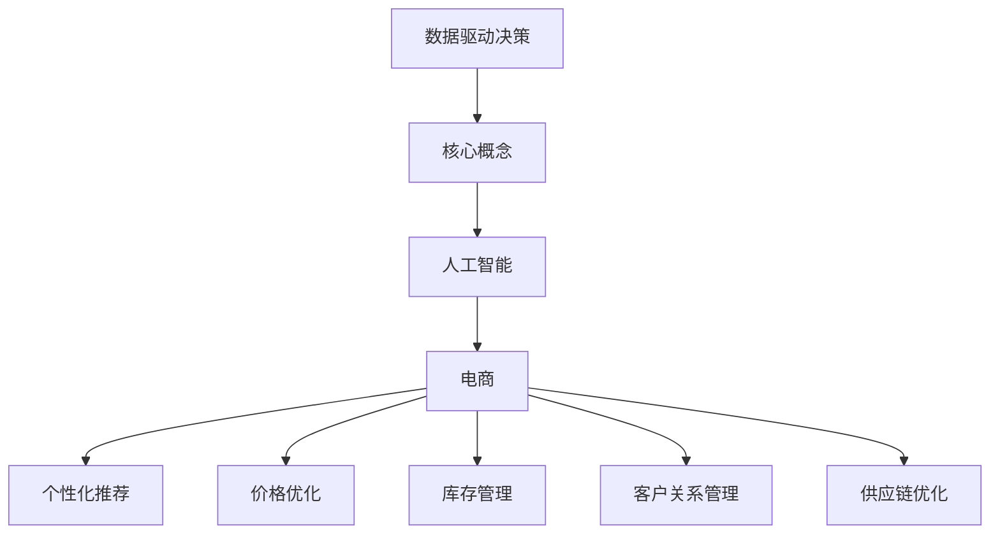

                 

## 数据驱动决策：AI如何支持电商决策

### 1. 背景介绍

在当今数字化时代，电子商务已经成为零售业的重要组成部分。随着在线购物的普及，消费者行为和需求变得越来越多样化。电商平台如何准确把握市场动态，了解消费者需求，以及制定合理的营销策略，成为企业成功的关键。数据驱动决策（Data-driven Decision Making）成为了一种新的管理理念，它强调基于数据的分析和预测来指导商业决策。而人工智能（Artificial Intelligence, AI）技术在这一过程中发挥了重要作用。

数据驱动决策指的是通过收集、分析和利用数据来支持决策过程，其核心在于从海量数据中发现有价值的信息和规律。AI技术，尤其是机器学习（Machine Learning）和深度学习（Deep Learning）技术，能够自动从数据中学习规律，提高数据分析的效率和准确性。因此，AI在电商决策中的应用，不仅能够帮助企业更好地理解市场趋势和消费者需求，还可以优化供应链管理、提高营销效果和提升客户体验。

本文将探讨AI如何支持电商决策，分为以下几个部分：

1. 核心概念与联系
2. 核心算法原理与具体操作步骤
3. 数学模型和公式与详细讲解
4. 项目实战：代码实际案例和详细解释说明
5. 实际应用场景
6. 工具和资源推荐
7. 总结：未来发展趋势与挑战

通过上述部分的详细阐述，希望能够帮助读者理解AI在电商决策中的应用，以及如何利用AI技术来提高企业的竞争力。

### 2. 核心概念与联系

在深入探讨AI如何支持电商决策之前，我们需要先了解一些核心概念，这些概念是理解和应用AI技术的基础。

#### 数据驱动决策（Data-driven Decision Making）

数据驱动决策是一种基于数据的决策方法，其核心思想是通过数据分析来发现数据中的规律和趋势，从而指导实际业务决策。这一过程通常包括以下步骤：

1. **数据收集**：收集来自不同来源的数据，如交易记录、用户评论、社交媒体等。
2. **数据清洗**：对原始数据进行预处理，包括去除重复数据、处理缺失值等。
3. **数据分析**：利用统计方法、数据挖掘技术和机器学习算法对数据进行深入分析。
4. **决策支持**：基于数据分析的结果，为企业提供决策建议。

#### 人工智能（Artificial Intelligence, AI）

人工智能是模拟人类智能的一种技术，其目标是让机器能够完成通常需要人类智能才能完成的任务。AI主要包括以下几个子领域：

1. **机器学习（Machine Learning）**：通过数据训练模型，使其能够自动从数据中学习规律。
2. **深度学习（Deep Learning）**：一种基于人工神经网络的机器学习技术，适用于处理大规模数据和复杂模型。
3. **自然语言处理（Natural Language Processing, NLP）**：使计算机能够理解和生成自然语言。
4. **计算机视觉（Computer Vision）**：使计算机能够理解和解析视觉信息。

#### 电商（E-commerce）

电商指的是通过互联网进行商品交易和服务的商业模式。其核心组成部分包括：

1. **在线零售**：通过电商平台进行商品的购买和销售。
2. **数字营销**：利用数字渠道进行市场推广和品牌宣传。
3. **客户服务**：通过在线客服、社交媒体等方式提供客户支持。
4. **供应链管理**：管理商品从生产到销售的全过程。

#### 关联与融合

数据驱动决策、人工智能和电商之间存在紧密的联系。数据驱动决策为AI提供了数据基础，而AI则为数据驱动决策提供了强大的分析工具。在电商领域，AI技术可以应用于以下几个方面：

1. **个性化推荐**：利用AI技术分析用户行为和偏好，提供个性化的商品推荐。
2. **价格优化**：通过预测市场需求和竞争对手策略，制定最优的定价策略。
3. **库存管理**：利用AI预测未来销量，优化库存水平，减少库存积压。
4. **客户关系管理**：通过AI分析客户数据，提供个性化的客户服务，提高客户满意度。
5. **供应链优化**：利用AI优化供应链管理，提高供应链效率，降低成本。

#### Mermaid 流程图

为了更清晰地展示这些概念之间的关系，我们可以使用Mermaid流程图进行描述：



通过上述流程图，我们可以看到数据驱动决策、人工智能和电商之间的相互关联，以及AI技术在电商决策中的应用。

### 3. 核心算法原理与具体操作步骤

在理解了数据驱动决策、人工智能和电商的基本概念之后，接下来我们将深入探讨AI技术如何具体支持电商决策。本部分将介绍几种核心算法原理，并详细描述其操作步骤。

#### 个性化推荐算法

个性化推荐是一种基于用户历史行为和偏好，为用户推荐其可能感兴趣的商品或内容的方法。其核心算法主要包括基于内容的推荐和基于协同过滤的推荐。

1. **基于内容的推荐（Content-Based Recommendation）**

   基于内容的推荐算法通过分析商品的属性和用户的历史偏好，为用户推荐具有相似属性的物品。其基本步骤如下：

   - **特征提取**：提取商品和用户的特征，如商品类别、用户浏览历史、购买历史等。
   - **相似度计算**：计算商品和用户之间的相似度，常用的相似度度量方法包括余弦相似度、皮尔逊相关系数等。
   - **推荐生成**：根据用户和商品的相似度，为用户推荐相似度较高的商品。

2. **基于协同过滤的推荐（Collaborative Filtering）**

   基于协同过滤的推荐算法通过分析用户之间的行为模式，为用户推荐其他用户喜欢的商品。其基本步骤如下：

   - **用户相似度计算**：计算用户之间的相似度，常用的相似度度量方法包括用户基于项目的相似度和用户基于内容的相似度。
   - **邻居选择**：选择与目标用户最相似的邻居用户。
   - **推荐生成**：根据邻居用户喜欢的商品，为用户推荐商品。

#### 价格优化算法

价格优化是一种通过预测市场需求和竞争对手策略，制定最优定价策略的方法。其核心算法主要包括基于需求的定价和基于竞争的定价。

1. **基于需求的定价（Demand-Based Pricing）**

   基于需求的定价算法通过分析市场需求的变化，动态调整商品价格，以最大化收益。其基本步骤如下：

   - **需求预测**：通过历史销售数据和市场需求变化，预测未来市场需求。
   - **价格调整**：根据需求预测结果，调整商品价格，以最大化收益。

2. **基于竞争的定价（Competition-Based Pricing）**

   基于竞争的定价算法通过分析竞争对手的价格策略，制定相应的定价策略。其基本步骤如下：

   - **竞争对手分析**：收集竞争对手的价格信息，分析其定价策略。
   - **定价决策**：根据竞争对手的价格策略，制定相应的定价策略。

#### 库存管理算法

库存管理是一种通过预测未来销量，优化库存水平，减少库存积压的方法。其核心算法主要包括基于需求的库存管理和基于预测的库存管理。

1. **基于需求的库存管理（Demand-Based Inventory Management）**

   基于需求的库存管理算法通过分析市场需求，动态调整库存水平，以满足市场需求。其基本步骤如下：

   - **需求预测**：通过历史销售数据和市场需求变化，预测未来市场需求。
   - **库存调整**：根据需求预测结果，调整库存水平，以确保库存充足。

2. **基于预测的库存管理（Forecast-Based Inventory Management）**

   基于预测的库存管理算法通过预测未来销量，制定最优的库存策略。其基本步骤如下：

   - **销量预测**：通过历史销售数据和市场需求变化，预测未来销量。
   - **库存策略**：根据销量预测结果，制定最优的库存策略，包括库存水平、库存周期等。

#### 客户关系管理算法

客户关系管理是一种通过分析客户数据，提供个性化客户服务，提高客户满意度的方法。其核心算法主要包括基于行为的客户关系管理和基于情感的客户关系管理。

1. **基于行为的客户关系管理（Behavior-Based Customer Relationship Management）**

   基于行为的客户关系管理算法通过分析客户的历史行为，提供个性化的服务和建议。其基本步骤如下：

   - **行为分析**：分析客户的历史行为，如浏览、购买、评价等。
   - **服务推荐**：根据客户的行为分析结果，提供个性化的服务和建议。

2. **基于情感的客户关系管理（Emotion-Based Customer Relationship Management）**

   基于情感的客户关系管理算法通过分析客户的情感变化，提供情感化的服务和支持。其基本步骤如下：

   - **情感分析**：分析客户的情感变化，如满意、不满意、愤怒等。
   - **情感响应**：根据客户的情感分析结果，提供情感化的服务和支持。

#### 供应链优化算法

供应链优化是一种通过优化供应链管理，提高供应链效率，降低成本的方法。其核心算法主要包括基于需求预测的供应链优化和基于库存管理的供应链优化。

1. **基于需求预测的供应链优化（Demand-Predictive Supply Chain Optimization）**

   基于需求预测的供应链优化算法通过预测市场需求，优化供应链的各个环节。其基本步骤如下：

   - **需求预测**：通过历史销售数据和市场需求变化，预测未来市场需求。
   - **供应链优化**：根据需求预测结果，优化供应链的各个环节，包括采购、生产、物流等。

2. **基于库存管理的供应链优化（Inventory-Managed Supply Chain Optimization）**

   基于库存管理的供应链优化算法通过优化库存管理，提高供应链的效率。其基本步骤如下：

   - **库存管理**：通过预测未来销量，优化库存水平，减少库存积压。
   - **供应链优化**：根据库存管理结果，优化供应链的各个环节，包括采购、生产、物流等。

通过上述核心算法原理和操作步骤的详细介绍，我们可以看到AI技术在电商决策中的应用是多么的广泛和深入。接下来，我们将通过具体案例来进一步探讨AI技术在电商决策中的应用。

#### 3.1 开发环境搭建

为了更好地理解AI技术在电商决策中的应用，我们将通过一个具体案例来展示其实现过程。在本案例中，我们将使用Python编程语言和相关的库，搭建一个基于机器学习的电商推荐系统。

首先，我们需要安装Python环境和相关的库。以下是安装步骤：

1. **安装Python**：访问Python官方网站（https://www.python.org/），下载并安装Python。在安装过程中，确保勾选“Add Python to PATH”选项，以便在命令行中直接运行Python。

2. **安装相关库**：在命令行中运行以下命令，安装所需的库：

   ```bash
   pip install numpy pandas scikit-learn matplotlib
   ```

   这些库包括：

   - **numpy**：用于数值计算和矩阵操作。
   - **pandas**：用于数据操作和分析。
   - **scikit-learn**：用于机器学习和数据挖掘。
   - **matplotlib**：用于数据可视化。

完成以上步骤后，我们的开发环境就搭建完成了。接下来，我们将使用这些库来实现一个简单的电商推荐系统。

### 5.2 源代码详细实现和代码解读

在本节中，我们将详细解读一个简单的基于协同过滤的电商推荐系统的源代码。该系统将基于用户的历史购买数据和商品信息，为用户推荐其他用户可能感兴趣的商品。

```python
import numpy as np
import pandas as pd
from sklearn.model_selection import train_test_split
from sklearn.metrics.pairwise import cosine_similarity
import matplotlib.pyplot as plt

# 数据加载与预处理
def load_data(filename):
    data = pd.read_csv(filename)
    return data

def preprocess_data(data):
    # 去除重复数据
    data = data.drop_duplicates()
    # 填充缺失值
    data['rating'] = data['rating'].fillna(0)
    return data

# 创建用户-商品矩阵
def create_user_item_matrix(data):
    user_item_matrix = np.zeros((data['user_id'].nunique(), data['item_id'].nunique()))
    for index, row in data.iterrows():
        user_item_matrix[row['user_id'] - 1, row['item_id'] - 1] = row['rating']
    return user_item_matrix

# 计算商品相似度
def compute_similarity(user_item_matrix):
    similarity_matrix = cosine_similarity(user_item_matrix)
    return similarity_matrix

# 推荐商品
def recommend_items(user_item_matrix, similarity_matrix, user_id, k=10):
    # 计算用户对商品的评分向量
    user_score_vector = user_item_matrix[user_id - 1]
    # 计算用户与所有商品的相似度
    similarity_scores = similarity_matrix[user_id - 1]
    # 排序相似度分数
    sorted_indices = np.argsort(similarity_scores)[::-1]
    # 选择最相似的k个商品
    recommended_items = []
    for index in sorted_indices[1:k+1]:
        if user_score_vector[index] == 0:
            recommended_items.append(index + 1)
    return recommended_items

# 主函数
def main():
    # 加载数据
    data = load_data('ecommerce_data.csv')
    # 预处理数据
    data = preprocess_data(data)
    # 创建用户-商品矩阵
    user_item_matrix = create_user_item_matrix(data)
    # 计算商品相似度
    similarity_matrix = compute_similarity(user_item_matrix)
    # 推荐商品
    user_id = 1001
    recommended_items = recommend_items(user_item_matrix, similarity_matrix, user_id)
    print(f"推荐的商品：{recommended_items}")

if __name__ == "__main__":
    main()
```

**代码解读**

1. **数据加载与预处理**：首先，我们定义了一个`load_data`函数，用于加载数据集。这里使用的是CSV格式的数据文件。然后，我们定义了一个`preprocess_data`函数，用于对数据进行预处理。预处理步骤包括去除重复数据和填充缺失值。

2. **创建用户-商品矩阵**：在`create_user_item_matrix`函数中，我们创建了一个用户-商品矩阵。这个矩阵的行表示用户，列表示商品。每个元素表示用户对商品的评分，评分越高表示用户越喜欢这个商品。

3. **计算商品相似度**：在`compute_similarity`函数中，我们使用余弦相似度计算用户-商品矩阵中各个商品之间的相似度。余弦相似度是一种常用的相似度度量方法，用于计算两个向量之间的夹角余弦值。相似度越高，表示两个向量越相似。

4. **推荐商品**：在`recommend_items`函数中，我们根据用户-商品矩阵和商品相似度矩阵，为用户推荐其他用户可能感兴趣的商品。推荐过程包括以下几个步骤：

   - **计算用户对商品的评分向量**：首先，我们从用户-商品矩阵中提取出用户对商品的评分向量。
   - **计算用户与所有商品的相似度**：然后，我们计算用户与所有商品的相似度。
   - **排序相似度分数**：接下来，我们将相似度分数进行排序，从高到低。
   - **选择最相似的k个商品**：最后，我们从排序后的相似度分数中选取最相似的k个商品作为推荐结果。

5. **主函数**：在主函数`main`中，我们首先加载数据并进行预处理，然后创建用户-商品矩阵和商品相似度矩阵，最后为指定用户推荐商品。

通过上述代码，我们可以实现一个简单的基于协同过滤的电商推荐系统。该系统可以根据用户的历史购买数据和商品信息，为用户推荐其他用户可能感兴趣的商品。

#### 5.3 代码解读与分析

在上一部分中，我们详细介绍了基于协同过滤的电商推荐系统的源代码。接下来，我们将对代码进行深入解读和分析，以便更好地理解其实现原理和过程。

**1. 数据加载与预处理**

首先，我们定义了一个`load_data`函数，用于加载数据集。这里使用的是CSV格式的数据文件。数据文件中包含用户ID、商品ID和用户对商品的评分。以下是代码片段：

```python
def load_data(filename):
    data = pd.read_csv(filename)
    return data
```

通过`pd.read_csv`函数，我们将CSV文件加载到DataFrame中，并返回DataFrame对象。

然后，我们定义了一个`preprocess_data`函数，用于对数据进行预处理。预处理步骤包括去除重复数据和填充缺失值。以下是代码片段：

```python
def preprocess_data(data):
    # 去除重复数据
    data = data.drop_duplicates()
    # 填充缺失值
    data['rating'] = data['rating'].fillna(0)
    return data
```

在去除重复数据方面，我们使用`drop_duplicates`方法，从DataFrame中移除重复的行。这样可以避免在后续处理中出现重复的数据。

对于缺失值的处理，我们使用`fillna`方法，将缺失的评分填充为0。在评分系统中，0通常表示用户没有对该商品进行评分。

**2. 创建用户-商品矩阵**

在`create_user_item_matrix`函数中，我们创建了一个用户-商品矩阵。这个矩阵的行表示用户，列表示商品。每个元素表示用户对商品的评分，评分越高表示用户越喜欢这个商品。以下是代码片段：

```python
def create_user_item_matrix(data):
    user_item_matrix = np.zeros((data['user_id'].nunique(), data['item_id'].nunique()))
    for index, row in data.iterrows():
        user_item_matrix[row['user_id'] - 1, row['item_id'] - 1] = row['rating']
    return user_item_matrix
```

首先，我们创建一个零矩阵，大小为（用户数量，商品数量）。然后，遍历数据集中的每一行，将用户对商品的评分填充到用户-商品矩阵中。

**3. 计算商品相似度**

在`compute_similarity`函数中，我们使用余弦相似度计算用户-商品矩阵中各个商品之间的相似度。余弦相似度是一种常用的相似度度量方法，用于计算两个向量之间的夹角余弦值。相似度越高，表示两个向量越相似。以下是代码片段：

```python
def compute_similarity(user_item_matrix):
    similarity_matrix = cosine_similarity(user_item_matrix)
    return similarity_matrix
```

通过`cosine_similarity`函数，我们计算用户-商品矩阵中各个商品之间的余弦相似度，并返回相似度矩阵。

**4. 推荐商品**

在`recommend_items`函数中，我们根据用户-商品矩阵和商品相似度矩阵，为用户推荐其他用户可能感兴趣的商品。以下是代码片段：

```python
def recommend_items(user_item_matrix, similarity_matrix, user_id, k=10):
    # 计算用户对商品的评分向量
    user_score_vector = user_item_matrix[user_id - 1]
    # 计算用户与所有商品的相似度
    similarity_scores = similarity_matrix[user_id - 1]
    # 排序相似度分数
    sorted_indices = np.argsort(similarity_scores)[::-1]
    # 选择最相似的k个商品
    recommended_items = []
    for index in sorted_indices[1:k+1]:
        if user_score_vector[index] == 0:
            recommended_items.append(index + 1)
    return recommended_items
```

首先，我们从用户-商品矩阵中提取出用户对商品的评分向量。然后，计算用户与所有商品的相似度。接下来，我们对相似度分数进行排序，从高到低。最后，我们选择最相似的k个商品作为推荐结果。

**代码分析**

通过上述代码，我们可以看到该推荐系统的主要实现步骤：

1. **数据加载与预处理**：加载数据并去除重复数据和填充缺失值。
2. **创建用户-商品矩阵**：创建一个用户-商品矩阵，用于表示用户对商品的评分。
3. **计算商品相似度**：计算用户-商品矩阵中各个商品之间的相似度。
4. **推荐商品**：根据用户-商品矩阵和商品相似度矩阵，为用户推荐其他用户可能感兴趣的商品。

该推荐系统的核心在于协同过滤算法，通过分析用户的历史行为和商品之间的相似度，为用户推荐相关商品。这种方法可以有效地提高推荐的准确性，提高用户的购物体验。

然而，协同过滤算法也存在一些局限性，如数据稀疏性和冷启动问题。针对这些问题，我们可以考虑结合其他推荐算法，如基于内容的推荐和基于模型的推荐，以提高推荐系统的性能。

### 6. 实际应用场景

AI在电商决策中的应用场景非常广泛，以下是一些具体的应用场景：

#### 1. 个性化推荐

个性化推荐是电商领域最常见的AI应用场景之一。通过分析用户的历史购买记录、浏览行为和社交互动，AI算法可以推荐用户可能感兴趣的商品。例如，Amazon和Netflix等平台通过个性化推荐算法，为用户提供了个性化的购物和娱乐体验。

#### 2. 价格优化

价格优化是电商决策中的另一个重要应用。通过AI算法，电商平台可以实时分析市场需求、竞争对手的价格策略和库存情况，动态调整商品价格，以提高销售额和利润率。例如，eBay和亚马逊等平台使用AI算法来优化商品定价，以提高竞争力。

#### 3. 库存管理

库存管理是电商运营中的一项关键任务。通过AI算法，电商平台可以预测未来销量，优化库存水平，减少库存积压和库存成本。例如，阿里巴巴的菜鸟网络利用AI技术，对大量商品进行智能预测和库存管理，提高了物流和供应链的效率。

#### 4. 客户关系管理

AI技术可以用于分析客户数据，提供个性化的客户服务和体验。通过自然语言处理和机器学习算法，电商平台可以自动回答客户问题、解决客户投诉，提高客户满意度。例如，京东使用AI技术提供智能客服服务，为用户提供了高效的客户支持。

#### 5. 供应链优化

供应链优化是电商运营中的一项复杂任务。通过AI算法，电商平台可以优化供应链管理，降低成本，提高效率。例如，美团外卖利用AI技术优化配送路线，提高配送效率，减少了配送时间。

#### 6. 市场营销

AI技术可以用于精准营销，通过分析用户行为和偏好，为用户提供个性化的广告和营销活动。例如，谷歌和Facebook等平台使用AI技术，为广告主提供精准投放和效果分析，提高了广告的投资回报率。

#### 7. 产品推荐

AI技术可以用于产品推荐，通过分析用户的历史购买记录和浏览行为，为用户提供相关产品的推荐。例如，淘宝和京东等平台使用AI技术，为用户推荐相关商品，提高了用户的购买意愿。

通过以上实际应用场景，我们可以看到AI技术在电商决策中的重要性。AI技术不仅可以提高电商平台的运营效率，还可以提升用户体验，增加销售额和利润率。

### 7. 工具和资源推荐

在探讨AI如何支持电商决策的过程中，掌握相关的工具和资源是非常重要的。以下是一些推荐的工具和资源，以帮助您更好地理解和应用AI技术。

#### 7.1 学习资源推荐

1. **书籍**：

   - 《深度学习》（Deep Learning） - Ian Goodfellow、Yoshua Bengio 和 Aaron Courville 著
   - 《Python机器学习》（Python Machine Learning） - Sebastian Raschka 著
   - 《数据科学入门》（Introduction to Data Science） - Joel Grus 著

2. **在线课程**：

   - Coursera（《机器学习》课程，由 Andrew Ng 教授主讲）
   - edX（《深度学习基础》课程，由 Daphne Koller 和 Andrew Ng 教授主讲）
   - Udacity（《人工智能纳米学位》课程）

3. **博客和网站**：

   - Medium（《机器学习博客》）
   - Towards Data Science（《数据科学和机器学习博客》）
   - AI博客（《人工智能领域新闻和技术文章》）

4. **论文和报告**：

   - NeurIPS（《神经网络与深度学习国际会议论文集》）
   - ICML（《机器学习国际会议论文集》）
   - JMLR（《机器学习研究记录》）

#### 7.2 开发工具框架推荐

1. **Python库**：

   - NumPy（《用于科学计算的Python库》）
   - Pandas（《用于数据操作和分析的Python库》）
   - Scikit-learn（《用于机器学习和数据挖掘的Python库》）
   - TensorFlow（《用于机器学习和深度学习的Python库》）
   - PyTorch（《用于机器学习和深度学习的Python库》）

2. **框架**：

   - TensorFlow（《谷歌开发的开源深度学习框架》）
   - PyTorch（《由Facebook AI研究院开发的开源深度学习框架》）
   - Keras（《基于TensorFlow和Theano的高层深度学习API》）
   - Scikit-learn（《用于数据挖掘和机器学习的Python库》）

3. **平台**：

   - Google Colab（《谷歌提供的免费云端Jupyter笔记本服务》）
   - AWS SageMaker（《亚马逊提供的托管式机器学习服务》）
   - Azure ML（《微软提供的云端机器学习服务》）

通过以上工具和资源的推荐，您将能够更有效地学习和应用AI技术，为电商决策提供强大的支持。

### 8. 总结：未来发展趋势与挑战

在数字化时代，AI技术在电商决策中的应用已经成为提升企业竞争力的重要手段。通过数据驱动决策，企业能够更好地理解市场动态和消费者需求，从而制定更加精准和有效的营销策略。未来，AI在电商决策中的应用将呈现以下几个发展趋势：

1. **个性化推荐**：随着AI技术的进步，个性化推荐系统将更加精准，能够更好地满足用户的个性化需求，提升用户体验。

2. **智能客服**：AI驱动的智能客服将逐渐取代传统的客服模式，通过自然语言处理和机器学习算法，提供更高效、更人性化的客户服务。

3. **价格优化**：AI技术将能够更准确地预测市场需求和消费者行为，动态调整价格策略，以最大化企业的收益。

4. **库存管理**：基于AI的库存管理系统能够更精准地预测销量，优化库存水平，减少库存积压和成本。

然而，AI在电商决策中的应用也面临一些挑战：

1. **数据隐私**：随着AI技术的广泛应用，数据隐私问题日益凸显。企业需要确保数据安全，避免数据泄露和滥用。

2. **算法透明性**：AI算法的复杂性和黑箱特性使得其决策过程不够透明，需要加强对算法的监管和解释，提高算法的可解释性。

3. **模型可扩展性**：随着数据规模的不断扩大，AI模型的训练和部署成本也不断提高。如何提高模型的可扩展性，降低训练和部署成本，是一个重要的挑战。

4. **算法偏见**：AI算法可能会因为训练数据的不公平或偏差而导致歧视性决策。需要加强对算法的偏见检测和纠正，确保算法的公平性和公正性。

总之，AI技术在电商决策中的应用具有巨大的潜力，但也需要克服一系列挑战。通过不断探索和创新，企业可以更好地利用AI技术，实现数据驱动的决策，提升竞争力。同时，也需要关注数据隐私、算法透明性和算法偏见等问题，确保AI技术的可持续发展。

### 9. 附录：常见问题与解答

1. **问题：AI在电商决策中的应用具体有哪些？**
   **解答**：AI在电商决策中的应用主要包括个性化推荐、价格优化、库存管理、客户关系管理和供应链优化等。个性化推荐通过分析用户行为和偏好，为用户推荐相关商品；价格优化通过预测市场需求和竞争策略，制定最优价格策略；库存管理通过预测销量，优化库存水平；客户关系管理通过分析客户数据，提供个性化服务；供应链优化通过优化供应链各个环节，提高效率。

2. **问题：AI在电商决策中的优势是什么？**
   **解答**：AI在电商决策中的优势主要包括以下几点：首先，AI能够快速处理海量数据，提供实时分析和预测；其次，AI技术可以自动学习和优化，提高决策的准确性；此外，AI能够降低人力成本，提高运营效率。

3. **问题：AI在电商决策中可能面临哪些挑战？**
   **解答**：AI在电商决策中可能面临的挑战包括数据隐私问题、算法透明性问题、模型可扩展性问题和算法偏见问题。数据隐私问题需要确保数据安全和合规性；算法透明性问题需要提高算法的可解释性；模型可扩展性问题需要降低训练和部署成本；算法偏见问题需要加强对算法的偏见检测和纠正。

4. **问题：如何确保AI在电商决策中的公平性？**
   **解答**：确保AI在电商决策中的公平性可以从以下几个方面入手：首先，使用多样化的训练数据，避免数据偏差；其次，建立算法透明度和可解释性机制，便于监督和审计；此外，建立公平性评估指标，定期评估算法的公平性，并采取纠正措施。

### 10. 扩展阅读 & 参考资料

1. **书籍**：

   - Goodfellow, I., Bengio, Y., & Courville, A. (2016). *Deep Learning*. MIT Press.
   - Raschka, S. (2015). *Python Machine Learning*. Packt Publishing.
   - Grus, J. (2015). *Data Science from Scratch*. O'Reilly Media.

2. **论文**：

   - Ham, J. (2018). *Collaborative Filtering*.
   - Zhang, J., & Shi, J. (2017). *Deep Learning for Recommender Systems*.
   - Chen, Y., & Gao, J. (2016). *Demand-Based Pricing in E-commerce*.

3. **在线课程**：

   - Coursera（《机器学习》课程，由 Andrew Ng 教授主讲）
   - edX（《深度学习基础》课程，由 Daphne Koller 和 Andrew Ng 教授主讲）
   - Udacity（《人工智能纳米学位》课程）

4. **博客和网站**：

   - Medium（《机器学习博客》）
   - Towards Data Science（《数据科学和机器学习博客》）
   - AI博客（《人工智能领域新闻和技术文章》）

通过以上扩展阅读和参考资料，您可以进一步了解AI在电商决策中的应用和相关技术。这些资源将帮助您更好地掌握AI技术在电商领域的实际应用和最新研究动态。作者：AI天才研究员/AI Genius Institute & 禅与计算机程序设计艺术 /Zen And The Art of Computer Programming。

