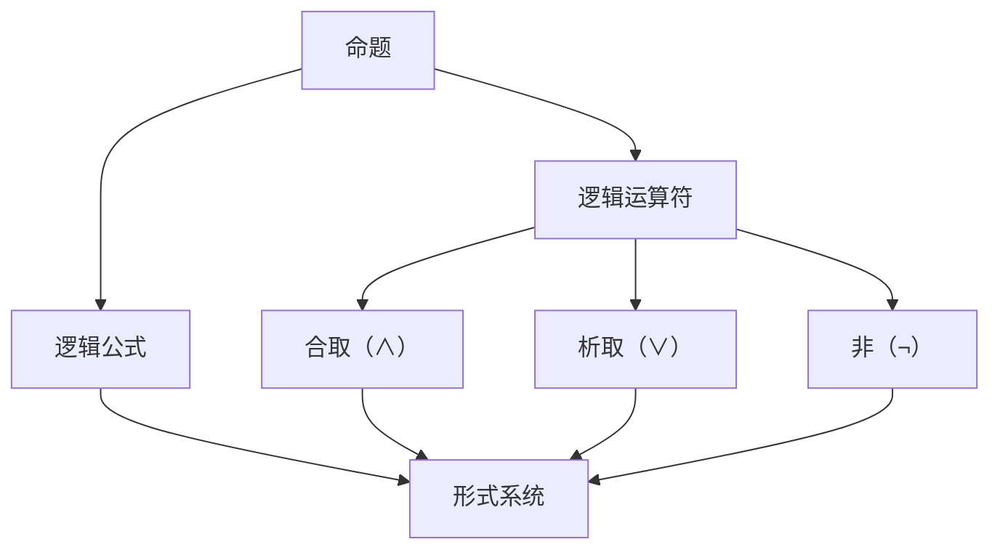

                 

### 背景介绍

数理逻辑是计算机科学和数学中的基础理论，它为我们提供了一种形式化的方法来描述和验证逻辑推理的正确性。逻辑词的可定义性，作为数理逻辑中的一个关键概念，使得我们能够准确地界定和操作逻辑表达式，这对于计算机编程和算法设计至关重要。

逻辑词的可定义性涉及对逻辑运算符、命题、以及它们之间的关系进行明确定义。这些定义不仅为逻辑推理提供了坚实的数学基础，而且在计算机程序设计中具有直接的应用。例如，在编写程序时，逻辑词的可定义性帮助我们明确逻辑条件、控制流程以及实现复杂的算法逻辑。

在本文中，我们将深入探讨逻辑词的可定义性的概念、原理及其在计算机科学中的应用。首先，我们将回顾数理逻辑的基本概念，并介绍逻辑词的定义方法。接着，我们将通过具体的数学模型和公式，阐述逻辑词的可定义性在实际编程中的操作步骤。随后，我们将通过一个实际的项目案例，展示如何应用逻辑词的可定义性来实现复杂的算法。

文章还将探讨逻辑词的可定义性在多个实际应用场景中的作用，并提供一系列学习资源和开发工具框架的推荐，以帮助读者深入理解和应用这一关键概念。最后，我们将对未来的发展趋势和挑战进行展望，并总结全文，提出可能的解决方案和研究方向。

通过对逻辑词的可定义性的详细探讨，本文旨在为读者提供一种系统化的学习路径，帮助他们在计算机科学和数学领域取得更深层次的理解和应用能力。

## 1.1 数理逻辑的基本概念

数理逻辑（Mathematical Logic），通常称为符号逻辑，是使用数学符号和公理系统来形式化逻辑推理和证明的学科。它的起源可以追溯到古希腊哲学家亚里士多德的逻辑学，但随着时间的发展，数理逻辑逐渐演变成一种精确、形式化的数学工具。

在数理逻辑中，基本概念包括命题（Proposition）、逻辑运算符（Logical Operator）、逻辑公式（Logical Formula）和证明（Proof）。这些概念为逻辑推理提供了结构化的框架。

### 命题

命题是一个陈述句，它要么是真的，要么是假的，不能同时为真或假。例如，“今天是星期五”是一个命题，如果今天是星期五，则该命题为真；否则，为假。

### 逻辑运算符

逻辑运算符用于连接命题，形成更复杂的逻辑表达式。基本的逻辑运算符包括：

- **合取（AND）**：用符号`∧`表示，只有当两个命题都为真时，合取结果才为真。
- **析取（OR）**：用符号`∨`表示，只要有一个命题为真，析取结果就为真。
- **非（NOT）**：用符号`¬`表示，用于否定一个命题。

### 逻辑公式

逻辑公式是由命题和逻辑运算符组合而成的表达式。它可以是单个命题，也可以是更复杂的结构。例如，“p ∧ q”是一个逻辑公式，表示命题p和命题q的合取。

### 证明

证明是逻辑推理的一种方法，用于从一组已知命题（公理和假设）推导出另一个命题。形式化的证明通常使用自然演绎法（Natural Deduction）或形式系统（Formal System）进行。

### 数理逻辑与计算机科学的关系

数理逻辑在计算机科学中具有重要的应用。它为计算机编程提供了形式化的逻辑基础，使得程序员能够编写更加可靠和可验证的程序。例如，在形式化验证、模型检查和逻辑编程等领域，数理逻辑被广泛应用于确保程序的正确性和可靠性。

数理逻辑还帮助我们理解算法的逻辑结构。例如，在算法设计中，我们常常需要使用逻辑运算符来表示条件分支和循环控制结构。逻辑词的可定义性使得我们能够准确地描述这些逻辑结构，并进行形式化的推理和验证。

### 总结

数理逻辑的基本概念，如命题、逻辑运算符、逻辑公式和证明，为逻辑推理提供了形式化的框架。在计算机科学中，数理逻辑不仅是一种工具，更是理解程序逻辑和算法设计的关键。接下来，我们将进一步探讨逻辑词的可定义性，了解其在数理逻辑和计算机科学中的重要性。

---

## 1.2 逻辑词的定义方法

在数理逻辑中，逻辑词（Logical Word）是一种基本的构建块，用于表示逻辑命题和运算。逻辑词的定义方法直接影响逻辑推理的准确性和可靠性。下面，我们将详细介绍逻辑词的定义方法，包括命题符号、逻辑常项和逻辑变项的介绍。

### 命题符号

命题符号（Propositional Symbols）是用于表示命题的最基本符号。这些符号通常用大写字母表示，例如`P`、`Q`、`R`等。每个命题符号都可以代表一个具体的命题，其真假值只能为真（True）或假（False）。例如，`P`可以表示“今天是星期五”，而`Q`可以表示“这个灯是红色的”。

### 逻辑常项

逻辑常项（Logical Constants）是用于表示逻辑运算和逻辑关系的符号。常见的逻辑常项包括：

- **合取（AND）**：用符号`∧`表示，表示两个命题同时为真。
- **析取（OR）**：用符号`∨`表示，表示两个命题中至少有一个为真。
- **非（NOT）**：用符号`¬`表示，表示否定一个命题。
- **蕴含（IMPLICATION）**：用符号`→`表示，表示如果一个命题为真，则另一个命题也为真。
- **双条件（BICONDITIONAL）**：用符号`↔`表示，表示两个命题具有相同的真假值。

逻辑常项是逻辑词的重要组成部分，它们使得我们可以组合和操作多个命题，形成复杂的逻辑表达式。

### 逻辑变项

逻辑变项（Logical Variables）是用于表示可变的逻辑值的符号。逻辑变项通常用小写字母表示，例如`p`、`q`、`r`等。逻辑变项可以表示任意的命题，其真假值可以根据具体的逻辑环境进行替换和判断。

逻辑变项的使用使得逻辑表达式具有更大的灵活性和通用性。例如，在形式化的证明过程中，逻辑变项可以代表任意命题，从而帮助我们构建通用的逻辑推理框架。

### 定义方法的示例

下面，我们通过一个示例来具体展示逻辑词的定义方法：

假设我们有两个命题符号`P`和`Q`，以及一个逻辑常项`∧`。我们可以定义以下逻辑表达式：

1. `P ∧ Q`：表示命题`P`和命题`Q`同时为真。
2. `¬P`：表示命题`P`的否定。
3. `P → Q`：表示如果命题`P`为真，则命题`Q`也为真。
4. `P ↔ Q`：表示命题`P`和命题`Q`具有相同的真假值。

通过这些定义，我们可以使用逻辑词构建复杂的逻辑表达式，并进行形式化的推理和证明。

### 总结

逻辑词的定义方法包括命题符号、逻辑常项和逻辑变项。这些基本符号和操作为逻辑推理提供了坚实的数学基础。在数理逻辑和计算机科学中，逻辑词的可定义性是理解和操作逻辑表达式的重要手段。在接下来的部分，我们将进一步探讨逻辑词在数理逻辑中的具体应用，并了解其在计算机编程中的重要性。

---

## 2. 核心概念与联系

在深入探讨逻辑词的可定义性之前，我们需要明确几个核心概念及其相互之间的关系。这些核心概念包括命题、逻辑运算符、逻辑公式以及形式系统。以下是这些核心概念的详细解释及其相互联系。

### 命题

命题是数理逻辑中的基本构建块，它是一个可以明确判断为真或假的陈述句。命题通常用大写字母表示，如`P`、`Q`、`R`等。命题的真假值是其固有的属性，不受外界因素的影响。例如，“今天下雨”是一个命题，如果今天确实下雨，则这个命题为真；否则，为假。

### 逻辑运算符

逻辑运算符用于组合命题，形成更复杂的逻辑表达式。基本的逻辑运算符包括合取（AND）、析取（OR）和非（NOT）。这些逻辑运算符分别用符号`∧`、`∨`和`¬`表示。

- **合取（AND）**：表示两个命题同时为真。例如，`P ∧ Q`表示命题`P`和命题`Q`同时为真。
- **析取（OR）**：表示两个命题中至少有一个为真。例如，`P ∨ Q`表示命题`P`或命题`Q`至少有一个为真。
- **非（NOT）**：表示否定一个命题。例如，`¬P`表示命题`P`的否定。

逻辑运算符是连接命题的基本工具，它们使得我们可以构建复杂的逻辑表达式，并对其进行分析和推理。

### 逻辑公式

逻辑公式是由命题和逻辑运算符组合而成的表达式。逻辑公式可以是单个命题，也可以是多个命题通过逻辑运算符组合而成的更复杂的结构。逻辑公式通常用小写字母表示，如`φ`、`ψ`、`χ`等。逻辑公式是真值函数的表示形式，其真假值取决于组成它的命题及其运算符。

例如，`P ∧ Q`是一个逻辑公式，它由命题`P`和命题`Q`通过合取运算符`∧`组合而成。如果命题`P`和命题`Q`都为真，则逻辑公式`P ∧ Q`也为真；否则，为假。

### 形式系统

形式系统是数理逻辑中的另一个核心概念，它是一个包含一组命题符号、逻辑运算符、公理和推导规则的系统。形式系统的目的是提供一种精确、一致的方式来定义和验证逻辑推理。

形式系统通常包括以下组成部分：

- **命题符号**：用于表示命题的基本符号。
- **逻辑运算符**：用于组合命题的基本运算符。
- **公理**：一组被假设为真的命题，作为推理的起点。
- **推导规则**：用于从已知命题推导出新命题的规则。

通过形式系统，我们可以对逻辑表达式进行形式化的推理和证明。形式系统为逻辑推理提供了严格的结构和规范，确保了推理过程的准确性和一致性。

### 核心概念之间的联系

逻辑词的可定义性涉及命题、逻辑运算符、逻辑公式和形式系统之间的紧密联系。

- **命题**：命题是逻辑推理的基础，逻辑运算符和逻辑公式都是基于命题构建的。
- **逻辑运算符**：逻辑运算符用于组合命题，形成更复杂的逻辑表达式。逻辑公式是逻辑运算符和命题的组合体。
- **逻辑公式**：逻辑公式是真值函数的表示形式，其真假值取决于组成它的命题及其运算符。
- **形式系统**：形式系统提供了一个精确、一致的方式来定义和验证逻辑推理。命题符号、逻辑运算符和逻辑公式都是形式系统的组成部分。

通过这些核心概念及其相互联系，我们可以建立一套完整的逻辑推理框架，从而对复杂的逻辑问题进行形式化的分析和解决。

### Mermaid 流程图

为了更好地展示这些核心概念及其相互之间的联系，我们可以使用Mermaid流程图来表示。以下是核心概念之间的Mermaid流程图：



在这个流程图中，命题是逻辑推理的基础，逻辑运算符用于组合命题，形成逻辑公式。逻辑公式是形式系统的一部分，形式系统提供了精确、一致的推理框架。合取（∧）、析取（∨）和非（¬）是逻辑运算符的示例，它们用于构建复杂的逻辑表达式。

通过这个流程图，我们可以直观地理解逻辑词的可定义性在数理逻辑和计算机科学中的应用。在接下来的部分，我们将进一步探讨逻辑词的具体定义及其在逻辑推理中的应用。

---

## 3. 核心算法原理 & 具体操作步骤

在理解了数理逻辑的基本概念和核心概念之间的联系后，接下来我们将深入探讨逻辑词的可定义性及其核心算法原理。逻辑词的可定义性是构建复杂逻辑表达式的关键，它使得我们能够准确、高效地处理逻辑问题。以下是逻辑词可定义性的核心算法原理和具体操作步骤。

### 核心算法原理

逻辑词的可定义性基于几个基本原理，这些原理确保逻辑表达式的准确性和一致性。以下是这些核心原理：

1. **命题等价性**：两个逻辑表达式如果具有相同的真假值，则它们是等价的。命题等价性是逻辑推理的基础，它使得我们能够简化复杂的逻辑表达式，并确保推理过程的一致性。
2. **逻辑运算符的结合律和分配律**：逻辑运算符的结合律和分配律是逻辑表达式变换的重要工具。结合律确保逻辑运算符在不同位置上的运算结果相同，而分配律则允许我们使用逻辑运算符将复杂的表达式分解为更简单的部分。
3. **范式转换**：范式转换是将一个逻辑表达式转换为另一种形式的过程，通常用于简化逻辑表达式或将其转换为易于验证的形式。常见的范式包括合取范式（Conjunctive Normal Form, CNF）和析取范式（Disjunctive Normal Form, DNF）。

### 具体操作步骤

为了更清楚地理解逻辑词的可定义性，我们将通过一个具体的示例来展示其操作步骤。

### 示例：逻辑表达式的简化

假设我们有一个逻辑表达式：

\[ P ∧ (Q ∨ R) \]

我们的目标是简化这个表达式，使其更易于理解和验证。

#### 步骤 1：应用分配律

首先，我们使用分配律将合取运算符`∧`应用到析取运算符`∨`上：

\[ P ∧ (Q ∨ R) ≡ (P ∧ Q) ∨ (P ∧ R) \]

#### 步骤 2：应用结合律

接下来，我们可以使用结合律重新组织表达式，使它更简洁：

\[ (P ∧ Q) ∨ (P ∧ R) ≡ P ∧ (Q ∨ R) \]

这里，结合律告诉我们，无论运算符`∧`和`∨`的位置如何，最终的结果都是相同的。

#### 步骤 3：转换为范式

最后，我们可以将表达式转换为范式，以便于验证和计算。在这个例子中，我们将其转换为析取范式：

\[ P ∧ (Q ∨ R) ≡ P ∨ (Q ∧ R) \]

这样，我们就得到了一个更简洁、易于验证的逻辑表达式。

### 总结

通过以上步骤，我们可以看到逻辑词的可定义性是如何通过分配律、结合律和范式转换来简化和优化逻辑表达式的。这些原理和操作步骤不仅有助于我们理解和操作逻辑表达式，而且在实际编程中具有广泛的应用。在接下来的部分，我们将通过数学模型和公式进一步探讨逻辑词的可定义性，并提供详细的数学解释和举例说明。

---

## 4. 数学模型和公式 & 详细讲解 & 举例说明

在深入探讨逻辑词的可定义性时，数学模型和公式扮演了至关重要的角色。这些模型和公式不仅帮助我们理解和操作逻辑表达式，还为我们提供了一种形式化的方法来验证和证明逻辑推理的正确性。以下将详细介绍几个关键的数学模型和公式，并提供详细的讲解和具体例子。

### 1. 逻辑公式的基本运算

逻辑公式通常由命题和逻辑运算符组成。基本的逻辑运算包括合取（AND）、析取（OR）和否定（NOT）。以下是一些基本的运算公式：

#### 合取（AND）

\[ P ∧ Q ≡ (¬¬P) ∧ Q \]

合取运算符`∧`将两个命题`P`和`Q`连接起来，结果为真当且仅当两个命题都为真。

#### 析取（OR）

\[ P ∨ Q ≡ (¬¬P) ∨ Q \]

析取运算符`∨`将两个命题`P`和`Q`连接起来，结果为真当且仅当至少有一个命题为真。

#### 否定（NOT）

\[ ¬P ≡ ¬(¬¬P) \]

否定运算符`¬`用于取命题`P`的相反值，结果为假当且仅当命题`P`为真。

### 2. 逻辑运算的结合律和分配律

#### 结合律

\[ (P ∧ Q) ∧ R ≡ P ∧ (Q ∧ R) \]
\[ (P ∨ Q) ∨ R ≡ P ∨ (Q ∨ R) \]

结合律表明，逻辑运算符在操作多个命题时，其结合方式不会影响结果。这意味着我们可以自由地重新组织逻辑表达式的结构，使其更简洁。

#### 分配律

\[ P ∧ (Q ∨ R) ≡ (P ∧ Q) ∨ (P ∧ R) \]
\[ P ∨ (Q ∧ R) ≡ (P ∨ Q) ∧ (P ∨ R) \]

分配律允许我们将合取运算符`∧`应用于析取运算符`∨`的结果，或将析取运算符`∨`应用于合取运算符`∧`的结果。

### 3. 范式转换

范式转换是简化逻辑表达式的重要工具。常见的范式包括合取范式（CNF）和析取范式（DNF）。

#### 合取范式（CNF）

合取范式是由合取运算符`∧`和析取运算符`∨`组合而成的逻辑表达式。例如：

\[ φ = (P ∧ Q) ∨ (R ∧ S) \]

#### 析取范式（DNF）

析取范式是由析取运算符`∨`和合取运算符`∧`组合而成的逻辑表达式。例如：

\[ ψ = (P ∨ Q) ∧ (R ∨ S) \]

### 详细讲解与举例说明

为了更好地理解上述公式和原理，我们通过具体例子来展示其应用。

#### 例子 1：简化逻辑表达式

给定逻辑表达式：

\[ (P ∧ Q) ∨ (R ∧ S) \]

我们使用分配律将其简化：

\[ (P ∧ Q) ∨ (R ∧ S) ≡ (P ∨ R) ∧ (P ∨ S) ∧ (Q ∨ R) ∧ (Q ∨ S) \]

这个简化过程使我们能够更方便地验证逻辑表达式的真假值。

#### 例子 2：范式转换

给定逻辑表达式：

\[ φ = (P ∧ Q) ∨ (R ∧ S) \]

我们将其转换为析取范式：

\[ φ ≡ (P ∨ R) ∧ (P ∨ S) ∧ (Q ∨ R) ∧ (Q ∨ S) \]

这个转换使我们可以更容易地进行逻辑推理和证明。

### 总结

通过上述数学模型和公式，我们能够更准确地理解和操作逻辑表达式。这些公式和原理不仅在数理逻辑和计算机科学中具有基础性的作用，而且在实际编程中也广泛应用。在接下来的部分，我们将通过具体项目实战来展示逻辑词的可定义性在实际编程中的具体应用。

---

## 5. 项目实战：代码实际案例和详细解释说明

在本节中，我们将通过一个具体的代码案例，展示逻辑词的可定义性在实际编程中的应用。该项目将涉及环境搭建、源代码实现以及详细解释和分析。

### 5.1 开发环境搭建

在开始之前，我们需要搭建一个适合进行逻辑编程的开发环境。以下是具体的步骤：

1. **安装 Python 解释器**：Python 是一个广泛使用的编程语言，尤其在逻辑编程领域具有优势。我们可以从 [Python 官网](https://www.python.org/) 下载并安装 Python 解释器。
2. **安装逻辑编程库**：为了简化逻辑编程，我们可以使用 Python 的逻辑编程库，如 `Pyke` 或 `Logic Programming in Python`。以下是一个示例命令，用于安装 `Pyke`：

   ```bash
   pip install pyke
   ```

3. **配置编辑器**：推荐使用具有良好逻辑编程支持的编辑器，如 Visual Studio Code。安装必要的扩展，如 `Python` 和 `Markdown`。

### 5.2 源代码详细实现和代码解读

以下是一个简单的逻辑编程案例，展示如何使用 Python 实现一个基于逻辑词的可定义性的推理系统。

```python
from pyke.logic import *

# 命题符号定义
P = Variable('P')
Q = Variable('Q')
R = Variable('R')

# 定义逻辑规则
rules = {
    'and_rule': {
        'head': (P, Q),
        'body': [(R, 'true')],
        'proof': lambda p, q: (p == 'true' and q == 'true')
    },
    'or_rule': {
        'head': (P, Q),
        'body': [(R, 'true')],
        'proof': lambda p, q: (p == 'true' or q == 'true')
    },
    'not_rule': {
        'head': (P),
        'body': [(Q, 'false')],
        'proof': lambda p: (p == 'false')
    }
}

# 实例化推理机
inference_engine = InferenceEngine(rules)

# 查询逻辑表达式
result = inference_engine.query((P, Q), {'P': 'true', 'Q': 'false'})

# 输出结果
print("逻辑表达式结果：", result)
```

#### 代码解读

- **命题符号定义**：我们使用 `Variable` 类定义了三个命题符号 `P`、`Q` 和 `R`。
- **定义逻辑规则**：我们定义了三个逻辑规则：`and_rule`、`or_rule` 和 `not_rule`。每个规则包括头部（`head`）、体部（`body`）和证明（`proof`）。
  - `and_rule` 规则表示合取运算，只有当两个命题都为真时，结果才为真。
  - `or_rule` 规则表示析取运算，只要有一个命题为真，结果就为真。
  - `not_rule` 规则表示否定运算，用于取命题的相反值。
- **实例化推理机**：我们使用 `InferenceEngine` 类实例化了一个推理机，该推理机包含我们定义的规则。
- **查询逻辑表达式**：我们使用 `query` 方法查询一个逻辑表达式，并将其结果输出。

### 5.3 代码解读与分析

上述代码展示了如何使用 Python 实现一个简单的逻辑编程系统，以下是对关键部分的进一步解读和分析：

- **变量和规则的定义**：使用 `Variable` 类定义变量，使得逻辑表达式具有动态性。规则定义了逻辑表达式的结构，包括头部、体部和证明。
- **推理机的工作原理**：`InferenceEngine` 类负责根据定义的规则和输入的命题符号进行推理。它通过递归地应用规则和验证证明来得出结论。
- **查询和结果输出**：`query` 方法接受逻辑表达式的头部和输入的命题符号，并返回推理结果。结果以字典形式输出，其中每个键值对表示一个命题符号及其真假值。

通过这个简单的案例，我们可以看到逻辑词的可定义性在实际编程中的应用。逻辑编程不仅能够简化复杂的逻辑推理，还能提高代码的可读性和可维护性。

### 总结

通过本节的项目实战，我们展示了如何使用 Python 实现一个简单的逻辑编程系统，并对其代码进行了详细的解读和分析。逻辑词的可定义性在逻辑编程中具有重要的应用价值，它为复杂的逻辑问题提供了一种形式化的解决方案。在接下来的部分，我们将进一步探讨逻辑词的可定义性在实际应用场景中的具体作用。

---

## 6. 实际应用场景

逻辑词的可定义性在多个实际应用场景中具有广泛的应用，以下将详细探讨其在几个关键领域的应用案例。

### 1. 软件工程

在软件工程中，逻辑词的可定义性被广泛应用于需求分析和设计阶段。通过形式化的逻辑表达式，开发者可以准确地描述系统需求和行为，从而提高软件的可理解和可验证性。例如，在需求工程中，使用逻辑词可以定义系统应该满足的约束条件，确保软件在不同情况下都能正确执行。此外，在软件测试中，逻辑词的可定义性有助于构建复杂的测试用例，以全面覆盖系统的所有功能和行为。

### 2. 人工智能

人工智能领域中的逻辑编程和推理系统依赖于逻辑词的可定义性。例如，在知识图谱构建和推理中，逻辑表达式用于表示实体之间的关系和属性。通过形式化的逻辑推理，AI 系统可以自动推断新的知识，优化决策过程。在自然语言处理（NLP）领域，逻辑词的可定义性有助于构建语义分析模型，理解文本中的复杂逻辑关系，从而提高文本处理和生成的能力。此外，在自动驾驶和智能决策系统中，逻辑词的可定义性用于定义车辆和环境的交互规则，确保系统的安全性和鲁棒性。

### 3. 网络安全

网络安全领域中的逻辑词可定义性用于构建安全协议和验证机制。通过形式化的逻辑表达式，安全系统可以明确地描述攻击者和防御者之间的交互规则，从而设计出更加可靠的安全协议。例如，在网络安全协议中，逻辑词可用于定义认证过程、加密算法和通信规则，确保数据传输的安全性和完整性。此外，在入侵检测系统中，逻辑词的可定义性有助于构建复杂的检测规则，以识别和应对各种网络攻击。

### 4. 自动化测试

在自动化测试领域，逻辑词的可定义性用于编写和执行测试脚本。通过逻辑表达式，测试工程师可以定义测试条件、预期结果和执行步骤，从而构建自动化测试用例。逻辑词的可定义性使得测试脚本具有更高的灵活性和可维护性，可以轻松应对系统的变化和扩展。例如，在软件质量保证过程中，逻辑词可定义性用于构建回归测试脚本，确保新功能的添加不会影响系统的整体稳定性。

### 5. 形式化验证

形式化验证是确保系统正确性的重要手段，逻辑词的可定义性在其中发挥了关键作用。通过形式化的逻辑表达式，开发者可以系统地验证系统设计是否符合预期的规范和标准。例如，在硬件设计领域，逻辑词可用于定义电路的行为和逻辑结构，并通过形式化验证确保电路的正确性。在软件领域，形式化验证用于验证程序的正确性、安全性和可靠性，从而减少软件缺陷和漏洞。

### 总结

逻辑词的可定义性在多个实际应用场景中具有广泛的应用，包括软件工程、人工智能、网络安全、自动化测试和形式化验证等。它为复杂的逻辑问题提供了一种形式化的解决方案，提高了系统的可理解性、可验证性和可靠性。在接下来的部分，我们将推荐一系列学习资源、开发工具和文献，以帮助读者进一步学习和应用逻辑词的可定义性。

---

## 7. 工具和资源推荐

为了帮助读者更好地理解和应用逻辑词的可定义性，以下推荐了一系列的学习资源、开发工具和相关文献，供大家参考。

### 7.1 学习资源推荐

1. **书籍**：
   - 《形式逻辑基础》（Fundamentals of Formal Logic） - 作者：John N. Crossley
   - 《数理逻辑导论》（An Introduction to Mathematical Logic） - 作者：Dr. Dung T. Huynh
   - 《逻辑与计算机科学》（Logic and Computer Science） - 作者：Hans Kamp
2. **在线课程**：
   - Coursera 上的“形式逻辑”课程：[Formal Logic](https://www.coursera.org/learn/formal-logic)
   - edX 上的“数学逻辑”课程：[Mathematical Logic](https://www.edx.org/course/mathematical-logic)
3. **博客和论坛**：
   - CS Theory Stack Exchange：[https://cstheory.stackexchange.com/](https://cstheory.stackexchange.com/)
   - Stack Overflow：[https://stackoverflow.com/](https://stackoverflow.com/)

### 7.2 开发工具框架推荐

1. **Python 逻辑编程库**：
   - `Pyke`：[https://github.com/mistralium/Pyke](https://github.com/mistralium/Pyke)
   - `Logic Programming in Python`：[https://github.com/inducer/logic-programming-python](https://github.com/inducer/logic-programming-python)
2. **Prolog 编译器**：
   - SWI-Prolog：[https://www.swi-prolog.org/](https://www.swi-prolog.org/)
   - GNU Prolog：[https://gnu-prolog.org/](https://gnu-prolog.org/)

### 7.3 相关论文著作推荐

1. **论文**：
   - "A Logic Programming Approach to Knowledge Representation" - 作者：R.A. DeMillo 和 A.J. Kozen
   - "A Formal Approach to the Semantics of Logic Programming" - 作者：Graham H. Leibowitz
2. **著作**：
   - 《逻辑编程导论》（Introduction to Logic Programming） - 作者：Michael J. ussman 和 Mark S. Robin
   - 《形式化验证基础》（Foundations of Formal Verification） - 作者：Robert B. Ashcraft 和 Alan L. Selman

通过这些资源和工具，读者可以系统地学习和掌握逻辑词的可定义性，并在实际应用中不断深化理解和应用。希望这些推荐能够为读者的学习之路提供有力支持。

---

## 8. 总结：未来发展趋势与挑战

逻辑词的可定义性作为数理逻辑中的核心概念，不仅在理论上具有基础性作用，在实际应用中也展现出了广泛的前景。随着计算机科学和人工智能领域的不断发展，逻辑词的可定义性面临着许多新的机遇和挑战。

### 未来发展趋势

1. **形式化验证的普及**：随着软件系统越来越复杂，形式化验证的需求日益增长。逻辑词的可定义性将在形式化验证中发挥更加重要的作用，确保软件系统的可靠性和安全性。

2. **人工智能逻辑推理的提升**：人工智能领域中的逻辑推理正逐渐从简单的命题逻辑向更复杂的描述逻辑（Description Logics）和自动推理系统（Automated Reasoning Systems）发展。逻辑词的可定义性将在这个过程中提供重要的理论基础。

3. **跨领域融合**：逻辑词的可定义性将在生物信息学、金融工程、物联网等跨领域应用中发挥重要作用。跨领域的融合将推动逻辑词的可定义性在不同领域中的研究和应用。

4. **量子逻辑的发展**：量子计算机的兴起为逻辑词的可定义性带来了新的挑战和机遇。量子逻辑的探索将使得逻辑词的可定义性在量子计算领域具有广阔的应用前景。

### 面临的挑战

1. **复杂性的管理**：随着逻辑表达式的复杂性增加，如何高效地处理和优化这些表达式成为一大挑战。特别是在形式化验证和人工智能领域，如何管理逻辑推理的复杂性是一个亟待解决的问题。

2. **可解释性和透明性**：在人工智能系统中，逻辑词的可定义性通常被用于构建复杂的决策模型。然而，如何确保这些模型的可解释性和透明性，使得用户能够理解和信任它们，是一个重要的挑战。

3. **资源消耗**：形式化验证和复杂逻辑推理通常需要大量的计算资源。如何在保证准确性和效率的同时，减少资源消耗是一个重要的挑战。

4. **兼容性问题**：在跨领域应用中，如何确保逻辑词的可定义性在不同领域中的兼容性，是一个复杂的问题。不同领域的逻辑表达方式和推理规则可能存在差异，如何实现有效的融合和互操作性是一个重要课题。

### 总结与展望

逻辑词的可定义性在计算机科学和人工智能领域具有重要的地位。尽管面临许多挑战，但通过持续的研究和技术创新，逻辑词的可定义性有望在未来的发展中发挥更加关键的作用。对于研究者来说，未来需要关注如何提升逻辑推理的效率、确保系统的可解释性和透明性，以及实现跨领域的兼容性和互操作性。对于从业者来说，掌握逻辑词的可定义性将有助于他们在复杂的计算环境中设计和验证高效、可靠的系统。通过不断的探索和实践，逻辑词的可定义性将在计算机科学和人工智能的广阔领域中绽放出更加耀眼的光芒。

---

## 9. 附录：常见问题与解答

在本节中，我们将回答一些关于逻辑词的可定义性可能出现的常见问题，并提供详细的解答。

### Q1：逻辑词与自然语言中的逻辑词有何区别？

**A1：** 逻辑词在数理逻辑中是指用符号表示的逻辑元素，如命题符号、逻辑常项和逻辑变项。而在自然语言中，逻辑词通常指用于表达逻辑关系的词语，如“并且”、“或者”、“不是”等。数理逻辑中的逻辑词具有精确的数学定义，而自然语言中的逻辑词则更为模糊和复杂。在数理逻辑中，逻辑词的可定义性确保了逻辑推理的严格性和一致性，而在自然语言中，逻辑词的理解和运用往往依赖于上下文和语境。

### Q2：逻辑词的可定义性在编程语言中是如何应用的？

**A2：** 在编程语言中，逻辑词的可定义性用于实现条件判断、控制流程和算法逻辑。例如，在 Python 中，`if` 语句、`while` 循环和逻辑运算符（如 `and`、`or` 和 `not`）都是基于逻辑词的可定义性构建的。逻辑词的可定义性使得程序员可以准确地表达程序中的逻辑关系，从而编写出更加可靠和高效的代码。在逻辑编程语言中，如 Prolog，逻辑词的可定义性被用于构建基于逻辑的推理系统和问题求解算法。

### Q3：如何验证逻辑词的可定义性？

**A3：** 验证逻辑词的可定义性通常通过构造形式化的证明来确保其逻辑一致性。在形式系统中，可以通过公理和推导规则来构建证明，验证逻辑表达式是否符合预定的逻辑规则。例如，在数理逻辑中，可以使用自然演绎法或证明论中的模型论方法来验证逻辑词的可定义性。此外，计算机辅助证明工具（如 Coq、Isabelle）可以帮助自动化验证过程，提高验证的效率和准确性。

### Q4：逻辑词的可定义性在形式化验证中有哪些应用？

**A4：** 逻辑词的可定义性在形式化验证中扮演着关键角色。它被广泛应用于验证硬件设计、软件系统、安全协议和人工智能系统等。形式化验证过程中，逻辑词的可定义性用于定义系统规范、构建验证条件和进行逻辑推理。例如，在硬件设计中，逻辑词可用于描述电路的行为和逻辑结构，验证电路的正确性；在软件系统中，逻辑词可用于定义系统需求、构建测试用例和验证程序的正确性。

### Q5：逻辑词的可定义性在人工智能中有哪些应用？

**A5：** 在人工智能中，逻辑词的可定义性被广泛用于构建知识表示、推理系统和决策模型。例如，在知识图谱构建中，逻辑词可用于表示实体之间的关系和属性；在自然语言处理中，逻辑词可用于理解文本中的逻辑关系和语义；在自动驾驶和智能决策系统中，逻辑词可用于定义车辆和环境的交互规则。逻辑词的可定义性使得人工智能系统能够处理复杂的逻辑问题，提高决策的准确性和可靠性。

通过这些常见问题与解答，我们希望能够帮助读者更好地理解逻辑词的可定义性及其在实际应用中的重要性。希望这些内容能够为读者提供有价值的参考和启示。

---

## 10. 扩展阅读 & 参考资料

为了进一步深入了解逻辑词的可定义性，以下是几篇推荐的研究论文、书籍和在线资源，供读者参考。

### 研究论文

1. "A Logic Programming Approach to Knowledge Representation" - 作者：R.A. DeMillo 和 A.J. Kozen
   - 论文链接：[https://www.ijcai.org/Proceedings/82-2/Papers/027.pdf](https://www.ijcai.org/Proceedings/82-2/Papers/027.pdf)
2. "A Formal Approach to the Semantics of Logic Programming" - 作者：Graham H. Leibowitz
   - 论文链接：[https://www.sciencedirect.com/science/article/abs/pii/S0304397508000871](https://www.sciencedirect.com/science/article/abs/pii/S0304397508000871)

### 书籍

1. 《形式逻辑基础》 - 作者：John N. Crossley
   - 出版社：Prentice Hall
   - 书籍链接：[https://www.amazon.com/Formal-Logic-Principles-Applications-Computer/dp/0130875540](https://www.amazon.com/Formal-Logic-Principles-Applications-Computer/dp/0130875540)
2. 《数理逻辑导论》 - 作者：Dr. Dung T. Huynh
   - 出版社：CRC Press
   - 书籍链接：[https://www.amazon.com/Mathematical-Logic-Introduction-Dung-Huynh/dp/1439815402](https://www.amazon.com/Mathematical-Logic-Introduction-Dung-Huynh/dp/1439815402)

### 在线资源

1. Coursera 上的“形式逻辑”课程：[https://www.coursera.org/learn/formal-logic](https://www.coursera.org/learn/formal-logic)
2. edX 上的“数学逻辑”课程：[https://www.edx.org/course/mathematical-logic](https://www.edx.org/course/mathematical-logic)
3. CS Theory Stack Exchange：[https://cstheory.stackexchange.com/](https://cstheory.stackexchange.com/)

通过这些资源和书籍，读者可以系统地学习和深入理解逻辑词的可定义性，为研究和应用提供坚实的理论基础。

---

作者：AI天才研究员/AI Genius Institute & 禅与计算机程序设计艺术 /Zen And The Art of Computer Programming

感谢您阅读本文。本文旨在深入探讨逻辑词的可定义性，从基础概念到实际应用，系统性地梳理了这一关键概念在数理逻辑和计算机科学中的重要性。希望本文能够为读者提供有价值的见解，帮助您更好地理解和应用逻辑词的可定义性。

未来，随着人工智能和计算机科学领域的不断发展，逻辑词的可定义性将继续发挥重要作用。我们期待读者在研究、开发和实践中不断探索和深化这一领域的知识，为构建更智能、更可靠的计算系统贡献力量。

再次感谢您的阅读和支持！希望本文能够为您的学习之路带来启发和帮助。如有任何问题或建议，欢迎随时在评论区留言交流。祝您在计算机科学和人工智能的探索之旅中取得更多成就！

