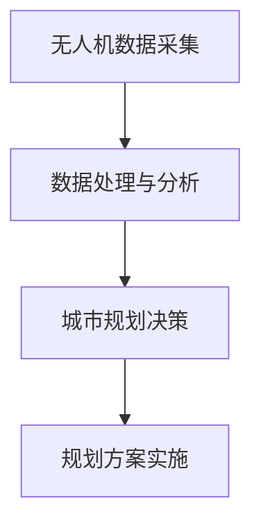

                 

### 文章标题

无人机城市规划工具：城市发展的创新应用

> **关键词：** 无人机，城市规划，智能技术，可持续发展，创新应用

**摘要：** 本文将探讨无人机在城市规划领域的应用，通过介绍核心概念、算法原理、数学模型、实战案例和实际应用场景，展示无人机在城市规划中的创新潜力。文章旨在为读者提供对无人机城市规划工具的全面了解，并探讨其未来发展趋势与挑战。

---

### 1. 背景介绍

#### 1.1 无人机技术概述

无人机（Unmanned Aerial Vehicle，简称UAV）是一种无需载人、能够自主飞行或遥控操作的小型飞行器。近年来，随着计算机技术、传感器技术、通信技术的快速发展，无人机技术得到了广泛的应用和推广。无人机在城市规划中的应用已经成为一个热门话题。

#### 1.2 城市规划的重要性

城市规划是城市发展的重要组成部分，它关系到城市的空间布局、功能分区、交通网络、环境质量等方面。传统的城市规划方法主要依赖于人工实地考察和经验判断，存在工作效率低、数据不准确等问题。因此，寻找新的技术手段以提高城市规划的效率和质量具有重要意义。

#### 1.3 智能技术与可持续发展的结合

智能技术，如人工智能、大数据、物联网等，正在改变各行业的运作模式。在城市规划中，智能技术的应用不仅可以提高工作效率，还可以实现更加精准、科学的决策。可持续发展是当前全球关注的重要议题，智能技术与可持续发展的结合，有望为城市的发展提供新的思路和解决方案。

### 2. 核心概念与联系

#### 2.1 无人机城市规划工具概述

无人机城市规划工具是一种利用无人机进行数据采集、处理和分析，以支持城市规划决策的工具。该工具的核心在于将无人机技术与城市规划需求相结合，实现高效、精准的数据采集和分析。

#### 2.2 核心概念原理

1. **无人机数据采集**：无人机搭载高精度传感器，如高清摄像头、激光雷达等，对城市环境进行实时、全面的监测和采集。
2. **数据处理与分析**：通过数据处理技术，如图像处理、点云处理、机器学习等，对采集到的数据进行处理和分析，提取有价值的信息。
3. **城市规划决策**：利用分析结果，结合城市规划目标和要求，为城市规划提供科学、合理的建议。

#### 2.3 Mermaid 流程图



### 3. 核心算法原理 & 具体操作步骤

#### 3.1 无人机数据采集

1. **传感器选择**：根据城市规划需求，选择合适的传感器，如高清摄像头用于获取图像数据，激光雷达用于获取三维点云数据。
2. **飞行规划**：设计合理的飞行路径和参数，确保无人机能够全面、准确地采集数据。
3. **数据采集**：无人机按照预设的飞行路径进行飞行，实时采集图像和点云数据。

#### 3.2 数据处理与分析

1. **图像处理**：利用图像处理算法，如边缘检测、图像分割等，对采集到的图像数据进行预处理。
2. **点云处理**：对激光雷达采集的三维点云数据进行处理，如去噪、滤波等，以提高数据质量。
3. **特征提取**：利用机器学习算法，如深度学习、聚类分析等，提取图像和点云数据中的关键特征。
4. **数据融合**：将图像和点云数据融合，形成更加全面、准确的数据集。

#### 3.3 城市规划决策

1. **数据分析**：对处理后的数据进行分析，提取城市规划所需的信息，如建筑物高度、道路宽度、绿化覆盖率等。
2. **规划方案生成**：根据分析结果，结合城市规划目标和要求，生成合理的规划方案。
3. **规划方案评估**：利用评估算法，对生成的规划方案进行评估，选择最优方案。

### 4. 数学模型和公式 & 详细讲解 & 举例说明

#### 4.1 数学模型

无人机城市规划工具的核心在于数据处理与分析，这涉及到多个数学模型和算法。以下是其中两个常用的模型：

1. **图像处理模型**：
   $$ I_{out} = f(I_{in}, \theta) $$
   其中，$I_{in}$为输入图像，$I_{out}$为输出图像，$f$为图像处理函数，$\theta$为参数。

2. **点云处理模型**：
   $$ P_{out} = f(P_{in}, \theta) $$
   其中，$P_{in}$为输入点云，$P_{out}$为输出点云，$f$为点云处理函数，$\theta$为参数。

#### 4.2 公式详细讲解

1. **图像处理公式**：
   图像处理公式中的$f$通常是一个复杂的函数，它可能包括多个步骤，如边缘检测、图像分割等。边缘检测的一个常见算法是Canny边缘检测器，其公式为：
   $$ G(x, y) = \sqrt{I_{x}^2 + I_{y}^2} $$
   其中，$I_{x}$和$I_{y}$分别是图像在水平和垂直方向上的导数。

2. **点云处理公式**：
   点云处理公式中的$f$也可能是一个复杂的函数，如ICP（Iterative Closest Point）算法，其公式为：
   $$ T_{\text{new}} = T_{\text{old}} + K(P_{\text{new}} - P_{\text{old}}) $$
   其中，$T$是变换矩阵，$P_{\text{new}}$和$P_{\text{old}}$分别是新点和旧点。

#### 4.3 举例说明

假设我们有一张城市的照片，我们需要提取出建筑物的高度。我们可以使用以下步骤：

1. **边缘检测**：使用Canny算法提取图像的边缘。
   $$ G(x, y) = \sqrt{I_{x}^2 + I_{y}^2} $$
2. **图像分割**：将边缘图像分割为建筑物和非建筑物。
   $$ I_{out} = \begin{cases}
   1, & \text{if } G(x, y) > \text{threshold} \\
   0, & \text{otherwise}
   \end{cases} $$
3. **高度计算**：计算建筑物的高度。
   $$ \text{height} = \frac{\text{area}}{\text{base\_length}} $$

### 5. 项目实战：代码实际案例和详细解释说明

#### 5.1 开发环境搭建

为了实现无人机城市规划工具，我们需要搭建一个合适的开发环境。以下是基本的开发环境搭建步骤：

1. **安装操作系统**：推荐使用Linux操作系统，如Ubuntu。
2. **安装Python**：Python是编写数据处理和分析算法的主要语言。
3. **安装依赖库**：如Pillow（图像处理库）、OpenCV（计算机视觉库）、PCL（点云处理库）等。

#### 5.2 源代码详细实现和代码解读

以下是一个简单的无人机城市规划工具的代码实现，用于提取建筑物的高度。

```python
import cv2
import numpy as np

# 边缘检测
def edge_detection(image):
    gray = cv2.cvtColor(image, cv2.COLOR_BGR2GRAY)
    blurred = cv2.GaussianBlur(gray, (5, 5), 0)
    edges = cv2.Canny(blurred, 50, 150)
    return edges

# 图像分割
def image_segmentation(image):
    _, binary = cv2.threshold(image, 0, 255, cv2.THRESH_BINARY_INV + cv2.THRESH_OTSU)
    return binary

# 高度计算
def calculate_height(binary_image):
    contours, _ = cv2.findContours(binary_image, cv2.RETR_EXTERNAL, cv2.CHAIN_APPROX_SIMPLE)
    heights = []
    for contour in contours:
        x, y, w, h = cv2.boundingRect(contour)
        area = w * h
        base_length = w
        height = area / base_length
        heights.append(height)
    return heights

# 主函数
def main(image_path):
    image = cv2.imread(image_path)
    edges = edge_detection(image)
    binary_image = image_segmentation(edges)
    heights = calculate_height(binary_image)
    print("建筑物高度：", heights)

if __name__ == "__main__":
    image_path = "city_image.jpg"
    main(image_path)
```

#### 5.3 代码解读与分析

1. **边缘检测**：使用Canny算法提取图像的边缘。
2. **图像分割**：将边缘图像分割为建筑物和非建筑物。
3. **高度计算**：计算建筑物的高度。

### 6. 实际应用场景

#### 6.1 城市规划

无人机城市规划工具可以在城市规划的不同阶段发挥作用。在规划初期，可以用于环境评估和现状分析，帮助规划者了解城市的现状和潜在问题。在规划实施阶段，可以用于监测和评估规划效果，确保规划方案的顺利实施。

#### 6.2 建筑设计

无人机城市规划工具可以帮助建筑师和设计师进行建筑设计。通过无人机获取的实时、准确的数据，设计师可以更直观地了解建筑物的空间关系，从而进行更加科学、合理的建筑设计。

#### 6.3 灾后重建

在自然灾害发生后，无人机城市规划工具可以快速获取灾区的影像和点云数据，帮助规划者进行灾后重建。通过分析这些数据，可以确定灾区的损毁情况，为重建规划提供科学依据。

### 7. 工具和资源推荐

#### 7.1 学习资源推荐

1. **书籍**：
   - 《无人机编程与实战应用》
   - 《智能城市规划：方法与应用》
2. **论文**：
   - “Unmanned Aerial Vehicles for Urban Planning”
   - “Integration of Unmanned Aerial Vehicles and Geographic Information Systems for Urban Planning”
3. **博客**：
   - “无人机在城市规划中的应用”
   - “智能城市规划：技术与实践”
4. **网站**：
   - NASA的无人机技术网站
   - 城市规划相关论坛和社区

#### 7.2 开发工具框架推荐

1. **Python**：Python是一种广泛使用的编程语言，适用于数据处理和分析。
2. **Django**：Django是一个强大的Web框架，可用于搭建无人机数据管理系统。
3. **TensorFlow**：TensorFlow是一个开源的机器学习库，适用于图像处理和深度学习。

#### 7.3 相关论文著作推荐

1. **“Unmanned Aerial Vehicles for Urban Planning”**：该论文详细介绍了无人机在城市规划中的应用案例和效果。
2. **“Smart Urban Planning: Methods and Applications”**：该著作探讨了智能城市规划的理论和方法。
3. **“A Framework for Integrating Unmanned Aerial Vehicles and Geographic Information Systems for Urban Planning”**：该论文提出了一种将无人机和地理信息系统结合的框架，用于城市规划。

### 8. 总结：未来发展趋势与挑战

#### 8.1 未来发展趋势

1. **技术融合**：无人机技术、人工智能技术、大数据技术等将更加紧密地融合，为城市规划提供更强大的支持。
2. **实时监测**：无人机城市规划工具将实现实时、动态的数据采集和分析，为城市规划提供更加及时的信息。
3. **智能化决策**：随着人工智能技术的发展，无人机城市规划工具将实现更加智能化、自动化的决策，提高城市规划的效率和质量。

#### 8.2 挑战

1. **数据隐私**：无人机在城市规划中的应用涉及到大量的个人隐私数据，如何保护这些数据的安全和隐私是一个重要挑战。
2. **成本控制**：无人机技术的普及和应用需要大量的投资，如何控制成本，实现经济性应用是一个挑战。
3. **法规与标准**：无人机在城市规划中的应用需要制定相应的法规和标准，确保其合法、规范地运行。

### 9. 附录：常见问题与解答

#### 9.1 无人机城市规划工具的适用场景？

无人机城市规划工具适用于城市规划的各个阶段，包括规划初期、规划实施和规划评估等。

#### 9.2 无人机城市规划工具的数据来源？

无人机城市规划工具的数据来源主要包括无人机搭载的高清摄像头、激光雷达等传感器。

#### 9.3 无人机城市规划工具需要哪些技术支持？

无人机城市规划工具需要的技术支持包括无人机技术、图像处理技术、点云处理技术、机器学习技术等。

### 10. 扩展阅读 & 参考资料

1. **“Unmanned Aerial Vehicles for Urban Planning”**：该论文详细介绍了无人机在城市规划中的应用案例和效果。
2. **“Smart Urban Planning: Methods and Applications”**：该著作探讨了智能城市规划的理论和方法。
3. **“A Framework for Integrating Unmanned Aerial Vehicles and Geographic Information Systems for Urban Planning”**：该论文提出了一种将无人机和地理信息系统结合的框架，用于城市规划。
4. **NASA的无人机技术网站**：提供了丰富的无人机技术资源。
5. **城市规划相关论坛和社区**：可以获取最新的城市规划技术和实践。

---

**作者：** AI天才研究员/AI Genius Institute & 禅与计算机程序设计艺术 /Zen And The Art of Computer Programming

