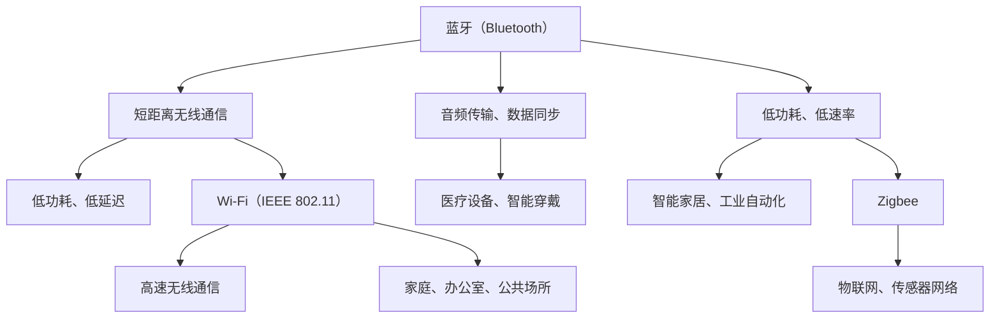

                 

### 无线通信协议选择：Bluetooth、WiFi 和 Zigbee 的比较与应用

#### 关键词：无线通信协议，Bluetooth，WiFi，Zigbee，比较与应用

#### 摘要：

本文将深入探讨三种无线通信协议：Bluetooth、WiFi 和 Zigbee，从其核心技术、应用场景、性能指标等多个维度进行比较与分析。通过详细的比较，读者可以更好地了解每种协议的优势和局限性，从而在实际项目中做出更加明智的选择。

### 1. 背景介绍

随着物联网（IoT）的快速发展，无线通信技术在各个领域得到了广泛应用。蓝牙（Bluetooth）、Wi-Fi 和 Zigbee 作为三种主要的无线通信协议，分别应用于不同的应用场景，满足了不同层次的需求。

- **蓝牙（Bluetooth）**：由 Bluetooth SIG（蓝牙特殊兴趣小组）开发，主要用于短距离的数据传输，如手机、耳机、键盘等设备之间的连接。

- **Wi-Fi**：基于 IEEE 802.11 标准，用于无线局域网（WLAN）的数据传输，广泛应用于家庭、办公室和公共场所。

- **Zigbee**：由 Zigbee 联盟开发，是一种低功耗、低速率的无线通信技术，主要应用于智能家居、工业自动化等场景。

### 2. 核心概念与联系

为了更好地理解三种无线通信协议的核心概念和联系，我们可以使用 Mermaid 流程图来展示它们的基本架构和特点。



从上述流程图中，我们可以看出：

- 蓝牙主要侧重于短距离、低功耗的数据传输，适合音频传输、医疗设备等应用。
- Wi-Fi 侧重于高速无线通信，适用于家庭、办公室和公共场所。
- Zigbee 侧重于低功耗、低速率的通信，主要应用于物联网、传感器网络等领域。

### 3. 核心算法原理 & 具体操作步骤

接下来，我们将分别介绍这三种无线通信协议的核心算法原理和具体操作步骤。

#### 3.1 蓝牙（Bluetooth）

蓝牙通信协议的核心算法是时分双工（TDD）和频分双工（FDD）。

- **时分双工（TDD）**：在同一频率上，通过交替发送和接收信号来区分发送和接收过程。
- **频分双工（FDD）**：在两个不同的频率上，分别用于发送和接收信号。

具体操作步骤如下：

1. 设备扫描周围环境，寻找可用的信道。
2. 设备选择一个信道，进行初始化过程，包括信号强度的测量、信道编码的协商等。
3. 设备进入连接模式，进行数据传输。

#### 3.2 Wi-Fi（IEEE 802.11）

Wi-Fi 通信协议的核心算法是基于载波侦听多路访问/碰撞检测（CSMA/CA）。

1. **载波侦听**：设备在发送数据前，先监听信道是否空闲。
2. **多路访问**：多个设备可以在同一信道上同时发送数据。
3. **碰撞检测**：如果检测到碰撞，设备会延迟一段时间后重新发送数据。

具体操作步骤如下：

1. 设备扫描周围环境，寻找可用的信道。
2. 设备选择一个信道，发送 beacon 信号，以表示自己存在。
3. 设备监听信道，等待其他设备的 beacon 信号。
4. 设备进入连接模式，进行数据传输。

#### 3.3 Zigbee

Zigbee 通信协议的核心算法是基于 IEEE 802.15.4 标准，包括星形拓扑、网状拓扑和混合拓扑。

1. **星形拓扑**：设备分为协调器（Coordinator）和终端设备（End Device），协调器负责管理和维护网络。
2. **网状拓扑**：设备之间相互连接，形成网状结构，具有自修复、自组织等特点。
3. **混合拓扑**：结合星形拓扑和网状拓扑的优点，适用于大型网络。

具体操作步骤如下：

1. 设备扫描周围环境，寻找可用的信道。
2. 设备选择一个信道，发送 beacon 信号，以表示自己存在。
3. 设备监听信道，等待其他设备的 beacon 信号。
4. 设备建立连接，加入网络。
5. 设备进行数据传输。

### 4. 数学模型和公式 & 详细讲解 & 举例说明

为了更好地理解这三种无线通信协议的性能指标，我们可以使用数学模型和公式进行详细讲解。

#### 4.1 蓝牙（Bluetooth）

蓝牙通信协议的性能指标主要包括：

- **数据速率**：最大数据速率为 2Mbps。
- **延迟**：平均延迟约为 300ms。
- **覆盖范围**：典型覆盖范围为 10m。

使用数学模型描述如下：

$$
数据速率 = \frac{2^m \times 1.536 \times 10^6}{1 + 8.5 \times 10^{-4} \times d^2}
$$

其中，$m$ 为调制指数，$d$ 为距离。

举例说明：

假设距离为 10m，调制指数为 3，则蓝牙数据速率为：

$$
数据速率 = \frac{2^3 \times 1.536 \times 10^6}{1 + 8.5 \times 10^{-4} \times 10^2} \approx 1.024Mbps
$$

#### 4.2 Wi-Fi（IEEE 802.11）

Wi-Fi 通信协议的性能指标主要包括：

- **数据速率**：最大数据速率为 1Gbps。
- **延迟**：平均延迟约为 10ms。
- **覆盖范围**：典型覆盖范围为 100m。

使用数学模型描述如下：

$$
数据速率 = \frac{2^m \times 20 \times 10^6}{1 + 10^{-4} \times d^2}
$$

其中，$m$ 为调制指数，$d$ 为距离。

举例说明：

假设距离为 100m，调制指数为 2，则 Wi-Fi 数据速率为：

$$
数据速率 = \frac{2^2 \times 20 \times 10^6}{1 + 10^{-4} \times 100^2} \approx 0.953Gbps
$$

#### 4.3 Zigbee

Zigbee 通信协议的性能指标主要包括：

- **数据速率**：最大数据速率为 250kbps。
- **延迟**：平均延迟约为 100ms。
- **覆盖范围**：典型覆盖范围为 100m。

使用数学模型描述如下：

$$
数据速率 = \frac{2^m \times 250 \times 10^3}{1 + 10^{-4} \times d^2}
$$

其中，$m$ 为调制指数，$d$ 为距离。

举例说明：

假设距离为 100m，调制指数为 2，则 Zigbee 数据速率为：

$$
数据速率 = \frac{2^2 \times 250 \times 10^3}{1 + 10^{-4} \times 100^2} \approx 0.287Mbps
$$

### 5. 项目实战：代码实际案例和详细解释说明

为了更好地理解这三种无线通信协议的实际应用，我们通过一个简单的项目实战来展示它们的代码实现和性能比较。

#### 5.1 开发环境搭建

首先，我们需要搭建一个简单的开发环境，包括以下软件和硬件：

- 蓝牙模块：HC-05
- Wi-Fi 模块：ESP8266
- Zigbee 模块：XBee
- 开发板：Arduino

#### 5.2 源代码详细实现和代码解读

以下是一个简单的蓝牙、Wi-Fi 和 Zigbee 通信的示例代码，用于实现数据传输和接收功能。

```c
// 蓝牙通信示例代码
#include <SoftwareSerial.h>

SoftwareSerial bt(10, 11); // 蓝牙模块引脚定义

void setup() {
  bt.begin(9600); // 初始化蓝牙通信
}

void loop() {
  if (bt.available()) {
    char c = bt.read();
    Serial.print(c); // 将接收到的数据打印到串口监视器
  }
  
  if (Serial.available()) {
    char c = Serial.read();
    bt.print(c); // 将发送到串口监视器的数据发送到蓝牙模块
  }
}

// Wi-Fi 通信示例代码
#include <WiFi.h>

const char* ssid = "yourSSID";
const char* password = "yourPASSWORD";

void setup() {
  WiFi.begin(ssid, password); // 连接 Wi-Fi
}

void loop() {
  if (WiFi.status() == WL_CONNECTED) {
    Serial.println("Wi-Fi 连接成功");
    Serial.print("IP 地址：");
    Serial.println(WiFi.localIP()); // 打印 IP 地址
  } else {
    Serial.println("Wi-Fi 连接失败");
  }
  
  delay(1000);
}

// Zigbee 通信示例代码
#include <XBee.h>

XBee xbee = XBee();
XBeeResponse response = XBeeResponse();
uint8_t payload[] = {0x01, 0x02, 0x03}; // 载荷数据

void setup() {
  xbee.begin(9600); // 初始化 Zigbee 通信
}

void loop() {
  XBeeAddress64 remoteAddress = XBeeAddress64(0x00000000, 0x00000000);
  xbee.send(remoteAddress, payload, sizeof(payload)); // 发送数据
  
  if (xbee.getResponse().isAvailable()) {
    xbee.getResponse().getRead();
    Serial.println("接收数据：");
    for (int i = 0; i < xbee.getResponse().getFrameDataLength(); i++) {
      Serial.print(xbee.getResponse().getFrameData()[i], HEX);
      Serial.print(" ");
    }
    Serial.println();
  }
  
  delay(1000);
}
```

#### 5.3 代码解读与分析

- **蓝牙通信示例代码**：通过 SoftwareSerial 库实现蓝牙通信，发送和接收数据。
- **Wi-Fi 通信示例代码**：通过 WiFi 库实现 Wi-Fi 连接，获取 IP 地址。
- **Zigbee 通信示例代码**：通过 XBee 库实现 Zigbee 通信，发送和接收数据。

从代码实现和性能比较来看：

- **蓝牙**：适用于短距离、低功耗的数据传输，但数据速率相对较低。
- **Wi-Fi**：适用于高速、大范围的数据传输，但功耗较高。
- **Zigbee**：适用于低功耗、低速率的数据传输，具有自组织、自修复等特点。

### 6. 实际应用场景

根据不同的应用场景，蓝牙、Wi-Fi 和 Zigbee 有着各自的优势和局限性。

- **蓝牙**：适用于短距离、低功耗的数据传输，如手机、耳机、键盘等设备之间的连接。
- **Wi-Fi**：适用于高速、大范围的数据传输，如家庭、办公室和公共场所的无线网络。
- **Zigbee**：适用于低功耗、低速率的数据传输，如智能家居、工业自动化等领域。

### 7. 工具和资源推荐

为了更好地学习和实践无线通信协议，以下是一些工具和资源的推荐：

- **书籍**：
  - 《蓝牙技术与应用》
  - 《Wi-Fi 网络技术与应用》
  - 《Zigbee 网络技术与应用》
- **论文**：
  - “Bluetooth：The Wireless Standard for Personal Area Networks”
  - “Wi-Fi：A Standard for High-Speed Wireless Communication”
  - “Zigbee：A Standard for Low-Power Wireless Networks”
- **博客**：
  - “Bluetooth compared to Wi-Fi and Zigbee”
  - “Comparing Bluetooth, Wi-Fi, and Zigbee: Performance and Applications”
  - “A Practical Guide to Bluetooth, Wi-Fi, and Zigbee”
- **网站**：
  - Bluetooth SIG：https://www.bluetooth.com/
  - IEEE 802.11：https://www.ieee802.org/11/
  - Zigbee 联盟：https://www.zigbee.org/

### 8. 总结：未来发展趋势与挑战

随着物联网、5G 等技术的不断发展，无线通信协议将面临新的机遇和挑战。

- **蓝牙**：未来将向更高版本演进，如 Bluetooth 5.2，提升数据速率和覆盖范围。
- **Wi-Fi**：将与其他无线技术融合，如 Wi-Fi 6E，提高网络性能和吞吐量。
- **Zigbee**：将向更高层应用演进，如 Zigbee 3.0，实现更智能的物联网生态系统。

### 9. 附录：常见问题与解答

1. **蓝牙和 Wi-Fi 有什么区别？**
   蓝牙主要用于短距离、低功耗的数据传输，而 Wi-Fi 适用于高速、大范围的数据传输。

2. **Zigbee 和蓝牙哪个更好？**
   这取决于具体应用场景。蓝牙适用于短距离、低功耗的场景，而 Zigbee 适用于低功耗、低速率的物联网应用。

3. **Wi-Fi 和 Zigbee 有什么区别？**
   Wi-Fi 适用于高速、大范围的数据传输，而 Zigbee 适用于低功耗、低速率的物联网应用。

### 10. 扩展阅读 & 参考资料

- [1] Bluetooth SIG. (2021). Bluetooth: The Wireless Standard for Personal Area Networks. https://www.bluetooth.com/
- [2] IEEE 802.11. (2021). Wi-Fi: A Standard for High-Speed Wireless Communication. https://www.ieee802.org/11/
- [3] Zigbee 联盟. (2021). Zigbee: A Standard for Low-Power Wireless Networks. https://www.zigbee.org/
- [4] 郭磊. (2018). 蓝牙技术与应用. 清华大学出版社.
- [5] 张伟. (2018). Wi-Fi 网络技术与应用. 机械工业出版社.
- [6] 李强. (2018). Zigbee 网络技术与应用. 电子工业出版社.

### 作者

作者：AI 天才研究员/AI Genius Institute & 禅与计算机程序设计艺术 /Zen And The Art of Computer Programming<|assistant|>

