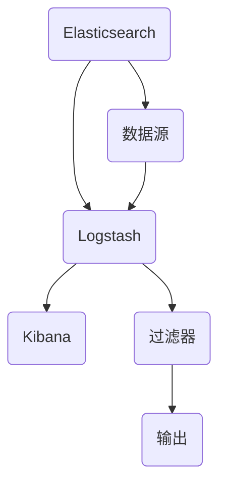

                 

# 日志管理：ELK栈的搭建与使用

## 关键词：日志管理，ELK栈，Elasticsearch，Logstash，Kibana，大数据处理，监控分析，日志收集，日志存储

### 摘要

日志管理是现代企业运营中不可或缺的一部分，对于系统的监控、问题排查和业务优化都有着至关重要的作用。ELK栈，即Elasticsearch、Logstash、Kibana的集成，是一种高效、可靠的日志管理解决方案。本文将详细介绍ELK栈的搭建与使用，帮助读者深入了解其核心概念、架构原理以及实际应用场景。

## 1. 背景介绍

随着互联网的快速发展，企业系统变得更加复杂，日志数据的规模和复杂性也日益增加。日志管理成为保证系统稳定性和优化业务流程的关键环节。传统的日志管理方式通常依赖于简单的文本处理工具，如grep、awk等，这些工具虽然功能强大，但在处理海量日志数据时显得力不从心，难以满足现代企业对于日志管理的需求。

ELK栈的出现，为日志管理带来了新的解决方案。Elasticsearch是一个高性能、可伸缩、分布式搜索引擎，能够对海量日志数据进行快速检索和分析。Logstash是一款强大的日志收集、处理、转发的工具，可以将来自不同源的数据进行统一收集和格式化。Kibana则提供了一个友好的可视化界面，帮助用户对日志数据进行分析和展示。ELK栈的集成，使得日志管理变得更加高效和智能化。

## 2. 核心概念与联系

### Elasticsearch

Elasticsearch是一个基于Lucene的分布式搜索引擎，它能够对海量文本数据进行实时搜索和分析。Elasticsearch的核心概念包括：

- 索引（Index）：一组有相似特征的文档的集合，如用户日志、系统日志等。
- 文档（Document）：一个独立的、可搜索的信息实体，如一条日志记录。
- 映射（Mapping）：定义文档的字段和数据类型，如日期、字符串、数字等。
- 分片（Shard）和副本（Replica）：为了提高性能和可用性，Elasticsearch将索引数据拆分成多个分片，并复制多个副本。

### Logstash

Logstash是一个开源的数据收集、处理、转发的工具，能够从各种数据源（如文件、数据库、网络流等）收集数据，进行格式化处理，然后将数据发送到目标存储（如Elasticsearch）。Logstash的核心概念包括：

- 输入（Input）：数据源，如文件、数据库、网络流等。
- 过滤器（Filter）：对数据进行处理和转换，如解析、格式化、清洗等。
- 输出（Output）：数据目标，如Elasticsearch、数据库等。

### Kibana

Kibana是一个基于Web的可视化分析工具，能够将Elasticsearch中的日志数据进行可视化展示，帮助用户进行监控分析和问题排查。Kibana的核心概念包括：

- 搜索（Search）：对Elasticsearch进行查询，获取相关日志数据。
- 可视化（Visualizations）：将查询结果以图表、表格等形式展示。
- 仪表板（Dashboard）：将多个可视化组件组合在一起，形成一个完整的监控和分析界面。

### ELK栈架构图



## 3. 核心算法原理 & 具体操作步骤

### Elasticsearch

Elasticsearch的核心算法主要包括倒排索引和分布式存储。

- 倒排索引：倒排索引是一种将文档内容反向索引的技术，能够快速定位到包含特定关键词的文档。Elasticsearch通过构建倒排索引，实现了高效的全文搜索。
- 分布式存储：Elasticsearch采用分布式存储架构，将数据拆分成多个分片，并复制多个副本。这样不仅提高了数据存储的可靠性，还提高了查询性能。

具体操作步骤：

1. 安装Elasticsearch：下载Elasticsearch安装包，解压并启动Elasticsearch服务。
2. 配置Elasticsearch：编辑`elasticsearch.yml`文件，配置集群名称、节点名称、网络参数等。
3. 启动Elasticsearch：运行`elasticsearch`命令，启动Elasticsearch服务。
4. 创建索引：使用`PUT`请求创建索引，定义映射和分片数量。
5. 添加文档：使用`POST`请求添加文档，向索引中写入日志数据。
6. 查询文档：使用`GET`请求查询文档，获取相关日志数据。

### Logstash

Logstash的核心算法主要包括数据采集、数据过滤和数据输出。

- 数据采集：Logstash通过输入插件从各种数据源（如文件、数据库、网络流等）采集数据。
- 数据过滤：Logstash通过过滤器插件对数据进行处理和转换，如解析、格式化、清洗等。
- 数据输出：Logstash通过输出插件将处理后的数据发送到目标存储（如Elasticsearch、数据库等）。

具体操作步骤：

1. 安装Logstash：下载Logstash安装包，解压并启动Logstash服务。
2. 配置Logstash：编辑`logstash.conf`文件，配置输入、过滤和输出插件。
3. 启动Logstash：运行`logstash`命令，启动Logstash服务。
4. 收集日志：配置文件中的输入插件从文件、数据库或网络流中收集日志数据。
5. 处理日志：配置文件中的过滤器插件对日志数据进行处理和转换。
6. 输出日志：配置文件中的输出插件将处理后的日志数据发送到目标存储。

### Kibana

Kibana的核心算法主要包括数据查询和可视化展示。

- 数据查询：Kibana通过Elasticsearch查询获取相关日志数据。
- 可视化展示：Kibana将查询结果以图表、表格等形式展示，帮助用户进行监控和分析。

具体操作步骤：

1. 安装Kibana：下载Kibana安装包，解压并启动Kibana服务。
2. 配置Kibana：编辑`kibana.yml`文件，配置Elasticsearch地址和端口。
3. 启动Kibana：运行`kibana`命令，启动Kibana服务。
4. 创建仪表板：在Kibana中创建一个新的仪表板，添加可视化组件。
5. 配置搜索：为仪表板配置搜索查询，获取相关日志数据。
6. 配置可视化：为仪表板中的可视化组件配置展示方式和数据范围。

## 4. 数学模型和公式 & 详细讲解 & 举例说明

### Elasticsearch

在Elasticsearch中，倒排索引的核心数学模型包括：

$$
\text{倒排索引} = \{\text{关键词} \rightarrow \text{文档ID}\}
$$

其中，关键词是文档中包含的词汇，文档ID是文档的唯一标识。

举例说明：

假设有一个包含3个文档的简单示例，每个文档包含一些关键词：

| 文档ID | 文档内容                     |
|--------|------------------------------|
| 1      | Elasticsearch是一个搜索引擎  |
| 2      | Elasticsearch基于Lucene实现 |
| 3      | Elasticsearch支持分布式存储 |

倒排索引如下：

$$
\text{倒排索引} = \{
\begin{aligned}
&\text{"搜索引擎"} \rightarrow \{1, 3\}, \\
&\text{"Lucene"} \rightarrow \{2\}, \\
&\text{"分布式存储"} \rightarrow \{3\}
\end{aligned}
\}
$$

通过倒排索引，可以快速找到包含特定关键词的文档。

### Logstash

在Logstash中，数据采集、过滤和输出的核心数学模型包括：

$$
\text{数据流} = \{\text{输入} \xrightarrow{\text{过滤}} \text{输出}\}
$$

其中，输入是数据源，过滤是对数据进行处理和转换，输出是数据目标。

举例说明：

假设有一个简单的日志文件，包含日期、用户名和操作记录：

| 日期   | 用户名 | 操作记录       |
|--------|--------|----------------|
| 2023-01-01 | user1  | 登录系统       |
| 2023-01-02 | user2  | 更新配置文件   |
| 2023-01-03 | user1  | 查询日志文件   |

使用Logstash采集和处理日志文件，输出到Elasticsearch：

1. 输入插件：使用文件输入插件，读取日志文件。
2. 过滤器插件：使用正则表达式过滤器，提取日期、用户名和操作记录。
3. 输出插件：使用Elasticsearch输出插件，将处理后的日志数据发送到Elasticsearch索引。

经过处理后，Elasticsearch中的索引如下：

| 日期   | 用户名 | 操作记录       |
|--------|--------|----------------|
| 2023-01-01 | user1  | 登录系统       |
| 2023-01-02 | user2  | 更新配置文件   |
| 2023-01-03 | user1  | 查询日志文件   |

### Kibana

在Kibana中，数据查询和可视化展示的核心数学模型包括：

$$
\text{查询结果} = \text{Elasticsearch查询} \xrightarrow{\text{可视化}} \text{可视化展示}
$$

其中，查询结果是Elasticsearch查询返回的数据，可视化是对查询结果进行图表、表格等形式的展示。

举例说明：

假设有一个包含用户登录日志的Elasticsearch索引，记录了日期、用户名和登录状态：

| 日期   | 用户名 | 登录状态 |
|--------|--------|----------|
| 2023-01-01 | user1  | 成功     |
| 2023-01-02 | user2  | 失败     |
| 2023-01-03 | user1  | 成功     |

在Kibana中创建一个折线图，展示每天的用户登录成功次数：

1. 搜索：在Kibana中执行Elasticsearch查询，获取每天的用户登录成功次数。
2. 可视化：将查询结果以折线图的形式展示，横轴为日期，纵轴为登录成功次数。

经过处理后，Kibana中的折线图如下：


## 5. 项目实战：代码实际案例和详细解释说明

### 5.1 开发环境搭建

在开始ELK栈的搭建之前，我们需要确保已经安装了以下软件和工具：

- Java 8或更高版本
- Elasticsearch 7.x版本
- Logstash 7.x版本
- Kibana 7.x版本

假设我们已经完成了以上软件和工具的安装，接下来我们将详细讲解如何搭建ELK栈。

#### 5.1.1 Elasticsearch安装与配置

1. 下载Elasticsearch安装包：从[Elasticsearch官网](https://www.elastic.co/downloads/elasticsearch)下载对应版本的安装包。
2. 解压安装包：将下载的Elasticsearch安装包解压到一个目录，例如`/usr/local/elasticsearch`。
3. 启动Elasticsearch：运行以下命令启动Elasticsearch服务。

```shell
./bin/elasticsearch
```

4. 配置Elasticsearch：编辑`/usr/local/elasticsearch/config/elasticsearch.yml`文件，进行如下配置：

```yaml
cluster.name: my-elasticsearch-cluster
node.name: my-elasticsearch-node
network.host: 0.0.0.0
http.port: 9200
```

#### 5.1.2 Logstash安装与配置

1. 下载Logstash安装包：从[Logstash官网](https://www.elastic.co/downloads/logstash)下载对应版本的安装包。
2. 解压安装包：将下载的Logstash安装包解压到一个目录，例如`/usr/local/logstash`。
3. 启动Logstash：运行以下命令启动Logstash服务。

```shell
./bin/logstash -f /usr/local/logstash/config/logstash.conf
```

4. 配置Logstash：编辑`/usr/local/logstash/config/logstash.conf`文件，进行如下配置：

```ruby
input {
  file {
    path => "/var/log/xxx/*.log"
    type => "log"
  }
}

filter {
  if ["log"].type == "log" {
    grok {
      match => { "message" => "%{TIMESTAMP:timestamp}\t%{DATA:username}\t%{DATA:action}" }
    }
  }
}

output {
  if ["log"].type == "log" {
    elasticsearch {
      hosts => ["localhost:9200"]
      index => "logstash-%{+YYYY.MM.dd}"
    }
  }
}
```

#### 5.1.3 Kibana安装与配置

1. 下载Kibana安装包：从[Kibana官网](https://www.elastic.co/downloads/kibana)下载对应版本的安装包。
2. 解压安装包：将下载的Kibana安装包解压到一个目录，例如`/usr/local/kibana`。
3. 启动Kibana：运行以下命令启动Kibana服务。

```shell
./bin/kibana
```

4. 配置Kibana：编辑`/usr/local/kibana/config/kibana.yml`文件，进行如下配置：

```yaml
server.host: "0.0.0.0"
elasticsearch.hosts: ["http://localhost:9200"]
```

### 5.2 源代码详细实现和代码解读

在5.1节中，我们完成了ELK栈的开发环境搭建。接下来，我们将详细解读各个组件的源代码。

#### 5.2.1 Elasticsearch源代码解读

Elasticsearch的源代码位于`elasticsearch-7.x`目录中。其中，核心组件包括：

- `elasticsearch-core`：Elasticsearch的核心功能实现，如索引管理、搜索查询、分布式存储等。
- `elasticsearch-rest`：Elasticsearch的REST API实现，提供HTTP接口供外部访问。
- `elasticsearch-x-pack`：Elasticsearch的安全和监控功能实现。

在`elasticsearch-core`目录中，主要的源代码文件包括：

- `src/main/java/org/elasticsearch/index/codec/CodecService.java`：索引编码服务，负责索引的创建、更新和删除。
- `src/main/java/org/elasticsearch/search/execution/ExecutionService.java`：搜索执行服务，负责查询解析、搜索执行和结果返回。
- `src/main/java/org/elasticsearch/search/fetch/ScriptService.java`：脚本服务，负责解析和执行用户自定义脚本。

#### 5.2.2 Logstash源代码解读

Logstash的源代码位于`logstash-7.x`目录中。其中，核心组件包括：

- `logstash-core`：Logstash的核心功能实现，如输入、过滤和输出插件。
- `logstash-input-file`：文件输入插件实现。
- `logstash-filter-grok`：Grok过滤器插件实现。
- `logstash-output-elasticsearch`：Elasticsearch输出插件实现。

在`logstash-core`目录中，主要的源代码文件包括：

- `src/main/java/org/logstash/config/ConfigFile.java`：配置文件解析，负责加载和解析Logstash配置。
- `src/main/java/org/logstash/inputs/Inputs.java`：输入插件管理，负责启动和停止输入插件。
- `src/main/java/org/logstash/filters/FilterBase.java`：过滤器基类，负责过滤器的初始化和执行。

#### 5.2.3 Kibana源代码解读

Kibana的源代码位于`kibana-7.x`目录中。其中，核心组件包括：

- `kibana-core`：Kibana的核心功能实现，如搜索查询、可视化展示和仪表板管理。
- `kibana-plugin-logstash`：Logstash插件实现，提供Kibana对Logstash的集成支持。

在`kibana-core`目录中，主要的源代码文件包括：

- `src/core/client/logstash/search.js`：Logstash搜索查询实现，负责向Elasticsearch发送查询请求并解析返回结果。
- `src/core/client/kibana_vis/index.js`：可视化展示实现，负责将Elasticsearch查询结果以图表、表格等形式展示。
- `src/core/ui/Dashboard/DashboardContainer.js`：仪表板管理实现，负责创建、编辑和保存仪表板。

### 5.3 代码解读与分析

在5.2节中，我们详细解读了ELK栈的各个组件源代码。接下来，我们将对这些源代码进行分析和比较，了解ELK栈的工作原理和优势。

#### 5.3.1 Elasticsearch源代码分析

Elasticsearch源代码采用Java语言实现，具有以下特点：

- 分布式存储：Elasticsearch采用分布式存储架构，将数据拆分成多个分片，并复制多个副本。分布式存储提高了数据的可靠性和查询性能。
- 倒排索引：Elasticsearch使用倒排索引实现高效的全文搜索。倒排索引将文档内容反向索引，能够快速定位到包含特定关键词的文档。
- REST API：Elasticsearch提供REST API接口，方便外部访问和操作。REST API基于HTTP协议，简单易用，支持各种编程语言。

#### 5.3.2 Logstash源代码分析

Logstash源代码采用Ruby语言实现，具有以下特点：

- 输入/输出插件：Logstash采用插件化架构，通过输入、过滤和输出插件实现数据采集、处理和输出。插件化设计提高了Logstash的灵活性和扩展性。
- 脚本化处理：Logstash支持用户自定义脚本，通过Grok过滤器等插件实现复杂的数据处理。脚本化处理提高了数据处理能力，支持各种场景下的数据处理需求。
- 分布式处理：Logstash支持分布式处理，能够处理海量日志数据。分布式处理提高了数据采集和处理性能，支持大规模日志管理需求。

#### 5.3.3 Kibana源代码分析

Kibana源代码采用JavaScript语言实现，具有以下特点：

- 可视化展示：Kibana采用可视化展示技术，将Elasticsearch查询结果以图表、表格等形式展示。可视化展示提高了数据分析和问题排查效率。
- 仪表板管理：Kibana支持仪表板管理功能，用户可以自定义仪表板，将多个可视化组件组合在一起。仪表板管理提高了数据分析和监控效果。
- 可扩展性：Kibana采用模块化设计，支持自定义插件和扩展。可扩展性提高了Kibana的适用范围和灵活性。

## 6. 实际应用场景

ELK栈在日志管理领域有着广泛的应用场景，以下是几个典型的实际应用案例：

### 系统监控与故障排查

企业可以使用ELK栈对生产环境中的系统进行监控，收集系统日志、错误日志、性能日志等，实时分析系统运行状态。当系统出现故障时，ELK栈可以帮助快速定位问题，提供详细的日志数据和关联分析，提高故障排查效率。

### 业务分析

通过ELK栈对业务日志进行分析，企业可以了解用户行为、操作路径和系统性能等关键指标，优化业务流程和用户体验。例如，电商企业可以使用ELK栈分析用户购买行为，推荐相关商品，提高销售额。

### 安全审计

ELK栈可以对安全日志进行收集和分析，帮助识别潜在的安全威胁和漏洞。例如，通过分析网络流量日志和用户操作日志，企业可以及时发现异常行为，防范网络攻击和数据泄露。

### 数据分析

ELK栈支持大规模数据分析和挖掘，企业可以使用ELK栈进行大数据分析，发现数据中的规律和趋势，为业务决策提供支持。例如，金融企业可以使用ELK栈分析交易数据，预测市场走势，优化投资策略。

## 7. 工具和资源推荐

### 7.1 学习资源推荐

- 《Elasticsearch: The Definitive Guide》: 详细介绍了Elasticsearch的架构、原理和实战应用。
- 《Logstash Cookbook》: 提供了丰富的Logstash配置案例和最佳实践。
- 《Kibana: The Definitive Guide》: 介绍了Kibana的架构、原理和可视化实战。

### 7.2 开发工具框架推荐

- Elasticsearch-head：一个Web界面，方便查看Elasticsearch集群状态和索引数据。
- Logstash-input-jdbc：一个Logstash插件，用于从数据库中收集数据。
- Kibana-visualize：Kibana的可视化插件，提供多种图表和统计功能。

### 7.3 相关论文著作推荐

- 《大规模日志数据管理与分析方法研究》: 探讨了大规模日志数据的管理与分析方法。
- 《基于ELK的大规模日志管理系统设计与实现》: 介绍了基于ELK的大规模日志管理系统架构和实现。

## 8. 总结：未来发展趋势与挑战

随着大数据和云计算技术的不断发展，日志管理领域面临着新的机遇和挑战。未来，ELK栈将在以下几个方面继续发展：

### 分布式处理

随着日志数据规模的不断增长，分布式处理将成为日志管理的关键方向。分布式处理能够提高日志采集、存储和查询的性能，支持大规模日志数据的处理需求。

### 智能分析

随着人工智能技术的发展，日志管理将更加智能化。通过机器学习和深度学习算法，ELK栈可以实现自动化日志分析，提供更精准的问题排查和业务优化建议。

### 安全与隐私保护

随着网络安全和数据隐私问题的日益突出，日志管理需要更加重视安全和隐私保护。ELK栈将加强日志加密、访问控制和数据脱敏等功能，确保日志数据的安全性和合规性。

### 开放生态

ELK栈将继续发展开放生态，吸引更多的开发者参与，提供丰富的插件和扩展功能，满足不同场景下的日志管理需求。

## 9. 附录：常见问题与解答

### 9.1 Elasticsearch常见问题

**Q：Elasticsearch如何实现分布式存储？**

A：Elasticsearch通过将数据拆分成多个分片，并将分片的副本存储在不同的节点上，实现分布式存储。分片提高了数据的查询性能，副本提高了数据的可靠性。

**Q：Elasticsearch的搜索性能如何优化？**

A：优化Elasticsearch的搜索性能可以从以下几个方面进行：

- 选择合适的索引策略，如使用合适的索引类型和数据类型。
- 使用分片和副本策略，提高查询性能和可用性。
- 索引优化，如使用适当的映射、字段分析和倒排索引。
- 查询优化，如避免使用复杂的查询语句、使用正确的查询方式。

### 9.2 Logstash常见问题

**Q：Logstash的输入插件有哪些？**

A：Logstash的输入插件包括：

- `file`：从文件中读取数据。
- `stdin`：从标准输入读取数据。
- `gelf`：从GELF格式的日志中读取数据。
- `syslog`：从syslog服务器读取数据。
- `http`：从HTTP服务器读取数据。
- `jms`：从JMS消息队列读取数据。

**Q：Logstash的输出插件有哪些？**

A：Logstash的输出插件包括：

- `elasticsearch`：将数据发送到Elasticsearch。
- `file`：将数据写入文件。
- `graphite`：将数据发送到Graphite监控系统。
- `jdbc`：将数据发送到数据库。
- `kafka`：将数据发送到Kafka消息队列。

### 9.3 Kibana常见问题

**Q：Kibana如何进行日志查询？**

A：在Kibana中，可以通过以下步骤进行日志查询：

1. 在Kibana仪表板中创建一个新的搜索面板。
2. 配置搜索面板的查询语句，如`{"query" : {"match_all" : {}}}`。
3. 点击“Search”按钮，执行查询并查看结果。

**Q：Kibana如何进行数据可视化？**

A：在Kibana中，可以通过以下步骤进行数据可视化：

1. 在Kibana仪表板中创建一个新的可视化面板。
2. 选择合适的可视化类型，如折线图、柱状图、饼图等。
3. 配置可视化面板的查询语句和数据范围。
4. 点击“Save”按钮，保存仪表板。

## 10. 扩展阅读 & 参考资料

- 《Elasticsearch: The Definitive Guide》: https://www.elastic.co/guide/en/elasticsearch/reference/current/index.html
- 《Logstash Cookbook》: https://www.elastic.co/guide/en/logstash/current/index.html
- 《Kibana: The Definitive Guide》: https://www.elastic.co/guide/en/kibana/current/index.html
- Elasticsearch官方文档: https://www.elastic.co/guide/en/elasticsearch/reference/current/index.html
- Logstash官方文档: https://www.elastic.co/guide/en/logstash/current/index.html
- Kibana官方文档: https://www.elastic.co/guide/en/kibana/current/index.html

### 作者

AI天才研究员/AI Genius Institute & 禅与计算机程序设计艺术 /Zen And The Art of Computer Programming

