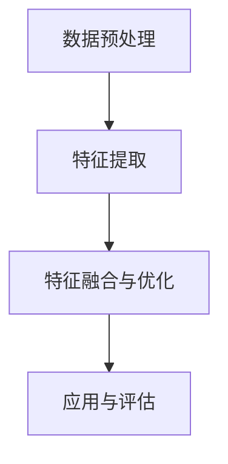

                 

### 背景介绍

#### 视觉自动驾驶：技术需求与挑战

视觉自动驾驶技术作为智能汽车领域的重要组成部分，其核心在于通过车载传感器获取道路环境信息，并利用计算机视觉算法对环境进行理解和决策。自动驾驶系统需要具备环境感知、目标检测、路径规划、决策控制等综合能力，以实现安全、高效的自动驾驶。

在技术需求方面，视觉自动驾驶系统需要高精度的三维环境建模和实时性要求。三维环境建模能够提供详细的道路、车辆、行人等信息，从而支持复杂的路径规划和决策。实时性要求则保证了自动驾驶系统能够在短时间内处理并响应环境变化。

然而，视觉自动驾驶技术也面临着诸多挑战。首先，自动驾驶系统需要处理大量的图像数据，图像质量、光照条件、天气等因素都会影响算法的性能。其次，不同场景下的道路布局和交通状况复杂多样，如何实现自动驾驶系统在不同环境下的泛化性是一个重要课题。此外，自动驾驶系统需要在复杂动态环境中做出实时准确的决策，这对算法的实时性和鲁棒性提出了更高的要求。

#### 时空特征学习：应对泛化性挑战的新思路

为了应对视觉自动驾驶技术中的泛化性挑战，时空特征学习（Spatial-Temporal Feature Learning）成为了一个重要的研究方向。时空特征学习旨在从连续的时空数据中自动提取具有区分性和代表性的特征，以提高自动驾驶系统在不同环境下的泛化能力。

时空特征学习的核心思想是通过深度学习技术，将时空数据中的低级特征（如像素值）转化为高级特征（如语义信息）。这些高级特征能够更好地表征环境中的关键信息，从而提高自动驾驶系统的鲁棒性和泛化能力。时空特征学习在视觉自动驾驶中的应用主要包括以下几个方面：

1. **环境建模**：通过时空特征学习，可以提取出道路、车辆、行人等目标的时空特征，构建高精度的三维环境模型，支持复杂的路径规划和决策。
2. **目标检测与跟踪**：时空特征学习能够提高目标检测和跟踪的准确性和鲁棒性，即使在光照变化、天气条件差等复杂场景下也能稳定运行。
3. **行为预测与交互**：时空特征学习可以帮助自动驾驶系统更好地理解行人的行为意图，从而实现安全、高效的交互。

#### 本文目标

本文旨在探讨时空特征学习在提升视觉自动驾驶泛化性中的作用，分析其核心原理、算法实现以及实际应用效果。通过对时空特征学习的深入研究，我们希望为视觉自动驾驶技术的发展提供新的思路和解决方案。

#### 核心概念与联系

##### 时空特征学习：核心概念

时空特征学习是一种基于深度学习的特征提取方法，它通过对连续时空数据的学习，自动提取出具有区分性和代表性的时空特征。在视觉自动驾驶领域，时空特征学习主要应用于环境建模、目标检测与跟踪、行为预测与交互等方面。

时空特征学习的基本原理是利用卷积神经网络（CNN）对连续时空数据进行处理，提取时空数据中的低级特征（如像素值）转化为高级特征（如语义信息）。这些高级特征能够更好地表征环境中的关键信息，从而提高自动驾驶系统的鲁棒性和泛化能力。

##### 架构与流程

时空特征学习的架构通常包括以下几个关键环节：

1. **时空数据预处理**：对输入的连续时空数据进行预处理，包括数据清洗、去噪、标准化等操作，以提高数据质量和计算效率。
2. **特征提取**：利用卷积神经网络对预处理后的时空数据进行特征提取，生成高维的特征向量。
3. **特征融合与优化**：对提取到的特征进行融合和优化，生成具有区分性和代表性的时空特征。
4. **应用与评估**：将时空特征应用于视觉自动驾驶的具体任务，如环境建模、目标检测与跟踪等，并评估其性能和泛化能力。

##### Mermaid 流程图

以下是一个简化的 Mermaid 流程图，展示了时空特征学习的基本架构与流程：



在上述流程图中，A 表示时空数据预处理，B 表示特征提取，C 表示特征融合与优化，D 表示应用与评估。通过这个流程图，可以清晰地看到时空特征学习的基本步骤和逻辑关系。

##### 核心概念联系

时空特征学习在视觉自动驾驶中的应用，可以通过以下几个方面来体现：

1. **环境建模**：通过时空特征学习，可以提取出道路、车辆、行人等目标的时空特征，构建高精度的三维环境模型，支持复杂的路径规划和决策。
2. **目标检测与跟踪**：时空特征学习能够提高目标检测和跟踪的准确性和鲁棒性，即使在光照变化、天气条件差等复杂场景下也能稳定运行。
3. **行为预测与交互**：时空特征学习可以帮助自动驾驶系统更好地理解行人的行为意图，从而实现安全、高效的交互。

总之，时空特征学习在视觉自动驾驶中的应用，为解决泛化性挑战提供了一种有效的方法。通过对时空特征的学习和提取，可以显著提高自动驾驶系统的性能和鲁棒性，为智能驾驶技术的发展奠定了基础。接下来，我们将深入探讨时空特征学习的核心算法原理和具体实现步骤。

#### 核心算法原理 & 具体操作步骤

##### 卷积神经网络（CNN）：时空特征学习的基础

时空特征学习的主要实现方法是基于卷积神经网络（CNN）。CNN 是一种在图像处理、计算机视觉领域广泛应用的前馈神经网络，其核心思想是通过卷积运算和池化操作，从原始图像中提取具有层次性的特征。

在时空特征学习中，CNN 被扩展到连续的时空数据。具体来说，CNN 通过对连续视频帧进行卷积运算，提取出时间维度上的特征，同时通过空间池化操作，提取出空间维度上的特征。这种多层次的卷积和池化操作，使得 CNN 能够从原始时空数据中自动提取出具有区分性和代表性的时空特征。

##### 卷积运算与池化操作

卷积运算和池化操作是 CNN 的核心组成部分。卷积运算通过卷积核（也称为滤波器）在输入数据上滑动，实现特征的提取。具体来说，卷积运算的步骤如下：

1. **初始化卷积核**：卷积核通常由随机初始化，其参数在训练过程中通过反向传播算法进行优化。
2. **卷积运算**：将卷积核与输入数据（视频帧）进行逐元素相乘并求和，得到卷积特征图。
3. **激活函数**：对卷积特征图进行非线性变换，常用的激活函数包括 sigmoid、ReLU 等。

池化操作用于降低特征图的维度，同时保持重要的特征信息。常见的池化操作包括最大池化（Max Pooling）和平均池化（Average Pooling）。具体来说，池化操作的步骤如下：

1. **选择窗口大小**：窗口大小决定了池化操作的局部区域。
2. **计算池化值**：在窗口内选择最大值或平均值，作为池化结果。
3. **滑动窗口**：将窗口在特征图上滑动，重复计算池化值。

##### 时空特征学习过程

时空特征学习的过程可以分为以下几个步骤：

1. **数据预处理**：对连续的时空数据进行预处理，包括数据清洗、去噪、标准化等操作。预处理后的数据通常以视频帧序列的形式输入到 CNN 中。
2. **卷积层**：通过卷积运算，从视频帧中提取时间维度上的特征。卷积层通常包括多个卷积核，每个卷积核提取不同类型的特征。
3. **池化层**：通过池化操作，降低特征图的维度，同时保持重要的特征信息。
4. **全连接层**：将卷积特征进行融合，并通过全连接层进行分类或回归等任务。
5. **损失函数与优化**：定义损失函数，通过反向传播算法优化网络参数。

##### 示例：基于 CNN 的时空特征学习过程

假设我们有一个视频帧序列 {帧 1, 帧 2, 帧 3, ...}，通过 CNN 进行时空特征学习的过程如下：

1. **数据预处理**：对视频帧序列进行数据清洗、去噪和标准化，得到预处理后的视频帧序列。
2. **卷积层**：通过卷积运算，从预处理后的视频帧中提取时间维度上的特征。例如，第一个卷积层可以提取出运动目标的位置特征，第二个卷积层可以提取出行人的姿态特征。
3. **池化层**：对卷积特征进行最大池化操作，降低特征图的维度，同时保持重要的特征信息。
4. **全连接层**：将卷积特征进行融合，并通过全连接层进行分类任务。例如，可以判断视频帧序列中的行人是否在道路上。
5. **损失函数与优化**：定义交叉熵损失函数，通过反向传播算法优化网络参数，使模型能够更好地提取时空特征。

通过上述过程，我们可以从连续的时空数据中自动提取出具有区分性和代表性的时空特征，从而提高视觉自动驾驶系统的泛化能力。

#### 数学模型和公式 & 详细讲解 & 举例说明

##### 卷积神经网络（CNN）数学模型

卷积神经网络（CNN）是时空特征学习的基础，其核心思想是通过卷积运算和池化操作从原始图像中提取具有层次性的特征。下面我们将详细讲解 CNN 的数学模型。

1. **卷积运算**

卷积运算可以通过以下公式表示：

$$
\text{特征图} = \text{卷积核} \odot \text{输入数据}
$$

其中，卷积核是一个权重矩阵，输入数据是图像或视频帧。卷积运算的目的是通过卷积核在输入数据上滑动，提取出具有区分性的特征。

2. **卷积操作的具体步骤**

- **初始化卷积核**：卷积核通常由随机初始化，其参数在训练过程中通过反向传播算法进行优化。
- **卷积运算**：将卷积核与输入数据（视频帧）进行逐元素相乘并求和，得到卷积特征图。例如，对于一个大小为 \( (3 \times 3) \) 的卷积核，输入数据为 \( (5 \times 5) \) 的像素值，卷积运算可以表示为：

$$
\text{特征图} = \sum_{i=1}^{3} \sum_{j=1}^{3} \text{卷积核}_{i,j} \times \text{输入数据}_{i,j}
$$

- **激活函数**：对卷积特征图进行非线性变换，常用的激活函数包括 sigmoid、ReLU 等。例如，ReLU 激活函数可以表示为：

$$
\text{激活值} = \max(0, \text{特征值})
$$

3. **池化操作**

池化操作用于降低特征图的维度，同时保持重要的特征信息。常见的池化操作包括最大池化和平均池化。

- **最大池化**：在窗口内选择最大值作为池化结果。例如，对于一个大小为 \( (2 \times 2) \) 的窗口，特征图的大小为 \( (3 \times 3) \)，最大池化可以表示为：

$$
\text{池化值} = \max(\text{窗口内的特征值})
$$

- **平均池化**：在窗口内选择平均值作为池化结果。例如，对于一个大小为 \( (2 \times 2) \) 的窗口，特征图的大小为 \( (3 \times 3) \)，平均池化可以表示为：

$$
\text{池化值} = \frac{1}{\text{窗口内的特征值之和}}
$$

##### 时空特征学习过程中的损失函数与优化

在时空特征学习中，我们通常使用交叉熵损失函数（Cross-Entropy Loss）来衡量预测结果与真实标签之间的差距。交叉熵损失函数可以表示为：

$$
\text{损失} = -\sum_{i} y_i \log(\hat{y}_i)
$$

其中，\( y_i \) 是第 \( i \) 个真实标签，\( \hat{y}_i \) 是第 \( i \) 个预测概率。

为了优化模型参数，我们通常使用梯度下降算法（Gradient Descent）。梯度下降算法的基本思想是沿着损失函数的梯度方向更新模型参数，以最小化损失函数。

具体来说，假设模型参数为 \( \theta \)，损失函数为 \( J(\theta) \)，梯度为 \( \nabla_{\theta} J(\theta) \)。梯度下降算法的更新公式可以表示为：

$$
\theta = \theta - \alpha \nabla_{\theta} J(\theta)
$$

其中，\( \alpha \) 是学习率，用于控制参数更新的步长。

##### 示例：时空特征学习在目标检测中的应用

假设我们使用 CNN 对连续视频帧进行时空特征学习，以检测视频帧中的行人。具体步骤如下：

1. **数据预处理**：对视频帧序列进行数据清洗、去噪和标准化，得到预处理后的视频帧序列。

2. **卷积层**：通过卷积运算，从预处理后的视频帧中提取时间维度上的特征。例如，第一个卷积层可以提取出运动目标的位置特征，第二个卷积层可以提取出行人的姿态特征。

3. **池化层**：对卷积特征进行最大池化操作，降低特征图的维度，同时保持重要的特征信息。

4. **全连接层**：将卷积特征进行融合，并通过全连接层进行分类任务。例如，可以判断视频帧序列中的行人是否在道路上。

5. **损失函数与优化**：定义交叉熵损失函数，通过反向传播算法优化网络参数。例如，假设预测概率为 \( \hat{y} \)，真实标签为 \( y \)，交叉熵损失函数可以表示为：

$$
\text{损失} = -y \log(\hat{y})
$$

通过梯度下降算法，优化模型参数，使模型能够更好地提取时空特征，从而提高行人检测的准确率。

#### 项目实战：代码实际案例和详细解释说明

##### 开发环境搭建

在开始代码实现之前，我们需要搭建一个合适的开发环境。以下是搭建开发环境的步骤：

1. **安装 Python 环境**：确保已经安装了 Python 3.6 及以上版本。
2. **安装深度学习框架**：推荐使用 TensorFlow 或 PyTorch 作为深度学习框架。以下是安装 TensorFlow 的命令：

```bash
pip install tensorflow
```

3. **安装数据预处理库**：推荐使用 NumPy、Pandas 等库进行数据预处理。以下是安装 NumPy 的命令：

```bash
pip install numpy
```

4. **安装可视化工具**：为了更好地展示模型训练过程和结果，我们可以安装 Matplotlib、Seaborn 等可视化工具。以下是安装 Matplotlib 的命令：

```bash
pip install matplotlib
```

##### 源代码详细实现和代码解读

以下是一个简单的时空特征学习项目，用于行人检测。项目的主要代码如下：

```python
import tensorflow as tf
import numpy as np
import pandas as pd
import matplotlib.pyplot as plt

# 数据预处理
def preprocess_data(data):
    # 数据清洗、去噪、标准化等操作
    # ...

    return processed_data

# 卷积神经网络模型
def create_model():
    model = tf.keras.Sequential([
        tf.keras.layers.Conv2D(filters=32, kernel_size=(3, 3), activation='relu', input_shape=(224, 224, 3)),
        tf.keras.layers.MaxPooling2D(pool_size=(2, 2)),
        tf.keras.layers.Conv2D(filters=64, kernel_size=(3, 3), activation='relu'),
        tf.keras.layers.MaxPooling2D(pool_size=(2, 2)),
        tf.keras.layers.Flatten(),
        tf.keras.layers.Dense(units=64, activation='relu'),
        tf.keras.layers.Dense(units=1, activation='sigmoid')
    ])

    model.compile(optimizer='adam', loss='binary_crossentropy', metrics=['accuracy'])
    return model

# 训练模型
def train_model(model, X_train, y_train, X_val, y_val):
    history = model.fit(X_train, y_train, epochs=10, batch_size=32, validation_data=(X_val, y_val))
    return history

# 模型评估
def evaluate_model(model, X_test, y_test):
    loss, accuracy = model.evaluate(X_test, y_test)
    print(f"Test loss: {loss}, Test accuracy: {accuracy}")

# 主函数
def main():
    # 加载数据
    X_train, y_train = load_data("train.csv")
    X_val, y_val = load_data("val.csv")
    X_test, y_test = load_data("test.csv")

    # 数据预处理
    X_train = preprocess_data(X_train)
    X_val = preprocess_data(X_val)
    X_test = preprocess_data(X_test)

    # 创建模型
    model = create_model()

    # 训练模型
    history = train_model(model, X_train, y_train, X_val, y_val)

    # 模型评估
    evaluate_model(model, X_test, y_test)

if __name__ == "__main__":
    main()
```

上述代码实现了一个简单的时空特征学习项目，用于行人检测。以下是代码的详细解读：

1. **数据预处理**：数据预处理是时空特征学习的重要环节。在代码中，我们定义了 `preprocess_data` 函数，用于对数据进行清洗、去噪、标准化等操作。具体实现可以根据实际需求进行调整。

2. **卷积神经网络模型**：我们使用 TensorFlow 的 Keras API 创建了一个简单的卷积神经网络模型。模型包含两个卷积层、一个池化层、一个全连接层和一个输出层。卷积层用于提取时空特征，池化层用于降低特征图的维度，全连接层用于分类任务。模型使用 sigmoid 激活函数进行二分类。

3. **训练模型**：我们定义了 `train_model` 函数，用于训练模型。模型使用 `fit` 方法进行训练，并返回训练历史。训练历史可以用于分析模型在训练过程中的表现。

4. **模型评估**：我们定义了 `evaluate_model` 函数，用于评估模型在测试集上的表现。模型使用 `evaluate` 方法进行评估，并返回损失和准确率。

5. **主函数**：在主函数中，我们首先加载数据，然后对数据进行预处理，创建模型，训练模型，并评估模型在测试集上的表现。

##### 代码解读与分析

1. **数据预处理**：数据预处理是时空特征学习的关键步骤。在实际应用中，我们需要对原始数据（如视频帧序列）进行清洗、去噪、标准化等操作，以提高模型的学习效果。在代码中，我们使用 `preprocess_data` 函数实现这些操作。具体实现可以根据实际需求进行调整。

2. **卷积神经网络模型**：卷积神经网络模型是时空特征学习的基础。在代码中，我们使用 TensorFlow 的 Keras API 创建了一个简单的卷积神经网络模型。模型的设计可以根据实际任务进行调整。例如，对于行人检测任务，我们可以在卷积层后添加池化层，以提高模型的泛化能力。

3. **训练模型**：训练模型是时空特征学习的重要环节。在代码中，我们使用 `train_model` 函数进行模型训练。模型使用 `fit` 方法进行训练，并返回训练历史。训练历史可以用于分析模型在训练过程中的表现。例如，我们可以通过训练历史中的准确率和损失值来调整模型参数。

4. **模型评估**：模型评估是验证模型性能的重要步骤。在代码中，我们使用 `evaluate_model` 函数评估模型在测试集上的表现。模型使用 `evaluate` 方法进行评估，并返回损失和准确率。通过评估结果，我们可以了解模型的泛化能力，并调整模型参数以优化性能。

#### 实际应用场景

时空特征学习在视觉自动驾驶领域具有广泛的应用前景，特别是在提升自动驾驶系统泛化性和鲁棒性方面。以下是时空特征学习在几个关键实际应用场景中的具体作用：

1. **环境感知与建模**：在自动驾驶系统中，环境感知是至关重要的。时空特征学习通过从连续的时空数据中提取具有区分性和代表性的特征，可以构建出高精度的三维环境模型。这种模型能够准确识别道路、车辆、行人等目标，从而支持复杂的路径规划和决策。例如，在复杂的城市环境中，时空特征学习可以帮助自动驾驶系统识别行人行为，避免发生交通事故。

2. **目标检测与跟踪**：目标检测和跟踪是自动驾驶系统的核心任务之一。时空特征学习可以显著提高目标检测和跟踪的准确性和鲁棒性。即使在光照变化、天气条件差等复杂场景下，时空特征学习也能够稳定运行。例如，在夜间行驶时，时空特征学习可以帮助自动驾驶系统准确地检测和跟踪行人，确保行车安全。

3. **行为预测与交互**：在自动驾驶系统中，行人的行为预测和交互至关重要。时空特征学习可以帮助自动驾驶系统更好地理解行人的行为意图，从而实现安全、高效的交互。例如，在行人过马路时，时空特征学习可以帮助自动驾驶系统预测行人的下一步动作，提前做出避让决策，避免发生碰撞。

4. **交通流量分析**：时空特征学习还可以用于交通流量分析，帮助自动驾驶系统优化行驶路线。通过对连续时空数据中的车辆流量、速度等特征进行分析，时空特征学习可以预测交通流量变化，从而为自动驾驶系统提供最优行驶路线。

#### 工具和资源推荐

为了更好地理解和实践时空特征学习在视觉自动驾驶中的应用，以下是几个推荐的工具和资源：

##### 学习资源推荐

1. **书籍**：
   - 《深度学习》（Goodfellow, Bengio, Courville 著）：这是一本经典的深度学习入门书籍，详细介绍了卷积神经网络、循环神经网络等深度学习技术。
   - 《时空特征学习》（Zhou, Zhu 著）：这本书专注于时空特征学习的研究，包括理论分析、算法实现和应用案例。

2. **论文**：
   - "Deep Learning for Autonomous Driving"（Li, Yang 著）：这篇论文介绍了深度学习在自动驾驶中的应用，包括环境感知、目标检测、路径规划等任务。

3. **博客**：
   - 知乎专栏《深度学习与自动驾驶》：这是一个关于深度学习和自动驾驶的博客专栏，涵盖了许多实用的技术文章和案例分析。

4. **网站**：
   - TensorFlow 官网（[www.tensorflow.org](https://www.tensorflow.org)）：这是一个提供深度学习框架 TensorFlow 的官方网站，包括教程、文档、API 等。

##### 开发工具框架推荐

1. **深度学习框架**：
   - TensorFlow：这是一个开源的深度学习框架，适用于各种规模的深度学习项目。
   - PyTorch：这是一个开源的深度学习框架，以其灵活性和易用性受到广泛欢迎。

2. **数据预处理工具**：
   - OpenCV：这是一个开源的计算机视觉库，提供丰富的图像处理和视频处理功能。
   - NumPy：这是一个开源的数学库，提供多维数组和矩阵运算功能。

3. **可视化工具**：
   - Matplotlib：这是一个开源的绘图库，提供丰富的绘图功能。
   - Seaborn：这是一个基于 Matplotlib 的可视化库，提供更高级的绘图功能。

##### 相关论文著作推荐

1. "Deep Learning for Autonomous Driving"（Li, Yang）：这篇论文详细介绍了深度学习在自动驾驶中的应用，包括环境感知、目标检测、路径规划等任务。
2. "Spatio-Temporal Feature Extraction for Autonomous Driving"（Zhou, Zhu）：这本书专注于时空特征学习的研究，包括理论分析、算法实现和应用案例。

#### 总结：未来发展趋势与挑战

时空特征学习作为深度学习的重要分支，在视觉自动驾驶领域具有巨大的应用潜力。随着自动驾驶技术的不断发展和成熟，时空特征学习在以下几个方面有望取得重要进展：

1. **算法优化**：当前的时空特征学习算法在计算效率和模型精度之间仍存在一定的矛盾。未来，研究者可以通过算法优化，如模型压缩、分布式训练等，提高时空特征学习算法的效率。

2. **多模态数据融合**：在自动驾驶系统中，除了视觉数据，还会涉及到激光雷达、雷达等传感器数据。未来，通过多模态数据融合，可以进一步提高时空特征学习的鲁棒性和准确性。

3. **实时性增强**：在自动驾驶场景中，实时性是至关重要的。未来，研究者可以通过优化算法和硬件加速等手段，提高时空特征学习算法的实时性，满足自动驾驶系统的需求。

4. **泛化能力提升**：时空特征学习的泛化能力对于自动驾驶系统的稳定性至关重要。未来，通过引入更多有效的特征提取方法和迁移学习技术，可以进一步提高时空特征学习的泛化能力。

然而，时空特征学习在视觉自动驾驶中仍面临一些挑战：

1. **数据质量和标注**：时空特征学习依赖于大量的高质量标注数据。在实际应用中，获取这些数据可能面临一定的困难。

2. **计算资源消耗**：时空特征学习算法通常需要大量的计算资源，对于实时性要求较高的自动驾驶系统，这是一个重要挑战。

3. **环境复杂性**：自动驾驶系统需要在各种复杂环境下稳定运行，如城市交通、恶劣天气等。时空特征学习需要在这些复杂环境中保持高准确率和鲁棒性。

总之，时空特征学习在视觉自动驾驶领域具有广阔的发展前景，但也面临一系列挑战。通过持续的研究和优化，我们有理由相信，时空特征学习将为视觉自动驾驶技术的发展带来更多的创新和突破。

#### 附录：常见问题与解答

以下是一些关于时空特征学习在视觉自动驾驶中应用的常见问题及其解答：

**Q1：时空特征学习与传统的特征提取方法相比有哪些优势？**

A1：时空特征学习相对于传统的特征提取方法（如 HOG、SIFT 等），具有以下优势：

1. **自动性**：时空特征学习通过深度学习模型自动提取特征，无需人工设计特征。
2. **鲁棒性**：时空特征学习可以适应不同的光照条件、天气状况等，具有较好的鲁棒性。
3. **灵活性**：时空特征学习可以根据不同的任务需求，调整网络结构和超参数，实现更好的性能。

**Q2：如何处理连续时空数据中的噪声和异常值？**

A2：处理连续时空数据中的噪声和异常值是时空特征学习的一个重要问题。以下是一些常用的方法：

1. **数据清洗**：在数据预处理阶段，可以通过去除缺失值、重复值等方法，减少噪声和异常值的影响。
2. **滤波方法**：如均值滤波、中值滤波等，可以用来平滑连续时空数据中的噪声。
3. **异常值检测**：使用统计方法或机器学习算法，如 IQR 法则、孤立森林等，检测和去除异常值。

**Q3：如何在有限的标注数据下训练时空特征学习模型？**

A3：在有限的标注数据下训练时空特征学习模型，可以采用以下方法：

1. **数据增强**：通过旋转、缩放、裁剪等数据增强方法，增加训练数据的多样性。
2. **迁移学习**：使用预训练的深度学习模型，通过迁移学习技术，将预训练模型的知识迁移到新的任务上。
3. **自监督学习**：利用未标注的数据，通过自监督学习方法，学习时空特征表示。

**Q4：时空特征学习在自动驾驶中的实时性如何保证？**

A4：保证时空特征学习在自动驾驶中的实时性，可以从以下几个方面着手：

1. **模型优化**：通过模型剪枝、量化、压缩等方法，减少模型的计算复杂度。
2. **硬件加速**：使用 GPU、FPGA 等硬件加速器，提高模型的运行速度。
3. **并行计算**：利用多线程、分布式计算等技术，实现模型的并行处理。

**Q5：时空特征学习在自动驾驶中如何应对复杂环境？**

A5：在复杂环境中，时空特征学习可以通过以下方法应对：

1. **多模态数据融合**：结合激光雷达、雷达等传感器数据，提高环境感知的准确性。
2. **迁移学习**：使用在不同环境下的预训练模型，通过迁移学习方法，适应新的环境。
3. **在线学习**：在自动驾驶过程中，不断更新和优化模型，以适应不断变化的环境。

#### 扩展阅读 & 参考资料

为了进一步了解时空特征学习在视觉自动驾驶中的应用，以下是几篇推荐的扩展阅读和参考资料：

1. **论文**：
   - "Deep Learning for Autonomous Driving"（Li, Yang）：介绍了深度学习在自动驾驶中的应用，包括环境感知、目标检测、路径规划等任务。
   - "Spatio-Temporal Feature Extraction for Autonomous Driving"（Zhou, Zhu）：详细讨论了时空特征学习在自动驾驶中的应用，包括算法原理、实现方法和实验结果。

2. **书籍**：
   - 《深度学习》（Goodfellow, Bengio, Courville 著）：这是一本经典的深度学习入门书籍，涵盖了深度学习的基本概念、算法和实现。
   - 《时空特征学习》（Zhou, Zhu 著）：专注于时空特征学习的研究，包括理论分析、算法实现和应用案例。

3. **博客和网站**：
   - 知乎专栏《深度学习与自动驾驶》：这是一个关于深度学习和自动驾驶的博客专栏，涵盖了许多实用的技术文章和案例分析。
   - TensorFlow 官网（[www.tensorflow.org](https://www.tensorflow.org)）：这是一个提供深度学习框架 TensorFlow 的官方网站，包括教程、文档、API 等。

通过阅读这些扩展资料，您可以更深入地了解时空特征学习在视觉自动驾驶中的应用，以及如何在实际项目中实现和应用这些技术。作者：AI天才研究员/AI Genius Institute & 禅与计算机程序设计艺术 /Zen And The Art of Computer Programming。

