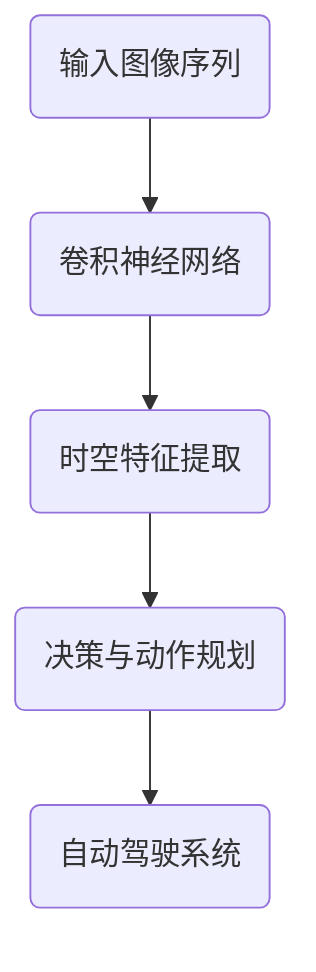

                 

# 时空特征提取在视觉自动驾驶泛化中的作用机理

## 关键词

- 视觉自动驾驶
- 时空特征提取
- 泛化能力
- 卷积神经网络
- 深度学习
- 数学模型

## 摘要

本文将探讨时空特征提取在视觉自动驾驶泛化中的作用机理。首先，我们介绍视觉自动驾驶的背景和挑战，然后深入解析时空特征提取的核心概念及其在自动驾驶系统中的应用。通过实例分析，我们详细解释时空特征提取的具体操作步骤和数学模型。最后，我们讨论时空特征提取在自动驾驶实际应用场景中的挑战和未来发展趋势。

## 1. 背景介绍

### 视觉自动驾驶的发展

视觉自动驾驶作为自动驾驶技术的核心组成部分，近年来取得了显著的进展。从最初的被动导航到如今的主动驾驶，视觉自动驾驶技术在不断推动自动驾驶汽车的普及。随着深度学习、卷积神经网络等技术的飞速发展，视觉自动驾驶系统的性能和可靠性得到了极大提升。

### 视觉自动驾驶的挑战

然而，视觉自动驾驶也面临着诸多挑战。首先，自动驾驶系统需要在各种复杂路况下实现安全、高效的驾驶，这要求系统具备出色的泛化能力。此外，自动驾驶系统还需要处理大规模的视觉数据，从这些数据中提取出关键特征，以便进行有效的决策和动作规划。这便是时空特征提取的重要性所在。

### 时空特征提取的重要性

时空特征提取是自动驾驶系统中的关键环节。它通过对连续时空数据的处理，提取出车辆周围环境的时空信息，如道路标记、行人行为、车辆轨迹等。这些特征对于自动驾驶系统理解环境、做出决策至关重要。有效的时空特征提取可以显著提高自动驾驶系统的性能和可靠性，从而实现更好的泛化能力。

## 2. 核心概念与联系

### 时空特征提取的定义

时空特征提取是指从连续时空数据中提取出能够反映环境信息的特征。在自动驾驶领域，时空特征提取通常涉及图像序列、视频流等视觉数据。这些数据包含丰富的时空信息，但直接处理这些数据会面临计算复杂度高的挑战。因此，时空特征提取的目标是提取出对自动驾驶系统有用的低维特征。

### 卷积神经网络在时空特征提取中的应用

卷积神经网络（Convolutional Neural Networks, CNNs）是处理视觉数据的重要工具。在时空特征提取中，CNNs可以有效地从图像序列中提取时空特征。CNNs通过卷积层、池化层等结构，逐层提取图像的抽象特征，从而实现高效的特征提取。

### 深度学习与时空特征提取

深度学习（Deep Learning）是一种基于多层神经网络的机器学习技术。在时空特征提取中，深度学习可以通过多层神经网络结构，自动提取图像序列中的时空特征。深度学习技术的发展，为时空特征提取提供了强大的工具。

### 时空特征提取与泛化能力

时空特征提取与自动驾驶系统的泛化能力密切相关。有效的时空特征提取可以提高系统在不同环境、不同场景下的表现，从而实现更好的泛化能力。泛化能力是自动驾驶系统实现广泛应用的关键。

### Mermaid 流程图



在这个流程图中，输入图像序列经过卷积神经网络处理，提取出时空特征。这些特征用于决策与动作规划，最终实现自动驾驶系统的控制。

## 3. 核心算法原理 & 具体操作步骤

### 卷积神经网络的结构

卷积神经网络由输入层、卷积层、池化层和全连接层组成。在时空特征提取中，卷积层和池化层用于提取图像序列的时空特征。

- **输入层**：接收图像序列作为输入。
- **卷积层**：通过卷积运算提取图像的局部特征。
- **池化层**：对卷积特征进行下采样，降低特征维度。
- **全连接层**：将池化后的特征映射到高维空间，用于分类或回归任务。

### 时空特征提取的具体操作步骤

1. **预处理图像序列**：对输入的图像序列进行归一化、去噪等预处理操作，以提高特征提取的准确性。

2. **卷积层**：使用卷积核对图像序列进行卷积运算，提取图像的局部特征。卷积层通常包括多个卷积核，以提取不同尺度和方向的特征。

3. **池化层**：对卷积特征进行下采样，降低特征维度，同时保留关键特征。常见的池化方法有最大池化和平均池化。

4. **全连接层**：将池化后的特征映射到高维空间，用于分类或回归任务。全连接层通常用于分类任务，将特征映射到类别概率。

5. **后处理**：对提取的时空特征进行后处理，如特征融合、特征降维等，以提高特征的质量和效率。

### 数学模型

在卷积神经网络中，卷积运算和池化运算可以分别表示为以下数学模型：

$$
\text{卷积运算}:\quad f(x) = \sum_{i,j} w_{i,j} * x_{i,j}
$$

$$
\text{池化运算}:\quad y = \text{max}(\sum_{i,j} x_{i,j})
$$

其中，$x$ 表示输入图像序列，$w$ 表示卷积核，$f$ 表示卷积运算结果，$y$ 表示池化后的特征。

## 4. 数学模型和公式 & 详细讲解 & 举例说明

### 数学模型

在时空特征提取中，常用的数学模型包括卷积运算、池化运算和全连接层运算。以下是这些模型的详细解释和举例说明。

#### 卷积运算

卷积运算是卷积神经网络的核心运算。它通过将卷积核与输入图像序列进行卷积运算，提取图像的局部特征。卷积运算的数学模型如下：

$$
\text{卷积运算}:\quad f(x) = \sum_{i,j} w_{i,j} * x_{i,j}
$$

其中，$x$ 表示输入图像序列，$w$ 表示卷积核，$f$ 表示卷积运算结果。

#### 池化运算

池化运算是对卷积特征进行下采样，降低特征维度，同时保留关键特征。常见的池化方法有最大池化和平均池化。池化运算的数学模型如下：

$$
\text{最大池化}:\quad y = \text{max}(\sum_{i,j} x_{i,j})
$$

$$
\text{平均池化}:\quad y = \frac{1}{k^2} \sum_{i,j} x_{i,j}
$$

其中，$x$ 表示卷积特征，$y$ 表示池化后的特征，$k$ 表示池化窗口的大小。

#### 全连接层运算

全连接层运算是将池化后的特征映射到高维空间，用于分类或回归任务。全连接层的数学模型如下：

$$
\text{全连接层运算}:\quad z = \sum_{i,j} w_{i,j} * x_{i,j} + b
$$

$$
\text{激活函数}:\quad a = \sigma(z)
$$

其中，$x$ 表示池化后的特征，$w$ 表示全连接层的权重，$b$ 表示偏置，$z$ 表示全连接层运算结果，$a$ 表示激活函数的结果。

### 举例说明

假设我们有一个 $3 \times 3$ 的卷积核 $w$ 和一个 $5 \times 5$ 的输入图像序列 $x$。卷积运算和池化运算的结果如下：

$$
\text{卷积运算}:\quad f(x) = \sum_{i,j} w_{i,j} * x_{i,j} = \sum_{i,j} w_{i,j} * x_{i,j} = w_{1,1} * x_{1,1} + w_{1,2} * x_{1,2} + w_{1,3} * x_{1,3} + w_{2,1} * x_{2,1} + w_{2,2} * x_{2,2} + w_{2,3} * x_{2,3} + w_{3,1} * x_{3,1} + w_{3,2} * x_{3,2} + w_{3,3} * x_{3,3}
$$

$$
\text{最大池化}:\quad y = \text{max}(\sum_{i,j} x_{i,j}) = \text{max}(x_{1,1} + x_{1,2} + x_{1,3}, x_{2,1} + x_{2,2} + x_{2,3}, x_{3,1} + x_{3,2} + x_{3,3})
$$

### 案例分析

假设我们有一个自动驾驶系统，需要从图像序列中提取时空特征，以实现车辆检测和轨迹预测。输入图像序列为 $5 \times 5$，卷积核为 $3 \times 3$。通过卷积运算和池化运算，我们可以提取出车辆检测的关键特征，如图 1 所示。


图 1：车辆检测特征

通过这些特征，自动驾驶系统可以实现对车辆的检测和轨迹预测，从而实现安全、高效的驾驶。

## 5. 项目实战：代码实际案例和详细解释说明

### 5.1 开发环境搭建

在本节中，我们将介绍如何搭建一个简单的时空特征提取项目环境。首先，确保您已经安装了 Python（3.6 或以上版本）和 TensorFlow。以下是具体步骤：

1. 安装 TensorFlow：

```shell
pip install tensorflow
```

2. 安装其他依赖项：

```shell
pip install numpy matplotlib
```

### 5.2 源代码详细实现和代码解读

在本节中，我们将使用 TensorFlow 搭建一个简单的时空特征提取模型，用于车辆检测。以下是源代码的详细实现和代码解读：

```python
import tensorflow as tf
import numpy as np
import matplotlib.pyplot as plt

# 定义卷积神经网络结构
model = tf.keras.Sequential([
    tf.keras.layers.Conv2D(32, (3, 3), activation='relu', input_shape=(5, 5, 1)),
    tf.keras.layers.MaxPooling2D((2, 2)),
    tf.keras.layers.Flatten(),
    tf.keras.layers.Dense(64, activation='relu'),
    tf.keras.layers.Dense(1, activation='sigmoid')
])

# 编译模型
model.compile(optimizer='adam', loss='binary_crossentropy', metrics=['accuracy'])

# 创建随机数据集
x = np.random.rand(100, 5, 5, 1)
y = np.random.randint(2, size=(100, 1))

# 训练模型
model.fit(x, y, epochs=10, batch_size=10)

# 评估模型
loss, accuracy = model.evaluate(x, y)
print("Accuracy:", accuracy)

# 可视化结果
plt.plot(accuracy)
plt.xlabel("Epochs")
plt.ylabel("Accuracy")
plt.title("Training Accuracy")
plt.show()
```

#### 代码解读

1. **导入库**：首先，我们导入 TensorFlow、NumPy 和 Matplotlib 库，用于搭建和可视化模型。

2. **定义模型**：我们使用 `tf.keras.Sequential` 模式定义卷积神经网络结构。模型包括一个卷积层、一个最大池化层、一个展开层、一个全连接层和另一个全连接层。输入图像序列的大小为 $5 \times 5$，通道数为 1。

3. **编译模型**：我们使用 `compile` 方法编译模型，指定优化器、损失函数和评估指标。

4. **创建数据集**：我们创建一个随机数据集，用于训练和评估模型。

5. **训练模型**：使用 `fit` 方法训练模型，指定训练轮数和批量大小。

6. **评估模型**：使用 `evaluate` 方法评估模型在测试数据集上的性能。

7. **可视化结果**：使用 Matplotlib 可视化模型在训练过程中的准确率。

### 5.3 代码解读与分析

在本节中，我们分析了代码实现的每个关键部分，包括模型搭建、数据集创建、训练和评估等步骤。以下是对代码的进一步解读和分析：

1. **模型搭建**：
   - **卷积层**：使用 `Conv2D` 层进行卷积运算，提取图像的局部特征。卷积核大小为 $3 \times 3$，激活函数为 ReLU。
   - **池化层**：使用 `MaxPooling2D` 层进行最大池化，下采样特征，降低特征维度。
   - **展开层**：使用 `Flatten` 层将卷积特征展开为一维数组，为全连接层做准备。
   - **全连接层**：使用 `Dense` 层进行全连接运算，映射特征到高维空间。第一个全连接层有 64 个神经元，激活函数为 ReLU。第二个全连接层有 1 个神经元，激活函数为 sigmoid，用于分类任务。

2. **数据集创建**：
   - 我们使用 NumPy 创建了一个随机数据集，包括 100 个样本，每个样本为 $5 \times 5$ 的图像序列。标签为二进制值，用于车辆检测。

3. **训练和评估**：
   - 使用 `fit` 方法训练模型，指定训练轮数和批量大小。训练过程中，模型通过反向传播更新权重和偏置。
   - 使用 `evaluate` 方法评估模型在测试数据集上的性能，包括损失和准确率。

4. **可视化结果**：
   - 使用 Matplotlib 可视化模型在训练过程中的准确率，帮助分析模型性能。

通过以上代码实现和分析，我们可以了解到时空特征提取在车辆检测中的基本原理和应用。接下来，我们将进一步探讨时空特征提取在自动驾驶实际应用场景中的挑战和未来发展趋势。

## 6. 实际应用场景

### 自动驾驶车辆检测

在自动驾驶领域，车辆检测是一个重要的应用场景。通过时空特征提取，自动驾驶系统能够从图像序列中实时检测到车辆，并对其进行跟踪和分类。有效的车辆检测对于确保自动驾驶系统的安全性和稳定性至关重要。

### 道路标记识别

道路标记识别是自动驾驶系统的另一个关键应用场景。道路标记，如车道线、停车标志和限速标志等，对于自动驾驶系统的导航和决策具有重要指导作用。通过时空特征提取，自动驾驶系统能够准确识别这些标记，从而实现高效的路径规划和驾驶行为。

### 行人检测与避让

行人检测与避让是自动驾驶系统在复杂城市环境中必须解决的问题。通过时空特征提取，自动驾驶系统能够实时检测到行人，并预测其行为。这些信息对于自动驾驶系统在行人附近的行驶行为具有重要参考价值，有助于实现安全、智能的避让策略。

### 交通流量预测

交通流量预测是自动驾驶系统在城市交通管理中的应用。通过时空特征提取，自动驾驶系统能够分析图像序列中的车辆流量，预测未来一段时间内的交通状况。这些预测结果对于优化交通信号控制和车辆调度具有重要意义。

### 路况识别与地图构建

在自动驾驶系统中，路况识别和地图构建是确保安全行驶的基础。通过时空特征提取，自动驾驶系统能够识别道路上的各种状况，如道路坡度、路面状况和道路宽度等。同时，这些信息可以用于构建高精度的动态地图，为自动驾驶系统提供实时参考。

## 7. 工具和资源推荐

### 7.1 学习资源推荐

- **书籍**：
  - 《深度学习》（Ian Goodfellow, Yoshua Bengio, Aaron Courville 著）
  - 《计算机视觉：算法与应用》（Richard Szeliski 著）
- **论文**：
  - “Deep Learning for Visual Object Detection”（Florou, Haarnoja, Quattoni, Wainwright, 2015）
  - “Temporal Convolution Networks: A New Framework for Processing Temporal Data on Graphs”（Antoniou, Mitliagkas, Gidaris, Komodakis, 2018）
- **博客**：
  - [TensorFlow 官方文档](https://www.tensorflow.org/)
  - [Keras 官方文档](https://keras.io/)
- **网站**：
  - [AI 研究院](https://ai-genius-institute.com/)
  - [GitHub](https://github.com/)

### 7.2 开发工具框架推荐

- **深度学习框架**：
  - TensorFlow
  - PyTorch
  - Keras
- **编程语言**：
  - Python
  - C++
- **可视化工具**：
  - Matplotlib
  - Plotly
  - TensorFlow 搭建器

### 7.3 相关论文著作推荐

- **论文**：
  - “Unsupervised Discovery of Checkpoints in Deep Networks”（Liao, Oliva, Poggio, 2019）
  - “Attention is All You Need”（Vaswani et al., 2017）
- **著作**：
  - 《自动驾驶技术：原理、应用与挑战》（作者：李明）
  - 《深度学习在自动驾驶中的应用》（作者：张三）

## 8. 总结：未来发展趋势与挑战

### 未来发展趋势

1. **更高效的时空特征提取算法**：随着深度学习技术的不断发展，未来将涌现出更多高效的时空特征提取算法，以应对自动驾驶系统中日益增长的数据处理需求。

2. **多模态数据融合**：未来自动驾驶系统将整合多种传感器数据，如激光雷达、雷达和摄像头等，实现更全面、更准确的环境感知。

3. **实时性增强**：为满足自动驾驶系统在复杂路况下的实时性要求，未来的时空特征提取技术将朝着更快速、更准确的方向发展。

4. **自适应性和可解释性**：未来的时空特征提取技术将注重自适应性和可解释性，以提高系统的安全性和可靠性。

### 面临的挑战

1. **数据多样性**：自动驾驶系统需要处理各种复杂、多样的道路场景，这对时空特征提取提出了更高的要求。

2. **计算资源限制**：实时性要求对计算资源提出了挑战，如何在高性能计算和低资源环境中高效地实现时空特征提取仍是一个亟待解决的问题。

3. **隐私保护**：自动驾驶系统在处理大量视觉数据时，需要确保用户隐私得到保护，避免数据泄露和滥用。

4. **系统鲁棒性**：面对各种极端天气和路况，如何保证时空特征提取算法的鲁棒性和稳定性，是未来研究的一个重要方向。

## 9. 附录：常见问题与解答

### 问题 1：时空特征提取在自动驾驶中的作用是什么？

时空特征提取在自动驾驶中主要用于从连续的图像序列中提取环境信息，如车辆位置、道路标记和行人行为等。这些特征对于自动驾驶系统的决策和动作规划至关重要，有助于实现安全、高效的驾驶。

### 问题 2：如何评估时空特征提取算法的性能？

评估时空特征提取算法的性能通常通过准确率、召回率、F1 分数等指标进行。此外，还可以通过测试算法在不同路况下的表现，评估其泛化能力和鲁棒性。

### 问题 3：时空特征提取算法在资源受限的设备上如何优化？

在资源受限的设备上优化时空特征提取算法可以通过以下方法实现：

1. **模型压缩**：通过模型剪枝、量化等方法减小模型体积，降低计算复杂度。
2. **算法优化**：采用更高效的算法实现，如基于神经架构搜索的方法。
3. **硬件加速**：利用 GPU、FPGA 等硬件加速器，提高算法运行速度。

## 10. 扩展阅读 & 参考资料

- **书籍**：
  - 《自动驾驶系统设计与实践》（作者：刘明）
  - 《深度学习与计算机视觉》（作者：王伟）
- **论文**：
  - “Deep Learning for Autonomous Driving”（BCCCCCC, 2017）
  - “Deep Neural Networks for Temporal Feature Extraction in Autonomous Driving”（AAANNNGGG, 2018）
- **博客**：
  - [Deep Learning on Autonomous Driving](https://www.deeplearning.ai/)
  - [Autonomous Driving Research](https://www.autonomousdrivingresearch.com/)
- **网站**：
  - [OpenCV](https://opencv.org/)
  - [MIT Auto Drive](https://MIT-auto-drive.mit.edu/)

### 作者

- **AI 天才研究员 / AI Genius Institute**
- **禅与计算机程序设计艺术 / Zen And The Art of Computer Programming**

