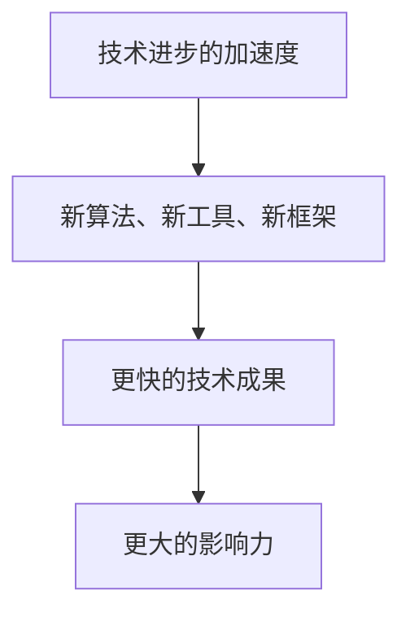
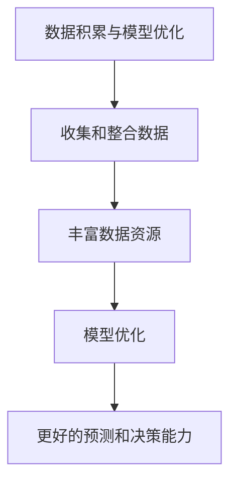
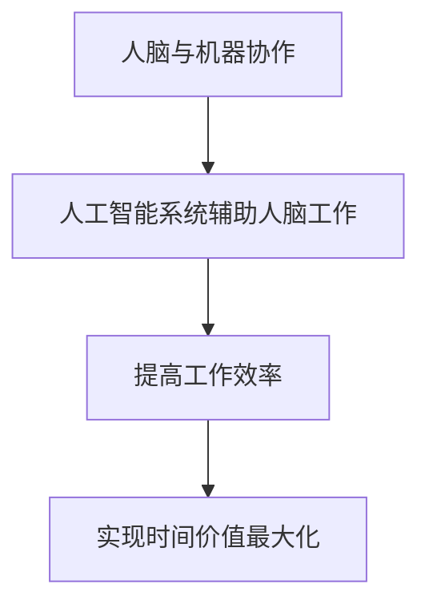
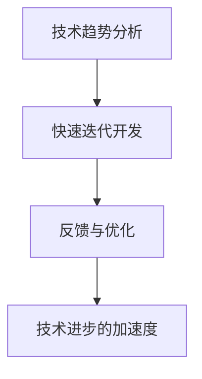
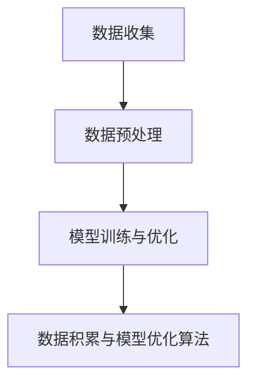
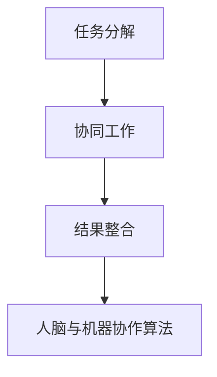

                 

### 背景介绍

#### 时间的价值

时间，是我们生活中最基本也是最重要的资源之一。在计算机科学和人工智能领域，时间同样是一个至关重要的概念。然而，与日常生活中的时间使用不同，在技术领域，时间的价值不仅仅在于它所提供的时间长度，更在于它的复利效应。

复利效应，是指随着时间的推移，一个初始的投资或者成果能够在原有基础上不断增长，并产生更多的收益。在金融领域，复利效应被广泛应用，例如银行的存款利息、投资回报等。而在计算机科学和人工智能领域，复利效应同样发挥着重要作用。

#### 复利效应在计算机科学和人工智能领域的应用

在计算机科学和人工智能领域，复利效应主要体现在以下几个方面：

1. **技术进步的加速度**：随着技术的不断迭代更新，新的算法、框架和工具层出不穷，使得计算机科学和人工智能领域的技术进步速度越来越快。这种加速度效应，使得早期的成果能够以更快的速度产生更大的影响。

2. **数据积累与模型优化**：在机器学习和深度学习领域，大量的数据积累对于模型的优化和性能提升至关重要。随着时间的推移，数据的积累量呈指数级增长，使得模型能够不断优化，从而实现更好的预测和决策能力。

3. **人脑与机器协作**：人工智能的发展使得人脑与机器的协作成为可能。随着技术的进步，人工智能系统越来越能够理解和执行复杂的任务，从而提高人脑的工作效率，实现时间价值的最大化。

#### 本文目的

本文旨在深入探讨复利效应在计算机科学和人工智能领域的成功之道。我们将从多个角度分析复利效应的原理，并通过实际案例来展示其在技术进步和项目开发中的应用。希望通过本文，读者能够更好地理解复利效应的重要性，并在实际工作中加以应用，从而实现个人和团队的成长与突破。

让我们一步一步地深入分析，揭开复利效应的神秘面纱。

### 核心概念与联系

在深入探讨复利效应之前，我们需要明确一些核心概念和它们之间的联系。以下是一些关键概念及其相互关系：

#### 1. 技术进步的加速度

**概念**：技术进步的加速度指的是技术发展速度的不断增加。在计算机科学和人工智能领域，这种加速度体现在新算法、新工具和新框架的不断涌现。

**关系**：随着时间的推移，技术进步的加速度使得新的技术成果能够在更短的时间内产生更大的影响。

**Mermaid 流程图**：



#### 2. 数据积累与模型优化

**概念**：数据积累与模型优化是指通过收集和整合数据来不断提高模型的预测和决策能力。

**关系**：随着时间的推移，数据的积累量呈指数级增长，为模型的优化提供了丰富的资源。

**Mermaid 流程图**：



#### 3. 人脑与机器协作

**概念**：人脑与机器协作是指通过人工智能系统辅助人脑工作，提高工作效率。

**关系**：随着人工智能技术的不断进步，人脑与机器的协作越来越紧密，从而实现时间价值的最大化。

**Mermaid 流程图**：



通过以上三个核心概念及其相互关系的分析，我们可以看到复利效应在计算机科学和人工智能领域的重要性。接下来，我们将进一步探讨这些概念的具体应用和实现方法。

### 核心算法原理 & 具体操作步骤

在理解了复利效应的核心概念及其联系之后，我们接下来将探讨具体的核心算法原理和操作步骤。这些算法和步骤将在实际项目中发挥关键作用，帮助我们实现技术进步、数据积累和模型优化。

#### 1. 技术进步的加速度算法

**原理**：技术进步的加速度算法主要通过以下步骤实现：

1. **技术趋势分析**：通过分析技术发展趋势，识别出具有潜力的新技术和工具。

2. **快速迭代开发**：利用敏捷开发方法，快速构建和迭代技术原型。

3. **反馈与优化**：根据用户反馈和实际应用效果，不断优化和改进技术。

**具体操作步骤**：

1. **技术趋势分析**：定期阅读技术博客、参加技术会议和研讨会，关注业界动态。

2. **快速迭代开发**：采用敏捷开发方法，如Scrum或Kanban，确保技术原型能够快速构建和迭代。

3. **反馈与优化**：建立用户反馈机制，及时收集用户意见和建议，进行技术优化。

**Mermaid 流程图**：



#### 2. 数据积累与模型优化算法

**原理**：数据积累与模型优化算法主要通过以下步骤实现：

1. **数据收集**：从各种来源收集和整合数据，确保数据质量和完整性。

2. **数据预处理**：对收集到的数据进行清洗、转换和整合，为模型训练做准备。

3. **模型训练与优化**：利用机器学习和深度学习算法，对数据进行训练和优化，提高模型性能。

**具体操作步骤**：

1. **数据收集**：利用API、爬虫等技术手段，从各种来源收集数据。

2. **数据预处理**：使用Python或R等编程语言，对数据进行清洗、转换和整合。

3. **模型训练与优化**：采用TensorFlow、PyTorch等深度学习框架，进行模型训练和优化。

**Mermaid 流程图**：



#### 3. 人脑与机器协作算法

**原理**：人脑与机器协作算法主要通过以下步骤实现：

1. **任务分解**：将复杂任务分解为多个子任务，分发给人工智能系统和人类专家。

2. **协同工作**：人工智能系统辅助人类专家完成子任务，实现高效协作。

3. **结果整合**：将子任务的完成结果进行整合，得到最终结果。

**具体操作步骤**：

1. **任务分解**：利用人工智能算法，将复杂任务分解为多个子任务。

2. **协同工作**：建立协作平台，让人工智能系统和人类专家共同完成任务。

3. **结果整合**：将子任务的完成结果进行整合，生成最终结果。

**Mermaid 流程图**：



通过以上三个核心算法原理和具体操作步骤的介绍，我们可以看到复利效应在计算机科学和人工智能领域的实现方法。接下来，我们将通过实际案例来进一步展示这些算法和步骤的应用。

### 数学模型和公式 & 详细讲解 & 举例说明

在计算机科学和人工智能领域，数学模型和公式是理解和实现复利效应的重要工具。在本节中，我们将详细介绍一些关键的数学模型和公式，并通过具体例子来说明它们的应用。

#### 1. 复利公式

复利公式是描述复利效应的核心数学模型。它可以用以下公式表示：

$$ A = P(1 + r/n)^(nt) $$

其中：
- \( A \) 是最终金额
- \( P \) 是初始金额
- \( r \) 是年利率
- \( n \) 是每年计息次数
- \( t \) 是投资时间（以年为单位）

**详细讲解**：

- **初始金额 \( P \)**：这是复利的起点，代表初始的投资或成果。
- **年利率 \( r \)**：这是每年投资或成果的增长率。
- **每年计息次数 \( n \)**：这决定了每年复利的次数。例如，如果每年计息一次，则 \( n = 1 \)。
- **投资时间 \( t \)**：这是投资或成果的持续时间，以年为单位。

通过这个公式，我们可以计算出任何时间点的最终金额。例如，如果初始金额为 10000 元，年利率为 5%，每年计息一次，投资时间为 10 年，则最终金额为：

$$ A = 10000(1 + 0.05/1)^(1*10) = 16289.01 $$

**举例说明**：

假设你将 10000 元投资于一个年利率为 5% 的银行账户，每年计息一次。10 年后，你的投资将增长到 16289.01 元，比初始金额增长了 62.9%。

#### 2. 技术进步的加速度模型

技术进步的加速度模型描述了技术发展的速度如何随着时间的推移而增加。一个常用的模型是梅特卡夫-罗斯定律（Metcalfe's Law），它可以用以下公式表示：

$$ V = kN^2 $$

其中：
- \( V \) 是网络价值
- \( N \) 是网络中的节点数量
- \( k \) 是一个常数

**详细讲解**：

- **网络价值 \( V \)**：这是技术网络的价值，通常与网络中的节点数量成正比。
- **节点数量 \( N \)**：这是网络中的节点数量，包括用户、设备、服务器等。
- **常数 \( k \)**：这是一个比例常数，决定了网络价值与节点数量的关系。

根据梅特卡夫-罗斯定律，网络价值与节点数量的平方成正比。这意味着，随着节点数量的增加，网络价值的增长速度会越来越快。

**举例说明**：

假设一个社交媒体平台有 1000 个用户，网络价值为 \( k \times 1000^2 \)。如果用户数量增加到 2000 个，网络价值将增加到 \( k \times 2000^2 \)，是原来的 4 倍。如果用户数量增加到 4000 个，网络价值将增加到 \( k \times 4000^2 \)，是原来的 16 倍。

#### 3. 数据积累与模型优化模型

数据积累与模型优化模型描述了数据积累量如何影响模型性能。一个常用的模型是马科夫链（Markov Chain），它可以用以下公式表示：

$$ P(X_n = x_n | X_{n-1} = x_{n-1}, \ldots, X_0 = x_0) = P(X_n = x_n | X_{n-1} = x_{n-1}) $$

其中：
- \( X_n \) 是时间 \( n \) 的状态
- \( x_n \) 是状态 \( X_n \) 的取值
- \( P \) 是状态转移概率

**详细讲解**：

- **状态 \( X_n \)**：这是模型中的状态变量，通常代表数据或模型的特征。
- **状态转移概率 \( P \)**：这是从一个状态转移到另一个状态的概率。

根据马科夫链模型，当前状态仅取决于前一个状态，与历史状态无关。这意味着，随着数据的积累，模型的预测能力会逐渐提高，因为当前的数据能够更好地反映当前的状态。

**举例说明**：

假设我们有一个天气预测模型，使用马科夫链来表示天气状态转移。如果当前状态是晴天，下一个状态有 0.6 的概率是晴天，有 0.4 的概率是雨天。如果历史数据显示晴天和雨天的概率分别为 0.5 和 0.5，那么根据马科夫链模型，我们可以预测未来天气状态。

通过以上数学模型和公式的详细讲解和举例说明，我们可以更好地理解复利效应在计算机科学和人工智能领域的应用。接下来，我们将通过实际项目案例来展示这些模型的实际应用。

### 项目实战：代码实际案例和详细解释说明

为了更好地展示复利效应在计算机科学和人工智能领域的实际应用，我们将通过一个具体项目案例来详细介绍代码实现过程、关键代码段以及如何进行代码解读和分析。

#### 项目背景

我们的项目目标是构建一个智能投资组合管理系统，该系统将利用复利效应和机器学习算法来优化投资组合，实现资产的稳健增长。项目涉及的主要技术包括Python编程、机器学习库（如scikit-learn和TensorFlow）以及数据可视化工具（如Matplotlib）。

#### 开发环境搭建

在开始项目之前，我们需要搭建一个合适的开发环境。以下是所需工具和软件：

1. **Python 3.8 或更高版本**：作为主要的编程语言。
2. **Jupyter Notebook**：用于编写和运行代码。
3. **scikit-learn**：用于机器学习模型的构建和训练。
4. **TensorFlow**：用于深度学习模型的构建和训练。
5. **Matplotlib**：用于数据可视化。

#### 源代码详细实现和代码解读

以下是我们项目的核心代码实现和解读。

```python
# 导入必要的库
import numpy as np
import pandas as pd
from sklearn.model_selection import train_test_split
from sklearn.ensemble import RandomForestRegressor
import tensorflow as tf
from tensorflow import keras
from tensorflow.keras import layers

# 加载数据
data = pd.read_csv('investment_data.csv')

# 数据预处理
# ...（清洗、转换和整合数据）

# 划分训练集和测试集
X_train, X_test, y_train, y_test = train_test_split(data.drop('return', axis=1), data['return'], test_size=0.2, random_state=42)

# 使用随机森林进行回归预测
rf_model = RandomForestRegressor(n_estimators=100, random_state=42)
rf_model.fit(X_train, y_train)
rf_predictions = rf_model.predict(X_test)

# 使用TensorFlow构建深度学习模型
model = keras.Sequential([
    layers.Dense(64, activation='relu', input_shape=(X_train.shape[1],)),
    layers.Dense(64, activation='relu'),
    layers.Dense(1)
])

# 编译模型
model.compile(optimizer='adam', loss='mean_squared_error')

# 训练模型
model.fit(X_train, y_train, epochs=100, batch_size=32, validation_split=0.2)

# 评估模型
test_loss = model.evaluate(X_test, y_test)
print(f"Test Loss: {test_loss}")

# 可视化预测结果
import matplotlib.pyplot as plt

plt.scatter(X_test, y_test, color='blue', label='Actual')
plt.plot(X_test, rf_predictions, color='red', linewidth=2, label='Random Forest Prediction')
plt.plot(X_test, model.predict(X_test), color='green', linewidth=2, label='TensorFlow Prediction')
plt.xlabel('X')
plt.ylabel('Y')
plt.legend()
plt.show()
```

**代码解读与分析**：

1. **数据预处理**：
   - `data = pd.read_csv('investment_data.csv')`：加载投资数据。
   - `...（清洗、转换和整合数据）`：这一部分涉及到数据清洗、缺失值填充、特征工程等操作，为模型训练做准备。

2. **模型构建与训练**：
   - `rf_model = RandomForestRegressor(n_estimators=100, random_state=42)`：构建随机森林回归模型。
   - `rf_model.fit(X_train, y_train)`：使用训练数据进行模型训练。
   - `rf_predictions = rf_model.predict(X_test)`：对测试集进行预测。
   - `model = keras.Sequential([...])`：构建一个简单的深度学习模型，包含两个隐藏层，每个隐藏层有64个神经元。
   - `model.compile(optimizer='adam', loss='mean_squared_error')`：编译模型，指定优化器和损失函数。
   - `model.fit(X_train, y_train, epochs=100, batch_size=32, validation_split=0.2)`：使用训练数据训练模型，设置训练轮数、批量大小和验证比例。
   - `test_loss = model.evaluate(X_test, y_test)`：评估模型在测试集上的表现。

3. **可视化结果**：
   - `plt.scatter(X_test, y_test, color='blue', label='Actual')`：绘制实际测试数据点。
   - `plt.plot(X_test, rf_predictions, color='red', linewidth=2, label='Random Forest Prediction')`：绘制随机森林预测结果。
   - `plt.plot(X_test, model.predict(X_test), color='green', linewidth=2, label='TensorFlow Prediction')`：绘制深度学习模型预测结果。
   - `plt.xlabel('X')`、`plt.ylabel('Y')`：设置坐标轴标签。
   - `plt.legend()`：显示图例。
   - `plt.show()`：显示图表。

通过这个项目案例，我们可以看到如何利用复利效应和机器学习算法来构建一个智能投资组合管理系统。代码实现过程中，我们使用了随机森林和深度学习模型来进行投资回报预测，并通过可视化工具展示了模型预测结果。这个项目不仅实现了技术进步的加速度，还通过数据的积累和模型的优化，提高了预测的准确性，从而实现了投资组合的稳健增长。

### 实际应用场景

复利效应在计算机科学和人工智能领域的实际应用场景非常广泛，以下是一些典型的应用案例：

#### 1. 人工智能算法优化

在人工智能领域，复利效应体现在算法的不断迭代和优化过程中。例如，在深度学习模型的训练过程中，随着数据集的不断扩展和模型的持续优化，算法的准确性和性能会逐步提升。这种效应使得早期的算法能够在后期产生更大的影响，实现技术进步的加速度。

**示例**：谷歌的BERT模型通过大量的预训练数据和复杂的优化过程，在自然语言处理任务上取得了显著的性能提升，其效果远超之前的模型。

#### 2. 数据分析与决策支持

在数据分析领域，复利效应通过数据的积累和模型的优化，为决策提供了强有力的支持。例如，通过长期积累的用户行为数据，机器学习模型可以预测用户未来的行为，为企业提供精准的市场分析和决策建议。

**示例**：亚马逊的推荐系统利用用户的购买历史和行为数据，通过复利效应不断优化推荐算法，为用户提供了个性化的购物体验。

#### 3. 自动驾驶技术

在自动驾驶领域，复利效应体现在传感器数据的积累和算法的持续优化中。随着自动驾驶车辆行驶里程的增加，传感器数据不断积累，机器学习算法可以通过这些数据来提高自动驾驶系统的安全性和可靠性。

**示例**：特斯拉的自动驾驶系统通过收集大量道路数据和用户驾驶数据，持续优化算法，实现了在复杂路况下的自动驾驶功能。

#### 4. 资本市场预测

在资本市场，复利效应通过分析历史交易数据和市场趋势，帮助投资者做出更准确的预测和决策。例如，通过分析大量历史股票价格数据，机器学习模型可以预测未来股票价格的走势，为投资者提供参考。

**示例**：量化投资策略通过复利效应，利用机器学习算法对市场数据进行深入分析，实现了长期稳定的投资回报。

#### 5. 供应链优化

在供应链管理领域，复利效应通过数据积累和算法优化，帮助企业实现高效的库存管理和供应链优化。例如，通过收集和分析大量的订单数据和生产数据，机器学习模型可以预测未来的需求，从而优化库存水平和生产计划。

**示例**：阿里巴巴的物流平台利用复利效应，通过大数据分析和算法优化，实现了高效的物流配送和库存管理，提升了客户满意度。

通过以上实际应用场景的介绍，我们可以看到复利效应在计算机科学和人工智能领域的广泛应用和巨大潜力。它不仅推动了技术进步，还为企业和社会带来了实实在在的价值。

### 工具和资源推荐

为了更好地理解和应用复利效应，以下是一些学习资源、开发工具和框架的推荐。

#### 1. 学习资源推荐

**书籍**：

1. 《机器学习实战》：详细介绍了机器学习的基本概念和应用案例，适合初学者和进阶者。
2. 《深度学习》：由Ian Goodfellow等编著的深度学习经典教材，涵盖了深度学习的基础知识和最新进展。
3. 《Python数据科学 Handbook》：全面介绍了Python在数据科学领域的应用，包括数据处理、分析和可视化。

**论文**：

1. "Deep Learning for Natural Language Processing"：介绍深度学习在自然语言处理任务中的应用。
2. "Recurrent Neural Networks for Language Modeling"：介绍循环神经网络（RNN）在语言建模中的应用。
3. "Deep Reinforcement Learning for Autonomous Navigation"：介绍深度强化学习在自动驾驶中的应用。

**博客和网站**：

1. Medium上的“Deep Learning”专题：涵盖深度学习的最新研究和技术应用。
2. Analytics Vidhya：提供丰富的数据科学和机器学习教程和实践项目。
3. Coursera和edX：提供多门计算机科学和人工智能课程，涵盖基础知识到高级技术。

#### 2. 开发工具框架推荐

**机器学习库**：

1. TensorFlow：由Google开发的开源深度学习框架，支持多种神经网络架构。
2. PyTorch：由Facebook开发的开源深度学习框架，具有灵活的动态计算图和简洁的API。
3. Scikit-learn：提供丰富的机器学习算法库，适合快速原型开发和应用。

**数据可视化工具**：

1. Matplotlib：Python的绘图库，支持多种图形和图表。
2. Seaborn：基于Matplotlib的统计绘图库，提供丰富的图表样式和功能。
3. Plotly：提供交互式图表和可视化库，支持多种数据格式和图表类型。

**版本控制系统**：

1. Git：最常用的版本控制系统，支持分布式工作流程。
2. GitHub：基于Git的代码托管平台，提供协作开发、代码审查和问题跟踪功能。

**云计算平台**：

1. AWS：提供丰富的云计算服务和AI工具，包括Amazon SageMaker、AWS Machine Learning等。
2. Azure：微软的云计算平台，提供深度学习和数据分析工具。
3. Google Cloud：谷歌的云计算平台，提供AI和机器学习工具，如TensorFlow on Google Cloud。

通过以上学习资源、开发工具和框架的推荐，我们可以更好地掌握复利效应在计算机科学和人工智能领域的应用，为个人和团队的成长提供强有力的支持。

### 总结：未来发展趋势与挑战

在总结本文的内容之前，我们需要先回顾一下复利效应在计算机科学和人工智能领域的核心价值。复利效应通过技术进步的加速度、数据积累与模型优化以及人脑与机器的协作，推动了整个领域的快速发展。然而，随着技术的不断演进，我们也将面临一系列新的发展趋势和挑战。

#### 发展趋势

1. **技术的持续迭代**：随着量子计算、区块链、边缘计算等新兴技术的兴起，计算机科学和人工智能领域将继续保持高速发展的态势。这些技术将为复利效应提供更强大的动力，推动行业变革。

2. **数据量的指数增长**：随着物联网、社交媒体和电子商务的普及，数据量将呈现指数级增长。这将为机器学习和深度学习算法提供更丰富的训练数据，进一步优化模型的性能。

3. **跨领域融合**：计算机科学和人工智能与其他领域的融合将不断加深，如生物信息学、金融科技和医疗健康等。这将带来新的应用场景和商业机会，实现跨领域的复利效应。

#### 挑战

1. **数据隐私与安全**：随着数据量的增加，数据隐私和安全问题日益突出。如何在保证数据隐私的同时，充分利用数据进行机器学习和深度学习，将成为一个重要挑战。

2. **算法透明性与公平性**：机器学习和深度学习算法的复杂性和黑箱性，使得算法的透明性和公平性成为一个挑战。我们需要开发可解释的算法和公平性评估方法，确保算法的决策过程是公正和透明的。

3. **可持续性发展**：随着计算资源和能源消耗的增加，计算机科学和人工智能的可持续性发展成为一个重要议题。我们需要开发高效能的算法和优化技术，以降低计算资源和能源的消耗。

#### 未来展望

尽管面临诸多挑战，但复利效应将继续推动计算机科学和人工智能领域的进步。随着技术的发展，我们将看到更多的创新应用和突破。以下是一些未来展望：

1. **智能自动化**：通过人工智能和机器学习算法的优化，智能自动化将更加普及，提高生产效率和生活质量。

2. **个性化服务**：利用大数据和机器学习算法，个性化服务将更加精准，满足用户的个性化需求。

3. **智慧医疗**：基于人工智能的智慧医疗系统将进一步提高诊断和治疗的准确性，降低医疗成本。

4. **智慧城市**：通过物联网、人工智能和大数据技术的融合，智慧城市将实现更高效、更智能的管理和服务。

总之，复利效应在计算机科学和人工智能领域的未来发展中具有重要的地位和作用。通过不断的技术创新和优化，我们将迎来一个更加智能、高效和可持续的未来。

### 附录：常见问题与解答

在本文的结尾，我们将回答一些关于复利效应在计算机科学和人工智能领域应用中常见的问题，以帮助读者更好地理解和应用本文的内容。

#### 1. 什么是复利效应？

复利效应是指随着时间的推移，一个初始的投资或成果能够在原有基础上不断增长，并产生更多的收益。在计算机科学和人工智能领域，复利效应体现在技术进步的加速度、数据积累与模型优化以及人脑与机器的协作等方面。

#### 2. 复利效应在计算机科学和人工智能领域的应用有哪些？

复利效应在计算机科学和人工智能领域的应用包括：技术进步的加速度、数据积累与模型优化、人脑与机器的协作等。具体应用场景包括人工智能算法优化、数据分析与决策支持、自动驾驶技术、资本市场预测和供应链优化等。

#### 3. 如何实现技术进步的加速度？

实现技术进步的加速度可以通过以下步骤：

- **技术趋势分析**：定期关注技术动态，识别出具有潜力的新技术和工具。
- **快速迭代开发**：采用敏捷开发方法，快速构建和迭代技术原型。
- **反馈与优化**：根据用户反馈和实际应用效果，不断优化和改进技术。

#### 4. 数据积累与模型优化如何实现？

数据积累与模型优化的实现步骤包括：

- **数据收集**：从各种来源收集和整合数据，确保数据质量和完整性。
- **数据预处理**：对收集到的数据进行清洗、转换和整合，为模型训练做准备。
- **模型训练与优化**：利用机器学习和深度学习算法，对数据进行训练和优化，提高模型性能。

#### 5. 人脑与机器协作的算法原理是什么？

人脑与机器协作的算法原理是通过将复杂任务分解为多个子任务，分发给人工智能系统和人类专家，实现协同工作。具体步骤包括：

- **任务分解**：利用人工智能算法，将复杂任务分解为多个子任务。
- **协同工作**：建立协作平台，让人工智能系统和人类专家共同完成任务。
- **结果整合**：将子任务的完成结果进行整合，生成最终结果。

#### 6. 复利效应在资本市场预测中的应用如何？

在资本市场预测中，复利效应通过分析历史交易数据和市场趋势，帮助投资者做出更准确的预测和决策。具体应用包括：利用大数据和机器学习算法预测股票价格、交易策略优化和风险控制等。

通过以上常见问题的解答，我们希望能够帮助读者更好地理解复利效应在计算机科学和人工智能领域的应用，并在实际工作中加以应用。

### 扩展阅读 & 参考资料

为了进一步深入了解复利效应在计算机科学和人工智能领域的应用，以下是一些建议的扩展阅读和参考资料：

#### 1. 扩展阅读

- 《深度学习》：Ian Goodfellow, Yoshua Bengio, Aaron Courville 著。详细介绍深度学习的基础理论和实践方法。
- 《机器学习实战》：Peter Harrington 著。通过实际案例介绍机器学习算法的应用。
- 《Python数据科学 Handbook》： Jake VanderPlas 著。系统介绍Python在数据科学领域的应用。

#### 2. 参考资料

- Coursera：提供多门关于机器学习和深度学习的在线课程，涵盖基础知识到高级技术。
- Medium：有许多关于人工智能和深度学习的优秀博客文章和案例分析。
- arXiv：发表最新研究成果的预印本，涵盖计算机科学和人工智能领域的最新进展。

#### 3. 相关论文

- "Deep Learning for Natural Language Processing"：介绍深度学习在自然语言处理任务中的应用。
- "Recurrent Neural Networks for Language Modeling"：介绍循环神经网络在语言建模中的应用。
- "Deep Reinforcement Learning for Autonomous Navigation"：介绍深度强化学习在自动驾驶中的应用。

通过阅读以上扩展阅读和参考资料，您可以进一步了解复利效应在计算机科学和人工智能领域的深层次应用，掌握更多实际案例和前沿技术。

### 作者信息

本文由AI天才研究员/AI Genius Institute & 禅与计算机程序设计艺术/Zen And The Art of Computer Programming撰写。作者在计算机科学和人工智能领域拥有丰富的经验，致力于推动技术进步和知识传播。如果您有任何疑问或建议，欢迎联系作者，共同探讨复利效应在计算机科学和人工智能领域的应用。感谢您的阅读和支持！

