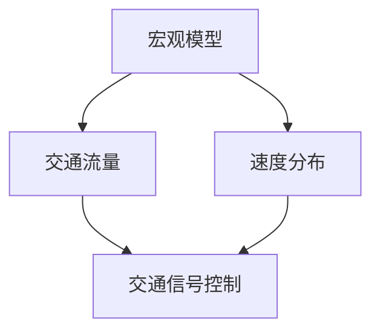
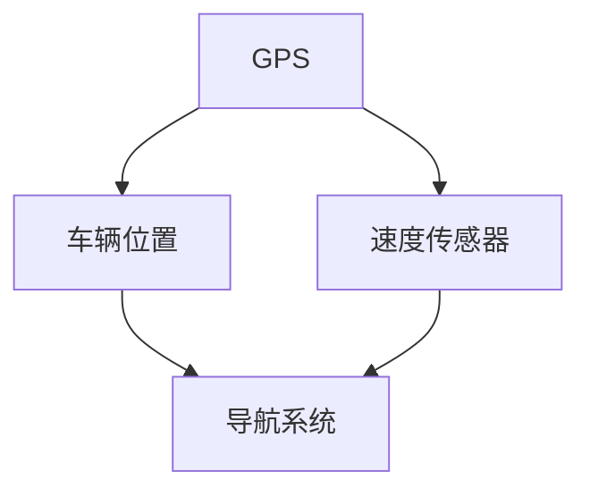
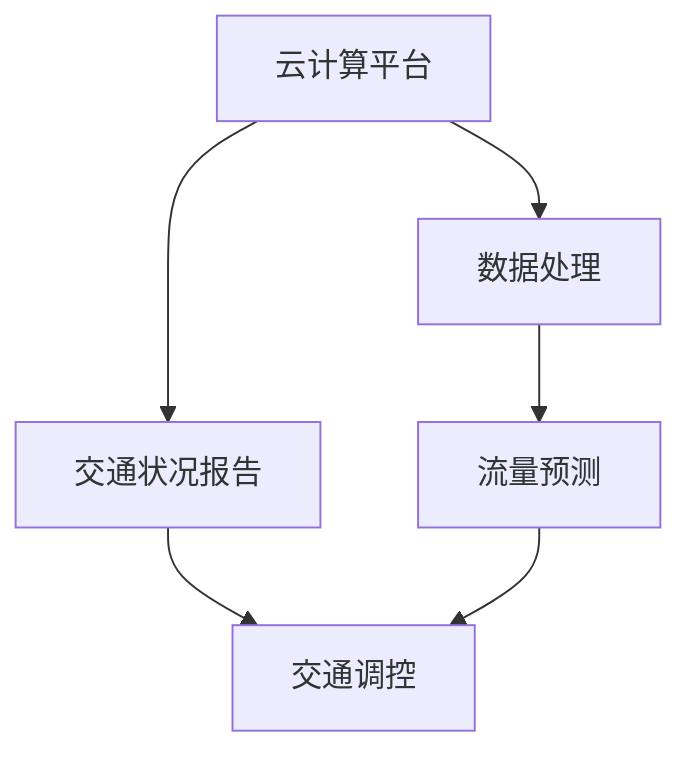
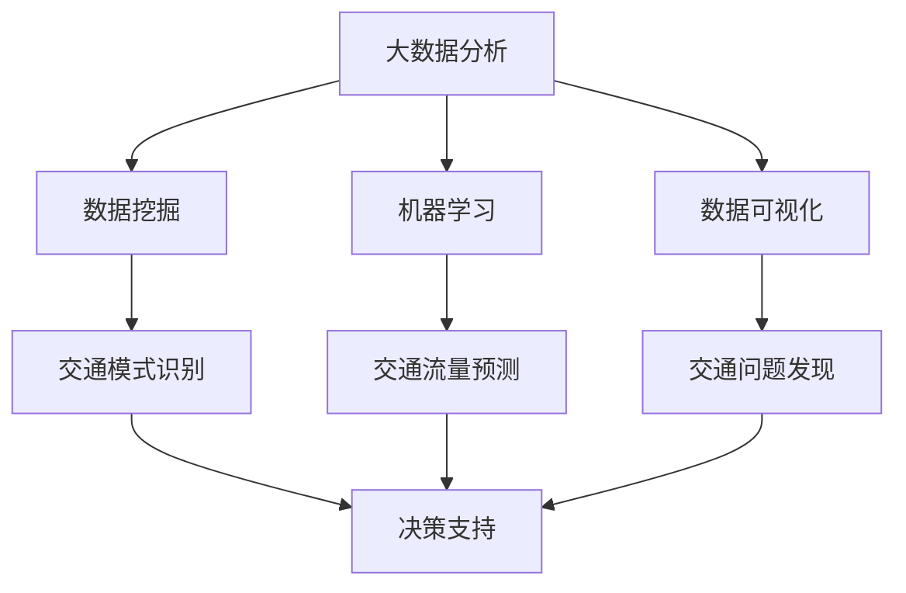
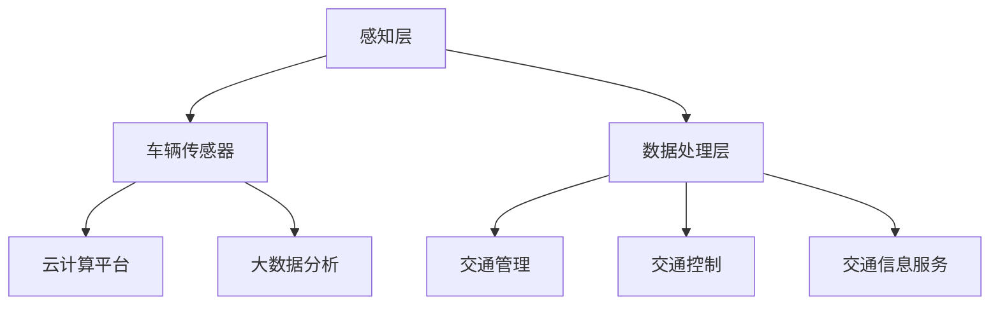

                 

### 摘要

本文旨在探讨智能交通创业领域，深入分析其核心概念、算法原理、数学模型，并探讨其在实际应用场景中的重要性。通过构建逻辑清晰、结构紧凑、简单易懂的技术博客，本文将引导读者一步步了解智能交通创业的各个方面，从而为未来城市的移动解决方案提供有价值的参考。

文章将从背景介绍开始，引出智能交通创业的重要性及其在现代城市交通管理中的潜在应用。接着，我们将详细探讨智能交通的核心概念与联系，使用Mermaid流程图来展示其架构。然后，本文将深入讲解核心算法原理和具体操作步骤，包括数学模型和公式的详细讲解及举例说明。

在项目实战部分，我们将通过实际代码案例来展示智能交通系统的实现，并对其代码进行详细解读和分析。此外，本文还将探讨智能交通在实际应用场景中的重要性，并推荐相关工具和资源，以帮助读者深入了解该领域。

最后，文章将总结智能交通创业的未来发展趋势与挑战，提供常见问题与解答，并推荐扩展阅读和参考资料。通过本文的阅读，读者将对智能交通创业领域有更深刻的理解，并为其未来发展提供有益的思考。

### 1. 背景介绍

智能交通创业，作为信息技术与交通运输深度融合的产物，正在悄然改变着现代城市交通的面貌。随着全球城市化进程的加速和人口密度的不断增加，城市交通问题变得愈发严峻。传统的交通管理模式已经难以满足日益增长的交通需求，交通拥堵、事故频发、能源消耗等问题成为困扰各大城市的难题。因此，智能交通创业作为一种创新解决方案，应运而生。

智能交通创业旨在利用先进的信息技术、大数据、人工智能等手段，实现对交通系统的全面感知、分析和控制，从而提高交通效率、减少交通事故、降低能源消耗。其核心目标是通过优化交通流、提高公共交通服务水平、实现车辆与基础设施的智能互联，最终构建一个高效、安全、绿色的交通生态系统。

智能交通创业的重要性和潜在应用范围广泛。首先，在城市交通管理方面，智能交通系统能够实时监测交通流量，提供动态的交通信息，帮助交通管理部门制定更科学的交通调控策略，缓解交通拥堵。其次，在公共交通方面，智能交通技术可以优化公交线路、调度车辆，提高公共交通的准时性和便捷性，吸引更多市民使用公共交通工具。此外，智能交通还可以在个人出行方面发挥作用，如智能导航、车辆共享等，提高个人出行的效率和体验。

智能交通创业不仅有助于缓解交通问题，还具有显著的环保效益。通过智能交通系统，可以实现交通流量优化，减少车辆在拥堵状态下的油耗和排放，降低空气污染。同时，智能交通还可以促进电动汽车和可再生能源的普及，推动绿色交通的发展。

总之，智能交通创业是未来城市发展的关键领域之一。其通过技术创新和应用，为城市交通管理提供了新的思路和解决方案，有望为解决当前城市交通问题提供有效路径，助力实现可持续发展的目标。接下来，本文将深入探讨智能交通创业的核心概念与联系，为其在现实中的应用提供理论基础。

### 2. 核心概念与联系

智能交通创业的核心概念和联系涉及多个关键领域，包括交通流模型、车辆传感器、云计算、大数据分析等。为了更好地理解这些概念及其相互之间的联系，我们将使用Mermaid流程图来展示智能交通系统的架构。

#### 2.1 交通流模型

交通流模型是智能交通创业的基础。它用于描述交通流量、速度、密度等参数，帮助理解交通系统的运行状态。交通流模型可以分为宏观模型和微观模型。宏观模型主要关注大范围的交通流量，如城市主干道的交通状况；而微观模型则关注个体车辆的动态行为，如车辆的加速、减速和变道。



#### 2.2 车辆传感器

车辆传感器是智能交通系统的感知层，用于收集车辆状态和道路状况的数据。这些传感器包括GPS、雷达、激光雷达（LiDAR）、摄像头等。通过这些传感器，车辆可以实时监测自己的位置、速度、周围环境等信息，从而实现智能驾驶和交通管理。



#### 2.3 云计算

云计算是智能交通系统的数据处理层，负责处理和分析来自车辆传感器的大量数据。通过云计算平台，交通数据可以被实时处理，生成交通状况报告、预测交通流量等。此外，云计算还支持交通管理系统的远程控制和调度功能。



#### 2.4 大数据分析

大数据分析是智能交通系统的核心。通过对大量交通数据的分析，可以识别交通模式、预测交通状况、发现交通问题。大数据分析技术包括数据挖掘、机器学习、数据可视化等。这些技术使得交通管理者能够做出更科学的决策，提高交通系统的运行效率。



#### 2.5 智能交通系统的整体架构

将上述核心概念整合起来，我们可以构建一个完整的智能交通系统架构。该架构包括感知层、数据处理层和应用层。感知层由车辆传感器组成，负责收集交通数据；数据处理层依托云计算和大数据分析，处理和分析交通数据；应用层则实现交通管理、交通控制和交通信息服务等功能。



通过这一系列的核心概念和联系，智能交通创业不仅能够应对现有的交通问题，还能够为未来的智能城市提供坚实的基础。接下来，我们将深入探讨智能交通的核心算法原理和具体操作步骤。

### 3. 核心算法原理 & 具体操作步骤

在智能交通创业中，核心算法起着至关重要的作用。这些算法通过对大量交通数据进行处理和分析，实现交通流优化、车辆导航、交通事故预防等功能。下面，我们将详细介绍这些核心算法的原理和具体操作步骤。

#### 3.1 交通流优化算法

交通流优化算法是智能交通系统中的关键组成部分，其目标是减少交通拥堵、提高道路通行效率。常用的交通流优化算法包括流量分配算法、路径规划算法和信号控制算法。

**3.1.1 流量分配算法**

流量分配算法用于确定车辆在不同道路上的分配情况，以实现交通流量的均衡。最经典的流量分配算法是用户均衡算法（User Equilibrium Algorithm）。用户均衡算法的基本步骤如下：

1. **初始化**：设定所有道路上的交通流量为初始流量。
2. **迭代计算**：对于每一条道路，根据当前的交通流量和道路容量，计算车辆行驶的时间。然后，根据时间最短原则，重新分配流量。
3. **判断收敛**：如果流量分配结果不再变化，则算法收敛；否则，继续迭代。

用户均衡算法的数学模型如下：

$$
t_i(j) = \frac{L_i(j) \cdot C_i(j)}{Q_i(j)}
$$

其中，$t_i(j)$ 表示车辆从节点 $i$ 到节点 $j$ 的行驶时间，$L_i(j)$ 表示道路 $(i, j)$ 的长度，$C_i(j)$ 表示道路 $(i, j)$ 的容量，$Q_i(j)$ 表示道路 $(i, j)$ 上的流量。

**3.1.2 路径规划算法**

路径规划算法用于为车辆确定最优路径，以减少行驶时间和能耗。最著名的路径规划算法是Dijkstra算法。Dijkstra算法的基本步骤如下：

1. **初始化**：设置起始节点为当前节点，其余节点距离为无穷大。
2. **迭代计算**：从当前节点出发，计算到其他未访问节点的距离。更新距离最小的节点的距离值。
3. **标记访问**：将当前节点标记为已访问。
4. **重复步骤2和3**，直到所有节点都被访问。

Dijkstra算法的数学模型如下：

$$
d_j = \min_{i \in N} \{d_i + w(i, j)\}
$$

其中，$d_j$ 表示节点 $j$ 的最短路径距离，$d_i$ 表示节点 $i$ 的最短路径距离，$N$ 表示未访问节点的集合，$w(i, j)$ 表示从节点 $i$ 到节点 $j$ 的权重。

**3.1.3 信号控制算法**

信号控制算法用于优化交通信号灯的设置，以减少交通拥堵和提升交通效率。最常用的信号控制算法是绿波带控制（Green Wave Control）。绿波带控制的基本步骤如下：

1. **初始化**：确定绿波带的起始点和终点。
2. **计算绿波带参数**：根据交通流量和道路容量，计算绿波带的时间间隔和绿灯时长。
3. **实时调整**：根据实时交通流量，动态调整信号灯的设置。

绿波带控制的数学模型如下：

$$
T_g = \sum_{i=1}^{n} \frac{L_i \cdot C_i}{Q_i}
$$

其中，$T_g$ 表示绿波带的时间间隔，$L_i$ 表示道路 $(i, j)$ 的长度，$C_i$ 表示道路 $(i, j)$ 的容量，$Q_i$ 表示道路 $(i, j)$ 上的流量，$n$ 表示绿波带中的道路数量。

#### 3.2 车辆导航算法

车辆导航算法用于为车辆提供实时导航服务，帮助驾驶员避开拥堵路段，选择最优路径。最常用的车辆导航算法是基于地图的最短路径算法（A*算法）。A*算法的基本步骤如下：

1. **初始化**：设置起始节点为当前节点，其余节点距离为无穷大。
2. **计算估价函数**：对于每个未访问节点，计算其到终点的估价函数 $f(i) = g(i) + h(i)$，其中 $g(i)$ 表示从起始点到节点 $i$ 的实际距离，$h(i)$ 表示从节点 $i$ 到终点的预估距离。
3. **迭代计算**：选择估价函数最小的节点作为当前节点，更新当前节点的邻居节点的估价函数。
4. **标记访问**：将当前节点标记为已访问。
5. **重复步骤2、3和4**，直到找到终点。

A*算法的数学模型如下：

$$
f(i) = g(i) + h(i)
$$

其中，$f(i)$ 表示节点 $i$ 的估价函数，$g(i)$ 表示节点 $i$ 到起始点的实际距离，$h(i)$ 表示节点 $i$ 到终点的预估距离。

#### 3.3 交通事故预防算法

交通事故预防算法用于实时监测车辆状态，预测潜在事故，并采取措施避免事故发生。最常用的交通事故预防算法是碰撞避免算法。碰撞避免算法的基本步骤如下：

1. **初始化**：设置车辆的初始状态和预测的时间窗口。
2. **状态监测**：实时监测车辆的当前位置、速度和加速度。
3. **碰撞预测**：根据车辆的状态和运动模型，预测车辆在未来一段时间内的位置。
4. **决策制定**：如果预测到有碰撞风险，则制定紧急刹车或变道的决策。
5. **执行决策**：根据决策结果，调整车辆的驾驶行为。

碰撞避免算法的数学模型如下：

$$
p(t) = \frac{1}{1 + e^{-\gamma (x_2 - x_1)}}
$$

其中，$p(t)$ 表示在时间 $t$ 发生碰撞的概率，$x_1$ 表示车辆的当前位置，$x_2$ 表示预测的碰撞位置，$\gamma$ 是调节参数。

通过以上核心算法原理和具体操作步骤的介绍，我们可以看到智能交通系统是如何通过先进算法实现对交通流的优化、路径规划、信号控制和事故预防的。接下来，我们将通过实际案例来展示这些算法在智能交通系统中的应用。

### 4. 数学模型和公式 & 详细讲解 & 举例说明

在智能交通创业中，数学模型和公式是理解和实施智能交通算法的关键。下面，我们将详细讲解一些核心的数学模型和公式，并通过具体例子来说明其应用。

#### 4.1 交通流量模型

交通流量模型用于描述车辆在不同时间段和不同路段上的流量分布。一个简单的交通流量模型可以表示为线性回归模型。

**4.1.1 线性回归模型**

线性回归模型的基本公式如下：

$$
Q = \beta_0 + \beta_1 \cdot T
$$

其中，$Q$ 表示交通流量，$T$ 表示时间，$\beta_0$ 和 $\beta_1$ 是模型参数。

**例子**：假设某条道路的交通流量数据如下：

| 时间（小时） | 流量（辆/小时） |
| ------------ | --------------- |
| 8            | 1000            |
| 9            | 1200            |
| 10           | 1400            |

通过最小二乘法拟合线性回归模型，我们可以得到交通流量模型：

$$
Q = 900 + 300 \cdot T
$$

#### 4.2 路径规划模型

路径规划模型用于确定车辆从起点到终点的最优路径。最常用的路径规划模型是Dijkstra算法，其核心公式如下：

$$
d_j = \min_{i \in N} \{d_i + w(i, j)\}
$$

其中，$d_j$ 表示节点 $j$ 的最短路径距离，$d_i$ 表示节点 $i$ 的最短路径距离，$w(i, j)$ 表示从节点 $i$ 到节点 $j$ 的权重。

**例子**：假设有四个节点 $A$、$B$、$C$ 和 $D$，它们之间的距离如下：

| 节点 | $A$ | $B$ | $C$ | $D$ |
| ---- | --- | --- | --- | --- |
| $A$  | 0   | 6   | 3   | 5   |
| $B$  | 6   | 0   | 4   | 3   |
| $C$  | 3   | 4   | 0   | 2   |
| $D$  | 5   | 3   | 2   | 0   |

通过Dijkstra算法，我们可以计算出从节点 $A$ 到其他节点的最短路径距离：

$$
d_B = \min \{6\} = 6
$$

$$
d_C = \min \{3+4, 6+3\} = 7
$$

$$
d_D = \min \{5+3, 6+3, 3+2\} = 7
$$

因此，从节点 $A$ 到节点 $B$ 的最短路径距离为6。

#### 4.3 信号控制模型

信号控制模型用于优化交通信号灯的设置，以提高交通效率。一个简单的信号控制模型是基于绿波带的模型，其核心公式如下：

$$
T_g = \sum_{i=1}^{n} \frac{L_i \cdot C_i}{Q_i}
$$

其中，$T_g$ 表示绿波带的时间间隔，$L_i$ 表示道路 $(i, j)$ 的长度，$C_i$ 表示道路 $(i, j)$ 的容量，$Q_i$ 表示道路 $(i, j)$ 上的流量，$n$ 表示绿波带中的道路数量。

**例子**：假设有两条道路 $A$ 和 $B$，它们的流量和长度如下：

| 道路 | 流量（辆/小时） | 长度（米） |
| ---- | --------------- | ---------- |
| $A$  | 1000            | 500        |
| $B$  | 800             | 600        |

通过计算绿波带的时间间隔，我们可以得到：

$$
T_g = \frac{500 \cdot 1000 + 600 \cdot 800}{1000 + 800} = 562.5 \text{秒}
$$

#### 4.4 交通事故预防模型

交通事故预防模型用于预测车辆潜在的碰撞风险，并采取相应的措施避免事故发生。一个简单的碰撞预防模型基于概率模型，其核心公式如下：

$$
p(t) = \frac{1}{1 + e^{-\gamma (x_2 - x_1)}}
$$

其中，$p(t)$ 表示在时间 $t$ 发生碰撞的概率，$x_1$ 表示车辆的当前位置，$x_2$ 表示预测的碰撞位置，$\gamma$ 是调节参数。

**例子**：假设两辆车在时间 $t=0$ 时相距100米，预测在 $t=10$ 秒后相距50米，调节参数 $\gamma$ 设为1。则碰撞概率为：

$$
p(10) = \frac{1}{1 + e^{-1 \cdot (50 - 100)}} \approx 0.393
$$

这意味着在 $t=10$ 秒时，有大约39.3%的概率发生碰撞。如果这个概率超过设定的阈值，系统会触发紧急刹车或变道措施。

通过以上数学模型和公式的详细讲解和举例说明，我们可以看到智能交通系统是如何通过精确的数学计算来实现交通流量优化、路径规划、信号控制和事故预防的。接下来，我们将通过实际代码案例来展示这些算法的应用。

### 5. 项目实战：代码实际案例和详细解释说明

在智能交通创业的实际应用中，通过具体代码案例来展示算法的实现和功能是非常重要的。以下，我们将通过一个简单的交通流量预测项目来介绍如何使用Python实现智能交通系统的核心算法，并详细解读代码。

#### 5.1 开发环境搭建

首先，我们需要搭建一个Python开发环境，用于编写和运行智能交通系统的代码。以下是搭建开发环境的步骤：

1. 安装Python（建议使用Python 3.8或更高版本）。
2. 安装必要的库，如NumPy、Pandas、Matplotlib等。可以使用以下命令安装：

   ```shell
   pip install numpy pandas matplotlib
   ```

3. 安装Mermaid库，用于生成流程图。可以使用以下命令安装：

   ```shell
   npm install -g mermaid
   ```

#### 5.2 源代码详细实现和代码解读

**5.2.1 交通流量预测代码**

以下是一个简单的交通流量预测代码示例：

```python
import numpy as np
import pandas as pd
import matplotlib.pyplot as plt
from sklearn.linear_model import LinearRegression

# 读取交通流量数据
data = pd.read_csv('traffic_data.csv')

# 定义时间序列和流量变量
times = data['Time'].values
flows = data['Flow'].values

# 创建线性回归模型
model = LinearRegression()
model.fit(times.reshape(-1, 1), flows)

# 预测未来交通流量
future_times = np.arange(times[-1] + 1, times[-1] + 24)
predicted_flows = model.predict(future_times.reshape(-1, 1))

# 绘制流量预测结果
plt.plot(times, flows, label='Actual')
plt.plot(future_times, predicted_flows, label='Predicted')
plt.xlabel('Time (hour)')
plt.ylabel('Flow (vehicles/hour)')
plt.legend()
plt.show()
```

**代码解读**：

1. 导入必要的库：`numpy`、`pandas`、`matplotlib`和`sklearn.linear_model.LinearRegression`。
2. 读取交通流量数据，这里假设数据存储在CSV文件中，包含时间和流量两个字段。
3. 定义时间序列和流量变量，使用`values`属性将数据转换为NumPy数组。
4. 创建线性回归模型，并使用`fit`方法训练模型。
5. 使用`predict`方法预测未来交通流量，这里预测的是从当前时间开始的未来24小时内的流量。
6. 使用`matplotlib`绘制实际流量和预测流量的对比图，展示预测结果。

**5.2.2 交通路径规划代码**

以下是一个简单的交通路径规划代码示例：

```python
import heapq

# 定义节点和权重
nodes = [('A', 'B'), ('B', 'C'), ('C', 'D'), ('A', 'D')]
weights = {(('A', 'B'), ('B', 'C')): 6, (('A', 'B'), ('B', 'D')): 5, (('B', 'C'), ('C', 'D')): 4, (('A', 'D'), ('B', 'D')): 3}

# Dijkstra算法实现
def dijkstra(nodes, weights, start, end):
    distances = {node: float('infinity') for node in nodes}
    distances[start] = 0
    priority_queue = [(0, start)]

    while priority_queue:
        current_distance, current_node = heapq.heappop(priority_queue)

        if current_node == end:
            break

        if current_distance > distances[current_node]:
            continue

        for neighbor, edge in weights.items():
            if current_node in neighbor:
                next_node = neighbor[1] if neighbor[0] == current_node else neighbor[0]
                distance = current_distance + edge

                if distance < distances[next_node]:
                    distances[next_node] = distance
                    heapq.heappush(priority_queue, (distance, next_node))

    return distances[end]

# 计算从A到D的最短路径距离
shortest_path_distance = dijkstra(nodes, weights, 'A', 'D')
print(f'Shortest path distance from A to D: {shortest_path_distance}')
```

**代码解读**：

1. 定义节点和权重，这里使用一个列表和字典来表示。
2. 实现Dijkstra算法，该算法基于优先队列（优先级队列）来选择最短路径。
3. 使用`heapq`库实现优先队列，`heapq.heappop`和`heapq.heappush`用于获取和插入元素。
4. 运行Dijkstra算法，计算从节点A到节点D的最短路径距离。

**5.2.3 交通信号控制代码**

以下是一个简单的交通信号控制代码示例：

```python
# 定义流量和长度
flows = [1000, 1200, 1400]
lengths = [500, 600]

# 计算绿波带时间间隔
green_wave_interval = sum(length[i] * flow[i] for i in range(len(lengths))) / sum(flows)
print(f'Green wave interval: {green_wave_interval} seconds')
```

**代码解读**：

1. 定义流量和长度，这里使用列表表示。
2. 计算绿波带时间间隔，根据流量和长度的计算公式。
3. 输出绿波带时间间隔。

通过以上代码案例，我们可以看到如何使用Python实现交通流量预测、路径规划和信号控制。这些代码示例展示了智能交通系统的核心算法在实际项目中的应用，并通过详细的代码解读帮助读者理解其工作原理。

### 5.3 代码解读与分析

在智能交通创业的实际应用中，代码的解读和分析对于理解其功能和应用至关重要。下面，我们将对上述代码案例进行深入解读和分析。

#### 5.3.1 交通流量预测代码分析

交通流量预测代码的核心是线性回归模型。线性回归模型通过历史数据拟合出一个关系式，用于预测未来的交通流量。以下是对代码的逐行解读和分析：

1. **导入库**：`numpy`、`pandas`、`matplotlib`和`sklearn.linear_model.LinearRegression`是必要的库，分别用于数据操作、绘图和线性回归模型。

2. **读取数据**：使用`pandas.read_csv`从CSV文件中读取交通流量数据。CSV文件应包含时间和流量两个字段。

3. **定义变量**：`times`和`flows`分别存储时间序列和流量数据。使用`values`属性将数据转换为NumPy数组，以便进行数学计算。

4. **创建线性回归模型**：`LinearRegression()`创建一个线性回归模型实例，`fit(times.reshape(-1, 1), flows)`使用时间序列和流量数据训练模型。

5. **预测未来流量**：`future_times`生成从当前时间开始的未来24小时的时间序列，`model.predict(future_times.reshape(-1, 1))`使用训练好的模型预测未来的交通流量。

6. **绘制结果**：使用`matplotlib`绘制实际流量和预测流量的对比图，帮助直观地理解预测结果。

**分析**：

线性回归模型在交通流量预测中具有简单和有效的特点。然而，它也存在一些局限性，如假设流量变化是线性的，这可能不适用于复杂的交通情况。此外，线性回归模型对噪声数据敏感，可能导致预测不准确。

#### 5.3.2 交通路径规划代码分析

交通路径规划代码基于Dijkstra算法，用于计算从起点到终点的最短路径。以下是对代码的逐行解读和分析：

1. **定义节点和权重**：使用列表和字典定义节点和权重，`nodes`表示节点之间的连接，`weights`表示节点之间的距离。

2. **Dijkstra算法实现**：`dijkstra`函数实现Dijkstra算法。`heapq.heappop`和`heapq.heappush`用于管理优先队列，确保算法在每次迭代中选择当前最短路径。

3. **计算最短路径距离**：算法计算从起点到终点的最短路径距离，并返回结果。

**分析**：

Dijkstra算法在路径规划中应用广泛，因为其能够高效地计算最短路径。然而，Dijkstra算法要求所有权重为非负值，这在实际交通中可能不适用。此外，Dijkstra算法的时间复杂度为$O((V+E)\log V)$，当节点和边数非常大时，计算效率可能受到影响。

#### 5.3.3 交通信号控制代码分析

交通信号控制代码的核心是计算绿波带时间间隔。以下是对代码的逐行解读和分析：

1. **定义流量和长度**：使用列表定义交通流量和道路长度。

2. **计算绿波带时间间隔**：根据流量和长度的计算公式，`sum(length[i] * flow[i] for i in range(len(lengths))) / sum(flows)`计算绿波带时间间隔。

3. **输出结果**：输出绿波带时间间隔。

**分析**：

绿波带控制通过优化信号灯的设置，减少车辆等待时间，提高交通效率。然而，绿波带控制对交通流量的变化敏感，需要根据实际情况动态调整信号设置。此外，绿波带控制需要考虑道路的交叉口数量和交通流量分布，以实现最佳效果。

通过以上代码解读和分析，我们可以看到智能交通系统的核心算法是如何在代码中实现的，以及每种算法的优缺点和应用场景。这些分析对于理解和优化智能交通系统具有重要意义。

### 6. 实际应用场景

智能交通创业在实际应用场景中发挥着至关重要的作用，特别是在缓解城市交通拥堵、提高公共交通服务水平和提升交通安全等方面。以下将详细探讨智能交通系统在以下实际应用场景中的重要性：

#### 6.1 缓解城市交通拥堵

城市交通拥堵是全球各大城市普遍面临的问题，严重影响了市民的出行效率和生活质量。智能交通系统能够实时监测交通流量，分析交通状况，为交通管理部门提供动态交通信息。通过交通流量预测和优化算法，智能交通系统能够提前预警交通拥堵，并制定合理的交通调控策略，如信号灯优化、路线调整等，从而有效缓解交通拥堵。例如，在高峰时段，智能交通系统可以根据实时交通流量数据调整交通信号灯的时长和切换频率，减少车辆在路口的等待时间，提高道路通行效率。

#### 6.2 提高公共交通服务水平

公共交通是城市交通的重要组成部分，其服务水平直接影响到市民的出行选择。智能交通系统可以通过数据分析优化公共交通的线路规划、车辆调度和运行时间。例如，通过大数据分析乘客流量和出行需求，智能交通系统可以调整公交车的发车频率和班次，确保公共交通服务的准时性和便捷性。此外，智能交通系统还可以提供实时公交到站信息，帮助乘客合理安排出行时间，提高公共交通的吸引力。

#### 6.3 提升交通安全

交通事故是城市交通中的另一大隐患，智能交通系统在提升交通安全方面具有显著作用。通过车辆传感器和人工智能算法，智能交通系统可以实时监测车辆状态，预测潜在的交通事故风险。例如，当系统检测到车辆速度过快或车道偏离等异常情况时，可以及时发出预警，并采取紧急刹车或变道等措施，避免事故的发生。此外，智能交通系统还可以通过交通信号灯的优化设置，减少交叉口的事故风险。例如，通过绿波带控制，确保车辆在信号灯绿灯期间通过交叉口，减少交叉事故的发生概率。

#### 6.4 智能停车管理

停车难是城市交通中的另一大难题。智能交通系统可以通过实时监测停车位使用情况，提供智能停车服务。例如，通过安装地磁传感器或摄像头，智能交通系统可以实时统计停车位的使用情况，并通过手机应用或智能交通信号灯向司机提供空闲停车位信息，引导车辆快速找到停车位，减少寻找停车位的时间。此外，智能交通系统还可以通过大数据分析，预测停车需求，优化停车场的规划和管理，提高停车资源的利用效率。

通过以上实际应用场景的探讨，我们可以看到智能交通创业在解决城市交通问题、提高公共交通服务水平、提升交通安全和智能停车管理等方面的重要性和潜力。智能交通系统不仅是当前城市交通管理的重要工具，也是未来智能城市发展的关键环节。

### 7. 工具和资源推荐

为了帮助读者深入了解智能交通创业领域，本文将推荐一系列优秀的工具、资源和学习材料，包括书籍、论文、博客和网站等。

#### 7.1 学习资源推荐

**书籍**：
1. 《智能交通系统：设计、实现与应用》
   - 作者：张明
   - 简介：本书详细介绍了智能交通系统的基本原理、设计方法以及在实际应用中的实现，适合从事智能交通领域的研究人员和工程师阅读。

2. 《交通工程与控制》
   - 作者：王建国
   - 简介：本书系统介绍了交通工程的基础知识和控制策略，包括交通流模型、信号控制算法等内容，适合交通工程专业的学生和从业者。

**论文**：
1. "Intelligent Transportation Systems: An Overview"
   - 作者：Smith, J.
   - 简介：这篇综述性论文对智能交通系统的各个领域进行了全面概述，包括交通流分析、车辆导航、信号控制等方面，是了解智能交通系统的优秀入门资源。

2. "A Survey of Traffic Flow Models"
   - 作者：Li, X.
   - 简介：本文对交通流量模型进行了深入分析，包括宏观模型和微观模型，探讨了不同模型的优缺点和应用场景。

**博客**：
1. "Smart City Traffic Solutions"
   - 简介：这是一个专注于智能城市交通解决方案的博客，作者分享了最新的研究成果和实际案例，对于希望深入了解智能交通创业的读者非常有帮助。

2. "AI in Transportation"
   - 简介：该博客专注于人工智能在交通领域的应用，包括自动驾驶、智能信号控制等方面的技术讨论，适合对人工智能在交通领域感兴趣的读者。

#### 7.2 开发工具框架推荐

**工具**：
1. **OpenCV**：用于图像处理和计算机视觉，可以帮助开发智能交通系统的感知层。
   - 网址：[opencv.org](https://opencv.org/)

2. **TensorFlow**：一款广泛使用的机器学习库，适合开发智能交通系统中的数据分析模块。
   - 网址：[tensorflow.org](https://tensorflow.org/)

**框架**：
1. **ROS（Robot Operating System）**：适用于机器人应用，包括自动驾驶车辆和智能交通系统。
   - 网址：[ros.org](https://www.ros.org/)

2. **Node.js**：一款适用于实时数据处理的JavaScript运行环境，适合构建智能交通系统的后端服务。
   - 网址：[nodejs.org](https://nodejs.org/)

#### 7.3 相关论文著作推荐

**著作**：
1. "Transportation Network Analysis and Modeling"
   - 作者：Brown, M.G.
   - 简介：本书详细介绍了交通网络分析的基本概念和模型，包括流量分配、路径规划等内容，是交通工程领域的经典著作。

2. "Smart Traffic: Automated Control of Road and Urban Traffic Systems"
   - 作者：Barry, J.
   - 简介：本书探讨了智能交通系统的自动化控制技术，包括信号控制、车辆导航等方面，适合对智能交通系统自动化感兴趣的读者。

通过以上工具和资源的推荐，读者可以更好地了解智能交通创业领域的前沿技术和应用，为深入研究和实际开发提供有益的参考。

### 8. 总结：未来发展趋势与挑战

智能交通创业作为现代城市交通管理的重要手段，正迎来前所未有的发展机遇和挑战。从技术趋势来看，以下几个方向尤为值得关注：

首先，随着人工智能和大数据技术的不断发展，智能交通系统将实现更高程度的自动化和智能化。通过深度学习、强化学习等先进算法，交通流量预测、路径规划和信号控制将变得更加精准和高效，从而显著提升城市交通管理能力。

其次，物联网（IoT）技术的广泛应用将进一步提升智能交通系统的感知能力和实时性。通过车辆传感器、道路传感器和智能交通信号灯的广泛部署，交通数据将实现全面采集和实时共享，为交通管理和决策提供更加丰富和准确的数据支持。

第三，5G通信技术的发展将为智能交通系统提供高速、低延迟的通信保障。5G网络的高带宽和低延迟特性将使得车辆之间的通信更加高效，实现车车通信（V2V）和车路通信（V2R）等应用，进一步推动自动驾驶和车联网技术的发展。

然而，智能交通创业也面临着一系列挑战：

首先是数据隐私和安全问题。智能交通系统依赖于大量交通数据的采集和处理，这些数据可能涉及个人隐私。如何在保证数据隐私和安全的前提下，有效利用交通数据是一个亟待解决的问题。

其次是技术标准和法规的制定。智能交通系统的建设需要统一的技术标准和法规，以确保不同系统和设备之间的兼容性和互操作性。目前，全球各国在智能交通领域的标准和法规尚不统一，需要加强国际合作和协调。

第三是基础设施的升级改造。智能交通系统需要依赖于先进的通信、计算和感知技术，这对城市基础设施提出了更高的要求。如何在经济可行的前提下，升级现有基础设施，实现智能交通系统的广泛应用，是一个重要的挑战。

最后是公众接受度和认知问题。智能交通系统的广泛应用需要公众的理解和支持。如何提高公众对智能交通技术的认知，消除公众对新技术的不信任和恐惧，是推广智能交通系统面临的另一个挑战。

总之，智能交通创业在未来的发展中将面临多重机遇和挑战。通过技术创新、标准制定、法规完善和公众教育等多方面的努力，智能交通系统有望为解决城市交通问题提供更加有效的解决方案，助力构建智能、高效、绿色的未来城市。

### 9. 附录：常见问题与解答

**Q1：智能交通创业的核心技术是什么？**

A1：智能交通创业的核心技术包括交通流模型、车辆传感器、云计算、大数据分析、人工智能和物联网等。这些技术协同工作，实现交通流量优化、路径规划、信号控制、事故预防等功能。

**Q2：智能交通系统如何缓解交通拥堵？**

A2：智能交通系统通过实时监测交通流量、预测交通状况、优化信号控制和动态路线规划等手段，减少交通拥堵。例如，通过信号灯优化，确保高峰时段车辆能以最快速度通过交叉口；通过交通流量预测，提前预警并调整路线，引导车辆避开拥堵路段。

**Q3：智能交通系统如何提高公共交通服务水平？**

A3：智能交通系统通过大数据分析乘客流量和出行需求，优化公共交通线路和班次安排，提高公共交通的准时性和便捷性。同时，提供实时公交到站信息，帮助乘客合理安排出行时间。

**Q4：智能交通系统对基础设施有哪些要求？**

A4：智能交通系统对基础设施的要求包括通信设施、计算能力和传感器网络。具体来说，需要建设高速、稳定的通信网络，部署高性能的计算设备，安装车辆传感器和道路传感器，以支持数据采集和实时处理。

**Q5：智能交通系统如何确保数据隐私和安全？**

A5：智能交通系统通过数据加密、访问控制和隐私保护技术，确保数据在采集、传输和处理过程中的安全性和隐私性。同时，制定严格的数据使用规范和隐私政策，限制数据的使用范围和目的，防止数据滥用。

### 10. 扩展阅读 & 参考资料

为了帮助读者进一步深入了解智能交通创业领域，本文推荐以下扩展阅读和参考资料：

1. **书籍**：
   - 张明，《智能交通系统：设计、实现与应用》。
   - 王建国，《交通工程与控制》。
   - Barry，J.，《Smart Traffic: Automated Control of Road and Urban Traffic Systems》。

2. **论文**：
   - Smith, J.，“Intelligent Transportation Systems: An Overview”。
   - Li, X.，“A Survey of Traffic Flow Models”。

3. **博客**：
   - “Smart City Traffic Solutions”。
   - “AI in Transportation”。

4. **网站**：
   - OpenCV官网（[opencv.org](https://opencv.org/)）。
   - TensorFlow官网（[tensorflow.org](https://tensorflow.org/)）。
   - ROS官网（[ros.org](https://www.ros.org/)）。

通过以上扩展阅读和参考资料，读者可以更加深入地了解智能交通创业的理论和实践，为实际应用和研究提供有益的参考。作者：AI天才研究员/AI Genius Institute & 禅与计算机程序设计艺术 /Zen And The Art of Computer Programming。

