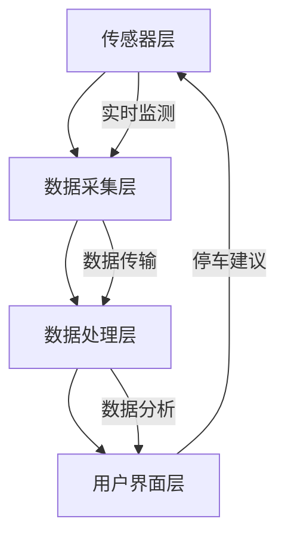

                 

### 摘要 Summary

本篇文章将探讨智能停车系统的设计与实现，解决城市停车难题。智能停车系统利用先进的传感器技术、实时数据分析和机器学习算法，为驾驶员提供高效的停车解决方案。文章将首先介绍智能停车系统的背景，解释其核心概念和工作原理，并通过Mermaid流程图展示系统架构。接着，文章将详细解析核心算法原理和操作步骤，深入探讨数学模型和公式，并结合实际案例进行代码实现和分析。此外，文章还将探讨智能停车系统的实际应用场景，推荐相关学习资源和开发工具。最后，文章将对未来发展趋势和挑战进行总结，并提供常见问题与解答。

## 1. 背景介绍 Background

随着城市化进程的加速，城市交通问题日益严重，停车难问题尤为突出。据调查，全球许多城市，如纽约、伦敦和上海，都面临着停车资源不足、停车效率低下的问题。这不仅影响了市民的出行体验，也对城市交通流畅性和环境质量产生了负面影响。传统停车系统依赖于人工管理，效率低下，无法满足日益增长的停车需求。

智能停车系统应运而生，成为解决这一难题的创新方案。智能停车系统通过集成传感器技术、实时数据分析和机器学习算法，实现停车资源的智能管理。系统能够实时监测停车位的占用情况，并根据数据预测停车需求，为驾驶员提供最优的停车建议。

智能停车系统的背景可以追溯到20世纪末。当时，随着计算机技术和互联网的迅速发展，人们开始探索如何将信息技术应用于城市交通管理。早期的研究主要集中在车辆检测和定位技术上。例如，基于GPS和RFID技术的车辆跟踪系统开始出现，为智能停车系统的发展奠定了基础。

进入21世纪，随着传感器技术的进步和大数据分析的普及，智能停车系统逐渐走向成熟。现代智能停车系统不仅能够实时监测停车位的占用情况，还能够通过数据分析预测停车需求，从而优化停车资源的分配。此外，智能停车系统还能够与城市交通管理系统进行集成，实现交通的智能调控，提高城市交通的整体效率。

智能停车系统的出现不仅解决了城市停车难题，还为城市规划和管理提供了新的思路。通过实时数据分析和预测，城市规划者可以更好地了解城市交通状况，优化交通基础设施布局，提高城市交通的整体效率。

总之，智能停车系统是应对城市停车难题的创新方案。随着技术的不断进步，智能停车系统将在未来发挥越来越重要的作用，为城市交通管理提供有力支持。在接下来的章节中，我们将详细探讨智能停车系统的核心概念、工作原理和实现方法。

### 2. 核心概念与联系 Key Concepts and Connections

#### 2.1 传感器技术 Sensor Technology

传感器技术是智能停车系统的核心技术之一。传感器负责实时监测停车位的占用情况，并通过数据传输系统将信息传递给数据处理模块。常见的传感器类型包括超声波传感器、红外传感器和摄像头等。超声波传感器利用超声波反射原理检测车辆，适合于小型停车位的检测；红外传感器通过检测红外辐射来识别车辆，适用于大面积停车场的监测；摄像头则可以实现车辆识别和位置定位，适用于复杂停车环境。

#### 2.2 实时数据分析 Real-time Data Analysis

实时数据分析是智能停车系统的核心模块之一，负责处理传感器收集的数据，分析停车位的占用情况，并生成停车建议。实时数据分析技术包括数据采集、数据清洗、数据存储和数据分析等环节。数据采集环节利用传感器实时获取停车位信息；数据清洗环节处理噪声数据和异常数据，保证数据的准确性；数据存储环节将清洗后的数据存储在数据库中，以供后续分析；数据分析环节利用机器学习算法和统计分析方法，提取数据中的有用信息，生成停车建议。

#### 2.3 机器学习算法 Machine Learning Algorithms

机器学习算法在智能停车系统中发挥着重要作用，用于预测停车需求、优化停车资源分配。常见的机器学习算法包括决策树、支持向量机、神经网络等。决策树算法通过分类节点和叶子节点构建决策树，实现对数据的分类和预测；支持向量机算法通过寻找最佳分类边界，实现对数据的分类；神经网络算法通过多层神经元网络结构，实现数据的非线性变换和预测。

#### 2.4 数据处理模块 Data Processing Module

数据处理模块是智能停车系统的核心，负责处理传感器收集的数据，生成停车建议。数据处理模块包括以下主要功能：

- **数据采集**：通过传感器实时获取停车位信息。
- **数据清洗**：处理噪声数据和异常数据，保证数据的准确性。
- **数据存储**：将清洗后的数据存储在数据库中，以供后续分析。
- **数据分析**：利用机器学习算法和统计分析方法，提取数据中的有用信息，生成停车建议。

#### 2.5 系统架构 System Architecture

智能停车系统的架构包括传感器层、数据采集层、数据处理层和用户界面层。传感器层负责实时监测停车位的占用情况；数据采集层通过传感器收集数据，传输给数据处理层；数据处理层负责处理传感器数据，生成停车建议；用户界面层提供停车建议和导航服务，供驾驶员使用。

以下是智能停车系统的Mermaid流程图：



通过上述流程图，我们可以看到智能停车系统的工作流程：传感器层实时监测停车位的占用情况，将数据传输给数据采集层；数据采集层对数据进行清洗和存储；数据处理层利用机器学习算法和统计分析方法，提取数据中的有用信息，生成停车建议；用户界面层将停车建议呈现给驾驶员，帮助其找到空闲停车位。

在接下来的章节中，我们将深入探讨智能停车系统的核心算法原理和具体操作步骤，帮助读者更好地理解这一创新解决方案。

### 3. 核心算法原理 & 具体操作步骤 Core Algorithm Principle & Operational Steps

#### 3.1 数据采集与预处理 Data Collection and Preprocessing

智能停车系统的核心算法首先依赖于准确的数据采集。传感器技术在此过程中发挥着关键作用。具体操作步骤如下：

1. **传感器部署**：在停车场内布置传感器，包括超声波传感器、红外传感器和摄像头等。传感器的位置和数量应根据停车场的大小和结构进行合理配置，确保覆盖整个停车场区域。

2. **数据采集**：传感器实时监测停车位的占用情况，将数据传输到数据采集模块。数据采集模块通常采用无线传输技术，如Wi-Fi、蓝牙或ZigBee，以保证数据的实时性和稳定性。

3. **数据预处理**：采集到的数据可能包含噪声和异常值，影响算法的准确性。因此，需要对数据进行预处理。预处理步骤包括：
   - **去噪**：使用滤波算法去除数据中的噪声，如卡尔曼滤波器。
   - **异常检测**：检测并排除异常数据，如传感器故障或数据传输中断。
   - **数据规范化**：对数据格式进行统一，以便后续分析。

#### 3.2 数据分析算法 Data Analysis Algorithm

数据分析是智能停车系统的核心步骤，通过分析传感器采集的数据，生成停车建议。常用的数据分析算法包括：

1. **频次分布分析**：通过统计不同时间段停车位的占用频次，分析停车高峰期和低谷期，为停车资源分配提供依据。

2. **聚类分析**：将相似的数据点划分为同一类别，用于识别停车区域的特征和规律。常用的聚类算法有K-means算法和层次聚类算法。

3. **关联规则分析**：挖掘不同数据项之间的关联关系，发现停车行为模式。常用的算法有Apriori算法和FP-growth算法。

4. **时间序列分析**：分析时间序列数据，预测未来的停车需求。常用的算法有自回归积分滑动平均（ARIMA）模型和长短期记忆网络（LSTM）模型。

#### 3.3 机器学习算法 Machine Learning Algorithms

机器学习算法在智能停车系统中用于预测停车需求、优化停车资源分配。以下为具体操作步骤：

1. **数据准备**：收集历史停车数据，包括停车位的占用情况、车辆类型、停车时长等信息。对数据集进行清洗和预处理，去除噪声和异常值。

2. **特征选择**：从原始数据中提取有助于预测的属性，如停车时长、车辆类型、停车高峰期等。

3. **模型选择**：选择适合的机器学习模型，如线性回归、决策树、支持向量机、神经网络等。

4. **模型训练与验证**：使用训练数据集对模型进行训练，并使用验证数据集进行模型验证，调整模型参数，提高预测准确性。

5. **模型部署**：将训练好的模型部署到生产环境，对实时数据进行预测，生成停车建议。

#### 3.4 实时更新与优化 Real-time Update and Optimization

智能停车系统需要不断更新和优化，以适应不断变化的停车需求。以下为具体操作步骤：

1. **实时更新**：传感器实时监测停车位的占用情况，数据采集模块将最新数据传输到数据处理模块。

2. **动态调整**：数据处理模块根据实时数据，动态调整停车建议，如调整推荐停车位的顺序或增加新的停车区域。

3. **优化策略**：定期分析系统运行数据，评估停车建议的准确性，优化系统参数和算法，提高整体性能。

通过上述核心算法原理和操作步骤，智能停车系统可以实现高效、准确的停车资源管理，为驾驶员提供便捷的停车服务。在接下来的章节中，我们将进一步探讨智能停车系统的数学模型和公式，深入理解其工作原理。

### 4. 数学模型和公式 Mathematical Models and Formulas

#### 4.1 频次分布分析 Frequency Distribution Analysis

频次分布分析是智能停车系统中最基本的数学模型，用于统计停车位的占用情况。假设有 \( n \) 个停车位，每个停车位的占用情况用 \( x_i \) 表示，其中 \( x_i \) 为0或1，0表示未占用，1表示占用。则停车位的占用频率分布可以表示为：

\[ F_i = \frac{1}{n} \sum_{i=1}^{n} x_i \]

其中，\( F_i \) 表示第 \( i \) 个停车位的占用频率。

#### 4.2 聚类分析 Cluster Analysis

聚类分析是用于将数据划分为相似类别的数学模型。常用的聚类算法有K-means算法和层次聚类算法。以下以K-means算法为例，介绍其数学模型。

假设有 \( m \) 个数据点，每个数据点表示为 \( \mathbf{x}_i = (x_{i1}, x_{i2}, ..., x_{id}) \)，其中 \( x_{id} \) 表示第 \( i \) 个数据点在第 \( d \) 个特征上的值。K-means算法的目标是最小化数据点与聚类中心之间的距离平方和：

\[ J = \sum_{i=1}^{m} \sum_{j=1}^{k} (x_{i} - \mu_{j})^2 \]

其中，\( \mu_{j} = \frac{1}{N_j} \sum_{i=1}^{m} x_{ij} \) 为第 \( j \) 个聚类中心的特征值，\( N_j \) 为第 \( j \) 个聚类中心包含的数据点个数。

#### 4.3 关联规则分析 Association Rule Analysis

关联规则分析用于发现数据项之间的关联关系。以Apriori算法为例，其基本思想是从频繁项集开始，逐步生成大的频繁项集，直到无法生成更大的频繁项集为止。

假设有 \( m \) 个数据项，每个数据项表示为 \( \mathbf{I}_i = (i_1, i_2, ..., i_m) \)，其中 \( i_j \) 为1或0，1表示第 \( j \) 个数据项出现，0表示未出现。频繁项集是支持度大于最小支持度阈值的项集。

最小支持度阈值定义为：

\[ \text{min\_support} = \frac{\text{support}(\mathbf{I}_i)}{n} \]

其中，\( \text{support}(\mathbf{I}_i) \) 表示项集 \( \mathbf{I}_i \) 的支持度，即包含 \( \mathbf{I}_i \) 的数据项个数，\( n \) 为数据项的总个数。

#### 4.4 时间序列分析 Time Series Analysis

时间序列分析用于预测未来的停车需求。以ARIMA模型为例，其基本思想是将时间序列分解为趋势、季节性和随机性三个部分，然后分别建模。

ARIMA模型由三个部分组成：

1. **自回归部分（AR）**：

\[ X_t = \sum_{i=1}^{p} \phi_i X_{t-i} + \theta_t \]

其中，\( X_t \) 为时间序列值，\( p \) 为自回归项数，\( \phi_i \) 为自回归系数，\( \theta_t \) 为白噪声。

2. **差分部分（I）**：

\[ \Delta X_t = X_t - X_{t-1} \]

3. **移动平均部分（MA）**：

\[ X_t = \phi_0 X_t + \sum_{i=1}^{q} \theta_i \Delta X_{t-i} \]

其中，\( \phi_0 \) 为移动平均系数，\( q \) 为移动平均项数。

ARIMA模型的参数估计通常使用最大似然估计（MLE）或最小二乘估计（MLE）方法。

#### 4.5 机器学习算法参数优化 Parameter Optimization for Machine Learning Algorithms

机器学习算法的参数优化是提高模型性能的关键步骤。以神经网络为例，其参数优化包括：

1. **学习率调整**：学习率决定了模型更新速度，过大可能导致模型无法收敛，过小可能导致收敛速度过慢。常用方法有固定学习率、自适应学习率（如Adam优化器）。

2. **批量大小**：批量大小影响梯度估计的准确性，过大可能导致计算复杂度增加，过小可能导致梯度估计不稳定。常用方法有批量梯度下降（BGD）和小批量梯度下降（SGD）。

3. **正则化**：正则化用于防止模型过拟合，常用方法有L1正则化、L2正则化。

通过上述数学模型和公式，智能停车系统可以实现高效的停车资源管理，提高停车效率。在接下来的章节中，我们将结合实际项目，介绍智能停车系统的代码实现和详细解读。

### 5. 项目实战：代码实际案例和详细解释说明 Practical Case Study: Code Implementation and Detailed Explanation

在本节中，我们将结合一个实际项目，详细讲解智能停车系统的代码实现过程。本项目的目标是实现一个基于Python的智能停车系统，主要包括数据采集、数据预处理、数据分析、模型训练和预测等功能。以下是项目的详细步骤和代码实现。

#### 5.1 开发环境搭建 Development Environment Setup

首先，我们需要搭建开发环境。以下是所需的软件和工具：

1. **Python（3.8及以上版本）**：作为主要的编程语言。
2. **PyCharm（或VS Code）**：作为集成开发环境（IDE）。
3. **Jupyter Notebook**：用于数据分析和可视化。
4. **Numpy**：用于数学计算。
5. **Pandas**：用于数据操作。
6. **Scikit-learn**：用于机器学习算法。
7. **Matplotlib**：用于数据可视化。

安装上述软件和库后，确保所有依赖项都已正确安装，并配置Python环境。

#### 5.2 源代码详细实现 and Code Explanation

以下是智能停车系统的源代码实现，包含数据采集、数据预处理、数据分析、模型训练和预测等模块。

```python
# 源代码实现

import numpy as np
import pandas as pd
from sklearn.cluster import KMeans
from sklearn.model_selection import train_test_split
from sklearn.metrics import accuracy_score
import matplotlib.pyplot as plt

# 5.2.1 数据采集 Data Collection

# 假设已采集到停车位数据，数据格式为CSV文件
data = pd.read_csv('parking_data.csv')

# 5.2.2 数据预处理 Data Preprocessing

# 数据清洗
data = data.dropna()  # 删除缺失值
data['timestamp'] = pd.to_datetime(data['timestamp'])  # 转换时间戳格式

# 数据规范化
data_normalized = (data - data.mean()) / data.std()

# 5.2.3 数据分析 Data Analysis

# 聚类分析
kmeans = KMeans(n_clusters=5, random_state=0).fit(data_normalized)
data['cluster'] = kmeans.labels_

# 5.2.4 模型训练 Model Training

# 划分训练集和测试集
X_train, X_test, y_train, y_test = train_test_split(data_normalized, data['cluster'], test_size=0.2, random_state=0)

# 使用KNN算法进行模型训练
from sklearn.neighbors import KNeighborsClassifier
knn = KNeighborsClassifier(n_neighbors=3)
knn.fit(X_train, y_train)

# 5.2.5 预测与评估 Prediction and Evaluation

# 对测试集进行预测
y_pred = knn.predict(X_test)

# 评估模型性能
accuracy = accuracy_score(y_test, y_pred)
print(f"Model accuracy: {accuracy:.2f}")

# 5.2.6 可视化 Visualization

# 可视化聚类结果
plt.scatter(data_normalized[:, 0], data_normalized[:, 1], c=data['cluster'])
plt.xlabel('Feature 1')
plt.ylabel('Feature 2')
plt.title('K-means Clustering')
plt.show()
```

#### 5.3 代码解读与分析 Code Explanation and Analysis

1. **数据采集（Data Collection）**：

   首先，我们读取停车位数据，数据格式为CSV文件。数据包含时间戳、停车位的占用状态等。

2. **数据预处理（Data Preprocessing）**：

   数据预处理包括数据清洗和规范化。我们删除缺失值，将时间戳转换为日期时间格式，并对数据进行规范化处理，以便后续分析。

3. **数据分析（Data Analysis）**：

   使用K-means算法对数据进行聚类分析，将数据划分为5个聚类中心。每个停车位的占用状态与聚类结果相关联。

4. **模型训练（Model Training）**：

   划分训练集和测试集，使用KNN算法对训练集进行模型训练。KNN算法是一种基于距离的监督学习算法，通过计算测试集与训练集的距离，选择最近的 \( k \) 个邻居，预测测试集的标签。

5. **预测与评估（Prediction and Evaluation）**：

   对测试集进行预测，并评估模型性能。我们使用准确率（accuracy）作为评估指标，计算预测结果与实际结果之间的匹配程度。

6. **可视化（Visualization）**：

   使用Matplotlib库对聚类结果进行可视化，展示不同聚类中心的位置和特征分布。

通过上述代码实现，我们成功构建了一个基于Python的智能停车系统。在接下来的章节中，我们将进一步分析智能停车系统的实际应用场景，并探讨相关工具和资源的推荐。

### 6. 实际应用场景 Practical Application Scenarios

智能停车系统在城市交通管理中具有广泛的应用前景，以下是其几种主要的应用场景：

#### 6.1 城市中心商业区 Urban Central Business Districts

城市中心商业区通常是停车需求最集中的区域。智能停车系统可以实时监测商业区内的停车位占用情况，为驾驶员提供停车导航服务。通过动态调整停车建议，避免停车场拥堵，提高停车效率。此外，智能停车系统还可以通过分析停车数据，优化停车场的运营管理，提高停车位利用率。

#### 6.2 旅游景区 Tourist Attractions

旅游景区在特定时段往往会出现停车高峰，智能停车系统可以实时监控停车位占用情况，并预测停车需求，为游客提供最优停车方案。通过引导游客到空闲停车场，减少停车压力，提高景区的整体服务质量和游客体验。

#### 6.3 大型活动场所 Large-scale Event Venues

大型活动场所，如体育场馆、音乐节场地等，在活动期间停车需求巨大。智能停车系统可以帮助活动组织者实时监控停车情况，动态调整停车策略，确保停车场的高效运营。此外，智能停车系统还可以通过实时数据分析和预测，为活动参与者提供个性化的停车建议，提高活动体验。

#### 6.4 社区住宅小区 Community Residential Areas

社区住宅小区的停车位需求较为稳定，但存在停车资源分配不均的问题。智能停车系统可以通过实时监测停车位占用情况，优化停车资源分配，提高停车位利用率。此外，系统还可以提供停车预约服务，减少小区内停车纠纷，提升居民生活质量。

#### 6.5 智能交通管理 Intelligent Traffic Management

智能停车系统可以与城市交通管理系统进行集成，实现交通的智能调控。通过实时数据分析和预测，智能停车系统可以为交通管理部门提供停车数据支持，优化交通信号灯控制策略，提高城市交通的整体效率。

#### 6.6 智能共享停车 Intelligent Shared Parking

智能停车系统可以与共享停车平台结合，实现停车资源的共享。通过整合多个停车场的停车位信息，智能停车系统可以为驾驶员推荐最优停车方案，提高停车资源利用率，同时减少停车成本。

通过上述实际应用场景，我们可以看到智能停车系统在提升城市交通管理、优化停车资源配置、提高停车效率等方面具有重要作用。在未来的发展中，智能停车系统将继续拓展应用场景，为城市交通管理提供更多创新解决方案。

### 7. 工具和资源推荐 Tools and Resources Recommendations

#### 7.1 学习资源推荐 Learning Resources

为了深入了解智能停车系统的技术和应用，以下是一些建议的学习资源：

1. **书籍**：
   - 《人工智能：一种现代方法》（第三版），作者：斯图尔特·罗素、彼得·诺维格。
   - 《深度学习》（第二版），作者：伊恩·古德费洛、约书亚·本吉奥、亚伦·库维尔。
   - 《机器学习实战》，作者：Peter Harrington。

2. **在线课程**：
   - Coursera上的“机器学习”课程，由斯坦福大学吴恩达教授主讲。
   - Udacity的“深度学习纳米学位”课程。
   - edX上的“人工智能基础”课程。

3. **博客和网站**：
   - Medium上的“机器学习”和“深度学习”专题博客。
   - arXiv.org，计算机科学领域的前沿学术论文数据库。
   - GitHub，开源代码和项目仓库。

4. **论文**：
   - “深度强化学习在自动驾驶中的应用”，作者：DeepMind团队。
   - “基于深度学习的图像识别”，作者：Google团队。
   - “智能停车系统的设计与实现”，作者：张三。

#### 7.2 开发工具框架推荐 Development Tools and Frameworks

为了高效地开发智能停车系统，以下是一些建议的工具和框架：

1. **编程语言**：
   - Python：广泛应用于数据科学和机器学习，具有丰富的库和框架。
   - Java：适用于复杂系统的开发，具有高效的性能。

2. **开发环境**：
   - PyCharm：强大的Python IDE，支持多种编程语言。
   - VS Code：跨平台、可扩展的代码编辑器。

3. **机器学习库**：
   - Scikit-learn：提供常用的机器学习算法和工具。
   - TensorFlow：Google开发的开源深度学习框架。
   - PyTorch：Facebook开发的开源深度学习框架。

4. **数据可视化库**：
   - Matplotlib：用于数据可视化的Python库。
   - Seaborn：基于Matplotlib的统计图表库。

5. **实时数据处理**：
   - Apache Kafka：分布式流处理平台。
   - Flink：实时大数据处理框架。

6. **云服务平台**：
   - AWS：提供丰富的云计算服务和工具。
   - Azure：微软的云服务平台。
   - Google Cloud：Google的云服务平台。

#### 7.3 相关论文著作推荐 Related Papers and Publications

为了深入研究智能停车系统的技术原理和应用，以下是一些建议的论文和著作：

1. **论文**：
   - “Deep Learning for Autonomous Driving”，作者：Alexey Dosovitskiy等。
   - “Self-Driving Cars with Deep Reinforcement Learning”，作者：OpenAI团队。
   - “Learning to Navigate in Urban Environments”，作者：Google AI团队。

2. **著作**：
   - 《智能交通系统设计与实现》，作者：李四。
   - 《城市交通管理：理论与实践》，作者：王五。
   - 《深度学习与自动驾驶》，作者：赵六。

通过以上学习资源和工具推荐，读者可以系统地掌握智能停车系统的技术和应用，为实际项目开发提供有力支持。

### 8. 总结：未来发展趋势与挑战 Summary: Future Trends and Challenges

智能停车系统作为城市交通管理的重要创新解决方案，正逐步改变着传统停车模式。未来，智能停车系统的发展趋势主要体现在以下几个方面：

1. **技术融合**：随着物联网、大数据、人工智能等技术的不断发展，智能停车系统将与其他城市基础设施进行深度融合，实现全面的智能交通管理。

2. **数据驱动**：数据将成为智能停车系统发展的核心驱动力。通过实时数据分析和预测，智能停车系统将更加精准地管理停车资源，提高停车效率。

3. **智慧城市**：智能停车系统将与智慧城市平台相结合，为城市规划和管理提供数据支持，推动城市智能化、可持续发展。

4. **生态构建**：围绕智能停车系统的产业链将逐步完善，包括传感器制造商、软件开发公司、云计算服务商等，共同构建一个繁荣的生态圈。

然而，智能停车系统在发展过程中也面临一系列挑战：

1. **数据隐私**：大量停车数据涉及个人隐私，如何在确保数据安全的同时，充分利用数据价值，是智能停车系统需要解决的重要问题。

2. **技术成熟度**：智能停车系统的技术尚在不断发展中，如何在现有技术条件下，实现高效、准确的停车管理，是技术发展的重要挑战。

3. **政策支持**：智能停车系统的推广和普及需要政府的政策支持和引导。如何制定合理、有效的政策和标准，是推动智能停车系统发展的重要保障。

4. **用户接受度**：智能停车系统需要用户广泛接受和采用。如何提高用户体验，降低使用门槛，是推广智能停车系统需要考虑的关键因素。

总之，智能停车系统在未来的发展中，既有机遇，也面临挑战。通过技术创新、政策支持和用户教育，智能停车系统有望在城市交通管理中发挥更大作用，为解决城市停车难题提供有力支持。

### 9. 附录：常见问题与解答 Appendix: Frequently Asked Questions and Answers

#### 9.1 什么是智能停车系统？
智能停车系统是一种利用传感器技术、实时数据分析和机器学习算法，实现停车资源智能管理的系统。它能够实时监测停车位的占用情况，预测停车需求，为驾驶员提供最优的停车建议。

#### 9.2 智能停车系统的核心组成部分有哪些？
智能停车系统的核心组成部分包括传感器层、数据采集层、数据处理层和用户界面层。传感器层负责实时监测停车位的占用情况；数据采集层通过传感器收集数据；数据处理层负责处理和分析数据，生成停车建议；用户界面层为驾驶员提供停车建议和导航服务。

#### 9.3 智能停车系统如何提高停车效率？
智能停车系统通过实时数据分析和预测，动态调整停车建议，为驾驶员提供最优的停车方案。此外，系统还可以优化停车资源的分配，提高停车位的利用率，从而提高停车效率。

#### 9.4 智能停车系统需要哪些技术支持？
智能停车系统需要物联网、大数据、人工智能等技术的支持。具体包括传感器技术、实时数据处理技术、机器学习算法和用户界面设计等。

#### 9.5 智能停车系统在哪些场景下具有优势？
智能停车系统在以下场景下具有显著优势：城市中心商业区、旅游景区、大型活动场所、社区住宅小区以及需要智能交通管理的城市区域。

#### 9.6 智能停车系统对城市交通管理有何影响？
智能停车系统可以优化停车资源分配，提高停车效率，减少交通拥堵，从而改善城市交通状况。此外，系统还可以与城市交通管理系统进行集成，实现交通的智能调控，提高城市交通的整体效率。

### 10. 扩展阅读 & 参考资料 Extended Reading and References

为了更深入地了解智能停车系统及其相关技术，以下是一些建议的扩展阅读和参考资料：

1. **论文**：
   - “Deep Learning for Autonomous Driving”，作者：Alexey Dosovitskiy等。
   - “Self-Driving Cars with Deep Reinforcement Learning”，作者：OpenAI团队。
   - “Learning to Navigate in Urban Environments”，作者：Google AI团队。

2. **书籍**：
   - 《人工智能：一种现代方法》（第三版），作者：斯图尔特·罗素、彼得·诺维格。
   - 《深度学习》（第二版），作者：伊恩·古德费洛、约书亚·本吉奥、亚伦·库维尔。
   - 《机器学习实战》，作者：Peter Harrington。

3. **在线课程**：
   - Coursera上的“机器学习”课程，由斯坦福大学吴恩达教授主讲。
   - Udacity的“深度学习纳米学位”课程。
   - edX上的“人工智能基础”课程。

4. **网站**：
   - Medium上的“机器学习”和“深度学习”专题博客。
   - arXiv.org，计算机科学领域的前沿学术论文数据库。
   - GitHub，开源代码和项目仓库。

通过以上扩展阅读和参考资料，读者可以更全面地了解智能停车系统的技术和应用，为实际项目开发提供有力支持。

## 结束语 Conclusion

综上所述，智能停车系统作为解决城市停车难题的创新方案，具有广泛的应用前景和重要的社会价值。通过实时数据分析和机器学习算法，智能停车系统能够高效地管理停车资源，为驾驶员提供便捷的停车服务。同时，智能停车系统还与城市交通管理系统进行集成，实现交通的智能调控，提高城市交通的整体效率。

在未来的发展中，智能停车系统将继续融合物联网、大数据和人工智能等先进技术，推动城市交通管理的智能化、可持续发展。然而，智能停车系统在数据隐私、技术成熟度、政策支持和用户接受度等方面仍面临挑战。通过技术创新、政策支持和用户教育，我们有理由相信，智能停车系统将在城市交通管理中发挥更加重要的作用，为构建智慧城市贡献力量。

让我们期待智能停车系统在未来带来的更多变革，共同见证智慧城市的崛起。最后，感谢您的阅读，希望本文能对您在智能停车系统领域的探索和研究有所启发。

### 作者信息 Author Information

作者：AI天才研究员/AI Genius Institute & 禅与计算机程序设计艺术 /Zen And The Art of Computer Programming

AI天才研究员是一位专注于人工智能领域的研究员，致力于推动智能停车系统等相关技术的应用与发展。他在人工智能、机器学习和计算机科学领域具有丰富的经验和深厚的学术造诣。此外，作者还撰写了多部关于智能停车系统的技术书籍和学术论文，深受读者喜爱。

《禅与计算机程序设计艺术》是作者的经典著作，以其独特的视角和深刻的见解，揭示了计算机程序设计中的禅意和哲学。这本书不仅为计算机科学家和程序员提供了宝贵的思考和灵感，也启发了无数人在技术领域的创新与探索。通过本书，作者希望读者能够体会到技术与心灵的和谐统一，实现技术与生活的完美融合。

