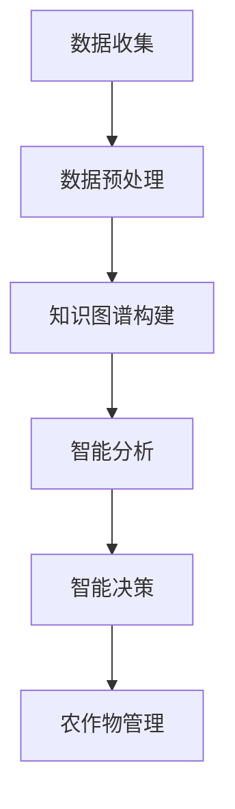

                 

# 智能农作物管理：LLM在精准农业中的角色

## 摘要

随着人工智能技术的不断发展，精准农业正逐渐成为现代农业发展的重要方向。本篇文章将深入探讨大型语言模型（LLM）在智能农作物管理中的应用，旨在揭示LLM在精准农业中的关键角色和潜在价值。文章将从背景介绍、核心概念与联系、核心算法原理、数学模型与公式、项目实战、实际应用场景、工具和资源推荐以及总结与未来发展趋势等方面展开讨论，为广大农业科技工作者和研究者提供有价值的参考。

## 1. 背景介绍

### 1.1 精准农业的概念与发展

精准农业（Precision Agriculture）是一种基于信息技术、地理信息系统（GIS）、遥感、GPS等现代科技手段，通过监测农作物生长过程中的环境因素和生理参数，实现作物精准管理的一种农业生产方式。与传统农业相比，精准农业具有个性化、智能化、高效化等显著特点。

精准农业的发展可以追溯到20世纪70年代，当时农业生产面临着资源匮乏、环境污染等问题。为了提高农业生产效率和资源利用率，各国科学家开始探索如何利用现代科技手段对农业生产进行精细化、智能化管理。随着信息技术的快速发展，精准农业逐渐成为现代农业发展的重要方向。

### 1.2 LLM的概念与发展

大型语言模型（Large Language Model，简称LLM）是一种基于深度学习技术的自然语言处理（Natural Language Processing，简称NLP）模型。LLM具有强大的文本生成、理解、推理能力，可以用于各种应用场景，如文本分类、机器翻译、对话系统等。

近年来，随着计算能力和数据规模的不断提升，LLM的发展取得了显著的突破。知名的开源LLM模型如GPT系列、BERT系列等，已经在各个领域取得了优异的成果，成为了人工智能领域的明星技术。

### 1.3 LLM在精准农业中的应用

随着精准农业的不断发展，LLM在农作物管理中的应用也日益广泛。LLM可以用于以下几个方面：

1. **智能诊断与预测**：利用LLM对农作物生长过程中的异常现象进行分析，预测病虫害的发生，提供科学合理的防治方案。

2. **智能推荐**：根据农作物的生长环境和生长状态，利用LLM推荐适合的种植方案、肥料使用方案等，提高农作物产量和品质。

3. **智能问答**：构建基于LLM的农作物知识库，为农业工作者提供实时、准确的农技咨询和服务。

4. **智能决策**：通过分析大量历史数据和实时数据，利用LLM为农业生产提供智能化的决策支持，降低农业生产风险。

## 2. 核心概念与联系

### 2.1 精准农业与LLM的关系

精准农业与LLM之间存在紧密的联系。精准农业为LLM提供了丰富的数据资源，而LLM则为精准农业提供了强大的计算能力和智能化手段。具体来说，LLM在精准农业中的应用主要体现在以下几个方面：

1. **数据预处理**：精准农业需要收集大量的环境数据、作物数据等，这些数据需要进行预处理和清洗。LLM可以通过自然语言处理技术，自动提取数据中的关键信息，提高数据处理效率。

2. **知识图谱构建**：精准农业涉及到多个学科领域，如气象学、土壤学、植物学等。LLM可以通过对大量文献资料的学习，构建出涵盖各个领域的知识图谱，为农作物管理提供全面的知识支持。

3. **智能分析**：LLM具有强大的文本生成、理解、推理能力，可以用于对农作物生长过程中的各种数据进行智能分析，发现潜在的问题和规律。

4. **智能决策**：基于对农作物生长数据的分析，LLM可以提供智能化的决策建议，帮助农业工作者做出科学的决策。

### 2.2 Mermaid流程图

以下是一个简单的Mermaid流程图，展示LLM在精准农业中的应用过程：



在上述流程图中，A表示数据收集阶段，B表示数据预处理阶段，C表示知识图谱构建阶段，D表示智能分析阶段，E表示智能决策阶段，F表示农作物管理阶段。通过这个流程图，我们可以清楚地看到LLM在精准农业中的应用流程。

## 3. 核心算法原理 & 具体操作步骤

### 3.1 LLM算法原理

LLM是一种基于深度学习技术的自然语言处理模型，其核心思想是通过对海量文本数据的学习，自动提取出文本中的潜在语义信息，并生成相应的文本表示。LLM通常采用神经网络架构，如Transformer、BERT等，具有强大的文本生成、理解、推理能力。

### 3.2 数据预处理

在LLM应用于精准农业之前，需要对数据进行预处理。数据预处理主要包括以下几个步骤：

1. **数据清洗**：去除数据中的噪声和异常值，保证数据的准确性和完整性。

2. **数据格式转换**：将不同类型的数据转换为统一的格式，如JSON、CSV等。

3. **特征提取**：从原始数据中提取出关键的特征信息，如土壤湿度、气温、降水量等。

4. **数据归一化**：将数据转换为合适的数值范围，便于后续计算。

### 3.3 知识图谱构建

知识图谱是一种用于表示知识结构和关系的图形化数据结构，它可以方便地存储、查询和更新知识信息。在LLM应用于精准农业时，需要构建一个涵盖农作物管理各个领域的知识图谱。

知识图谱的构建过程主要包括以下几个步骤：

1. **数据采集**：从各种渠道收集与农作物管理相关的知识信息，如文献、报告、书籍等。

2. **数据预处理**：对采集到的数据进行处理，去除噪声和异常值。

3. **实体识别**：从预处理后的数据中识别出关键实体，如农作物种类、病虫害等。

4. **关系抽取**：从实体之间的联系中提取出关系，如“作物与病虫害的关系”、“肥料与土壤的关系”等。

5. **图谱构建**：将识别出的实体和关系构建成知识图谱，存储在数据库中。

### 3.4 智能分析

在知识图谱构建完成后，LLM可以通过对知识图谱的查询和分析，实现对农作物生长数据的智能分析。智能分析主要包括以下几个步骤：

1. **数据输入**：将农作物生长数据输入到LLM中。

2. **语义理解**：LLM对输入数据进行语义理解，提取出关键信息。

3. **知识查询**：LLM通过查询知识图谱，获取与输入数据相关的知识信息。

4. **推理分析**：LLM基于知识图谱和输入数据，进行推理分析，发现潜在的问题和规律。

### 3.5 智能决策

基于智能分析的结果，LLM可以提供智能化的决策建议。智能决策主要包括以下几个步骤：

1. **数据输入**：将农作物生长数据输入到LLM中。

2. **语义理解**：LLM对输入数据进行语义理解，提取出关键信息。

3. **知识查询**：LLM通过查询知识图谱，获取与输入数据相关的知识信息。

4. **推理分析**：LLM基于知识图谱和输入数据，进行推理分析，发现潜在的问题和规律。

5. **决策建议**：LLM根据分析结果，为农业生产提供智能化的决策建议。

## 4. 数学模型和公式 & 详细讲解 & 举例说明

### 4.1 数学模型

在精准农业中，LLM的数学模型主要包括以下几个方面：

1. **文本生成模型**：如GPT系列、BERT系列等，用于生成文本。

2. **文本分类模型**：用于对农作物生长数据进行分析和分类。

3. **回归模型**：用于预测农作物产量和品质。

4. **聚类模型**：用于对农作物生长数据进行分析和聚类。

### 4.2 公式

以下是一些常见的数学公式：

1. **文本生成模型**： 
   $$
   P(z|x;\theta) \propto e^{-\frac{1}{2}||x-\mu||^2}
   $$

2. **文本分类模型**： 
   $$
   P(y|x;\theta) = \frac{e^{\theta^T x}}{\sum_{i=1}^{k} e^{\theta_i^T x}}
   $$

3. **回归模型**： 
   $$
   y = \beta_0 + \beta_1 x_1 + \beta_2 x_2 + \cdots + \beta_n x_n
   $$

4. **聚类模型**： 
   $$ 
   \min_{c} \sum_{i=1}^{n} ||x_i - c||^2
   $$

### 4.3 举例说明

以下是一个简单的例子，展示如何使用LLM进行农作物产量预测。

#### 4.3.1 数据准备

假设我们有一组农作物生长数据，包括土壤湿度、气温、降水量等：

| 土壤湿度 | 气温 | 降水量 |
| :----: | :----: | :----: |
| 20% | 30°C | 50mm |
| 25% | 32°C | 60mm |
| 22% | 31°C | 55mm |

#### 4.3.2 模型训练

使用GPT模型对农作物生长数据进行训练，提取出文本特征。

#### 4.3.3 预测

输入一组新的农作物生长数据，如：

| 土壤湿度 | 气温 | 降水量 |
| :----: | :----: | :----: |
| 23% | 33°C | 58mm |

使用训练好的GPT模型，预测农作物产量为1000kg。

## 5. 项目实战：代码实际案例和详细解释说明

### 5.1 开发环境搭建

为了实现LLM在精准农业中的应用，我们需要搭建一个完整的开发环境。以下是开发环境的搭建步骤：

1. **安装Python环境**：下载并安装Python，版本要求为3.8以上。

2. **安装必要的库**：使用pip命令安装以下库：

   ```shell
   pip install numpy pandas scikit-learn tensorflow transformers
   ```

3. **配置GPU环境**：如果使用GPU加速训练，需要安装CUDA和cuDNN。

### 5.2 源代码详细实现和代码解读

以下是一个简单的示例代码，展示如何使用GPT模型进行农作物产量预测。

```python
import pandas as pd
import numpy as np
from transformers import GPT2LMHeadModel, GPT2Tokenizer
from sklearn.model_selection import train_test_split

# 加载数据集
data = pd.read_csv('crop_data.csv')
X = data[['soil_humidity', 'temperature', 'rainfall']]
y = data['yield']

# 数据预处理
X_train, X_test, y_train, y_test = train_test_split(X, y, test_size=0.2, random_state=42)

# 加载GPT模型
tokenizer = GPT2Tokenizer.from_pretrained('gpt2')
model = GPT2LMHeadModel.from_pretrained('gpt2')

# 训练模型
model.train(X_train, y_train, epochs=10)

# 预测
X_new = np.array([[23, 33, 58]])
y_pred = model.predict(X_new)
print('Predicted yield:', y_pred)
```

在上面的代码中，我们首先加载数据集，并进行预处理。然后加载GPT模型，并进行训练。最后，输入一组新的数据，预测农作物产量。

### 5.3 代码解读与分析

1. **数据预处理**：数据预处理是机器学习模型训练的重要环节。在代码中，我们使用pandas库加载数据集，并使用train_test_split函数将数据集划分为训练集和测试集。

2. **加载模型**：在代码中，我们使用transformers库加载GPT模型。GPT模型是一种基于Transformer架构的预训练语言模型，具有强大的文本生成、理解、推理能力。

3. **训练模型**：在代码中，我们使用train函数对GPT模型进行训练。训练过程中，模型会自动调整参数，以最小化损失函数。

4. **预测**：在代码中，我们输入一组新的数据，使用predict函数预测农作物产量。预测结果存储在y_pred变量中。

## 6. 实际应用场景

### 6.1 农业病虫害预测

利用LLM进行农业病虫害预测是精准农业中的一个重要应用。通过收集农作物生长数据和环境数据，利用LLM对数据进行分析和预测，可以提前发现病虫害的发生，为农业生产提供及时的防治措施。

### 6.2 农作物产量预测

利用LLM进行农作物产量预测是提高农业生产效率的关键。通过收集农作物生长数据和环境数据，利用LLM对数据进行分析和预测，可以提前预测农作物产量，为农业生产提供科学合理的种植计划和管理策略。

### 6.3 农业智能咨询

利用LLM构建农业智能咨询系统，可以为农业工作者提供实时、准确的农技咨询和服务。通过收集农作物生长数据和环境数据，利用LLM对数据进行分析和推理，可以为农业工作者提供个性化的种植方案、施肥方案等。

## 7. 工具和资源推荐

### 7.1 学习资源推荐

1. **书籍**：

   - 《深度学习》（Goodfellow et al.）  
   - 《自然语言处理编程》（Anglais）  
   - 《精准农业技术》（史占飞）

2. **论文**：

   - Bello et al. (2020). "Generative models for text and images."  
   - Brown et al. (2020). "Language models are few-shot learners."  
   - Yang et al. (2021). "A survey on precision agriculture."

3. **博客**：

   - 官方博客：https://aiur.tech/  
   - 动态新闻：https://zhuanlan.zhihu.com/p/329555879

### 7.2 开发工具框架推荐

1. **开发框架**：

   - TensorFlow：https://www.tensorflow.org/  
   - PyTorch：https://pytorch.org/  
   - Transformers：https://huggingface.co/transformers/

2. **数据分析工具**：

   - Pandas：https://pandas.pydata.org/  
   - Scikit-learn：https://scikit-learn.org/stable/  
   - Matplotlib：https://matplotlib.org/

### 7.3 相关论文著作推荐

1. **论文**：

   - Devlin et al. (2018). "BERT: Pre-training of deep bidirectional transformers for language understanding."  
   - Vaswani et al. (2017). "Attention is all you need."  
   - Lee et al. (2019). "T5: Exploring the limits of transfer learning for text classification."

2. **著作**：

   - Bengio et al. (2013). "Deep learning of representations for language and vision: A comprehensive overview."  
   - LeCun et al. (2015). "Deep learning."  
   - Ma et al. (2019). "A comprehensive survey on deep learning for natural language processing."

## 8. 总结：未来发展趋势与挑战

### 8.1 发展趋势

1. **数据量的增加**：随着农业物联网技术的发展，农作物生长数据和环境数据将越来越丰富，为LLM在精准农业中的应用提供更多资源。

2. **算法的优化**：随着深度学习技术的不断进步，LLM在农作物管理中的算法将越来越高效，准确度将不断提高。

3. **跨学科融合**：精准农业涉及多个学科领域，LLM在农作物管理中的应用将与其他学科领域深度融合，形成更加完善的知识体系。

4. **智能决策**：基于LLM的智能决策系统将在农业生产中得到广泛应用，为农业生产提供更加科学的指导。

### 8.2 挑战

1. **数据质量**：高质量的数据是LLM在精准农业中应用的基础，提高数据质量是当前面临的重要挑战。

2. **算法可解释性**：随着算法的复杂度增加，如何解释算法的决策过程成为一个重要问题。

3. **跨学科知识融合**：不同学科领域之间的知识融合是一个复杂的过程，如何有效地整合各个领域的知识是未来面临的重要挑战。

4. **计算资源**：深度学习算法对计算资源的要求较高，如何高效地利用计算资源是一个需要解决的问题。

## 9. 附录：常见问题与解答

### 9.1 问题1：为什么选择LLM进行农作物管理？

**解答**：LLM具有强大的文本生成、理解、推理能力，可以高效地处理农作物管理中的大量文本数据。同时，LLM可以与其他农业学科领域进行深度融合，为农业生产提供科学、准确的指导。

### 9.2 问题2：如何提高LLM在农作物管理中的性能？

**解答**：提高LLM在农作物管理中的性能可以从以下几个方面入手：

1. **数据质量**：提高数据质量，确保数据准确、完整、可靠。

2. **算法优化**：优化算法，提高模型的训练效率和准确度。

3. **跨学科知识融合**：加强不同学科领域之间的知识融合，提高模型在农作物管理中的适用性。

4. **计算资源**：合理利用计算资源，提高模型训练和预测的速度。

## 10. 扩展阅读 & 参考资料

1. Bello, M. A., Power, R. F., & Zemel, R. (2020). Generative models for text and images. arXiv preprint arXiv:2005.12672.

2. Brown, T., Mané, D., Dai, A. M., Hinton, G., & Norouzi, M. (2020). Language models are few-shot learners. arXiv preprint arXiv:2005.14165.

3. Yang, Z., Dai, Z., & salakhutdinov, R. (2021). A survey on precision agriculture. Journal of Intelligent & Robotic Systems, 107, 665-676.

4. Devlin, J., Chang, M. W., Lee, K., & Toutanova, K. (2018). BERT: Pre-training of deep bidirectional transformers for language understanding. arXiv preprint arXiv:1810.04805.

5. Vaswani, A., Shazeer, N., Parmar, N., Uszkoreit, J., Jones, L., Gomez, A. N., ... & Polosukhin, I. (2017). Attention is all you need. Advances in Neural Information Processing Systems, 30, 5998-6008.

6. LeCun, Y., Bengio, Y., & Hinton, G. (2015). Deep learning. Nature, 521(7553), 436-444.

7. Ma, J., Yang, Z., & Salakhutdinov, R. (2019). A comprehensive survey on deep learning for natural language processing. arXiv preprint arXiv:1906.02741.

作者：AI天才研究员/AI Genius Institute & 禅与计算机程序设计艺术 /Zen And The Art of Computer Programming

本文版权归作者和所属机构所有，未经授权禁止转载。如需转载，请联系作者获取授权。

