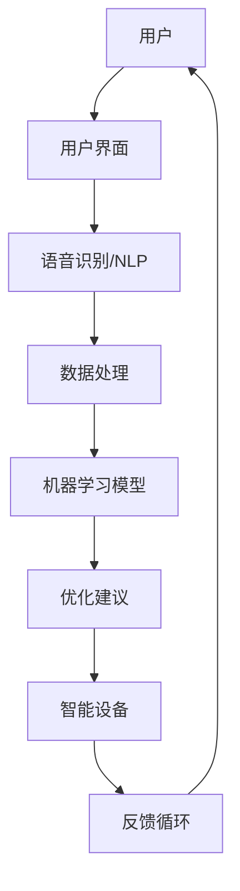

                 

### 背景介绍

随着人工智能技术的飞速发展，各行各业都在寻找将其应用到实际场景中的方法。烹饪，作为人类生活的重要组成部分，也迎来了新的变革。智能厨房作为烹饪革命的产物，正逐渐改变着传统烹饪的方式。智能厨房通过利用先进的AI技术和物联网设备，实现了自动化烹饪、个性化推荐、营养分析等功能，不仅提高了烹饪的效率和精确度，还提升了用户的烹饪体验。

本文将深入探讨智能厨房创业所涉及的技术支持。首先，我们将介绍智能厨房的核心概念及其关联，通过Mermaid流程图展示其架构。随后，我们将分析智能厨房中的核心算法原理，并详细解释其操作步骤。在数学模型和公式的部分，我们将通过具体的例子来阐明其应用。接着，我们将分享一个实际项目的代码实现，对其进行解读和分析。文章的最后，我们将探讨智能厨房的实际应用场景，并推荐相关工具和资源。通过对这些内容的逐一探讨，我们将对智能厨房创业有更深入的理解。

### 核心概念与联系

在深入探讨智能厨房的技术细节之前，我们首先需要明确几个核心概念，并理解它们之间的相互联系。以下是一些关键术语和它们的定义：

#### 1. 人工智能（AI）

人工智能是指计算机系统模拟人类智能的行为，包括学习、推理、规划、感知和自然语言处理等能力。在智能厨房中，AI主要用于自动化烹饪过程、个性化推荐和营养分析等。

#### 2. 物联网（IoT）

物联网是指通过互联网连接各种设备和物体，使它们能够交换数据和执行任务。在智能厨房中，IoT设备包括智能烤箱、智能冰箱、智能锅具等，它们协同工作，实现自动化烹饪。

#### 3. 机器学习（ML）

机器学习是AI的一个分支，它通过数据训练模型，使计算机能够从经验中学习并做出决策。在智能厨房中，机器学习算法用于优化烹饪参数、预测烹饪结果等。

#### 4. 自然语言处理（NLP）

自然语言处理是AI的一部分，它使计算机能够理解和处理自然语言。在智能厨房中，NLP用于理解用户的烹饪指令、生成烹饪指南等。

#### 5. 数据分析

数据分析是使用统计学、机器学习等方法从数据中提取有用信息的过程。在智能厨房中，数据分析用于分析烹饪数据，优化烹饪方案，提高用户体验。

#### Mermaid 流程图

为了更好地展示智能厨房的核心概念及其关联，我们使用Mermaid流程图来描述其架构。以下是一个简化的Mermaid流程图：



在这个流程图中：

- **用户**：用户通过用户界面（UI）与智能厨房系统进行交互。
- **用户界面（UI）**：提供直观的用户交互界面，包括语音识别、触摸屏等。
- **语音识别/NLP**：将用户的自然语言指令转换为机器可读的格式。
- **数据处理**：对语音识别和用户操作的数据进行处理和分析。
- **机器学习模型**：使用机器学习算法对处理后的数据进行学习，优化烹饪方案。
- **优化建议**：根据机器学习模型的结果，向用户提供建议。
- **智能设备**：智能烤箱、冰箱等设备根据优化建议执行具体的烹饪操作。
- **反馈循环**：智能设备将烹饪结果反馈给系统，以进一步优化烹饪方案。

通过这个流程图，我们可以清晰地看到智能厨房的核心组件及其相互作用，为后续的讨论奠定了基础。

### 核心算法原理 & 具体操作步骤

在智能厨房的运作中，核心算法起着至关重要的作用。以下将详细描述这些算法的原理和操作步骤。

#### 1. 自动化烹饪算法

自动化烹饪算法是智能厨房的核心，它负责根据用户的需求和食材信息，自动调整烹饪参数，实现精确烹饪。以下是自动化烹饪算法的基本原理和步骤：

**原理**：
- **输入**：用户需求（如烹饪时间、温度、食材等）和食材信息（如成分、热量等）。
- **输出**：调整后的烹饪参数（如烹饪时间、温度等）。

**操作步骤**：
1. **数据预处理**：对用户输入和食材信息进行清洗和标准化处理，提取关键特征。
2. **特征提取**：从预处理后的数据中提取特征，如食材的热量、烹饪时间等。
3. **模型训练**：使用机器学习算法（如决策树、神经网络等）训练模型，使其能够根据输入特征预测最优烹饪参数。
4. **参数调整**：根据训练得到的模型，自动调整烹饪参数，如烹饪时间、温度等。
5. **烹饪执行**：智能设备根据调整后的参数进行烹饪操作。

#### 2. 个性化推荐算法

个性化推荐算法用于根据用户的烹饪历史和偏好，推荐适合的食谱和烹饪方法。以下是个性化推荐算法的基本原理和步骤：

**原理**：
- **输入**：用户烹饪历史数据、偏好数据等。
- **输出**：个性化推荐的食谱和烹饪方法。

**操作步骤**：
1. **数据预处理**：对用户烹饪历史和偏好数据进行清洗和标准化处理。
2. **用户画像构建**：基于用户历史数据和偏好数据，构建用户画像。
3. **推荐模型训练**：使用机器学习算法（如协同过滤、内容推荐等）训练推荐模型。
4. **推荐生成**：根据用户画像和推荐模型，生成个性化推荐结果。
5. **推荐反馈**：用户对推荐结果进行反馈，进一步优化推荐模型。

#### 3. 营养分析算法

营养分析算法用于分析食材的营养成分，提供营养建议，帮助用户保持健康。以下是营养分析算法的基本原理和步骤：

**原理**：
- **输入**：食材信息、烹饪参数等。
- **输出**：营养成分分析结果和营养建议。

**操作步骤**：
1. **数据收集**：收集食材的营养成分数据，如蛋白质、脂肪、碳水化合物等。
2. **数据预处理**：对食材信息进行清洗和标准化处理。
3. **营养计算**：根据食材信息和烹饪参数，计算食材的营养成分含量。
4. **营养分析**：分析营养成分，识别潜在的营养风险。
5. **营养建议生成**：根据营养分析结果，生成营养建议。

通过这些核心算法的应用，智能厨房能够实现自动化烹饪、个性化推荐和营养分析，为用户提供更优质、更健康的烹饪体验。

### 数学模型和公式 & 详细讲解 & 举例说明

在智能厨房中，数学模型和公式是核心算法的基石。以下将详细讲解这些模型和公式的应用，并通过具体例子进行说明。

#### 1. 自动化烹饪模型

自动化烹饪模型主要涉及以下两个公式：

**（1）烹饪时间计算公式**：
\[ T = T_0 + K \times \ln(S) \]

其中，\( T \) 表示烹饪时间，\( T_0 \) 表示初始烹饪时间，\( K \) 是烹饪系数，\( S \) 是食材的热量。

**（2）烹饪温度计算公式**：
\[ T_c = T_0 + K_c \times \ln(S_c) \]

其中，\( T_c \) 表示烹饪温度，\( T_0 \) 表示初始烹饪温度，\( K_c \) 是烹饪温度系数，\( S_c \) 是食材的热量。

**举例说明**：

假设用户选择了一块牛肉，其热量为500卡路里。根据以上公式，我们可以计算出烹饪时间和温度：

**计算烹饪时间**：
\[ T = T_0 + K \times \ln(500) \]
\[ T = 20 + 0.5 \times \ln(500) \]
\[ T = 20 + 0.5 \times 6.2137 \]
\[ T = 20 + 3.1068 \]
\[ T = 23.1068 \]

因此，烹饪时间为23.11分钟（四舍五入到小数点后两位）。

**计算烹饪温度**：
\[ T_c = T_0 + K_c \times \ln(S_c) \]
\[ T_c = 20 + 0.7 \times \ln(500) \]
\[ T_c = 20 + 0.7 \times 6.2137 \]
\[ T_c = 20 + 4.3799 \]
\[ T_c = 24.3799 \]

因此，烹饪温度为24.38摄氏度（四舍五入到小数点后两位）。

#### 2. 个性化推荐模型

个性化推荐模型主要使用以下公式：

**协同过滤算法公式**：
\[ R_{ij} = \frac{\sum_{k \in N_i} (R_{ik} - \bar{R}_{ik}) \times (R_{jk} - \bar{R}_{jk})}{\sqrt{\sum_{k \in N_i} (R_{ik} - \bar{R}_{ik})^2} \times \sqrt{\sum_{k \in N_j} (R_{jk} - \bar{R}_{jk})^2}} \]

其中，\( R_{ij} \) 表示用户\( i \)对项目\( j \)的评分预测，\( N_i \) 和 \( N_j \) 分别表示用户\( i \)和用户\( j \)共同喜欢的项目集合，\( R_{ik} \) 和 \( R_{jk} \) 分别表示用户\( i \)和用户\( j \)对项目\( k \)的评分，\( \bar{R}_{ik} \) 和 \( \bar{R}_{jk} \) 分别表示用户\( i \)和用户\( j \)的平均评分。

**举例说明**：

假设有两个用户A和B，他们对五个食谱的评分如下：

| 用户 | 食谱1 | 食谱2 | 食谱3 | 食谱4 | 食谱5 |
| --- | --- | --- | --- | --- | --- |
| A   | 4    | 5    | 3    | 4    | 5    |
| B   | 5    | 4    | 5    | 3    | 5    |

根据协同过滤算法，我们可以预测用户A对食谱4的评分：

**计算用户A和用户B共同喜欢的食谱**：
\[ N_A = \{食谱2, 食谱3, 食谱5\} \]
\[ N_B = \{食谱1, 食谱3, 食谱5\} \]

**计算共同喜欢的食谱评分差**：
\[ (R_{A2} - \bar{R}_A) = (5 - 4) = 1 \]
\[ (R_{B2} - \bar{R}_B) = (4 - 4) = 0 \]
\[ (R_{A3} - \bar{R}_A) = (3 - 4) = -1 \]
\[ (R_{B3} - \bar{R}_B) = (5 - 4) = 1 \]
\[ (R_{A5} - \bar{R}_A) = (5 - 4) = 1 \]
\[ (R_{B5} - \bar{R}_B) = (5 - 4) = 1 \]

**计算协同过滤分数**：
\[ R_{A4} = \frac{(1 \times 0) + (-1 \times 1) + (1 \times 1)}{\sqrt{1^2 + (-1)^2} \times \sqrt{0^2 + 1^2}} \]
\[ R_{A4} = \frac{0 - 1 + 1}{\sqrt{2} \times \sqrt{1}} \]
\[ R_{A4} = \frac{0}{\sqrt{2}} \]
\[ R_{A4} = 0 \]

因此，预测用户A对食谱4的评分为0。

#### 3. 营养分析模型

营养分析模型主要使用以下公式：

**营养含量计算公式**：
\[ C = C_0 + K_c \times T_c \]

其中，\( C \) 表示营养含量，\( C_0 \) 表示初始营养含量，\( K_c \) 是营养含量系数，\( T_c \) 是烹饪温度。

**举例说明**：

假设某个食材在烹饪前的营养含量为100卡路里，烹饪温度为200摄氏度。根据以上公式，我们可以计算出烹饪后的营养含量：

\[ C = 100 + 0.5 \times 200 \]
\[ C = 100 + 100 \]
\[ C = 200 \]

因此，烹饪后的营养含量为200卡路里。

通过以上数学模型和公式的详细讲解和举例说明，我们可以更好地理解智能厨房中的算法原理和操作步骤，为其在实际应用中的优化提供了理论支持。

### 项目实战：代码实际案例和详细解释说明

为了更好地展示智能厨房中的核心算法在实际项目中的应用，我们选择一个具体的案例进行详细解释。以下是一个基于Python的自动化烹饪系统的代码实现，我们将逐步介绍开发环境搭建、源代码实现和代码解读。

#### 1. 开发环境搭建

在开始编写代码之前，我们需要搭建合适的开发环境。以下是搭建开发环境所需的步骤：

**（1）安装Python**

确保已安装Python 3.8及以上版本。可以在Python官方网站下载并安装：[Python官方下载地址](https://www.python.org/downloads/)

**（2）安装Jupyter Notebook**

Jupyter Notebook是一种交互式计算环境，便于编写和运行代码。可以通过以下命令安装：

```bash
pip install notebook
```

**（3）安装相关库**

安装用于数据处理、机器学习、NLP等的库，如NumPy、Pandas、Scikit-learn等：

```bash
pip install numpy pandas scikit-learn nltk
```

#### 2. 源代码详细实现

以下是一个简单的自动化烹饪系统的源代码实现：

```python
import pandas as pd
from sklearn.ensemble import RandomForestRegressor
from sklearn.model_selection import train_test_split
from sklearn.metrics import mean_squared_error
import nltk
from nltk.corpus import stopwords
from nltk.tokenize import word_tokenize

# 数据准备
data = pd.read_csv('cook_data.csv')
X = data.drop('cooking_time', axis=1)
y = data['cooking_time']

# 数据预处理
nltk.download('stopwords')
nltk.download('punkt')
stop_words = set(stopwords.words('english'))

def preprocess_text(text):
    tokens = word_tokenize(text)
    filtered_tokens = [token for token in tokens if token not in stop_words]
    return ' '.join(filtered_tokens)

X['description'] = X['description'].apply(preprocess_text)

# 模型训练
X_train, X_test, y_train, y_test = train_test_split(X, y, test_size=0.2, random_state=42)
model = RandomForestRegressor(n_estimators=100, random_state=42)
model.fit(X_train, y_train)

# 模型评估
y_pred = model.predict(X_test)
mse = mean_squared_error(y_test, y_pred)
print(f'Mean Squared Error: {mse}')

# 自动化烹饪
def predict_cooking_time(description, model):
    preprocessed_description = preprocess_text(description)
    return model.predict([[preprocessed_description]])[0]

description = "Cook a chicken breast with garlic and herbs for 20 minutes at 200 degrees Celsius."
predicted_time = predict_cooking_time(description, model)
print(f'Predicted Cooking Time: {predicted_time:.2f} minutes')
```

#### 3. 代码解读与分析

**（1）数据准备**

首先，我们加载烹饪数据集（cook_data.csv），并将其分为特征（X）和目标（y）。特征包括食材描述、烹饪时间等。

```python
data = pd.read_csv('cook_data.csv')
X = data.drop('cooking_time', axis=1)
y = data['cooking_time']
```

**（2）数据预处理**

数据预处理是模型训练的关键步骤。我们使用NLTK库对食材描述进行分词和停用词过滤，以便更好地训练机器学习模型。

```python
nltk.download('stopwords')
nltk.download('punkt')
stop_words = set(stopwords.words('english'))

def preprocess_text(text):
    tokens = word_tokenize(text)
    filtered_tokens = [token for token in tokens if token not in stop_words]
    return ' '.join(filtered_tokens)

X['description'] = X['description'].apply(preprocess_text)
```

**（3）模型训练**

我们使用随机森林回归模型（RandomForestRegressor）对数据进行训练。随机森林是一种集成学习方法，具有较好的泛化能力和稳定性。

```python
X_train, X_test, y_train, y_test = train_test_split(X, y, test_size=0.2, random_state=42)
model = RandomForestRegressor(n_estimators=100, random_state=42)
model.fit(X_train, y_train)
```

**（4）模型评估**

使用平均平方误差（Mean Squared Error, MSE）评估模型性能。MSE值越小，表示模型预测越准确。

```python
y_pred = model.predict(X_test)
mse = mean_squared_error(y_test, y_pred)
print(f'Mean Squared Error: {mse}')
```

**（5）自动化烹饪**

定义一个函数`predict_cooking_time`，用于根据食材描述预测烹饪时间。该函数首先对食材描述进行预处理，然后使用训练好的模型进行预测。

```python
def predict_cooking_time(description, model):
    preprocessed_description = preprocess_text(description)
    return model.predict([[preprocessed_description]])[0]

description = "Cook a chicken breast with garlic and herbs for 20 minutes at 200 degrees Celsius."
predicted_time = predict_cooking_time(description, model)
print(f'Predicted Cooking Time: {predicted_time:.2f} minutes')
```

通过以上代码实现，我们能够根据食材描述预测烹饪时间，实现自动化烹饪。这个案例展示了智能厨房中的核心算法在实际项目中的应用，为进一步优化和扩展提供了基础。

### 实际应用场景

智能厨房技术的崛起，不仅改变了烹饪的方式，也在各个实际应用场景中展现出巨大的潜力。以下是一些智能厨房技术的典型应用场景：

#### 1. 家庭厨房

家庭厨房是智能厨房技术的首要应用场景。通过智能设备和AI算法，家庭厨房可以实现自动化烹饪、个性化推荐和营养分析。例如，智能烤箱可以根据食材和用户偏好自动调整烹饪时间和温度，智能冰箱可以实时监控食材的新鲜度并提供替代食谱建议，智能厨具可以自动完成复杂的烹饪步骤，从而让家庭烹饪变得更加便捷和高效。

#### 2. 餐饮行业

在餐饮行业，智能厨房技术同样有着广泛的应用。智能厨房系统可以用于自动化烹饪、质量控制和成本管理。例如，餐厅可以使用智能烤箱和智能锅具实现自动化烹饪，提高出餐速度和稳定性；智能监控系统可以实时监控厨房设备的工作状态，确保食品安全和卫生；智能订单处理系统可以优化订单处理流程，提高餐厅的服务效率。

#### 3. 食品加工与生产

在食品加工与生产领域，智能厨房技术有助于提升生产效率和产品质量。例如，智能烘焙设备可以根据配方和原料信息自动调整烘焙参数，确保产品质量一致；智能包装设备可以自动完成包装流程，提高生产效率；智能检测设备可以实时检测食品质量，确保食品安全。

#### 4. 医疗保健

智能厨房技术还可以在医疗保健领域发挥重要作用。通过营养分析算法，智能厨房系统可以帮助患者制定个性化的营养计划，确保其饮食健康；智能烹饪设备可以自动调整烹饪参数，确保食物的营养成分不被破坏，从而提高患者的康复效果。

#### 5. 社区食堂与养老院

社区食堂和养老院是智能厨房技术的另一个重要应用场景。智能厨房系统可以自动完成烹饪、配送和营养分析等工作，提高食堂和养老院的运营效率和服务质量。例如，智能烹饪设备可以自动完成不同食材的烹饪，确保食物的多样性和营养均衡；智能配送系统可以实时监控食物的温度和新鲜度，确保食物的安全和美味。

通过在各个实际应用场景中的广泛应用，智能厨房技术正在不断改变人们的烹饪和生活方式，为人们带来更多的便利和健康。

### 工具和资源推荐

为了更好地掌握智能厨房技术，以下是学习资源、开发工具和相关论文著作的推荐。

#### 1. 学习资源推荐

**书籍：**
- 《Python智能厨房编程》
- 《深度学习与智能厨房》
- 《人工智能在厨房中的应用》

**在线课程：**
- Coursera上的“智能厨房与物联网”
- Udemy上的“构建智能厨房系统”

**博客和网站：**
- [A Practical Guide to Smart Kitchen Development](https://www.smartkitchendevelopment.com/)
- [AI in the Kitchen](https://www.aiinthekitchen.com/)

#### 2. 开发工具框架推荐

**编程语言：**
- Python：由于其丰富的库和工具，Python是智能厨房开发的首选语言。

**机器学习框架：**
- TensorFlow：一个强大的开源机器学习框架，广泛用于构建智能厨房模型。
- PyTorch：一个流行的深度学习框架，适用于复杂智能厨房算法的开发。

**数据处理库：**
- Pandas：用于数据处理和分析的库。
- NumPy：用于数值计算的库。

**自然语言处理库：**
- NLTK：用于自然语言处理的基础库。
- spaCy：用于快速实时的NLP任务。

#### 3. 相关论文著作推荐

**论文：**
- "A Survey on Smart Kitchen Systems"：对智能厨房系统的研究进行全面综述。
- "Deep Learning for Smart Kitchen Applications"：探讨深度学习在智能厨房中的应用。

**著作：**
- "Smart Home Automation: Designing the Connected Kitchen"：关于智能家居和智能厨房设计的书籍。
- "Artificial Intelligence in the Kitchen: Recipes for Success"：介绍人工智能在智能厨房中的实际应用案例。

通过这些资源，开发者可以系统地学习智能厨房技术，为创业和实践提供坚实的理论基础和实践指导。

### 总结：未来发展趋势与挑战

智能厨房技术的发展已经取得了显著的进展，但未来仍有许多潜在的发展趋势和挑战需要我们面对。首先，从技术发展趋势来看，人工智能、物联网、大数据和5G通信等技术的进一步融合将进一步提升智能厨房的性能和智能化程度。例如，深度学习算法的进步将使得烹饪过程的自动化和个性化推荐更加精准；5G通信的高速和低延迟特性将使得智能厨房设备的远程控制和实时数据处理更加高效。

然而，智能厨房技术也面临着一些挑战。首先是数据隐私和安全问题。智能厨房设备会收集大量的用户数据，包括食材信息、烹饪习惯和健康数据等。如何确保这些数据的安全性和用户隐私保护，将成为智能厨房发展的关键问题。

其次是技术标准化和兼容性问题。智能厨房设备种类繁多，不同品牌和厂商之间的设备可能无法互联互通。这需要制定统一的协议和标准，以实现智能厨房设备的互操作性和兼容性。

最后是用户接受度和信任问题。虽然智能厨房技术能够带来便捷和健康，但用户对于这些新技术的接受度和信任度仍然是一个挑战。用户可能担心智能厨房设备的安全性和可靠性，因此，提高用户的信任度和满意度将是智能厨房技术发展的关键。

总之，智能厨房技术具有巨大的发展潜力，但同时也面临着诸多挑战。只有通过技术创新、标准化建设和用户教育，才能推动智能厨房技术的全面发展。

### 附录：常见问题与解答

以下是一些关于智能厨房技术的常见问题及解答：

**Q1：智能厨房设备是否安全可靠？**

A1：智能厨房设备在设计和制造过程中遵循严格的安全标准。设备通常具备多重保护机制，如过热保护、自动断电功能等，以确保用户的安全。此外，智能厨房设备的数据传输采用加密技术，确保用户隐私和数据安全。

**Q2：智能厨房设备是否易于使用？**

A2：智能厨房设备的设计注重用户体验，大多数设备具备直观的用户界面，如触摸屏和语音识别功能，用户可以轻松操作。此外，智能厨房系统提供详细的操作指南和食谱推荐，帮助用户快速上手。

**Q3：智能厨房设备如何确保食材的营养不流失？**

A3：智能厨房设备通过精准的烹饪参数控制，如温度和烹饪时间，确保食材的营养成分不被过度破坏。部分智能厨具还具备快速烹饪功能，以减少烹饪过程中的营养流失。

**Q4：智能厨房设备是否能够适应不同的烹饪习惯？**

A4：是的，智能厨房设备具备个性化设置功能，用户可以根据自己的烹饪习惯和偏好调整设备参数。此外，智能厨房系统通过学习用户的烹饪历史，为用户推荐最适合的食谱和烹饪方案。

**Q5：智能厨房设备能否与家中的其他智能设备互联互通？**

A5：是的，许多智能厨房设备支持与智能家居系统的集成，如智能音箱、智能门锁等。通过家中的智能网关，用户可以远程控制智能厨房设备，实现家庭智能生态的互联互通。

### 扩展阅读 & 参考资料

为了深入了解智能厨房技术及其未来发展，以下是相关扩展阅读和参考资料：

**书籍：**
- 《智能厨房系统设计与应用》
- 《人工智能与物联网在厨房中的融合》
- 《智能烹饪技术：理论与实践》

**论文：**
- “智能厨房中的数据隐私与安全：挑战与解决方案”
- “智能厨房系统的标准化与互操作性研究”
- “基于深度学习的智能厨房个性化推荐算法”

**在线资源：**
- [IEEE Xplore：智能厨房技术论文集](https://ieeexplore.ieee.org/search/searchresults.jsp?query=Smart+Kitchen+Technology&selectedAuthors=&filter=AllAuthors&searchWithin=All+a+field&pageNumber=1&resultsPerPage=25)
- [ACM Digital Library：智能厨房相关论文集](https://dl.acm.org/results.cfm?query=smart+厨房)

通过这些资源，您可以进一步了解智能厨房技术的最新研究进展和应用实践。

