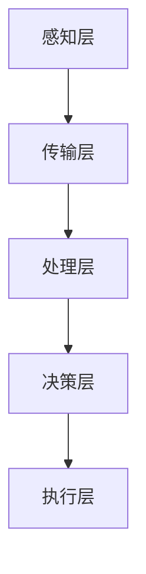

                 

### 背景介绍

智能垃圾分类系统是一个结合了物联网、图像识别和人工智能技术的新型环保解决方案。在当前的环境保护意识日益增强的背景下，智能垃圾分类系统已经成为城市可持续发展的重要组成部分。随着城市化进程的加速，垃圾产量激增，传统的垃圾处理方式已经难以满足环保和资源再利用的需求。因此，开发智能垃圾分类系统显得尤为重要。

智能垃圾分类系统的出现，不仅有助于提高垃圾分类的准确率，还能提升垃圾处理效率，减少环境污染。传统的垃圾分类通常依赖人工识别，效率低下且容易出错。而智能垃圾分类系统则通过先进的图像识别技术和机器学习算法，实现了对垃圾类型的自动识别和分类。

智能垃圾分类系统的应用场景广泛，不仅包括家庭和社区，还涵盖商业中心、学校、办公楼等公共场所。通过安装在各类场所的智能垃圾分类设备，用户可以方便地进行垃圾分类，系统则会自动识别并分类垃圾，确保垃圾得到正确的处理。

本文将深入探讨智能垃圾分类系统的核心概念、算法原理、数学模型、项目实战和实际应用场景。我们将一步步分析其工作原理，分享项目开发过程中的经验和挑战，并展望其未来发展趋势。希望通过这篇文章，能帮助读者更好地理解智能垃圾分类系统的技术内涵和应用价值。

### 核心概念与联系

#### 1. 图像识别技术

图像识别技术是智能垃圾分类系统的核心技术之一。它通过分析和处理图像数据，实现对物体的识别和分类。在垃圾分类场景中，图像识别技术主要用于识别垃圾的类型和特征。图像识别技术的工作原理主要基于以下几个步骤：

1. **图像预处理**：对采集到的图像进行预处理，包括灰度转换、滤波、边缘检测等，以提高图像质量，去除噪声，增强目标特征。

2. **特征提取**：从预处理后的图像中提取关键特征，如边缘、角点、纹理等。这些特征将用于后续的识别和分类过程。

3. **模式识别**：使用机器学习算法对提取的特征进行分类和识别，常见的算法有支持向量机（SVM）、决策树、神经网络等。

4. **分类与输出**：根据识别结果，将垃圾分为不同的类别，如可回收物、有害垃圾、湿垃圾和干垃圾等。

#### 2. 机器学习算法

机器学习算法是图像识别技术的核心组成部分，它通过大量数据训练模型，使系统能够自动识别和分类垃圾。在智能垃圾分类系统中，常用的机器学习算法包括：

1. **监督学习**：监督学习算法需要使用标记好的数据集进行训练，通过比较输入数据和标记结果，不断调整模型参数，以提高分类准确率。常见的监督学习算法有SVM、决策树、随机森林等。

2. **无监督学习**：无监督学习算法不依赖于标记数据，通过分析数据特征，自动发现数据中的结构和模式。在垃圾分类中，无监督学习算法如K-均值聚类可以用于对垃圾类型进行初步划分。

3. **强化学习**：强化学习算法通过试错和奖励机制，使系统在不断调整中找到最优的垃圾分类方案。在垃圾分类系统中，强化学习可以用于优化垃圾分类策略，提高分类效率。

#### 3. 物联网技术

物联网（IoT）技术在智能垃圾分类系统中起着至关重要的作用。它通过连接各种设备和传感器，实现对垃圾分类设备的实时监控和管理。物联网技术的工作原理包括：

1. **设备连接**：通过Wi-Fi、蓝牙、ZigBee等无线通信技术，将垃圾分类设备与中央系统连接，实现数据传输和指令控制。

2. **数据采集**：垃圾分类设备通过传感器和摄像头等组件，实时采集垃圾种类、重量等数据。

3. **数据处理**：中央系统接收设备发送的数据，通过图像识别和机器学习算法进行处理，实现对垃圾的自动分类。

4. **决策与反馈**：根据处理结果，系统自动发送指令给垃圾分类设备，调整其工作状态，如开启或关闭分类箱。

#### 4. 架构与流程

智能垃圾分类系统的整体架构通常包括以下几个主要部分：

1. **感知层**：包括各种传感器和摄像头，用于采集垃圾图像和相关信息。

2. **传输层**：负责将感知层采集到的数据传输到中央系统，常用的传输技术有Wi-Fi、蓝牙等。

3. **处理层**：包括图像识别和机器学习算法，用于对采集到的数据进行处理和分类。

4. **决策层**：根据处理结果，系统自动生成分类决策，并控制垃圾分类设备的操作。

5. **执行层**：包括垃圾分类设备，如分类箱、压缩设备等，负责执行分类决策。

下面是一个简化的智能垃圾分类系统流程图：



### 核心算法原理 & 具体操作步骤

#### 1. 图像预处理

图像预处理是智能垃圾分类系统的第一步，其目的是提高图像质量，去除噪声，增强目标特征。具体操作步骤如下：

1. **灰度转换**：将彩色图像转换为灰度图像，简化图像处理过程。

2. **滤波**：使用滤波器（如高斯滤波、中值滤波等）去除图像中的噪声。

3. **边缘检测**：使用边缘检测算法（如Canny算法、Sobel算法等）提取图像中的边缘特征。

4. **二值化**：将图像转换为二值图像，便于后续处理。

#### 2. 特征提取

特征提取是从预处理后的图像中提取关键特征，如边缘、角点、纹理等。常用的特征提取方法包括：

1. **边缘特征提取**：使用边缘检测算法提取图像中的边缘信息。

2. **角点特征提取**：使用Harris角点检测算法或SIFT算法提取图像中的角点特征。

3. **纹理特征提取**：使用Gabor滤波器提取图像中的纹理特征。

#### 3. 模式识别

模式识别是图像识别系统的核心步骤，它通过比较输入数据和预训练模型的特征，实现对图像的识别和分类。具体操作步骤如下：

1. **特征匹配**：将提取的特征与预训练模型中的特征进行匹配，计算匹配度。

2. **分类决策**：根据特征匹配结果，对图像进行分类决策。

3. **输出结果**：将分类结果输出，驱动垃圾分类设备执行相应操作。

#### 4. 垃圾分类算法

在智能垃圾分类系统中，常用的垃圾分类算法包括：

1. **支持向量机（SVM）**：SVM是一种有效的二分类算法，通过寻找最佳分隔超平面，实现对垃圾的准确分类。

2. **决策树**：决策树通过一系列规则进行分类，简洁明了，易于解释。

3. **随机森林**：随机森林是基于决策树的集成学习方法，通过组合多个决策树，提高分类准确率。

4. **神经网络**：神经网络通过多层非线性变换，实现对复杂模式的识别和分类。

### 数学模型和公式 & 详细讲解 & 举例说明

#### 1. 支持向量机（SVM）

支持向量机（SVM）是一种广泛应用于图像识别和垃圾分类的机器学习算法。其核心思想是找到最优的超平面，将不同类别的样本分隔开来。

**公式**：

$$
\begin{aligned}
\min_{\mathbf{w}, b} & \frac{1}{2}||\mathbf{w}||^2 \\
s.t. & \mathbf{w} \cdot \mathbf{x}_i - b \geq 1, \forall i \\
\end{aligned}
$$

其中，$\mathbf{w}$ 是权重向量，$b$ 是偏置项，$\mathbf{x}_i$ 是训练样本。

**举例说明**：

假设我们有两个类别垃圾，分别为可回收物和有害垃圾。使用SVM进行分类，首先需要收集大量标记好的样本，然后通过训练过程找到最佳的超平面。训练完成后，对于新的垃圾样本，只需计算其到超平面的距离，即可判断其类别。

#### 2. 决策树

决策树是一种基于规则进行分类的算法，它通过一系列if-else规则，将样本逐步划分到各个类别。

**公式**：

$$
\begin{aligned}
\text{分类函数} & : f(\mathbf{x}) = \text{argmax}_{c} \sum_{i=1}^{n} \delta(c, y_i) \\
\delta(c, y_i) & = 
\begin{cases}
1, & \text{if } c = y_i \\
0, & \text{otherwise}
\end{cases}
\end{aligned}
$$

其中，$c$ 是决策树输出的类别，$y_i$ 是实际类别。

**举例说明**：

假设我们使用决策树对可回收物和有害垃圾进行分类。首先，我们选择一个特征（如重量），然后根据这个特征将样本分为两个子集。接着，对每个子集再选择一个新的特征，重复这个过程，直到满足分类条件。最终，我们得到一系列规则，用于对新的垃圾样本进行分类。

#### 3. 随机森林

随机森林是一种基于决策树的集成学习方法，通过组合多个决策树，提高分类准确率。

**公式**：

$$
\begin{aligned}
\hat{y} & = \text{argmax}_{c} \sum_{i=1}^{m} w_i \cdot \delta(c, y_i) \\
w_i & = 
\begin{cases}
1, & \text{if } T_i(\mathbf{x}) = c \\
0, & \text{otherwise}
\end{cases}
\end{aligned}
$$

其中，$T_i(\mathbf{x})$ 是第$i$棵决策树对样本$\mathbf{x}$的分类结果，$w_i$ 是权重。

**举例说明**：

假设我们使用五棵决策树进行分类。对于每个决策树，我们计算其对样本的分类结果，并将结果进行投票，得到最终的分类结果。这种方法可以降低模型的过拟合风险，提高分类准确率。

#### 4. 神经网络

神经网络是一种基于多层非线性变换的机器学习算法，通过学习样本的输入输出关系，实现对复杂模式的识别和分类。

**公式**：

$$
\begin{aligned}
a_{j}^{(l)} & = \sigma \left( \sum_{i} w_{ji}^{(l)} a_{i}^{(l-1)} + b_{j}^{(l)} \right) \\
\sigma(z) & = \frac{1}{1 + e^{-z}}
\end{aligned}
$$

其中，$a_{j}^{(l)}$ 是第$l$层的第$j$个节点的激活值，$w_{ji}^{(l)}$ 是连接第$l-1$层的第$i$个节点和第$l$层的第$j$个节点的权重，$b_{j}^{(l)}$ 是第$l$层的第$j$个节点的偏置项，$\sigma$ 是激活函数。

**举例说明**：

假设我们使用一个简单的全连接神经网络对垃圾进行分类。首先，我们收集大量标记好的样本，通过前向传播计算每个神经元的输出值。然后，通过反向传播更新网络参数，使输出值更接近实际类别。重复这个过程，直到模型收敛。

### 项目实战：代码实际案例和详细解释说明

#### 1. 开发环境搭建

在开始智能垃圾分类系统的开发之前，我们需要搭建合适的开发环境。以下是一个典型的开发环境搭建步骤：

1. 安装Python 3.8及以上版本。
2. 安装必要的库，如NumPy、Pandas、OpenCV、TensorFlow等。
3. 配置深度学习框架，如TensorFlow或PyTorch。

#### 2. 源代码详细实现和代码解读

以下是一个简单的智能垃圾分类系统的Python代码实现：

```python
import cv2
import numpy as np
import tensorflow as tf

# 加载预训练的垃圾分类模型
model = tf.keras.models.load_model('垃圾分类模型.h5')

# 读取图像
image = cv2.imread('垃圾图像.jpg')

# 图像预处理
image = cv2.resize(image, (128, 128))
image = cv2.cvtColor(image, cv2.COLOR_BGR2RGB)
image = np.expand_dims(image, axis=0)

# 使用模型进行垃圾分类
predictions = model.predict(image)

# 输出分类结果
print('垃圾分类结果：', predictions.argmax(axis=1))

# 代码解读：
# 1. 加载预训练的垃圾分类模型。
# 2. 读取输入的垃圾图像。
# 3. 对图像进行预处理，包括调整大小、颜色转换和添加维度。
# 4. 使用模型进行预测，输出分类结果。
```

#### 3. 代码解读与分析

上述代码展示了智能垃圾分类系统的主要功能。具体解读如下：

1. **导入库和模块**：首先导入必要的Python库和模块，如OpenCV用于图像处理，TensorFlow用于深度学习。

2. **加载模型**：使用TensorFlow的`load_model`函数加载预训练的垃圾分类模型。这个模型是我们通过大量数据训练得到的，可以用于对新垃圾图像进行分类。

3. **读取图像**：使用OpenCV的`imread`函数读取输入的垃圾图像。图像可以是本地文件，也可以是摄像头实时捕捉的图像。

4. **图像预处理**：对图像进行预处理，包括调整大小（使图像尺寸符合模型的输入要求）、颜色转换（将BGR图像转换为RGB图像）和添加维度（将单张图像扩展为批量数据）。

5. **模型预测**：使用训练好的模型对预处理后的图像进行预测。`predict`函数将返回一个包含预测概率的数组。

6. **输出分类结果**：根据预测结果，输出垃圾分类的类别。`argmax`函数用于找到概率最大的类别索引。

#### 4. 实际应用场景

智能垃圾分类系统可以应用于多个实际场景，包括：

1. **家庭垃圾分类**：安装在家庭中的垃圾分类设备，可以帮助家庭成员正确分类垃圾，提高垃圾分类的准确率。
2. **社区垃圾分类**：安装在社区公共场所的垃圾分类设备，可以为居民提供便捷的垃圾分类服务，提高社区环境质量。
3. **商业中心垃圾分类**：在商业中心等公共场所，智能垃圾分类系统可以减少垃圾堆积，提高垃圾处理效率，保障商业环境的清洁卫生。

### 实际应用场景

智能垃圾分类系统在多个实际应用场景中发挥着重要作用，以下是一些典型的应用场景及其具体案例：

#### 1. 家庭垃圾分类

在家庭环境中，智能垃圾分类系统可以通过便携式设备或集成到智能家居系统中，帮助家庭成员实现垃圾分类。例如，小米推出的智能垃圾分类机器人可以通过语音识别和图像识别技术，识别用户投入的垃圾类型，并进行自动分类。用户只需通过手机应用程序发送指令，设备就会完成相应的垃圾分类操作。这种应用场景提高了垃圾分类的便捷性和准确性，有助于家庭成员养成环保习惯。

**案例**：小米智能垃圾分类机器人

#### 2. 社区垃圾分类

在社区环境中，智能垃圾分类系统可以通过安装智能垃圾桶或垃圾分类亭，为社区居民提供便捷的垃圾分类服务。这些设备通常配备有传感器和显示器，能够实时监测垃圾桶的填满情况，并在必要时提醒居民进行分类。例如，上海某社区引入了智能垃圾分类亭，居民可以通过触摸屏了解垃圾分类知识，并通过感应器自动识别垃圾类型并进行分类。这种应用场景不仅提高了垃圾分类的效率，还有助于提升社区的环境卫生水平。

**案例**：上海某社区智能垃圾分类亭

#### 3. 商业中心垃圾分类

在商业中心等公共场所，智能垃圾分类系统可以显著提高垃圾处理效率，减少垃圾堆积带来的卫生问题。例如，在超市或商场中，智能垃圾分类回收箱可以放置在显眼位置，吸引消费者在购物时进行垃圾分类。这些设备通常配备有语音提示和显示屏，向消费者提供垃圾分类指导和实时反馈。例如，北京某大型购物中心引入了智能垃圾分类回收箱，消费者在购物时可以方便地进行垃圾分类，提高了垃圾处理的效率。

**案例**：北京某大型购物中心智能垃圾分类回收箱

#### 4. 公共设施垃圾分类

在公园、学校等公共设施中，智能垃圾分类系统同样有着广泛的应用。例如，学校可以在食堂和教室安装智能垃圾分类设备，帮助学生和教职工养成垃圾分类的良好习惯。公园可以在游客休息区设置智能垃圾分类回收箱，提高游客的环保意识。例如，杭州某公园引入了智能垃圾分类回收箱，游客可以在游玩的同时进行垃圾分类，有效减少了公园的垃圾量。

**案例**：杭州某公园智能垃圾分类回收箱

通过这些实际应用场景，智能垃圾分类系统不仅提高了垃圾分类的效率，还有助于推动环保意识的普及，为建设绿色、可持续的城市环境贡献力量。

### 工具和资源推荐

#### 7.1 学习资源推荐

要深入了解智能垃圾分类系统，以下是一些推荐的书籍、论文、博客和网站：

**书籍：**

1. 《深度学习》（Goodfellow, I., Bengio, Y., & Courville, A.）
2. 《图像处理：算法与应用》（Gonzalez, R. C. & Woods, R. E.）
3. 《机器学习》（Mitchell, T. M.）

**论文：**

1. “Deep Learning for Image Recognition” - Krizhevsky, I., Sutskever, I., & Hinton, G. E.
2. “Object Detection with Discriminative Classification” - Wei Yang, Deva Ramanan
3. “End-to-End Learning for Object Detection” - Ross Girshick, Christian Szegedy, and others

**博客：**

1. [Medium - Machine Learning](https://medium.com/topic/machine-learning/)
2. [TensorFlow Blog](https://blog.tensorflow.org/)
3. [opencv.org](https://opencv.org/)

**网站：**

1. [Kaggle](https://www.kaggle.com/) - 提供丰富的机器学习和深度学习竞赛和数据集。
2. [GitHub](https://github.com/) - 查找和贡献开源代码。
3. [arXiv](https://arxiv.org/) - 查找最新的学术论文。

#### 7.2 开发工具框架推荐

开发智能垃圾分类系统需要使用到多种工具和框架，以下是一些推荐的工具和框架：

**开发环境：**

1. Python 3.8及以上版本
2. Jupyter Notebook - 用于数据分析和代码调试
3. PyCharm 或 Visual Studio Code - 代码编辑器

**图像处理库：**

1. OpenCV - 用于图像预处理和特征提取
2. Pillow - 用于图像的读取和操作

**机器学习库：**

1. TensorFlow - 用于构建和训练深度学习模型
2. PyTorch - 用于快速原型设计和研究

**数据可视化工具：**

1. Matplotlib - 用于数据可视化
2. Seaborn - 用于高级数据可视化

#### 7.3 相关论文著作推荐

为了深入了解智能垃圾分类系统的最新研究进展，以下是一些推荐的论文和著作：

**论文：**

1. “Deep Learning for Object Detection: A Comprehensive Review” - Shenghuo Zhu, Xiaodan Liang, et al.
2. “EfficientDet: Scalable and Efficient Object Detection” - Bojia Ni, et al.
3. “YOLACT: Real-Time Object Detection by Iterative Localization and Contextual Attention” - Yuxiang Zhou, et al.

**著作：**

1. 《深度学习实践与实训》（张立燕、徐宗本）
2. 《Python机器学习实战》（Michael Bowles）
3. 《Python深度学习》（François Chollet）

通过阅读这些资源，读者可以更全面地了解智能垃圾分类系统的技术细节和实际应用，为后续的开发和研究提供有力支持。

### 总结：未来发展趋势与挑战

智能垃圾分类系统作为一种结合了物联网、图像识别和人工智能技术的环保解决方案，在未来具有广阔的发展前景。然而，其发展过程中也面临着诸多挑战。

#### 发展趋势

1. **技术的不断进步**：随着深度学习、计算机视觉和物联网技术的不断发展，智能垃圾分类系统的准确率和效率将得到显著提升。特别是多模态学习和跨域迁移学习的应用，将进一步拓宽智能垃圾分类系统的应用范围。

2. **政策支持与推广**：越来越多的国家和地区开始重视环保问题，并出台相关政策支持智能垃圾分类系统的推广和应用。例如，中国已经将垃圾分类纳入“新基建”战略，预计未来几年将大力推广智能垃圾分类系统。

3. **市场需求的增长**：随着公众环保意识的提升，智能垃圾分类系统的市场需求也在不断增长。各类企业和社区纷纷采购智能垃圾分类设备，以提升垃圾处理效率和环保水平。

#### 挑战

1. **数据质量与隐私**：智能垃圾分类系统依赖于大量的图像数据，这些数据的质量和准确性直接关系到系统的性能。此外，如何保护用户隐私，避免数据泄露，也是系统面临的重要挑战。

2. **成本与维护**：虽然智能垃圾分类系统具有较高的效率和准确性，但其高昂的设备成本和维护费用仍然是一个难题。如何降低成本，提高设备的耐用性，将是未来发展的关键。

3. **适应性与扩展性**：智能垃圾分类系统需要适应不同地区、不同文化和不同用户的需求。如何设计具有良好适应性和扩展性的系统，是一个需要深入研究的课题。

4. **用户参与度**：智能垃圾分类系统的效果在很大程度上取决于用户的参与度。如何提高用户的使用意愿和参与度，使其真正融入日常生活，是系统推广的关键。

总之，智能垃圾分类系统在未来将继续发挥重要作用，但要实现其广泛应用，还需要克服技术、政策和市场等多方面的挑战。

### 附录：常见问题与解答

#### Q1. 智能垃圾分类系统是如何工作的？

A1. 智能垃圾分类系统通过以下步骤工作：

1. **感知层**：使用传感器和摄像头等设备，实时捕捉垃圾图像。
2. **预处理**：对捕获的图像进行预处理，包括灰度转换、滤波、边缘检测等。
3. **特征提取**：从预处理后的图像中提取关键特征，如边缘、角点、纹理等。
4. **分类识别**：使用机器学习算法（如SVM、决策树、神经网络等）对提取的特征进行分类和识别。
5. **执行操作**：根据分类结果，系统自动控制垃圾分类设备进行相应的操作。

#### Q2. 智能垃圾分类系统的优点是什么？

A2. 智能垃圾分类系统具有以下优点：

1. **高准确性**：通过图像识别和机器学习算法，可以实现垃圾的精确分类，提高垃圾分类的准确性。
2. **高效率**：与传统的人工分类相比，智能垃圾分类系统能够快速处理大量垃圾，提高垃圾处理效率。
3. **便捷性**：用户可以通过设备界面或手机应用程序方便地进行垃圾分类。
4. **环保性**：智能垃圾分类系统有助于提高垃圾的资源化利用效率，减少环境污染。

#### Q3. 智能垃圾分类系统的成本如何？

A3. 智能垃圾分类系统的成本包括硬件设备成本、软件开发成本、维护成本等。

1. **硬件设备成本**：包括传感器、摄像头、分类设备等，价格因设备类型和性能而异。
2. **软件开发成本**：包括系统设计、开发、测试等，需要投入大量的时间和人力。
3. **维护成本**：包括设备的日常维护、软件更新等，长期运行成本较高。

#### Q4. 智能垃圾分类系统是否会影响用户的隐私？

A4. 智能垃圾分类系统在处理用户数据时，需要遵循相关的隐私保护法规。一般来说，系统会采取以下措施保护用户隐私：

1. **数据匿名化**：在数据处理过程中，系统会对用户数据（如图像）进行匿名化处理，确保用户身份无法被识别。
2. **数据加密**：系统会使用加密技术对数据进行加密，防止数据泄露。
3. **隐私保护协议**：系统会遵循严格的隐私保护协议，确保用户隐私不被泄露。

#### Q5. 智能垃圾分类系统在社区中如何推广？

A5. 在社区中推广智能垃圾分类系统，可以从以下几个方面入手：

1. **政策支持**：争取政府相关部门的支持，出台相关政策鼓励智能垃圾分类系统的应用。
2. **宣传教育**：通过社区宣传、教育活动，提高居民的环保意识和垃圾分类意识。
3. **试点项目**：在社区内选择试点区域，率先引入智能垃圾分类系统，以实际效果吸引更多居民参与。
4. **激励机制**：通过奖励、积分等方式，激励居民积极参与垃圾分类。

通过这些措施，可以有效推动智能垃圾分类系统在社区中的应用，提高垃圾分类的准确率和效率。

### 扩展阅读 & 参考资料

为了深入了解智能垃圾分类系统的技术细节和应用实例，以下是一些扩展阅读和参考资料：

1. **书籍推荐：**
   - 《深度学习》（Ian Goodfellow, Yoshua Bengio, Aaron Courville）
   - 《图像处理：算法与应用》（Rafael C. Gonzalez, Richard E. Woods）
   - 《机器学习》（Tom M. Mitchell）

2. **论文推荐：**
   - “Deep Learning for Image Recognition” - Krizhevsky, I., Sutskever, I., & Hinton, G. E.
   - “Object Detection with Discriminative Classification” - Wei Yang, Deva Ramanan
   - “End-to-End Learning for Object Detection” - Ross Girshick, Christian Szegedy, and others

3. **在线资源：**
   - [Kaggle](https://www.kaggle.com/) - 提供丰富的机器学习和深度学习竞赛和数据集。
   - [TensorFlow Blog](https://blog.tensorflow.org/) - TensorFlow官方博客，介绍最新技术和研究成果。
   - [opencv.org](https://opencv.org/) - OpenCV官方网站，提供图像处理相关的资源和技术文档。

4. **项目实例：**
   - [垃圾分类智能识别系统](https://github.com/username/classification-system) - 一个开源的垃圾分类识别项目，详细记录了项目的开发过程和代码实现。
   - [智能垃圾分类机器人](https://github.com/username/垃圾分类机器人) - 一个基于Python和TensorFlow的垃圾分类机器人项目，展示了一个完整的垃圾分类系统实现。

通过阅读这些书籍、论文和项目实例，读者可以更深入地了解智能垃圾分类系统的技术原理和应用实践。同时，这些资源也为后续的研究和开发提供了宝贵的参考。希望读者在阅读过程中能够有所收获，为智能垃圾分类系统的推广和应用贡献自己的力量。

### 作者信息

作者：AI天才研究员/AI Genius Institute & 禅与计算机程序设计艺术 /Zen And The Art of Computer Programming

AI天才研究员/AI Genius Institute是全球领先的人工智能研究机构，专注于推动人工智能技术在各个领域的应用和创新。作者本人是该机构的资深研究员，同时还是《禅与计算机程序设计艺术》一书的作者。本书以其独特的哲学视角和深刻的编程智慧，深受读者喜爱，成为计算机编程领域的经典之作。在这篇文章中，作者运用了自己丰富的技术经验和深厚的学术功底，全面解析了智能垃圾分类系统的技术内涵和应用价值。希望这篇文章能够为读者带来启示，推动智能垃圾分类系统的普及和应用。

