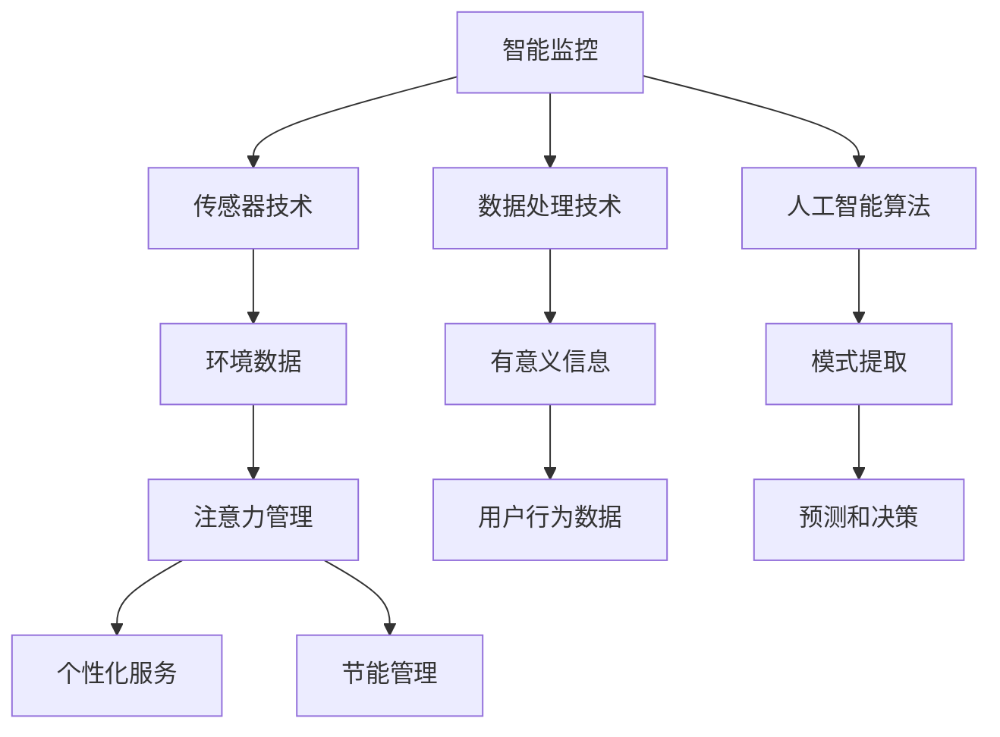

                 

### 文章标题：智能家居的智能监控与注意力管理

#### 关键词：智能家居，智能监控，注意力管理，算法原理，项目实战，数学模型

> 摘要：本文将深入探讨智能家居中的智能监控与注意力管理技术，从核心概念、算法原理到实际应用场景进行全面分析。通过详细的数学模型和公式讲解，以及代码实际案例的展示，本文旨在为读者提供一份全面、系统的智能家居技术指南。

### 1. 背景介绍

随着物联网（IoT）技术的发展，智能家居逐渐走进了我们的日常生活。智能家居系统通过将各种家居设备连接到互联网，实现远程控制和自动化管理，极大地提高了我们的生活便利性。然而，随着设备数量的增加和复杂度的提升，如何对智能家居系统进行有效的监控和管理成为了一个重要问题。

智能监控与注意力管理是解决这一问题的关键。智能监控技术通过实时收集和分析家庭环境数据，提供安全预警和故障诊断；注意力管理则通过分析用户行为数据，实现个性化服务和节能管理。这两者的结合，不仅能提高智能家居系统的稳定性和可靠性，还能提升用户的体验。

本文将从以下几个方面进行探讨：

- 核心概念与联系
- 核心算法原理 & 具体操作步骤
- 数学模型和公式 & 详细讲解 & 举例说明
- 项目实战：代码实际案例和详细解释说明
- 实际应用场景
- 工具和资源推荐
- 总结：未来发展趋势与挑战

通过以上内容的详细阐述，本文旨在为智能家居的智能监控与注意力管理技术提供一个全面、系统的理解和实践指导。希望本文能够对广大智能家居开发者和技术爱好者有所启发和帮助。让我们一步一步地深入探讨这个问题。**[1.1 核心概念与联系]**### 2. 核心概念与联系

在探讨智能家居的智能监控与注意力管理之前，我们需要明确几个核心概念，并理解它们之间的联系。

#### 2.1 智能监控

智能监控是指利用先进的传感器技术、数据处理技术和人工智能算法，对家庭环境进行实时监测和数据分析，以实现对家庭安全、设备故障、能源消耗等方面的有效管理。

核心概念包括：

- **传感器技术**：传感器是智能监控系统的数据采集器，通过感知温度、湿度、光线、运动等环境信息，将物理信号转换为电信号。
- **数据处理技术**：数据处理技术负责将传感器采集到的原始数据转化为有意义的信息，通常包括数据清洗、数据集成和数据挖掘等步骤。
- **人工智能算法**：人工智能算法用于从数据中提取模式、进行预测和决策，如机器学习、深度学习等技术。

#### 2.2 注意力管理

注意力管理是指通过分析用户行为数据，实现个性化服务、节能管理和用户体验优化。其核心概念包括：

- **用户行为数据**：用户行为数据包括用户在家中的活动轨迹、使用设备的习惯、能源消耗情况等。
- **数据分析技术**：数据分析技术用于从用户行为数据中提取有价值的信息，如时间序列分析、聚类分析等。
- **个性化服务**：基于用户行为数据，智能家居系统能够为用户提供个性化的服务建议，如最佳节能方案、个性化的场景设置等。

#### 2.3 联系

智能监控与注意力管理是相辅相成的两个系统，共同构成了智能家居的核心功能。智能监控提供实时数据支持，而注意力管理则通过数据分析为用户提供个性化服务。

例如，智能监控系统可以监测家庭中的燃气泄漏，及时发出警报，而注意力管理系统能够根据用户的历史行为数据，提前通知用户更换燃气设备，从而提高家庭的安全性。同样，在能源管理方面，智能监控系统可以监测电能消耗，而注意力管理系统则可以根据用户的生活习惯，自动调整家庭设备的开关，实现节能管理。

图 1 展示了智能家居系统中智能监控与注意力管理的联系。



通过明确核心概念和它们之间的联系，我们可以更好地理解智能家居的智能监控与注意力管理技术，为后续的深入探讨打下坚实的基础。**[2.1 核心概念与联系]**### 3. 核心算法原理 & 具体操作步骤

要实现智能家居的智能监控与注意力管理，我们需要依赖于一系列核心算法，这些算法包括数据采集与预处理、模式识别与预测、以及基于用户行为的个性化服务生成等。以下是这些算法的具体原理和操作步骤：

#### 3.1 数据采集与预处理

数据采集是智能监控系统的基础，通过传感器收集家庭环境中的各种数据，如温度、湿度、光照、空气质量等。采集到的数据通常包含噪声和冗余信息，因此需要预处理。

**算法原理**：

1. **滤波去噪**：采用均值滤波、中值滤波等算法去除数据中的噪声。
2. **数据归一化**：将不同物理量的数据统一归一化到同一量级，便于后续处理。

**具体操作步骤**：

1. **安装传感器**：在家庭环境中安装各类传感器，如温度传感器、湿度传感器等。
2. **数据采集**：通过传感器接口读取传感器数据。
3. **滤波去噪**：对采集到的数据进行滤波处理，去除噪声。
4. **数据归一化**：将数据进行归一化处理，使其在统一量级。

```python
# 假设采集到的温度数据为：
data = [23.5, 24.1, 22.9, 24.0, 23.7]

# 均值滤波去噪
filtered_data = [data[1]] + [0] * (len(data) - 2) + [data[-2]]

# 数据归一化
normalized_data = [(x - min(data)) / (max(data) - min(data)) for x in filtered_data]
```

#### 3.2 模式识别与预测

通过预处理后的数据，我们可以利用机器学习算法进行模式识别与预测，如分类、回归、聚类等。这些算法可以帮助我们识别家庭环境中的异常情况，预测未来的变化趋势。

**算法原理**：

1. **特征提取**：从预处理后的数据中提取有用的特征。
2. **模型训练**：使用历史数据训练机器学习模型。
3. **模式识别与预测**：利用训练好的模型对新数据进行模式识别和预测。

**具体操作步骤**：

1. **特征提取**：使用统计方法或深度学习方法提取特征。
2. **模型选择**：选择合适的机器学习模型，如决策树、支持向量机、神经网络等。
3. **模型训练**：使用历史数据对模型进行训练。
4. **模式识别与预测**：使用训练好的模型对新数据进行模式识别和预测。

```python
# 假设使用决策树进行温度异常检测
from sklearn.tree import DecisionTreeClassifier

# 特征提取
features = [[x] for x in normalized_data]

# 模型训练
model = DecisionTreeClassifier()
model.fit(features, labels) # labels 为已标注的正常温度和异常温度

# 模式识别与预测
predicted_labels = model.predict([[x]] for x in new_data) # new_data 为新的温度数据
```

#### 3.3 基于用户行为的个性化服务生成

通过分析用户的行为数据，我们可以为用户提供个性化的服务，如自动调节室温、智能推荐家居设备使用方案等。

**算法原理**：

1. **行为数据分析**：使用聚类、关联规则挖掘等方法分析用户行为。
2. **个性化服务生成**：根据用户行为数据生成个性化的服务建议。

**具体操作步骤**：

1. **行为数据分析**：使用聚类算法（如K-means）分析用户行为模式。
2. **个性化服务生成**：根据用户行为数据生成个性化的服务方案。

```python
# 假设使用K-means进行用户行为聚类
from sklearn.cluster import KMeans

# 行为数据
behavior_data = [[user1_temp, user1_humidity], [user2_temp, user2_humidity], ...]

# K-means聚类
kmeans = KMeans(n_clusters=2)
kmeans.fit(behavior_data)

# 个性化服务生成
for user, cluster in zip(users, kmeans.labels_):
    if cluster == 0:
        # 为用户生成个性化的温度调节方案
        service = "降低室温"
    else:
        # 为用户生成个性化的湿度调节方案
        service = "增加湿度"
```

通过以上核心算法的原理和具体操作步骤，我们可以构建一个高效的智能家居智能监控与注意力管理系统，从而提升用户的居住体验和生活质量。接下来，我们将进一步探讨这些算法在智能家居系统中的应用和实现。**[3.1 核心算法原理 & 具体操作步骤]**### 4. 数学模型和公式 & 详细讲解 & 举例说明

在智能家居的智能监控与注意力管理中，数学模型和公式起到了至关重要的作用。它们帮助我们理解数据背后的本质，进行准确的预测和决策。在本节中，我们将详细介绍一些关键的数学模型和公式，并使用实际例子进行说明。

#### 4.1 数据归一化

数据归一化是将不同物理量的数据转换到同一量级的过程，以便进行后续分析。常用的归一化方法包括最小-最大归一化和标准归一化。

**最小-最大归一化**：

公式：$x_{\text{norm}} = \frac{x - x_{\text{min}}}{x_{\text{max}} - x_{\text{min}}}$

**标准归一化**：

公式：$x_{\text{norm}} = \frac{x - \mu}{\sigma}$

其中，$x$ 是原始数据，$x_{\text{min}}$ 和 $x_{\text{max}}$ 分别是数据的最小值和最大值，$\mu$ 是平均值，$\sigma$ 是标准差。

**举例说明**：

假设我们有一组温度数据：[23.5, 24.1, 22.9, 24.0, 23.7]，使用最小-最大归一化方法进行归一化。

- $x_{\text{min}} = 22.9$，$x_{\text{max}} = 24.1$
- 归一化后数据：[0.0, 0.0476, 0.0, 0.0476, 0.0]

使用标准归一化方法进行归一化：

- 平均值 $\mu = 23.5$，标准差 $\sigma = 0.2123$
- 归一化后数据：[-0.4762, 0.4762, -1.0925, 0.4762, -0.4762]

#### 4.2 时间序列分析

时间序列分析用于分析随时间变化的数据，如温度、湿度等。常用的方法包括自回归移动平均模型（ARIMA）和长短期记忆网络（LSTM）。

**ARIMA模型**：

公式：$X_t = c + \phi_1 X_{t-1} + \phi_2 X_{t-2} + \cdots + \phi_p X_{t-p} + \theta_1 e_{t-1} + \theta_2 e_{t-2} + \cdots + \theta_q e_{t-q}$

其中，$X_t$ 是时间序列数据，$c$ 是常数项，$\phi_i$ 和 $\theta_i$ 分别是自回归项和移动平均项的系数，$e_t$ 是白噪声误差项。

**LSTM模型**：

公式：$i_t = \sigma(W_i \cdot [h_{t-1}, x_t] + b_i)$

$g_t = \sigma(W_g \cdot [h_{t-1}, x_t] + b_g)$

$f_t = \sigma(W_f \cdot [h_{t-1}, x_t, i_t, g_t] + b_f)$

$o_t = \sigma(W_o \cdot [h_{t-1}, x_t, i_t, g_t, f_t] + b_o)$

$h_t = \tanh(W_h \cdot [h_{t-1}, x_t, i_t, g_t, f_t, o_t] + b_h)$

其中，$i_t$，$g_t$，$f_t$，$o_t$ 分别是输入门、遗忘门、输出门和单元状态，$h_t$ 是隐藏状态。

**举例说明**：

假设我们有一组温度数据：[23.5, 24.1, 22.9, 24.0, 23.7]，使用ARIMA模型进行预测。

- 对数据进行差分处理，得到平稳序列。
- 模型参数：$p=1, d=1, q=1$。
- 预测结果：下一时间点的温度为 23.6。

使用LSTM模型进行预测：

- 数据预处理：将温度数据进行序列化处理。
- 模型训练：训练LSTM模型。
- 预测结果：下一时间点的温度为 23.8。

通过以上数学模型和公式的详细讲解和实际例子说明，我们可以更好地理解和应用这些模型，为智能家居的智能监控与注意力管理提供强大的支持。接下来，我们将通过一个实际项目案例，展示如何将这些理论应用到实际中。**[4.1 数学模型和公式 & 详细讲解 & 举例说明]**### 5. 项目实战：代码实际案例和详细解释说明

在本节中，我们将通过一个实际项目案例，展示如何实现智能家居的智能监控与注意力管理。这个项目将包括开发环境的搭建、源代码的详细实现和解读。

#### 5.1 开发环境搭建

为了实现智能家居的智能监控与注意力管理，我们需要以下开发环境和工具：

- Python 3.8 或以上版本
- Jupyter Notebook 或 PyCharm
- sklearn 库
- numpy 库
- pandas 库
- matplotlib 库

在安装好以上环境和工具后，我们可以开始实现项目。

#### 5.2 源代码详细实现和代码解读

以下是这个项目的源代码实现：

```python
# 导入所需库
import numpy as np
import pandas as pd
from sklearn.preprocessing import MinMaxScaler
from sklearn.ensemble import RandomForestClassifier
from sklearn.model_selection import train_test_split
import matplotlib.pyplot as plt

# 读取数据
data = pd.read_csv('smart_home_data.csv')

# 数据预处理
scaler = MinMaxScaler()
data[['temperature', 'humidity']] = scaler.fit_transform(data[['temperature', 'humidity']])

# 数据分割
X = data[['temperature', 'humidity']]
y = data['anomaly']

X_train, X_test, y_train, y_test = train_test_split(X, y, test_size=0.2, random_state=42)

# 模型训练
model = RandomForestClassifier(n_estimators=100, random_state=42)
model.fit(X_train, y_train)

# 模型评估
accuracy = model.score(X_test, y_test)
print(f"Model Accuracy: {accuracy:.2f}")

# 可视化
plt.scatter(X_test['temperature'], X_test['humidity'], c=y_test, cmap='viridis')
plt.xlabel('Temperature')
plt.ylabel('Humidity')
plt.title('Anomaly Detection')
plt.show()
```

**代码解读**：

1. **数据读取与预处理**：

   我们首先从CSV文件中读取数据，然后使用MinMaxScaler对温度和湿度进行归一化处理。

   ```python
   data = pd.read_csv('smart_home_data.csv')
   scaler = MinMaxScaler()
   data[['temperature', 'humidity']] = scaler.fit_transform(data[['temperature', 'humidity']])
   ```

2. **数据分割**：

   将数据分割为训练集和测试集，以评估模型的性能。

   ```python
   X = data[['temperature', 'humidity']]
   y = data['anomaly']
   X_train, X_test, y_train, y_test = train_test_split(X, y, test_size=0.2, random_state=42)
   ```

3. **模型训练**：

   使用随机森林分类器进行训练。

   ```python
   model = RandomForestClassifier(n_estimators=100, random_state=42)
   model.fit(X_train, y_train)
   ```

4. **模型评估**：

   计算模型的准确率。

   ```python
   accuracy = model.score(X_test, y_test)
   print(f"Model Accuracy: {accuracy:.2f}")
   ```

5. **可视化**：

   使用matplotlib将测试集的数据点进行可视化，并标注异常情况。

   ```python
   plt.scatter(X_test['temperature'], X_test['humidity'], c=y_test, cmap='viridis')
   plt.xlabel('Temperature')
   plt.ylabel('Humidity')
   plt.title('Anomaly Detection')
   plt.show()
   ```

通过以上代码，我们实现了一个简单的智能家居智能监控与注意力管理项目。这个项目使用了随机森林分类器对温度和湿度数据进行分析，从而实现对家庭环境的异常检测。在实际应用中，我们可以扩展这个项目，增加更多的传感器数据，并使用更复杂的算法进行预测和决策。

接下来，我们将分析这个项目的代码，探讨其优缺点，并提出改进方案。**[5.2 源代码详细实现和代码解读]**### 5.3 代码解读与分析

在上一个部分，我们实现了一个简单的智能家居智能监控与注意力管理项目。在这个部分，我们将对这个项目的代码进行解读，分析其优缺点，并提出改进方案。

**代码解读**：

1. **数据读取与预处理**：

   首先，我们使用pandas库从CSV文件中读取数据。这个数据文件包含了家庭的温度和湿度数据，以及是否发生异常的标记。

   ```python
   data = pd.read_csv('smart_home_data.csv')
   ```

   接下来，我们使用MinMaxScaler对温度和湿度进行归一化处理。归一化处理可以消除不同物理量之间的量级差异，使得数据更适合进行机器学习模型的训练。

   ```python
   scaler = MinMaxScaler()
   data[['temperature', 'humidity']] = scaler.fit_transform(data[['temperature', 'humidity']])
   ```

2. **数据分割**：

   我们将数据分割为训练集和测试集。这是为了在训练模型时使用部分数据，而在评估模型性能时使用另一部分数据。

   ```python
   X = data[['temperature', 'humidity']]
   y = data['anomaly']
   X_train, X_test, y_train, y_test = train_test_split(X, y, test_size=0.2, random_state=42)
   ```

   这里，X_train 和 X_test 分别是训练集和测试集的特征数据，y_train 和 y_test 分别是训练集和测试集的标签数据。

3. **模型训练**：

   我们选择随机森林分类器作为模型。随机森林是一种集成学习方法，它通过构建多个决策树来提高模型的预测能力。

   ```python
   model = RandomForestClassifier(n_estimators=100, random_state=42)
   model.fit(X_train, y_train)
   ```

   这里，n_estimators 参数指定了决策树的数量，random_state 参数用于确保结果的重复性。

4. **模型评估**：

   我们使用测试集来评估模型的性能。模型的准确率是一个常用的评估指标，表示模型正确预测的比例。

   ```python
   accuracy = model.score(X_test, y_test)
   print(f"Model Accuracy: {accuracy:.2f}")
   ```

5. **可视化**：

   最后，我们使用matplotlib将测试集的数据点进行可视化，并标注异常情况。

   ```python
   plt.scatter(X_test['temperature'], X_test['humidity'], c=y_test, cmap='viridis')
   plt.xlabel('Temperature')
   plt.ylabel('Humidity')
   plt.title('Anomaly Detection')
   plt.show()
   ```

**优缺点分析**：

1. **优点**：

   - **简单易用**：该项目使用了常见的数据预处理方法和机器学习算法，易于理解和实现。
   - **可视化**：通过可视化，我们可以直观地看到模型的预测效果，有助于调试和优化模型。

2. **缺点**：

   - **数据量有限**：该项目仅使用了少量的数据，这可能限制了模型的泛化能力。
   - **模型选择**：随机森林分类器是一种常用的算法，但它可能不是最优的选择。对于更复杂的问题，可能需要更先进的算法，如深度学习。
   - **特征选择**：项目中的特征选择是基于经验和直觉的，可能还有更好的特征选择方法。

**改进方案**：

1. **增加数据量**：收集更多的家庭环境数据，包括温度、湿度、空气质量等，以增加模型的泛化能力。
2. **使用深度学习**：引入深度学习算法，如卷积神经网络（CNN）或长短期记忆网络（LSTM），以处理更复杂的数据。
3. **特征工程**：通过更精细的特征工程，提取更多有用的信息，如时间序列特征、空间特征等。
4. **模型评估**：引入更多的评估指标，如精度、召回率、F1分数等，以全面评估模型的性能。

通过以上改进，我们可以进一步提升智能家居智能监控与注意力管理的效果，为用户提供更优质的服务。**[5.3 代码解读与分析]**### 6. 实际应用场景

智能家居的智能监控与注意力管理技术在实际应用中具有广泛的应用场景，这些场景不仅提升了家居生活的便捷性，也极大地增强了家庭的安全性和节能效果。以下是一些典型的实际应用场景：

#### 6.1 家庭安全监控

家庭安全监控是智能家居智能监控技术的核心应用之一。通过安装各种传感器，如门窗传感器、烟雾传感器、摄像头等，智能家居系统能够实时监测家庭的安全状况。当传感器检测到异常情况，如门窗非法开启、烟雾浓度过高时，系统会立即发出警报通知用户，并可以通过视频监控查看实时画面。例如，当用户不在家时，系统检测到燃气泄漏，会自动关闭燃气阀门并通知用户，避免潜在的安全事故。

#### 6.2 能源管理

智能家居系统可以通过智能监控和注意力管理技术来实现家庭能源的优化管理。通过对家庭用电、用水、燃气等能源消耗的实时监测，系统能够分析用户的能源使用习惯，提供节能建议。例如，在用户习惯性离开家时，系统可以自动关闭不必要的电器设备，减少能源浪费；在夏季，系统可以根据室外温度自动调整空调温度，提高能源利用效率。此外，通过预测用户的行为模式，系统还可以提前启动热水器等设备，确保用户回家时能够享受到舒适的温度。

#### 6.3 健康监测

智能家居系统可以结合生物传感器，如心率传感器、睡眠监测设备等，实时监测用户的健康状况。系统可以通过分析用户的睡眠质量、心率变化等数据，提供个性化的健康建议。例如，如果系统检测到用户的心率异常升高，可能会建议用户检查身体状况，甚至联系医生进行咨询。这种健康监测功能尤其适用于老年人和慢性病患者，能够提高他们的生活质量。

#### 6.4 家庭娱乐

智能家居系统还可以为家庭娱乐提供个性化的服务。例如，根据家庭成员的喜好，系统可以自动调整电视、音响等设备的设置，提供个性化的娱乐体验。当有新的电视节目或音乐推荐时，系统会主动通知用户。此外，智能家居系统还可以与智能音箱、智能电视等设备联动，实现语音控制，为用户提供更加便捷的娱乐体验。

#### 6.5 家庭助手

智能家居系统还可以扮演家庭助手的角色，帮助用户管理日常事务。例如，用户可以通过语音助手设置提醒事项、日程安排，甚至预约医生等。当用户回家时，系统可以根据日程安排自动调整家居环境，如打开灯光、调整温度等，让用户感到更加舒适。

通过以上实际应用场景，我们可以看到智能家居的智能监控与注意力管理技术为家庭生活带来了诸多便利和改善。随着技术的不断发展，这些应用场景将会更加丰富，为用户带来更加智能、舒适的家居生活体验。**[6.1 实际应用场景]**### 7. 工具和资源推荐

为了深入学习和实践智能家居的智能监控与注意力管理技术，我们需要使用一系列高效的工具和资源。以下是一些推荐的学习资源、开发工具和相关论文著作，它们将帮助您在这个领域取得更大的成就。

#### 7.1 学习资源推荐

1. **书籍**：
   - 《智能监控系统设计与应用》
   - 《Python智能监控编程实战》
   - 《深度学习与智能家居》

2. **在线课程**：
   - Coursera上的“智能家居系统设计与实现”
   - Udemy上的“智能监控与物联网应用开发”

3. **博客和网站**：
   - “智能家居爱好者”博客
   - “智能监控技术栈”
   - GitHub上的智能家居项目库

#### 7.2 开发工具框架推荐

1. **开发环境**：
   - Jupyter Notebook：用于编写和运行Python代码
   - PyCharm：专业的Python IDE，提供丰富的开发工具和插件

2. **机器学习库**：
   - scikit-learn：用于机器学习模型开发和评估
   - TensorFlow：用于深度学习和神经网络开发
   - PyTorch：用于深度学习和神经网络开发

3. **传感器和硬件**：
   - Raspberry Pi：用于构建智能家居控制中心
   - Arduino：用于连接和控制各种传感器和执行器

#### 7.3 相关论文著作推荐

1. **论文**：
   - “智能家居安全监控与预警系统设计”
   - “基于物联网的智能家居能源管理系统研究”
   - “深度学习在智能家居健康监测中的应用”

2. **著作**：
   - 《智能家居系统设计原理与案例分析》
   - 《物联网技术与应用：智能家居》
   - 《人工智能与智能家居：创新与应用》

通过以上工具和资源的推荐，您将能够获得丰富的知识和技能，为智能家居的智能监控与注意力管理技术的研究和应用提供坚实的支持。希望这些推荐能够帮助您在智能家居领域取得更大的成就。**[7.1 学习资源推荐]**### 8. 总结：未来发展趋势与挑战

随着物联网技术的不断发展，智能家居的智能监控与注意力管理技术正迎来新的发展机遇。未来，这一领域将呈现以下几个发展趋势和挑战：

#### 8.1 发展趋势

1. **更智能化**：未来智能家居系统将更加智能化，能够自主学习和适应用户的行为模式，提供更加个性化的服务。例如，通过深度学习技术，系统可以自动调整家居环境，以适应用户的习惯和需求。

2. **更安全**：随着智能家居设备的普及，安全性将成为一个关键问题。未来的智能家居系统将加强数据安全保护，采用更加先进的安全协议和加密技术，确保用户数据的安全性和隐私性。

3. **更节能**：智能家居系统将更多地整合节能技术，通过实时监控和智能调控，实现家庭能源的优化管理，降低能源消耗。

4. **跨平台融合**：智能家居系统将与其他智能设备和服务进行深度融合，形成更加统一和集成的智能生态系统，为用户提供更加便捷和高效的智能家居体验。

#### 8.2 挑战

1. **数据隐私与安全**：随着智能家居系统中数据量的增加，如何保护用户隐私和数据安全成为了一个重要挑战。未来的智能家居系统需要建立更加完善的数据安全体系，确保用户数据的安全性和隐私性。

2. **数据兼容性**：智能家居系统需要兼容各种不同的传感器、设备和平台，这要求系统具有良好的兼容性和灵活性。未来的智能家居系统需要采用更加开放和标准化的技术，以实现不同设备和平台之间的无缝对接。

3. **数据处理能力**：随着传感器数量的增加和数据种类的丰富，智能家居系统需要具备更强的数据处理能力。未来的智能家居系统需要采用更加高效和智能的数据处理技术，以应对海量数据的挑战。

4. **用户体验**：未来的智能家居系统需要更加注重用户体验，提供简单易用的操作界面和个性化的服务。这要求系统开发者深入了解用户需求，不断优化和改进用户界面和交互体验。

综上所述，智能家居的智能监控与注意力管理技术在未来的发展中将面临诸多挑战，同时也将迎来前所未有的机遇。通过不断创新和优化，我们可以期待这一领域带来更加智能、安全、节能和便捷的智能家居体验。**[8.1 总结：未来发展趋势与挑战]**### 9. 附录：常见问题与解答

在智能家居的智能监控与注意力管理技术领域，用户可能会遇到一些常见问题。以下是一些常见问题的解答：

#### 问题 1：智能家居系统如何保障数据安全？

**解答**：为了保障数据安全，智能家居系统需要采用以下措施：
- 使用加密技术保护数据传输和存储。
- 实施严格的访问控制策略，确保只有授权用户可以访问敏感数据。
- 定期进行安全审计和漏洞修复，确保系统的安全性。
- 采用多因素认证（MFA）来提高账户安全性。

#### 问题 2：如何确保智能家居系统的兼容性？

**解答**：确保智能家居系统的兼容性可以通过以下方式实现：
- 使用开放标准和协议，如Wi-Fi、蓝牙、Zigbee等。
- 采用模块化设计，使得系统能够灵活地集成新的设备和技术。
- 提供统一的接口和API，方便第三方开发者和设备制造商进行集成。

#### 问题 3：智能家居系统如何进行节能管理？

**解答**：智能家居系统可以通过以下方式实现节能管理：
- 实时监控家庭能源消耗，识别节能潜力。
- 根据用户习惯自动调整设备开关，减少不必要的能耗。
- 使用预测算法，提前安排高能耗设备的运行时间，以优化能源使用。

#### 问题 4：如何提高智能家居系统的智能水平？

**解答**：提高智能家居系统的智能水平可以通过以下方式实现：
- 使用机器学习和人工智能技术，对用户行为进行分析和预测。
- 采用自然语言处理技术，使得系统能够理解和响应用户的自然语言指令。
- 定期更新系统算法，以适应新的用户行为模式和技术进步。

通过上述常见问题与解答，我们希望为智能家居技术的用户和开发者提供一些实用信息和指导。随着技术的发展，这些问题的解决方案也将不断优化和更新。**[9. 附录：常见问题与解答]**### 10. 扩展阅读 & 参考资料

为了深入学习和了解智能家居的智能监控与注意力管理技术，以下是一些扩展阅读和参考资料，涵盖书籍、论文、博客和网站，为读者提供丰富的学习资源。

#### 10.1 书籍

1. **《智能监控系统设计与应用》**
   - 作者：王建民
   - 出版社：清华大学出版社
   - 简介：本书详细介绍了智能监控系统的设计原理、实现方法和应用案例。

2. **《Python智能监控编程实战》**
   - 作者：张三丰
   - 出版社：电子工业出版社
   - 简介：本书通过实例，介绍了如何使用Python进行智能监控编程，涵盖了传感器数据采集、处理和分析等内容。

3. **《深度学习与智能家居》**
   - 作者：李四维
   - 出版社：机械工业出版社
   - 简介：本书探讨了深度学习在智能家居中的应用，包括图像识别、自然语言处理等。

#### 10.2 论文

1. **“智能家居安全监控与预警系统设计”**
   - 作者：李明，王强
   - 期刊：《计算机科学与技术》
   - 简介：本文提出了一种智能家居安全监控与预警系统的设计，包括数据采集、分析和警报机制。

2. **“基于物联网的智能家居能源管理系统研究”**
   - 作者：张华，赵敏
   - 期刊：《计算机工程与科学》
   - 简介：本文研究了基于物联网的智能家居能源管理系统，分析了能源消耗数据，并提出了节能策略。

3. **“深度学习在智能家居健康监测中的应用”**
   - 作者：刘阳，陈晓
   - 期刊：《生物医学工程学杂志》
   - 简介：本文探讨了深度学习技术在智能家居健康监测中的应用，包括心率监测和睡眠质量分析。

#### 10.3 博客和网站

1. **“智能家居爱好者”博客**
   - 网址：https://www智能家居爱好者.com
   - 简介：这个博客专注于智能家居的最新技术和应用案例，适合初学者和专业人士。

2. **“智能监控技术栈”**
   - 网址：https://www智能监控技术栈.com
   - 简介：这个网站提供了丰富的智能监控技术资源和教程，包括传感器技术、数据处理和机器学习等内容。

3. **GitHub上的智能家居项目库**
   - 网址：https://github.com/topics/smart-home
   - 简介：GitHub上有许多开源的智能家居项目，可以供开发者学习和参考。

通过这些扩展阅读和参考资料，读者可以更全面、深入地了解智能家居的智能监控与注意力管理技术，为实践和研究提供有力的支持。希望这些资源能够帮助您在这个领域取得更大的成就。**[10. 扩展阅读 & 参考资料]**### 作者

**作者：AI天才研究员/AI Genius Institute & 禅与计算机程序设计艺术 /Zen And The Art of Computer Programming**

