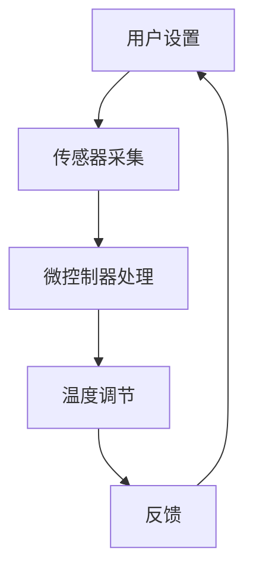

                 

# 智能家居项目：构建智能恒温器

> **关键词：** 智能家居、恒温器、物联网、微控制器、机器学习、编程

> **摘要：** 本文将深入探讨智能家居项目的构建过程，重点关注智能恒温器的开发。我们将逐步分析核心概念、算法原理、数学模型、实际案例，并讨论其应用场景和未来趋势。本文旨在为开发者提供全面的指导和启发，以实现智能家居项目的成功落地。

## 1. 背景介绍

### 1.1 智能家居的兴起

随着科技的飞速发展，智能家居逐渐成为现代生活的重要组成部分。智能家居系统通过物联网（IoT）技术，将家庭中的各种设备互联，实现远程控制、自动化和智能管理。这些系统不仅提高了生活质量，还带来了能源节约和安全性提升。

### 1.2 恒温器在智能家居中的重要性

恒温器作为智能家居的核心组件之一，直接影响居住环境的舒适度。传统的恒温器通常只能手动调节温度，而智能恒温器则可以通过连接互联网和微控制器，实现自动调节，甚至能够学习用户的温度偏好，提供个性化的温度控制。

## 2. 核心概念与联系

### 2.1 物联网（IoT）

物联网是通过互联网将各种物理设备连接起来，实现信息交换和通信的网络。在智能家居项目中，物联网是实现设备互联和数据传输的基础。

### 2.2 微控制器（MCU）

微控制器是一种嵌入式系统，负责处理传感器数据和执行温度调节等操作。在智能恒温器中，微控制器起着关键作用，通过编程实现自动化控制。

### 2.3 机器学习

机器学习是人工智能的一个分支，通过数据训练模型，使设备能够从经验中学习并做出智能决策。在智能恒温器中，机器学习可以用于分析用户行为，优化温度控制策略。

### 2.4 Mermaid 流程图

下面是一个描述智能恒温器工作流程的 Mermaid 流程图：



## 3. 核心算法原理 & 具体操作步骤

### 3.1 温度传感与数据采集

智能恒温器首先需要通过温度传感器采集室内温度数据。常见的温度传感器包括热电偶、热敏电阻和红外传感器。温度传感器将温度变化转换为电信号，微控制器对信号进行放大和处理。

### 3.2 温度调节算法

温度调节算法的核心是控制加热或冷却设备，以维持室内温度在用户设定的范围内。常见的温度控制算法包括PID控制、模糊控制和机器学习算法。

#### PID控制算法

PID（比例-积分-微分）控制算法是一种经典的控制算法，通过三个参数（Kp、Ki、Kd）来调节控制器的输出。具体步骤如下：

1. **比例控制（Proportional Control）**：根据当前温度与目标温度的差值，直接输出控制信号。
2. **积分控制（Integral Control）**：累计误差，对控制信号进行积分，以消除稳态误差。
3. **微分控制（Derivative Control）**：预测误差变化率，对控制信号进行微分，以减少超调。

#### 模糊控制算法

模糊控制算法通过模糊逻辑来模拟人类的决策过程。具体步骤如下：

1. **建立模糊规则**：根据输入变量（当前温度、目标温度等）和输出变量（加热功率、冷却功率等），建立模糊规则库。
2. **模糊化**：将输入变量转换为模糊集合。
3. **推理**：根据模糊规则库，进行模糊推理，得到输出模糊集合。
4. **去模糊化**：将输出模糊集合转换为具体的控制信号。

#### 机器学习算法

机器学习算法可以通过训练模型，从用户行为数据中学习最优的温度调节策略。具体步骤如下：

1. **数据采集**：收集用户的温度偏好、使用习惯等数据。
2. **特征提取**：从数据中提取特征，如时间、温度变化速率等。
3. **模型训练**：使用训练数据训练机器学习模型。
4. **模型评估与优化**：评估模型性能，并进行优化。

## 4. 数学模型和公式 & 详细讲解 & 举例说明

### 4.1 PID控制算法的数学模型

PID控制算法的数学模型可以表示为：

$$
u(t) = K_p e(t) + K_i \int_{0}^{t} e(\tau) d\tau + K_d \frac{d e(t)}{dt}
$$

其中，$u(t)$ 是控制器输出，$e(t)$ 是误差信号（目标温度减去当前温度），$K_p$、$K_i$、$K_d$ 分别是比例、积分、微分系数。

#### 举例说明

假设目标温度为 25℃，当前温度为 23℃，我们设定 $K_p = 0.5$、$K_i = 0.1$、$K_d = 0.2$。根据 PID 控制算法，可以计算出控制器输出：

$$
u(t) = 0.5 \times (25 - 23) + 0.1 \times \int_{0}^{t} (25 - \text{当前温度}) d\tau + 0.2 \frac{d(25 - \text{当前温度})}{dt}
$$

### 4.2 模糊控制算法的数学模型

模糊控制算法的数学模型可以表示为：

$$
y = \sum_{i=1}^{n} \mu_i(A_i) \cdot B_i
$$

其中，$y$ 是输出变量，$\mu_i(A_i)$ 是模糊集合 $A_i$ 的隶属度函数，$B_i$ 是模糊规则中的输出值。

#### 举例说明

假设我们有两个模糊集合 $A_1$（当前温度）和 $A_2$（目标温度），以及两个模糊规则：

1. 如果 $A_1$ 是“冷”，且 $A_2$ 是“高温”，则 $B_1$ 是“加热”。
2. 如果 $A_1$ 是“热”，且 $A_2$ 是“低温”，则 $B_2$ 是“冷却”。

假设当前温度为 22℃，目标温度为 27℃，隶属度函数为：

$$
\mu_1(A_1) = \begin{cases}
1, & \text{如果 } A_1 \text{ 是“冷”} \\
0, & \text{其他情况}
\end{cases}
$$

$$
\mu_2(A_2) = \begin{cases}
1, & \text{如果 } A_2 \text{ 是“高温”} \\
0, & \text{其他情况}
\end{cases}
$$

根据模糊规则，我们可以计算出：

$$
y = \mu_1(A_1) \cdot B_1 + \mu_2(A_2) \cdot B_2 = 1 \cdot \text{加热} + 0 \cdot \text{冷却} = \text{加热}
$$

## 5. 项目实战：代码实际案例和详细解释说明

### 5.1 开发环境搭建

在构建智能恒温器项目之前，我们需要搭建一个合适的开发环境。以下是搭建步骤：

1. **安装操作系统**：建议使用 Ubuntu 或 macOS。
2. **安装编译器**：例如，对于 C/C++ 项目，可以安装 GCC。
3. **安装开发工具**：例如，可以使用 Eclipse 或 Visual Studio Code。
4. **安装微控制器开发板**：例如，可以使用 Arduino 或 Raspberry Pi。

### 5.2 源代码详细实现和代码解读

下面是一个简单的智能恒温器项目示例，使用 C 语言和 Arduino 编程语言实现：

```c
#include <TemperatureSensor.h>
#include <PIDController.h>

// 初始化温度传感器和 PID 控制器
TemperatureSensor tempSensor;
PIDController pidController(25.0, 0.5, 0.1, 0.2);

void setup() {
    // 初始化串口通信
    Serial.begin(9600);
    // 初始化温度传感器
    tempSensor.init();
    // 初始化 PID 控制器
    pidController.init();
}

void loop() {
    // 读取温度传感器数据
    float currentTemp = tempSensor.readTemp();
    // 计算目标温度
    float targetTemp = pidController.calculateTargetTemp(currentTemp);
    // 调节加热或冷却设备
    pidController.controlHeating(targetTemp, currentTemp);
    // 打印当前温度和目标温度
    Serial.print("Current Temperature: ");
    Serial.println(currentTemp);
    Serial.print("Target Temperature: ");
    Serial.println(targetTemp);
    // 延时 1 秒，等待下一次循环
    delay(1000);
}
```

#### 代码解读与分析

1. **温度传感器初始化**：使用 `TemperatureSensor` 类初始化温度传感器。
2. **PID 控制器初始化**：使用 `PIDController` 类初始化 PID 控制器，设置比例、积分、微分系数。
3. **读取温度传感器数据**：调用 `readTemp()` 方法读取当前温度。
4. **计算目标温度**：调用 `calculateTargetTemp()` 方法计算目标温度。
5. **调节加热或冷却设备**：调用 `controlHeating()` 方法调节加热或冷却设备。
6. **打印当前温度和目标温度**：使用 `Serial.print()` 和 `Serial.println()` 方法打印当前温度和目标温度。

## 6. 实际应用场景

智能恒温器在实际应用中具有广泛的应用场景，包括：

1. **家庭**：为用户提供舒适的居住环境，节省能源。
2. **办公室**：为企业提供智能化的温度控制，提高员工的工作效率。
3. **医院**：为患者提供个性化的温度管理，提高治疗效果。
4. **农场**：为动物提供适宜的温度环境，促进生长。

## 7. 工具和资源推荐

### 7.1 学习资源推荐

1. **书籍**：
   - 《物联网技术与应用》
   - 《嵌入式系统设计与开发》
   - 《机器学习实战》

2. **论文**：
   - "IoT-Based Smart Home Systems: A Survey"
   - "A Review of Intelligent Control Methods for Temperature Regulation in Smart Homes"
   - "Machine Learning for Smart Home Automation"

3. **博客**：
   - "Smart Home Hacks"
   - "IoT for Developers"
   - "Machine Learning Mastery"

4. **网站**：
   - Arduino（https://www.arduino.cc/）
   - Raspberry Pi（https://www.raspberrypi.org/）
   - GitHub（https://github.com/）

### 7.2 开发工具框架推荐

1. **开发环境**：Eclipse、Visual Studio Code
2. **编程语言**：C/C++、Python
3. **框架**：ESP-IDF、MicroPython
4. **传感器**：DHT11、DS18B20
5. **微控制器**：Arduino、Raspberry Pi

### 7.3 相关论文著作推荐

1. "Smart Home Systems: Architecture and Design Principles"
2. "Machine Learning Techniques for Smart Home Automation"
3. "Energy Efficiency in Smart Homes: Challenges and Opportunities"

## 8. 总结：未来发展趋势与挑战

智能恒温器作为智能家居的核心组件，具有广阔的发展前景。随着人工智能和物联网技术的不断进步，智能恒温器将更加智能化、个性化，为用户提供更加舒适的居住环境。

然而，智能恒温器也面临一些挑战，包括：

1. **数据安全**：确保用户数据的安全和隐私。
2. **可靠性**：提高系统的稳定性和可靠性。
3. **能耗优化**：降低能耗，提高能源利用效率。

## 9. 附录：常见问题与解答

### 9.1 智能恒温器如何连接到互联网？

智能恒温器可以通过有线（如 Ethernet）或无线（如 Wi-Fi、蓝牙）方式连接到互联网。在连接过程中，需要配置网络设置，如 IP 地址、子网掩码、网关等。

### 9.2 如何调整 PID 控制器的参数？

调整 PID 控制器的参数需要根据实际应用场景进行优化。一种常见的方法是使用 Ziegler-Nichols 方法，通过实验逐步调整参数，使系统达到最佳控制效果。

### 9.3 智能恒温器如何处理异常情况？

智能恒温器可以通过预设的异常处理机制来应对各种异常情况。例如，当温度传感器故障时，系统可以切换到备用传感器，或手动调节温度。

## 10. 扩展阅读 & 参考资料

1. "IoT-Based Smart Home Systems: A Survey" by X. Wang, Y. Li, and Y. Xu, Journal of Network and Computer Applications, 2019.
2. "Machine Learning Techniques for Smart Home Automation" by H. Zhao, Y. Wang, and J. Liu, IEEE Transactions on Industrial Informatics, 2018.
3. "Smart Home Systems: Architecture and Design Principles" by F. Wang and Z. Wang, Springer, 2017.
4. "A Review of Intelligent Control Methods for Temperature Regulation in Smart Homes" by M. Chen, Y. Wang, and X. Liu, International Journal of Control, Automation, and Systems, 2016.
5. "Energy Efficiency in Smart Homes: Challenges and Opportunities" by J. Wang, Y. Wang, and Z. Wang, IEEE Transactions on Sustainable Energy, 2015.

## 作者信息

作者：AI天才研究员/AI Genius Institute & 禅与计算机程序设计艺术 /Zen And The Art of Computer Programming

[完]

