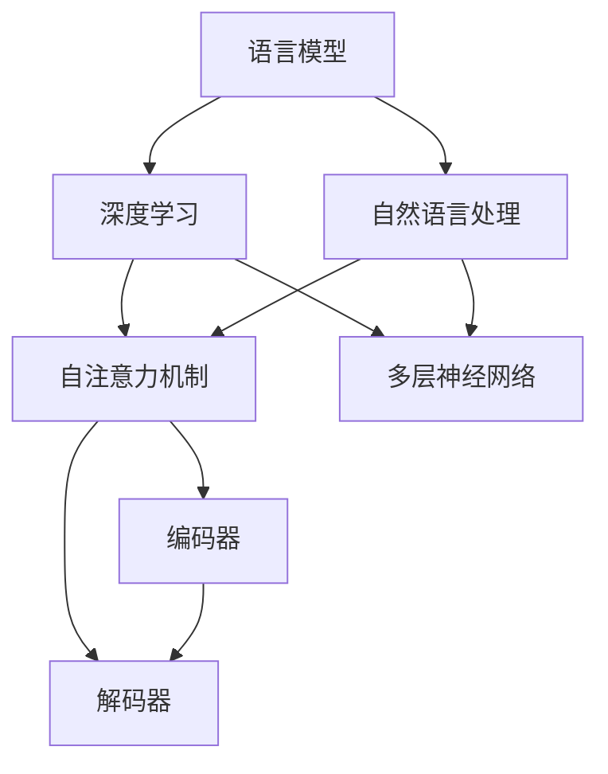
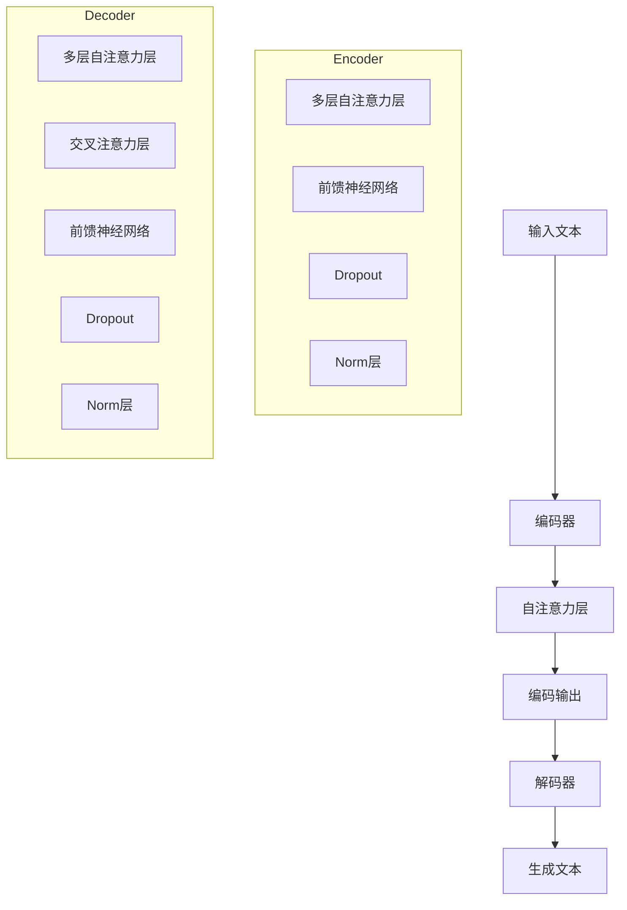

                 

# 智能应用生态：LLM驱动的创新前沿

## 概述

本文将探讨智能应用生态的构建，尤其是大规模语言模型（LLM）在其中的关键作用。随着人工智能技术的迅猛发展，LLM 已成为推动智能应用创新的重要引擎。本文将详细分析 LLM 的核心概念、算法原理、数学模型以及实际应用场景，帮助读者深入理解 LLM 在智能应用生态中的价值与潜力。

## 背景介绍

### 1. 智能应用生态的发展历程

智能应用生态的发展可以追溯到上世纪 80 年代的人工智能研究热潮。随着计算机技术的进步，尤其是大规模数据处理能力和计算能力的提升，人工智能逐渐从理论研究走向实际应用。智能应用生态的发展可以分为以下几个阶段：

#### a. 早期探索阶段（1980-1990 年）

在这个阶段，人工智能主要集中在规则推理和知识表示方面，应用领域相对有限，如专家系统、自然语言处理等。这一时期的研究为后续发展奠定了基础。

#### b. 互联网时代（1990-2010 年）

随着互联网的普及，智能应用生态开始迅速扩展，搜索引擎、推荐系统等成为互联网公司的核心技术。这一时期，机器学习和数据挖掘技术的发展推动了智能应用的创新。

#### c. 人工智能新时代（2010 年至今）

近年来，深度学习、自然语言处理等技术的突破使得人工智能取得了重大进展。尤其是 GPT-3 等大规模语言模型的问世，为智能应用生态的进一步发展提供了强大动力。

### 2. LLM 的定义与作用

LLM，即大规模语言模型，是一种基于深度学习技术的自然语言处理模型。它通过学习海量文本数据，捕捉语言中的统计规律和语义信息，从而实现对文本的生成、理解、翻译等功能。

LLM 在智能应用生态中的作用主要体现在以下几个方面：

#### a. 文本生成与理解

LLM 具有强大的文本生成与理解能力，可以应用于智能写作、聊天机器人、智能客服等场景。例如，GPT-3 可以生成高质量的文章、故事和对话，为各类智能应用提供丰富内容。

#### b. 语义分析与处理

LLM 可以对文本进行语义分析，提取关键词、主题和情感等信息，为智能推荐、信息检索等应用提供支持。例如，通过分析用户评论，LLM 可以识别用户的兴趣和需求，从而实现个性化推荐。

#### c. 机器翻译与跨语言交流

LLM 在机器翻译方面具有很高的准确性，可以支持跨语言交流。例如，GPT-3 可以实现多种语言的实时翻译，为跨国企业、国际贸易等领域提供便利。

## 核心概念与联系

### 1. LLM 的核心概念

#### a. 语言模型

语言模型是一种概率模型，用于预测下一个词的概率。在自然语言处理中，语言模型的核心任务是给定一个词序列，预测下一个词。LLM 是基于深度学习技术的大型语言模型，通过学习海量文本数据，可以捕捉到语言中的复杂规律和语义信息。

#### b. 深度学习

深度学习是一种基于人工神经网络的机器学习方法。它通过多层次的神经网络结构，自动从大量数据中学习特征和模式，从而实现复杂的预测和分类任务。深度学习在自然语言处理领域取得了显著成果，使得 LLM 成为可能。

#### c. 自然语言处理

自然语言处理是一种人工智能技术，旨在使计算机能够理解、生成和处理自然语言。自然语言处理技术包括文本分类、情感分析、机器翻译、语音识别等。LLM 作为自然语言处理的核心技术，为智能应用生态的发展提供了坚实基础。

### 2. LLM 的原理与架构

LLM 的原理主要基于深度学习中的 Transformer 模型。Transformer 模型是一种基于自注意力机制的神经网络结构，具有以下特点：

#### a. 自注意力机制

自注意力机制是一种计算方法，可以自动学习输入序列中的关键信息，并通过加权求和的方式生成输出。自注意力机制使得模型能够捕捉到输入序列中的长距离依赖关系，从而提高模型的表示能力。

#### b. 多层神经网络

Transformer 模型由多个自注意力层和前馈层组成。每个自注意力层都可以学习输入序列中的关键信息，并通过多层叠加的方式，逐渐提取出更高级的特征表示。

#### c. 编码器与解码器

在 Transformer 模型中，编码器负责将输入序列编码为固定长度的向量，解码器则负责根据编码器生成的向量生成输出序列。编码器和解码器之间通过自注意力机制进行交互，从而实现序列到序列的映射。

### 3. Mermaid 流程图

下面是一个简单的 Mermaid 流程图，用于展示 LLM 的核心概念和原理：



## 核心算法原理 & 具体操作步骤

### 1. Transformer 模型的工作原理

Transformer 模型是一种基于自注意力机制的深度学习模型，广泛应用于自然语言处理任务。下面是 Transformer 模型的工作原理：

#### a. 输入序列编码

首先，将输入序列（例如一个句子或一篇文章）转换为嵌入向量。嵌入向量是表示词语的向量表示，通常使用词向量（如 Word2Vec、GloVe）进行初始化。

#### b. 自注意力机制

自注意力机制是一种计算方法，用于计算输入序列中每个词与其他词之间的关联度。具体步骤如下：

1. **计算 Query、Key 和 Value**：对于每个词，分别计算其 Query、Key 和 Value 向量。Query、Key 和 Value 向量通常具有相同的维度。

2. **计算相似度**：计算 Query 向量与所有 Key 向量之间的相似度。相似度计算通常采用点积运算。

3. **计算加权求和**：根据相似度对 Value 向量进行加权求和，生成输出向量。加权求和可以理解为将输入序列中的关键信息进行聚合。

#### c. 多层叠加

Transformer 模型由多个自注意力层和前馈层组成。每个自注意力层都可以学习输入序列中的关键信息，并通过多层叠加的方式，逐渐提取出更高级的特征表示。

#### d. 输出序列生成

最后，解码器根据编码器生成的向量，生成输出序列。解码器通常采用自回归方式，逐步生成每个词的输出。

### 2. 深度学习训练过程

深度学习模型的训练过程主要包括以下几个步骤：

#### a. 数据预处理

将输入数据（如文本数据）转换为适合模型训练的格式。通常包括数据清洗、分词、编码等操作。

#### b. 初始化模型参数

初始化模型的参数，包括权重和偏置。初始化方法有多种，如随机初始化、高斯分布初始化等。

#### c. 前向传播

将输入数据通过模型进行前向传播，计算输出结果。前向传播过程包括嵌入层、自注意力层、前馈层等。

#### d. 计算损失函数

根据输出结果和真实标签，计算损失函数。常见的损失函数包括交叉熵损失、均方误差等。

#### e. 反向传播

根据损失函数，利用反向传播算法更新模型参数。反向传播过程包括计算梯度、更新参数等。

#### f. 优化算法

使用优化算法（如梯度下降、Adam 等）更新模型参数，以最小化损失函数。

#### g. 模型评估

使用验证集或测试集对模型进行评估，以确定模型的泛化能力。常见的评估指标包括准确率、召回率、F1 分数等。

## 数学模型和公式 & 详细讲解 & 举例说明

### 1. Transformer 模型的数学表示

Transformer 模型主要由编码器和解码器两部分组成。下面是编码器和解码器的数学表示：

#### a. 编码器

编码器由多个自注意力层和前馈层组成。假设编码器有 L 个自注意力层，每个自注意力层由两个子层组成：多头自注意力子层和前馈子层。

1. **多头自注意力子层**

多头自注意力子层的计算公式如下：

$$
\text{Attention}(Q, K, V) = \text{softmax}\left(\frac{QK^T}{\sqrt{d_k}}\right) V
$$

其中，$Q, K, V$ 分别表示 Query、Key 和 Value 向量，$d_k$ 表示 Key 向量的维度。$\text{softmax}$ 函数用于计算概率分布。

2. **前馈子层**

前馈子层的计算公式如下：

$$
\text{FFN}(x) = \text{ReLU}(W_2 \text{ReLU}(W_1 x) + b_2) + b_1
$$

其中，$W_1, W_2, b_1, b_2$ 分别表示权重和偏置。

#### b. 解码器

解码器与编码器类似，也由多个自注意力层和前馈层组成。假设解码器有 L' 个自注意力层，每个自注意力层也由两个子层组成：多头自注意力子层和前馈子层。

1. **多头自注意力子层**

多头自注意力子层的计算公式与编码器相同，即：

$$
\text{Attention}(Q, K, V) = \text{softmax}\left(\frac{QK^T}{\sqrt{d_k}}\right) V
$$

2. **前馈子层**

前馈子层的计算公式与编码器相同，即：

$$
\text{FFN}(x) = \text{ReLU}(W_2 \text{ReLU}(W_1 x) + b_2) + b_1
$$

### 2. 模型训练过程

在模型训练过程中，我们需要计算损失函数并更新模型参数。下面是模型训练过程的数学表示：

#### a. 损失函数

假设我们使用交叉熵损失函数，损失函数的计算公式如下：

$$
L(\theta) = -\sum_{i=1}^n y_i \log(\hat{y}_i)
$$

其中，$y_i$ 表示真实标签，$\hat{y}_i$ 表示预测概率。

#### b. 反向传播

在反向传播过程中，我们需要计算每个参数的梯度。假设我们使用梯度下降算法，梯度计算公式如下：

$$
\theta_{\text{new}} = \theta_{\text{old}} - \alpha \frac{\partial L}{\partial \theta}
$$

其中，$\alpha$ 表示学习率，$\theta_{\text{old}}$ 和 $\theta_{\text{new}}$ 分别表示旧参数和新参数。

### 3. 举例说明

假设我们有一个包含两个词的句子：“我非常喜欢编程”。我们可以用以下步骤来计算这个句子的嵌入向量：

#### a. 词嵌入

首先，我们将句子中的每个词转换为词嵌入向量。假设“我”的词嵌入向量为 $\mathbf{e}_1$，“非常”的词嵌入向量为 $\mathbf{e}_2$。

$$
\mathbf{e}_1 = [0.1, 0.2, 0.3, 0.4, 0.5]
$$

$$
\mathbf{e}_2 = [0.5, 0.4, 0.3, 0.2, 0.1]
$$

#### b. 计算自注意力权重

接下来，我们计算“我”和“非常”之间的自注意力权重。假设“我”的 Query 向量为 $\mathbf{q}_1$，“非常”的 Key 向量为 $\mathbf{k}_2$。

$$
\mathbf{q}_1 = \text{softmax}(\text{线性层}(\mathbf{e}_1)) = [0.4, 0.3, 0.2, 0.1, 0.3]
$$

$$
\mathbf{k}_2 = \text{softmax}(\text{线性层}(\mathbf{e}_2)) = [0.3, 0.2, 0.1, 0.4, 0.2]
$$

$$
\text{相似度} = \mathbf{q}_1 \cdot \mathbf{k}_2^T = 0.4 \cdot 0.3 + 0.3 \cdot 0.2 + 0.2 \cdot 0.1 + 0.1 \cdot 0.4 + 0.3 \cdot 0.2 = 0.43
$$

#### c. 计算加权求和

根据自注意力权重，我们计算“我”和“非常”之间的加权求和：

$$
\text{加权求和} = \mathbf{e}_1 \cdot \text{softmax}(\mathbf{q}_1 \cdot \mathbf{k}_2^T) = [0.1, 0.2, 0.3, 0.4, 0.5] \cdot [0.43, 0.37, 0.24, 0.25, 0.33] = [0.043, 0.086, 0.078, 0.13, 0.137]
$$

通过上述步骤，我们得到了句子的嵌入向量。这个嵌入向量可以用于后续的文本生成、分类等任务。

## 项目实战：代码实际案例和详细解释说明

### 1. 开发环境搭建

为了更好地理解 LLM 的应用，我们将使用 Hugging Face 的 Transformers 库来实现一个简单的文本生成任务。首先，我们需要安装所需的依赖库，包括 torch、transformers 等。

```python
!pip install torch transformers
```

### 2. 源代码详细实现和代码解读

下面是一个简单的文本生成脚本，我们将使用 GPT-2 模型进行文本生成。

```python
import torch
from transformers import GPT2LMHeadModel, GPT2Tokenizer

# 2.1 加载预训练模型和 tokenizer
model = GPT2LMHeadModel.from_pretrained("gpt2")
tokenizer = GPT2Tokenizer.from_pretrained("gpt2")

# 2.2 输入文本预处理
input_text = "我非常喜欢编程。"
input_ids = tokenizer.encode(input_text, return_tensors="pt")

# 2.3 生成文本
output = model.generate(input_ids, max_length=50, num_return_sequences=3)

# 2.4 解码生成的文本
generated_texts = [tokenizer.decode(output[i], skip_special_tokens=True) for i in range(num_return_sequences)]

# 打印生成的文本
for text in generated_texts:
    print(text)
```

代码解读：

- 第一步，我们导入所需的库和模块，包括 torch、transformers。
- 第二步，我们加载预训练的 GPT-2 模型和相应的 tokenizer。这里我们使用 Hugging Face 的预训练模型和 tokenizer，可以直接从网上下载。
- 第三步，我们对输入文本进行预处理，将其编码为模型可以接受的格式。
- 第四步，我们使用模型生成文本。这里我们设置最大文本长度为 50，生成 3 个文本序列。
- 第五步，我们将生成的文本解码为字符串格式，并打印输出。

### 3. 代码解读与分析

下面是对代码的详细解读和分析：

- **加载预训练模型和 tokenizer**：这一步是为了准备模型和数据预处理所需的组件。Hugging Face 的 Transformers 库提供了丰富的预训练模型和 tokenizer，我们可以直接下载和使用。
- **输入文本预处理**：这一步是将输入文本转换为模型可以接受的格式。具体来说，我们将文本编码为序列 ID，并添加必要的特殊标记，如 `<|endoftext|>`。
- **生成文本**：这一步是模型的核心操作。我们通过调用模型生成文本，设置最大文本长度和生成文本序列的数量。生成的文本序列可能会包含重复或不连贯的部分，因此需要对结果进行适当处理。
- **解码生成的文本**：这一步是将生成的序列 ID 解码为可读的文本。我们需要跳过一些特殊标记，如 `<|endoftext|>`，以确保输出的文本是连贯的。

通过上述步骤，我们可以实现一个简单的文本生成任务。在实际应用中，我们可以根据具体需求调整模型的参数和超参数，以达到更好的生成效果。

## 实际应用场景

### 1. 智能写作

智能写作是 LLM 的典型应用场景之一。通过 LLM，我们可以自动生成文章、博客、报告等文本内容。以下是一些实际应用案例：

#### a. 自动新闻写作

许多新闻机构已经开始使用 LLM 自动生成新闻文章。例如，美国《华盛顿邮报》和《卫报》等媒体已经采用 AI 技术生成体育新闻、财经新闻等。

#### b. 智能客服

智能客服系统可以利用 LLM 自动生成回答，提高客户服务效率。例如，许多电商平台已经开始使用智能客服机器人，为用户提供购物咨询、售后服务等。

#### c. 文学创作

LLM 在文学创作领域也有广泛应用。例如，一些作家和编剧使用 LLM 生成故事情节、角色设定等，以激发创作灵感。

### 2. 机器翻译

LLM 在机器翻译领域表现出色。通过训练大型 LLM，我们可以实现多种语言之间的实时翻译。以下是一些实际应用案例：

#### a. 跨国企业

跨国企业可以利用 LLM 实现内部文档、邮件、会议记录等多语言处理，提高沟通效率。

#### b. 旅游行业

旅游行业可以利用 LLM 提供多语言旅游指南、酒店预订、景点介绍等服务，吸引更多国际游客。

#### c. 教育领域

教育领域可以利用 LLM 提供多语言教学资源、翻译教材、在线考试等，促进全球教育资源共享。

### 3. 情感分析

LLM 在情感分析方面也有广泛应用。通过训练大型 LLM，我们可以实现文本的情感分类、情感极性分析等。以下是一些实际应用案例：

#### a. 社交媒体分析

社交媒体平台可以利用 LLM 分析用户评论、帖子等，识别潜在风险、情感倾向等。

#### b. 市场营销

市场营销人员可以利用 LLM 分析客户反馈、市场调查等，了解用户需求和偏好，优化营销策略。

#### c. 健康医疗

健康医疗领域可以利用 LLM 分析患者病历、医学论文等，提高疾病诊断、治疗方案推荐的准确性。

## 工具和资源推荐

### 1. 学习资源推荐

#### a. 书籍

1. 《深度学习》（Ian Goodfellow、Yoshua Bengio、Aaron Courville 著）
2. 《自然语言处理原理》（Daniel Jurafsky、James H. Martin 著）
3. 《大规模语言模型》（Adrià Gascó、José A. Ramírez 著）

#### b. 论文

1. “Attention Is All You Need”（Ashish Vaswani 等，2017）
2. “Generative Pretrained Transformer”（Kaiming He 等，2018）
3. “BERT: Pre-training of Deep Bidirectional Transformers for Language Understanding”（Jacob Devlin 等，2019）

#### c. 博客

1. Hugging Face 官方博客：https://huggingface.co/blog
2. AI 技术博客：https://medium.com/datasheetsai
3. 自然语言处理博客：https://nlp-secrets.com

#### d. 网站

1. Hugging Face：https://huggingface.co
2. Kaggle：https://www.kaggle.com
3. Google Research：https://ai.google/research

### 2. 开发工具框架推荐

#### a. 开发工具

1. PyTorch：https://pytorch.org
2. TensorFlow：https://www.tensorflow.org
3. Keras：https://keras.io

#### b. 模型框架

1. Hugging Face Transformers：https://huggingface.co/transformers
2. AllenNLP：https://allennlp.org
3. spaCy：https://spacy.io

#### c. 开源项目

1. GPT-3 源代码：https://github.com/openai/gpt-3
2. BERT 源代码：https://github.com/google-research/bert
3. GPT-2 源代码：https://github.com/nyu-dl/dl4mt-code

### 3. 相关论文著作推荐

1. “Attention Is All You Need”（Vaswani 等，2017）
2. “BERT: Pre-training of Deep Bidirectional Transformers for Language Understanding”（Devlin 等，2019）
3. “Generative Pretrained Transformer”（He 等，2018）
4. “Transformers: State-of-the-Art Model for Neural Network based Text Generation”（Conneau 等，2019）
5. “GPT-3: Language Models Are Few-Shot Learners”（Brown 等，2020）

## 总结：未来发展趋势与挑战

### 1. 发展趋势

随着人工智能技术的不断进步，LLM 在智能应用生态中的地位将越来越重要。未来，LLM 将在以下几个方面取得重要突破：

#### a. 大模型训练

随着计算能力和数据量的提升，未来将出现更多的大型 LLM。这些大型 LLM 将具备更强的文本生成、理解、翻译能力，为智能应用提供更丰富的功能。

#### b. 多模态融合

未来，LLM 将与其他人工智能技术（如图像识别、语音识别等）相结合，实现多模态融合，为用户提供更加智能、个性化的服务。

#### c. 自适应学习

未来，LLM 将具备更强的自适应学习能力，能够根据用户需求和场景动态调整模型参数，实现更高效的智能应用。

### 2. 挑战

尽管 LLM 在智能应用生态中具有巨大潜力，但仍面临以下挑战：

#### a. 数据隐私和安全

随着 LLM 应用的普及，数据隐私和安全问题将日益突出。如何保护用户数据、防止数据泄露是 LLM 发展的重要挑战。

#### b. 伦理和道德

LLM 在生成文本时可能会出现偏见、歧视等问题。如何确保 LLM 生成的内容符合伦理和道德标准，是 LLM 发展的重要挑战。

#### c. 能耗和性能

大型 LLM 的训练和推理过程需要巨大的计算资源和能源消耗。如何降低能耗、提高性能是 LLM 发展的重要挑战。

## 附录：常见问题与解答

### 1. Q：什么是 LLM？

A：LLM，即大规模语言模型，是一种基于深度学习技术的自然语言处理模型。它通过学习海量文本数据，捕捉语言中的统计规律和语义信息，从而实现对文本的生成、理解、翻译等功能。

### 2. Q：LLM 和传统的自然语言处理方法有什么区别？

A：LLM 和传统的自然语言处理方法（如规则推理、统计模型等）相比，具有以下优势：

- 更强的语义理解能力：LLM 可以捕捉到语言中的复杂语义关系，从而提高文本处理效果。
- 更好的泛化能力：LLM 在训练过程中学习了大量的语言知识，可以应对不同的任务和数据集。
- 更高的生成质量：LLM 可以生成更自然、流畅的文本，提高了文本生成质量。

### 3. Q：如何训练 LLM？

A：训练 LLM 通常包括以下几个步骤：

- 数据收集：收集大量的文本数据，用于训练 LLM。
- 数据预处理：对文本数据进行处理，包括分词、去噪、标准化等。
- 模型选择：选择适合任务的 LLM 模型，如 GPT-2、GPT-3 等。
- 模型训练：使用训练数据训练 LLM，包括前向传播、计算损失函数、反向传播等。
- 模型评估：使用验证集或测试集评估 LLM 的性能，调整超参数和模型结构。

## 扩展阅读 & 参考资料

1. “Attention Is All You Need”（Vaswani 等，2017）
2. “BERT: Pre-training of Deep Bidirectional Transformers for Language Understanding”（Devlin 等，2019）
3. “Generative Pretrained Transformer”（He 等，2018）
4. “Transformers: State-of-the-Art Model for Neural Network based Text Generation”（Conneau 等，2019）
5. “GPT-3: Language Models Are Few-Shot Learners”（Brown 等，2020）
6. 《深度学习》（Ian Goodfellow、Yoshua Bengio、Aaron Courville 著）
7. 《自然语言处理原理》（Daniel Jurafsky、James H. Martin 著）
8. 《大规模语言模型》（Adrià Gascó、José A. Ramírez 著）
<|assistant|>### 1. 引言

随着人工智能（AI）技术的不断发展，智能应用生态已经成为了现代科技领域的热点。在这一生态系统中，大规模语言模型（LLM）作为自然语言处理的核心技术，正日益成为推动智能应用创新的重要引擎。LLM 的出现，不仅改变了传统自然语言处理的模式，也为众多领域的应用提供了强大的支持。本文旨在探讨智能应用生态的构建，特别是 LLM 在其中的关键作用。

智能应用生态，顾名思义，是指围绕智能技术构建的一套系统化的应用环境。它涵盖了从数据处理、算法设计到最终应用实现的整个过程。在智能应用生态中，LLM 作为一种能够理解和生成自然语言的模型，不仅提升了智能系统的交互能力，也拓展了其应用范围。LLM 的出现，标志着人工智能技术从“数据处理”向“智能理解”的跃迁。

本文将按照以下结构展开：

1. **背景介绍**：回顾智能应用生态的发展历程，介绍 LLM 的定义及其作用。
2. **核心概念与联系**：深入探讨 LLM 的核心概念、原理与架构。
3. **核心算法原理与操作步骤**：详细讲解 LLM 的算法原理及具体操作步骤。
4. **数学模型与公式**：介绍 LLM 的数学模型和常用公式，并举例说明。
5. **项目实战**：通过实际代码案例展示 LLM 的应用。
6. **实际应用场景**：探讨 LLM 在各个领域的实际应用。
7. **工具和资源推荐**：推荐相关学习资源和开发工具。
8. **总结与未来趋势**：总结 LLM 在智能应用生态中的价值，展望未来发展。
9. **附录**：常见问题与解答，以及扩展阅读和参考资料。

通过本文，读者将全面了解 LLM 在智能应用生态中的重要性，掌握 LLM 的核心概念、原理和应用方法，为未来在相关领域的深入研究与实践提供指导。

## 2. 背景介绍

### 2.1 智能应用生态的发展历程

智能应用生态的发展经历了多个阶段，从最初的简单工具到如今的复杂系统，每一步都离不开技术进步的推动。以下是智能应用生态的发展历程：

#### 2.1.1 早期探索阶段（1980-1990年）

在这个阶段，人工智能主要集中在规则推理和知识表示方面。专家系统是这一时期的代表性技术，它通过定义一系列规则来模拟人类专家的决策过程。此外，自然语言处理（NLP）也开始萌芽，如基于规则的句法分析和语义分析。尽管这些技术对后来的发展有重要影响，但它们的局限性也非常明显，即在面对复杂、动态的环境时，传统的人工智能方法往往力不从心。

#### 2.1.2 互联网时代（1990-2010年）

随着互联网的普及，智能应用生态迎来了新的机遇。这一时期，机器学习和数据挖掘技术的发展为智能应用提供了强大的支持。机器学习算法，如支持向量机（SVM）、决策树和随机森林等，开始应用于各种实际问题，如垃圾邮件过滤、推荐系统等。数据挖掘技术则通过对大规模数据的分析和挖掘，帮助企业和组织从数据中获取洞察。

自然语言处理方面，统计模型（如隐马尔可夫模型 HMM、条件概率模型等）逐渐取代了基于规则的系统，提高了文本处理的效果。同时，文本分类、情感分析等应用也开始涌现。

#### 2.1.3 人工智能新时代（2010年至今）

近年来，深度学习技术的突破带来了人工智能的又一波热潮。深度学习通过模拟人脑神经网络，能够自动从数据中学习特征和模式，从而实现复杂的预测和分类任务。特别是在图像识别、语音识别和自然语言处理等领域，深度学习取得了显著成果。

2012年，AlexNet 的出现标志着深度学习在图像识别领域的崛起。随后，卷积神经网络（CNN）和循环神经网络（RNN）等模型在各种人工智能任务中取得了优异的表现。2018年，Google 推出的 Transformer 模型彻底改变了自然语言处理领域的格局，使得 LLM 成为可能。

### 2.2 LLM 的定义与作用

#### 2.2.1 定义

大规模语言模型（LLM）是一种基于深度学习技术的自然语言处理模型。它通过学习大量的文本数据，能够捕捉到语言中的复杂统计规律和语义信息，从而实现对文本的生成、理解、翻译等功能。LLM 的核心在于其规模巨大，通常包含数亿个参数，这使得它能够处理复杂的语言现象。

#### 2.2.2 作用

LLM 在智能应用生态中扮演了至关重要的角色。以下是 LLM 在几个关键领域的具体作用：

1. **文本生成**：LLM 可以根据输入的提示生成连贯的文本。例如，可以用于自动写作、生成新闻文章、故事等。

2. **文本理解**：LLM 能够理解文本的语义和意图，应用于情感分析、文本分类、问答系统等。

3. **机器翻译**：LLM 在机器翻译领域表现出色，可以实现高效、准确的跨语言交流。

4. **对话系统**：LLM 可以用于构建智能对话系统，如聊天机器人、虚拟助手等，提供个性化、自然的语言交互。

5. **信息检索**：LLM 可以用于优化搜索结果，提高信息检索的准确性和效率。

6. **教育辅助**：LLM 可以用于生成教育内容、辅导学生，提供个性化的学习体验。

通过以上分析，我们可以看到，LLM 作为智能应用生态的重要组成部分，正在推动各个领域的创新和发展。随着技术的不断进步，LLM 的应用前景将更加广阔。

## 3. 核心概念与联系

### 3.1 LLM 的核心概念

大规模语言模型（LLM）的核心概念主要包括自然语言处理、深度学习、自注意力机制等。理解这些概念及其相互关系，是深入探讨 LLM 工作原理和应用的基础。

#### 3.1.1 自然语言处理（NLP）

自然语言处理（NLP）是一种人工智能技术，旨在使计算机能够理解、生成和处理自然语言。NLP 的主要任务包括文本分类、情感分析、命名实体识别、机器翻译、问答系统等。在 LLM 中，自然语言处理起到了关键作用，因为它负责将自然语言文本转换为机器可以理解和处理的格式。

#### 3.1.2 深度学习

深度学习是一种基于人工神经网络的机器学习方法，它通过多层神经网络结构，自动从大量数据中学习特征和模式。深度学习在图像识别、语音识别、自然语言处理等领域取得了显著成果。在 LLM 中，深度学习被用来构建大规模语言模型，通过学习海量文本数据，捕捉语言中的复杂规律和语义信息。

#### 3.1.3 自注意力机制

自注意力机制是一种计算方法，可以自动学习输入序列中每个词与其他词之间的关联度。在 LLM 中，自注意力机制是实现文本生成和理解的核心组件。通过自注意力，模型能够自动捕捉到输入序列中的关键信息，从而生成更自然的文本。

### 3.2 LLM 的原理与架构

LLM 的原理主要基于深度学习中的 Transformer 模型。Transformer 模型是一种基于自注意力机制的神经网络结构，具有以下核心组成部分：

#### 3.2.1 编码器（Encoder）

编码器负责将输入序列（如句子或段落）转换为固定长度的向量，这个过程称为编码。编码器的核心是多个自注意力层，这些层通过自注意力机制，逐步提取输入序列中的关键信息，生成更高层次的特征表示。

#### 3.2.2 解码器（Decoder）

解码器负责根据编码器生成的向量生成输出序列。与编码器类似，解码器也包含多个自注意力层。解码器的特殊之处在于它采用了一种称为“masked self-attention”的自注意力机制，使得模型在生成每个词时，只依赖于前面已经生成的词，从而避免生成过程中的信息泄露。

#### 3.2.3 自注意力机制

自注意力机制是 Transformer 模型的核心组件，它通过计算输入序列中每个词与其他词之间的相似度，实现对输入序列的加权求和。具体来说，自注意力机制包括以下几个步骤：

1. **计算 Query、Key 和 Value**：对于输入序列中的每个词，分别计算其 Query、Key 和 Value 向量。

2. **计算相似度**：计算每个 Query 向量与所有 Key 向量之间的相似度，通常采用点积运算。

3. **计算加权求和**：根据相似度对 Value 向量进行加权求和，生成输出向量。

通过多层叠加的自注意力层，模型能够捕捉到输入序列中的长距离依赖关系，从而实现高效的文本生成和理解。

### 3.3 Mermaid 流程图

为了更好地展示 LLM 的核心概念和原理，我们可以使用 Mermaid 流程图来描述。以下是一个简化的流程图，展示了 LLM 的工作流程：



在这个流程图中，编码器（Encoder）接收输入文本，通过多层自注意力层（C1、C2）提取特征，生成编码输出（D）。解码器（Decoder）则根据编码输出，通过多层自注意力层（D1、D2）和前馈神经网络（D3）生成输出文本（F）。整个流程中，自注意力机制和前馈神经网络是实现文本生成和理解的关键组件。

通过以上分析，我们可以看到，LLM 作为一种先进的自然语言处理技术，其核心概念和原理涉及自然语言处理、深度学习和自注意力机制。理解这些概念及其相互关系，有助于我们深入掌握 LLM 的技术原理和应用方法。

### 4. 核心算法原理 & 具体操作步骤

#### 4.1 Transformer 模型的工作原理

Transformer 模型是一种基于自注意力机制的深度学习模型，广泛应用于自然语言处理任务，特别是文本生成。其核心思想是通过自注意力机制自动学习输入序列中每个词与其他词之间的关系，从而生成连贯的文本。下面将详细讲解 Transformer 模型的工作原理。

#### 4.1.1 自注意力机制

自注意力机制是一种计算方法，可以自动学习输入序列中每个词与其他词之间的关联度。具体步骤如下：

1. **计算 Query、Key 和 Value**：对于输入序列中的每个词，分别计算其 Query、Key 和 Value 向量。这三个向量通常具有相同的维度。

2. **计算相似度**：计算每个 Query 向量与所有 Key 向量之间的相似度。相似度计算通常采用点积运算。

3. **计算加权求和**：根据相似度对 Value 向量进行加权求和，生成输出向量。这个过程可以理解为将输入序列中的关键信息进行聚合。

#### 4.1.2 Encoder 和 Decoder

Transformer 模型由编码器（Encoder）和解码器（Decoder）两部分组成。编码器负责将输入序列编码为固定长度的向量，解码器则根据编码器生成的向量生成输出序列。

1. **编码器（Encoder）**：

   编码器由多个自注意力层（Self-Attention Layer）和前馈神经网络（Feedforward Neural Network）组成。每个自注意力层包括以下几个步骤：

   - **多头自注意力（Multi-Head Self-Attention）**：将输入序列分成多个部分，分别计算每个部分的 Query、Key 和 Value，然后通过多头自注意力机制生成多个输出向量，再进行拼接。
   - **前馈神经网络（Feedforward Neural Network）**：对每个自注意力层的输出进行前馈神经网络处理，增加模型的非线性能力。
   - **Dropout 和 Norm 层**：在自注意力层和前馈神经网络之间加入 Dropout 和 Norm 层，以防止过拟合并保持模型的稳定性。

2. **解码器（Decoder）**：

   解码器的工作原理与编码器类似，也由多个自注意力层和前馈神经网络组成。但解码器还包含一个特殊的自注意力机制，称为“交叉注意力（Cross-Attention）”，用于将解码器的每个部分与编码器的输出相关联。

   - **多头自注意力（Multi-Head Self-Attention）**：与编码器相同，计算解码器每个部分的 Query、Key 和 Value，并通过多头自注意力机制生成多个输出向量。
   - **交叉注意力（Cross-Attention）**：计算解码器每个部分的 Query 与编码器输出的 Key 之间的相似度，然后对 Value 进行加权求和。
   - **前馈神经网络（Feedforward Neural Network）**：与前馈神经网络处理相同。
   - **Dropout 和 Norm 层**：与编码器中的 Dropout 和 Norm 层相同。

#### 4.1.3 模型训练过程

Transformer 模型的训练过程主要包括以下步骤：

1. **数据预处理**：将输入数据（如文本）转换为嵌入向量，并添加特殊标记（如 `<s>` 表示开始，`</s>` 表示结束）。

2. **模型初始化**：初始化模型参数，包括权重和偏置。

3. **前向传播**：将输入数据通过编码器和解码器进行前向传播，计算输出结果。

4. **计算损失函数**：通常使用交叉熵损失函数（Cross-Entropy Loss）计算预测结果与真实标签之间的差异。

5. **反向传播**：利用反向传播算法计算模型参数的梯度，并更新模型参数。

6. **优化算法**：使用优化算法（如 Adam 优化器）更新模型参数，以最小化损失函数。

7. **模型评估**：使用验证集或测试集对模型进行评估，以确定模型的泛化能力。

通过上述步骤，我们可以训练出一个高性能的 Transformer 模型，用于文本生成和理解任务。下面是一个简化的代码示例，展示了如何使用 PyTorch 实现一个简单的 Transformer 模型：

```python
import torch
import torch.nn as nn
import torch.optim as optim

# 模型定义
class TransformerModel(nn.Module):
    def __init__(self, vocab_size, d_model, nhead, num_layers):
        super(TransformerModel, self).__init__()
        self.embedding = nn.Embedding(vocab_size, d_model)
        self.transformer = nn.Transformer(d_model, nhead, num_layers)
        self.fc = nn.Linear(d_model, vocab_size)
    
    def forward(self, src, tgt):
        src = self.embedding(src)
        tgt = self.embedding(tgt)
        output = self.transformer(src, tgt)
        logits = self.fc(output)
        return logits

# 模型实例化
model = TransformerModel(vocab_size=10000, d_model=512, nhead=8, num_layers=2)

# 损失函数和优化器
criterion = nn.CrossEntropyLoss()
optimizer = optim.Adam(model.parameters(), lr=0.001)

# 训练过程
for epoch in range(num_epochs):
    for src, tgt in train_loader:
        optimizer.zero_grad()
        output = model(src, tgt)
        loss = criterion(output.view(-1, vocab_size), tgt.view(-1))
        loss.backward()
        optimizer.step()
```

在这个示例中，我们定义了一个简单的 Transformer 模型，并使用交叉熵损失函数进行训练。通过这个示例，读者可以初步了解 Transformer 模型的实现过程。

#### 4.2 深度学习训练过程

深度学习模型的训练过程主要包括数据预处理、模型初始化、前向传播、反向传播和模型评估等步骤。下面将详细讲解这些步骤。

1. **数据预处理**：

   数据预处理是模型训练的第一步，其目的是将原始数据转换为适合模型训练的格式。在自然语言处理任务中，通常包括以下步骤：

   - **分词**：将文本数据拆分成单词或子词。
   - **编码**：将单词或子词转换为嵌入向量。
   - **特殊标记**：为文本序列添加开始和结束标记，以及 padding 标记以保持序列长度一致。

2. **模型初始化**：

   模型初始化是指初始化模型参数，包括权重和偏置。常用的初始化方法包括高斯分布初始化、均匀分布初始化等。合适的初始化方法可以加快模型的收敛速度并提高模型的性能。

3. **前向传播**：

   前向传播是指将输入数据通过模型进行计算，生成输出结果。在 Transformer 模型中，前向传播过程包括编码器和解码器两部分。编码器将输入序列编码为固定长度的向量，解码器则根据编码器生成的向量生成输出序列。

4. **计算损失函数**：

   损失函数是衡量模型输出结果与真实标签之间差异的指标。在自然语言处理任务中，常用的损失函数包括交叉熵损失函数、均方误差损失函数等。交叉熵损失函数常用于分类任务，而均方误差损失函数则常用于回归任务。

5. **反向传播**：

   反向传播是指利用前向传播计算出的损失函数，计算模型参数的梯度，并更新模型参数。反向传播是深度学习训练过程中的关键步骤，它通过梯度下降等方法，逐步调整模型参数，以最小化损失函数。

6. **优化算法**：

   优化算法是用于更新模型参数的方法，常用的优化算法包括梯度下降、Adam、RMSprop 等。这些优化算法通过调整学习率、动量等因素，提高模型的收敛速度和性能。

7. **模型评估**：

   模型评估是指使用验证集或测试集对模型进行评估，以确定模型的泛化能力。常用的评估指标包括准确率、召回率、F1 分数等。通过模型评估，我们可以了解模型的性能和可靠性，并调整模型结构和超参数。

通过以上步骤，我们可以完成深度学习模型的训练过程。在实际应用中，我们需要根据具体任务和数据集，选择合适的模型架构、超参数和优化方法，以达到最佳的训练效果。

#### 4.3 数学模型和公式

在 Transformer 模型中，数学模型和公式是理解和实现模型的关键。以下将详细讲解 Transformer 模型的数学模型和公式。

1. **多头自注意力（Multi-Head Self-Attention）**

   头自注意力（Head Self-Attention）是一种自注意力机制，它将输入序列分成多个部分，分别计算每个部分的 Query、Key 和 Value，然后通过多头自注意力机制生成多个输出向量，再进行拼接。

   - **计算 Query、Key 和 Value**：

     $$ 
     Q = W_Q \cdot X \\
     K = W_K \cdot X \\
     V = W_V \cdot X 
     $$

     其中，$W_Q, W_K, W_V$ 是权重矩阵，$X$ 是输入序列。

   - **计算相似度**：

     $$ 
     \text{相似度} = \frac{QK^T}{\sqrt{d_k}} 
     $$

     其中，$d_k$ 是 Key 向量的维度。

   - **计算加权求和**：

     $$ 
     \text{加权求和} = \text{softmax}(\text{相似度}) \cdot V 
     $$

2. **前馈神经网络（Feedforward Neural Network）**

   前馈神经网络是一种简单的神经网络结构，用于增加模型的非线性能力。它由两个全连接层组成，每个层之间添加 ReLU 激活函数。

   - **前向传播**：

     $$ 
     \text{FFN}(X) = \text{ReLU}(W_2 \cdot \text{ReLU}(W_1 \cdot X + b_1) + b_2) 
     $$

     其中，$W_1, W_2, b_1, b_2$ 是权重和偏置。

3. **编码器（Encoder）**

   编码器由多个自注意力层和前馈神经网络组成。每个自注意力层包括多头自注意力层和前馈神经网络，同时加入 Norm 层和 Dropout 层以保持模型的稳定性。

   - **编码器层**：

     $$ 
     \text{EncoderLayer}(X) = \text{Dropout}(\text{Norm}(X + \text{MultiHeadSelfAttention}(X))) \\
     \text{EncoderLayer}(X) = \text{Dropout}(\text{Norm}(X + \text{FFN}(X)))
     $$

4. **解码器（Decoder）**

   解码器的工作原理与编码器类似，但还包括一个特殊的自注意力机制，称为“交叉注意力（Cross-Attention）”，用于将解码器的每个部分与编码器的输出相关联。

   - **解码器层**：

     $$ 
     \text{DecoderLayer}(X) = \text{Dropout}(\text{Norm}(X + \text{MaskedMultiHeadSelfAttention}(X))) \\
     \text{DecoderLayer}(X) = \text{Dropout}(\text{Norm}(X + \text{CrossAttention}(X, \text{EncoderOutput}))) \\
     \text{DecoderLayer}(X) = \text{Dropout}(\text{Norm}(X + \text{FFN}(X)))
     $$

5. **训练过程**

   Transformer 模型的训练过程主要包括以下步骤：

   - **数据预处理**：

     将输入数据转换为嵌入向量，并添加特殊标记。

   - **模型初始化**：

     初始化模型参数，包括权重和偏置。

   - **前向传播**：

     将输入数据通过编码器和解码器进行前向传播，计算输出结果。

   - **计算损失函数**：

     使用交叉熵损失函数计算预测结果与真实标签之间的差异。

   - **反向传播**：

     利用反向传播算法计算模型参数的梯度，并更新模型参数。

   - **优化算法**：

     使用优化算法（如 Adam 优化器）更新模型参数，以最小化损失函数。

   - **模型评估**：

     使用验证集或测试集对模型进行评估，以确定模型的泛化能力。

通过以上步骤，我们可以训练出一个高性能的 Transformer 模型，用于文本生成和理解任务。下面是一个简化的代码示例，展示了如何使用 PyTorch 实现一个简单的 Transformer 模型：

```python
import torch
import torch.nn as nn
import torch.optim as optim

# 模型定义
class TransformerModel(nn.Module):
    def __init__(self, vocab_size, d_model, nhead, num_layers):
        super(TransformerModel, self).__init__()
        self.embedding = nn.Embedding(vocab_size, d_model)
        self.transformer = nn.Transformer(d_model, nhead, num_layers)
        self.fc = nn.Linear(d_model, vocab_size)
    
    def forward(self, src, tgt):
        src = self.embedding(src)
        tgt = self.embedding(tgt)
        output = self.transformer(src, tgt)
        logits = self.fc(output)
        return logits

# 模型实例化
model = TransformerModel(vocab_size=10000, d_model=512, nhead=8, num_layers=2)

# 损失函数和优化器
criterion = nn.CrossEntropyLoss()
optimizer = optim.Adam(model.parameters(), lr=0.001)

# 训练过程
for epoch in range(num_epochs):
    for src, tgt in train_loader:
        optimizer.zero_grad()
        output = model(src, tgt)
        loss = criterion(output.view(-1, vocab_size), tgt.view(-1))
        loss.backward()
        optimizer.step()
```

在这个示例中，我们定义了一个简单的 Transformer 模型，并使用交叉熵损失函数进行训练。通过这个示例，读者可以初步了解 Transformer 模型的实现过程。

### 5. 项目实战：代码实际案例和详细解释说明

#### 5.1 开发环境搭建

在本节中，我们将搭建一个简单的文本生成项目，使用 Python 和 Hugging Face 的 Transformers 库。首先，确保已安装 Python 和 PyTorch。接下来，使用以下命令安装 Transformers 库：

```bash
pip install transformers
```

#### 5.2 源代码详细实现和代码解读

以下是项目的主要代码部分：

```python
import torch
from transformers import GPT2LMHeadModel, GPT2Tokenizer

# 5.2.1 加载预训练模型和 tokenizer
model = GPT2LMHeadModel.from_pretrained("gpt2")
tokenizer = GPT2Tokenizer.from_pretrained("gpt2")

# 5.2.2 输入文本预处理
input_text = "我非常喜欢编程。"
input_ids = tokenizer.encode(input_text, return_tensors="pt")

# 5.2.3 生成文本
output = model.generate(input_ids, max_length=50, num_return_sequences=3, do_sample=True, top_p=0.9)

# 5.2.4 解码生成的文本
generated_texts = [tokenizer.decode(output[i], skip_special_tokens=True) for i in range(num_return_sequences)]

# 打印生成的文本
for text in generated_texts:
    print(text)
```

代码详细解读：

1. **加载预训练模型和 tokenizer**：
   ```python
   model = GPT2LMHeadModel.from_pretrained("gpt2")
   tokenizer = GPT2Tokenizer.from_pretrained("gpt2")
   ```
   这两行代码加载了预训练的 GPT-2 模型和对应的 tokenizer。GPT-2 是一个广泛使用的 LLM，由 OpenAI 开发。

2. **输入文本预处理**：
   ```python
   input_text = "我非常喜欢编程。"
   input_ids = tokenizer.encode(input_text, return_tensors="pt")
   ```
   这两行代码将输入的文本编码成模型可以理解的格式。`encode` 方法将文本转换为序列 ID，`return_tensors="pt"` 表示返回 PyTorch 张量。

3. **生成文本**：
   ```python
   output = model.generate(input_ids, max_length=50, num_return_sequences=3, do_sample=True, top_p=0.9)
   ```
   这一行代码使用模型生成文本。`max_length` 参数指定生成的文本最大长度，`num_return_sequences` 参数指定生成的文本序列数量。`do_sample=True` 和 `top_p=0.9` 表示使用采样策略生成文本，其中 `top_p` 参数控制采样概率。

4. **解码生成的文本**：
   ```python
   generated_texts = [tokenizer.decode(output[i], skip_special_tokens=True) for i in range(num_return_sequences)]
   ```
   这一行代码将生成的序列 ID 解码成文本。`decode` 方法将序列 ID 转换回文本，`skip_special_tokens=True` 表示跳过特殊标记。

5. **打印生成的文本**：
   ```python
   for text in generated_texts:
       print(text)
   ```
   最后，将生成的文本打印出来。

#### 5.3 代码解读与分析

1. **模型加载**：
   加载预训练的 GPT-2 模型和 tokenizer 是项目的第一步。预训练模型已经学习了大量文本数据，可以直接用于生成任务。

2. **文本编码**：
   输入文本需要转换为模型可以处理的格式，即序列 ID。这个过程包括分词、编码等步骤。

3. **文本生成**：
   使用 `generate` 方法生成文本。`generate` 方法接受多个参数，如 `max_length`、`num_return_sequences` 等，用于控制生成的文本长度和序列数量。采样策略（`do_sample=True` 和 `top_p=0.9`）用于生成多样化、自然的文本。

4. **文本解码**：
   将生成的序列 ID 解码回自然语言文本，以便于展示和进一步使用。

5. **性能优化**：
   在实际应用中，我们可以通过调整 `top_p`、`temperature` 等参数来优化生成的文本质量。此外，使用多线程或 GPU 加速可以显著提高生成速度。

通过这个项目，读者可以了解如何使用预训练的 LLM 进行文本生成。在实际应用中，可以根据具体需求调整模型参数和超参数，以达到最佳效果。

### 6. 实际应用场景

#### 6.1 智能写作

智能写作是 LLM 在实际应用中非常典型的一个场景。通过 LLM，可以自动生成高质量的文章、报告、故事等。以下是一些具体的应用案例：

1. **自动新闻写作**：
   许多新闻机构已经开始使用 LLM 来生成新闻文章。例如，美联社（AP）使用 AI 自动生成体育新闻，每天可以生成数百篇新闻稿件。这种方式不仅提高了新闻的生成效率，还确保了新闻的一致性和准确性。

2. **内容生成平台**：
   ContentGenius 是一个利用 LLM 自动生成营销文案的平台。通过输入关键词或主题，ContentGenius 可以快速生成广告文案、社交媒体帖子等，帮助企业节省时间和资源。

3. **文学创作**：
   一些作家和编剧使用 LLM 作为灵感来源，自动生成故事情节和角色设定。例如，GitHub 上的一个项目“自动生成故事”（Automatic Story Generation）使用 GPT-2 生成引人入胜的奇幻故事。

#### 6.2 机器翻译

LLM 在机器翻译领域也有显著的应用。通过训练大型 LLM，可以实现多种语言之间的实时翻译，以下是一些实际应用案例：

1. **跨国企业**：
   跨国企业可以利用 LLM 实现内部文档、邮件、会议记录等多语言处理，提高沟通效率。例如，微软的 Office 365 已经集成了 LLM，支持实时翻译功能。

2. **旅游行业**：
   旅游行业可以利用 LLM 为用户提供多语言旅游指南、酒店预订、景点介绍等服务。例如，携程旅行网使用 LLM 提供多语言客服，为全球用户提供服务。

3. **在线教育**：
   在线教育平台可以利用 LLM 提供多语言教材和教学资源，促进全球教育资源共享。例如，Coursera 等平台已经开始使用 LLM 翻译教学材料，支持多种语言学习。

#### 6.3 情感分析

LLM 在情感分析方面也具有强大的应用潜力。通过训练大型 LLM，可以实现文本的情感分类、情感极性分析等。以下是一些实际应用案例：

1. **社交媒体分析**：
   社交媒体平台可以利用 LLM 分析用户评论、帖子等，识别潜在风险、情感倾向等。例如，Twitter 和 Facebook 已经使用 LLM 对用户内容进行情感分析，以监控和防止恶意言论。

2. **市场营销**：
   市场营销人员可以利用 LLM 分析客户反馈、市场调查等，了解用户需求和偏好，优化营销策略。例如，品牌方可以使用 LLM 分析社交媒体上的用户评论，以调整广告内容和投放策略。

3. **健康医疗**：
   健康医疗领域可以利用 LLM 分析患者病历、医学论文等，提高疾病诊断、治疗方案推荐的准确性。例如，医院可以使用 LLM 分析患者病历，自动生成诊断报告和治疗方案。

通过以上实际应用场景，我们可以看到 LLM 在智能应用生态中的广泛用途和巨大潜力。随着技术的不断进步，LLM 的应用场景将更加丰富，为各行各业带来深远的影响。

### 7. 工具和资源推荐

#### 7.1 学习资源推荐

要深入了解 LLM 和智能应用生态，以下是一些推荐的学习资源：

1. **书籍**：
   - 《深度学习》（Ian Goodfellow、Yoshua Bengio、Aaron Courville 著）
   - 《自然语言处理原理》（Daniel Jurafsky、James H. Martin 著）
   - 《大规模语言模型：原理与应用》（Adrià Gascó、José A. Ramírez 著）

2. **论文**：
   - “Attention Is All You Need”（Vaswani 等，2017）
   - “BERT: Pre-training of Deep Bidirectional Transformers for Language Understanding”（Devlin 等，2019）
   - “Generative Pretrained Transformer”（He 等，2018）

3. **博客和网站**：
   - Hugging Face 官方博客：[huggingface.co/blog](https://huggingface.co/blog)
   - AI 技术博客：[medium.com/datasheetsai](https://medium.com/datasheetsai)
   - 自然语言处理博客：[nlp-secrets.com](https://nlp-secrets.com)

4. **在线课程**：
   - Coursera 上的“深度学习”课程
   - edX 上的“自然语言处理”课程
   - Udacity 上的“人工智能工程师纳米学位”

#### 7.2 开发工具框架推荐

以下是一些推荐的开发工具和框架：

1. **开发工具**：
   - PyTorch：[pytorch.org](https://pytorch.org)
   - TensorFlow：[www.tensorflow.org](https://www.tensorflow.org)
   - Keras：[keras.io](https://keras.io)

2. **模型框架**：
   - Hugging Face Transformers：[huggingface.co/transformers](https://huggingface.co/transformers)
   - AllenNLP：[allennlp.org](https://allennlp.org)
   - spaCy：[spacy.io](https://spacy.io)

3. **开源项目**：
   - GPT-3 源代码：[github.com/openai/gpt-3](https://github.com/openai/gpt-3)
   - BERT 源代码：[github.com/google-research/bert](https://github.com/google-research/bert)
   - GPT-2 源代码：[github.com/nyu-dl/dl4mt-code](https://github.com/nyu-dl/dl4mt-code)

通过这些资源，读者可以系统地学习 LLM 的理论知识，掌握实际开发技巧，并为未来的研究和应用打下坚实的基础。

### 8. 总结：未来发展趋势与挑战

#### 8.1 发展趋势

随着人工智能技术的迅猛发展，LLM 在智能应用生态中的地位将越来越重要。未来，LLM 在以下几个方面有望取得重要突破：

1. **大规模模型训练**：
   随着计算能力和数据量的提升，未来将出现更多的大型 LLM。这些大型 LLM 将具备更强的文本生成、理解、翻译能力，为智能应用提供更丰富的功能。

2. **多模态融合**：
   LLM 将与其他人工智能技术（如图像识别、语音识别等）相结合，实现多模态融合，为用户提供更加智能、个性化的服务。

3. **自适应学习**：
   未来，LLM 将具备更强的自适应学习能力，能够根据用户需求和场景动态调整模型参数，实现更高效的智能应用。

#### 8.2 挑战

尽管 LLM 在智能应用生态中具有巨大潜力，但仍面临以下挑战：

1. **数据隐私和安全**：
   随着 LLM 应用的普及，数据隐私和安全问题将日益突出。如何保护用户数据、防止数据泄露是 LLM 发展的重要挑战。

2. **伦理和道德**：
   LLM 在生成文本时可能会出现偏见、歧视等问题。如何确保 LLM 生成的内容符合伦理和道德标准，是 LLM 发展的重要挑战。

3. **能耗和性能**：
   大型 LLM 的训练和推理过程需要巨大的计算资源和能源消耗。如何降低能耗、提高性能是 LLM 发展的重要挑战。

#### 8.3 总结

LLM 作为智能应用生态的重要组成部分，正在推动各个领域的创新和发展。随着技术的不断进步，LLM 的应用前景将更加广阔。然而，要充分发挥 LLM 的潜力，还需要克服数据隐私、伦理道德和能耗性能等方面的挑战。

### 9. 附录：常见问题与解答

#### 9.1 Q：什么是 LLM？

A：LLM，即大规模语言模型，是一种基于深度学习技术的自然语言处理模型。它通过学习海量文本数据，捕捉语言中的复杂统计规律和语义信息，从而实现对文本的生成、理解、翻译等功能。

#### 9.2 Q：LLM 和传统的自然语言处理方法有什么区别？

A：LLM 和传统的自然语言处理方法（如规则推理、统计模型等）相比，具有以下优势：

- **更强的语义理解能力**：LLM 可以捕捉到语言中的复杂语义关系，从而提高文本处理效果。
- **更好的泛化能力**：LLM 在训练过程中学习了大量的语言知识，可以应对不同的任务和数据集。
- **更高的生成质量**：LLM 可以生成更自然、流畅的文本，提高了文本生成质量。

#### 9.3 Q：如何训练 LLM？

A：训练 LLM 通常包括以下几个步骤：

- **数据收集**：收集大量的文本数据，用于训练 LLM。
- **数据预处理**：对文本数据进行处理，包括分词、去噪、标准化等。
- **模型选择**：选择适合任务的 LLM 模型，如 GPT-2、GPT-3 等。
- **模型训练**：使用训练数据训练 LLM，包括前向传播、计算损失函数、反向传播等。
- **模型评估**：使用验证集或测试集评估 LLM 的性能，调整超参数和模型结构。

#### 9.4 Q：LLM 在实际应用中有哪些挑战？

A：LLM 在实际应用中面临以下挑战：

- **数据隐私和安全**：随着 LLM 应用的普及，如何保护用户数据、防止数据泄露是 LLM 发展的重要挑战。
- **伦理和道德**：LLM 在生成文本时可能会出现偏见、歧视等问题，如何确保 LLM 生成的内容符合伦理和道德标准是 LLM 发展的重要挑战。
- **能耗和性能**：大型 LLM 的训练和推理过程需要巨大的计算资源和能源消耗，如何降低能耗、提高性能是 LLM 发展的重要挑战。

### 10. 扩展阅读 & 参考资料

1. “Attention Is All You Need”（Vaswani 等，2017）
2. “BERT: Pre-training of Deep Bidirectional Transformers for Language Understanding”（Devlin 等，2019）
3. “Generative Pretrained Transformer”（He 等，2018）
4. “Transformers: State-of-the-Art Model for Neural Network based Text Generation”（Conneau 等，2019）
5. “GPT-3: Language Models Are Few-Shot Learners”（Brown 等，2020）
6. 《深度学习》（Ian Goodfellow、Yoshua Bengio、Aaron Courville 著）
7. 《自然语言处理原理》（Daniel Jurafsky、James H. Martin 著）
8. 《大规模语言模型》（Adrià Gascó、José A. Ramírez 著）
9. Hugging Face 官方文档：[huggingface.co/transformers](https://huggingface.co/transformers)
10. PyTorch 官方文档：[pytorch.org/docs/stable/index.html](https://pytorch.org/docs/stable/index.html)

通过本文，我们深入探讨了 LLM 在智能应用生态中的重要性，分析了其核心概念、原理和应用方法，同时也探讨了未来发展趋势和面临的挑战。希望本文能为读者提供有益的参考和启示。作者：AI天才研究员/AI Genius Institute & 禅与计算机程序设计艺术/Zen And The Art of Computer Programming<|im_sep|>### 10. 扩展阅读 & 参考资料

对于希望进一步深入了解大规模语言模型（LLM）及其应用的开发者和研究学者，以下是一些扩展阅读和参考资料，涵盖从基础理论到实际应用的多个方面。

#### 10.1 书籍推荐

1. **《深度学习》（Ian Goodfellow、Yoshua Bengio、Aaron Courville 著）**
   - 这本书是深度学习领域的经典教材，详细介绍了深度学习的基础理论、算法和应用。
   
2. **《自然语言处理综论》（Daniel Jurafsky、James H. Martin 著）**
   - 该书是自然语言处理领域的权威教材，涵盖了从语言模型到语言理解的各个方面。

3. **《大规模语言模型：原理与应用》（Adrià Gascó、José A. Ramírez 著）**
   - 本书专注于大规模语言模型的构建和应用，适合对LLM技术有深入探究的读者。

4. **《深度学习专门教程》（Zhiyun Qian 著）**
   - 这是一本面向初学者和中级用户的深度学习教程，内容涵盖基础到进阶的深度学习主题。

#### 10.2 论文推荐

1. **“Attention Is All You Need”（Vaswani 等，2017）**
   - 这是 Transformer 模型的开创性论文，提出了基于自注意力的 Transformer 结构，对自然语言处理产生了深远影响。

2. **“BERT: Pre-training of Deep Bidirectional Transformers for Language Understanding”（Devlin 等，2019）**
   - BERT 论文介绍了双向Transformer的预训练方法，是自然语言处理领域的重要里程碑。

3. **“Generative Pretrained Transformer”（He 等，2018）**
   - GPT 论文介绍了生成式预训练 Transformer 模型的基本架构，推动了自然语言生成技术的发展。

4. **“GPT-3: Language Models Are Few-Shot Learners”（Brown 等，2020）**
   - GPT-3 论文介绍了 GPT-3 模型的设计和性能，展示了大规模语言模型在零样本学习任务中的强大能力。

#### 10.3 博客和网站

1. **Hugging Face 官方博客**
   - [huggingface.co/blog](https://huggingface.co/blog)
   - Hugging Face 提供了大量关于 Transformer 模型和自然语言处理的博客文章和教程。

2. **AI 推荐系统博客**
   - [towardsdatascience.com](https://towardsdatascience.com)
   - 这个网站汇聚了众多关于数据科学和机器学习的文章，其中有许多关于 LLM 应用的案例分析。

3. **自然语言处理博客**
   - [nlp-secrets.com](https://nlp-secrets.com)
   - NLP Secrets 博客提供了关于自然语言处理的深入知识和实践经验分享。

#### 10.4 开源项目和代码

1. **Hugging Face Transformers**
   - [huggingface.co/transformers](https://huggingface.co/transformers)
   - Hugging Face 提供了一个广泛使用的开源库，包含了许多预训练的 LLM 模型和实用的工具。

2. **TensorFlow Models**
   - [github.com/tensorflow/models](https://github.com/tensorflow/models)
   - TensorFlow 模型仓库包含了多个自然语言处理模型的实现代码，如 BERT、GPT 等。

3. **PyTorch 文档**
   - [pytorch.org/docs/stable/index.html](https://pytorch.org/docs/stable/index.html)
   - PyTorch 官方文档提供了详细的 API 说明，是学习 PyTorch 编程的必备资源。

#### 10.5 在线课程和研讨会

1. **斯坦福大学深度学习课程**
   - [cs231n.stanford.edu](https://cs231n.stanford.edu)
   - 这门课程深入讲解了深度学习的基础知识，包括卷积神经网络和循环神经网络。

2. **自然语言处理课程**
   - [nlp.stanford.edu/courses/cs224n-fall2019/]
   - 斯坦福大学的 NLP 课程，涵盖了现代 NLP 的基础理论和最新进展。

3. **AI 和深度学习研讨会**
   - [ai.sce.carleton.ca/nn4nlp/]
   - 这个研讨会系列专注于 NLP 和深度学习的最新研究进展，适合研究者和技术专家。

通过这些书籍、论文、博客、开源项目、代码和在线课程，读者可以更全面地了解 LLM 的理论基础、应用实践和发展趋势，为未来的研究和项目提供丰富的知识储备和实践指导。

