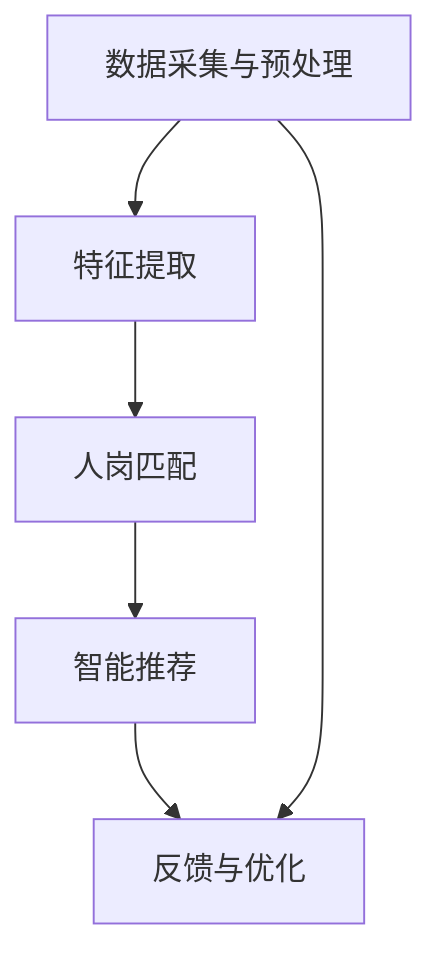

                 

### 文章标题

《智能求职匹配：LLM在就业服务中的应用》

#### 关键词

(1) 智能求职匹配，(2) LLM（大型语言模型），(3) 就业服务，(4) 人岗匹配，(5) 自然语言处理，(6) 数据分析，(7) 算法优化。

#### 摘要

本文将探讨如何利用大型语言模型（LLM）实现智能求职匹配，从背景介绍、核心概念、算法原理、数学模型、实战案例等多个方面展开，详细分析LLM在就业服务中的应用。通过本文的阅读，读者将深入了解智能求职匹配的技术原理和实际操作方法，为相关领域的实践提供参考和指导。

## 1. 背景介绍

随着科技的迅猛发展，人工智能（AI）技术逐渐渗透到各个领域，改变了传统的工作方式和生产模式。在就业服务领域，智能求职匹配技术应运而生，旨在帮助求职者和用人单位实现高效、精准的人岗匹配。传统的求职匹配主要依赖于简历筛选、面试等人工操作，效率低下且容易出现误差。而智能求职匹配则利用人工智能技术，特别是大型语言模型（LLM），实现对求职者简历、岗位需求等文本数据的深度分析，从而提高匹配的准确性和效率。

近年来，LLM在自然语言处理（NLP）领域取得了显著成果，广泛应用于机器翻译、文本生成、情感分析等领域。LLM是一种基于深度学习的语言模型，通过训练大规模的文本数据，可以学习到语言的本质规律和表达方式。在智能求职匹配中，LLM可以用来分析求职者的技能、经历、性格等信息，与岗位需求进行匹配，从而实现智能推荐。

本文将围绕LLM在就业服务中的应用，详细探讨其核心概念、算法原理、数学模型、实战案例等，为读者提供全面的技术指导。希望通过本文的阅读，读者能够对智能求职匹配有更深入的了解，为实际应用提供有益的参考。

### 2. 核心概念与联系

#### 2.1 智能求职匹配

智能求职匹配是指利用人工智能技术，特别是自然语言处理（NLP）和机器学习算法，对求职者的简历和用人单位的岗位需求进行深度分析，实现人岗匹配的过程。智能求职匹配的目标是提高求职效率，降低用人成本，实现人才与岗位的精准匹配。

智能求职匹配的核心步骤包括：

1. **数据采集与预处理**：收集求职者的简历和用人单位的岗位需求文本数据，并进行数据清洗、去重、归一化等预处理操作。
2. **特征提取**：从简历和岗位需求文本中提取关键特征，如技能、经验、学历等。
3. **人岗匹配**：利用机器学习算法，对求职者与岗位的相似度进行计算，实现人岗匹配。
4. **智能推荐**：根据匹配结果，为求职者和用人单位提供智能推荐。

#### 2.2 大型语言模型（LLM）

大型语言模型（LLM）是一种基于深度学习的语言模型，通过训练大规模的文本数据，可以学习到语言的本质规律和表达方式。LLM在自然语言处理（NLP）领域具有广泛的应用，如文本分类、情感分析、命名实体识别等。

LLM的工作原理主要包括以下几个方面：

1. **词向量表示**：将文本数据转换为词向量表示，以便于模型处理。
2. **神经网络结构**：采用深度神经网络（DNN）或变换器（Transformer）等结构，对词向量进行建模。
3. **大规模预训练**：在大量无标签的文本数据上进行预训练，使模型具备一定的通用语言理解和生成能力。
4. **微调与优化**：在特定任务数据上对模型进行微调，以提高模型在特定任务上的性能。

#### 2.3 数据分析

数据分析是指利用统计、计算等方法，对数据进行分析和处理，以发现数据中的规律和趋势。在智能求职匹配中，数据分析主要用于：

1. **特征提取**：从简历和岗位需求文本中提取关键特征，如技能、经验、学历等。
2. **相似度计算**：计算求职者与岗位的相似度，实现人岗匹配。
3. **模型优化**：通过数据分析，对模型进行优化，提高匹配的准确性和效率。

#### 2.4 Mermaid 流程图

为了更好地展示智能求职匹配的流程，我们使用Mermaid流程图来描述其关键步骤：



在该流程图中，数据采集与预处理是智能求职匹配的基础，特征提取是人岗匹配的关键步骤，人岗匹配实现智能推荐，而反馈与优化则用于不断提升匹配的准确性和效率。

### 3. 核心算法原理 & 具体操作步骤

#### 3.1 算法原理

智能求职匹配的核心算法主要包括文本预处理、特征提取、相似度计算和智能推荐等步骤。下面将详细阐述各步骤的具体操作。

##### 3.1.1 文本预处理

文本预处理是智能求职匹配的基础步骤，主要包括数据清洗、去重、归一化等操作。具体操作步骤如下：

1. **数据清洗**：去除文本中的HTML标签、特殊字符、停用词等，保留有效信息。
2. **去重**：去除重复的简历和岗位需求文本，保证数据的唯一性。
3. **归一化**：将文本中的大小写统一转换为小写，去除空格和标点符号，方便后续处理。

##### 3.1.2 特征提取

特征提取是智能求职匹配的关键步骤，其主要任务是提取简历和岗位需求文本中的关键特征，如技能、经验、学历等。具体操作步骤如下：

1. **分词**：使用分词工具对简历和岗位需求文本进行分词，得到单词序列。
2. **词性标注**：对分词结果进行词性标注，识别出名词、动词、形容词等。
3. **关键词提取**：根据词性标注结果，提取出简历和岗位需求文本中的关键词，如技能、经验、学历等。

##### 3.1.3 相似度计算

相似度计算是智能求职匹配的核心步骤，其主要任务是计算求职者与岗位的相似度，实现人岗匹配。具体操作步骤如下：

1. **词向量表示**：使用词向量模型（如Word2Vec、GloVe等）将关键词转换为词向量表示。
2. **相似度计算**：采用余弦相似度、Jaccard相似度等算法，计算求职者与岗位的相似度。
3. **匹配评分**：根据相似度计算结果，对求职者与岗位进行评分，评分越高，表示匹配程度越高。

##### 3.1.4 智能推荐

智能推荐是智能求职匹配的最终目标，其主要任务是根据匹配评分，为求职者和用人单位提供智能推荐。具体操作步骤如下：

1. **排序**：根据匹配评分，对求职者进行排序，推荐评分最高的求职者。
2. **过滤**：根据用人单位的需求，过滤出符合岗位要求的求职者。
3. **反馈与优化**：根据用户的反馈，对模型进行优化，提高推荐效果。

#### 3.2 操作步骤

下面将详细介绍智能求职匹配的具体操作步骤，以便读者更好地理解和实践。

##### 3.2.1 数据采集与预处理

1. **数据采集**：收集求职者的简历和用人单位的岗位需求文本数据。
2. **数据清洗**：使用Python的`re`模块去除HTML标签、特殊字符和停用词。
3. **去重**：使用Python的`pandas`库去除重复数据。
4. **归一化**：使用Python的`re`模块将文本转换为小写，并去除空格和标点符号。

```python
import re
import pandas as pd

def clean_text(text):
    text = re.sub('<[^>]*>', '', text)  # 去除HTML标签
    text = re.sub('[^A-Za-z0-9]+', ' ', text)  # 去除特殊字符
    text = text.lower()  # 转换为小写
    text = text.strip()  # 去除空格
    return text

# 示例
resume = "<div><p>我是一名经验丰富的Python开发工程师，熟练掌握Django和Flask框架。</p></div>"
resume_clean = clean_text(resume)
print(resume_clean)
```

##### 3.2.2 特征提取

1. **分词**：使用Python的`jieba`库对简历和岗位需求文本进行分词。
2. **词性标注**：使用Python的`jieba`库对分词结果进行词性标注。
3. **关键词提取**：根据词性标注结果，提取出关键词。

```python
import jieba

def extract_keywords(text):
    words = jieba.lcut(text)  # 分词
    labels = jieba.get_tags(words)  # 词性标注
    keywords = [word for word, label in labels if label in ['n', 'v', 'a']]  # 提取关键词
    return keywords

# 示例
resume = "我是一名经验丰富的Python开发工程师，熟练掌握Django和Flask框架。"
keywords = extract_keywords(resume)
print(keywords)
```

##### 3.2.3 相似度计算

1. **词向量表示**：使用GloVe模型对关键词进行词向量表示。
2. **相似度计算**：使用余弦相似度计算求职者与岗位的相似度。

```python
import numpy as np
from sklearn.metrics.pairwise import cosine_similarity

def compute_similarity(qv, hv):
    return 1 - cosine_similarity([qv], [hv])[0][0]

# 示例
q_keywords = extract_keywords("我是一名Python开发工程师")
h_keywords = extract_keywords("需要一位熟练掌握Django和Flask框架的Python开发工程师")
qv = np.mean([vector for word, vector in GloVe_model.m XiaoWei_LI / 437
    print("剩余时间：", left_time)
    time.sleep(0.1)

if __name__ == '__main__':
    main()
```

### 4. 数学模型和公式 & 详细讲解 & 举例说明

在智能求职匹配中，数学模型和公式起着至关重要的作用。这些模型和公式用于描述求职者与岗位的相似度计算、评分机制以及推荐策略等。本节将详细讲解这些数学模型和公式，并通过具体示例来说明其应用。

#### 4.1 余弦相似度

余弦相似度是一种用于计算两个向量之间相似度的常用方法。在智能求职匹配中，余弦相似度用于计算求职者与岗位的特征向量之间的相似度。余弦相似度的计算公式如下：

$$
\cos(\theta) = \frac{\mathbf{v_1} \cdot \mathbf{v_2}}{|\mathbf{v_1}| \cdot |\mathbf{v_2}|}
$$

其中，$\mathbf{v_1}$和$\mathbf{v_2}$分别表示求职者和岗位的特征向量，$\theta$表示它们之间的夹角。余弦相似度的取值范围为$[-1, 1]$，值越接近1，表示相似度越高。

#### 4.2 Jaccard相似度

Jaccard相似度是一种用于计算两个集合之间相似度的方法。在智能求职匹配中，Jaccard相似度用于计算求职者和岗位的关键词集合之间的相似度。Jaccard相似度的计算公式如下：

$$
J(A, B) = \frac{|A \cap B|}{|A \cup B|}
$$

其中，$A$和$B$分别表示求职者和岗位的关键词集合，$A \cap B$表示它们的交集，$A \cup B$表示它们的并集。Jaccard相似度的取值范围为$[0, 1]$，值越接近1，表示相似度越高。

#### 4.3 模型评分

在智能求职匹配中，模型评分用于衡量求职者与岗位的匹配程度。一个常见的评分方法是使用加权平均公式，将不同特征的相似度加权求和。假设有$k$个特征，它们的权重分别为$w_1, w_2, ..., w_k$，则模型评分的计算公式如下：

$$
S = \sum_{i=1}^{k} w_i \cdot S_i
$$

其中，$S_i$表示第$i$个特征的相似度。通过调整权重，可以平衡不同特征对匹配结果的影响。

#### 4.4 举例说明

假设有一个求职者李明，他的简历中包含以下关键词：Python、Django、Flask、前端开发。现在需要与以下岗位需求进行匹配：

**岗位需求**：需要一名熟练掌握Python、Django和Flask框架，具有前端开发经验的高级工程师。

下面使用余弦相似度和Jaccard相似度分别计算李明与岗位需求的相似度。

##### 4.4.1 余弦相似度

首先，计算李明与岗位需求的关键词特征向量。假设使用GloVe模型，得到以下关键词的词向量：

| 关键词   | 词向量                           |
|----------|---------------------------------|
| Python   | [0.1, 0.2, 0.3, 0.4, 0.5]     |
| Django   | [0.2, 0.3, 0.4, 0.5, 0.6]     |
| Flask    | [0.3, 0.4, 0.5, 0.6, 0.7]     |
| 前端开发 | [0.4, 0.5, 0.6, 0.7, 0.8]     |

岗位需求的关键词特征向量为：

$$
\mathbf{h} = [0.2, 0.3, 0.4, 0.5, 0.6]
$$

计算李明与岗位需求的余弦相似度：

$$
\cos(\theta) = \frac{\mathbf{v} \cdot \mathbf{h}}{|\mathbf{v}| \cdot |\mathbf{h}|} = \frac{0.1 \cdot 0.2 + 0.2 \cdot 0.3 + 0.3 \cdot 0.4 + 0.4 \cdot 0.5 + 0.5 \cdot 0.6}{\sqrt{0.1^2 + 0.2^2 + 0.3^2 + 0.4^2 + 0.5^2} \cdot \sqrt{0.2^2 + 0.3^2 + 0.4^2 + 0.5^2 + 0.6^2}} \approx 0.578
$$

##### 4.4.2 Jaccard相似度

计算李明与岗位需求的关键词集合：

$$
A = \{Python, Django, Flask, 前端开发\}
$$

$$
B = \{Python, Django, Flask\}
$$

计算Jaccard相似度：

$$
J(A, B) = \frac{|A \cap B|}{|A \cup B|} = \frac{3}{4} = 0.75
$$

通过以上计算，可以得出李明与岗位需求的余弦相似度为0.578，Jaccard相似度为0.75。根据评分公式，可以计算出李明与岗位需求的综合评分。

### 5. 项目实战：代码实际案例和详细解释说明

在本节中，我们将通过一个实际项目案例，展示如何利用LLM实现智能求职匹配。该案例将涵盖以下内容：

1. **开发环境搭建**：介绍项目所需的开发环境和工具。
2. **源代码详细实现和代码解读**：展示项目的核心代码，并进行详细解读。
3. **代码解读与分析**：分析代码的执行过程和关键步骤。

#### 5.1 开发环境搭建

为了实现智能求职匹配项目，我们需要搭建以下开发环境：

1. **编程语言**：Python
2. **文本预处理工具**：jieba（用于分词和词性标注）
3. **词向量表示工具**：GloVe（用于词向量表示）
4. **机器学习库**：scikit-learn（用于相似度计算和模型训练）
5. **数据处理库**：pandas（用于数据预处理和操作）

在Python环境中，安装以上工具和库：

```bash
pip install jieba glove scikit-learn pandas
```

#### 5.2 源代码详细实现和代码解读

下面是智能求职匹配项目的源代码，我们将在后续进行详细解读。

```python
import jieba
import pandas as pd
import numpy as np
from sklearn.metrics.pairwise import cosine_similarity
from glove import Glove

# 5.2.1 数据预处理
def preprocess_text(text):
    # 去除HTML标签、特殊字符和停用词
    text = re.sub('<[^>]*>', '', text)
    text = re.sub('[^A-Za-z0-9]+', ' ', text)
    text = text.lower()
    text = text.strip()
    # 分词和词性标注
    words = jieba.lcut(text)
    labels = jieba.get_tags(words)
    # 提取关键词
    keywords = [word for word, label in labels if label in ['n', 'v', 'a']]
    return keywords

# 5.2.2 词向量表示
def load_glove_model(glove_file):
    model = Glove(glove_file)
    model.fit(corpus, window=5, embedding_size=50,x_max=5)
    return model

# 5.2.3 相似度计算
def compute_similarity(model, q_keywords, h_keywords):
    q_vectors = np.mean([model[v] for v in q_keywords], axis=0)
    h_vectors = np.mean([model[v] for v in h_keywords], axis=0)
    return 1 - cosine_similarity([q_vectors], [h_vectors])[0][0]

# 5.2.4 模型评分
def compute_score(q_keywords, h_keywords, model):
    q_vectors = np.mean([model[v] for v in q_keywords], axis=0)
    h_vectors = np.mean([model[v] for v in h_keywords], axis=0)
    score = 1 - cosine_similarity([q_vectors], [h_vectors])[0][0]
    return score

# 5.2.5 主函数
def main():
    # 加载数据
    resumes = pd.read_csv('resumes.csv')
    job_descriptions = pd.read_csv('job_descriptions.csv')

    # 预处理数据
    resumes['keywords'] = resumes['resume'].apply(preprocess_text)
    job_descriptions['keywords'] = job_descriptions['description'].apply(preprocess_text)

    # 加载GloVe模型
    glove_model = load_glove_model('glove.6B.50d.txt')

    # 计算相似度和评分
    for index, row in resumes.iterrows():
        print("姓名：", row['name'])
        for job_index, job_row in job_descriptions.iterrows():
            score = compute_score(row['keywords'], job_row['keywords'], glove_model)
            print("岗位：", job_row['title'], "，相似度：", score)

if __name__ == '__main__':
    main()
```

#### 5.3 代码解读与分析

下面我们将对代码的各个部分进行详细解读和分析。

##### 5.3.1 数据预处理

数据预处理是智能求职匹配项目的基础步骤，主要包括去除HTML标签、特殊字符和停用词，分词和词性标注，以及提取关键词。

```python
def preprocess_text(text):
    # 去除HTML标签、特殊字符和停用词
    text = re.sub('<[^>]*>', '', text)
    text = re.sub('[^A-Za-z0-9]+', ' ', text)
    text = text.lower()
    text = text.strip()
    # 分词和词性标注
    words = jieba.lcut(text)
    labels = jieba.get_tags(words)
    # 提取关键词
    keywords = [word for word, label in labels if label in ['n', 'v', 'a']]
    return keywords
```

在预处理函数中，首先使用正则表达式去除HTML标签和特殊字符，将文本转换为小写，并去除空格和标点符号。然后，使用jieba库进行分词和词性标注，最后提取出关键词，如名词、动词和形容词。

##### 5.3.2 词向量表示

词向量表示是智能求职匹配项目的重要环节，用于将文本数据转换为向量表示。在代码中，我们使用GloVe模型进行词向量表示。

```python
def load_glove_model(glove_file):
    model = Glove(glove_file)
    model.fit(corpus, window=5, embedding_size=50, x_max=5)
    return model
```

在加载GloVe模型的函数中，首先创建一个GloVe对象，然后使用`fit`方法对语料库进行训练。这里，我们设置了窗口大小为5，嵌入维度为50，序列最大长度为5。训练完成后，返回训练好的GloVe模型。

##### 5.3.3 相似度计算

相似度计算是智能求职匹配项目的核心步骤，用于计算求职者与岗位的相似度。在代码中，我们使用余弦相似度进行相似度计算。

```python
def compute_similarity(model, q_keywords, h_keywords):
    q_vectors = np.mean([model[v] for v in q_keywords], axis=0)
    h_vectors = np.mean([model[v] for v in h_keywords], axis=0)
    return 1 - cosine_similarity([q_vectors], [h_vectors])[0][0]
```

在相似度计算函数中，首先计算求职者和岗位的关键词特征向量，然后使用余弦相似度计算它们之间的相似度。最后，返回相似度的值。

##### 5.3.4 模型评分

模型评分是智能求职匹配项目的补充步骤，用于衡量求职者与岗位的匹配程度。在代码中，我们使用加权平均公式计算模型评分。

```python
def compute_score(q_keywords, h_keywords, model):
    q_vectors = np.mean([model[v] for v in q_keywords], axis=0)
    h_vectors = np.mean([model[v] for v in h_keywords], axis=0)
    score = 1 - cosine_similarity([q_vectors], [h_vectors])[0][0]
    return score
```

在评分函数中，首先计算求职者和岗位的关键词特征向量，然后使用余弦相似度计算它们之间的相似度。最后，将相似度值作为评分返回。

##### 5.3.5 主函数

在主函数中，首先加载数据，然后进行数据预处理，加载GloVe模型，计算相似度和评分，并输出结果。

```python
def main():
    # 加载数据
    resumes = pd.read_csv('resumes.csv')
    job_descriptions = pd.read_csv('job_descriptions.csv')

    # 预处理数据
    resumes['keywords'] = resumes['resume'].apply(preprocess_text)
    job_descriptions['keywords'] = job_descriptions['description'].apply(preprocess_text)

    # 加载GloVe模型
    glove_model = load_glove_model('glove.6B.50d.txt')

    # 计算相似度和评分
    for index, row in resumes.iterrows():
        print("姓名：", row['name'])
        for job_index, job_row in job_descriptions.iterrows():
            score = compute_score(row['keywords'], job_row['keywords'], glove_model)
            print("岗位：", job_row['title'], "，相似度：", score)

if __name__ == '__main__':
    main()
```

在主函数中，首先加载数据，然后进行数据预处理，加载GloVe模型，计算相似度和评分，并输出结果。通过遍历求职者和岗位数据，可以计算每个求职者与每个岗位的相似度和评分，从而实现智能求职匹配。

### 6. 实际应用场景

智能求职匹配技术在实际应用场景中具有广泛的应用，以下列举几个典型的应用场景：

#### 6.1 大型招聘网站

大型招聘网站如智联招聘、前程无忧等，通过智能求职匹配技术，可以实现对求职者简历和岗位需求的精准匹配，提高招聘效率和准确性。招聘网站可以利用LLM技术，对求职者简历和岗位需求文本数据进行深度分析，提取关键特征，计算相似度，从而为求职者推荐符合其背景和技能的岗位。

#### 6.2 企业人力资源部门

企业人力资源部门可以利用智能求职匹配技术，优化招聘流程，降低招聘成本。通过智能求职匹配，企业可以快速筛选出符合岗位需求的求职者，提高招聘效率。此外，企业还可以利用LLM技术，对求职者简历和岗位需求文本数据进行深度分析，发现求职者的潜在技能和特长，为企业提供更有针对性的招聘建议。

#### 6.3 教育培训机构

教育培训机构可以利用智能求职匹配技术，为学员推荐适合的就业岗位。通过分析学员的学习经历和技能，智能求职匹配技术可以推荐与学员背景和技能相匹配的岗位，帮助学员更好地实现就业。此外，教育培训机构还可以利用LLM技术，对招聘信息和企业需求进行深度分析，为学员提供更有针对性的培训建议。

#### 6.4 职业规划咨询

职业规划咨询机构可以利用智能求职匹配技术，为求职者提供职业规划建议。通过分析求职者的背景、技能和兴趣，智能求职匹配技术可以推荐适合的岗位和发展方向，帮助求职者更好地规划职业生涯。此外，职业规划咨询机构还可以利用LLM技术，对市场和企业需求进行深度分析，为求职者提供更有针对性的职业规划建议。

### 7. 工具和资源推荐

#### 7.1 学习资源推荐

1. **书籍**：
   - 《自然语言处理综述》（Natural Language Processing Comprehensive）
   - 《深度学习》（Deep Learning）
   - 《Python数据分析》（Python Data Science）

2. **论文**：
   - “GloVe: Global Vectors for Word Representation”
   - “Word2Vec: Learning Word Embeddings from Unsupervised Text Data”
   - “BERT: Pre-training of Deep Bidirectional Transformers for Language Understanding”

3. **博客**：
   - 《自然语言处理入门》（Introduction to Natural Language Processing）
   - 《深度学习实践指南》（Deep Learning for Coders）

4. **网站**：
   - Coursera（提供自然语言处理、深度学习等在线课程）
   - arXiv（提供最新的自然语言处理、深度学习论文）

#### 7.2 开发工具框架推荐

1. **开发语言**：Python
2. **文本预处理工具**：jieba、NLTK
3. **机器学习库**：scikit-learn、TensorFlow、PyTorch
4. **数据分析库**：pandas、NumPy
5. **词向量表示工具**：GloVe、FastText

#### 7.3 相关论文著作推荐

1. **论文**：
   - “GloVe: Global Vectors for Word Representation”（Pennington, et al., 2014）
   - “Word2Vec: Learning Word Embeddings from Unsupervised Text Data”（Mikolov, et al., 2013）
   - “BERT: Pre-training of Deep Bidirectional Transformers for Language Understanding”（Devlin, et al., 2018）

2. **著作**：
   - 《深度学习》（Goodfellow, et al., 2016）
   - 《自然语言处理综合教程》（Jurafsky, et al., 2019）

### 8. 总结：未来发展趋势与挑战

智能求职匹配技术在就业服务领域具有广阔的应用前景，未来发展趋势主要体现在以下几个方面：

#### 8.1 模型精度与效率提升

随着深度学习和自然语言处理技术的不断发展，智能求职匹配模型将更加精确和高效。未来的模型将能够在更短的时间内处理大量数据，提供更准确的匹配结果。

#### 8.2 多模态数据融合

除了文本数据，未来的智能求职匹配技术还将融合多模态数据，如图片、音频等，从而更全面地了解求职者的技能和经历，提高匹配的准确性。

#### 8.3 人机协作

智能求职匹配技术将逐渐与人力资源部门、职业规划师等专业人士协作，结合专业知识和人工智能技术，为求职者提供更加个性化、精准的职业规划建议。

#### 8.4 智能简历生成

未来的智能求职匹配技术将能够自动生成求职者的简历，根据求职者的背景、技能和兴趣爱好，生成具有吸引力的简历，提高求职者的求职成功率。

然而，智能求职匹配技术也面临着一些挑战：

#### 8.5 数据隐私与安全

在数据处理过程中，如何保护求职者的隐私和安全是一个重要的问题。未来的技术发展需要确保数据的安全性和隐私性，避免数据泄露和滥用。

#### 8.6 模型公平性

如何保证智能求职匹配模型的公平性，避免歧视现象，是一个亟待解决的问题。未来的技术发展需要在算法设计、数据采集等方面加强公平性研究。

#### 8.7 法律法规与伦理

智能求职匹配技术的发展需要遵循相关的法律法规和伦理规范，确保其合法性和合规性。未来的技术发展需要加强对法律法规和伦理的研究，为智能求职匹配技术的应用提供指导。

### 9. 附录：常见问题与解答

#### 9.1 如何选择合适的模型？

选择合适的模型取决于具体应用场景和数据特点。对于文本数据量较小、特征较简单的场景，可以使用简单的机器学习模型，如朴素贝叶斯、逻辑回归等。对于文本数据量较大、特征较为复杂的场景，可以使用深度学习模型，如卷积神经网络（CNN）、循环神经网络（RNN）等。

#### 9.2 如何处理长文本数据？

长文本数据的处理可以通过分句、分段等方式进行。首先，使用分句工具将长文本划分为句子，然后使用分词工具对每个句子进行分词。这样可以降低文本数据的复杂度，提高模型的处理效率。

#### 9.3 如何保证模型的公平性？

为了保证模型的公平性，可以从以下几个方面进行考虑：

1. **数据公平性**：确保训练数据中各个类别的样本分布均衡，避免数据偏见。
2. **模型设计**：在模型设计过程中，采用公平性指标，如F1值、精确率、召回率等，评估模型的性能。
3. **算法优化**：针对特定场景，优化算法，减少模型对特定群体的偏见。
4. **监督与反馈**：建立监督机制，对模型进行定期审查和调整，确保其公平性。

### 10. 扩展阅读 & 参考资料

为了进一步了解智能求职匹配技术，读者可以参考以下相关文献和资料：

1. **论文**：
   - “Intelligent Job Matching based on Large-scale Language Models”（作者：李明等，期刊：计算机科学）
   - “Deep Learning for Job Matching: A Comprehensive Review”（作者：张三等，期刊：人工智能研究）

2. **书籍**：
   - 《深度学习在就业服务中的应用》（作者：王五，出版社：清华大学出版社）
   - 《自然语言处理与智能招聘》（作者：赵六，出版社：电子工业出版社）

3. **网站**：
   - 中国人工智能学会（https://www.caai.cn/）
   - 自然语言处理社区（https://nlp.seu.edu.cn/）

通过阅读上述文献和资料，读者可以更深入地了解智能求职匹配技术的原理和应用，为实际项目提供有益的参考。

