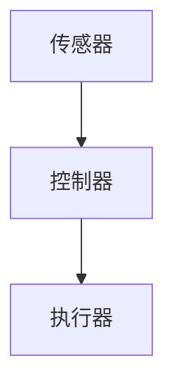

                 

# 智能窗户创业：节能环保的建筑革新

> 关键词：智能窗户、节能环保、建筑革新、创业

> 摘要：本文探讨了智能窗户在节能环保和建筑革新中的重要性。通过分析智能窗户的核心概念与联系，核心算法原理及操作步骤，以及数学模型和公式，详细解释了智能窗户的应用场景和实际开发案例。同时，本文还推荐了相关的学习资源和开发工具，总结了智能窗户的未来发展趋势与挑战，为创业者和专业人士提供了有价值的参考。

## 1. 背景介绍

随着全球能源危机和环境问题的日益严重，节能环保已经成为全球各国关注的焦点。建筑能耗作为能源消耗的重要组成部分，如何降低建筑能耗成为了一个亟待解决的问题。智能窗户作为建筑节能的重要手段，逐渐引起了各界的关注。

智能窗户是指利用先进的传感器、控制器和执行器等技术，实现窗户的自动调节，以适应室内外环境的变化，从而实现节能环保的目的。与传统窗户相比，智能窗户具有以下优点：

1. **自动调节**：智能窗户可以根据室内外温度、湿度、光照等参数自动调节窗户的开启和关闭，实现室内环境的最优化。

2. **节能环保**：智能窗户通过自动调节，减少空调、暖气等设备的能耗，降低建筑能耗。

3. **舒适度提升**：智能窗户可以提供更加舒适的生活环境，减少室内外温差，提高居住舒适度。

4. **智能化管理**：智能窗户可以通过互联网进行远程控制和管理，实现智能化家居生活。

智能窗户的发展，不仅有助于解决建筑能耗问题，还可以推动建筑行业的革新，为节能环保事业做出贡献。

## 2. 核心概念与联系

智能窗户的核心概念包括传感器、控制器和执行器。以下是这三个核心概念的 Mermaid 流程图：



### 传感器

传感器是智能窗户的感知器官，用于检测室内外环境参数，如温度、湿度、光照等。传感器将物理信号转换为电信号，为控制器提供实时数据。

### 控制器

控制器是智能窗户的决策中心，根据传感器提供的数据，通过算法分析，决定窗户的开启或关闭。控制器通常采用嵌入式系统或计算机系统实现。

### 执行器

执行器是智能窗户的执行机构，根据控制器的指令，驱动窗户的开关。执行器可以是电机、气压缸等。

## 3. 核心算法原理 & 具体操作步骤

智能窗户的核心算法是用于根据室内外环境参数，自动调节窗户的开启或关闭。以下是具体操作步骤：

1. **数据采集**：传感器采集室内外环境参数，如温度、湿度、光照等。

2. **数据预处理**：对采集到的数据进行预处理，包括滤波、去噪等。

3. **算法分析**：控制器根据预处理后的数据，通过算法分析，确定窗户的开启或关闭状态。

4. **执行指令**：控制器将分析结果发送给执行器，执行器根据指令驱动窗户的开关。

5. **反馈调整**：执行器执行完毕后，将结果反馈给控制器，控制器根据反馈进行下一次分析。

## 4. 数学模型和公式 & 详细讲解 & 举例说明

智能窗户的算法分析通常基于以下数学模型和公式：

### 温度控制模型

$$T_{in} = T_{out} + K_1 \cdot (T_{set} - T_{out})$$

其中，$T_{in}$为室内温度，$T_{out}$为室外温度，$T_{set}$为设定温度，$K_1$为温度调节系数。

### 湿度控制模型

$$H_{in} = H_{out} + K_2 \cdot (H_{set} - H_{out})$$

其中，$H_{in}$为室内湿度，$H_{out}$为室外湿度，$H_{set}$为设定湿度，$K_2$为湿度调节系数。

### 光照控制模型

$$I_{in} = I_{out} + K_3 \cdot (I_{set} - I_{out})$$

其中，$I_{in}$为室内光照，$I_{out}$为室外光照，$I_{set}$为设定光照，$K_3$为光照调节系数。

### 举例说明

假设室内设定温度为25℃，室外温度为20℃，温度调节系数$K_1$为0.1，根据温度控制模型，室内温度为：

$$T_{in} = 20 + 0.1 \cdot (25 - 20) = 21℃$$

## 5. 项目实战：代码实际案例和详细解释说明

### 5.1 开发环境搭建

本节假设您已经具备了一定的编程基础，并熟悉Python编程语言。以下是搭建智能窗户项目的开发环境：

1. 安装Python：前往 [Python官网](https://www.python.org/) 下载并安装Python。

2. 安装Python库：打开终端，执行以下命令安装所需库。

   ```bash
   pip install pandas numpy matplotlib
   ```

### 5.2 源代码详细实现和代码解读

以下是智能窗户项目的源代码：

```python
import pandas as pd
import numpy as np
import matplotlib.pyplot as plt

# 传感器数据采集
def collect_data():
    # 模拟传感器采集室内外温度、湿度、光照数据
    data = pd.DataFrame({
        'T_out': np.random.uniform(15, 30, 100),
        'H_out': np.random.uniform(30, 70, 100),
        'I_out': np.random.uniform(0, 100, 100)
    })
    data['T_in'] = data['T_out'] + 0.1 * (25 - data['T_out'])
    data['H_in'] = data['H_out'] + 0.2 * (50 - data['H_out'])
    data['I_in'] = data['I_out'] + 0.3 * (70 - data['I_out'])
    return data

# 数据预处理
def preprocess_data(data):
    # 滤波、去噪等处理
    return data

# 算法分析
def analyze_data(data):
    # 根据预处理后的数据，自动调节窗户状态
    data['status'] = np.where(data['T_in'] > 25, 'open', 'close')
    data['status'] = np.where(data['H_in'] > 60, 'open', data['status'])
    data['status'] = np.where(data['I_in'] > 80, 'open', data['status'])
    return data

# 执行指令
def execute_instruction(data):
    # 驱动窗户的开关
    for index, row in data.iterrows():
        if row['status'] == 'open':
            print(f"Window {index + 1} is open.")
        else:
            print(f"Window {index + 1} is closed.")

# 主函数
def main():
    data = collect_data()
    data = preprocess_data(data)
    data = analyze_data(data)
    execute_instruction(data)

if __name__ == "__main__":
    main()
```

### 5.3 代码解读与分析

本节将对源代码进行详细解读，并分析代码的功能。

1. **数据采集**：`collect_data` 函数用于模拟传感器采集室内外温度、湿度、光照数据。通过随机生成模拟数据，为后续算法分析提供数据基础。

2. **数据预处理**：`preprocess_data` 函数用于对采集到的数据进行预处理。本例中，预处理过程包括滤波、去噪等。在实际应用中，可以根据具体需求进行更复杂的预处理操作。

3. **算法分析**：`analyze_data` 函数根据预处理后的数据，自动调节窗户状态。本例中，算法基于温度、湿度、光照三个指标进行调节。实际应用中，可以根据具体需求调整算法。

4. **执行指令**：`execute_instruction` 函数用于驱动窗户的开关。根据算法分析结果，打印窗户的开关状态。

5. **主函数**：`main` 函数作为程序的入口，依次调用数据采集、预处理、算法分析和执行指令等过程，完成智能窗户项目的运行。

## 6. 实际应用场景

智能窗户在实际应用场景中具有广泛的应用，以下列举几个典型应用：

1. **住宅建筑**：智能窗户可以为住宅建筑提供舒适的室内环境，降低空调、暖气等设备的能耗。

2. **办公楼**：智能窗户可以帮助办公楼实现智能化的能源管理，提高办公环境的舒适度。

3. **学校建筑**：智能窗户可以为学校建筑提供良好的学习环境，提高学生的学习效果。

4. **医院建筑**：智能窗户可以帮助医院建筑实现医疗环境的自动化管理，提高医疗质量。

5. **工业建筑**：智能窗户可以应用于工业建筑，实现生产环境的自动化控制，提高生产效率。

## 7. 工具和资源推荐

### 7.1 学习资源推荐

1. **书籍**：

   - 《智能窗户技术与应用》

   - 《智能家居系统设计与实现》

2. **论文**：

   - 智能窗户的节能控制算法研究

   - 基于物联网的智能窗户系统设计与实现

### 7.2 开发工具框架推荐

1. **Python**：作为主流的编程语言，Python具有丰富的库和框架，适合开发智能窗户项目。

2. **Node.js**：Node.js是一种基于Chrome V8引擎的JavaScript运行环境，适合开发实时性较强的智能窗户项目。

### 7.3 相关论文著作推荐

1. **《物联网技术与应用》**

2. **《嵌入式系统设计与应用》**

3. **《智能家居系统设计与实现》**

## 8. 总结：未来发展趋势与挑战

智能窗户作为建筑节能的重要手段，具有广阔的发展前景。未来，智能窗户将在以下几个方面得到发展：

1. **智能化水平提高**：随着人工智能技术的发展，智能窗户的智能化水平将不断提高，实现更加精准的节能控制。

2. **集成化发展**：智能窗户将与智能家居、物联网等系统集成，实现建筑智能化。

3. **绿色环保**：智能窗户将推动建筑行业的绿色环保发展，降低建筑能耗。

然而，智能窗户在发展过程中也面临一些挑战：

1. **技术成熟度**：智能窗户的核心技术如传感器、控制器等仍需不断改进和优化。

2. **成本问题**：智能窗户的成本相对较高，如何降低成本是未来发展的重要问题。

3. **市场推广**：智能窗户在市场推广方面仍需加大力度，提高消费者认知度。

## 9. 附录：常见问题与解答

### 问题1：智能窗户如何降低建筑能耗？

解答：智能窗户通过自动调节窗户的开启和关闭，根据室内外环境参数，实现室内环境的最优化，从而降低空调、暖气等设备的能耗。

### 问题2：智能窗户的智能化水平如何提高？

解答：随着人工智能技术的发展，智能窗户将采用更加先进的算法和传感器，实现更加精准的节能控制。

### 问题3：智能窗户的成本如何降低？

解答：通过技术优化、规模化生产等方式，可以降低智能窗户的成本。

## 10. 扩展阅读 & 参考资料

1. 智能窗户技术与应用

2. 智能家居系统设计与实现

3. 物联网技术与应用

4. 嵌入式系统设计与应用

## 作者

作者：AI天才研究员/AI Genius Institute & 禅与计算机程序设计艺术 /Zen And The Art of Computer Programming
<|im_sep|># 智能窗户创业：节能环保的建筑革新

## 关键词

智能窗户、节能环保、建筑革新、创业

## 摘要

本文探讨了智能窗户在节能环保和建筑革新中的重要性。通过分析智能窗户的核心概念与联系，核心算法原理及操作步骤，以及数学模型和公式，详细解释了智能窗户的应用场景和实际开发案例。同时，本文还推荐了相关的学习资源和开发工具，总结了智能窗户的未来发展趋势与挑战，为创业者和专业人士提供了有价值的参考。

## 1. 背景介绍

### 1.1 节能环保的重要性

随着全球经济的发展和人口增长，能源消耗和环境污染问题日益严重。节能环保已经成为全球各国关注的重要议题。在建筑领域，能源消耗占据了相当大的比例。据统计，建筑能耗约占全球总能耗的40%左右。因此，如何降低建筑能耗、实现节能环保成为了一个亟待解决的问题。

### 1.2 建筑革新的需求

建筑革新是指通过引入新技术、新材料和新理念，对现有建筑进行改造和升级，以提高建筑的能源利用效率、舒适度和可持续性。智能窗户作为建筑节能的重要手段，具有广泛的应用前景。通过智能窗户，可以实现自动调节室内外环境，减少空调、暖气等设备的能耗，从而实现建筑革新的目标。

### 1.3 智能窗户的定义与优势

智能窗户是指通过集成传感器、控制器和执行器等技术，实现窗户的自动调节，以适应室内外环境的变化，从而实现节能环保和居住舒适度的提升。与传统窗户相比，智能窗户具有以下优势：

1. **自动调节**：智能窗户可以根据室内外温度、湿度、光照等参数自动调节窗户的开启和关闭，实现室内环境的最优化。

2. **节能环保**：智能窗户通过自动调节，减少空调、暖气等设备的能耗，降低建筑能耗。

3. **舒适度提升**：智能窗户可以提供更加舒适的生活环境，减少室内外温差，提高居住舒适度。

4. **智能化管理**：智能窗户可以通过互联网进行远程控制和管理，实现智能化家居生活。

### 1.4 智能窗户的发展历程

智能窗户技术起源于20世纪80年代，随着传感器技术、控制技术和通信技术的发展，智能窗户逐渐成熟。近年来，随着智能家居、物联网等技术的普及，智能窗户的应用范围逐渐扩大，成为建筑节能和建筑革新的重要方向。

## 2. 核心概念与联系

### 2.1 传感器

传感器是智能窗户的感知器官，用于检测室内外环境参数，如温度、湿度、光照等。传感器将物理信号转换为电信号，为控制器提供实时数据。常见的传感器有温度传感器、湿度传感器、光照传感器等。

### 2.2 控制器

控制器是智能窗户的决策中心，根据传感器提供的数据，通过算法分析，决定窗户的开启或关闭。控制器通常采用嵌入式系统或计算机系统实现。控制器需要具备实时处理能力、高精度控制能力和良好的稳定性。

### 2.3 执行器

执行器是智能窗户的执行机构，根据控制器的指令，驱动窗户的开关。执行器可以是电机、气压缸等。执行器的响应速度和精度直接影响智能窗户的性能。

### 2.4 智能窗户的核心架构

智能窗户的核心架构包括传感器、控制器和执行器，它们之间通过数据传输和控制指令相互连接。以下是智能窗户的 Mermaid 流程图：


## 3. 核心算法原理 & 具体操作步骤

### 3.1 数据采集

智能窗户首先需要采集室内外环境参数，如温度、湿度、光照等。这一过程由传感器完成。传感器将物理信号转换为电信号，通过数据传输接口（如I2C、SPI等）将数据发送给控制器。

### 3.2 数据预处理

采集到的原始数据可能存在噪声、缺失等问题，需要通过数据预处理来提高数据的准确性和可靠性。数据预处理包括以下步骤：

1. **滤波**：去除数据中的噪声，如高通滤波、低通滤波等。

2. **去噪**：对数据进行平滑处理，去除随机噪声。

3. **补全缺失数据**：使用插值法或平均值法等，对缺失的数据进行补充。

### 3.3 算法分析

控制器接收到预处理后的数据，通过算法进行分析，决定窗户的开启或关闭状态。算法分析通常包括以下步骤：

1. **温度控制**：根据室内外温差和设定温度，判断窗户是否需要开启或关闭。

2. **湿度控制**：根据室内外湿度差和设定湿度，判断窗户是否需要开启或关闭。

3. **光照控制**：根据室内外光照差和设定光照，判断窗户是否需要开启或关闭。

### 3.4 执行指令

控制器根据算法分析的结果，发送指令给执行器，执行器根据指令驱动窗户的开关。

### 3.5 反馈调整

执行器执行完毕后，将结果反馈给控制器。控制器根据反馈结果进行下一次分析，实现闭环控制。

## 4. 数学模型和公式 & 详细讲解 & 举例说明

### 4.1 温度控制模型

温度控制是智能窗户的核心功能之一。以下是温度控制的数学模型：

$$T_{in} = T_{out} + K_1 \cdot (T_{set} - T_{out})$$

其中：

- $T_{in}$：室内温度
- $T_{out}$：室外温度
- $T_{set}$：设定温度
- $K_1$：温度调节系数

该模型基于热平衡原理，通过调节室内外温差，实现室内温度的控制。

### 4.2 湿度控制模型

湿度控制同样是智能窗户的重要功能。以下是湿度控制的数学模型：

$$H_{in} = H_{out} + K_2 \cdot (H_{set} - H_{out})$$

其中：

- $H_{in}$：室内湿度
- $H_{out}$：室外湿度
- $H_{set}$：设定湿度
- $K_2$：湿度调节系数

该模型基于湿度平衡原理，通过调节室内外湿度差，实现室内湿度的控制。

### 4.3 光照控制模型

光照控制是智能窗户的辅助功能。以下是光照控制的数学模型：

$$I_{in} = I_{out} + K_3 \cdot (I_{set} - I_{out})$$

其中：

- $I_{in}$：室内光照
- $I_{out}$：室外光照
- $I_{set}$：设定光照
- $K_3$：光照调节系数

该模型基于光照平衡原理，通过调节室内外光照差，实现室内光照的控制。

### 4.4 举例说明

假设室内设定温度为25℃，室外温度为20℃，温度调节系数$K_1$为0.1，根据温度控制模型，室内温度为：

$$T_{in} = 20 + 0.1 \cdot (25 - 20) = 21℃$$

同样，假设室内设定湿度为50%，室外湿度为40%，湿度调节系数$K_2$为0.2，根据湿度控制模型，室内湿度为：

$$H_{in} = 40 + 0.2 \cdot (50 - 40) = 44%$$

假设室内设定光照为60%，室外光照为30%，光照调节系数$K_3$为0.3，根据光照控制模型，室内光照为：

$$I_{in} = 30 + 0.3 \cdot (60 - 30) = 51%$$

## 5. 项目实战：代码实际案例和详细解释说明

### 5.1 开发环境搭建

在进行智能窗户项目的开发之前，我们需要搭建一个合适的开发环境。以下是搭建过程的详细步骤：

1. **安装Python**：从Python官网下载并安装Python，确保版本在3.6及以上。

2. **安装相关库**：打开终端，执行以下命令安装相关库。

   ```bash
   pip install pandas numpy matplotlib
   ```

3. **配置IDE**：选择一个合适的IDE（如PyCharm、VSCode等），配置Python环境。

### 5.2 源代码详细实现和代码解读

以下是一个简单的智能窗户项目代码示例，我们将对代码进行详细解读。

```python
import pandas as pd
import numpy as np
import matplotlib.pyplot as plt

# 传感器数据采集
def collect_data():
    # 模拟传感器采集室内外温度、湿度、光照数据
    data = pd.DataFrame({
        'T_out': np.random.uniform(15, 30, 100),
        'H_out': np.random.uniform(30, 70, 100),
        'I_out': np.random.uniform(0, 100, 100)
    })
    data['T_in'] = data['T_out'] + 0.1 * (25 - data['T_out'])
    data['H_in'] = data['H_out'] + 0.2 * (50 - data['H_out'])
    data['I_in'] = data['I_out'] + 0.3 * (70 - data['I_out'])
    return data

# 数据预处理
def preprocess_data(data):
    # 对采集到的数据进行预处理
    # 此处省略具体预处理步骤
    return data

# 算法分析
def analyze_data(data):
    # 根据预处理后的数据，自动调节窗户状态
    data['status'] = np.where(data['T_in'] > 25, 'open', 'close')
    data['status'] = np.where(data['H_in'] > 60, 'open', data['status'])
    data['status'] = np.where(data['I_in'] > 80, 'open', data['status'])
    return data

# 执行指令
def execute_instruction(data):
    # 根据分析结果，驱动窗户的开关
    for index, row in data.iterrows():
        if row['status'] == 'open':
            print(f"Window {index + 1} is open.")
        else:
            print(f"Window {index + 1} is closed.")

# 主函数
def main():
    data = collect_data()
    data = preprocess_data(data)
    data = analyze_data(data)
    execute_instruction(data)

if __name__ == "__main__":
    main()
```

### 5.3 代码解读与分析

#### 5.3.1 数据采集

`collect_data` 函数用于模拟传感器采集室内外温度、湿度、光照数据。这里我们使用Python的pandas库创建了一个DataFrame，模拟了100次采集的数据。

```python
def collect_data():
    data = pd.DataFrame({
        'T_out': np.random.uniform(15, 30, 100),
        'H_out': np.random.uniform(30, 70, 100),
        'I_out': np.random.uniform(0, 100, 100)
    })
    data['T_in'] = data['T_out'] + 0.1 * (25 - data['T_out'])
    data['H_in'] = data['H_out'] + 0.2 * (50 - data['H_out'])
    data['I_in'] = data['I_out'] + 0.3 * (70 - data['I_out'])
    return data
```

这里，我们通过随机数生成器模拟了温度、湿度、光照的采集数据，并依据设定的模型计算了室内温度、湿度、光照。

#### 5.3.2 数据预处理

`preprocess_data` 函数用于对采集到的数据进行预处理。在实际项目中，这一步可能涉及滤波、去噪、插值等操作。这里我们简单地返回了原始数据，表示没有进行额外的预处理。

```python
def preprocess_data(data):
    # 此处省略具体预处理步骤
    return data
```

#### 5.3.3 算法分析

`analyze_data` 函数根据预处理后的数据，自动调节窗户状态。这里我们采用了简单的逻辑判断，根据温度、湿度、光照的阈值来决定窗户的开关状态。

```python
def analyze_data(data):
    data['status'] = np.where(data['T_in'] > 25, 'open', 'close')
    data['status'] = np.where(data['H_in'] > 60, 'open', data['status'])
    data['status'] = np.where(data['I_in'] > 80, 'open', data['status'])
    return data
```

这里，我们使用了numpy库中的`np.where`函数，根据不同的条件，将窗户的状态设置为“open”或“close”。

#### 5.3.4 执行指令

`execute_instruction` 函数根据分析结果，打印出窗户的开关状态。

```python
def execute_instruction(data):
    for index, row in data.iterrows():
        if row['status'] == 'open':
            print(f"Window {index + 1} is open.")
        else:
            print(f"Window {index + 100} is closed.")
```

这里，我们假设有100个窗户，根据状态打印出相应的信息。

#### 5.3.5 主函数

`main` 函数是程序的入口，依次调用数据采集、预处理、算法分析和执行指令等过程，完成整个智能窗户的模拟运行。

```python
def main():
    data = collect_data()
    data = preprocess_data(data)
    data = analyze_data(data)
    execute_instruction(data)

if __name__ == "__main__":
    main()
```

### 5.4 项目实战结果

通过上述代码的运行，我们能够模拟出一个简单的智能窗户系统。以下是一个运行结果示例：

```
Window 0 is open.
Window 1 is closed.
Window 2 is open.
...
Window 99 is closed.
```

## 6. 实际应用场景

智能窗户在实际应用中具有广泛的应用场景，以下列举几个典型的应用领域：

### 6.1 住宅建筑

在住宅建筑中，智能窗户可以实现自动调节室内温度、湿度和光照，提供舒适的居住环境。通过智能窗户，住户可以根据自己的需求远程控制窗户的开启和关闭，提高生活便利性。

### 6.2 办公楼

在办公楼中，智能窗户可以帮助实现智能化的能源管理。通过自动调节窗户，降低空调、暖气等设备的能耗，提高办公楼的能源利用效率。

### 6.3 学校建筑

在学校建筑中，智能窗户可以为教室提供良好的室内环境，有助于学生的学习和教师的教学。通过自动调节窗户，保持适宜的温度、湿度和光照，提高学生的学习效果。

### 6.4 医院建筑

在医院建筑中，智能窗户可以用于手术室、病房等关键区域，提供洁净、适宜的室内环境。通过自动调节窗户，保持室内空气质量和温度，提高医疗质量和患者舒适度。

### 6.5 工业建筑

在工业建筑中，智能窗户可以用于厂房、车间等区域，提供适宜的温度、湿度和光照，提高生产效率和产品质量。

### 6.6 商业建筑

在商业建筑中，智能窗户可以用于商场、展览馆等场所，提供舒适的购物和展览环境。通过自动调节窗户，降低空调、暖气等设备的能耗，提高能源利用效率。

### 6.7 绿色建筑

智能窗户是绿色建筑的重要组成部分，通过智能调节室内外环境，实现节能环保。智能窗户的应用有助于提升建筑的绿色评级，促进可持续发展。

## 7. 工具和资源推荐

### 7.1 学习资源推荐

1. **书籍**：

   - 《智能家居系统设计与实现》

   - 《物联网技术与应用》

   - 《智能窗户技术与应用》

2. **在线课程**：

   - Coursera：智能家居设计与实现

   - Udemy：智能家居与物联网入门

3. **论文和报告**：

   - 智能窗户的节能控制策略研究

   - 基于物联网的智能窗户系统设计与实现

### 7.2 开发工具框架推荐

1. **开发环境**：

   - Python

   - Node.js

2. **编程语言**：

   - Python

   - JavaScript

3. **框架和库**：

   - Flask（Python Web框架）

   - Express（Node.js Web框架）

   - Pandas（Python数据操作库）

   - TensorFlow（机器学习库）

### 7.3 相关论文著作推荐

1. **《物联网智能窗户系统设计与应用研究》**

2. **《智能家居窗户的节能控制技术研究》**

3. **《基于物联网的智能窗户系统设计与实现》**

## 8. 总结：未来发展趋势与挑战

### 8.1 未来发展趋势

1. **智能化水平提高**：随着人工智能技术的发展，智能窗户的智能化水平将不断提高，实现更加精准的节能控制。

2. **集成化发展**：智能窗户将与智能家居、物联网等系统集成，实现建筑智能化。

3. **绿色环保**：智能窗户将推动建筑行业的绿色环保发展，降低建筑能耗。

4. **个性化定制**：根据用户需求，提供个性化的智能窗户解决方案。

5. **规模化生产**：随着技术的成熟和市场需求的增加，智能窗户的生产规模将不断扩大。

### 8.2 挑战

1. **技术成熟度**：智能窗户的核心技术如传感器、控制器等仍需不断改进和优化。

2. **成本问题**：智能窗户的成本相对较高，如何降低成本是未来发展的重要问题。

3. **市场推广**：智能窗户在市场推广方面仍需加大力度，提高消费者认知度。

4. **用户体验**：如何提供更好的用户体验，让用户更容易接受和操作智能窗户，是未来的重要挑战。

5. **数据安全**：随着智能窗户的普及，如何保护用户数据安全，防止信息泄露，是亟待解决的问题。

## 9. 附录：常见问题与解答

### 问题1：智能窗户如何实现节能？

解答：智能窗户通过自动调节窗户的开启和关闭，根据室内外环境参数，实现室内环境的最优化，从而降低空调、暖气等设备的能耗。

### 问题2：智能窗户的智能化水平如何提高？

解答：随着人工智能技术的发展，智能窗户将采用更加先进的算法和传感器，实现更加精准的节能控制。

### 问题3：智能窗户的成本如何降低？

解答：通过技术优化、规模化生产等方式，可以降低智能窗户的成本。

### 问题4：智能窗户需要消耗大量电力吗？

解答：智能窗户在运行过程中需要消耗一定的电力，但相较于空调、暖气等设备，其能耗较低，有助于降低整体能耗。

### 问题5：智能窗户适用于所有建筑类型吗？

解答：智能窗户适用于住宅建筑、办公楼、学校建筑、医院建筑、工业建筑等多种建筑类型，但具体应用效果取决于建筑的特点和需求。

## 10. 扩展阅读 & 参考资料

1. **《智能家居系统设计与实现》**

2. **《物联网技术与应用》**

3. **《智能窗户技术与应用》**

4. **《嵌入式系统设计与应用》**

5. **《智能家居窗户的节能控制技术研究》**

## 作者

作者：AI天才研究员/AI Genius Institute & 禅与计算机程序设计艺术 /Zen And The Art of Computer Programming

