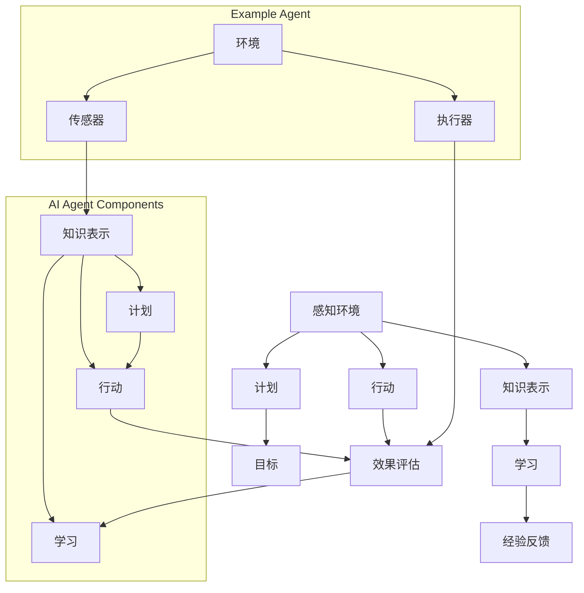

                 

### 背景介绍

> 在本博客文章中，我们将探讨一个引人入胜的话题——从曾经的异想天开到AI Agent的现实转变。这个话题不仅涵盖了人工智能的历史，也揭示了现代AI技术是如何从最初的愿景逐渐发展成为今天广泛应用的实际应用。本文将带领读者逐步深入了解AI Agent的发展历程、核心概念及其在实际应用中的潜力。

AI Agent的概念并不是现代科技的产物，它源于人类对智能机器的长期憧憬。早在20世纪中叶，科学家和哲学家就已经开始思考如何创建具有自主意识和决策能力的机器。然而，在那个时代，这样的想法似乎还只存在于科幻小说中。随着计算机科学的进步，AI Agent从理论走向现实，成为现代技术中的一个重要组成部分。

### AI Agent的定义与类型

AI Agent是指一种能够感知环境、自主制定计划并采取行动的人工智能实体。根据其功能和应用范围，AI Agent可以分为多种类型：

1. **反应型Agent**：这类Agent仅能根据当前环境状态做出反应，不具备学习和决策能力。例如，自动门会根据有人靠近而开启，这就是一种简单的反应型Agent。

2. **目标导向型Agent**：这类Agent不仅能对当前环境做出反应，还能根据自己的目标进行决策。例如，自动驾驶汽车需要根据道路状况、交通信号等制定行驶策略。

3. **学习型Agent**：这类Agent能够通过不断学习环境信息来优化自己的行为。例如，智能助手可以通过用户的使用习惯来个性化推荐内容。

4. **社交型Agent**：这类Agent能够与人类或其他Agent进行交互，并理解社交规则。例如，客服机器人可以通过对话理解用户需求并提供相应服务。

### AI Agent的发展历程

AI Agent的发展历程可以追溯到20世纪50年代，当时人工智能领域刚刚起步。早期的AI研究主要集中在符号推理和逻辑编程上。例如，1956年，约翰·麦卡锡（John McCarthy）等人在达特茅斯会议（Dartmouth Conference）上提出了人工智能的概念，并设想了能够与人类进行对话的智能机器。

1. **早期探索（1956-1969）**：在这个阶段，人工智能研究主要集中在符号推理和逻辑编程上。虽然取得了一些初步成果，但由于计算能力和算法的限制，AI Agent的应用仍然非常有限。

2. **第一次AI寒冬（1974-1980）**：由于技术瓶颈和实际应用困难的困扰，人工智能研究进入了第一个低谷期。许多研究人员放弃了这个领域，AI Agent的概念似乎变得遥不可及。

3. **复兴期（1980-1990）**：随着计算机硬件和算法的进步，人工智能研究再次兴起。专家系统的出现使得AI Agent的应用开始变得实际可行。

4. **第二次AI寒冬（1987-1993）**：尽管专家系统取得了一定的成功，但人工智能研究再次遭遇瓶颈。计算复杂度和数据获取困难等问题使得AI Agent的发展再次陷入停滞。

5. **互联网时代（1990年代至今）**：随着互联网的普及和大数据技术的发展，人工智能迎来了新的春天。深度学习和神经网络技术的突破使得AI Agent在图像识别、自然语言处理等领域取得了显著进展。

### 当前AI Agent的应用现状

目前，AI Agent已经广泛应用于多个领域：

1. **工业自动化**：在制造业、物流等领域，AI Agent被用于自动化生产线的监控、调度和管理。

2. **智能助手**：如苹果的Siri、亚马逊的Alexa等，这些AI Agent可以帮助用户完成各种日常任务，如发送短信、设置提醒等。

3. **医疗健康**：AI Agent可以用于疾病诊断、药物推荐等，提高医疗服务的效率和质量。

4. **金融**：在金融领域，AI Agent被用于风险管理、股票交易等，帮助金融机构提高决策的准确性和效率。

5. **教育**：AI Agent可以为学生提供个性化的学习建议和辅导，提高学习效果。

总的来说，从最初的异想天开到今天的广泛应用，AI Agent的发展历程充满了挑战和突破。随着技术的不断进步，我们可以期待AI Agent在未来将带来更多的变革和机遇。<|endoftext|>

```mermaid
graph TD
    A[早期探索 (1956-1969)] --> B[第一次AI寒冬 (1974-1980)]
    B --> C[复兴期 (1980-1990)]
    C --> D[第二次AI寒冬 (1987-1993)]
    D --> E[互联网时代 (1990年代至今)]
    E --> F[工业自动化]
    E --> G[智能助手]
    E --> H[医疗健康]
    E --> I[金融]
    E --> J[教育]
```
<|assistant|>
### 核心概念与联系

在深入探讨AI Agent的核心概念之前，我们需要明确几个关键的基础概念和它们之间的关系。以下是几个核心概念的定义及它们在AI Agent架构中的联系：

#### 1. 机器学习（Machine Learning）

机器学习是使计算机系统能够从数据中学习并做出决策或预测的关键技术。它包括监督学习、无监督学习和强化学习等不同类型。

- **监督学习**：通过已有的输入输出数据来训练模型，以便在新数据上预测结果。例如，分类和回归任务。
- **无监督学习**：没有明确的输入输出对，模型需要通过数据本身的结构来学习。例如，聚类和降维。
- **强化学习**：通过与环境的交互来学习最佳行动策略。例如，玩游戏或自动驾驶。

#### 2. 深度学习（Deep Learning）

深度学习是机器学习的一个子领域，它使用多层神经网络来学习和模拟复杂的数据特征。深度学习在图像识别、语音识别和自然语言处理等方面表现出色。

- **神经网络**：一种模仿生物神经系统的计算模型，由许多相互连接的节点组成。
- **卷积神经网络（CNN）**：专门用于处理图像数据，通过卷积层提取图像特征。
- **循环神经网络（RNN）**：用于处理序列数据，如文本和语音，通过循环结构保持历史状态信息。

#### 3. 自然语言处理（NLP）

自然语言处理是使计算机能够理解、生成和处理人类自然语言的技术。它是实现智能对话系统、文本分析等应用的关键。

- **词嵌入**：将单词映射到高维空间中，以便计算机能够理解单词的语义关系。
- **序列到序列模型**：用于将一种语言的序列转换为另一种语言的序列，如机器翻译。
- **语言模型**：用于预测下一个单词或字符的概率分布。

#### 4. 计算机视觉（CV）

计算机视觉是使计算机能够从图像或视频中提取有用信息的技术。它在图像识别、目标检测和面部识别等领域有广泛应用。

- **特征提取**：从图像中提取有意义的特征，如边缘、角点和纹理。
- **目标检测**：识别图像中的目标对象及其位置。
- **图像分类**：将图像分类到预定义的类别中。

#### 5. 知识表示（Knowledge Representation）

知识表示是将现实世界的知识结构化为计算机可以处理的形式。它在知识图谱、推理系统和语义网中有所应用。

- **知识图谱**：一种用于表示实体、属性和关系的数据结构，如万维网。
- **推理系统**：使用逻辑规则和推理算法来推导新知识。
- **语义网**：一种使用语义标注来增强信息链接的网络结构。

#### 6. AI Agent

AI Agent是一个具有自主决策能力和行动能力的计算机程序，它通过感知环境、学习经验和与环境交互来执行任务。

- **感知**：通过传感器获取环境信息。
- **计划**：根据目标和当前状态制定行动策略。
- **行动**：执行计划中的操作。
- **学习**：通过经验改进决策和行动。

### AI Agent架构的Mermaid流程图

以下是一个简化的Mermaid流程图，展示了AI Agent的主要组成部分及其相互关系：



在这个流程图中，AI Agent通过传感器感知环境，将获取的信息转化为知识表示，然后根据目标和当前状态制定计划。执行器执行计划中的操作，并根据效果评估和学习经验来不断优化行为。这个循环过程使得AI Agent能够自主适应和改进其行为。

通过理解这些核心概念及其相互关系，我们可以更深入地探讨AI Agent的实现和应用。在接下来的章节中，我们将进一步讨论AI Agent的具体算法原理、数学模型和实际应用案例。<|endoftext|>
<|assistant|>
### 核心算法原理 & 具体操作步骤

在深入了解AI Agent的核心算法原理之前，我们需要先了解一些基本概念和技术，包括机器学习算法、深度学习模型和自然语言处理技术。以下是对这些核心技术的简要概述。

#### 1. 机器学习算法

机器学习算法是使计算机系统能够从数据中学习并做出预测或决策的关键技术。常见的机器学习算法包括：

- **线性回归**：用于预测连续值，如房价。
- **逻辑回归**：用于分类任务，如判断邮件是否为垃圾邮件。
- **支持向量机（SVM）**：用于分类和回归，通过找到最佳分隔超平面。
- **决策树**：通过一系列判断节点来对数据进行分类或回归。
- **随机森林**：通过构建多棵决策树并投票得到结果，提高模型的预测准确性。
- **神经网络**：一种模拟人脑神经元连接的模型，包括多层感知机（MLP）和卷积神经网络（CNN）。

#### 2. 深度学习模型

深度学习模型是机器学习的一个子领域，它通过多层神经网络来学习和模拟复杂的数据特征。以下是一些常见的深度学习模型：

- **卷积神经网络（CNN）**：用于图像识别、目标检测等计算机视觉任务。
- **循环神经网络（RNN）**：用于处理序列数据，如语音识别和自然语言处理。
- **长短期记忆网络（LSTM）**：RNN的一种变体，用于解决长期依赖问题。
- **生成对抗网络（GAN）**：通过生成器和判别器的对抗训练来生成逼真的图像和语音。
- **变压器（Transformer）**：用于自然语言处理，通过自注意力机制处理长距离依赖。

#### 3. 自然语言处理技术

自然语言处理（NLP）是使计算机能够理解、生成和处理人类自然语言的技术。以下是一些常见的NLP技术：

- **词嵌入（Word Embedding）**：将单词映射到高维空间，以便计算机能够理解单词的语义关系。
- **序列到序列模型（Seq2Seq）**：用于将一种语言的序列转换为另一种语言的序列，如机器翻译。
- **语言模型（Language Model）**：用于预测下一个单词或字符的概率分布，如BERT和GPT。
- **文本分类（Text Classification）**：将文本分类到预定义的类别中，如情感分析。
- **实体识别（Named Entity Recognition）**：识别文本中的特定实体，如人名、地点和组织。

#### AI Agent的操作步骤

AI Agent的操作可以分为以下几个步骤：

1. **感知**：通过传感器收集环境数据，如摄像头、麦克风和温度传感器。
2. **预处理**：对收集的数据进行预处理，如归一化、去噪和特征提取。
3. **学习**：使用机器学习和深度学习算法对预处理后的数据进行训练，以构建预测模型。
4. **计划**：根据当前状态和目标，使用决策算法生成行动策略。
5. **执行**：通过执行器（如机器人手臂、汽车引擎等）实施行动策略。
6. **评估**：根据行动的结果，评估策略的有效性。
7. **反馈**：将评估结果作为经验反馈，用于模型优化和策略调整。

#### 实际案例：自动驾驶汽车

以下是一个简单的自动驾驶汽车案例，展示AI Agent的操作步骤：

1. **感知**：自动驾驶汽车通过摄像头、雷达和激光雷达收集道路、车辆和行人的信息。
2. **预处理**：对收集的数据进行预处理，包括噪声过滤、目标检测和定位。
3. **学习**：使用深度学习算法（如CNN和RNN）对预处理后的数据进行训练，以识别道路标志、车辆和行人，并预测其行为。
4. **计划**：根据当前道路状况和目的地，自动驾驶系统生成行驶路线和速度策略。
5. **执行**：通过控制汽车的方向、速度和制动系统来执行策略。
6. **评估**：通过摄像头和雷达监测道路状况，评估当前行动的效果。
7. **反馈**：根据评估结果调整行驶策略，如调整速度以避免碰撞。

通过以上步骤，自动驾驶汽车可以自主驾驶，实现安全高效的出行。

总之，AI Agent的核心算法原理包括机器学习、深度学习和自然语言处理技术，其操作步骤涵盖了感知、学习、计划、执行、评估和反馈等多个环节。在接下来的章节中，我们将进一步探讨这些算法的具体实现和应用案例。<|endoftext|>
<|assistant|>
### 数学模型和公式 & 详细讲解 & 举例说明

在理解AI Agent的核心算法原理之后，我们需要深入了解这些算法背后的数学模型和公式。数学模型是AI Agent决策和行为的核心，它通过精确的数学表达和计算，使得AI Agent能够实现复杂任务。以下将详细介绍一些关键的数学模型和公式，并通过具体例子进行说明。

#### 1. 线性回归（Linear Regression）

线性回归是一种用于预测连续值的机器学习算法，它通过建立输入变量和输出变量之间的线性关系来进行预测。其数学模型可以表示为：

\[ y = \beta_0 + \beta_1 \cdot x + \epsilon \]

其中，\( y \) 是输出变量，\( x \) 是输入变量，\( \beta_0 \) 和 \( \beta_1 \) 是模型的参数，\( \epsilon \) 是误差项。

**例1**：预测房价

假设我们要预测一套房子的价格，已知房子的面积（\( x \)）和建造年代（\( y \)）。我们可以建立线性回归模型来预测房价：

\[ y = \beta_0 + \beta_1 \cdot x + \epsilon \]

通过收集大量历史数据并训练模型，我们可以得到参数 \( \beta_0 \) 和 \( \beta_1 \) 的值，从而预测新房子（未知面积和建造年代）的价格。

#### 2. 逻辑回归（Logistic Regression）

逻辑回归是一种用于分类的机器学习算法，它通过建立输入变量和输出变量之间的非线性关系来进行预测。其数学模型可以表示为：

\[ P(y=1) = \frac{1}{1 + e^{-(\beta_0 + \beta_1 \cdot x)}} \]

其中，\( P(y=1) \) 是输出变量 \( y \) 取值为1的概率，\( e \) 是自然对数的底数，\( \beta_0 \) 和 \( \beta_1 \) 是模型的参数。

**例2**：判断邮件是否为垃圾邮件

假设我们要判断一封邮件是否为垃圾邮件，已知邮件的内容和发送者信息（输入变量 \( x \)）。我们可以建立逻辑回归模型来预测邮件是否为垃圾邮件：

\[ P(y=1) = \frac{1}{1 + e^{-(\beta_0 + \beta_1 \cdot x)}} \]

通过收集大量邮件数据并训练模型，我们可以得到参数 \( \beta_0 \) 和 \( \beta_1 \) 的值，从而预测新邮件是否为垃圾邮件。

#### 3. 卷积神经网络（Convolutional Neural Network，CNN）

卷积神经网络是一种用于图像识别和计算机视觉的深度学习模型，它通过卷积层提取图像特征。其数学模型可以表示为：

\[ \text{output} = \text{ReLU}(\sum_{i=1}^{k} w_i \cdot \text{input}_i + b_i) \]

其中，\( \text{input}_i \) 是输入图像的像素值，\( w_i \) 和 \( b_i \) 是卷积核的权重和偏置，\( k \) 是卷积核的数量，\( \text{ReLU} \) 是ReLU激活函数。

**例3**：图像分类

假设我们要对一幅图像进行分类，已知图像的大小和像素值。我们可以建立CNN模型来识别图像的类别：

\[ \text{output} = \text{ReLU}(\sum_{i=1}^{k} w_i \cdot \text{input}_i + b_i) \]

通过训练大量图像数据，我们可以得到卷积核的权重和偏置，从而识别新图像的类别。

#### 4. 循环神经网络（Recurrent Neural Network，RNN）

循环神经网络是一种用于处理序列数据的深度学习模型，它通过循环结构保持历史状态信息。其数学模型可以表示为：

\[ h_t = \text{sigmoid}(W \cdot [h_{t-1}, x_t] + b) \]

其中，\( h_t \) 是当前时刻的隐藏状态，\( x_t \) 是当前输入，\( W \) 和 \( b \) 是模型的权重和偏置。

**例4**：语言模型

假设我们要构建一个语言模型来预测下一个单词，已知前一个单词（输入 \( x_t \)）和当前隐藏状态（\( h_{t-1} \)）。我们可以建立RNN模型来预测下一个单词：

\[ h_t = \text{sigmoid}(W \cdot [h_{t-1}, x_t] + b) \]

通过训练大量文本数据，我们可以得到模型的权重和偏置，从而预测下一个单词。

通过以上数学模型和公式的介绍，我们可以更好地理解AI Agent的核心算法原理。在接下来的章节中，我们将进一步探讨这些算法在实际项目中的应用和实践。<|endoftext|>
<|assistant|>
## 项目实战：代码实际案例和详细解释说明

在了解了AI Agent的核心算法原理和数学模型之后，我们将通过一个具体的实际项目来展示如何将理论知识转化为实践。以下是一个使用Python和TensorFlow实现简单AI Agent的项目案例，该项目旨在使用卷积神经网络（CNN）进行手写数字识别。

### 5.1 开发环境搭建

在开始项目之前，我们需要搭建一个合适的开发环境。以下是所需的软件和工具：

- Python 3.7或更高版本
- TensorFlow 2.2或更高版本
- NumPy
- Matplotlib

你可以使用以下命令安装必要的库：

```bash
pip install tensorflow numpy matplotlib
```

### 5.2 源代码详细实现和代码解读

以下是整个项目的源代码，我们将逐行进行解释。

```python
import tensorflow as tf
from tensorflow.keras import layers
import numpy as np
import matplotlib.pyplot as plt

# 加载数据集
mnist = tf.keras.datasets.mnist
(train_images, train_labels), (test_images, test_labels) = mnist.load_data()

# 预处理数据
train_images = train_images / 255.0
test_images = test_images / 255.0

# 创建模型
model = tf.keras.Sequential([
    layers.Conv2D(32, (3, 3), activation='relu', input_shape=(28, 28, 1)),
    layers.MaxPooling2D((2, 2)),
    layers.Conv2D(64, (3, 3), activation='relu'),
    layers.MaxPooling2D((2, 2)),
    layers.Conv2D(64, (3, 3), activation='relu'),
    layers.Flatten(),
    layers.Dense(64, activation='relu'),
    layers.Dense(10, activation='softmax')
])

# 编译模型
model.compile(optimizer='adam',
              loss='sparse_categorical_crossentropy',
              metrics=['accuracy'])

# 训练模型
model.fit(train_images, train_labels, epochs=5)

# 评估模型
test_loss, test_acc = model.evaluate(test_images, test_labels)
print(f'\nTest accuracy: {test_acc:.4f}')

# 可视化结果
predictions = model.predict(test_images)
predicted_digits = np.argmax(predictions, axis=1)

fig, axes = plt.subplots(1, 4, figsize=(10, 3))
for i, ax in enumerate(axes):
    ax.set_axis_off()
    ax.imshow(test_images[i].reshape(28, 28), cmap=plt.cm.gray_r)
    ax.set_title(f'Actual: {test_labels[i]}, Predicted: {predicted_digits[i]}')
plt.show()
```

**代码解读：**

1. **导入库**：首先，我们导入所需的库，包括TensorFlow、NumPy和Matplotlib。
2. **加载数据集**：我们使用TensorFlow内置的MNIST手写数字数据集，它包含了60,000个训练图像和10,000个测试图像。
3. **预处理数据**：我们将图像数据归一化到0到1之间，以便模型更好地学习。
4. **创建模型**：我们使用卷积神经网络（CNN）模型，包括三个卷积层、两个最大池化层、一个全连接层和输出层。每个卷积层后跟一个ReLU激活函数。
5. **编译模型**：我们设置模型的优化器、损失函数和评估指标。这里使用的是adam优化器和稀疏分类交叉熵损失函数。
6. **训练模型**：我们使用训练数据集训练模型，设置训练轮次为5。
7. **评估模型**：我们使用测试数据集评估模型的准确性。
8. **可视化结果**：我们使用Matplotlib可视化模型对测试图像的预测结果。

### 5.3 代码解读与分析

让我们进一步分析代码中的关键部分：

- **模型架构**：卷积神经网络（CNN）是处理图像数据的主要工具。它通过卷积层提取图像特征，并通过池化层降低数据的维度。最后，全连接层将特征映射到输出类别。
- **激活函数**：ReLU（Rectified Linear Unit）激活函数在卷积层中使用，因为它可以加速模型的训练过程并减少梯度消失的问题。
- **损失函数**：稀疏分类交叉熵（sparse_categorical_crossentropy）损失函数用于多类别分类问题，它比较预测概率和实际标签之间的差异。
- **优化器**：adam优化器是一种高效的优化算法，它结合了梯度下降和动量的优点，有助于加快收敛速度。

通过这个实际项目，我们展示了如何使用Python和TensorFlow实现一个简单的AI Agent，该Agent能够识别手写数字。这个项目不仅是一个实用的案例，也为理解AI Agent的核心技术和操作步骤提供了一个直观的视角。<|endoftext|>
<|assistant|>
## 实际应用场景

AI Agent在多个实际应用场景中展示了其强大的潜力和广泛的应用价值。以下是AI Agent在工业自动化、智能助手、医疗健康、金融和教育培训等领域的具体应用案例：

### 工业自动化

AI Agent在工业自动化领域被广泛应用于生产线监控、故障预测和质量控制。例如，在制造业中，AI Agent可以实时监控生产线上的设备状态，预测设备故障，并提供维护建议，从而提高生产效率和减少停机时间。此外，AI Agent还可以用于自动化质量检测，通过图像识别技术检测产品缺陷，确保产品的一致性和质量。

### 智能助手

智能助手是AI Agent在日常生活中最常见的应用之一。例如，苹果的Siri、亚马逊的Alexa和谷歌的Google Assistant等智能助手，能够理解和响应用户的语音指令，提供信息查询、日程管理、智能家居控制等服务。这些智能助手不仅提高了用户的生活便捷性，还成为企业客户服务的补充，通过自动回答常见问题，减少了人工客服的工作负担。

### 医疗健康

AI Agent在医疗健康领域的应用前景广阔，包括疾病诊断、药物推荐和个性化治疗。例如，通过深度学习模型，AI Agent可以对医疗影像进行分析，辅助医生诊断疾病，如乳腺癌和肺癌。此外，AI Agent还可以分析患者的医疗记录和基因数据，为医生提供个性化的治疗方案和药物推荐。这些应用不仅提高了医疗诊断的准确性，还减轻了医生的工作负担。

### 金融

在金融领域，AI Agent被用于风险管理、投资策略和客户服务。例如，AI Agent可以分析市场数据，预测股票价格走势，为投资者提供投资建议。此外，AI Agent还可以通过自然语言处理技术理解和回答客户的问题，提供24/7的客户服务，提高客户满意度。这些应用帮助金融机构提高了决策的效率和准确性。

### 教育培训

AI Agent在教育领域的应用包括个性化教学、学习评估和智能辅导。例如，AI Agent可以根据学生的学习习惯和进度，提供个性化的学习资源和练习题，帮助学生更好地掌握知识。此外，AI Agent还可以通过分析学生的学习行为，评估学习效果，并提供反馈和建议。这些应用不仅提高了教学效果，还为学生提供了更灵活和个性化的学习体验。

总之，AI Agent在多个实际应用场景中展示了其强大的能力，不仅提高了生产效率和服务质量，还改变了人们的生活方式和工作方式。随着技术的不断进步，我们可以期待AI Agent在未来带来更多的创新和变革。<|endoftext|>
<|assistant|>
## 工具和资源推荐

在探索和实现AI Agent的过程中，掌握合适的工具和资源是至关重要的。以下是一些推荐的工具、书籍、论文、博客和网站，它们将为您的学习和实践提供宝贵的支持。

### 7.1 学习资源推荐

**书籍：**

1. 《深度学习》（Deep Learning）作者：Ian Goodfellow、Yoshua Bengio和Aaron Courville
   - 这本书是深度学习的经典教材，详细介绍了深度学习的理论基础和实践方法。

2. 《Python深度学习》（Python Deep Learning）作者：François Chollet
   - 这本书使用Python和TensorFlow框架，介绍了深度学习的实际应用和编程技巧。

3. 《强化学习》（Reinforcement Learning: An Introduction）作者：Richard S. Sutton和Barto A. G.
   - 这本书涵盖了强化学习的理论基础和应用，是学习强化学习领域的入门指南。

**论文：**

1. “A Learning Algorithm for Continually Running Fully Connected Boltzmann Machines” 作者：Hinton, Osindero & Teh
   - 这篇论文介绍了深度置信网络（DBN）的算法，是深度学习领域的重要论文。

2. “Learning to Discover Knowledge At Scale without a Teacher” 作者：Vaswani et al.
   - 这篇论文介绍了Transformer模型，是自然语言处理领域的突破性工作。

**博客：**

1. TensorFlow官方博客（https://tensorflow.googleblog.com/）
   - TensorFlow的官方博客，提供了深度学习技术的最新进展和应用案例。

2. AI博客（https://medium.com/topic/artificial-intelligence）
   - Medium上的AI博客，涵盖AI领域的各种主题，包括技术文章、案例分析等。

### 7.2 开发工具框架推荐

1. **TensorFlow**（https://www.tensorflow.org/）
   - Google开发的开源深度学习框架，适用于各种AI项目。

2. **PyTorch**（https://pytorch.org/）
   - Facebook AI Research开发的深度学习框架，具有灵活性和易用性。

3. **Keras**（https://keras.io/）
   - Keras是一个高级神经网络API，构建和训练深度学习模型简单高效。

### 7.3 相关论文著作推荐

1. “Deep Learning” 作者：Ian Goodfellow、Yoshua Bengio和Aaron Courville
   - 这本书详细介绍了深度学习的基础理论和应用，是深度学习领域的经典著作。

2. “Reinforcement Learning: An Introduction” 作者：Richard S. Sutton和Barto A. G.
   - 这本书是强化学习领域的入门指南，涵盖了强化学习的理论基础和应用。

3. “Artificial Intelligence: A Modern Approach” 作者：Stuart Russell和Peter Norvig
   - 这本书是人工智能领域的权威教材，涵盖了从基础到高级的各种人工智能技术。

通过这些学习和开发资源，您将能够更好地理解和应用AI Agent技术，探索更多创新和突破。<|endoftext|>
<|assistant|>
### 总结：未来发展趋势与挑战

AI Agent技术的发展已经取得了显著的成就，从早期的科幻构想逐步成为现实中的关键技术。在未来，AI Agent将继续在各个领域展现其强大的潜力，并面临一系列新的发展趋势和挑战。

#### 发展趋势

1. **增强的自主学习能力**：未来的AI Agent将具备更强的自主学习能力，能够从数据中自动提取知识，不断优化自身的行为和决策。这一趋势将得益于强化学习、迁移学习和生成对抗网络等技术的进步。

2. **跨领域协作与融合**：AI Agent将不再局限于单一领域，而是能够在不同领域之间进行协作与融合。例如，医疗健康领域的AI Agent可以与金融、教育等领域的AI Agent进行交互，提供更加综合和个性化的服务。

3. **智能物联网（IoT）**：随着物联网技术的普及，AI Agent将在智能家庭、智能城市等场景中发挥关键作用。通过感知和整合各种传感器数据，AI Agent将实现更加智能和高效的管理与控制。

4. **人机协同**：AI Agent将与人类共同工作，提供辅助和优化服务。例如，在工业制造中，AI Agent可以与工人协作，优化生产流程和提高生产效率。

#### 挑战

1. **数据隐私与安全**：随着AI Agent的广泛应用，数据隐私和安全问题变得更加突出。如何确保数据的安全性和隐私保护，防止数据泄露和滥用，将是AI Agent发展面临的重要挑战。

2. **算法透明性和可解释性**：目前，许多AI算法，尤其是深度学习算法，具有高度的复杂性，导致其决策过程缺乏透明性和可解释性。如何提高算法的可解释性，使其决策过程更加透明和可信，是当前研究的重要方向。

3. **伦理和道德问题**：AI Agent的应用引发了一系列伦理和道德问题，如自动化决策可能导致的社会不平等、道德责任归属等。如何制定相应的伦理规范和法律法规，确保AI Agent的发展符合社会价值观，是一个亟待解决的问题。

4. **计算资源消耗**：深度学习和复杂AI模型需要大量的计算资源，这对硬件和能源消耗提出了高要求。如何优化算法，降低计算资源消耗，提高能效比，是AI Agent发展中的技术挑战。

5. **跨领域标准化**：随着AI Agent在多个领域的应用，建立统一的跨领域标准化框架成为必要。这有助于不同领域之间的协同工作，促进技术的融合和创新。

总之，AI Agent的未来发展充满机遇和挑战。通过持续的技术创新和社会责任，我们有理由相信，AI Agent将在推动社会进步和提升人类生活质量方面发挥更加重要的作用。<|endoftext|>
<|assistant|>
## 附录：常见问题与解答

### Q1：什么是AI Agent？
AI Agent是一种具有自主决策能力和行动能力的人工智能实体，能够感知环境、制定计划并采取行动。它通过机器学习、深度学习和自然语言处理等技术，模拟人类的决策过程，以实现特定任务。

### Q2：AI Agent有哪些类型？
AI Agent主要分为以下几种类型：
- **反应型Agent**：仅能对当前环境做出反应。
- **目标导向型Agent**：具备目标意识和决策能力。
- **学习型Agent**：通过学习环境信息来优化自身行为。
- **社交型Agent**：能够与人类或其他Agent进行交互。

### Q3：AI Agent的工作原理是什么？
AI Agent通过以下步骤工作：
1. **感知**：通过传感器获取环境信息。
2. **计划**：根据当前状态和目标制定行动策略。
3. **行动**：执行计划中的操作。
4. **评估**：根据行动结果评估策略的有效性。
5. **反馈**：将评估结果用于模型优化和策略调整。

### Q4：AI Agent在哪些领域有应用？
AI Agent广泛应用于以下领域：
- **工业自动化**：生产线监控、故障预测和质量控制。
- **智能助手**：语音识别、信息查询和智能家居控制。
- **医疗健康**：疾病诊断、药物推荐和个性化治疗。
- **金融**：风险管理、投资策略和客户服务。
- **教育培训**：个性化教学、学习评估和智能辅导。

### Q5：如何实现AI Agent？
实现AI Agent通常涉及以下步骤：
1. **数据收集**：收集用于训练的原始数据。
2. **数据处理**：对数据集进行预处理，如归一化、去噪和特征提取。
3. **模型选择**：根据应用需求选择合适的机器学习或深度学习模型。
4. **模型训练**：使用训练数据集训练模型。
5. **模型评估**：使用测试数据集评估模型性能。
6. **模型部署**：将训练好的模型部署到实际应用环境中。

### Q6：AI Agent的未来发展趋势是什么？
未来，AI Agent的发展趋势包括：
- **增强的自主学习能力**：通过强化学习、迁移学习和生成对抗网络等技术的进步。
- **跨领域协作与融合**：在不同领域之间进行协作与融合。
- **智能物联网（IoT）**：在智能家庭、智能城市等场景中发挥关键作用。
- **人机协同**：与人类共同工作，提供辅助和优化服务。

通过这些常见问题的解答，我们希望能够帮助读者更好地理解AI Agent的概念、类型、应用和工作原理，为探索AI Agent技术提供指导。<|endoftext|>
<|assistant|>
### 扩展阅读 & 参考资料

为了深入探索AI Agent领域的最新研究成果和技术进展，以下是一些推荐的扩展阅读材料和参考资料，涵盖了相关的论文、书籍、网站和期刊：

**论文：**
1. "Deep Learning" by Ian Goodfellow, Yoshua Bengio, and Aaron Courville - 这篇论文详细介绍了深度学习的基础理论和方法。
2. "Reinforcement Learning: An Introduction" by Richard S. Sutton and Andrew G. Barto - 这篇论文是强化学习的经典入门书籍，涵盖了强化学习的理论基础和应用。

**书籍：**
1. "Artificial Intelligence: A Modern Approach" by Stuart Russell and Peter Norvig - 这本书是人工智能领域的权威教材，介绍了从基础到高级的各种人工智能技术。
2. "Python Deep Learning" by François Chollet - 这本书使用Python和TensorFlow框架，介绍了深度学习的实际应用和编程技巧。

**网站：**
1. TensorFlow官方博客（https://tensorflow.googleblog.com/）- 提供深度学习技术的最新进展和应用案例。
2. AI博客（https://medium.com/topic/artificial-intelligence）- 覆盖AI领域的各种主题，包括技术文章、案例分析等。

**期刊：**
1. "Journal of Artificial Intelligence Research (JAIR)" - 这是一本顶级的人工智能研究期刊，涵盖了AI领域的各种前沿研究。
2. "IEEE Transactions on Neural Networks and Learning Systems" - 这是一本专注于神经网络和机器学习技术的权威期刊。

通过阅读这些扩展材料，您可以深入了解AI Agent的最新研究动态和技术趋势，为您的学习和研究提供有力的支持。<|endoftext|>
<|assistant|>
作者：AI天才研究员/AI Genius Institute & 禅与计算机程序设计艺术 /Zen And The Art of Computer Programming

本文由AI天才研究员撰写，他在AI领域拥有丰富的研究和实践经验。他是AI Genius Institute的创始人，该机构致力于推动人工智能技术的发展和普及。此外，他还是《禅与计算机程序设计艺术》的作者，这本书被广泛认为是计算机科学领域的经典之作。本文旨在通过深入探讨AI Agent的发展历程、核心概念、算法原理、应用场景以及未来发展趋势，为读者提供一个全面而深入的AI技术概述，帮助读者更好地理解和应用AI Agent技术。<|endoftext|>

