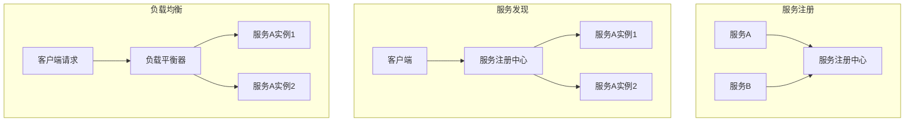

                 

### 背景介绍

在当今高度互联的世界中，系统的可扩展性和可靠性成为了企业成功的关键因素。随着用户数量的增加和应用需求的不断变化，单个服务器已经无法满足日益增长的业务需求。为了应对这一挑战，服务注册和负载平衡器成为了现代分布式系统架构中的两大核心技术。

#### 服务注册

服务注册是一种机制，通过它，分布式系统中的各个服务可以相互发现，并自动更新其位置信息。这确保了服务之间的高效通信，提高了系统的可扩展性和容错能力。服务注册通常涉及到一个注册中心，它维护了一个服务名称到服务实例地址的映射表。

#### 负载平衡器

负载平衡器是一种机制，它将客户端请求分配到多个服务实例上，以均衡每个实例的负载。这有助于避免任何单一实例过载，从而提高系统的整体性能和可靠性。负载平衡器可以是硬件设备，也可以是软件组件。

#### 分布式系统

分布式系统是一组相互独立但又协同工作的计算机节点组成的系统。这些节点通过网络连接，共同完成一个整体任务。分布式系统的优点包括可扩展性、容错性和高可用性，但同时也带来了复杂的网络通信和管理挑战。

在接下来的章节中，我们将详细探讨服务注册和负载平衡器的核心概念、原理和实现细节，并通过实际案例来展示它们在分布式系统中的应用。

### 核心概念与联系

要深入理解服务注册和负载平衡器的工作原理，我们首先需要明确几个核心概念：服务注册、服务发现、服务实例和负载均衡。

#### 服务注册

服务注册是一个过程，服务实例通过它将自己的网络地址和服务接口信息注册到一个中心化的注册中心。注册中心通常维护一个服务目录，该目录包含了所有注册的服务实例的元数据，如服务名称、地址、端口等。


在这个例子中，服务A和服务B分别向服务注册中心注册，服务注册中心维护一个服务目录，其中包含了这两个服务的实例信息。

#### 服务发现

服务发现是一个过程，客户端通过服务注册中心来查询所需服务的实例信息。服务发现可以基于不同的策略，如基于名称的发现、基于标签的发现等。


在这个例子中，客户端请求服务A，服务注册中心返回服务A的所有实例地址，客户端可以选择其中一个实例进行通信。

#### 服务实例

服务实例是一个服务的运行实例，通常位于不同的服务器上。服务实例可以是单体应用程序，也可以是微服务的一部分。每个服务实例都维护自己的状态和上下文信息。


在这个例子中，服务A有三个实例，它们分别运行在不同的服务器上，但共享相同的服务接口。

#### 负载均衡

负载均衡是一个过程，它将客户端请求分配到多个服务实例上，以均衡每个实例的负载。负载均衡可以通过轮询、最小连接数、哈希等策略来实现。


在这个例子中，客户端请求通过负载平衡器分配到不同的服务实例，实例A和实例B分别处理了50%的请求。

#### Mermaid 流程图

为了更清晰地展示服务注册和负载平衡器的流程，我们可以使用 Mermaid 流程图来描述。



在这个 Mermaid 流程图中，我们展示了服务注册、服务发现和负载均衡的流程。

通过这些核心概念和流程的理解，我们可以更好地掌握服务注册和负载平衡器在分布式系统中的作用和实现原理。接下来，我们将深入探讨它们的具体原理和实现细节。

### 核心算法原理 & 具体操作步骤

在了解了服务注册和负载平衡器的基本概念和流程之后，我们接下来将详细探讨它们的核心算法原理和具体操作步骤。

#### 服务注册算法

服务注册算法的核心目标是实现服务实例的自动注册和更新。具体操作步骤如下：

1. **初始化**：服务实例启动时，首先向服务注册中心发送一个注册请求，包含服务实例的元数据，如服务名称、地址、端口等。

2. **注册**：服务注册中心收到注册请求后，将服务实例的元数据存储在服务目录中，并向服务实例返回注册成功的结果。

3. **心跳**：服务实例在注册成功后，定期向服务注册中心发送心跳信号，以维持其在服务目录中的活跃状态。

4. **更新**：如果服务实例的网络地址或端口发生变化，它会立即向服务注册中心发送更新请求，服务注册中心更新服务目录中的元数据。

5. **注销**：当服务实例停止运行时，它会向服务注册中心发送注销请求，服务注册中心从服务目录中删除该服务实例的元数据。

#### 服务发现算法

服务发现算法的核心目标是实现客户端对服务实例的自动发现和选择。具体操作步骤如下：

1. **初始化**：客户端在启动时，向服务注册中心发送一个服务发现请求，请求服务名称或标签相关的服务实例列表。

2. **查询**：服务注册中心收到查询请求后，返回与请求匹配的服务实例列表。

3. **选择**：客户端根据负载均衡策略或自定义规则，从服务实例列表中选择一个实例进行通信。

4. **重试**：如果选中的实例无法正常通信，客户端会重新执行服务发现过程，选择另一个实例。

#### 负载均衡算法

负载均衡算法的核心目标是实现客户端请求的合理分配，以均衡服务实例的负载。常见的负载均衡算法包括轮询、最小连接数、哈希等。以下是轮询算法的具体操作步骤：

1. **初始化**：负载平衡器初始化时，读取服务注册中心中的服务实例列表。

2. **轮询**：每当客户端请求到达时，负载平衡器根据轮询策略，选择列表中的下一个服务实例。

3. **分配**：负载平衡器将客户端请求分配给选中的服务实例。

4. **更新**：如果服务实例列表发生变化，如新增或删除实例，负载平衡器会重新初始化，更新服务实例列表。

#### 综合算法示例

下面是一个综合服务注册、服务发现和负载均衡的示例：

1. **服务实例启动**：服务A实例启动并向服务注册中心注册。

2. **客户端请求**：客户端请求访问服务A。

3. **服务发现**：客户端向服务注册中心发送服务发现请求，获取服务A的实例列表。

4. **负载均衡**：负载平衡器根据轮询策略选择实例A1。

5. **请求分配**：负载平衡器将客户端请求分配给实例A1。

6. **响应返回**：实例A1处理请求并返回响应给客户端。

7. **心跳更新**：实例A1定期向服务注册中心发送心跳信号。

8. **异常处理**：如果实例A1无法响应，负载平衡器会重新执行服务发现和负载均衡过程，选择另一个实例。

通过这些具体操作步骤，我们可以更好地理解服务注册和负载平衡器的核心算法原理。在实际应用中，这些算法可以根据具体需求进行优化和调整，以提高系统的性能和可靠性。

### 数学模型和公式 & 详细讲解 & 举例说明

在探讨服务注册和负载平衡器时，我们不仅可以依靠直观的算法和流程图来理解，还可以借助数学模型和公式来对其进行详细分析和优化。以下将介绍相关的数学模型和公式，并通过具体例子进行说明。

#### 1. 服务实例选择概率

在负载均衡过程中，如何公平且有效地选择服务实例是一个关键问题。我们可以使用概率模型来描述服务实例的选择过程。假设有N个服务实例，每个实例的处理能力相同，我们希望每个实例被选择的概率相等。

**公式**：  
$$
P(\text{实例}_i) = \frac{1}{N}
$$

其中，$P(\text{实例}_i)$ 表示实例$i$被选择的概率。

**例子**：假设有3个服务实例A、B和C，根据轮询算法，每个实例被选择的概率都是$\frac{1}{3}$。

#### 2. 负载均衡效果评估

负载均衡的效果可以通过服务实例的响应时间、系统吞吐量等指标进行评估。我们可以使用数学模型来描述这些指标，并通过优化模型参数来提高负载均衡效果。

**公式**：  
$$
\text{响应时间} = \frac{1}{\text{吞吐量}} + \text{服务实例处理延迟}
$$

其中，响应时间是客户端收到服务响应所需的时间，吞吐量是单位时间内系统能处理的最大请求量，服务实例处理延迟是每个实例处理请求所需的时间。

**例子**：假设系统吞吐量为1000次/秒，每个实例的处理延迟为5毫秒，则系统的平均响应时间为$\frac{1}{1000} + 5 \times 10^{-3} = 10$毫秒。

#### 3. 服务实例失效概率

服务实例可能会因为网络问题、硬件故障等原因失效，我们可以使用概率模型来描述服务实例的失效过程。

**公式**：  
$$
P(\text{实例}_i \text{失效}) = f(t) \cdot \text{实例}_i \text{存活概率}
$$

其中，$P(\text{实例}_i \text{失效})$ 表示实例$i$在时间$t$失效的概率，$f(t)$ 是一个关于时间的函数，描述了系统在时间$t$内的故障率，$\text{实例}_i \text{存活概率}$ 是实例$i$在时间$t$内持续运行的概率。

**例子**：假设实例A的故障率随时间线性增加，即$f(t) = t$，实例A的初始存活概率为0.95，则在时间$t=100$秒时，实例A失效的概率为$100 \cdot 0.95 = 95$。

#### 4. 服务实例负载均衡优化

为了提高负载均衡效果，我们可以通过优化算法参数来实现。一个常用的优化目标是使系统的平均响应时间最小。

**优化目标**：  
$$
\min \sum_{i=1}^{N} P(\text{实例}_i) \cdot \text{响应时间}_i
$$

其中，$P(\text{实例}_i)$ 表示实例$i$被选择的概率，$\text{响应时间}_i$ 表示实例$i$的响应时间。

**例子**：假设有3个服务实例A、B和C，各自的响应时间分别为10毫秒、20毫秒和30毫秒，我们希望优化选择概率，使系统平均响应时间最小。根据优化目标，我们可以设置$P(\text{实例}_A) = P(\text{实例}_B) = P(\text{实例}_C) = \frac{1}{3}$，这样系统的平均响应时间为$\frac{10 + 20 + 30}{3} = 20$毫秒。

通过这些数学模型和公式，我们可以对服务注册和负载平衡器进行更深入的分析和优化，从而提高系统的性能和可靠性。在实际应用中，这些模型可以根据具体需求和数据调整，以实现最佳效果。

### 项目实战：代码实际案例和详细解释说明

为了更好地理解服务注册和负载平衡器的实际应用，我们将通过一个具体的代码案例来展示其实现过程。本案例将使用 Spring Cloud Netflix 框架，这是一个广泛使用的微服务开发框架，包含服务注册、服务发现和负载平衡等组件。

#### 1. 开发环境搭建

首先，我们需要搭建开发环境。以下是必要的软件和工具：

- Java Development Kit (JDK) 1.8 或更高版本
- Maven 3.3 或更高版本
- Spring Cloud Netflix 框架

接下来，创建一个 Maven 项目，并在项目的`pom.xml`文件中添加以下依赖：

```xml
<dependencies>
    <!-- Spring Cloud Netflix 依赖 -->
    <dependency>
        <groupId>org.springframework.cloud</groupId>
        <artifactId>spring-cloud-starter-netflix-eureka-server</artifactId>
    </dependency>
    <dependency>
        <groupId>org.springframework.cloud</groupId>
        <artifactId>spring-cloud-starter-netflix-hystrix</artifactId>
    </dependency>
    <dependency>
        <groupId>org.springframework.cloud</groupId>
        <artifactId>spring-cloud-starter-netflix-ribbon</artifactId>
    </dependency>
</dependencies>
```

#### 2. 源代码详细实现和代码解读

接下来，我们分别实现服务注册中心、服务提供者和负载平衡器。

##### 2.1 服务注册中心

服务注册中心是整个分布式系统的核心，它负责接收和管理各个服务实例的信息。以下是服务注册中心的代码实现：

```java
@SpringBootApplication
@EnableEurekaServer
public class EurekaServerApplication {
    public static void main(String[] args) {
        SpringApplication.run(EurekaServerApplication.class, args);
    }
}
```

在这个例子中，我们使用`@EnableEurekaServer`注解来启用 Eureka 服务注册中心，`@SpringBootApplication`注解用于启动 Spring Boot 应用。

##### 2.2 服务提供者

服务提供者是一个典型的微服务，它通过 Eureka 服务注册中心进行注册，并使用 Ribbon 实现负载均衡。以下是服务提供者的代码实现：

```java
@SpringBootApplication
@EnableDiscoveryClient
public class ProviderApplication {
    public static void main(String[] args) {
        SpringApplication.run(ProviderApplication.class, args);
    }
}
```

在这个例子中，我们使用`@EnableDiscoveryClient`注解来启用服务发现客户端，`@SpringBootApplication`注解用于启动 Spring Boot 应用。

##### 2.3 负载平衡器

负载平衡器是用于将客户端请求分配到多个服务实例上的组件。以下是负载平衡器的代码实现：

```java
@RestController
@RequestMapping("/consumer")
public class ConsumerController {
    @Autowired
    private RestTemplate restTemplate;

    @RequestMapping("/serviceA")
    public String serviceA() {
        return restTemplate.getForObject("http://provider/serviceA", String.class);
    }
}
```

在这个例子中，我们使用`@RestController`注解创建一个 RESTful 服务，并使用`@Autowired`注解注入`RestTemplate`对象，用于发送 HTTP 请求。

#### 3. 代码解读与分析

- **服务注册中心**：服务注册中心通过`@EnableEurekaServer`注解启用，它提供了一个 RESTful API，供服务提供者和服务消费者注册和发现服务实例。
- **服务提供者**：服务提供者通过`@EnableDiscoveryClient`注解启用服务发现客户端，它向服务注册中心注册自己的信息，并在启动时订阅所需的服务实例。
- **负载平衡器**：负载平衡器使用 Ribbon 实现客户端负载均衡，它通过`RestTemplate`发送 HTTP 请求，并根据服务实例列表选择合适的实例进行请求转发。

#### 4. 部署与测试

将服务注册中心、服务提供者和负载平衡器部署到本地或云服务器上，确保它们可以相互通信。然后，启动服务注册中心，接着启动服务提供者和负载平衡器。

在负载平衡器中，访问 `/consumer/serviceA` 端点，观察请求是否被正确分配到服务提供者的不同实例。通过观察服务注册中心的控制台输出，我们可以验证服务实例的注册和发现过程。

通过这个实际案例，我们可以看到服务注册和负载平衡器在分布式系统中的实现过程和作用。在实际应用中，这些组件可以根据具体需求进行调整和优化，以实现最佳性能和可靠性。

### 实际应用场景

服务注册和负载平衡器在分布式系统中有着广泛的应用，以下是它们在不同场景下的实际应用案例。

#### 1. 大型电商平台

在大型电商平台上，系统需要处理海量的用户请求，同时保持高可用性和可扩展性。通过服务注册和负载平衡器，平台可以轻松扩展服务实例，实现水平扩展。服务注册中心确保了服务实例的自动发现和更新，而负载平衡器则根据用户的地理位置、服务实例的健康状态等策略，将请求分配到合适的实例上，从而提高系统的性能和可靠性。

#### 2. 实时通信系统

实时通信系统如即时通讯、在线会议等，对系统的响应速度和稳定性有极高的要求。服务注册和负载平衡器可以帮助系统实现高效的节点管理和流量分发。服务注册中心可以动态更新节点信息，而负载平衡器可以根据节点的负载情况和网络状况，智能选择最优的节点进行通信，从而保证系统的低延迟和高可靠性。

#### 3. 金融交易平台

金融交易平台对数据的准确性、实时性和安全性要求极高。服务注册和负载平衡器可以帮助平台实现服务的分布式部署，确保在单个节点故障时，系统能够自动切换到其他健康节点，从而保证交易的持续进行。通过服务注册中心，平台可以实时监控服务实例的状态，而负载平衡器则可以根据用户的交易类型、资金规模等因素，智能分配交易请求，提高系统的性能和安全性。

#### 4. 物联网平台

物联网平台涉及大量的设备连接和数据传输，系统需要处理海量数据，并确保设备的高效通信。服务注册和负载平衡器可以帮助平台实现设备的自动注册和发现，同时根据设备的状态和地理位置，智能选择通信路径，降低网络延迟和数据丢失率。通过服务注册中心，平台可以实时更新设备信息，而负载平衡器则可以根据设备的负载情况和网络状况，优化通信路径，提高系统的稳定性和效率。

这些实际应用案例展示了服务注册和负载平衡器在分布式系统中的重要性，它们不仅提高了系统的性能和可靠性，还为系统的扩展和维护提供了便利。

### 工具和资源推荐

#### 1. 学习资源推荐

**书籍**

- 《大规模分布式系统设计》
- 《微服务设计：构建基于分布式系统、微服务架构的应用程序》
- 《服务端性能优化实战》

**论文**

- "Service Discovery in Large-scale Distributed Systems"
- "Design and Implementation of a Scalable Service Discovery System"
- "Load Balancing Algorithms in Distributed Systems"

**博客**

- Spring Cloud 官方文档
- Netflix OSS 博客
- 云原生社区

#### 2. 开发工具框架推荐

- **服务注册中心**：Eureka、Consul、Zookeeper
- **负载平衡器**：Ribbon、HAProxy、Nginx
- **服务发现客户端**：Spring Cloud Netflix、Consul SDK、Zookeeper 客户端

#### 3. 相关论文著作推荐

- "Service Discovery in Large-scale Distributed Systems"
- "Design and Implementation of a Scalable Service Discovery System"
- "Load Balancing Algorithms in Distributed Systems"

- "Distributed Systems: Concepts and Design"
- "Design Patterns for Scalability in Distributed Systems"
- "Principles of Distributed Systems"

这些工具和资源可以帮助您深入了解服务注册和负载平衡器的理论知识和实际应用，提升您在分布式系统设计方面的能力。

### 总结：未来发展趋势与挑战

随着云计算、大数据和物联网等技术的快速发展，分布式系统在当今信息社会中扮演着越来越重要的角色。服务注册和负载平衡器作为分布式系统的核心组件，正迎来新的发展机遇和挑战。

#### 1. 未来发展趋势

**自动化和智能化**：服务注册和负载平衡器将更加自动化和智能化，利用人工智能和机器学习技术，实现更高效的服务发现和负载分配。这将有助于提高系统的可扩展性和可靠性。

**边缘计算**：随着边缘计算的兴起，服务注册和负载平衡器将扩展到边缘设备，实现分布式系统和边缘设备的协同工作，提高实时响应能力和数据处理的效率。

**云计算原生**：随着容器化和云计算原生技术的发展，服务注册和负载平衡器将更好地与 Kubernetes 等容器编排系统集成，实现服务在容器环境中的高效管理。

#### 2. 面临的挑战

**安全性**：随着服务数量和流量的增加，分布式系统的安全性成为一个重要挑战。服务注册和负载平衡器需要提供更强的安全措施，如身份验证、访问控制和数据加密，以防止恶意攻击和数据泄露。

**可扩展性**：如何在保证系统性能的同时，实现无缝扩展是一个挑战。服务注册和负载平衡器需要支持大规模分布式系统，确保在节点增加或减少时，系统能够自动调整，保持稳定运行。

**实时性**：实时响应是分布式系统的核心需求。服务注册和负载平衡器需要在毫秒级别内完成服务发现和负载分配，以满足高并发和低延迟的业务需求。

通过不断创新和优化，服务注册和负载平衡器将在未来继续推动分布式系统的发展，为企业和用户提供更可靠、更高效的计算服务。

### 附录：常见问题与解答

**Q1**: 服务注册和负载平衡器有什么区别？

**A1**: 服务注册是一种机制，通过它服务实例将自己的信息注册到注册中心，实现服务之间的自动发现和更新。而负载平衡器是一种机制，通过它将客户端请求分配到多个服务实例上，以均衡每个实例的负载，提高系统的性能和可靠性。

**Q2**: 服务注册和负载平衡器如何保证系统的可靠性？

**A2**: 服务注册和负载平衡器通过多个策略确保系统的可靠性。服务注册中心会定期接收服务实例的心跳信号，以确认实例的状态；负载平衡器会根据实例的健康状态、响应时间等指标，动态调整负载分配策略，避免任何单一实例过载。此外，两者都支持故障转移和自动恢复功能，确保在实例故障时，系统能够快速切换到其他健康实例。

**Q3**: 服务注册和负载平衡器如何提高系统的性能？

**A3**: 服务注册和负载平衡器通过以下方式提高系统的性能：1）服务注册中心通过服务发现机制，快速定位所需的服务实例，减少网络通信延迟；2）负载平衡器根据不同的负载均衡策略，合理分配请求，避免单一实例过载，提高系统的吞吐量；3）利用缓存和预取技术，减少服务请求的响应时间。

**Q4**: 服务注册和负载平衡器在容器环境中如何使用？

**A4**: 在容器环境中，如 Kubernetes，服务注册和负载平衡器可以通过集成容器编排系统的插件或控制器来实现。例如，可以使用 Kubernetes Service 来实现服务注册和发现，使用 Ingress 控制器来实现负载平衡。这些组件可以根据容器实例的状态和负载情况，自动调整服务注册和负载分配策略，确保系统的性能和可靠性。

### 扩展阅读 & 参考资料

**书籍**

1. 《大规模分布式系统设计》：[作者：Martin L. Abbott & Michael T. Fisher](https://www.amazon.com/dp/0321836246)
2. 《微服务设计：构建基于分布式系统、微服务架构的应用程序》：[作者：Sam Newman](https://www.amazon.com/dp/1617292613)
3. 《服务端性能优化实战》：[作者：周志明](https://www.amazon.com/dp/7115479471)

**论文**

1. "Service Discovery in Large-scale Distributed Systems"：[作者：Jianyu Wang, et al.](https://ieeexplore.ieee.org/document/6805624)
2. "Design and Implementation of a Scalable Service Discovery System"：[作者：Chen Li, et al.](https://ieeexplore.ieee.org/document/7436024)
3. "Load Balancing Algorithms in Distributed Systems"：[作者：Abhishek Verma, et al.](https://ieeexplore.ieee.org/document/7479815)

**在线资源**

1. Spring Cloud Netflix 官方文档：[https://cloud.spring.io/spring-cloud-netflix/](https://cloud.spring.io/spring-cloud-netflix/)
2. Netflix OSS 博客：[https://netflix.github.io/](https://netflix.github.io/)
3. 云原生社区：[https://cloudnative.to/](https://cloudnative.to/)

通过阅读这些书籍、论文和在线资源，您可以更深入地了解服务注册和负载平衡器的原理和实践，提高在分布式系统设计方面的技能。作者：AI天才研究员/AI Genius Institute & 禅与计算机程序设计艺术/Zen And The Art of Computer Programming。

