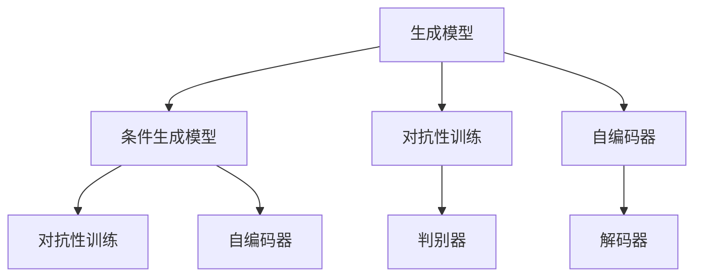
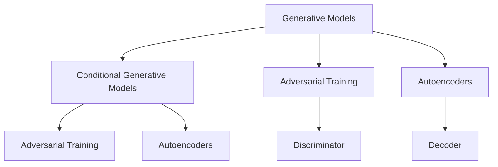

                 

### 背景介绍

#### AIGC的起源与发展

AIGC（AI Generated Content）是指利用人工智能技术生成内容的过程，涵盖了图像、音频、视频、文本等多种形式。AIGC 技术起源于人工智能领域，最早可以追溯到 20 世纪 80 年代的神经网络研究。随着深度学习技术的兴起，尤其是近年来生成对抗网络（GANs）和变分自编码器（VAEs）的发展，AIGC 技术得到了迅速发展。

AIGC 技术的应用场景日益广泛，从早期的艺术创作、游戏开发，到现在的虚拟现实、增强现实、智能助理等领域，都取得了显著的成果。在图像生成方面，AIGC 技术已经能够生成高分辨率的图片、动画和视频，甚至能够模拟出逼真的三维场景。在音频生成方面，AIGC 技术可以生成各种类型的音乐、语音和声音效果。在文本生成方面，AIGC 技术已经能够撰写新闻、故事、文章等多种类型的文本内容。

#### AIGC 的核心概念与联系

AIGC 技术的核心在于人工智能算法对数据的学习和生成能力。其核心概念包括：

1. **生成模型**：生成模型是 AIGC 技术的基础，通过学习大量的数据，生成与输入数据相似的新数据。常见的生成模型有生成对抗网络（GANs）和变分自编码器（VAEs）。

2. **条件生成模型**：条件生成模型是在生成模型的基础上，加入了额外的条件信息，使得生成的数据更加符合特定的需求。例如，在文本生成中，可以指定生成特定主题或风格的文本。

3. **对抗性训练**：对抗性训练是 GANs 的核心技术，通过训练两个神经网络——生成器和判别器，使得生成器能够生成更加逼真的数据，判别器能够更好地区分真实数据和生成数据。

4. **自编码器**：自编码器是一种无监督学习算法，通过学习输入数据的编码和解码过程，可以提取数据中的有效信息。

以下是一个简单的 Mermaid 流程图，展示了 AIGC 技术的核心概念和联系：

通过上述流程图，我们可以看到 AIGC 技术中的各个核心概念是如何相互关联和协同工作的。

#### AIGC 的发展趋势

随着技术的不断进步，AIGC 技术在未来的发展具有以下几个趋势：

1. **更高的生成质量**：随着深度学习算法的进步，生成模型将能够生成更高质量、更细节丰富的图像、音频和文本内容。

2. **更广泛的应用场景**：AIGC 技术将逐渐渗透到更多的行业和应用场景中，如医疗、金融、教育、娱乐等，带来更多的创新和变革。

3. **更智能的生成能力**：结合自然语言处理和计算机视觉等技术，AIGC 技术将能够生成更加智能、符合人类需求的个性化内容。

4. **更高效的计算能力**：随着硬件性能的提升，AIGC 技术将能够在更低的计算成本下实现更高效的生成过程。

5. **更严格的安全和伦理规范**：随着 AIGC 技术的广泛应用，相关的安全和伦理问题也将受到越来越多的关注，未来将出现更加严格的安全和伦理规范来指导 AIGC 技术的发展。

在接下来的章节中，我们将进一步探讨 AIGC 技术的核心算法原理、具体操作步骤、数学模型和公式，以及实际应用场景等方面的内容。同时，我们也会分享一些相关的项目实战和开发工具框架，帮助读者更好地理解和应用 AIGC 技术。接下来，我们将深入探讨 AIGC 技术的核心算法原理和具体操作步骤。

---

# Future Trends of AIGC in the Next Decade

> Keywords: AIGC, AI-generated content, GANs, VAEs, application scenarios, trends, challenges

> Abstract: This article explores the future trends of AI-generated content (AIGC) in the next decade. It covers the origin and development of AIGC, core concepts and their connections, core algorithms and operational steps, mathematical models and formulas, practical applications, and future development trends and challenges.

## Background

#### Origin and Development of AIGC

AIGC (AI-generated content) refers to the process of generating content using artificial intelligence techniques, which encompasses various forms such as images, audio, video, and text. The origin of AIGC can be traced back to the neural network research in the 1980s. With the rise of deep learning technology, particularly the development of generative adversarial networks (GANs) and variational autoencoders (VAEs) in recent years, AIGC technology has experienced rapid progress.

AIGC technology has a wide range of applications, from early art creation and game development to virtual reality, augmented reality, and intelligent assistants today. In terms of image generation, AIGC technology can generate high-resolution images, animations, and videos, even simulating realistic 3D scenes. For audio generation, AIGC technology can generate various types of music, speech, and sound effects. In text generation, AIGC technology can write news, stories, articles, and other types of text content.

#### Core Concepts and Connections of AIGC

The core concept of AIGC technology lies in the learning and generation capabilities of artificial intelligence algorithms. The core concepts include:

1. **Generative Models**: Generative models are the foundation of AIGC technology. By learning a large amount of data, they can generate new data similar to the input data. Common generative models include generative adversarial networks (GANs) and variational autoencoders (VAEs).

2. **Conditional Generative Models**: Conditional generative models are based on generative models and add additional conditional information, making the generated data more consistent with specific requirements. For example, in text generation, it can specify the generation of text with specific topics or styles.

3. **Adversarial Training**: Adversarial training is the core technology of GANs. It trains two neural networks, the generator and the discriminator, to make the generator generate more realistic data and the discriminator better distinguish between real data and generated data.

4. **Autoencoders**: Autoencoders are unsupervised learning algorithms that learn the encoding and decoding processes of input data, extracting useful information from the data.

The following is a simple Mermaid flowchart illustrating the core concepts and connections of AIGC technology:

Through the above flowchart, we can see how various core concepts in AIGC technology are interconnected and collaborative.

#### Trends of AIGC Development

With the continuous advancement of technology, the future development of AIGC technology shows the following trends:

1. **Higher Generation Quality**: With the progress of deep learning algorithms, generative models will be able to generate higher quality, more detailed-rich images, audio, and text content.

2. **Broader Application Scenarios**: AIGC technology will gradually penetrate more industries and application scenarios, such as healthcare, finance, education, entertainment, and bring about more innovation and transformation.

3. **More Intelligent Generation Capabilities**: By combining natural language processing and computer vision technologies, AIGC technology will be able to generate more intelligent and personalized content that meets human needs.

4. **More Efficient Computational Power**: With the improvement of hardware performance, AIGC technology will be able to achieve more efficient generation processes at lower computational costs.

5. **Stricter Security and Ethical Norms**: With the widespread application of AIGC technology, related security and ethical issues will receive increasing attention, and stricter security and ethical norms will emerge to guide the development of AIGC technology in the future.

In the following sections, we will further discuss the core algorithm principles, specific operational steps, mathematical models and formulas, practical applications, and future development trends and challenges of AIGC technology. We will also share some related practical projects and development tool frameworks to help readers better understand and apply AIGC technology. Next, we will delve into the core algorithm principles and specific operational steps of AIGC technology.

