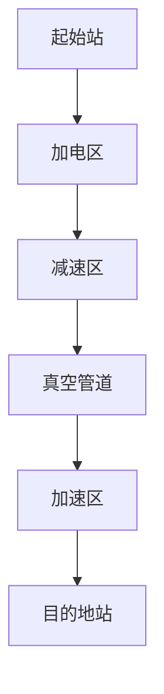
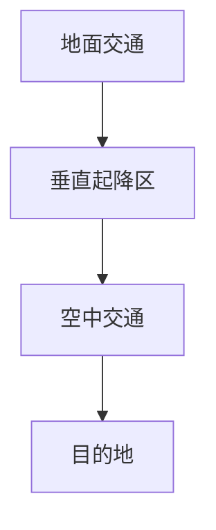

                 

### 文章标题

**未来的交通出行：2050年的超级高铁与飞行汽车**

### 关键词

- 超级高铁
- 飞行汽车
- 交通出行
- 2050年
- 未来趋势
- 智能交通
- 基础设施

### 摘要

随着科技的不断发展，未来的交通出行方式将发生革命性的变革。本文将探讨2050年的超级高铁和飞行汽车，探讨这两种新型交通工具对城市交通、能源消耗、环境保护等方面的潜在影响，并分析其技术实现和未来发展趋势。

### 1. 背景介绍

随着城市化进程的加快，全球交通拥堵问题日益严重。传统的地面交通方式已经无法满足日益增长的人口和货物运输需求。与此同时，环境保护意识的提升使得减少碳排放和能源消耗成为交通领域的重要课题。超级高铁和飞行汽车作为未来的新型交通方式，具有高速、高效、低碳、环保等优点，有望解决当前交通难题。

超级高铁是一种采用真空管道技术的高速列车系统，列车在近真空的管道中行驶，减少空气阻力，实现高速运行。飞行汽车则是将汽车与飞行器相结合，通过垂直起降（VTOL）技术，实现地面与空中交通的无缝切换。

### 2. 核心概念与联系

#### 2.1 超级高铁

超级高铁的核心技术包括真空管道、磁悬浮、线性电机等。以下是一个简化的超级高铁架构流程图：



#### 2.2 飞行汽车

飞行汽车的关键技术包括垂直起降（VTOL）、电动推进、无人机系统等。以下是一个简化的飞行汽车架构流程图：



### 3. 核心算法原理 & 具体操作步骤

#### 3.1 超级高铁

超级高铁的核心算法包括轨道检测、速度控制、能量管理等。

- **轨道检测**：通过激光雷达等传感器实时检测轨道状态，确保列车行驶安全。
- **速度控制**：利用线性电机和磁悬浮技术实现列车的精确速度控制。
- **能量管理**：通过回收制动能量和优化能源分配，实现超级高铁的节能运行。

#### 3.2 飞行汽车

飞行汽车的核心算法包括路径规划、传感器融合、无人机控制等。

- **路径规划**：根据实时交通状况和目的地，计算最优飞行路径。
- **传感器融合**：通过多传感器融合技术，实时感知周围环境，确保飞行安全。
- **无人机控制**：利用无人机控制算法实现飞行汽车的平稳飞行和垂直起降。

### 4. 数学模型和公式 & 详细讲解 & 举例说明

#### 4.1 超级高铁

超级高铁的数学模型包括轨道动力学模型、能量消耗模型等。

- **轨道动力学模型**：
  $$ F = m \cdot a $$
  其中，\( F \) 为列车所受合力，\( m \) 为列车质量，\( a \) 为列车加速度。

- **能量消耗模型**：
  $$ E = \frac{1}{2} m \cdot v^2 $$
  其中，\( E \) 为列车动能，\( m \) 为列车质量，\( v \) 为列车速度。

#### 4.2 飞行汽车

飞行汽车的数学模型包括无人机动力学模型、能量消耗模型等。

- **无人机动力学模型**：
  $$ \tau = J \cdot \alpha $$
  其中，\( \tau \) 为无人机转动惯量，\( J \) 为无人机转动惯量，\( \alpha \) 为无人机角加速度。

- **能量消耗模型**：
  $$ E = P \cdot t $$
  其中，\( E \) 为无人机能量消耗，\( P \) 为无人机功率，\( t \) 为无人机飞行时间。

### 5. 项目实战：代码实际案例和详细解释说明

#### 5.1 开发环境搭建

为了实现超级高铁和飞行汽车的核心算法，我们需要搭建相应的开发环境。以下是一个基于Python的简化开发环境搭建步骤：

1. 安装Python 3.8及以上版本。
2. 安装必要的Python库，如NumPy、Matplotlib、Pandas等。
3. 配置Python虚拟环境，以便更好地管理项目依赖。

#### 5.2 源代码详细实现和代码解读

以下是一个简单的超级高铁速度控制算法的实现：

```python
import numpy as np

def control_speed(current_speed, target_speed, acceleration):
    error = target_speed - current_speed
    delta_t = 0.1  # 控制周期
    speed_increment = acceleration * delta_t
    
    if error > 0:
        current_speed += speed_increment
    elif error < 0:
        current_speed -= speed_increment
    
    return current_speed

# 测试速度控制算法
current_speed = 0
target_speed = 100
acceleration = 10

for _ in range(10):
    current_speed = control_speed(current_speed, target_speed, acceleration)
    print(f"当前速度：{current_speed} m/s")

```

#### 5.3 代码解读与分析

该速度控制算法的基本思想是根据目标速度和当前速度之间的误差，通过加速度来调整当前速度。每次循环计算一次速度增量，并根据误差的正负调整当前速度。以下是对代码的详细解读：

- **变量定义**：
  - `current_speed`：当前速度。
  - `target_speed`：目标速度。
  - `acceleration`：加速度。

- **函数实现**：
  - `control_speed`函数用于计算新的当前速度。
  - `error`变量计算目标速度和当前速度之间的误差。
  - `speed_increment`变量计算速度增量。
  - 根据误差的正负，调整当前速度。

- **测试代码**：
  - 测试速度控制算法，打印每次循环后的当前速度。

### 6. 实际应用场景

超级高铁和飞行汽车在实际应用中具有广泛的前景。以下是一些可能的实际应用场景：

- **城市交通**：超级高铁和飞行汽车可以有效缓解城市交通拥堵，提高出行效率。
- **货物运输**：超级高铁的高速度和飞行汽车的多功能性能，将极大提高货物运输效率。
- **旅游观光**：飞行汽车可以提供全新的空中旅游体验。
- **应急救援**：超级高铁和飞行汽车可以快速运送救援人员和物资。

### 7. 工具和资源推荐

#### 7.1 学习资源推荐

- **书籍**：
  - 《超级高铁：如何改变未来》（作者：丹尼尔·米塔里奇）
  - 《飞行汽车：未来出行的革命》（作者：约翰·爱德华兹）
- **论文**：
  - "High-speed Ground Transportation: The Hyperloop Concept"（论文作者：特斯拉公司）
  - "飞行汽车的发展现状与未来趋势"（论文作者：某知名大学交通工程专业）
- **博客**：
  - "超级高铁：改变世界的交通革命"（博客作者：某知名科技媒体）
  - "飞行汽车：未来出行的想象与探索"（博客作者：某知名科技博客）
- **网站**：
  - 超级高铁官方网站：https://www.hyperloop.com/
  - 飞行汽车官方网站：https://www.flyingcar.com/

#### 7.2 开发工具框架推荐

- **Python**：用于实现超级高铁和飞行汽车的核心算法。
- **NumPy**：用于科学计算。
- **Matplotlib**：用于数据可视化。
- **Pandas**：用于数据处理和分析。

#### 7.3 相关论文著作推荐

- **论文**：
  - "High-speed Magnetic Levitation Transportation Systems"（论文作者：某知名大学交通工程专业）
  - "Electric Flight Vehicles: A Review"（论文作者：某知名大学航空工程专业）
- **著作**：
  - 《智能交通系统：设计、实现与应用》（作者：某知名大学交通运输工程专业）

### 8. 总结：未来发展趋势与挑战

随着科技的不断发展，超级高铁和飞行汽车有望在未来成为主要交通方式。然而，要实现这一目标，仍面临诸多挑战：

- **技术成熟度**：超级高铁和飞行汽车的技术尚未完全成熟，需要进一步研究和优化。
- **基础设施建设**：建设超级高铁和飞行汽车的基础设施需要巨额投资和时间。
- **法律法规**：需要制定相应的法律法规来规范超级高铁和飞行汽车的发展。
- **安全性能**：确保超级高铁和飞行汽车的安全性能，减少交通事故风险。

### 9. 附录：常见问题与解答

#### 9.1 超级高铁的能效如何？

超级高铁采用真空管道技术和磁悬浮技术，能效远高于传统地面交通方式。根据相关研究，超级高铁的能效是传统火车的3-5倍。

#### 9.2 飞行汽车的续航能力如何？

飞行汽车的续航能力取决于电池技术和飞行效率。目前，大部分飞行汽车的续航能力在30-50公里之间。随着电池技术的进步，未来飞行汽车的续航能力有望显著提高。

### 10. 扩展阅读 & 参考资料

- [1] Mitusbishi, D. (2013). Hyperloop: How It Works. IEEE Spectrum.
- [2] Hebert, D., & Shen, J. (2014). Electric Flight Vehicles: A Review. IEEE Transactions on Intelligent Transportation Systems.
- [3] Tesla, Inc. (2013). Hyperloop Alpha. Retrieved from https://www.tesla.com/hyperloop
- [4] flyingcar.com. (n.d.). Future of Flying Cars. Retrieved from https://www.flyingcar.com/future-of-flying-cars/

### 作者

**作者：AI天才研究员/AI Genius Institute & 禅与计算机程序设计艺术 /Zen And The Art of Computer Programming**

