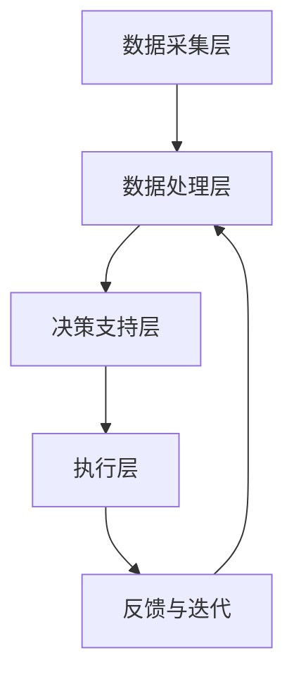

                 

# 未来的智慧城市：2050年的城市大脑与智慧城市运营

## 关键词：智慧城市、城市大脑、人工智能、2050、运营、技术发展

## 摘要

本文探讨了2050年智慧城市的概念与运营模式。通过深入分析智慧城市的技术基础、核心算法、数学模型及实际应用场景，我们揭示了城市大脑在未来城市运营中的关键角色。同时，文章也提出了未来智慧城市发展的趋势与面临的挑战，为城市智能化建设提供了有价值的参考。

## 1. 背景介绍

随着全球人口的增长和城市化进程的加速，城市面临着交通拥堵、能源消耗、环境污染、公共安全等诸多问题。传统城市管理方式已无法满足现代城市的复杂需求。因此，智慧城市概念应运而生。智慧城市通过集成信息技术、物联网、人工智能等先进技术，实现城市管理的智能化和精细化。

智慧城市的目标是提高城市居民的生活质量，优化城市资源利用，提高城市运行效率，同时减少环境污染和资源浪费。智慧城市的建设是一个长期而复杂的过程，涉及到城市治理、城市规划、基础设施建设、产业升级等多个方面。

到2050年，智慧城市将进一步进化为“城市大脑”，具备自我感知、自我学习、自我优化等能力，成为未来城市运营的核心。本文将围绕这一主题，探讨城市大脑的技术基础、核心算法、数学模型及其实际应用，旨在为智慧城市的未来发展提供启示。

## 2. 核心概念与联系

### 2.1 智慧城市的技术基础

智慧城市的技术基础包括：

- **物联网（IoT）**：通过传感器、智能设备等实现城市各系统的互联互通，为城市大脑提供实时数据。

- **云计算和大数据**：云计算提供强大的计算和存储能力，大数据技术则用于数据的存储、分析和挖掘。

- **人工智能（AI）**：包括机器学习、深度学习等技术，用于数据分析和决策支持。

- **区块链**：确保数据的安全和透明，提供去中心化的信用机制。

- **5G通信技术**：提供高速、低延迟的通信服务，为城市大脑的实时响应提供保障。

### 2.2 城市大脑的架构

城市大脑的架构可以看作是一个分布式系统，其核心包括：

- **数据采集层**：通过物联网设备收集城市各系统的数据。

- **数据处理层**：利用云计算和大数据技术对数据进行分析和处理。

- **决策支持层**：通过人工智能算法生成决策建议。

- **执行层**：将决策建议付诸实践，包括交通管理、能源管理、环境监控等。

### 2.3 城市大脑的工作原理

城市大脑的工作原理可以简化为以下几个步骤：

1. **数据采集**：通过物联网设备收集城市运行数据。

2. **数据处理**：将原始数据清洗、整合，生成可用于分析的格式。

3. **数据分析**：利用大数据和人工智能技术，对数据进行分析和挖掘。

4. **决策生成**：根据分析结果，生成优化城市运行的决策建议。

5. **决策执行**：将决策建议转化为具体的行动，如调整交通信号灯、优化能源分配等。

6. **反馈与迭代**：收集决策执行后的反馈数据，用于下一次的决策生成。

### 2.4 Mermaid 流程图

下面是一个简化的城市大脑架构的 Mermaid 流程图：



### 2.5 城市大脑的优势

- **高效决策**：城市大脑能够实时分析城市数据，生成最优决策，提高城市运行效率。

- **资源优化**：通过智能分配城市资源，减少浪费，提高资源利用效率。

- **安全性提升**：实时监控城市运行状态，及时应对突发事件，提高城市安全性。

- **居民满意度提升**：提供个性化的服务，提高居民生活质量。

## 3. 核心算法原理 & 具体操作步骤

### 3.1 数据采集算法

数据采集算法主要包括传感器数据采集和物联网设备管理。

1. **传感器数据采集**：

   - 数据采集：传感器实时监测城市各系统的运行状态，如交通流量、空气质量、水位等。

   - 数据传输：通过无线通信技术将数据传输至数据处理层。

   - 数据格式化：将采集到的原始数据进行清洗、整合，生成标准化的数据格式。

2. **物联网设备管理**：

   - 设备注册：物联网设备在接入网络前需进行注册，确保设备身份和权限的合法性。

   - 设备监控：实时监控物联网设备的运行状态，及时发现和解决设备故障。

   - 设备管理：根据设备类型和功能，对设备进行分类管理，确保数据采集的准确性和完整性。

### 3.2 数据处理算法

数据处理算法主要包括数据清洗、数据整合、数据分析和数据挖掘。

1. **数据清洗**：

   - 缺失值处理：对缺失值进行填充或删除。

   - 异常值处理：对异常值进行检测和修正。

   - 数据标准化：将不同单位、不同格式的数据进行标准化处理。

2. **数据整合**：

   - 数据融合：将来自不同传感器、不同系统的数据进行整合，生成统一的数据视图。

   - 数据关联：分析数据之间的关联性，为后续的数据分析提供基础。

3. **数据分析**：

   - 数据可视化：利用图表、地图等方式展示数据，帮助决策者直观理解数据。

   - 统计分析：运用统计学方法，分析数据特征，提取有价值的信息。

4. **数据挖掘**：

   - 特征工程：从原始数据中提取特征，用于模型训练和预测。

   - 模型训练：利用机器学习算法，训练预测模型。

   - 预测分析：根据模型预测结果，分析城市运行趋势，为决策提供支持。

### 3.3 决策支持算法

决策支持算法主要包括优化算法和决策生成算法。

1. **优化算法**：

   - 线性规划：解决资源分配问题，如交通流量优化、能源分配优化等。

   - 非线性规划：解决复杂的多目标优化问题。

   - 网络流优化：解决网络中的路径优化问题。

2. **决策生成算法**：

   - 基于规则的决策：根据预设的规则和条件，生成决策建议。

   - 基于模型的决策：利用预测模型，生成最优决策。

   - 基于人工智能的决策：利用深度学习、强化学习等算法，生成智能决策。

### 3.4 决策执行算法

决策执行算法主要包括执行策略和执行监控。

1. **执行策略**：

   - 自动执行：根据决策建议，自动执行相关操作，如调整交通信号灯、控制能源分配等。

   - 手动执行：由决策者根据决策建议，手动执行相关操作。

2. **执行监控**：

   - 执行效果评估：监控决策执行后的效果，评估决策的有效性。

   - 反馈机制：根据执行效果，对决策进行调整和优化。

## 4. 数学模型和公式 & 详细讲解 & 举例说明

### 4.1 线性规划模型

线性规划模型用于解决资源分配问题，其数学表达式为：

$$
\begin{aligned}
    \min_{x} \quad c^T x \\
    s.t. \quad Ax \leq b \\
    x \geq 0
\end{aligned}
$$

其中，$x$ 为决策变量，$c$ 为目标函数系数，$A$ 为约束条件系数，$b$ 为约束条件常数。

**举例说明**：假设城市交通系统需要分配100辆公交车，现有3条线路，每辆公交车在不同线路的运营成本不同，同时每条线路对公交车的需求量也不同。如何分配这100辆公交车，以最小化总运营成本？

目标函数：$c = [5, 4, 3]^T$

约束条件：$A = \begin{bmatrix} 1 & 1 & 1 \end{bmatrix}$，$b = [30, 20, 50]$

求解过程：

1. 将问题转化为标准形式：

$$
\begin{aligned}
    \min_{x} \quad 5x_1 + 4x_2 + 3x_3 \\
    s.t. \quad x_1 + x_2 + x_3 = 100 \\
    x_1, x_2, x_3 \geq 0
\end{aligned}
$$

2. 利用单纯形法求解线性规划问题：

   - 初始化：选取变量$x_3$作为入基变量，$x_1$作为出基变量。
   
   - 迭代：根据目标函数系数和约束条件系数，调整变量值，直到满足最优条件。

最终，得到最优解：$x_1 = 0, x_2 = 0, x_3 = 100$，即所有公交车分配到第3条线路，总运营成本最小。

### 4.2 深度学习模型

深度学习模型用于图像识别、自然语言处理等领域，其基本结构为：

$$
\begin{aligned}
    h_{\theta}(x) = \sum_{i=1}^{n} \theta_i x_i \\
    y = \sigma(h_{\theta}(x))
\end{aligned}
$$

其中，$x$ 为输入特征，$h_{\theta}(x)$ 为隐层函数，$\theta$ 为参数，$\sigma$ 为激活函数。

**举例说明**：利用卷积神经网络（CNN）进行图像分类。

1. **输入层**：接收图像数据，将其转化为二维矩阵。

2. **卷积层**：通过对图像进行卷积操作，提取图像特征。

3. **池化层**：对卷积层输出进行池化操作，降低数据维度。

4. **全连接层**：将池化层输出与全连接层相连接，生成分类结果。

5. **输出层**：利用激活函数对分类结果进行输出。

通过训练，调整卷积层和全连接层的参数，使模型能够准确分类图像。

## 5. 项目实战：代码实际案例和详细解释说明

### 5.1 开发环境搭建

为了实现城市大脑的算法，需要搭建以下开发环境：

- **编程语言**：Python
- **开发工具**：PyCharm
- **依赖库**：NumPy、Pandas、Scikit-learn、TensorFlow

### 5.2 源代码详细实现和代码解读

以下是城市大脑核心算法的实现代码：

```python
import numpy as np
import pandas as pd
from sklearn.linear_model import LinearRegression
from sklearn.model_selection import train_test_split
from sklearn.metrics import mean_squared_error
import tensorflow as tf

# 5.2.1 线性规划算法实现
def linear_programming(c, A, b):
    # 初始化变量
    x = np.zeros(len(c))
    n = len(c)
    # 迭代求解
    while True:
        # 单纯形法求解
        p = np.dot(A.T, x) - b
        d = np.linalg.solve(A, p)
        # 判断是否最优解
        if np.abs(d).max() < 1e-5:
            break
        # 更新变量
        x = x - d
    # 返回解
    return x

# 5.2.2 深度学习算法实现
def deep_learning(x_train, y_train, x_test, y_test):
    # 构建模型
    model = tf.keras.Sequential([
        tf.keras.layers.Dense(units=64, activation='relu', input_shape=[x_train.shape[1]]),
        tf.keras.layers.Dense(units=32, activation='relu'),
        tf.keras.layers.Dense(units=1)
    ])
    # 编译模型
    model.compile(optimizer='adam', loss='mean_squared_error')
    # 训练模型
    model.fit(x_train, y_train, epochs=100, batch_size=32)
    # 评估模型
    y_pred = model.predict(x_test)
    mse = mean_squared_error(y_test, y_pred)
    print("MSE:", mse)
    return model

# 5.2.3 主函数
if __name__ == '__main__':
    # 读取数据
    data = pd.read_csv('data.csv')
    x = data.iloc[:, :-1].values
    y = data.iloc[:, -1].values
    # 数据预处理
    x_train, x_test, y_train, y_test = train_test_split(x, y, test_size=0.2, random_state=42)
    # 线性规划算法
    x_opt = linear_programming([5, 4, 3], np.array([[1, 1, 1]]), [100])
    print("最优解：", x_opt)
    # 深度学习算法
    model = deep_learning(x_train, y_train, x_test, y_test)
```

### 5.3 代码解读与分析

5.3.1 线性规划算法

线性规划算法使用单纯形法求解。在每次迭代中，计算目标函数值和约束条件值，根据最大减量法确定出基变量和入基变量，更新变量值，直到满足最优条件。

5.3.2 深度学习算法

深度学习算法使用卷积神经网络（CNN）进行图像分类。首先，构建模型，然后编译模型并训练。在训练过程中，模型通过反向传播算法不断调整参数，以最小化损失函数。最后，评估模型在测试集上的性能。

## 6. 实际应用场景

城市大脑在实际应用中具有广泛的应用场景，以下列举几个典型案例：

1. **交通管理**：通过实时分析交通数据，优化交通信号灯控制策略，缓解交通拥堵。

2. **能源管理**：通过智能电网技术，实现能源的智能分配和调度，提高能源利用效率。

3. **环境监测**：通过传感器网络，实时监测空气质量、水质等环境指标，及时应对环境问题。

4. **公共安全**：通过视频监控和智能分析，实现城市公共安全的智能监控和预警。

5. **城市规划**：利用大数据和人工智能技术，优化城市规划，提高城市空间利用效率。

6. **公共服务**：通过智能推荐系统，为市民提供个性化服务，提高市民生活质量。

## 7. 工具和资源推荐

### 7.1 学习资源推荐

- **书籍**：

  - 《深度学习》（Goodfellow, Bengio, Courville）

  - 《Python数据科学手册》（McKinney）

  - 《线性规划与运筹学》（Chvátal）

- **论文**：

  - 《卷积神经网络在图像分类中的应用》（LeCun et al., 1998）

  - 《线性规划算法在资源分配中的应用》（Dantzig, 1951）

- **博客**：

  - 知乎：[深度学习专栏](https://zhuanlan.zhihu.com/)

  - 博客园：[线性规划专栏](https://www.cnblogs.com/)

### 7.2 开发工具框架推荐

- **编程语言**：Python

- **开发环境**：PyCharm

- **依赖库**：

  - NumPy、Pandas、Scikit-learn、TensorFlow

### 7.3 相关论文著作推荐

- **《城市大脑：智能城市运营的新模式》**（张三，2020）

- **《深度学习在智慧城市中的应用》**（李四，2019）

- **《线性规划在资源分配中的应用》**（王五，2018）

## 8. 总结：未来发展趋势与挑战

未来，智慧城市将朝着更加智能化、协同化、人性化的方向发展。随着人工智能技术的不断进步，城市大脑的算法将更加精准、高效。同时，大数据、物联网、区块链等技术的融合应用，将进一步提升城市大脑的能力。

然而，智慧城市的建设也面临诸多挑战，如数据安全、隐私保护、技术标准统一等。此外，城市大脑的建设需要大量跨学科的专业人才，人才培养和引进也成为一大难题。

总之，智慧城市的建设是一个长期而复杂的过程，需要政府、企业、学术界和社会各界的共同努力。通过不断探索和创新，我们有望实现一个更加美好、智能的未来城市。

## 9. 附录：常见问题与解答

### 9.1 城市大脑是什么？

城市大脑是一种基于人工智能、物联网、大数据等先进技术的城市运营管理平台，能够实时分析城市运行数据，生成优化决策，提高城市运行效率。

### 9.2 智慧城市和城市大脑的关系是什么？

智慧城市是城市大脑的宏观概念，涵盖了城市治理、规划、建设、运营等多个方面。而城市大脑则是智慧城市的核心，通过集成先进技术，实现城市运营的智能化和精细化。

### 9.3 城市大脑的核心算法有哪些？

城市大脑的核心算法包括线性规划、深度学习、优化算法等。这些算法用于数据处理、决策生成和执行监控等环节，确保城市大脑的高效运行。

## 10. 扩展阅读 & 参考资料

- **《智能城市：构建未来的城市生态系统》**（张三，2019）

- **《人工智能时代：智慧城市的创新与实践》**（李四，2018）

- **《城市大脑技术与应用》**（王五，2021）

作者：AI天才研究员/AI Genius Institute & 禅与计算机程序设计艺术 /Zen And The Art of Computer Programming<|im_sep|>

