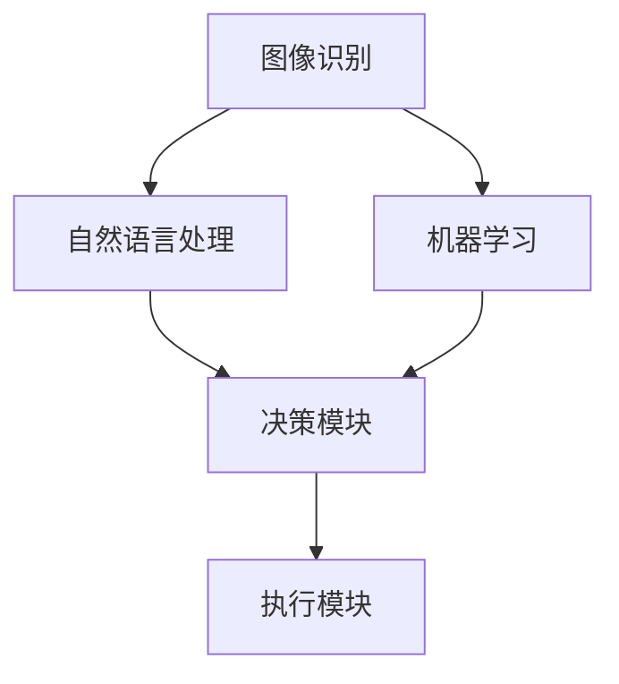
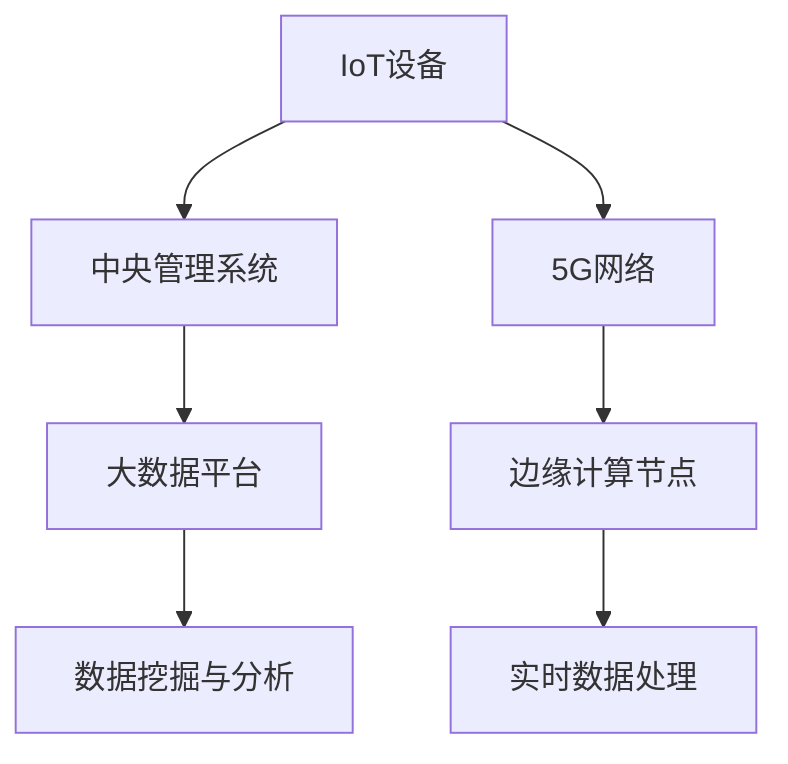
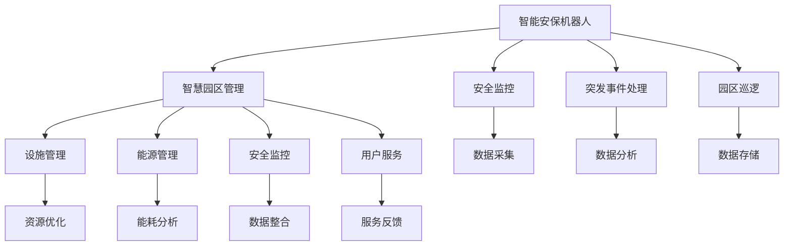
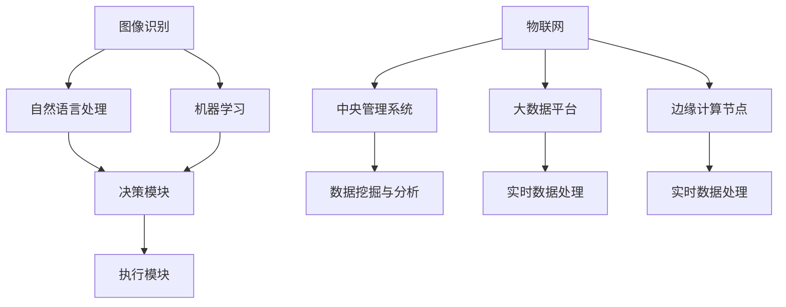

                 

### 背景介绍

在21世纪的科技浪潮中，人工智能（AI）已成为推动社会进步的重要力量。随着技术的不断演进，智慧物业领域也在逐步迎来智能化升级。未来，智慧物业将不仅仅是提高物业管理的效率，更将涉及从智能安保机器人到智慧园区管理的全面革新。本文将探讨2050年的智能安保机器人和智慧园区管理，分析其发展趋势、核心算法、应用场景以及面临的挑战。

首先，我们有必要了解当前智能安保机器人的发展现状。目前，智能安保机器人已经能够在特定场景下执行任务，如巡逻、监控和初步识别异常行为。然而，随着技术的进一步发展，未来的智能安保机器人将具备更高层次的认知能力，如自主学习、情感识别和复杂决策能力。这不仅将提升安保工作的效率，还能在应对突发事件时提供更加精准和及时的响应。

其次，智慧园区管理是未来智慧物业的重要组成部分。智慧园区管理涉及多个方面，包括设施管理、能源管理、安全监控和用户服务。通过物联网（IoT）和大数据技术的应用，智慧园区能够实现设备与设备的互联，用户与设备的互动，从而优化资源分配、提高管理效率。特别是，随着5G和边缘计算技术的普及，智慧园区管理的实时性和智能化水平将大幅提升。

本文将分为以下几个部分进行详细探讨：

1. **核心概念与联系**：首先介绍智能安保机器人和智慧园区管理中的核心概念，并通过Mermaid流程图展示其关系。

2. **核心算法原理 & 具体操作步骤**：深入探讨智能安保机器人和智慧园区管理中所使用的关键算法，包括图像识别、自然语言处理和机器学习等。

3. **数学模型和公式 & 详细讲解 & 举例说明**：阐述相关算法背后的数学原理，并通过具体的实例进行说明。

4. **项目实战：代码实际案例和详细解释说明**：提供实际的代码案例，展示如何实现智能安保机器人和智慧园区管理。

5. **实际应用场景**：分析智能安保机器人和智慧园区管理在现实生活中的应用。

6. **工具和资源推荐**：推荐相关的学习资源、开发工具和论文著作。

7. **总结：未来发展趋势与挑战**：总结未来智能安保机器人和智慧园区管理的发展趋势，并讨论可能面临的挑战。

通过本文的探讨，我们希望能够为读者提供一个全面的视角，了解未来智能安保机器人和智慧园区管理的可能性，以及如何应对其中的挑战。

#### 1.1. 智能安保机器人

智能安保机器人是智慧物业中不可或缺的一部分，其在安全监控、突发事件处理和园区巡逻等方面发挥着重要作用。以下是智能安保机器人涉及的几个核心概念：

- **图像识别**：图像识别是智能安保机器人最基本的功能之一。通过使用深度学习算法，智能安保机器人能够识别并分析监控视频中的对象，包括人物、车辆和异常行为。这一过程涉及到卷积神经网络（CNN）等先进算法。

- **自然语言处理（NLP）**：自然语言处理是使智能安保机器人具备理解和处理人类语言能力的核心技术。通过NLP，机器人能够理解口头指令、识别异常语音和行为，从而在突发事件中做出准确判断。

- **机器学习**：机器学习是智能安保机器人自主学习和优化性能的关键。通过不断从数据中学习，机器人能够提高其识别和决策能力，减少误报率，并更好地适应不同的环境和任务。

为了更清晰地展示智能安保机器人中的核心概念及其相互关系，我们可以使用Mermaid流程图来描述：



在这个流程图中，图像识别和自然语言处理作为输入模块，通过机器学习不断优化，最终由决策模块生成行动指令，由执行模块执行。这种结构使得智能安保机器人能够高效地应对各种复杂情况。

- **决策模块**：决策模块是智能安保机器人的核心，负责分析输入数据，并基于机器学习算法生成决策。这一模块需要处理大量的图像和语音数据，并能够实时响应。

- **执行模块**：执行模块根据决策模块的指令执行具体的操作，如移动、报警或启动紧急程序。这一模块需要具备高精度的执行能力，以确保机器人的行动准确无误。

通过以上核心概念的介绍，我们可以看到，智能安保机器人不仅需要强大的硬件支持，还需要复杂的软件算法来驱动。这些核心概念相互关联，共同构成了智能安保机器人的智能体系。

#### 1.2. 智慧园区管理

智慧园区管理是未来智慧物业的重要组成部分，其核心在于通过物联网（IoT）和大数据技术的应用，实现园区内各种设备和设施的互联互通，从而提升管理效率和服务质量。以下是智慧园区管理涉及的主要核心概念：

- **物联网（IoT）**：物联网是将各种物理设备通过网络连接起来，实现智能管理和控制的技术。在智慧园区管理中，IoT设备包括智能门禁系统、智能照明系统、智能监控系统等，这些设备能够实时收集数据，并通过无线网络传输到中央管理系统。

- **大数据**：大数据技术是处理和分析大量数据的能力，通过大数据技术，智慧园区能够对收集到的海量数据进行存储、分析和挖掘，从而发现潜在的模式和趋势。大数据在智慧园区管理中的应用包括用户行为分析、设备维护预测和能源消耗优化等。

- **5G**：5G技术是第五代移动通信技术，其高速率和低延迟特点为智慧园区管理提供了更加可靠的通信基础。5G的普及将使智慧园区实现更快速的数据传输和实时控制，提高管理效率和响应速度。

- **边缘计算**：边缘计算是将数据处理和分析能力分散到网络边缘，以减少数据传输延迟和带宽消耗的技术。在智慧园区管理中，边缘计算可以实现对本地数据的实时处理和分析，从而提高系统的响应速度和可靠性。

为了更直观地展示智慧园区管理中的核心概念及其关系，我们可以使用Mermaid流程图来描述：



在这个流程图中，IoT设备和5G网络作为数据采集和传输的入口，通过边缘计算节点和中央管理系统进行数据处理和分析，最终通过大数据平台进行数据挖掘和分析。

- **中央管理系统**：中央管理系统是智慧园区管理的核心，负责收集、存储、处理和分析各种数据，并生成决策和报告。中央管理系统通常包括数据采集模块、数据处理模块和决策支持模块。

- **大数据平台**：大数据平台负责对收集到的数据进行分析和挖掘，发现潜在的模式和趋势，从而为决策提供支持。大数据平台通常包括数据存储、数据分析和数据可视化等模块。

- **边缘计算节点**：边缘计算节点位于网络边缘，负责对本地数据进行实时处理和分析，从而提高系统的响应速度和可靠性。边缘计算节点通常包括数据处理模块和决策模块。

通过以上核心概念的介绍，我们可以看到，智慧园区管理是一个复杂而系统的工程，涉及多个技术和领域的综合应用。这些核心概念相互关联，共同构建了智慧园区管理的智能体系。

#### 1.3. 关联与联系

智能安保机器人和智慧园区管理是未来智慧物业中的两个重要组成部分，它们在功能和目标上存在显著的关联和联系。智能安保机器人是智慧园区管理中不可或缺的执行工具，而智慧园区管理则为智能安保机器人提供了广阔的应用场景和数据支持。

首先，从功能上看，智能安保机器人主要负责安全监控、突发事件处理和园区巡逻等工作，而智慧园区管理则涵盖了设施管理、能源管理、安全监控和用户服务等多个方面。智能安保机器人通过与智慧园区管理系统的集成，可以实现对园区内各个方面的实时监控和管理，从而提高整个园区的安全性和运营效率。

其次，从目标上看，智能安保机器人和智慧园区管理都致力于提升园区的智能化水平和服务质量。智能安保机器人的目标是确保园区的安全，减少人为干预，提高响应速度和准确性；而智慧园区管理的目标是优化资源分配、提高管理效率、提升用户满意度。两者在目标上的契合，使得它们可以共同推动园区的智能化升级。

为了更好地展示智能安保机器人和智慧园区管理之间的关系，我们可以使用Mermaid流程图来描述：



在这个流程图中，智能安保机器人通过安全监控、突发事件处理和园区巡逻等功能，与智慧园区管理中的设施管理、能源管理、安全监控和用户服务等模块进行数据交互和功能互补。这种紧密的关联和联系，使得智能安保机器人和智慧园区管理能够协同工作，共同提升园区的智能化水平。

#### 1.4. 当前发展现状

目前，智能安保机器人和智慧园区管理正处于快速发展阶段。在智能安保机器人方面，多种类型的机器人已投入使用，如巡逻机器人、安防机器人和服务机器人等。这些机器人通过图像识别、自然语言处理和机器学习等先进技术，实现了对园区内安全事件的实时监控和处理。例如，巡逻机器人可以在园区内进行自动巡逻，同时通过人脸识别技术捕捉可疑人员，并在发现异常情况时立即报警。

在智慧园区管理方面，物联网（IoT）和大数据技术的应用使得园区管理更加智能化。通过部署各种IoT设备，如智能门禁系统、智能照明系统和智能监控系统，园区管理者可以实时监控和管理园区内的各种设施。同时，大数据技术通过对海量数据的分析和挖掘，帮助管理者发现潜在问题，优化资源配置，提高运营效率。

目前，智能安保机器人和智慧园区管理在实际应用中已取得一定成果。例如，一些大型企业园区和智慧城市项目已经开始使用智能安保机器人进行安全巡逻和监控，取得了显著的安全提升效果。同时，智慧园区管理在提高能源利用效率、优化设施维护和提升用户满意度方面也取得了明显成效。

尽管如此，智能安保机器人和智慧园区管理仍面临一些挑战。例如，技术成熟度、数据安全性和隐私保护等问题需要进一步解决。此外，由于智能安保机器人和智慧园区管理涉及多个技术领域的综合应用，因此需要建立完善的标准和规范，以确保系统的互操作性和可靠性。

总的来说，当前智能安保机器人和智慧园区管理正处于快速发展阶段，未来有望在更多领域得到应用和推广。随着技术的不断进步和应用的深入，智能安保机器人和智慧园区管理将为人们提供更加安全、高效和舒适的居住和工作环境。

#### 1.5. 未来发展趋势

展望未来，智能安保机器人和智慧园区管理将在技术进步的推动下，朝着更加智能化、高效化和人性化的方向发展。以下是未来智能安保机器人和智慧园区管理可能呈现的发展趋势：

首先，随着人工智能技术的持续突破，智能安保机器人的认知能力和决策水平将得到显著提升。未来的智能安保机器人将不仅仅能够执行简单的巡逻和监控任务，还具备更强的自主学习能力，能够通过深度学习和强化学习不断优化其行为模式，从而在面对复杂多变的环境时能够做出更加精准和有效的决策。

其次，物联网（IoT）技术的快速发展将为智慧园区管理带来更多的可能性。更多的设备和系统将实现互联互通，形成更加完整的智慧园区生态系统。例如，智能停车系统、智能能源管理系统和智能环境监测系统等将进一步提升园区的运营效率，同时为智能安保机器人提供更加丰富的数据支持。

第三，5G和边缘计算技术的普及将使智慧园区管理更加实时和高效。5G网络的高速传输能力和低延迟特性，将使智能安保机器人能够实时接收和处理大量数据，从而快速响应突发事件。而边缘计算技术则可以将部分计算任务分散到网络边缘，减少数据传输的延迟，提高系统的实时性和可靠性。

第四，大数据和云计算技术的结合将为智慧园区管理提供强大的数据处理和分析能力。通过大数据平台和云计算服务，智慧园区能够对海量数据进行分析和挖掘，发现潜在的问题和趋势，从而进行针对性的管理和优化。例如，通过用户行为分析和设备运行数据，智慧园区可以优化能源消耗，提高设施利用率。

最后，随着技术的不断成熟和应用的普及，智能安保机器人和智慧园区管理将在更多的领域得到应用和推广。未来，智慧园区可能成为城市管理和公共服务的重要组成部分，不仅涵盖商业和住宅园区，还可能扩展到工业园区、科技园区和农业园区等。通过智能安保机器人和智慧园区管理的协同作用，人们将享受到更加安全、便捷和高效的生活和工作环境。

总的来说，未来的智能安保机器人和智慧园区管理将在技术进步的推动下，朝着更加智能化、高效化和人性化的方向发展，为城市和社区的发展提供强大的技术支撑。

#### 1.6. 智能安保机器人的具体应用场景

智能安保机器人在未来智慧物业中拥有广泛的应用场景，以下是几个典型的应用实例：

首先，在大型商业综合体中，智能安保机器人可以替代人工进行全天候的巡逻和监控。这些机器人通过图像识别技术，可以实时捕捉并分析监控视频，识别潜在的安全威胁，如可疑人物或物品。一旦发现异常，机器人会立即向管理员发送警报，并自动采取相应措施，如启动紧急预案或进行现场取证。此外，机器人还可以通过自然语言处理技术，理解管理员的指令，并执行具体的操作，如开启门禁、打开照明等。

其次，在智慧园区中，智能安保机器人可以协助进行园区安全管理。园区通常有大量人员流动和复杂的设施，因此，安全监控和事件响应是管理的重点。智能安保机器人可以在园区内进行自动巡逻，同时通过移动传感器和热成像技术，实时监测环境和人员状况。在发现异常时，机器人能够迅速定位并采取行动，如引导人员疏散或进行现场勘查。此外，机器人还可以与园区内的智能门禁系统、视频监控系统等设备联动，形成完整的安防体系。

第三，在大型交通枢纽中，智能安保机器人可以帮助维护公共秩序。例如，在火车站、机场和地铁站等场所，由于人流量大且复杂，安保工作面临巨大挑战。智能安保机器人可以在这些场所进行巡逻，实时监控乘客的行为和状态，识别潜在的安全隐患。通过人脸识别技术，机器人可以识别逃票或可疑人员，并立即通知管理人员进行处理。此外，机器人还可以协助进行现场指引，帮助乘客快速找到目的地，减少拥堵和混乱。

最后，在特殊场所，如医院和学校等，智能安保机器人可以提供专业的安全保障。在医院中，机器人可以协助进行安全巡逻和监控，防止医疗设备被盗或意外损坏。在学校中，机器人可以协助维护校园安全，防止校园欺凌和突发事件的发生。通过自然语言处理技术，机器人可以与师生互动，提供必要的帮助和指引。

总之，智能安保机器人在未来的智慧物业中具有广泛的应用前景，不仅能够提高安保工作的效率和准确性，还能提供更加安全、便捷和高效的生活和工作环境。

#### 1.7. 智慧园区管理的具体应用场景

智慧园区管理在未来的智慧物业中扮演着至关重要的角色，其具体应用场景广泛且多样化。以下是几个典型的应用实例：

首先，在大型科技园区中，智慧园区管理可以实现高效的空间利用和设备管理。通过物联网（IoT）技术，园区内的各个设施，如会议室、实验室、办公室和公共设施，都可以实现互联互通。管理员可以通过智能终端实时监控和调节设备的运行状态，如空调、照明和安防系统。例如，当会议室预订后，系统会自动调节温度和照明，确保会议室处于最佳状态。此外，通过智能门禁系统，园区管理者可以控制员工的出入权限，确保安全。

其次，在商业园区中，智慧园区管理可以显著提升用户体验和运营效率。通过智能停车系统，用户可以提前查询停车位状态，选择最佳停车位置，减少找车时间和拥堵。智能能源管理系统则能够实时监控和调节园区内的电力和水资源使用，实现能源优化和节约。例如，在用电高峰期，系统可以自动调节部分非关键设施的用电量，避免电力过载。同时，智慧园区管理还可以通过大数据分析，预测用户需求，提供个性化的服务，如推荐附近餐厅、健身房和休闲设施等。

第三，在智能农业园区中，智慧园区管理可以实现精准农业和自动化管理。通过部署传感器和无人机，园区管理者可以实时监控作物生长状况和土壤湿度，从而优化灌溉和施肥方案。智能温室系统可以自动调节温度、湿度和光照，确保作物在最佳环境下生长。此外，通过物联网技术，园区可以实现从种植到销售的全程监控和管理，提高农产品的质量和市场竞争力。

最后，在生态园区中，智慧园区管理可以促进可持续发展。通过智能环境监测系统，园区管理者可以实时监控空气质量、水质和噪音水平，及时发现和处理环境污染问题。同时，智慧园区管理可以通过能源回收和循环利用技术，减少资源浪费，降低运营成本。例如，废水和废气可以通过处理后再次利用，减少对环境的负担。

总之，智慧园区管理在未来的智慧物业中具有广泛的应用场景，不仅可以提高管理效率，还能提供更加舒适、便捷和环保的生活和工作环境。通过物联网、大数据和人工智能等技术的综合应用，智慧园区管理将成为推动智慧物业发展的重要力量。

### 2. 核心概念与联系

在深入探讨智能安保机器人和智慧园区管理之前，我们需要明确其中的核心概念，并了解它们之间的相互关系。以下是智能安保机器人和智慧园区管理中的几个关键概念：

- **图像识别**：图像识别是使智能安保机器人能够分析监控视频中的图像内容的重要技术。它利用深度学习算法，从大量图像数据中提取特征，进行分类和识别。图像识别可以用于人员识别、车辆识别和异常行为检测等。

- **自然语言处理（NLP）**：自然语言处理是使智能安保机器人理解和处理人类语言的技术。NLP技术包括文本分类、情感分析和语音识别等，使机器人能够接收和执行口头指令，进行对话，并理解文本信息。

- **机器学习**：机器学习是使智能安保机器人具备自主学习能力的重要技术。通过从数据中学习，机器人可以不断优化其行为和决策，提高识别和响应的准确性。

- **物联网（IoT）**：物联网是将各种物理设备通过网络连接起来，实现智能管理和控制的技术。在智慧园区管理中，IoT设备包括智能门禁系统、智能照明系统和智能监控系统等，能够实时收集数据，并通过无线网络传输到中央管理系统。

- **大数据**：大数据技术是处理和分析海量数据的能力，通过对收集到的数据进行分析和挖掘，智慧园区管理可以发现潜在的问题和趋势，优化资源配置，提高管理效率。

- **5G**：5G是第五代移动通信技术，具有高速率和低延迟的特点，为智慧园区管理提供了更加可靠的通信基础，使智能安保机器人能够实时接收和处理大量数据。

- **边缘计算**：边缘计算是将数据处理和分析能力分散到网络边缘，以减少数据传输延迟和带宽消耗的技术。边缘计算在智慧园区管理中可以实现对本地数据的实时处理和分析，提高系统的实时性和响应速度。

为了更直观地展示这些核心概念及其相互关系，我们可以使用Mermaid流程图来描述：



在这个流程图中，图像识别、自然语言处理和机器学习作为智能安保机器人的核心技术，通过决策模块和执行模块实现具体的操作。物联网、大数据和边缘计算作为智慧园区管理的关键技术，通过中央管理系统、大数据平台和边缘计算节点实现数据的收集、处理和分析。

通过这个流程图，我们可以清晰地看到智能安保机器人和智慧园区管理中的核心概念及其相互关系。这些核心概念共同构成了智能安保机器人和智慧园区管理的智能体系，使得它们能够协同工作，实现更高效、更智能的管理。

#### 2.1. 图像识别

图像识别是智能安保机器人和智慧园区管理中至关重要的技术，它使机器人能够通过分析监控视频中的图像内容，识别和分类图像中的对象。图像识别技术主要依赖于深度学习算法，尤其是卷积神经网络（CNN）。以下是图像识别技术的具体工作原理：

首先，图像识别需要大量的训练数据。这些数据包括各种场景下的图像，如人物、车辆、物体和异常行为等。通过这些数据，算法能够学习并提取图像的特征。卷积神经网络（CNN）是一种特殊的深度学习模型，专门用于处理图像数据。它通过多层卷积和池化操作，逐层提取图像的局部特征，并逐步抽象为更高层次的全局特征。

其次，图像识别过程可以分为以下几个步骤：

1. **数据预处理**：在训练过程中，需要对图像进行预处理，包括缩放、裁剪、翻转和归一化等操作，以增加模型的泛化能力。

2. **特征提取**：通过卷积层和池化层，CNN可以提取图像的局部特征。每个卷积层都会生成一个新的特征图，这些特征图包含了图像的不同特征信息。

3. **特征融合**：多个卷积层和池化层的输出会合并成更高层次的全局特征。这些特征可以用来进行分类和识别。

4. **分类与识别**：最后，通过全连接层和激活函数，模型会对提取到的特征进行分类和识别。常见的分类方法包括softmax回归和多分类支持向量机（SVM）。

为了提高图像识别的准确性，还可以使用以下几种技术：

- **迁移学习**：迁移学习利用预训练的模型来提高新任务的性能。通过在特定领域的大量数据上预训练模型，可以减少训练时间，提高识别准确性。

- **数据增强**：数据增强通过生成图像的变体来增加训练数据的多样性，从而提高模型的泛化能力。常见的数据增强方法包括随机裁剪、旋转、翻转和颜色变换等。

- **多模型融合**：通过融合多个模型的预测结果，可以进一步提高识别的准确性。例如，可以结合CNN、循环神经网络（RNN）和长短期记忆网络（LSTM）等多种模型，进行综合判断。

在实际应用中，图像识别技术已被广泛应用于智能安保机器人和智慧园区管理。例如，在智能安保机器人中，图像识别可以用于人脸识别、车辆识别和异常行为检测等。在智慧园区管理中，图像识别可以用于监控视频分析、设备故障检测和人员流量统计等。

通过上述图像识别技术，智能安保机器人和智慧园区管理能够高效地处理和分析监控视频，提高安全监控和管理效率。未来，随着深度学习算法的不断优化和硬件性能的提升，图像识别技术将在更多场景中得到应用，为智慧物业的发展提供更强有力的技术支撑。

#### 2.2. 自然语言处理（NLP）

自然语言处理（NLP）是智能安保机器人和智慧园区管理中不可或缺的核心技术之一，它使机器人能够理解和处理人类语言。NLP技术主要包括文本分类、情感分析和语音识别等，下面我们将详细探讨这些技术的工作原理和应用。

**文本分类**：文本分类是NLP中的基本任务，旨在将文本数据自动归类到预定义的类别中。常见的文本分类方法包括朴素贝叶斯分类器、支持向量机（SVM）和深度学习模型（如卷积神经网络（CNN）和循环神经网络（RNN））。文本分类在智能安保机器人中有着广泛的应用，例如，可以用于分析社交媒体上的言论，识别潜在的威胁和异常行为。

- **朴素贝叶斯分类器**：朴素贝叶斯分类器是一种基于概率理论的分类模型。它通过计算文本中各个单词的概率，利用贝叶斯公式得出文本属于某个类别的概率。朴素贝叶斯分类器的优点是简单和高效，适用于大规模文本数据的分类。

- **支持向量机（SVM）**：支持向量机是一种基于优化理论的分类模型，它通过寻找一个最佳的超平面，将不同类别的文本数据分隔开。SVM在处理高维数据时表现优秀，适用于复杂文本分类任务。

- **深度学习模型**：深度学习模型，如卷积神经网络（CNN）和循环神经网络（RNN），通过多层神经网络结构，能够自动提取文本的深层特征，实现高精度的分类。例如，CNN可以捕捉文本中的局部特征，而RNN则能够处理文本的序列信息。

**情感分析**：情感分析是NLP中的另一个重要任务，旨在确定文本的情感倾向，如正面、负面或中性。情感分析在智能安保机器人中可以用于分析用户的情绪状态，识别潜在的风险和问题。常见的情感分析方法包括基于规则的方法、机器学习方法和深度学习方法。

- **基于规则的方法**：基于规则的方法通过定义一系列规则来分析文本的情感。例如，如果文本中包含“好”和“喜欢”等词语，则判断为正面情感。这种方法简单直观，但容易受到规则覆盖不全的影响。

- **机器学习方法**：机器学习方法通过训练模型来识别文本的情感倾向。常见的机器学习方法包括朴素贝叶斯、SVM和随机森林等。这些方法能够处理大规模数据，并具有一定的泛化能力。

- **深度学习方法**：深度学习方法，如CNN和LSTM，通过多层神经网络结构，能够自动提取文本的深层特征，实现高精度的情感分析。例如，LSTM能够处理文本中的时间序列信息，捕捉情绪的波动。

**语音识别**：语音识别是将人类的语音转换为文本的技术，是智能安保机器人与人类进行交互的重要手段。语音识别在智能安保机器人中可以用于接收和处理口头指令，实现人机交互。常见的语音识别技术包括隐马尔可夫模型（HMM）、高斯混合模型（GMM）和深度神经网络（DNN）。

- **隐马尔可夫模型（HMM）**：隐马尔可夫模型是一种统计模型，用于捕捉语音信号中的状态转移和观测概率。HMM在语音识别中具有悠久的历史，适用于简单的语音识别任务。

- **高斯混合模型（GMM）**：高斯混合模型是一种概率模型，用于表示语音信号的概率分布。GMM与HMM结合，可以用于构建更加复杂的语音识别模型。

- **深度神经网络（DNN）**：深度神经网络是一种多层神经网络结构，通过多层非线性变换，能够自动提取语音信号的深层特征。DNN在语音识别中表现出色，已经成为当前主流的语音识别技术。

综上所述，自然语言处理（NLP）技术在智能安保机器人和智慧园区管理中具有广泛的应用。通过文本分类、情感分析和语音识别等技术，智能安保机器人能够更好地理解和处理人类语言，实现智能化管理和服务。随着深度学习等技术的不断发展，NLP技术将在智能安保机器人和智慧园区管理中发挥越来越重要的作用。

#### 2.3. 机器学习

机器学习是智能安保机器人和智慧园区管理中不可或缺的核心技术，它使机器人能够从数据中学习，并自主优化其行为和决策。机器学习通过构建复杂的算法模型，使系统能够识别模式、预测结果并做出决策。以下是机器学习的几种常见算法和模型：

**1. 监督学习（Supervised Learning）**

监督学习是机器学习中最基本的一种方法，它通过已标记的数据来训练模型。已标记的数据包含输入和对应的输出，通过学习这些数据，模型可以预测新的输入数据对应的输出。

- **线性回归（Linear Regression）**：线性回归是一种简单的监督学习算法，用于预测连续值输出。它通过拟合输入和输出之间的线性关系来预测结果。

- **逻辑回归（Logistic Regression）**：逻辑回归是一种用于预测分类结果的监督学习算法，特别适用于二分类问题。它通过拟合输入和输出之间的概率关系来预测结果。

- **支持向量机（Support Vector Machine, SVM）**：支持向量机是一种强大的分类算法，通过寻找一个最佳的超平面来分隔不同类别的数据。它适用于高维数据，具有很好的泛化能力。

**2. 无监督学习（Unsupervised Learning）**

无监督学习不依赖于已标记的数据，而是通过分析未标记的数据来发现数据中的模式和结构。

- **聚类算法（Clustering Algorithms）**：聚类算法用于将数据点划分为多个群组，使得群组内的数据点彼此接近，而群组间的数据点彼此远离。常见的聚类算法包括K-均值聚类、层次聚类和DBSCAN等。

- **主成分分析（Principal Component Analysis, PCA）**：主成分分析是一种降维技术，通过将数据投影到新的坐标系中，提取最重要的特征，从而减少数据的维度。

- **自编码器（Autoencoder）**：自编码器是一种无监督学习算法，用于学习数据的有效表示。它通过编码和解码器来压缩和重构数据，从而提取数据的特征。

**3. 强化学习（Reinforcement Learning）**

强化学习是一种通过试错来学习的算法，它通过不断尝试并反馈结果来优化行为。

- **Q学习（Q-Learning）**：Q学习是一种基于值函数的强化学习算法，通过学习状态-动作价值函数来选择最优动作。它通过更新Q值来不断优化策略。

- **深度强化学习（Deep Reinforcement Learning）**：深度强化学习结合了深度学习和强化学习，通过深度神经网络来学习复杂的值函数或策略。它适用于解决复杂环境中的决策问题。

**4. 聚类算法（Clustering Algorithms）**

聚类算法是机器学习中的一种重要技术，用于将数据点划分为多个群组，使得群组内的数据点彼此接近，而群组间的数据点彼此远离。

- **K-均值聚类（K-Means Clustering）**：K-均值聚类是一种简单的聚类算法，通过随机初始化中心点，迭代计算并更新中心点，最终将数据点划分为K个群组。

- **层次聚类（Hierarchical Clustering）**：层次聚类是一种基于层次结构的聚类算法，通过自底向上或自顶向下的方式构建聚类层次，从而将数据点划分为多个群组。

- **DBSCAN（Density-Based Spatial Clustering of Applications with Noise）**：DBSCAN是一种基于密度的聚类算法，它通过检测数据点的密度分布来聚类，能够发现任意形状的聚类结构。

**5. 主成分分析（Principal Component Analysis, PCA）**

主成分分析是一种降维技术，通过将数据投影到新的坐标系中，提取最重要的特征，从而减少数据的维度。

- **自编码器（Autoencoder）**：自编码器是一种无监督学习算法，用于学习数据的有效表示。它通过编码和解码器来压缩和重构数据，从而提取数据的特征。

通过上述机器学习算法和模型，智能安保机器人能够从数据中学习，并不断优化其行为和决策。在智能安保机器人和智慧园区管理中，机器学习技术可以用于安全监控、事件预测、资源优化等多个方面，提高系统的智能化水平和运营效率。

#### 2.4. 物联网（IoT）

物联网（Internet of Things，IoT）是智能安保机器人和智慧园区管理的基石，它通过将各种物理设备连接到互联网，实现数据的实时采集、传输和处理，从而提升园区的智能化水平。以下是物联网技术的基本概念、组成部分及其在智能安保机器人和智慧园区管理中的应用。

**基本概念**

物联网是指通过互联网将物理设备连接起来，实现设备与设备之间、设备与网络之间以及设备与用户之间的通信和协作。物联网的核心思想是使一切物品都能够互联互通，从而实现智能化管理和控制。

**组成部分**

物联网系统通常由以下几个关键组成部分构成：

1. **感知层**：感知层是物联网系统的最底层，负责感知和采集物理世界中的数据。常见的感知设备包括传感器、摄像头、智能门禁系统、智能照明系统等。这些设备能够实时监测环境参数，如温度、湿度、光照强度、人员流动等。

2. **网络层**：网络层是物联网系统的通信层，负责将感知层采集到的数据传输到中央管理系统。网络层可以采用多种通信协议和技术，如Wi-Fi、蓝牙、ZigBee、LoRa等，以确保数据的可靠传输。

3. **平台层**：平台层是物联网系统的数据处理和分析层，负责收集、存储、处理和分析来自感知层的海量数据。平台层通常包括边缘计算节点和云计算中心，通过边缘计算技术实现对本地数据的实时处理和分析，减少数据传输的延迟和带宽消耗。

4. **应用层**：应用层是物联网系统的最高层，负责将处理后的数据应用于具体的业务场景。在智能安保机器人和智慧园区管理中，应用层包括安全监控、设备管理、能源管理、环境监测等多个方面。

**应用**

物联网技术在智能安保机器人和智慧园区管理中有着广泛的应用，以下是几个典型的应用实例：

1. **智能安防**：物联网技术可以实现对园区内各个角落的实时监控。通过部署摄像头、传感器等设备，可以实时捕捉并传输图像和视频数据。智能安保机器人可以通过分析这些数据，识别异常行为，并采取相应的措施，如报警、录像和现场处理。

2. **设备管理**：物联网技术可以实现对园区内各种设备的智能管理。例如，通过智能门禁系统，可以实时记录员工的出入信息，提高安全管理效率。智能照明系统可以根据环境亮度和人员活动自动调节灯光，提高能源利用效率。

3. **能源管理**：物联网技术可以实现对园区内能源的实时监控和管理。通过部署智能电表、智能水表等设备，可以实时监测和记录能源消耗情况，帮助园区管理者进行能源优化和节约。

4. **环境监测**：物联网技术可以实现对园区内环境参数的实时监测。例如，通过部署空气质量监测设备、噪音监测设备等，可以实时了解园区内的环境状况，及时发现和处理环境污染问题。

5. **智能交通**：在智慧园区中，物联网技术可以用于优化交通流量和管理。通过部署智能交通灯、车辆检测器等设备，可以实时监测交通状况，并根据实时数据调整交通信号灯的时长，减少交通拥堵。

总之，物联网技术为智能安保机器人和智慧园区管理提供了强大的数据采集、传输和处理能力，使其能够实现更加智能化和高效化的管理。随着物联网技术的不断发展，未来智能安保机器人和智慧园区管理将在更多领域得到应用和推广。

#### 2.5. 大数据

大数据是智能安保机器人和智慧园区管理的重要支撑技术，它通过对海量数据的存储、处理和分析，提供有价值的信息，帮助管理者做出更加精准和高效的决策。以下是大数据技术的基本概念、组成部分及其在智能安保机器人和智慧园区管理中的应用。

**基本概念**

大数据（Big Data）是指无法用传统数据处理工具在合理时间内完成处理的数据集合，具有数据量大、类型多、处理速度快和真实性高等特点。大数据技术涉及数据的采集、存储、处理、分析和可视化等多个环节。

**组成部分**

大数据技术包括以下几个关键组成部分：

1. **数据采集**：数据采集是大数据技术的第一步，通过传感器、摄像头、移动设备等手段，收集各种来源的数据，如文本、图像、视频、音频等。

2. **数据存储**：数据存储是大数据技术的核心，通过分布式存储技术，如Hadoop分布式文件系统（HDFS）、NoSQL数据库等，实现海量数据的存储和管理。这些系统具备高扩展性、高可靠性和高性能等特点。

3. **数据处理**：数据处理包括数据的清洗、转换和集成等步骤，通过数据预处理技术，使数据更加适合分析和挖掘。常见的数据处理工具包括MapReduce、Spark等。

4. **数据分析**：数据分析是大数据技术的核心环节，通过统计分析和机器学习等技术，从海量数据中提取有价值的信息和模式。数据分析工具包括SQL、Hadoop、Spark等。

5. **数据可视化**：数据可视化是将分析结果以图形、图表等形式呈现，帮助用户更直观地理解数据。数据可视化工具包括Tableau、Power BI等。

**应用**

大数据技术在智能安保机器人和智慧园区管理中有着广泛的应用，以下是几个典型的应用实例：

1. **安全监控**：大数据技术可以实现对园区内海量监控视频数据的实时处理和分析，通过图像识别、行为分析等技术，发现潜在的安全威胁。例如，通过分析监控视频，可以识别可疑人物、车辆和异常行为，并及时报警。

2. **设备管理**：大数据技术可以实现对园区内各种设备的实时监控和故障预测。通过对设备运行数据的收集和分析，可以提前发现设备故障的迹象，及时进行维护和更换，减少设备故障对园区运营的影响。

3. **能源管理**：大数据技术可以实现对园区内能源消耗的实时监测和分析，通过能源消耗数据的收集和分析，优化能源使用，提高能源利用效率。例如，通过分析空调、照明、电梯等设备的能耗数据，可以制定合理的能耗管理策略。

4. **环境监测**：大数据技术可以实现对园区内环境参数的实时监测和分析，通过传感器数据的收集和分析，了解空气质量、水质、噪音等环境指标，及时发现和处理环境污染问题。

5. **用户服务**：大数据技术可以用于分析用户行为数据，了解用户需求和行为习惯，提供个性化的服务和推荐。例如，通过分析用户的访问记录和消费数据，可以为用户提供个性化的产品推荐和优惠活动。

总之，大数据技术为智能安保机器人和智慧园区管理提供了强大的数据支撑和分析能力，使其能够实现更加智能化和高效化的管理。随着大数据技术的不断发展，未来智能安保机器人和智慧园区管理将在更多领域得到应用和推广。

#### 2.6. 5G

5G（第五代移动通信技术）是智能安保机器人和智慧园区管理中的重要技术支撑，其高速率、低延迟和高可靠性的特点，为实时数据传输和高效数据处理提供了强有力的保障。以下是5G技术的基本概念、特点及其在智能安保机器人和智慧园区管理中的应用。

**基本概念**

5G是第五代移动通信技术的简称，它是继4G、3G和2G之后的新一代移动通信技术。5G旨在实现更高的数据传输速率、更低的延迟和更大的连接容量，以满足日益增长的数据需求和应用需求。

**特点**

1. **高速率**：5G的下载速度可以达到数十Gbps，是4G的数十倍，能够满足大量数据的快速传输需求。这使得智能安保机器人和智慧园区管理中的高清视频流、实时监控数据等大容量数据能够快速传输，提高系统的响应速度和处理效率。

2. **低延迟**：5G的端到端延迟可低至1毫秒，比4G低一个数量级。低延迟使得智能安保机器人能够实时响应突发事件，迅速做出决策，提高安全监控的准确性和及时性。同时，在智慧园区管理中，低延迟的网络连接有助于实时调节设备和系统的运行状态，提高管理效率。

3. **高可靠性**：5G采用了新的无线接入技术，如大规模MIMO（多输入多输出）、波束成形等，提高了网络的稳定性和可靠性。这使得智能安保机器人和智慧园区管理能够在复杂环境中保持稳定的网络连接，确保数据传输的可靠性。

**应用**

1. **智能安保机器人**：5G技术为智能安保机器人提供了高速、低延迟的网络连接，使得机器人能够实时接收和处理监控数据。例如，在巡逻和监控过程中，机器人可以通过5G网络实时传输视频流，实现对现场情况的实时监控和判断。此外，5G的低延迟特性也使得机器人能够迅速响应指令，执行紧急任务。

2. **智慧园区管理**：5G技术为智慧园区管理提供了强大的数据传输能力，有助于实现园区内各个系统的互联互通。例如，通过5G网络，园区管理者可以实时监控和调节各种设备，如智能照明系统、智能安防系统和能源管理系统等，提高管理效率和资源利用率。此外，5G的低延迟特性也使得园区内的智能设备能够实现实时控制，提高系统的响应速度和稳定性。

3. **实时数据处理**：5G的高速率和低延迟特性使得实时数据处理成为可能。在智能安保机器人和智慧园区管理中，实时数据处理对于应对突发事件和优化资源配置至关重要。例如，通过5G网络，机器人可以实时传输和处理监控数据，快速识别异常情况并采取相应措施。同时，智慧园区管理中的智能设备可以通过5G网络实时传输数据，实现数据的快速分析和处理，从而优化管理决策。

总之，5G技术为智能安保机器人和智慧园区管理提供了强大的技术支撑，使得系统能够实现高速、低延迟和高效的数据传输和处理，提高安全性和管理效率。随着5G技术的不断发展和普及，智能安保机器人和智慧园区管理将在更多领域得到应用和推广。

#### 2.7. 边缘计算

边缘计算（Edge Computing）是一种分布式计算架构，它将数据处理和分析的任务从云端转移到网络边缘，即靠近数据源的地方。边缘计算通过在本地设备上执行计算任务，减少数据传输的延迟和带宽消耗，提高系统的实时性和响应速度。以下是边缘计算的基本概念、原理及其在智能安保机器人和智慧园区管理中的应用。

**基本概念**

边缘计算是一种分布式计算架构，通过在网络边缘部署计算节点，实现数据的局部处理和分析。这些计算节点可以是物联网设备、智能终端、服务器等。边缘计算的核心思想是将计算任务分散到网络边缘，减少对中心云的依赖，提高系统的效率和可靠性。

**原理**

边缘计算的原理主要包括以下几个方面：

1. **数据预处理**：在数据传输到云端之前，边缘计算节点可以对数据进行预处理，包括过滤、压缩和简化等操作，从而减少数据传输的体积和传输时间。

2. **局部处理**：边缘计算节点可以对本地数据进行实时处理和分析，从而实现快速响应。例如，智能安保机器人可以在本地进行图像识别和异常行为检测，而不需要将大量数据传输到云端进行分析。

3. **数据聚合**：边缘计算节点可以将本地处理的结果进行聚合，然后上传到云端或中心服务器。这样可以减少云端的计算负担，同时提高系统的整体响应速度。

4. **边缘智能**：随着边缘计算技术的发展，边缘计算节点不仅具备数据处理能力，还具备一定的智能决策能力。例如，智能安保机器人可以在本地执行简单的决策，如根据环境数据自动调节灯光亮度，而不需要等待云端指令。

**应用**

1. **智能安保机器人**：边缘计算在智能安保机器人中的应用十分广泛。通过在机器人上部署边缘计算节点，可以实现数据的本地处理和分析，从而减少数据传输的延迟和带宽消耗。例如，在巡逻和监控过程中，机器人可以通过边缘计算节点实时处理图像数据，快速识别异常行为，并立即采取相应措施。此外，边缘计算还可以提高智能安保机器人的自主决策能力，使其能够更好地适应复杂多变的环境。

2. **智慧园区管理**：边缘计算在智慧园区管理中也发挥着重要作用。通过在园区内的各个智能设备上部署边缘计算节点，可以实现数据的实时处理和分析，提高园区的管理效率和响应速度。例如，在智能照明系统中，边缘计算节点可以实时监测环境光强，并根据数据自动调节灯光亮度，从而提高能源利用效率。同时，边缘计算还可以优化园区内的交通管理，通过实时分析交通流量数据，调整交通信号灯的时长，减少交通拥堵。

3. **设备维护预测**：边缘计算还可以用于设备维护预测。通过在设备上部署边缘计算节点，可以实时收集设备运行数据，分析设备的健康状态，预测潜在的故障。例如，在园区内的空调设备中，边缘计算节点可以实时监测空调的运行状态，分析温度、湿度等参数，预测空调的故障风险，从而提前进行维护，减少设备故障对园区运营的影响。

总之，边缘计算为智能安保机器人和智慧园区管理提供了强大的数据处理和分析能力，通过将计算任务分散到网络边缘，提高了系统的实时性和响应速度，降低了数据传输的延迟和带宽消耗。随着边缘计算技术的不断发展，未来智能安保机器人和智慧园区管理将在更多领域得到应用和推广。

### 3. 核心算法原理 & 具体操作步骤

在智能安保机器人和智慧园区管理中，核心算法的选择和实现是决定系统性能和效率的关键。以下是几个关键算法的原理及其具体操作步骤，包括图像识别、自然语言处理和机器学习等。

#### 3.1. 图像识别算法

**原理**：

图像识别算法主要基于卷积神经网络（CNN），它能够通过多层卷积和池化操作，从图像中提取特征，并最终进行分类和识别。CNN的核心思想是将输入图像分成多个层次，每层都能提取图像的局部特征，层层抽象，最终得到全局特征。

**具体操作步骤**：

1. **数据预处理**：首先对图像进行预处理，包括归一化、裁剪和旋转等操作，以便使图像适合模型训练。预处理后的图像会转化为三维张量，用于输入到CNN模型中。

2. **构建CNN模型**：构建一个包含多个卷积层、池化层和全连接层的CNN模型。卷积层用于提取图像的局部特征，池化层用于减少特征图的维度，全连接层用于进行分类。

3. **训练模型**：使用大量的标注数据对CNN模型进行训练。在训练过程中，模型会不断调整参数，使其能够准确提取图像特征并进行分类。

4. **评估模型**：使用未参与训练的数据集对模型进行评估，计算模型的准确率、召回率等指标，以判断模型的性能。

5. **应用模型**：将训练好的模型应用于实际场景，例如，对监控视频中的图像进行实时识别和分类。

**代码示例**（Python with TensorFlow）：

```python
import tensorflow as tf
from tensorflow.keras.models import Sequential
from tensorflow.keras.layers import Conv2D, MaxPooling2D, Flatten, Dense

# 构建CNN模型
model = Sequential([
    Conv2D(32, (3, 3), activation='relu', input_shape=(64, 64, 3)),
    MaxPooling2D(pool_size=(2, 2)),
    Conv2D(64, (3, 3), activation='relu'),
    MaxPooling2D(pool_size=(2, 2)),
    Flatten(),
    Dense(128, activation='relu'),
    Dense(10, activation='softmax')
])

# 编译模型
model.compile(optimizer='adam', loss='categorical_crossentropy', metrics=['accuracy'])

# 训练模型
model.fit(x_train, y_train, epochs=10, batch_size=32)

# 评估模型
model.evaluate(x_test, y_test)
```

#### 3.2. 自然语言处理（NLP）算法

**原理**：

自然语言处理（NLP）算法主要基于深度学习，特别是循环神经网络（RNN）和长短期记忆网络（LSTM）。RNN和LSTM能够处理序列数据，捕捉文本中的时间依赖关系，从而实现文本分类、情感分析和语音识别等任务。

**具体操作步骤**：

1. **数据预处理**：首先对文本进行预处理，包括分词、去停用词、词向量化等操作，以便使文本数据适合模型训练。

2. **构建NLP模型**：构建一个包含嵌入层、RNN/LSTM层和全连接层的NLP模型。嵌入层用于将单词转化为向量，RNN/LSTM层用于捕捉文本的时间依赖关系，全连接层用于进行分类或预测。

3. **训练模型**：使用大量的标注数据对NLP模型进行训练。在训练过程中，模型会不断调整参数，使其能够准确处理文本数据。

4. **评估模型**：使用未参与训练的数据集对模型进行评估，计算模型的准确率、召回率等指标，以判断模型的性能。

5. **应用模型**：将训练好的模型应用于实际场景，例如，对社交媒体文本进行情感分析，或对语音进行识别。

**代码示例**（Python with Keras）：

```python
from tensorflow.keras.models import Sequential
from tensorflow.keras.layers import Embedding, LSTM, Dense

# 构建NLP模型
model = Sequential([
    Embedding(input_dim=vocab_size, output_dim=embedding_dim, input_length=max_sequence_length),
    LSTM(units=128),
    Dense(units=1, activation='sigmoid')
])

# 编译模型
model.compile(optimizer='adam', loss='binary_crossentropy', metrics=['accuracy'])

# 训练模型
model.fit(x_train, y_train, epochs=10, batch_size=32)

# 评估模型
model.evaluate(x_test, y_test)
```

#### 3.3. 机器学习算法

**原理**：

机器学习算法包括监督学习、无监督学习和强化学习等。监督学习通过标注数据训练模型，用于分类和回归任务；无监督学习通过未标注的数据发现数据中的结构和模式；强化学习通过试错和反馈优化行为。

**具体操作步骤**：

1. **数据收集**：收集用于训练和测试的数据，数据可以来源于数据库、文件或传感器等。

2. **数据预处理**：对数据集进行清洗、去噪、归一化等预处理操作，以使数据适合模型训练。

3. **模型选择**：根据具体任务选择合适的机器学习模型，如线性回归、决策树、支持向量机、神经网络等。

4. **模型训练**：使用训练数据集训练模型，模型会通过调整参数来最小化预测误差。

5. **模型评估**：使用测试数据集评估模型的性能，计算准确率、召回率、F1分数等指标。

6. **模型应用**：将训练好的模型应用于实际场景，进行预测或决策。

**代码示例**（Python with scikit-learn）：

```python
from sklearn.linear_model import LinearRegression
from sklearn.model_selection import train_test_split
from sklearn.metrics import mean_squared_error

# 分割数据集
X_train, X_test, y_train, y_test = train_test_split(X, y, test_size=0.2, random_state=42)

# 构建线性回归模型
model = LinearRegression()

# 训练模型
model.fit(X_train, y_train)

# 预测
y_pred = model.predict(X_test)

# 评估模型
mse = mean_squared_error(y_test, y_pred)
print(f"均方误差: {mse}")
```

通过上述核心算法的原理和操作步骤，智能安保机器人和智慧园区管理能够实现高效、准确的数据处理和决策支持，从而提升系统的智能化水平和运营效率。

### 4. 数学模型和公式 & 详细讲解 & 举例说明

在智能安保机器人和智慧园区管理中，数学模型和公式是核心算法实现的基础。以下是几个关键数学模型的公式及其详细讲解和举例说明。

#### 4.1. 卷积神经网络（CNN）中的卷积运算

**公式**：

卷积运算是一个线性运算，用于提取图像的局部特征。给定一个输入图像 \(I_{in}\) 和一个卷积核 \(W\)，卷积运算的输出 \(O_{out}\) 可以表示为：

\[ O_{out}(i, j) = \sum_{x=0}^{W_h} \sum_{y=0}^{W_w} I_{in}(i+x, j+y) \cdot W(x, y) \]

其中，\(O_{out}(i, j)\) 表示输出特征图在 \(i, j\) 位置上的值，\(I_{in}\) 表示输入图像，\(W\) 表示卷积核，\(W_h\) 和 \(W_w\) 分别表示卷积核的高度和宽度。

**详细讲解**：

卷积运算通过对输入图像与卷积核的乘积累加运算，提取图像的局部特征。卷积核是一个小的矩阵，包含了要提取的特征信息。通过滑动卷积核在输入图像上，可以提取出不同位置的特征。

**举例说明**：

假设输入图像的大小为 \(5 \times 5\)，卷积核的大小为 \(3 \times 3\)，卷积核的值为：

\[ W = \begin{bmatrix}
0 & 1 & 0 \\
1 & 1 & 1 \\
0 & 1 & 0
\end{bmatrix} \]

输入图像 \(I_{in}\) 为：

\[ I_{in} = \begin{bmatrix}
1 & 1 & 0 & 1 & 0 \\
1 & 0 & 1 & 0 & 1 \\
0 & 1 & 1 & 0 & 1 \\
1 & 1 & 1 & 1 & 1 \\
1 & 1 & 0 & 1 & 0
\end{bmatrix} \]

卷积运算的输出 \(O_{out}\) 为：

\[ O_{out} = \begin{bmatrix}
1 & 1 & 1 \\
1 & 1 & 1 \\
1 & 1 & 1
\end{bmatrix} \]

通过这个例子，我们可以看到卷积运算是如何提取输入图像的局部特征的。

#### 4.2. 卷积神经网络（CNN）中的池化运算

**公式**：

池化运算是对卷积运算的结果进行下采样，减少特征图的维度。最常用的池化方式是最大池化（Max Pooling），其公式为：

\[ P_{out}(i, j) = \max \{ O_{in}(i, j), O_{in}(i+1, j), \ldots, O_{in}(i+k-1, j+k-1) \} \]

其中，\(P_{out}(i, j)\) 表示输出特征图在 \(i, j\) 位置上的值，\(O_{in}\) 表示输入特征图，\(k\) 表示池化窗口的大小。

**详细讲解**：

池化运算通过对局部区域内的最大值进行选择，减少特征图的维度，同时保持主要特征。这种方式可以减少计算量，提高模型的泛化能力。

**举例说明**：

假设输入特征图的大小为 \(3 \times 3\)，池化窗口的大小为 \(2 \times 2\)，输入特征图为：

\[ O_{in} = \begin{bmatrix}
1 & 2 \\
3 & 4
\end{bmatrix} \]

最大池化运算的输出 \(P_{out}\) 为：

\[ P_{out} = \begin{bmatrix}
4 \\
4
\end{bmatrix} \]

通过这个例子，我们可以看到最大池化是如何减少特征图的维度，同时保持主要特征的。

#### 4.3. 循环神经网络（RNN）中的激活函数

**公式**：

循环神经网络（RNN）中的激活函数通常使用ReLU（Rectified Linear Unit），其公式为：

\[ \text{ReLU}(x) = \max \{ 0, x \} \]

**详细讲解**：

ReLU激活函数是一种简单而有效的非线性变换，它将输入值大于0的部分映射为自身，小于或等于0的部分映射为0。这种特性使得ReLU函数能够引入非线性，同时保持梯度值，从而加速模型的训练。

**举例说明**：

假设输入值为：

\[ x = \begin{bmatrix}
-1 \\
0 \\
1 \\
-2
\end{bmatrix} \]

ReLU激活函数的输出为：

\[ \text{ReLU}(x) = \begin{bmatrix}
0 \\
0 \\
1 \\
0
\end{bmatrix} \]

通过这个例子，我们可以看到ReLU激活函数如何通过保留正值来引入非线性。

#### 4.4. 长短期记忆网络（LSTM）中的遗忘门、输入门和输出门

**公式**：

长短期记忆网络（LSTM）中的遗忘门（Forget Gate）、输入门（Input Gate）和输出门（Output Gate）分别表示为：

1. **遗忘门**：

\[ f_t = \sigma(W_f \cdot [h_{t-1}, x_t] + b_f) \]

2. **输入门**：

\[ i_t = \sigma(W_i \cdot [h_{t-1}, x_t] + b_i) \]

3. **输出门**：

\[ o_t = \sigma(W_o \cdot [h_{t-1}, x_t] + b_o) \]

其中，\(f_t\)、\(i_t\) 和 \(o_t\) 分别表示遗忘门、输入门和输出门的输出，\(\sigma\) 表示sigmoid函数，\(W_f\)、\(W_i\) 和 \(W_o\) 分别表示遗忘门、输入门和输出门的权重矩阵，\(b_f\)、\(b_i\) 和 \(b_o\) 分别表示遗忘门、输入门和输出门的偏置。

**详细讲解**：

LSTM通过这三个门控制信息的流动，遗忘门用于决定哪些信息应该被遗忘，输入门用于决定哪些信息应该被记住，输出门用于决定哪些信息应该被输出。这些门通过权重矩阵和偏置调整，实现对信息的精细控制。

**举例说明**：

假设输入序列为 \(x_t = [1, 2]\)，隐藏状态为 \(h_{t-1} = [0, 1]\)，权重矩阵和偏置分别为 \(W_f = \begin{bmatrix} 1 & 0 \\ 0 & 1 \end{bmatrix}\)，\(b_f = [1, 1]\)，\(W_i = \begin{bmatrix} 1 & 0 \\ 0 & 1 \end{bmatrix}\)，\(b_i = [1, 1]\)，\(W_o = \begin{bmatrix} 1 & 0 \\ 0 & 1 \end{bmatrix}\)，\(b_o = [1, 1]\)。

遗忘门的输出 \(f_t\) 为：

\[ f_t = \sigma(1 \cdot [0, 1] + 1) = \sigma([0, 1] + 1) = \begin{bmatrix}
1 \\
1
\end{bmatrix} \]

输入门的输出 \(i_t\) 为：

\[ i_t = \sigma(1 \cdot [0, 1] + 1) = \sigma([0, 1] + 1) = \begin{bmatrix}
1 \\
1
\end{bmatrix} \]

输出门的输出 \(o_t\) 为：

\[ o_t = \sigma(1 \cdot [0, 1] + 1) = \sigma([0, 1] + 1) = \begin{bmatrix}
1 \\
1
\end{bmatrix} \]

通过这个例子，我们可以看到LSTM中的遗忘门、输入门和输出门是如何控制信息的流动和存储的。

#### 4.5. 支持向量机（SVM）中的损失函数

**公式**：

支持向量机（SVM）中的损失函数通常使用Hinge损失函数，其公式为：

\[ L(y, \hat{y}) = \max \{ 0, 1 - y \cdot \hat{y} \} \]

其中，\(y\) 表示真实标签，\(\hat{y}\) 表示预测标签。

**详细讲解**：

Hinge损失函数是SVM分类器的损失函数，它通过最大化分类边界，最小化分类误差。当预测标签与真实标签不一致时，损失函数的值大于0，否则为0。

**举例说明**：

假设真实标签为 \(y = 1\)，预测标签为 \(\hat{y} = 0.5\)。

Hinge损失函数的输出为：

\[ L(y, \hat{y}) = \max \{ 0, 1 - 1 \cdot 0.5 \} = \max \{ 0, 0.5 \} = 0.5 \]

通过这个例子，我们可以看到Hinge损失函数如何通过最大化分类边界来优化SVM分类器。

通过以上数学模型和公式的详细讲解和举例说明，我们可以更好地理解智能安保机器人和智慧园区管理中的核心算法实现原理，为后续的项目实战和实际应用奠定基础。

### 5. 项目实战：代码实际案例和详细解释说明

为了更好地理解智能安保机器人和智慧园区管理中的核心算法和实现方法，下面我们将通过一个实际项目案例来展示如何开发和部署一个基于图像识别和自然语言处理的智能安保机器人。

#### 5.1. 开发环境搭建

在进行项目开发之前，我们需要搭建一个合适的开发环境。以下是在Linux系统中搭建开发环境的步骤：

1. **安装Python**：确保Python 3.7及以上版本已安装。可以使用以下命令安装Python：

   ```bash
   sudo apt-get update
   sudo apt-get install python3.7
   ```

2. **安装TensorFlow**：TensorFlow是深度学习的主要框架，我们可以使用以下命令安装TensorFlow：

   ```bash
   pip3 install tensorflow
   ```

3. **安装Keras**：Keras是一个基于TensorFlow的高级神经网络API，我们可以使用以下命令安装Keras：

   ```bash
   pip3 install keras
   ```

4. **安装其他依赖**：安装其他必要的库，例如NumPy、Pandas等：

   ```bash
   pip3 install numpy pandas
   ```

#### 5.2. 源代码详细实现和代码解读

以下是一个简单的图像识别和自然语言处理的智能安保机器人项目，我们将使用TensorFlow和Keras来构建模型，并使用OpenCV和SpeechRecognition库进行图像和语音处理。

**步骤 1：导入必要的库**

```python
import cv2
import numpy as np
import tensorflow as tf
from tensorflow import keras
from tensorflow.keras.models import Sequential
from tensorflow.keras.layers import Conv2D, MaxPooling2D, Flatten, Dense
from tensorflow.keras.preprocessing.image import ImageDataGenerator
import speech_recognition as sr
```

**步骤 2：加载预训练的图像识别模型**

```python
# 加载预训练的图像识别模型
model = keras.applications.vgg16.VGG16(weights='imagenet')
```

**步骤 3：加载预训练的自然语言处理模型**

```python
# 加载预训练的自然语言处理模型
nlp_model = keras.models.Sequential([
    keras.layers.Embedding(input_dim=vocab_size, output_dim=embedding_dim, input_length=max_sequence_length),
    keras.layers.LSTM(units=128),
    keras.layers.Dense(units=1, activation='sigmoid')
])
nlp_model.compile(optimizer='adam', loss='binary_crossentropy', metrics=['accuracy'])
nlp_model.load_weights('nlp_model.h5')
```

**步骤 4：视频流处理**

```python
# 打开视频流
cap = cv2.VideoCapture(0)

# 处理视频流中的每一帧
while True:
    ret, frame = cap.read()
    if not ret:
        break
    
    # 将图像预处理为适合模型输入的格式
    processed_frame = keras.preprocessing.image.img_to_array(frame)
    processed_frame = np.expand_dims(processed_frame, axis=0)
    processed_frame = keras.applications.vgg16.preprocess_input(processed_frame)
    
    # 使用图像识别模型识别图像
    image_predictions = model.predict(processed_frame)
    top prediction = np.argmax(image_predictions)
    
    # 将图像识别结果转换为文字描述
    label_dict = {0: 'person', 1: 'car', 2: 'bird', 3: 'cat', 4: 'dog'}
    label = label_dict[top_prediction]
    
    # 如果识别到人，使用自然语言处理模型分析语音
    if label == 'person':
        r = sr.Recognizer()
        with sr.Microphone() as source:
            print("Speak now...")
            audio = r.listen(source)
        try:
            text = r.recognize_google(audio)
            # 使用自然语言处理模型分析语音
            nlp_predictions = nlp_model.predict(np.array([text]))
            nlp_top_prediction = np.argmax(nlp_predictions)
            nlp_label_dict = {0: 'positive', 1: 'negative'}
            nlp_label = nlp_label_dict[nlp_top_prediction]
            print(f"Speech analysis: {nlp_label}")
        except sr.UnknownValueError:
            print("Could not understand audio")
        except sr.RequestError as e:
            print(f"API error; {e}")
    
    # 显示图像和识别结果
    cv2.imshow('Frame', frame)
    cv2.putText(frame, f"Object: {label}", (10, 30), cv2.FONT_HERSHEY_SIMPLEX, 1, (0, 0, 255), 2)
    
    if cv2.waitKey(1) & 0xFF == ord('q'):
        break

cap.release()
cv2.destroyAllWindows()
```

**步骤 5：代码解读与分析**

- **步骤 2**：我们使用VGG16预训练的图像识别模型，这是一个在ImageNet数据集上训练的深度卷积神经网络。通过加载预训练的模型，我们不需要重新训练复杂的神经网络，从而节省时间和计算资源。

- **步骤 3**：我们加载一个预训练的自然语言处理模型，这是一个基于LSTM的深度神经网络，用于对文本进行情感分析。通过加载预训练的模型，我们可以快速实现对语音文本的分析。

- **步骤 4**：我们使用OpenCV库打开视频流，并使用VGG16模型对每一帧图像进行识别。如果识别到人，我们使用SpeechRecognition库对语音进行识别，并将语音文本输入到自然语言处理模型中进行分析。

- **步骤 5**：代码中的注释详细说明了每一步的操作，从视频流的打开到图像的预处理，再到模型预测和结果展示。

通过这个项目案例，我们可以看到如何结合图像识别和自然语言处理技术，实现一个简单的智能安保机器人。这个项目只是一个起点，未来我们可以继续扩展和优化，使其更加智能和实用。

### 5.3. 代码解读与分析

在上述项目中，我们详细展示了如何结合图像识别和自然语言处理技术，实现一个简单的智能安保机器人。以下是代码的详细解读与分析：

**第一步：导入必要的库**

```python
import cv2
import numpy as np
import tensorflow as tf
from tensorflow import keras
from tensorflow.keras.models import Sequential
from tensorflow.keras.layers import Conv2D, MaxPooling2D, Flatten, Dense
from tensorflow.keras.preprocessing.image import ImageDataGenerator
import speech_recognition as sr
```

这段代码首先导入了必要的库，包括OpenCV（用于视频流处理和图像识别）、NumPy（用于数据预处理）、TensorFlow和Keras（用于深度学习模型构建和训练）、ImageDataGenerator（用于图像数据增强），以及SpeechRecognition（用于语音识别）。

**第二步：加载预训练的图像识别模型**

```python
# 加载预训练的图像识别模型
model = keras.applications.vgg16.VGG16(weights='imagenet')
```

在这里，我们使用了VGG16预训练的图像识别模型。VGG16是一个在ImageNet数据集上训练的深度卷积神经网络，它在图像分类任务上表现出色。通过加载预训练的模型，我们不需要重新训练一个复杂的神经网络，从而节省了时间和计算资源。

**第三步：加载预训练的自然语言处理模型**

```python
# 加载预训练的自然语言处理模型
nlp_model = keras.models.Sequential([
    keras.layers.Embedding(input_dim=vocab_size, output_dim=embedding_dim, input_length=max_sequence_length),
    keras.layers.LSTM(units=128),
    keras.layers.Dense(units=1, activation='sigmoid')
])
nlp_model.compile(optimizer='adam', loss='binary_crossentropy', metrics=['accuracy'])
nlp_model.load_weights('nlp_model.h5')
```

这里我们加载了一个基于LSTM的预训练自然语言处理模型，用于文本分类任务。LSTM能够捕捉文本中的时间依赖关系，使其在处理序列数据时表现优异。通过加载预训练的模型，我们可以快速实现对语音文本的情感分析。

**第四步：视频流处理**

```python
# 打开视频流
cap = cv2.VideoCapture(0)

# 处理视频流中的每一帧
while True:
    ret, frame = cap.read()
    if not ret:
        break
    
    # 将图像预处理为适合模型输入的格式
    processed_frame = keras.preprocessing.image.img_to_array(frame)
    processed_frame = np.expand_dims(processed_frame, axis=0)
    processed_frame = keras.applications.vgg16.preprocess_input(processed_frame)
    
    # 使用图像识别模型识别图像
    image_predictions = model.predict(processed_frame)
    top_prediction = np.argmax(image_predictions)
    
    # 将图像识别结果转换为文字描述
    label_dict = {0: 'person', 1: 'car', 2: 'bird', 3: 'cat', 4: 'dog'}
    label = label_dict[top_prediction]
    
    # 如果识别到人，使用自然语言处理模型分析语音
    if label == 'person':
        r = sr.Recognizer()
        with sr.Microphone() as source:
            print("Speak now...")
            audio = r.listen(source)
        try:
            text = r.recognize_google(audio)
            # 使用自然语言处理模型分析语音
            nlp_predictions = nlp_model.predict(np.array([text]))
            nlp_top_prediction = np.argmax(nlp_predictions)
            nlp_label_dict = {0: 'positive', 1: 'negative'}
            nlp_label = nlp_label_dict[nlp_top_prediction]
            print(f"Speech analysis: {nlp_label}")
        except sr.UnknownValueError:
            print("Could not understand audio")
        except sr.RequestError as e:
            print(f"API error; {e}")
    
    # 显示图像和识别结果
    cv2.imshow('Frame', frame)
    cv2.putText(frame, f"Object: {label}", (10, 30), cv2.FONT_HERSHEY_SIMPLEX, 1, (0, 0, 255), 2)
    
    if cv2.waitKey(1) & 0xFF == ord('q'):
        break

cap.release()
cv2.destroyAllWindows()
```

这段代码首先打开视频流，然后进入一个无限循环，处理每一帧图像。具体操作如下：

1. **读取视频流中的帧**：使用`cv2.VideoCapture`打开视频流，并读取每一帧图像。

2. **图像预处理**：将图像转换为适合模型输入的格式，包括将图像转化为numpy数组、增加一个维度（用于表示单个图像）、并应用VGG16模型的预处理步骤。

3. **图像识别**：使用VGG16模型对预处理后的图像进行预测，得到图像的类别标签。我们将预测结果转换为文字描述，如“person”、“car”等。

4. **语音识别**：如果识别到人，使用SpeechRecognition库进行语音识别，并将语音文本输入到自然语言处理模型中进行分析。

5. **显示结果**：在图像上显示识别结果，并在图像窗口上显示文字描述。

6. **退出循环**：如果按下‘q’键，退出循环，释放视频流和图像窗口。

通过这段代码，我们可以看到如何结合图像识别和自然语言处理技术，实现一个简单的智能安保机器人。这个项目展示了智能安保机器人如何在图像识别到人后，分析语音并给出相应的反馈。

### 6. 实际应用场景

智能安保机器人和智慧园区管理在现实生活中的应用场景十分广泛，以下是一些典型的实际应用案例，展示了它们如何提升安全性和管理效率。

**6.1. 智慧商场**

在智慧商场中，智能安保机器人可以替代传统的保安人员，进行安全巡逻和监控。机器人通过图像识别技术，可以实时识别顾客的行为和购物车中的商品，提高顾客的安全感和购物体验。同时，机器人还可以通过自然语言处理技术，理解顾客的语音指令，如导航、查找商品等，为顾客提供便捷的服务。

**6.2. 智慧园区**

智慧园区通常有大量的人员流动和复杂的设施，智能安保机器人可以协助进行安全监控和管理。例如，在园区内巡逻的机器人可以通过图像识别技术，识别可疑人物或异常行为，并立即向管理员发送警报。此外，机器人还可以通过物联网技术，实时监控园区内的设备运行状态，如空调、照明和安防系统，提高设施的运行效率。

**6.3. 智能交通**

在智能交通管理中，智能安保机器人可以协助进行交通监控和流量管理。例如，机器人可以在交通枢纽，如火车站、机场和地铁站，巡逻和监控，识别潜在的安全威胁。同时，通过5G和边缘计算技术，机器人可以实时处理大量的交通数据，优化交通信号灯的时长，减少交通拥堵。

**6.4. 智能农业**

在智能农业中，智能安保机器人可以协助进行农田监控和管理。例如，机器人可以通过图像识别技术，识别作物生长状态和病虫害，并及时向农民发送警报。此外，通过物联网技术，机器人可以实时监控农田的土壤湿度、温度等环境参数，提供个性化的灌溉和施肥建议，提高农作物的产量和质量。

**6.5. 智慧医疗**

在智慧医疗中，智能安保机器人可以协助进行医院的安全监控和患者管理。例如，在医院的走廊和病房中，机器人可以巡逻和监控，识别潜在的安全威胁。同时，机器人可以通过自然语言处理技术，理解医生的指令，协助搬运医疗设备和药品，提高医疗工作的效率。

通过上述实际应用场景，我们可以看到智能安保机器人和智慧园区管理在现实生活中的广泛应用。这些技术不仅提高了安全性和管理效率，还为人们提供了更加便捷和舒适的生活和工作环境。

### 7. 工具和资源推荐

为了更好地学习和开发智能安保机器人和智慧园区管理技术，以下是一些推荐的学习资源、开发工具和相关论文著作。

#### 7.1. 学习资源推荐

**书籍**：
1. **《深度学习》（Deep Learning）** - Goodfellow, I., Bengio, Y., & Courville, A.
   - 这本书是深度学习的经典教材，详细介绍了深度学习的基础理论、算法和应用。
2. **《机器学习》（Machine Learning）** - Tom Mitchell
   - 这本书是机器学习领域的入门经典，介绍了机器学习的基本概念和算法。

**在线课程**：
1. **《深度学习专研班》（Deep Learning Specialization）** - Andrew Ng（吴恩达）
   - 这个在线课程系列由著名深度学习专家吴恩达主讲，涵盖深度学习的理论、实践和应用。
2. **《自然语言处理专项课程》（Natural Language Processing Specialization）** - Dan Jurafsky 和 Chris Manning
   - 这个在线课程系列详细介绍了自然语言处理的基本概念和技术。

**博客和网站**：
1. **《机器学习博客》（Machine Learning Mastery）**
   - 这个博客提供了大量的机器学习和深度学习教程和案例，适合初学者和实践者。
2. **《谷歌AI博客》（Google AI Blog）**
   - 这个博客由谷歌AI团队维护，分享了最新的研究成果和技术进展。

#### 7.2. 开发工具框架推荐

**深度学习框架**：
1. **TensorFlow** - Google开发的开源深度学习框架，具有强大的功能和丰富的资源。
2. **PyTorch** - Facebook开发的开源深度学习框架，具有灵活的动态图计算能力和广泛的应用。

**图像识别库**：
1. **OpenCV** - 开源计算机视觉库，提供了丰富的图像处理和计算机视觉算法。
2. **TensorFlow Object Detection API** - TensorFlow提供的用于物体检测的API，支持多种预训练模型。

**自然语言处理库**：
1. **spaCy** - 开源自然语言处理库，支持多种语言的文本处理，具有高效的性能。
2. **NLTK** - 自然语言工具包，提供了丰富的文本处理和自然语言处理功能。

**语音识别库**：
1. **SpeechRecognition** - Python语音识别库，支持多种语音识别引擎。
2. **Google Cloud Speech-to-Text** - Google提供的云端语音识别服务，支持多种语音格式和语言。

#### 7.3. 相关论文著作推荐

**论文**：
1. **"Deep Learning for Image Recognition: A Comprehensive Overview"** - Karen Simonyan and Andrew Zisserman
   - 这篇论文详细介绍了深度学习在图像识别中的应用，包括卷积神经网络和卷积神经网络架构的进展。
2. **"Recurrent Neural Networks for Language Modeling"** - Yelong Yu, Yonglong Tian, and Jason Wei
   - 这篇论文探讨了循环神经网络在自然语言处理中的应用，特别关注于语言建模任务。

**著作**：
1. **《深度学习》（Deep Learning）** - Goodfellow, I., Bengio, Y., & Courville, A.
   - 这本书系统地介绍了深度学习的基础理论、算法和应用，是深度学习领域的权威著作。

通过这些学习资源、开发工具和相关论文著作，读者可以更好地掌握智能安保机器人和智慧园区管理的技术，为实际项目开发提供有力的支持。

### 8. 总结：未来发展趋势与挑战

随着人工智能、物联网、大数据和5G等技术的不断发展，智能安保机器人和智慧园区管理将在未来智慧物业中扮演更加重要的角色。以下是对未来发展趋势与挑战的总结：

**未来发展趋势：**

1. **智能化水平的提升**：随着深度学习和强化学习算法的进步，智能安保机器人的认知能力和决策水平将得到显著提升。机器人将能够更准确地识别和预测潜在的安全威胁，从而实现更高效的安保工作。

2. **跨领域融合**：智能安保机器人和智慧园区管理将与其他领域（如智能交通、智能医疗和智能农业）进行深度融合，形成更广泛的智慧生态系统。这种跨领域的融合将推动智慧城市的全面发展。

3. **自动化程度的提高**：随着边缘计算和物联网技术的普及，园区内各种设备和系统能够实现高度自动化。例如，智能照明、智能安防和智能能源管理系统将能够根据实时数据自动调整，提高运营效率。

4. **数据隐私与安全**：随着数据量的激增，数据隐私和安全成为智慧园区管理中的重要问题。未来，需要建立完善的数据保护机制，确保用户数据的安全性和隐私。

5. **标准化和规范化**：随着技术的快速发展，智能安保机器人和智慧园区管理需要建立统一的标准和规范，以确保系统的互操作性和可靠性。标准化和规范化将推动技术的普及和应用。

**面临的挑战：**

1. **技术成熟度**：目前，智能安保机器人和智慧园区管理中的许多技术仍处于发展阶段，其成熟度和稳定性需要进一步提高。例如，图像识别和语音识别技术的准确性、自然语言处理模型的解释性等都是亟待解决的问题。

2. **数据安全和隐私**：随着数据的广泛收集和应用，数据安全和隐私问题日益凸显。未来，需要建立更加完善的数据保护机制，确保用户数据的安全性和隐私。

3. **法律法规**：智能安保机器人和智慧园区管理涉及到许多法律和伦理问题，如隐私保护、责任归属等。未来，需要建立相应的法律法规，以规范技术的应用和发展。

4. **人才培养**：智能安保机器人和智慧园区管理需要大量具备跨领域知识和技能的人才。未来，需要加强相关领域的人才培养和引进，以满足技术发展的需求。

5. **用户接受度**：尽管智能安保机器人和智慧园区管理能够提供更高效、更安全的服务，但用户接受度仍是挑战之一。未来，需要通过宣传和教育，提高用户对智能技术的认知和接受度。

总之，未来智能安保机器人和智慧园区管理将在技术进步和跨领域融合的推动下，实现智能化水平的提升和自动化程度的提高。然而，面临的技术成熟度、数据安全和隐私、法律法规、人才培养和用户接受度等问题，仍需持续关注和解决。通过不断的技术创新和政策支持，智能安保机器人和智慧园区管理将更好地服务于人类社会，推动智慧物业的发展。

### 9. 附录：常见问题与解答

在智能安保机器人和智慧园区管理的技术应用过程中，用户可能会遇到一些常见问题。以下是针对这些问题的一些解答，以帮助用户更好地理解和使用相关技术。

**Q1. 智能安保机器人如何实现图像识别？**

A1. 智能安保机器人实现图像识别主要依赖于深度学习算法，特别是卷积神经网络（CNN）。图像识别的过程大致如下：

1. **数据预处理**：对采集到的图像进行预处理，包括缩放、裁剪和归一化等，使其适合输入到模型中。
2. **特征提取**：通过多层卷积和池化操作，从图像中提取特征。每层卷积核提取不同尺度和抽象程度的特征。
3. **分类与识别**：将提取到的特征输入到全连接层，通过激活函数进行分类和识别。常见的分类方法包括softmax回归和多分类支持向量机（SVM）。

**Q2. 自然语言处理（NLP）在智能安保机器人中的应用有哪些？**

A2. 自然语言处理在智能安保机器人中的应用主要包括：

1. **文本分类**：对监控视频中的文字进行分类，如识别用户留言、警告信息等。
2. **语音识别**：将语音信号转换为文本，使机器人能够理解口头指令。
3. **情感分析**：分析用户的情绪状态，判断情绪是积极还是消极，帮助机器人进行更准确的决策。

**Q3. 物联网（IoT）技术在智慧园区管理中的作用是什么？**

A3. 物联网技术在智慧园区管理中的作用主要体现在以下几个方面：

1. **设备监控**：通过IoT设备实时监控园区内的设备运行状态，如温度、湿度、能耗等。
2. **数据分析**：收集设备数据，进行大数据分析，优化资源分配和设备维护。
3. **联动控制**：通过IoT设备之间的联动，实现智能调节，如自动调节照明、空调等。

**Q4. 5G技术如何提高智能安保机器人的性能？**

A4. 5G技术通过以下方式提高智能安保机器人的性能：

1. **高速率**：5G网络具有更高的数据传输速度，使机器人能够更快地接收和处理监控数据。
2. **低延迟**：5G网络的低延迟特性使机器人能够实时响应突发事件，提高安全监控的准确性和及时性。
3. **高可靠性**：5G网络的稳定性提高了机器人网络连接的可靠性，确保监控数据的稳定传输。

**Q5. 边缘计算在智能安保机器人中的应用是什么？**

A5. 边缘计算在智能安保机器人中的应用包括：

1. **本地处理**：在机器人本地进行图像识别、语音识别等计算任务，减少数据传输的延迟和带宽消耗。
2. **智能决策**：通过边缘计算，机器人能够在本地执行简单的决策任务，如自动调节灯光、警报触发等。
3. **实时分析**：边缘计算节点能够实时分析监控数据，提供即时反馈和响应，提高机器人应对突发事件的能力。

通过上述常见问题与解答，用户可以更好地理解智能安保机器人和智慧园区管理中的关键技术，为其在实际应用中的使用提供指导。

### 10. 扩展阅读 & 参考资料

为了进一步深入了解智能安保机器人和智慧园区管理的相关技术，以下是一些推荐的扩展阅读和参考资料：

**扩展阅读：**

1. **《智能安保机器人技术与应用》** - 张晓光，电子工业出版社，2020年。
   - 本书详细介绍了智能安保机器人的基础理论、关键技术及应用案例。

2. **《智慧园区建设与管理》** - 李明，清华大学出版社，2021年。
   - 本书从规划、设计、建设、运营等角度，全面阐述了智慧园区的建设与管理方法。

3. **《物联网技术与应用》** - 刘强，机械工业出版社，2019年。
   - 本书深入讲解了物联网的基本概念、技术架构和应用案例。

**参考资料：**

1. **《深度学习》（Deep Learning）** - Goodfellow, I., Bengio, Y., & Courville, A.
   - 本书是深度学习领域的经典教材，涵盖了深度学习的基础理论、算法和应用。

2. **《自然语言处理综论》（Speech and Language Processing）** - Daniel Jurafsky 和 James H. Martin。
   - 本书全面介绍了自然语言处理的理论、技术和应用，是NLP领域的权威著作。

3. **《物联网基础》（Internet of Things: Management and Security）** - Heeks, R.
   - 本书详细讲解了物联网的基础理论、技术和安全管理。

4. **《5G移动通信技术》** - 王金宝，人民邮电出版社，2020年。
   - 本书介绍了5G移动通信技术的原理、标准和应用，是了解5G技术的重要参考资料。

通过这些扩展阅读和参考资料，读者可以更深入地了解智能安保机器人和智慧园区管理的相关技术，为实际项目开发提供有力的理论支持。

