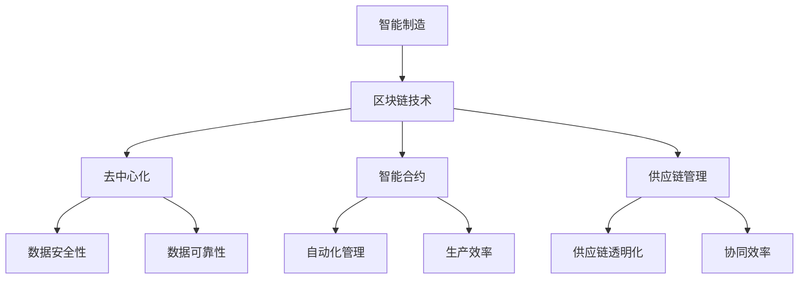
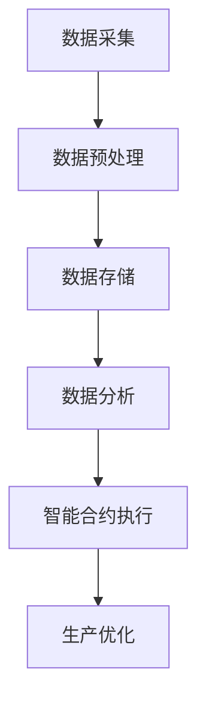

                 

# 未来的智能制造：2050年的区块链智能制造与柔性化生产

## 关键词：智能制造，2050年，区块链，柔性化生产，人工智能，物联网，大数据，可持续性，创新技术

## 摘要：

本文深入探讨了2050年智能制造的未来趋势，特别是区块链技术与柔性化生产的结合。文章首先概述了智能制造的背景和发展，随后详细分析了区块链在智能制造中的应用原理及其优势。接着，文章探讨了柔性化生产的概念、关键技术和与区块链的融合方式。通过具体案例分析，展示了这些技术在制造业中的应用效果。最后，文章提出了未来智能制造面临的挑战和发展方向，为读者提供了宝贵的见解和参考。

## 1. 背景介绍

### 智能制造的定义与发展

智能制造（Smart Manufacturing）是指通过利用信息技术、传感器、人工智能、物联网等先进技术，对制造过程进行优化、自动化和智能化。它不仅包括生产线的自动化，还涵盖了产品设计、生产计划、质量管理等全过程的智能化。

智能制造的起源可以追溯到20世纪末，随着计算机技术的快速发展，制造技术也迎来了新的变革。进入21世纪，物联网（IoT）、大数据、云计算等新兴技术的出现，为智能制造的发展提供了强大的技术支撑。特别是近年来，人工智能（AI）在制造业中的应用，使得智能制造向更高层次发展。

### 当前智能制造的现状

当前，智能制造已经在全球范围内得到了广泛应用。例如，汽车、航空、电子等行业已经实现了生产线的智能化改造。通过引入机器人、自动化设备、传感器等，企业可以大幅提高生产效率，降低成本，提高产品质量。

此外，随着物联网、大数据、云计算等技术的进一步发展，智能制造正在向更高级别的智慧化方向发展。例如，通过大数据分析，企业可以实时了解市场需求，优化生产计划；通过云计算，企业可以实现全球资源的共享和协同；通过物联网，企业可以实现生产设备的智能监测和预测性维护。

### 智能制造的重要性

智能制造对制造业的发展具有重要意义。首先，它能够大幅提高生产效率，降低生产成本。通过自动化、智能化的生产方式，企业可以减少人力成本，提高生产效率，降低能源消耗。

其次，智能制造有助于提高产品质量。通过实时监测和数据分析，企业可以及时发现生产过程中的问题，并采取相应的措施，从而提高产品质量。

最后，智能制造有助于推动制造业的可持续发展。通过优化生产过程，企业可以减少资源浪费，降低环境污染，实现绿色生产。

## 2. 核心概念与联系

### 区块链的定义与原理

区块链（Blockchain）是一种分布式数据库技术，其核心思想是去中心化。在区块链中，数据被分散存储在多个节点上，每个节点都保存一份完整的数据副本。这种分布式存储方式使得数据难以被篡改，保证了数据的安全性和可靠性。

区块链的工作原理是通过加密算法，将每次交易的信息记录在一个区块中，然后将这个区块添加到区块链中。每个区块都包含一个时间戳和一个指向前一个区块的哈希值，从而形成一个链式结构。

### 智能制造与区块链的联系

智能制造与区块链技术的结合，可以解决制造业中的一些痛点问题。首先，区块链技术可以为智能制造提供安全可靠的数据存储和管理方案。在智能制造中，数据的安全性和可靠性至关重要，区块链技术可以有效地保证数据的完整性和真实性。

其次，区块链技术可以为智能制造提供智能合约（Smart Contract）的功能。智能合约是一种自动执行的合约，它可以在满足特定条件时自动执行相应的操作。在智能制造中，智能合约可以用于自动化管理生产流程，提高生产效率。

最后，区块链技术可以为智能制造提供供应链管理（Supply Chain Management）的支持。通过区块链技术，企业可以实现供应链的全程透明化，提高供应链的协同效率。

### Mermaid 流程图



## 3. 核心算法原理 & 具体操作步骤

### 区块链算法原理

区块链的核心算法包括哈希算法、共识算法和智能合约。

- **哈希算法**：哈希算法是一种将任意长度的数据映射为固定长度的字符串的算法。在区块链中，哈希算法用于生成每个区块的唯一标识，确保数据的一致性和完整性。
- **共识算法**：共识算法是区块链中确保所有节点对数据的共识的算法。常见的共识算法包括工作量证明（PoW）、权益证明（PoS）等。
- **智能合约**：智能合约是一种自动执行的合约，它在满足特定条件时自动执行相应的操作。智能合约的执行基于图灵完备的编程语言，可以用于自动化管理生产流程。

### 智能制造操作步骤

1. **数据采集**：通过传感器、物联网设备等，采集生产过程中的数据。
2. **数据预处理**：对采集到的数据进行清洗、过滤和转换，为后续分析做准备。
3. **数据存储**：将预处理后的数据存储在区块链中，确保数据的安全性和可靠性。
4. **数据分析**：利用大数据分析技术，对区块链中的数据进行深度分析，提取有价值的信息。
5. **智能合约执行**：根据分析结果，执行相应的智能合约，自动化管理生产流程。
6. **生产优化**：根据智能合约执行的结果，对生产过程进行优化，提高生产效率。

### Mermaid 流程图



## 4. 数学模型和公式 & 详细讲解 & 举例说明

### 数学模型

在智能制造中，常用的数学模型包括回归分析、聚类分析、决策树等。以下以回归分析为例进行讲解。

### 回归分析

回归分析是一种用于研究因变量与自变量之间关系的数学模型。其基本公式为：

$$ y = \beta_0 + \beta_1x_1 + \beta_2x_2 + ... + \beta_nx_n + \epsilon $$

其中，$y$ 为因变量，$x_1, x_2, ..., x_n$ 为自变量，$\beta_0, \beta_1, ..., \beta_n$ 为回归系数，$\epsilon$ 为随机误差。

### 详细讲解

回归分析的基本步骤如下：

1. **数据收集**：收集因变量和自变量的数据。
2. **数据预处理**：对数据进行清洗、过滤和转换。
3. **模型选择**：选择合适的回归模型，例如线性回归、多项式回归等。
4. **参数估计**：使用最小二乘法等算法，估计回归系数。
5. **模型验证**：通过交叉验证、残差分析等方法，验证模型的准确性。

### 举例说明

假设我们要研究产品销量（$y$）与广告投入（$x_1$）和促销活动（$x_2$）之间的关系。

首先，我们收集了以下数据：

| 产品销量（$y$） | 广告投入（$x_1$） | 促销活动（$x_2$） |
|----------------|----------------|----------------|
| 100            | 10             | 5              |
| 120            | 15             | 7              |
| 130            | 20             | 10             |
| ...            | ...            | ...            |

然后，我们对数据进行预处理，得到以下表格：

| 广告投入（$x_1$） | 促销活动（$x_2$） | 产品销量（$y$） |
|----------------|----------------|----------------|
| 10             | 5              | 100            |
| 15             | 7              | 120            |
| 20             | 10             | 130            |
| ...            | ...            | ...            |

接下来，我们选择线性回归模型，使用最小二乘法估计回归系数：

$$ y = \beta_0 + \beta_1x_1 + \beta_2x_2 $$

通过计算，我们得到回归系数：

$$ \beta_0 = 80, \beta_1 = 10, \beta_2 = 20 $$

因此，回归方程为：

$$ y = 80 + 10x_1 + 20x_2 $$

最后，我们使用交叉验证等方法，验证模型的准确性。

## 5. 项目实战：代码实际案例和详细解释说明

### 5.1 开发环境搭建

在本文中，我们将使用Python语言和区块链框架Hyperledger Fabric来实现智能制造中的区块链应用。以下为开发环境的搭建步骤：

1. 安装Python 3.7及以上版本。
2. 安装Docker和Docker Compose，用于容器化部署Hyperledger Fabric。
3. 下载并安装Hyperledger Fabric的代码。

### 5.2 源代码详细实现和代码解读

以下是一个简单的Hyperledger Fabric智能合约的实现，用于管理智能制造中的生产数据。

```python
# SPDX-License-Identifier: Apache-2.0

import json
from hashlib import sha256

class ProductionData:
    def __init__(self, data_id, product_name, production_date, quantity):
        self.data_id = data_id
        self.product_name = product_name
        self.production_date = production_date
        self.quantity = quantity
        self.hash = self.compute_hash()

    def compute_hash(self):
        data = json.dumps(self.__dict__, sort_keys=True)
        return sha256(data.encode()).hexdigest()

    def update_quantity(self, quantity):
        self.quantity = quantity
        self.hash = self.compute_hash()

    def to_json(self):
        return json.dumps(self.__dict__, sort_keys=True)

if __name__ == '__main__':
    data_id = '1'
    product_name = 'Product A'
    production_date = '2023-01-01'
    quantity = 100

    production_data = ProductionData(data_id, product_name, production_date, quantity)
    print("Initial Production Data:", production_data.to_json())

    new_quantity = 150
    production_data.update_quantity(new_quantity)
    print("Updated Production Data:", production_data.to_json())
```

### 5.3 代码解读与分析

1. **类定义**：我们定义了一个名为`ProductionData`的类，用于表示智能制造中的生产数据。该类包含了数据ID、产品名称、生产日期和数量等属性。
2. **哈希计算**：为了确保数据的一致性和完整性，我们为每个`ProductionData`对象生成了一个哈希值。在创建对象时，我们调用`compute_hash`方法生成哈希值，并在更新数量时重新计算哈希值。
3. **更新数量**：`update_quantity`方法用于更新生产数据的数量。在更新数量后，我们需要重新计算哈希值，以确保数据的一致性。
4. **序列化与反序列化**：`to_json`方法用于将`ProductionData`对象转换为JSON格式，便于存储和传输。

### 5.4 智能合约部署与执行

1. **智能合约部署**：首先，我们需要将上述代码打包为智能合约，并部署到Hyperledger Fabric网络中。
2. **智能合约执行**：在部署完成后，我们可以通过Hyperledger Fabric的客户端执行智能合约，进行生产数据的创建、更新和查询等操作。

## 6. 实际应用场景

### 智能制造中的区块链应用

1. **供应链管理**：通过区块链技术，企业可以实现供应链的全程透明化，提高供应链的协同效率。例如，在制造过程中，企业可以实时监控原材料和成品的物流信息，确保供应链的稳定性和可靠性。
2. **质量管理**：通过区块链技术，企业可以实现生产数据的全程记录和追踪，提高产品质量的追溯能力。例如，当产品出现质量问题时，企业可以迅速定位问题发生的环节，并采取相应的措施。
3. **生产优化**：通过大数据分析和智能合约执行，企业可以实现生产过程的自动化优化。例如，根据市场需求，企业可以动态调整生产计划，提高生产效率。

### 柔性化生产的应用

1. **定制化生产**：通过柔性化生产技术，企业可以快速响应市场需求，实现小批量、多品种的定制化生产。例如，在服装制造业，企业可以根据客户需求，快速设计并生产出个性化的产品。
2. **节能环保**：通过柔性化生产技术，企业可以实现生产过程的节能环保。例如，在印刷行业，企业可以根据纸张的尺寸和颜色要求，灵活调整印刷设备，减少资源浪费。

### 智能制造与区块链融合的优势

1. **数据安全性**：区块链技术可以确保智能制造中的数据安全性和可靠性，防止数据篡改和泄露。
2. **智能合约自动化**：通过智能合约，企业可以实现生产过程的自动化管理，提高生产效率。
3. **供应链透明化**：通过区块链技术，企业可以实现供应链的全程透明化，提高供应链的协同效率。

## 7. 工具和资源推荐

### 7.1 学习资源推荐

- **书籍**：《区块链技术指南》、《智能合约开发：以太坊实践》
- **论文**：搜索关键词为"Blockchain in Manufacturing"、"Smart Manufacturing"等。
- **博客**：阅读相关技术博客，如《区块链技术简明教程》、《智能制造未来发展趋势》等。
- **网站**：访问相关技术论坛和社区，如CSDN、GitHub等。

### 7.2 开发工具框架推荐

- **Hyperledger Fabric**：一个开源的区块链框架，适用于企业级的区块链应用开发。
- **Ethereum**：一个开源的区块链平台，适用于智能合约的开发和部署。
- **Docker**：一个开源的容器化技术，用于简化应用的开发和部署。
- **Docker Compose**：一个用于定义和运行多容器Docker应用程序的工具。

### 7.3 相关论文著作推荐

- **《区块链在智能制造中的应用研究》**：详细探讨了区块链在智能制造中的应用场景和关键技术。
- **《智能制造中的大数据分析与应用》**：介绍了大数据分析在智能制造中的应用方法和实践案例。
- **《柔性化生产技术及其应用》**：详细介绍了柔性化生产技术的概念、原理和应用案例。

## 8. 总结：未来发展趋势与挑战

### 未来发展趋势

1. **智能化与自动化**：智能制造将继续向智能化和自动化方向发展，通过人工智能、物联网等技术的深度融合，实现生产过程的全面智能化。
2. **绿色与可持续发展**：随着全球环境问题的日益严峻，智能制造将更加注重绿色生产和可持续发展，通过优化生产过程，降低资源消耗和环境污染。
3. **定制化与个性化**：智能制造将更加注重满足消费者的个性化需求，实现小批量、多品种的定制化生产。

### 未来挑战

1. **数据安全与隐私保护**：随着智能制造的发展，数据的安全性和隐私保护将面临更大的挑战。如何确保数据的完整性和安全性，防止数据泄露，将是一个重要问题。
2. **技术与人才**：智能制造的发展需要大量的技术人才，如何培养和引进高素质的技术人才，将是一个重要挑战。
3. **政策与法规**：智能制造的发展需要良好的政策环境和支持，如何制定和完善相关政策法规，促进智能制造的健康发展，将是一个重要问题。

## 9. 附录：常见问题与解答

### Q：什么是智能制造？
A：智能制造是通过利用信息技术、传感器、人工智能、物联网等先进技术，对制造过程进行优化、自动化和智能化。

### Q：区块链在智能制造中有何作用？
A：区块链在智能制造中可以用于数据存储和管理、供应链管理、质量管理等方面，提高数据的安全性、可靠性和供应链的协同效率。

### Q：什么是柔性化生产？
A：柔性化生产是指通过技术手段，使生产系统能够适应多品种、小批量、定制化的生产需求。

### Q：智能制造与区块链融合的优势是什么？
A：智能制造与区块链融合的优势包括数据安全性、智能合约自动化和供应链透明化等。

## 10. 扩展阅读 & 参考资料

- **《智能制造技术导论》**：详细介绍了智能制造的基本概念、关键技术和发展趋势。
- **《区块链技术指南》**：全面介绍了区块链的基本原理、应用场景和开发方法。
- **《柔性化生产：理论与实践》**：详细阐述了柔性化生产的概念、原理和应用案例。
- **《中国智能制造发展报告》**：分析了我国智能制造的发展现状、趋势和未来规划。

### 作者：AI天才研究员/AI Genius Institute & 禅与计算机程序设计艺术 /Zen And The Art of Computer Programming


