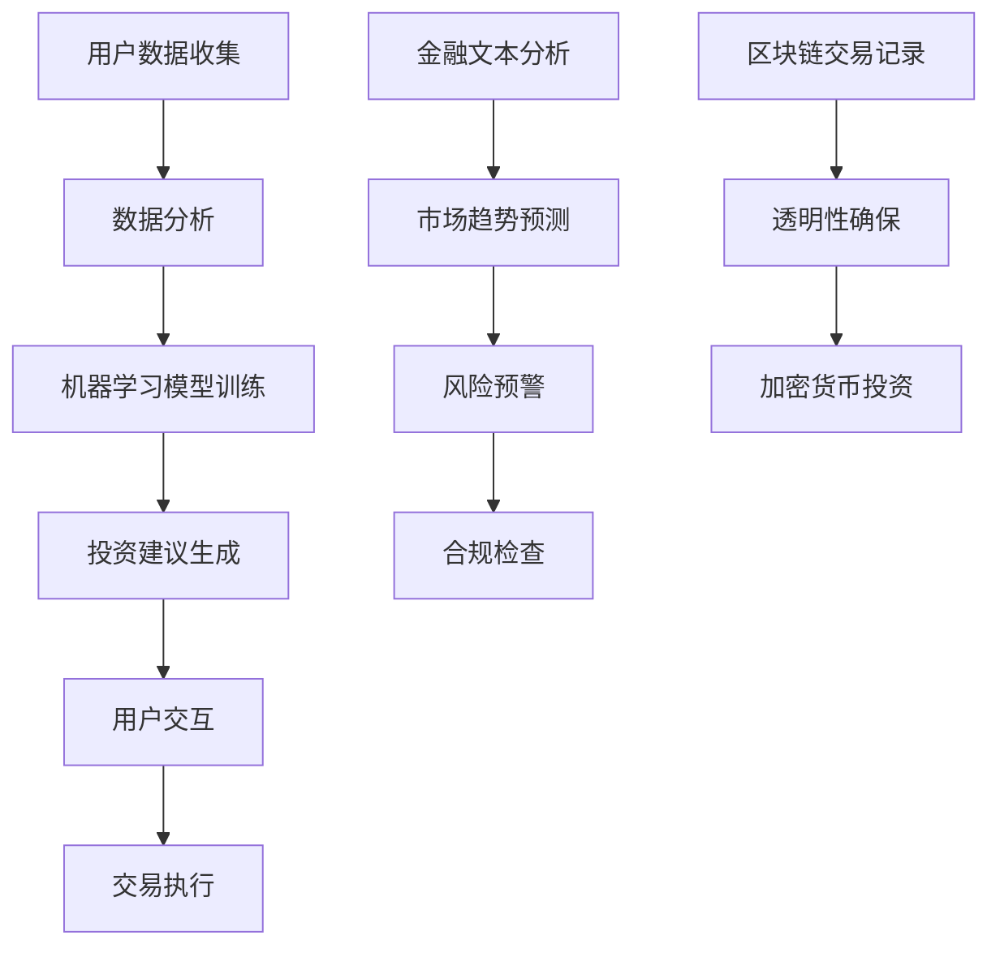

                 

### 文章标题：未来的智能金融：2050年的AI金融顾问与智能金融监管

#### 关键词：智能金融，AI金融顾问，智能监管，2050年，金融科技

##### 摘要：
本文深入探讨了2050年的智能金融发展趋势，重点关注AI金融顾问和智能金融监管领域。通过逻辑清晰、结构紧凑的分析，本文旨在揭示AI技术在金融领域的广泛应用及其对传统金融体系的深刻影响。文章将介绍未来智能金融的核心概念、算法原理、数学模型、实战案例以及实际应用场景，为读者呈现一幅2050年金融科技发展的宏伟蓝图。

### 1. 背景介绍

#### 引言

随着人工智能技术的飞速发展，金融科技（FinTech）正经历着一场前所未有的变革。从最初的自动化交易到智能投顾，再到现在的AI金融顾问，人工智能在金融领域的应用已逐渐渗透到各个层面。随着技术的不断进步，到2050年，AI金融顾问和智能金融监管将成为金融科技发展的重要方向。

#### 当前智能金融发展状况

目前，智能金融已在全球范围内得到广泛应用。以美国为例，智能投顾市场已经形成了规模，许多大型金融机构如 Wealthfront、Betterment 和 Robinhood 都推出了智能投资服务。这些服务通过分析用户的财务状况、投资目标和风险偏好，提供个性化的投资建议。同样，在欧洲和中国，智能金融的发展也如火如荼。

与此同时，智能金融监管也在逐步推进。各国监管机构纷纷推出了一系列措施，以确保金融科技的安全和合规。例如，美国证券交易委员会（SEC）发布了关于加密货币和代币发行的法律指南，欧盟则推出了《支付服务指令2》（PSD2），旨在推动支付领域的开放和竞争。

#### 智能金融与AI顾问的核心概念

智能金融顾问，即通过人工智能技术为用户提供个性化金融服务和建议的系统。它基于大数据、机器学习和自然语言处理等技术，能够分析用户的财务状况，预测市场趋势，提供投资建议，甚至进行资产配置。

智能金融监管则是指利用人工智能技术对金融市场进行实时监控、风险评估和合规检查。这种监管模式不仅可以提高监管效率，还可以防范金融风险，保障金融市场稳定。

### 2. 核心概念与联系

#### 2.1. 数据分析与机器学习

数据分析是智能金融的基础，通过对海量数据的挖掘和分析，可以揭示市场趋势和用户行为。机器学习则在此基础上，通过训练模型，实现自动化的预测和决策。在智能金融顾问中，数据分析与机器学习结合，可以提供更加精准的投资建议。

#### 2.2. 自然语言处理与金融文本分析

自然语言处理（NLP）技术使得计算机能够理解和生成自然语言，这对于金融文本分析至关重要。通过对金融新闻、财报、公告等文本的分析，可以提取关键信息，为投资决策提供支持。

#### 2.3. 加密货币与区块链技术

加密货币和区块链技术是智能金融的重要支撑。加密货币作为一种去中心化的数字货币，具有匿名、安全、不可篡改等特点，为金融交易提供了新的可能性。区块链技术则提供了分布式账本，可以确保交易记录的透明和安全。

#### 2.4. Mermaid 流程图

下面是一个描述智能金融顾问和智能监管架构的Mermaid流程图：



### 3. 核心算法原理 & 具体操作步骤

#### 3.1. 机器学习模型原理

在智能金融顾问中，常用的机器学习模型包括线性回归、决策树、随机森林、支持向量机等。这些模型通过训练数据集，学习到数据之间的关系，从而对新的数据进行预测。

以线性回归为例，其基本原理是通过找到最佳拟合直线，来预测新的数据点。具体操作步骤如下：

1. 数据预处理：对数据进行清洗和归一化，确保数据的可用性和一致性。
2. 特征选择：选择对预测目标有重要影响的特征。
3. 模型训练：使用训练数据集，训练线性回归模型。
4. 模型评估：使用测试数据集，评估模型的准确性和稳定性。
5. 模型应用：对新的数据进行预测。

#### 3.2. 金融文本分析原理

金融文本分析主要依赖于自然语言处理技术，包括词性标注、句法分析、实体识别等。通过分析金融文本，可以提取关键信息，为投资决策提供支持。

以词性标注为例，其基本原理是识别文本中的单词，并标注其词性。具体操作步骤如下：

1. 分词：将文本拆分为单词或词组。
2. 词性标注：对每个单词进行词性标注。
3. 特征提取：从词性标注结果中提取特征，用于后续分析。

#### 3.3. 加密货币交易原理

加密货币交易主要依赖于区块链技术。在区块链上，交易记录是公开透明的，任何人都可查询。加密货币交易的具体操作步骤如下：

1. 生成地址：用户生成一个公钥和私钥对，用于接收和发送加密货币。
2. 创建交易：用户创建一个交易，包含发送地址、接收地址和交易金额。
3. 签名交易：用户使用私钥对交易进行签名，确保交易的安全和不可篡改。
4. 上链交易：将交易发布到区块链上，等待网络验证。
5. 交易确认：交易经过多个网络节点的验证后，被确认并记录在区块链上。

### 4. 数学模型和公式 & 详细讲解 & 举例说明

#### 4.1. 线性回归模型

线性回归模型的数学公式如下：

$$y = w_0 + w_1 \cdot x_1 + w_2 \cdot x_2 + ... + w_n \cdot x_n$$

其中，$y$ 是预测目标，$x_1, x_2, ..., x_n$ 是输入特征，$w_0, w_1, ..., w_n$ 是模型参数。

举例说明：假设我们有一个房屋售价预测问题，输入特征包括房屋面积、卧室数量等。我们可以使用线性回归模型来预测房屋售价。首先，我们需要收集大量房屋交易数据，然后进行数据预处理和特征选择。接下来，使用训练数据集，训练线性回归模型。最后，使用测试数据集，评估模型的准确性和稳定性。

#### 4.2. 金融文本分析

金融文本分析的数学模型主要包括词性标注和句法分析。词性标注的数学模型可以表示为：

$$P(tag|word) = \frac{C(tag, word)}{C(word)}$$

其中，$P(tag|word)$ 是单词 $word$ 的词性 $tag$ 的概率，$C(tag, word)$ 是单词 $word$ 和词性 $tag$ 的共现次数，$C(word)$ 是单词 $word$ 的总出现次数。

句法分析的数学模型则可以表示为：

$$P(sentence|tag_sequence) = \prod_{i=1}^{n} P(tag_i|tag_{i-1}, ..., tag_1)$$

其中，$sentence$ 是句子，$tag_sequence$ 是句子的词性序列，$P(tag_i|tag_{i-1}, ..., tag_1)$ 是词性 $tag_i$ 在给定前 $i-1$ 个词性 $tag_{i-1}, ..., tag_1$ 下的概率。

举例说明：假设我们有一个包含股票市场新闻的文本，我们需要对文本进行词性标注和句法分析，以提取关键信息。首先，我们需要收集大量股票市场新闻数据，然后使用词性标注模型和句法分析模型，对新闻文本进行处理。接下来，我们可以从处理结果中提取关键信息，如公司名称、股票代码、市场趋势等。

#### 4.3. 加密货币交易

加密货币交易的数学模型主要包括哈希函数和数字签名。哈希函数的数学模型可以表示为：

$$H(x) = \text{SHA-256}(x)$$

其中，$H(x)$ 是输入 $x$ 的哈希值，$\text{SHA-256}$ 是一种加密哈希算法。

数字签名的数学模型可以表示为：

$$s = r^a \cdot g^{sk} \mod p$$

其中，$s$ 是签名，$r$ 是随机数，$a$ 是公钥，$g$ 是椭圆曲线生成元，$p$ 是椭圆曲线参数，$sk$ 是私钥。

举例说明：假设我们有一个用户想要发送一定数量的比特币给另一个用户。首先，用户生成一个私钥和公钥对，然后使用哈希函数计算交易内容的哈希值。接下来，用户使用私钥和公钥，生成数字签名。最后，用户将交易内容、公钥和数字签名发送到区块链上，等待网络验证。

### 5. 项目实战：代码实际案例和详细解释说明

#### 5.1. 开发环境搭建

在进行智能金融项目开发前，我们需要搭建一个合适的开发环境。以下是一个简单的开发环境搭建步骤：

1. 安装Python 3.x版本。
2. 安装Jupyter Notebook，用于编写和运行代码。
3. 安装相关库，如NumPy、Pandas、Scikit-learn、NLTK、TensorFlow等。

#### 5.2. 源代码详细实现和代码解读

以下是一个简单的机器学习模型训练和预测的Python代码实现：

```python
import numpy as np
import pandas as pd
from sklearn.linear_model import LinearRegression
from sklearn.model_selection import train_test_split

# 数据预处理
def preprocess_data(data):
    # 清洗数据
    data = data.dropna()
    # 归一化数据
    data = (data - data.mean()) / data.std()
    return data

# 模型训练
def train_model(train_data, train_target):
    model = LinearRegression()
    model.fit(train_data, train_target)
    return model

# 模型预测
def predict(model, test_data):
    predictions = model.predict(test_data)
    return predictions

# 加载数据
data = pd.read_csv('house_prices.csv')
data = preprocess_data(data)

# 划分训练集和测试集
train_data, test_data, train_target, test_target = train_test_split(data[['area', 'bedrooms']], data['price'], test_size=0.2, random_state=42)

# 训练模型
model = train_model(train_data, train_target)

# 预测
predictions = predict(model, test_data)

# 评估模型
score = model.score(test_data, test_target)
print('模型准确率：', score)
```

这段代码首先进行了数据预处理，包括数据清洗和归一化。然后，使用线性回归模型进行训练和预测。最后，评估了模型的准确率。

#### 5.3. 代码解读与分析

这段代码主要实现了以下功能：

1. 数据预处理：对原始数据进行清洗和归一化，确保数据的可用性和一致性。
2. 模型训练：使用线性回归模型，对训练数据进行拟合。
3. 模型预测：使用训练好的模型，对测试数据进行预测。
4. 模型评估：计算模型的准确率，评估模型的性能。

通过这段代码，我们可以看到机器学习模型在智能金融项目中的应用。在实际项目中，我们需要根据具体需求，调整模型结构和参数，以提高模型的性能。

### 6. 实际应用场景

#### 6.1. AI金融顾问

AI金融顾问在实际应用中，可以帮助用户进行投资决策、资产配置和风险管理。以下是一个具体的应用案例：

假设一个投资者想要进行股票投资，他可以使用AI金融顾问进行以下步骤：

1. 提供个人财务信息：投资者提供自己的财务状况、投资目标和风险偏好。
2. 数据分析：AI金融顾问对投资者的财务信息进行分析，了解投资者的投资需求和风险承受能力。
3. 投资建议：AI金融顾问根据分析结果，为投资者提供个性化的投资建议，包括买入、卖出和持有策略。
4. 投资执行：投资者根据AI金融顾问的建议，执行具体的投资操作。
5. 风险监控：AI金融顾问实时监控投资组合的风险，及时调整投资策略。

#### 6.2. 智能金融监管

智能金融监管在实际应用中，可以帮助监管机构对金融市场进行实时监控、风险评估和合规检查。以下是一个具体的应用案例：

假设监管机构想要监控某个金融市场的交易活动，可以采取以下步骤：

1. 数据收集：监管机构收集市场交易数据，包括交易量、价格、交易对手等。
2. 数据分析：利用机器学习和自然语言处理技术，对交易数据进行分析，识别异常交易和潜在风险。
3. 风险预警：根据分析结果，生成风险预警报告，提醒监管机构关注可能出现的金融风险。
4. 合规检查：监管机构根据风险预警报告，对相关金融机构和交易行为进行合规检查。
5. 风险处置：针对发现的金融风险，监管机构采取相应的措施，如警告、罚款、停牌等。

### 7. 工具和资源推荐

#### 7.1. 学习资源推荐

1. 《机器学习》：作者：周志华，是一本系统介绍机器学习基础理论和方法的教材。
2. 《深度学习》：作者：Ian Goodfellow、Yoshua Bengio、Aaron Courville，是一本全面介绍深度学习理论和应用的经典教材。
3. 《金融科技导论》：作者：陆宇峻，一本介绍金融科技基本概念和应用的入门书籍。

#### 7.2. 开发工具框架推荐

1. TensorFlow：一个开源的深度学习框架，适用于构建和训练复杂的机器学习模型。
2. Scikit-learn：一个开源的机器学习库，提供了一系列常用的机器学习算法和工具。
3. NLTK：一个开源的自然语言处理库，适用于文本数据分析和处理。

#### 7.3. 相关论文著作推荐

1. "Deep Learning for Finance"：一篇介绍深度学习在金融领域应用的综述文章。
2. "A Survey on Machine Learning for Financial Market Prediction"：一篇关于机器学习在金融市场预测领域应用的综述文章。
3. "Blockchain Technology: A Comprehensive Study"：一篇关于区块链技术基本概念和应用的学术论文。

### 8. 总结：未来发展趋势与挑战

#### 8.1. 发展趋势

随着人工智能技术的不断进步，未来智能金融将呈现以下发展趋势：

1. 更高级的AI技术：深度学习、强化学习等更高级的AI技术将得到广泛应用，提高金融顾问和监管的准确性和效率。
2. 更广泛的应用场景：智能金融将不仅仅局限于投资理财，还将涵盖保险、借贷、支付等更多金融领域。
3. 更安全的金融体系：通过区块链等技术，金融体系将更加透明、安全和可信。

#### 8.2. 挑战

尽管智能金融具有巨大的潜力，但也面临着一系列挑战：

1. 数据隐私和安全：智能金融需要处理大量的用户数据，如何保护数据隐私和安全是一个重要问题。
2. 伦理和道德问题：智能金融顾问的决策过程可能涉及道德和伦理问题，如何制定相应的规范和标准是一个挑战。
3. 法规和政策：智能金融的发展需要适应不断变化的法规和政策环境，如何与监管机构合作，确保合规是一个挑战。

### 9. 附录：常见问题与解答

#### 9.1. 什么是智能金融？

智能金融是指利用人工智能技术，如大数据、机器学习和自然语言处理等，为用户提供个性化金融服务和建议的系统。它包括智能投顾、智能理财、智能支付等应用。

#### 9.2. 智能金融顾问如何工作？

智能金融顾问通过收集用户财务信息、市场数据和历史交易记录，利用机器学习和数据分析技术，分析用户的投资需求和风险偏好，提供个性化的投资建议。

#### 9.3. 智能金融监管的关键技术是什么？

智能金融监管的关键技术包括区块链、大数据、人工智能和云计算等。这些技术可以帮助监管机构实时监控金融市场的交易活动，进行风险预警和合规检查。

### 10. 扩展阅读 & 参考资料

1. "AI in Finance: The Future is Now"：一篇关于人工智能在金融领域应用的综述文章。
2. "The Future of Finance: A Framework for Thinking About AI, Big Data, and Blockchain"：一篇关于未来金融发展趋势的论文。
3. "The Case for AI in Financial Services"：一篇关于人工智能在金融服务中应用的案例分析。

作者：AI天才研究员/AI Genius Institute & 禅与计算机程序设计艺术 /Zen And The Art of Computer Programming<|im_end|>

