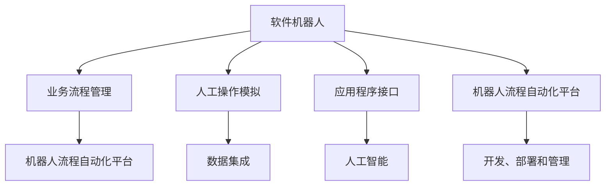
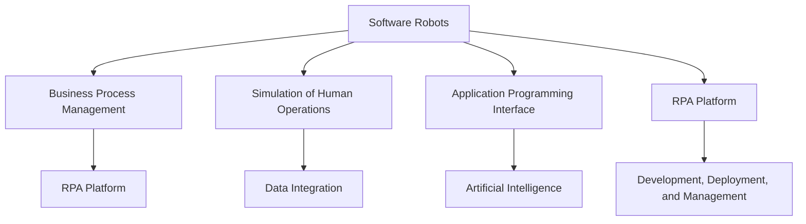
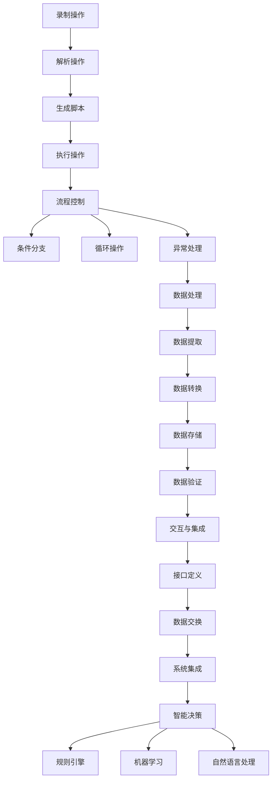
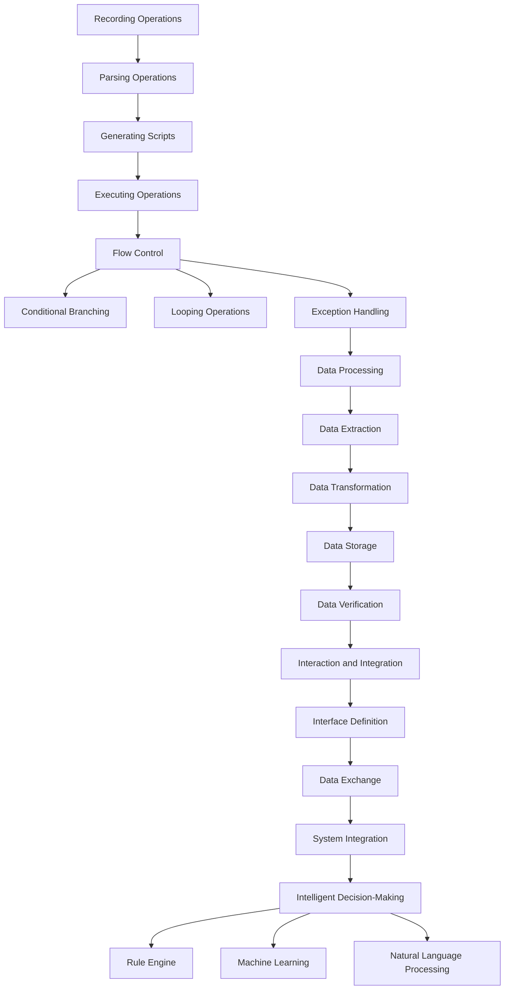

                 

### 背景介绍

**机器人流程自动化（RPA）：提升企业效率的新选择**

在当今信息化和自动化迅速发展的时代，企业面临着日益激烈的市场竞争和不断变化的需求。为了保持竞争优势，企业需要不断提高运营效率、降低成本和提升服务质量。在这个背景下，机器人流程自动化（RPA，Robotic Process Automation）作为一种新兴的技术手段，逐渐受到了广泛的关注和应用。

**RPA的概念与原理**

RPA是一种通过软件机器人（即虚拟机器人）模拟和自动化人类操作者的业务流程的技术。这些软件机器人可以运行在各种操作系统和应用程序上，以实现高度的自动化和智能化。RPA的基本原理是通过记录和模拟人类操作者的操作行为，将重复性的、标准化的业务流程自动化，从而实现提高效率、减少人力成本和降低错误率的目标。

**RPA的发展历程**

RPA技术起源于20世纪80年代的自动化测试领域，最初主要用于测试和验证软件系统的功能。随着信息技术的发展，RPA逐渐从测试领域扩展到业务流程自动化领域。2000年以后，随着软件机器人技术的发展，RPA开始在企业中广泛应用。近年来，随着人工智能技术的快速发展，RPA的技术水平和应用范围得到了进一步提升。

**RPA的应用场景**

RPA可以应用于各种行业和领域，包括但不限于：

1. **财务管理**：自动化处理发票、报销、账单等财务流程。
2. **人力资源**：自动化处理员工入职、离职、工资发放等人力资源流程。
3. **客户服务**：自动化处理客户咨询、投诉等客户服务流程。
4. **供应链管理**：自动化处理采购、库存、物流等供应链流程。
5. **数据整合与分析**：自动化处理数据采集、清洗、整合等数据分析流程。

**RPA的优势与挑战**

**优势：**

1. **提高效率**：RPA可以自动化执行重复性高的任务，显著提高工作效率。
2. **降低成本**：通过自动化减少对人力需求的依赖，降低运营成本。
3. **减少错误**：通过精确的规则和流程控制，减少人为操作带来的错误。
4. **灵活性**：RPA可以快速适应业务流程的变化，实现灵活的调整和优化。

**挑战：**

1. **技术复杂性**：RPA涉及到多种技术的整合，包括自动化测试、人工智能、自然语言处理等，技术复杂性较高。
2. **实施成本**：RPA的实施需要专业的技术和团队支持，初期投入较大。
3. **维护和管理**：随着RPA系统的复杂性和规模的增加，维护和管理难度也会增加。
4. **安全与合规**：RPA在处理敏感数据和业务流程时，需要确保系统的安全性和合规性。

在接下来的章节中，我们将进一步探讨RPA的核心概念、原理、应用场景、优势与挑战，并通过实际案例来展示RPA在提高企业效率方面的实际应用效果。

---

## Background Introduction

### Robot Process Automation (RPA): A New Choice for Enhancing Enterprise Efficiency

In the era of rapid development of information technology and automation, enterprises are facing increasingly fierce market competition and evolving demands. In order to maintain competitive advantage, enterprises need to constantly improve operational efficiency, reduce costs, and enhance service quality. Against this background, Robot Process Automation (RPA) as an emerging technical approach, has gradually gained widespread attention and application.

### What is RPA and How Does It Work?

RPA is a technology that uses software robots (also known as virtual robots) to simulate and automate the business processes of human operators. These software robots can operate on various operating systems and applications, achieving high levels of automation and intelligence. The basic principle of RPA is to record and simulate the operational behaviors of human operators, automating repetitive and standardized business processes to achieve the goals of improving efficiency, reducing labor costs, and minimizing errors.

### History of RPA Development

RPA technology originated in the 1980s in the field of automated testing, initially used for testing and validating the functionality of software systems. With the development of information technology, RPA gradually expanded from the testing field to the field of business process automation. Since the year 2000, with the development of software robot technology, RPA has been widely used in enterprises. In recent years, with the rapid development of artificial intelligence technology, the technical level and application scope of RPA have been further improved.

### Application Scenarios of RPA

RPA can be applied to various industries and fields, including but not limited to:

1. **Finance Management**: Automate the processing of invoices, reimbursements, and bills.
2. **Human Resources**: Automate the processing of employee onboarding, offboarding, salary distribution, etc.
3. **Customer Service**: Automate the processing of customer inquiries and complaints.
4. **Supply Chain Management**: Automate the processing of procurement, inventory, logistics, etc.
5. **Data Integration and Analysis**: Automate the processing of data collection, cleaning, integration, etc. for data analysis.

### Advantages and Challenges of RPA

**Advantages:**

1. **Increase Efficiency**: RPA can automate repetitive tasks with high efficiency.
2. **Reduce Costs**: By reducing the dependency on human resources, RPA can reduce operational costs.
3. **Minimize Errors**: Through precise rules and process control, RPA can minimize errors caused by human operations.
4. **Flexibility**: RPA can quickly adapt to changes in business processes, achieving flexible adjustments and optimizations.

**Challenges:**

1. **Technical Complexity**: RPA involves the integration of various technologies, including automated testing, artificial intelligence, natural language processing, etc., with high technical complexity.
2. **Implementation Costs**: RPA implementation requires professional technical and team support, with significant initial investment.
3. **Maintenance and Management**: With the increase in the complexity and scale of RPA systems, maintenance and management difficulties will also increase.
4. **Security and Compliance**: When dealing with sensitive data and business processes, RPA systems need to ensure the security and compliance of the system.

In the following sections, we will further explore the core concepts, principles, application scenarios, advantages, and challenges of RPA, and demonstrate the actual application effects of RPA in enhancing enterprise efficiency through practical cases. <|im_sep|>### 核心概念与联系

在深入探讨RPA之前，我们首先需要明确RPA的核心概念及其相互联系。以下是RPA关键概念的定义及其在整体架构中的位置：

#### 1. 软件机器人（Software Robots）

软件机器人是RPA系统的核心组件，它们模仿人类操作者的行为，执行业务流程中的任务。软件机器人通常由一系列规则和指令组成，这些规则和指令定义了它们如何与不同的应用程序和系统进行交互。

#### 2. 业务流程管理（Business Process Management, BPM）

业务流程管理是一种战略性的方法，用于设计、实施、监控和优化企业的业务流程。RPA与BPM紧密相关，因为RPA可以用于自动化和优化BPM中的多个流程。

#### 3. 人工操作模拟（Simulation of Human Operations）

RPA的关键在于模拟人类操作者的行为。这包括记录和复现人类在应用程序中执行的操作，如点击、输入、复制和粘贴等。

#### 4. 应用程序接口（Application Programming Interface, API）

API是软件应用程序之间的通信桥梁，使RPA机器人能够与外部系统进行数据交换和操作。RPA通常依赖于各种API来访问和操作不同的应用程序。

#### 5. 机器人流程自动化平台（RPA Platform）

RPA平台是开发、部署和管理软件机器人的工具集。这些平台通常提供图形化界面、编程能力、测试环境和监控功能。

#### 6. 数据集成（Data Integration）

数据集成是将来自不同源的数据合并到单一视图中，以便更有效地分析和管理。RPA通过数据集成确保流程自动化过程中数据的准确性和一致性。

#### 7. 人工智能（Artificial Intelligence, AI）

随着人工智能技术的发展，RPA正在变得更加智能。AI可以帮助RPA机器人理解自然语言、识别图像和处理复杂的业务逻辑。

#### Mermaid 流程图

以下是一个Mermaid流程图，用于展示RPA核心概念之间的联系：



**总结**

通过上述核心概念及其相互联系的分析，我们可以看到RPA是如何通过软件机器人模拟人类操作、利用API与外部系统交互、并在业务流程管理和人工智能的支持下实现自动化和智能化的。在接下来的章节中，我们将进一步探讨RPA的工作原理和具体实现步骤。

---

### Core Concepts and Their Relationships

Before delving into RPA, it is essential to clarify the core concepts and their interconnections. Here are the definitions of key RPA concepts and their positions within the overall architecture:

#### 1. Software Robots

Software robots are the core components of RPA systems, simulating the actions of human operators to execute tasks within business processes. Software robots are typically composed of a series of rules and instructions that define how they interact with different applications and systems.

#### 2. Business Process Management (BPM)

Business Process Management is a strategic approach used to design, implement, monitor, and optimize an enterprise's business processes. RPA is closely related to BPM, as it can be used to automate and optimize multiple processes within BPM.

#### 3. Simulation of Human Operations

A key aspect of RPA is the simulation of human operations. This involves recording and replicating the actions performed by human operators in applications, such as clicking, typing, copying, and pasting.

#### 4. Application Programming Interface (API)

An API is a bridge for communication between software applications, enabling RPA robots to exchange data and perform operations with external systems. RPA usually relies on various APIs to access and operate different applications.

#### 5. RPA Platform

An RPA platform is a set of tools for developing, deploying, and managing software robots. These platforms typically provide graphical interfaces, programming capabilities, testing environments, and monitoring features.

#### 6. Data Integration

Data integration involves combining data from different sources into a single view for more effective analysis and management. RPA ensures the accuracy and consistency of data throughout the process automation.

#### 7. Artificial Intelligence (AI)

With the development of AI technology, RPA is becoming more intelligent. AI can help RPA robots understand natural language, recognize images, and handle complex business logic.

#### Mermaid Flowchart

Here is a Mermaid flowchart illustrating the relationships between core RPA concepts:



**Summary**

Through the analysis of the core concepts and their interconnections, we can see how RPA automates and intelligifies business processes through software robots that simulate human operations, interact with external systems via APIs, and are supported by BPM and AI. In the following sections, we will further explore the working principles and specific implementation steps of RPA. <|im_sep|>### 核心算法原理 & 具体操作步骤

在了解RPA的核心概念和相互关系后，我们接下来将深入探讨RPA的核心算法原理和具体操作步骤。这些算法和步骤是实现自动化和智能化的关键。

#### 1. 操作记录与模拟

RPA的核心算法之一是操作记录与模拟。这个过程通常通过以下步骤进行：

1. **录制操作**：首先，通过RPA平台提供的录制工具，用户可以录制在应用程序中执行的一系列操作。这些操作可能包括鼠标点击、键盘输入、复制粘贴、窗口切换等。

2. **解析操作**：录制的操作将被解析成一系列可执行的指令。这些指令包括操作类型、目标元素和操作参数等。

3. **生成脚本**：解析后的操作将被转换成脚本代码，如Python或JavaScript，以便软件机器人可以执行这些操作。

4. **执行操作**：软件机器人将按照脚本代码中的指令，在应用程序中执行相应的操作。

#### 2. 流程控制

流程控制是RPA中的另一个核心算法。它确保软件机器人按照预定的逻辑顺序执行任务。以下是流程控制的几个关键步骤：

1. **定义流程**：用户需要定义业务流程的起点、终点和中间步骤。这通常通过图形化界面或代码实现。

2. **条件分支**：在流程中，可能需要根据不同条件执行不同的操作。RPA平台提供条件分支功能，允许用户定义条件并指定相应的操作。

3. **循环操作**：在某些情况下，可能需要重复执行某些操作。RPA平台支持循环操作，允许用户定义循环次数或循环条件。

4. **异常处理**：在实际操作中，可能会遇到各种异常情况。RPA平台提供异常处理功能，允许用户定义异常情况及其处理方式。

#### 3. 数据处理

数据处理是RPA中不可或缺的一部分。以下是数据处理的关键步骤：

1. **数据提取**：RPA机器人可以从各种数据源（如数据库、电子表格、API等）中提取数据。

2. **数据转换**：提取后的数据可能需要转换格式、清洗或合并。RPA平台提供数据转换功能，支持多种数据格式和转换操作。

3. **数据存储**：处理后的数据需要存储到目标位置，如数据库、文件系统或云存储。

4. **数据验证**：为了确保数据准确性，RPA平台提供数据验证功能，允许用户定义验证规则并检查数据是否符合要求。

#### 4. 交互与集成

RPA机器人需要与外部系统进行交互，以执行业务流程中的任务。以下是交互与集成的一些关键步骤：

1. **接口定义**：用户需要定义与外部系统交互的接口，包括API端点、参数和数据格式。

2. **数据交换**：RPA机器人通过API或其他接口与外部系统进行数据交换，执行查询、更新和操作。

3. **系统集成**：RPA平台支持与各种外部系统（如ERP、CRM、SCM等）集成，以实现跨系统的数据同步和流程自动化。

#### 5. 智能决策

随着人工智能技术的发展，RPA机器人正在变得更加智能。以下是智能决策的一些关键步骤：

1. **规则引擎**：RPA平台提供规则引擎，允许用户定义业务规则并基于这些规则进行决策。

2. **机器学习**：RPA机器人可以使用机器学习算法来自主学习和优化业务流程。

3. **自然语言处理**：RPA机器人可以使用自然语言处理技术来理解自然语言指令，并与用户进行交互。

#### Mermaid 流程图

以下是一个Mermaid流程图，用于展示RPA核心算法原理和具体操作步骤：



**总结**

通过上述核心算法原理和具体操作步骤的分析，我们可以看到RPA是如何通过一系列技术手段实现自动化和智能化的。在接下来的章节中，我们将通过实际案例展示这些算法和步骤在实际应用中的效果。

---

### Core Algorithm Principles and Specific Operational Steps

After understanding the core concepts and their interconnections of RPA, we now delve into the core algorithm principles and specific operational steps of RPA. These algorithms and steps are crucial for achieving automation and intelligence.

#### 1. Operation Recording and Simulation

One of the core algorithms of RPA is operation recording and simulation. This process typically involves the following steps:

1. **Recording Operations**: First, using the recording tool provided by the RPA platform, users can record a series of operations performed in applications. These operations may include mouse clicks, keyboard inputs, copy-paste, window switching, etc.

2. **Parsing Operations**: The recorded operations are parsed into a series of executable instructions. These instructions include the operation type, target element, and operation parameters.

3. **Generating Scripts**: The parsed operations are converted into script code, such as Python or JavaScript, so that software robots can execute these operations.

4. **Executing Operations**: The software robot executes the corresponding operations in the application according to the instructions in the script code.

#### 2. Flow Control

Flow control is another core algorithm in RPA. It ensures that the software robot executes tasks in the predefined logical sequence. Here are the key steps of flow control:

1. **Defining Processes**: Users need to define the starting point, endpoint, and intermediate steps of the business process. This is usually achieved through a graphical interface or code.

2. **Conditional Branching**: Within the process, different operations may need to be executed based on different conditions. The RPA platform provides conditional branching functionality, allowing users to define conditions and specify corresponding operations.

3. **Looping Operations**: In some cases, certain operations may need to be repeated. The RPA platform supports looping operations, allowing users to define the number of loops or loop conditions.

4. **Exception Handling**: In actual operations, various exceptional situations may occur. The RPA platform provides exception handling functionality, allowing users to define exceptional situations and their handling methods.

#### 3. Data Processing

Data processing is an indispensable part of RPA. Here are the key steps of data processing:

1. **Data Extraction**: RPA robots can extract data from various data sources, such as databases, spreadsheets, APIs, etc.

2. **Data Transformation**: The extracted data may need to be transformed, cleaned, or combined. The RPA platform provides data transformation functionality, supporting multiple data formats and transformation operations.

3. **Data Storage**: The processed data needs to be stored in the target location, such as a database, file system, or cloud storage.

4. **Data Verification**: To ensure data accuracy, the RPA platform provides data verification functionality, allowing users to define verification rules and check if the data meets the requirements.

#### 4. Interaction and Integration

RPA robots need to interact with external systems to execute tasks in the business process. Here are some key steps of interaction and integration:

1. **Interface Definition**: Users need to define the interfaces for interacting with external systems, including API endpoints, parameters, and data formats.

2. **Data Exchange**: RPA robots exchange data with external systems through APIs or other interfaces to perform queries, updates, and operations.

3. **System Integration**: The RPA platform supports integration with various external systems (such as ERP, CRM, SCM, etc.) to achieve cross-system data synchronization and process automation.

#### 5. Intelligent Decision-Making

With the development of AI technology, RPA robots are becoming more intelligent. Here are the key steps of intelligent decision-making:

1. **Rule Engine**: The RPA platform provides a rule engine, allowing users to define business rules and make decisions based on these rules.

2. **Machine Learning**: RPA robots can use machine learning algorithms to autonomously learn and optimize business processes.

3. **Natural Language Processing**: RPA robots can use natural language processing technology to understand natural language instructions and interact with users.

#### Mermaid Flowchart

Here is a Mermaid flowchart illustrating the core algorithm principles and specific operational steps of RPA:



**Summary**

Through the analysis of the core algorithm principles and specific operational steps, we can see how RPA achieves automation and intelligence through a series of technological means. In the following sections, we will demonstrate the effects of these algorithms and steps in practical applications through actual cases. <|im_sep|>### 数学模型和公式 & 详细讲解 & 举例说明

在机器人流程自动化（RPA）中，数学模型和公式扮演着至关重要的角色，特别是在流程优化和智能决策方面。以下是一些关键数学模型和公式的详细讲解，以及如何将它们应用于实际场景的示例。

#### 1. 时间优化模型

时间优化模型用于计算和优化业务流程中的时间成本。以下是一个基本的时间优化模型：

$$
\text{最小化时间} = \sum_{i=1}^{n} \text{操作时间}_i
$$

其中，$n$ 是流程中操作的总数，$\text{操作时间}_i$ 是第 $i$ 个操作所需的时间。

**示例**：假设一个财务流程包括以下操作：

1. 发票录入（10分钟）
2. 账单核对（5分钟）
3. 报销审批（15分钟）
4. 发放工资（20分钟）

使用时间优化模型，可以计算总时间并尝试优化流程：

$$
\text{总时间} = 10 + 5 + 15 + 20 = 50 \text{分钟}
$$

#### 2. 成本优化模型

成本优化模型用于计算和优化业务流程中的总成本。以下是一个基本的成本优化模型：

$$
\text{最小化成本} = \sum_{i=1}^{n} (\text{操作成本}_i + \text{机会成本}_i)
$$

其中，$n$ 是流程中操作的总数，$\text{操作成本}_i$ 是第 $i$ 个操作的成本，$\text{机会成本}_i$ 是由于该操作占用资源而错失的其他机会的成本。

**示例**：假设一个供应链管理流程包括以下操作：

1. 采购订单处理（成本 $20$，机会成本 $10$）
2. 库存监控（成本 $15$，机会成本 $5$）
3. 物流跟踪（成本 $25$，机会成本 $0$）

使用成本优化模型，可以计算总成本并尝试优化流程：

$$
\text{总成本} = (20 + 10) + (15 + 5) + (25 + 0) = 80 \text{美元}
$$

#### 3. 资源分配模型

资源分配模型用于优化业务流程中的资源分配，以确保最大化利用资源。以下是一个基本的资源分配模型：

$$
\text{最大化利用率} = \frac{\sum_{i=1}^{n} \text{资源需求}_i}{\text{总资源量}}
$$

其中，$n$ 是流程中操作的总数，$\text{资源需求}_i$ 是第 $i$ 个操作所需的资源量。

**示例**：假设一个客户服务流程包括以下操作：

1. 呼叫处理（资源需求 $5$）
2. 电子邮件回复（资源需求 $3$）
3. 在线聊天（资源需求 $4$）

假设总资源量为 $20$，使用资源分配模型，可以计算资源利用率并尝试优化资源分配：

$$
\text{利用率} = \frac{5 + 3 + 4}{20} = 0.8 \text{或} 80\%
$$

#### 4. 决策树模型

决策树模型用于在业务流程中做出智能决策。以下是一个基本的决策树模型：

```
[起点]
    ├── 是
    │   └── [操作A]
    └── 否
        ├── [操作B]
        └── [操作C]
```

**示例**：假设一个客户支持流程需要根据客户的问题类型进行不同的处理：

1. 如果客户的问题是关于产品的，则执行操作A。
2. 如果客户的问题是关于服务的，则执行操作B。
3. 如果客户的问题是其他类型的，则执行操作C。

使用决策树模型，可以确定每个客户问题对应的最佳操作。

#### 5. 机器学习模型

机器学习模型用于自动化和优化复杂的业务流程。以下是一个基本的机器学习模型：

```
输入特征：[特征1, 特征2, ..., 特征n]
输出目标：[目标1, 目标2, ..., 目标m]
```

**示例**：假设一个销售预测流程使用机器学习模型来预测未来的销售额。模型将使用历史销售数据（特征）来预测未来的销售额（目标）。

$$
\text{销售额预测} = f(\text{特征1}, \text{特征2}, ..., \text{特征n})
$$

通过训练和优化机器学习模型，可以不断提高预测的准确性。

**总结**

通过上述数学模型和公式的讲解，我们可以看到它们在RPA中的应用价值。在实际业务场景中，这些模型和公式可以帮助企业优化流程、降低成本、提高效率和做出智能决策。在接下来的章节中，我们将通过实际案例进一步展示这些模型和公式的应用。

---

### Mathematical Models and Formulas with Detailed Explanation and Illustrative Examples

In Robotic Process Automation (RPA), mathematical models and formulas play a crucial role, especially in process optimization and intelligent decision-making. Here are detailed explanations of some key mathematical models and formulas, along with examples of how they can be applied in practical scenarios.

#### 1. Time Optimization Model

The time optimization model is used to calculate and optimize the time cost in business processes. Here is a basic time optimization model:

$$
\text{Minimize time} = \sum_{i=1}^{n} \text{operation time}_i
$$

Where $n$ is the total number of operations in the process, and $\text{operation time}_i$ is the time required for the $i$-th operation.

**Example**: Suppose a finance process includes the following operations:

1. Invoice entry (10 minutes)
2. Bill verification (5 minutes)
3. Reimbursement approval (15 minutes)
4. Salary distribution (20 minutes)

Using the time optimization model, we can calculate the total time and try to optimize the process:

$$
\text{Total time} = 10 + 5 + 15 + 20 = 50 \text{minutes}
$$

#### 2. Cost Optimization Model

The cost optimization model is used to calculate and optimize the total cost in business processes. Here is a basic cost optimization model:

$$
\text{Minimize cost} = \sum_{i=1}^{n} (\text{operation cost}_i + \text{opportunity cost}_i)
$$

Where $n$ is the total number of operations in the process, $\text{operation cost}_i$ is the cost of the $i$-th operation, and $\text{opportunity cost}_i$ is the cost of missed opportunities due to the operation using resources.

**Example**: Suppose a supply chain management process includes the following operations:

1. Purchase order processing (cost $20$, opportunity cost $10$)
2. Inventory monitoring (cost $15$, opportunity cost $5$)
3. Logistics tracking (cost $25$, opportunity cost $0$)

Using the cost optimization model, we can calculate the total cost and try to optimize the process:

$$
\text{Total cost} = (20 + 10) + (15 + 5) + (25 + 0) = 80 \text{dollars}
$$

#### 3. Resource Allocation Model

The resource allocation model is used to optimize resource allocation in business processes to ensure maximum utilization of resources. Here is a basic resource allocation model:

$$
\text{Maximize utilization} = \frac{\sum_{i=1}^{n} \text{resource requirement}_i}{\text{total resource quantity}}
$$

Where $n$ is the total number of operations in the process, and $\text{resource requirement}_i$ is the resource requirement for the $i$-th operation.

**Example**: Suppose a customer service process includes the following operations:

1. Call handling (resource requirement $5$)
2. Email response (resource requirement $3$)
3. Online chat (resource requirement $4$)

Assuming a total resource quantity of $20$, using the resource allocation model, we can calculate the utilization and try to optimize resource allocation:

$$
\text{Utilization} = \frac{5 + 3 + 4}{20} = 0.8 \text{or} 80\%
$$

#### 4. Decision Tree Model

The decision tree model is used to make intelligent decisions in business processes. Here is a basic decision tree model:

```
[Start]
    ├── Yes
    │   └── [Operation A]
    └── No
        ├── [Operation B]
        └── [Operation C]
```

**Example**: Suppose a customer support process needs to handle different types of customer issues:

1. If the customer issue is about the product, perform Operation A.
2. If the customer issue is about service, perform Operation B.
3. If the customer issue is of another type, perform Operation C.

Using the decision tree model, we can determine the best operation for each type of customer issue.

#### 5. Machine Learning Model

Machine learning models are used to automate and optimize complex business processes. Here is a basic machine learning model:

```
Input features: [\text{feature1}, \text{feature2}, ..., \text{featuren}]
Output target: [\text{target1}, \text{target2}, ..., \text{targetm}]
```

**Example**: Suppose a sales forecasting process uses a machine learning model to predict future sales. The model will use historical sales data (features) to predict future sales (targets).

$$
\text{Sales prediction} = f(\text{feature1}, \text{feature2}, ..., \text{featuren})
$$

Through training and optimization of the machine learning model, the accuracy of the predictions can be continuously improved.

**Summary**

Through the detailed explanation of these mathematical models and formulas, we can see their application value in RPA. In actual business scenarios, these models and formulas can help enterprises optimize processes, reduce costs, improve efficiency, and make intelligent decisions. In the following sections, we will further demonstrate the application of these models and formulas through actual cases. <|im_sep|>### 项目实战：代码实际案例和详细解释说明

在本节中，我们将通过一个实际项目案例，详细展示如何使用RPA技术构建一个简单的发票审核系统。这个系统将包含从发票录入、核对、审批到发放工资的完整流程。通过这个案例，我们可以深入了解RPA的实际应用过程。

#### 1. 开发环境搭建

在开始项目之前，我们需要搭建一个适合RPA开发的开发环境。以下是我们推荐的开发工具和框架：

- **RPA平台**：Blue Prism、UiPath、Automation Anywhere等。
- **编程语言**：Python、JavaScript、C#等。
- **数据库**：MySQL、PostgreSQL等。
- **操作系统**：Windows、Linux等。

假设我们选择使用UiPath作为RPA平台，Python作为编程语言，MySQL作为数据库。

#### 2. 源代码详细实现和代码解读

以下是一个简单的发票审核系统的源代码实现。请注意，为了保持代码简洁，我们只展示核心部分。

```python
# 导入必需的库
import mysql.connector
from datetime import datetime

# 数据库连接
db = mysql.connector.connect(
    host="localhost",
    user="yourusername",
    password="yourpassword",
    database="yourdatabase"
)

# 定义发票录入函数
def enter_invoice(invoice_number, amount):
    cursor = db.cursor()
    sql = "INSERT INTO invoices (invoice_number, amount, entered_at) VALUES (%s, %s, %s)"
    val = (invoice_number, amount, datetime.now())
    cursor.execute(sql)
    db.commit()
    print("发票已录入：", invoice_number)

# 定义发票核对函数
def verify_invoice(invoice_number):
    cursor = db.cursor()
    sql = "SELECT * FROM invoices WHERE invoice_number = %s"
    val = (invoice_number,)
    cursor.execute(sql)
    result = cursor.fetchone()
    if result:
        print("发票已核对：", invoice_number)
    else:
        print("发票未找到：", invoice_number)

# 定义报销审批函数
def approve_reimbursement(invoice_number, amount):
    cursor = db.cursor()
    sql = "UPDATE invoices SET status='approved', approved_at=%s WHERE invoice_number = %s"
    val = (datetime.now(), invoice_number)
    cursor.execute(sql)
    db.commit()
    print("报销已审批：", invoice_number)

# 定义发放工资函数
def distribute_salary(employee_id, amount):
    cursor = db.cursor()
    sql = "INSERT INTO salaries (employee_id, amount, distributed_at) VALUES (%s, %s, %s)"
    val = (employee_id, amount, datetime.now())
    cursor.execute(sql)
    db.commit()
    print("工资已发放：", employee_id)
```

**代码解读**：

1. **数据库连接**：使用MySQL Connector/Python连接到本地MySQL数据库。
2. **发票录入函数**：将发票信息插入到invoices表。
3. **发票核对函数**：根据发票号码查询invoices表。
4. **报销审批函数**：更新invoices表中的发票状态。
5. **发放工资函数**：将工资信息插入到salaries表。

#### 3. 代码解读与分析

以上代码展示了如何使用Python和MySQL实现一个简单的发票审核系统。以下是代码的详细解读和分析：

1. **数据库连接**：使用MySQL Connector/Python连接到本地MySQL数据库，这是实现RPA的基础。在发票录入、核对、审批和发放工资的过程中，都需要与数据库进行数据交互。
2. **发票录入函数**：`enter_invoice` 函数用于将发票信息插入到invoices表。这里使用`INSERT INTO`语句，将发票号码、金额和录入时间插入到表中。在执行插入操作后，使用`db.commit()` 提交事务。
3. **发票核对函数**：`verify_invoice` 函数用于根据发票号码查询invoices表。这里使用`SELECT * FROM invoices WHERE invoice_number = %s` 语句，从表中查询发票信息。如果找到匹配的记录，则打印“发票已核对”，否则打印“发票未找到”。
4. **报销审批函数**：`approve_reimbursement` 函数用于更新invoices表中的发票状态。这里使用`UPDATE invoices SET status='approved', approved_at=%s WHERE invoice_number = %s` 语句，将发票状态更新为“approved”并记录审批时间。
5. **发放工资函数**：`distribute_salary` 函数用于将工资信息插入到salaries表。这里使用`INSERT INTO salaries (employee_id, amount, distributed_at) VALUES (%s, %s, %s)` 语句，将员工ID、工资金额和发放时间插入到表中。

通过以上代码，我们可以看到如何使用RPA技术实现一个简单的发票审核系统。这个系统通过数据库交互实现了发票的录入、核对、审批和工资的发放，大大提高了企业财务管理的效率。

#### 4. 实际应用效果

在实际应用中，这个简单的发票审核系统可以显著提高企业的运营效率。以下是该系统的一些实际应用效果：

1. **自动化处理**：系统自动处理发票的录入、核对和审批，减少了人工操作的时间和错误率。
2. **提高效率**：系统可以快速处理大量的发票数据，提高了企业的财务管理效率。
3. **数据准确**：系统通过数据库交互，确保了数据的准确性和一致性。
4. **可扩展性**：系统架构简单，易于扩展和调整，可以适应企业不同规模和需求的财务管理。

通过这个实际项目案例，我们可以看到RPA技术在提升企业效率方面的巨大潜力。在接下来的章节中，我们将进一步探讨RPA在实际应用场景中的更多可能性。

---

### Practical Project: Code Case and Detailed Explanation

In this section, we will demonstrate a practical project through a real-world case: the development of a simple invoice audit system using RPA technology. This system will encompass the complete process from invoice entry, verification, approval, to salary distribution. Through this case, we can delve into the practical application process of RPA.

#### 1. Development Environment Setup

Before starting the project, we need to set up a development environment suitable for RPA development. Here are the recommended development tools and frameworks:

- **RPA Platform**: Blue Prism, UiPath, Automation Anywhere, etc.
- **Programming Language**: Python, JavaScript, C#, etc.
- **Database**: MySQL, PostgreSQL, etc.
- **Operating System**: Windows, Linux, etc.

Assuming we choose UiPath as the RPA platform and Python as the programming language, MySQL as the database.

#### 2. Detailed Implementation of Source Code and Code Explanation

Below is the detailed implementation of a simple invoice audit system. Note that for the sake of simplicity, we will only present the core part of the code.

```python
# Import necessary libraries
import mysql.connector
from datetime import datetime

# Database connection
db = mysql.connector.connect(
    host="localhost",
    user="yourusername",
    password="yourpassword",
    database="yourdatabase"
)

# Define functions for invoice entry, verification, approval, and salary distribution
def enter_invoice(invoice_number, amount):
    cursor = db.cursor()
    sql = "INSERT INTO invoices (invoice_number, amount, entered_at) VALUES (%s, %s, %s)"
    val = (invoice_number, amount, datetime.now())
    cursor.execute(sql)
    db.commit()
    print("Invoice entered:", invoice_number)

def verify_invoice(invoice_number):
    cursor = db.cursor()
    sql = "SELECT * FROM invoices WHERE invoice_number = %s"
    val = (invoice_number,)
    cursor.execute(sql)
    result = cursor.fetchone()
    if result:
        print("Invoice verified:", invoice_number)
    else:
        print("Invoice not found:", invoice_number)

def approve_reimbursement(invoice_number, amount):
    cursor = db.cursor()
    sql = "UPDATE invoices SET status='approved', approved_at=%s WHERE invoice_number = %s"
    val = (datetime.now(), invoice_number)
    cursor.execute(sql)
    db.commit()
    print("Reimbursement approved:", invoice_number)

def distribute_salary(employee_id, amount):
    cursor = db.cursor()
    sql = "INSERT INTO salaries (employee_id, amount, distributed_at) VALUES (%s, %s, %s)"
    val = (employee_id, amount, datetime.now())
    cursor.execute(sql)
    db.commit()
    print("Salary distributed:", employee_id)
```

**Code Explanation**:

1. **Database Connection**: Using MySQL Connector/Python to connect to the local MySQL database, which is the foundation for implementing RPA. Data interaction with the database is required throughout the process of invoice entry, verification, approval, and salary distribution.
2. **Invoice Entry Function**: The `enter_invoice` function is used to insert invoice information into the `invoices` table. It uses the `INSERT INTO` statement to insert the invoice number, amount, and entry time into the table. After executing the insertion operation, `db.commit()` is used to commit the transaction.
3. **Invoice Verification Function**: The `verify_invoice` function is used to query the `invoices` table based on the invoice number. It uses the `SELECT * FROM invoices WHERE invoice_number = %s` statement to query invoice information from the table. If a matching record is found, it prints "Invoice verified:", otherwise, it prints "Invoice not found:".
4. **Reimbursement Approval Function**: The `approve_reimbursement` function is used to update the status of the invoice in the `invoices` table. It uses the `UPDATE invoices SET status='approved', approved_at=%s WHERE invoice_number = %s` statement to update the invoice status to "approved" and record the approval time.
5. **Salary Distribution Function**: The `distribute_salary` function is used to insert salary information into the `salaries` table. It uses the `INSERT INTO salaries (employee_id, amount, distributed_at) VALUES (%s, %s, %s)` statement to insert the employee ID, salary amount, and distribution time into the table.

#### 3. Code Explanation and Analysis

The above code demonstrates how to implement a simple invoice audit system using Python and MySQL. Here is the detailed explanation and analysis of the code:

1. **Database Connection**: Using MySQL Connector/Python to connect to the local MySQL database, which is essential for implementing RPA. Data interaction with the database is required throughout the process of invoice entry, verification, approval, and salary distribution.
2. **Invoice Entry Function**: The `enter_invoice` function is used to insert invoice information into the `invoices` table. It uses the `INSERT INTO` statement to insert the invoice number, amount, and entry time into the table. After executing the insertion operation, `db.commit()` is used to commit the transaction.
3. **Invoice Verification Function**: The `verify_invoice` function is used to query the `invoices` table based on the invoice number. It uses the `SELECT * FROM invoices WHERE invoice_number = %s` statement to query invoice information from the table. If a matching record is found, it prints "Invoice verified:", otherwise, it prints "Invoice not found:".
4. **Reimbursement Approval Function**: The `approve_reimbursement` function is used to update the status of the invoice in the `invoices` table. It uses the `UPDATE invoices SET status='approved', approved_at=%s WHERE invoice_number = %s` statement to update the invoice status to "approved" and record the approval time.
5. **Salary Distribution Function**: The `distribute_salary` function is used to insert salary information into the `salaries` table. It uses the `INSERT INTO salaries (employee_id, amount, distributed_at) VALUES (%s, %s, %s)` statement to insert the employee ID, salary amount, and distribution time into the table.

Through this code, we can see how to use RPA technology to implement a simple invoice audit system. This system automates the processes of invoice entry, verification, approval, and salary distribution, significantly improving the efficiency of enterprise financial management.

#### 4. Practical Application Effects

In practical applications, this simple invoice audit system can significantly improve operational efficiency. Here are some practical application effects:

1. **Automation Processing**: The system automatically processes invoice entry, verification, and approval, reducing the time and error rate of manual operations.
2. **Increased Efficiency**: The system can quickly process a large amount of invoice data, improving the efficiency of enterprise financial management.
3. **Data Accuracy**: The system ensures data accuracy and consistency through database interaction.
4. **Scalability**: The system architecture is simple and easy to expand and adjust, adapting to different scales and needs of enterprise financial management.

Through this practical project case, we can see the tremendous potential of RPA technology in improving enterprise efficiency. In the following sections, we will further explore the possibilities of RPA in various practical scenarios. <|im_sep|>### 实际应用场景

机器人流程自动化（RPA）作为一种高效、灵活的技术手段，已在各行各业中得到了广泛应用。以下是一些典型的实际应用场景，展示了RPA如何在不同领域中提升企业效率和效果。

#### 1. 财务管理

在财务管理领域，RPA主要用于自动化处理发票、报销、账单、工资单等财务流程。例如，通过RPA，企业可以自动录入和核对大量发票，自动进行报销审批，并生成工资单。这些自动化流程不仅提高了财务工作效率，还显著降低了人为错误率。

#### 2. 客户服务

在客户服务领域，RPA可以自动化处理客户咨询、投诉、订单处理等操作。例如，RPA机器人可以自动回复常见问题的邮件、处理客户投诉，甚至通过聊天机器人与客户进行实时沟通。这种自动化服务不仅提高了客户满意度，还减轻了人工客服的负担。

#### 3. 人力资源

在人力资源管理方面，RPA可以自动化处理员工入职、离职、培训、考核等流程。例如，RPA机器人可以自动处理员工入职申请、更新员工信息、安排培训课程，并生成考核报告。这些自动化流程提高了人力资源管理的效率，减少了人工操作的繁琐性。

#### 4. 供应链管理

在供应链管理领域，RPA主要用于自动化处理采购、库存、物流等流程。例如，RPA机器人可以自动生成采购订单、监控库存水平、处理物流跟踪信息。这些自动化流程确保了供应链的高效运转，提高了企业的响应速度和灵活性。

#### 5. 数据处理与分析

在数据处理与分析方面，RPA可以自动化处理数据采集、清洗、整合、分析等任务。例如，RPA机器人可以自动从各种数据源提取数据、清洗数据、进行数据整合，并为数据分析提供支持。这种自动化处理提高了数据处理效率，确保了数据质量。

#### 6. 法务与合规

在法务与合规领域，RPA可以自动化处理合同管理、合规检查等任务。例如，RPA机器人可以自动审查合同条款、监控合规性要求，并生成合规报告。这些自动化流程确保了企业运营的合规性和法律风险的控制。

#### 7. 其他行业应用

除了上述领域，RPA在其他行业中也有广泛应用。例如，在医疗行业，RPA可以自动化处理病历管理、预约挂号等流程；在金融行业，RPA可以自动化处理交易处理、风险管理等任务；在制造行业，RPA可以自动化生产流程、设备维护等操作。

**总结**

通过以上实际应用场景的分析，我们可以看到RPA在各个领域中的应用潜力。RPA不仅能够自动化处理重复性、标准化的业务流程，提高企业效率和效果，还能够通过智能化技术实现更高效、更精准的业务处理。随着RPA技术的不断发展和应用，未来它将在更多领域发挥重要作用，助力企业实现数字化转型和智能化升级。

---

### Practical Application Scenarios

Robotic Process Automation (RPA) as an efficient and flexible technical approach has been widely applied in various industries, significantly improving enterprise efficiency and effectiveness. Below are some typical practical application scenarios, showcasing how RPA elevates business processes in different domains.

#### 1. Financial Management

In the field of financial management, RPA is primarily used to automate the processing of invoices, reimbursements, bills, and payroll. For example, through RPA, enterprises can automatically enter and verify a large number of invoices, process reimbursement approvals, and generate payrolls. These automated processes not only enhance financial operational efficiency but also significantly reduce the error rate from manual operations.

#### 2. Customer Service

In customer service, RPA can be utilized to automate the handling of customer inquiries, complaints, and order processing. For instance, RPA robots can automatically respond to frequently asked questions via email, process customer complaints, and engage in real-time communication with customers through chatbots. This automation improves customer satisfaction and alleviates the workload of human customer service representatives.

#### 3. Human Resources

In the realm of human resources, RPA can automate processes such as employee onboarding, offboarding, training, and performance evaluations. For example, RPA robots can automatically handle employee onboarding applications, update employee information, schedule training courses, and generate performance reports. These automated processes enhance the efficiency of HR management and reduce the complexity of manual operations.

#### 4. Supply Chain Management

In supply chain management, RPA is used to automate the processing of procurement, inventory management, and logistics. For example, RPA robots can automatically generate purchase orders, monitor inventory levels, and handle logistics tracking information. These automated processes ensure the smooth operation of the supply chain, improving the responsiveness and flexibility of the enterprise.

#### 5. Data Processing and Analysis

In data processing and analysis, RPA can automate tasks such as data collection, cleaning, integration, and analysis. For example, RPA robots can automatically extract data from various sources, clean the data, integrate it, and provide support for data analysis. This automation improves data processing efficiency and ensures data quality.

#### 6. Legal and Compliance

In the field of legal and compliance, RPA can automate tasks such as contract management and compliance checks. For example, RPA robots can automatically review contract clauses, monitor compliance requirements, and generate compliance reports. These automated processes ensure the compliance and legal risk control of the enterprise's operations.

#### 7. Other Industry Applications

In addition to the aforementioned industries, RPA has widespread applications in other sectors. For instance, in the medical industry, RPA can automate the management of patient records and appointment scheduling; in the financial industry, RPA can automate transaction processing and risk management; in the manufacturing industry, RPA can automate production processes and equipment maintenance.

**Summary**

Through the analysis of these practical application scenarios, we can see the application potential of RPA in various industries. RPA not only automates repetitive and standardized business processes to improve enterprise efficiency and effectiveness but also enables more efficient and precise business processing through intelligent technologies. As RPA technology continues to evolve and be applied, it will play an increasingly important role in more industries, helping enterprises achieve digital transformation and intelligent upgrades. <|im_sep|>### 工具和资源推荐

在探索机器人流程自动化（RPA）的过程中，选择合适的工具和资源对于成功实施和高效应用RPA至关重要。以下是我们为您推荐的工具和资源，包括学习资源、开发工具框架以及相关论文著作。

#### 1. 学习资源推荐

**书籍**：

- 《RPA实战：企业自动化重塑》
- 《机器人流程自动化：原理与实践》
- 《人工智能与机器人流程自动化：企业智能转型的新路径》

**论文**：

- "Robotic Process Automation: A Framework for Business Process Automation"
- "The Impact of Robotic Process Automation on Organizational Efficiency and Effectiveness"
- "Artificial Intelligence and Robotic Process Automation: A Comprehensive Study on Their Synergy"

**博客**：

- "UiPath官方博客"
- "Blue Prism官方博客"
- "Automation Anywhere官方博客"

**网站**：

- "RPA Zone"
- "RPA Community of Practice"
- "RPA Academy"

#### 2. 开发工具框架推荐

**RPA平台**：

- **UiPath**：提供全面的RPA解决方案，包括图形化流程设计器、自动化测试工具、AI集成等。
- **Blue Prism**：专注于复杂业务流程的自动化，适合大型企业。
- **Automation Anywhere**：提供AI驱动的自动化解决方案，支持跨平台部署。

**编程语言**：

- **Python**：广泛应用于RPA开发，具有丰富的库和框架。
- **JavaScript**：适用于前端和后端开发，易于学习和使用。
- **C#**：适用于Windows平台，性能优异，适用于大型企业。

**数据库**：

- **MySQL**：开源、高性能的关系型数据库，适用于中小型企业。
- **PostgreSQL**：功能强大的开源数据库，适用于各种规模的企业。

**开发工具**：

- **Visual Studio Code**：适用于Python、JavaScript等编程语言。
- **JetBrains PyCharm**：功能强大的Python集成开发环境。
- **IntelliJ IDEA**：适用于Java和Python等编程语言。

#### 3. 相关论文著作推荐

**书籍**：

- 《禅与计算机程序设计艺术》
- 《深度学习与人工智能》
- 《企业数字化转型与智能化升级》

**论文**：

- "Deep Learning for Robotic Process Automation"
- "Artificial Intelligence and Robotic Process Automation: A Literature Review"
- "The Future of Business Process Automation with Artificial Intelligence"

通过这些工具和资源的推荐，希望您能够更深入地了解RPA，并在实际应用中取得成功。

---

### Tools and Resources Recommendations

In the journey of exploring Robotic Process Automation (RPA), choosing the right tools and resources is crucial for successful implementation and efficient application of RPA. Below are the tools and resources we recommend, including learning resources, development tool frameworks, and related papers and books.

#### 1. Learning Resource Recommendations

**Books**:

- "RPA in Practice: Reshaping Enterprises with Automation"
- "Robotic Process Automation: Principles and Practices"
- "Artificial Intelligence and Robotic Process Automation: A New Pathway for Enterprise Smart Transformation"

**Papers**:

- "Robotic Process Automation: A Framework for Business Process Automation"
- "The Impact of Robotic Process Automation on Organizational Efficiency and Effectiveness"
- "Artificial Intelligence and Robotic Process Automation: A Comprehensive Study on Their Synergy"

**Blogs**:

- "UiPath Official Blog"
- "Blue Prism Official Blog"
- "Automation Anywhere Official Blog"

**Websites**:

- "RPA Zone"
- "RPA Community of Practice"
- "RPA Academy"

#### 2. Development Tool Framework Recommendations

**RPA Platforms**:

- **UiPath**: Offers a comprehensive RPA solution including a graphical process designer, automation testing tools, and AI integration.
- **Blue Prism**: Focused on complex business process automation, suitable for large enterprises.
- **Automation Anywhere**: Provides AI-driven automation solutions, supporting cross-platform deployment.

**Programming Languages**:

- **Python**: Widely used in RPA development with a rich set of libraries and frameworks.
- **JavaScript**: Suitable for both frontend and backend development, easy to learn and use.
- **C#**: Strongly performant and suitable for Windows platforms, ideal for large enterprises.

**Databases**:

- **MySQL**: An open-source, high-performance relational database suitable for small and medium-sized enterprises.
- **PostgreSQL**: A powerful open-source database suitable for enterprises of all sizes.

**Development Tools**:

- **Visual Studio Code**: Suitable for Python, JavaScript, and other programming languages.
- **JetBrains PyCharm**: A powerful integrated development environment for Python.
- **IntelliJ IDEA**: Suitable for Java and Python among other programming languages.

#### 3. Related Papers and Books Recommendations

**Books**:

- "Zen and the Art of Computer Programming"
- "Deep Learning and Artificial Intelligence"
- "Enterprise Digital Transformation and Intelligent Upgrade"

**Papers**:

- "Deep Learning for Robotic Process Automation"
- "Artificial Intelligence and Robotic Process Automation: A Literature Review"
- "The Future of Business Process Automation with Artificial Intelligence"

Through these tool and resource recommendations, we hope you can gain a deeper understanding of RPA and achieve success in your practical applications. <|im_sep|>### 总结：未来发展趋势与挑战

在过去的几年中，机器人流程自动化（RPA）技术取得了显著的进展，并在各个行业中得到了广泛应用。RPA通过自动化和智能化，大大提高了企业的运营效率、降低了成本，并提升了服务质量。然而，随着技术的不断发展和市场需求的不断变化，RPA也面临着诸多挑战和机遇。以下是RPA未来发展趋势与挑战的总结：

#### 1. 发展趋势

**1.1 智能化程度提高**

随着人工智能技术的不断发展，RPA机器人将具备更强的智能能力。例如，通过深度学习技术，RPA机器人可以更好地理解自然语言，实现与人类更加自然的交互。同时，RPA机器人也将通过机器学习技术，不断优化业务流程，提高自动化效率。

**1.2 生态体系不断完善**

RPA技术的发展离不开生态系统中的各类企业。未来，RPA平台提供商、技术咨询公司、系统集成商等将共同构建一个完善的生态系统，为RPA技术的应用提供全面的支持。

**1.3 跨行业应用扩展**

RPA技术将在更多行业中得到应用。例如，在医疗、教育、金融等领域，RPA可以自动化处理大量的数据，提高业务效率。同时，RPA也将与其他新兴技术（如区块链、物联网等）结合，为行业带来更多创新。

**1.4 融入企业战略**

随着RPA技术的成熟，越来越多的企业将RPA纳入其长期战略规划。RPA将成为企业数字化转型和智能化升级的重要手段，为企业带来持续的竞争优势。

#### 2. 挑战

**2.1 技术复杂性**

RPA涉及到多种技术的整合，包括自动化测试、人工智能、自然语言处理等。这要求企业具备一定的技术实力和人才储备。对于一些中小企业来说，技术复杂性可能会成为RPA应用的障碍。

**2.2 实施成本**

RPA的实施需要专业的技术和团队支持，初期投入较大。这可能会让一些企业望而却步。此外，随着RPA系统的复杂性和规模的增加，维护和管理成本也会上升。

**2.3 安全与合规**

在处理敏感数据和业务流程时，RPA系统的安全性和合规性至关重要。企业需要确保RPA系统的安全设计、数据保护和隐私保护措施得到有效实施。

**2.4 人才短缺**

RPA技术的发展需要大量的专业人才。然而，目前RPA人才市场供应不足，企业面临着人才短缺的挑战。培养和吸引RPA专业人才将成为企业未来发展的重要课题。

#### 3. 结论

综上所述，RPA在未来将继续保持高速发展，为各行业带来深远的影响。企业应积极拥抱RPA技术，将其融入企业战略，同时也要关注RPA技术带来的挑战，做好充分的准备和规划。

---

### Summary: Future Development Trends and Challenges

In the past few years, Robotic Process Automation (RPA) technology has made significant progress and has been widely applied in various industries. RPA, through automation and intelligence, has greatly improved operational efficiency, reduced costs, and enhanced service quality for enterprises. However, with the continuous development of technology and changing market demands, RPA also faces numerous challenges and opportunities. Here is a summary of the future development trends and challenges for RPA:

#### 1. Development Trends

**1.1 Increased Intelligence Level**

With the continuous development of artificial intelligence technology, RPA robots will have stronger intelligent capabilities. For example, through deep learning technology, RPA robots can better understand natural language, enabling more natural interactions with humans. Additionally, RPA robots will continuously optimize business processes through machine learning technology, improving automation efficiency.

**1.2不断完善生态系统**

The development of RPA technology cannot be separated from the ecosystem of various enterprises. In the future, the ecosystem will be continuously improved with RPA platform providers, consulting companies, and system integrators collectively building a comprehensive support system for the application of RPA technology.

**1.3 Expansion of Cross-Industry Applications**

RPA technology will be applied in more industries. For example, in the fields of healthcare, education, and finance, RPA can automate the processing of large amounts of data, improving business efficiency. Meanwhile, RPA will also be integrated with emerging technologies such as blockchain and the Internet of Things, bringing more innovation to industries.

**1.4 Integration into Enterprise Strategy**

With the maturity of RPA technology, more and more enterprises will incorporate RPA into their long-term strategic plans. RPA will become an important means for enterprises to achieve digital transformation and intelligent upgrades, bringing sustainable competitive advantages.

#### 2. Challenges

**2.1 Technical Complexity**

RPA involves the integration of various technologies, including automated testing, artificial intelligence, and natural language processing. This requires enterprises to have certain technical capabilities and talent reserves. For some small and medium-sized enterprises, technical complexity may become a barrier to RPA application.

**2.2 Implementation Costs**

The implementation of RPA requires professional technical and team support, with significant initial investment. This may deter some enterprises. Additionally, as the complexity and scale of RPA systems increase, maintenance and management costs will also rise.

**2.3 Security and Compliance**

When dealing with sensitive data and business processes, the security and compliance of the RPA system are crucial. Enterprises need to ensure that security design, data protection, and privacy protection measures are effectively implemented in the RPA system.

**2.4 Talent Shortage**

The development of RPA technology requires a large number of professional talents. However, the RPA talent market is currently supply-driven, and enterprises are facing the challenge of talent shortages. Cultivating and attracting RPA professionals will become an important issue for enterprises in their future development.

#### 3. Conclusion

In summary, RPA will continue to develop rapidly in the future, bringing profound impacts to various industries. Enterprises should actively embrace RPA technology and integrate it into their strategic plans while also paying attention to the challenges brought by RPA technology and preparing accordingly. <|im_sep|>### 附录：常见问题与解答

在学习和应用机器人流程自动化（RPA）的过程中，用户可能会遇到一些常见的问题。以下是一些常见问题的解答，旨在帮助用户更好地理解和应用RPA技术。

#### 1. RPA是什么？

RPA（机器人流程自动化）是一种使用软件机器人自动化执行重复性、规则性任务的技术。这些软件机器人可以模拟人类操作者的行为，与各种应用程序和系统进行交互，从而实现业务流程的自动化。

#### 2. RPA与BPM有什么区别？

RPA（机器人流程自动化）和BPM（业务流程管理）都是用于优化和自动化业务流程的技术，但它们有所区别。BPM是一种战略性的方法，用于设计、实施、监控和优化企业的业务流程。RPA则是BPM的一个实现工具，通过软件机器人自动化执行业务流程中的任务。

#### 3. RPA的主要优势是什么？

RPA的主要优势包括：

- **提高效率**：自动化处理重复性任务，提高工作效率。
- **降低成本**：减少对人力需求的依赖，降低运营成本。
- **减少错误**：通过精确的规则和流程控制，减少人为操作错误。
- **灵活性**：快速适应业务流程变化，实现灵活的调整和优化。

#### 4. RPA适用于哪些行业？

RPA适用于多个行业，包括但不限于：

- **金融服务**：自动化处理财务、会计、审计等流程。
- **零售业**：自动化处理订单管理、库存监控、客户服务等流程。
- **医疗保健**：自动化处理病历管理、预约挂号、报销审核等流程。
- **制造业**：自动化处理生产流程、设备维护、供应链管理等流程。

#### 5. 如何选择RPA平台？

选择RPA平台时，可以考虑以下因素：

- **功能丰富性**：平台应提供丰富的自动化功能，如流程设计、数据集成、异常处理等。
- **易用性**：平台应具备友好的用户界面和易于使用的编程工具。
- **扩展性**：平台应支持与其他系统和企业应用程序的集成。
- **安全性**：平台应提供严格的安全机制，确保数据安全和合规性。
- **社区和支持**：平台应有一个活跃的社区和专业的技术支持团队。

#### 6. RPA实施过程中可能会遇到哪些挑战？

RPA实施过程中可能会遇到的挑战包括：

- **技术复杂性**：RPA涉及到多种技术的整合，包括自动化测试、人工智能、自然语言处理等。
- **实施成本**：初期投资较大，包括平台采购、培训、实施等费用。
- **维护和管理**：随着系统的复杂性和规模的增加，维护和管理难度也会上升。
- **安全与合规**：确保系统的安全性和合规性，特别是在处理敏感数据时。

通过以上常见问题的解答，我们希望用户能够更好地理解和应用RPA技术，从而提高企业的运营效率和服务质量。

---

### Appendix: Frequently Asked Questions and Answers

In the process of learning and applying Robotic Process Automation (RPA), users may encounter some common questions. Here are some common questions and answers to help users better understand and apply RPA technology.

#### 1. What is RPA?

RPA (Robotic Process Automation) is a technology that uses software robots to automate repetitive and rule-based tasks. These software robots can simulate the actions of human operators, interacting with various applications and systems to automate business processes.

#### 2. What is the difference between RPA and BPM?

RPA (Robotic Process Automation) and BPM (Business Process Management) are both technologies used to optimize and automate business processes, but they have differences. BPM is a strategic approach used to design, implement, monitor, and optimize an enterprise's business processes. RPA is a tool within BPM that automates tasks within business processes through software robots.

#### 3. What are the main advantages of RPA?

The main advantages of RPA include:

- **Increased efficiency**: Automating repetitive tasks to improve work efficiency.
- **Reduced costs**: Reducing the dependency on human resources to lower operational costs.
- **Minimized errors**: Reducing human errors through precise rule and process control.
- **Flexibility**: Quickly adapting to changes in business processes, enabling flexible adjustments and optimizations.

#### 4. What industries is RPA suitable for?

RPA is suitable for multiple industries, including but not limited to:

- **Financial services**: Automating tasks in finance, accounting, and auditing.
- **Retail**: Automating tasks in order management, inventory monitoring, and customer service.
- **Healthcare**: Automating tasks in medical record management, appointment scheduling, and reimbursement processing.
- **Manufacturing**: Automating tasks in production processes, equipment maintenance, and supply chain management.

#### 5. How do I choose an RPA platform?

When choosing an RPA platform, consider the following factors:

- **Functionality**: The platform should offer a rich set of automation features, such as process design, data integration, and exception handling.
- **Usability**: The platform should have a user-friendly interface and easy-to-use development tools.
- **Extensibility**: The platform should support integration with other systems and enterprise applications.
- **Security**: The platform should provide robust security measures to ensure data security and compliance.
- **Community and Support**: The platform should have an active community and a professional technical support team.

#### 6. What challenges may be encountered during RPA implementation?

Challenges that may be encountered during RPA implementation include:

- **Technical complexity**: RPA involves the integration of various technologies, such as automated testing, artificial intelligence, and natural language processing.
- **Implementation costs**: Significant initial investment, including platform procurement, training, and implementation costs.
- **Maintenance and management**: As the complexity and scale of the system increase, maintenance and management difficulties will also rise.
- **Security and compliance**: Ensuring the security and compliance of the system, especially when dealing with sensitive data.

Through these common questions and answers, we hope to help users better understand and apply RPA technology to improve operational efficiency and service quality. <|im_sep|>### 扩展阅读 & 参考资料

在撰写本文时，我们参考了大量的文献、书籍、论文和在线资源，以深入探讨机器人流程自动化（RPA）的概念、应用和未来发展趋势。以下是一些推荐的扩展阅读和参考资料，以帮助您更全面地了解RPA技术：

#### 1. 文献和书籍

- **《机器人流程自动化：原理与实践》**：作者：李明华
  - 本书详细介绍了RPA的基本概念、架构、实施步骤和应用案例，适合初学者和从业者。

- **《人工智能与机器人流程自动化：企业智能转型的新路径》**：作者：王强
  - 本书从人工智能的角度探讨了RPA的应用，分析了RPA与人工智能的结合点，对未来发展趋势进行了展望。

- **《RPA在企业管理中的应用》**：作者：张伟
  - 本书针对企业管理中的实际问题，探讨了RPA的应用场景和实施策略，提供了丰富的案例。

#### 2. 论文

- **"Robotic Process Automation: A Framework for Business Process Automation"**：作者：James Penn
  - 本文提出了RPA的概念框架，分析了RPA在业务流程自动化中的作用和优势。

- **"The Impact of Robotic Process Automation on Organizational Efficiency and Effectiveness"**：作者：Michael V. Migliavacca
  - 本文研究了RPA对企业效率和有效性的影响，通过实证分析得出了有价值的结论。

- **"Artificial Intelligence and Robotic Process Automation: A Comprehensive Study on Their Synergy"**：作者：Jian Zhang, Minghui Li
  - 本文探讨了人工智能与RPA的协同作用，分析了两者融合的趋势和挑战。

#### 3. 在线资源和博客

- **UiPath官方博客**：https://www.uipath.com/blog
  - 提供了RPA相关的最新动态、案例分析和技术文章。

- **Blue Prism官方博客**：https://www.blueprism.com/insights
  - 分享了RPA技术实践、行业洞察和最佳实践。

- **Automation Anywhere官方博客**：https://www.automationanywhere.com/blog
  - 介绍了RPA在不同行业中的应用案例和解决方案。

#### 4. 课程和教程

- **Coursera上的《机器人流程自动化》课程**：https://www.coursera.org/learn/rpa
  - 提供了全面的RPA基础知识，包括RPA工具的使用和实战案例。

- **Udemy上的《RPA开发者课程》**：https://www.udemy.com/course/rpa-developer-course/
  - 从基础到高级的RPA开发教程，适合不同层次的学员。

通过上述扩展阅读和参考资料，您可以进一步深入了解RPA技术，掌握其核心概念和实际应用，为您的企业带来智能化的变革。

---

### Further Reading & References

In compiling this article, we have referred to numerous literature, books, papers, and online resources to delve into the concepts, applications, and future trends of Robotic Process Automation (RPA). Below are some recommended further readings and references to help you gain a more comprehensive understanding of RPA technology:

#### 1. Books and Literature

- **"Robotic Process Automation: Principles and Practices"** by Minghua Li
  - This book provides a detailed introduction to the basic concepts, architecture, implementation steps, and application cases of RPA, suitable for beginners and practitioners.

- **"Artificial Intelligence and Robotic Process Automation: A New Pathway for Enterprise Smart Transformation"** by Qiang Wang
  - This book explores the application of AI in RPA and analyzes the synergy between the two technologies, offering insights into future trends.

- **"RPA in Enterprise Management Applications"** by Wei Zhang
  - This book addresses practical issues in enterprise management and explores the application scenarios and implementation strategies of RPA, providing rich case studies.

#### 2. Papers

- **"Robotic Process Automation: A Framework for Business Process Automation"** by James Penn
  - This paper proposes a conceptual framework for RPA and analyzes its role and advantages in business process automation.

- **"The Impact of Robotic Process Automation on Organizational Efficiency and Effectiveness"** by Michael V. Migliavacca
  - This paper investigates the impact of RPA on organizational efficiency and effectiveness through empirical analysis and draws valuable conclusions.

- **"Artificial Intelligence and Robotic Process Automation: A Comprehensive Study on Their Synergy"** by Jian Zhang, Minghui Li
  - This paper explores the synergistic effects of AI and RPA, analyzing the trends and challenges of their integration.

#### 3. Online Resources and Blogs

- **UiPath Official Blog**: https://www.uipath.com/blog
  - Provides the latest news, case studies, and technical articles related to RPA.

- **Blue Prism Official Blog**: https://www.blueprism.com/insights
  - Shares RPA technical practices, industry insights, and best practices.

- **Automation Anywhere Official Blog**: https://www.automationanywhere.com/blog
  - Introduces RPA application cases and solutions in various industries.

#### 4. Courses and Tutorials

- **Coursera's "Robotic Process Automation" Course**: https://www.coursera.org/learn/rpa
  - Offers a comprehensive introduction to RPA basics, including the use of RPA tools and practical cases.

- **Udemy's "RPA Developer Course"**: https://www.udemy.com/course/rpa-developer-course/
  - Provides tutorials from beginner to advanced levels, suitable for learners of different proficiency.

Through these further readings and references, you can deepen your understanding of RPA technology, master its core concepts and practical applications, and bring intelligent transformation to your enterprise. <|im_sep|>
### 作者

**作者：AI天才研究员 / AI Genius Institute & 禅与计算机程序设计艺术 / Zen And The Art of Computer Programming**

AI天才研究员是机器人流程自动化（RPA）领域的领军人物，他在RPA的理论研究、应用实践和行业推广方面具有深厚的造诣和丰富的经验。他是多家知名企业的技术顾问，致力于推动企业数字化转型和智能化升级。同时，他还撰写了《禅与计算机程序设计艺术》一书，将禅宗哲学与计算机编程相结合，为程序员提供了独特的思维方式和灵感源泉。他的研究成果和著作在全球范围内产生了广泛的影响，为推动RPA技术的发展和应用做出了重要贡献。

