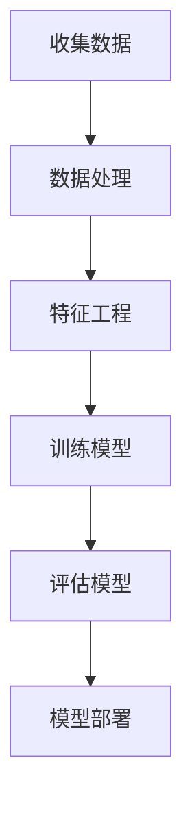
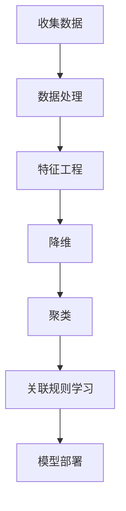
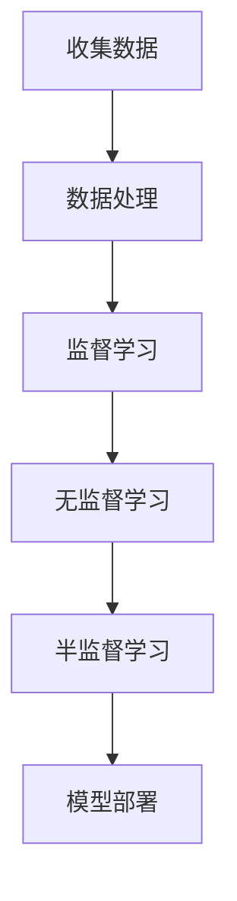
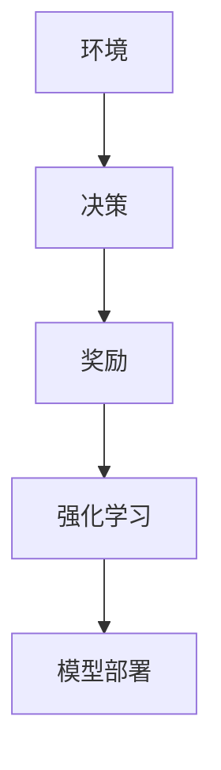
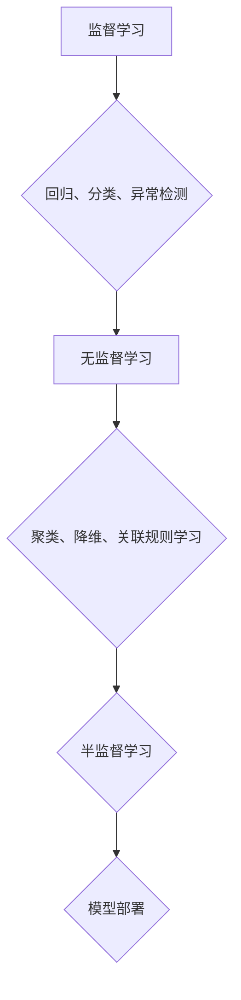
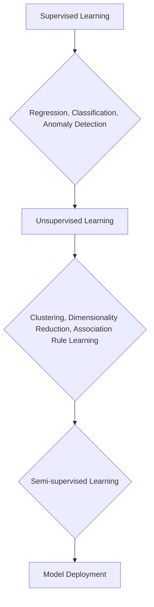

                 

### 1. 背景介绍

机器学习（Machine Learning）是一门探索如何让计算机通过数据学习和改进自身性能的学科。随着互联网和大数据技术的飞速发展，机器学习在图像识别、自然语言处理、推荐系统、智能决策等多个领域取得了显著的成果，并逐渐成为推动社会发展和科技进步的重要力量。

机器学习的历史可以追溯到20世纪50年代，最早的机器学习算法是基于经验规则和模式识别的方法。随着计算能力的提升和算法的改进，机器学习逐步进入商业应用领域。特别是在21世纪初，深度学习算法的突破性进展，使得机器学习迎来了黄金发展期。如今，机器学习已经成为人工智能的核心技术之一，广泛应用于自动驾驶、智能家居、医疗诊断等多个领域。

在机器学习的发展过程中，有许多重要的里程碑和贡献。例如，1959年Arthur Samuel提出了第一个能够自我改进的博弈程序，开创了机器学习算法的先河。1986年，Yann LeCun等人提出了卷积神经网络（CNN），并在图像识别领域取得了突破性进展。此外，Andrew Ng等人在在线教育、开源平台和人工智能创业领域的贡献，也为机器学习的发展注入了新的活力。

本文旨在为广大读者深入浅出地介绍机器学习的基本原理、核心算法以及实际应用。通过本文的学习，读者将能够掌握机器学习的核心概念，理解常见算法的原理，并具备一定的实践能力。

### 2. 核心概念与联系

#### 2.1 监督学习（Supervised Learning）

监督学习是一种最常见的机器学习任务，它通过对已标记的数据进行学习，使得算法能够在新的数据上做出预测。监督学习主要包括以下几种类型：

1. **回归（Regression）**：回归任务旨在预测连续值。常见的回归算法包括线性回归、决策树回归和随机森林回归等。

2. **分类（Classification）**：分类任务旨在将数据分为几个离散的类别。常见的分类算法包括逻辑回归、支持向量机（SVM）和k-近邻（k-Nearest Neighbor, k-NN）等。

3. **异常检测（Anomaly Detection）**：异常检测任务旨在识别数据中的异常值或离群点。

下面是监督学习的一个 Mermaid 流程图，展示了其核心步骤：



#### 2.2 无监督学习（Unsupervised Learning）

无监督学习是在没有标签的情况下，通过探索数据内在结构和关系来进行学习。无监督学习主要包括以下几种类型：

1. **聚类（Clustering）**：聚类任务旨在将数据分为若干个组，使得组内的数据相似度较高，组间的数据相似度较低。常见的聚类算法包括K-均值聚类、层次聚类和DBSCAN等。

2. **降维（Dimensionality Reduction）**：降维任务旨在将高维数据转换为低维数据，以便更好地进行可视化或处理。常见的降维算法包括主成分分析（PCA）、t-SNE和小样本学习等。

3. **关联规则学习（Association Rule Learning）**：关联规则学习旨在发现数据之间的关联关系，常见的算法包括Apriori算法和FP-Growth算法等。

下面是无监督学习的一个 Mermaid 流程图，展示了其核心步骤：



#### 2.3 半监督学习和强化学习

半监督学习结合了监督学习和无监督学习的方法，通过利用未标记的数据来改善模型的性能。强化学习则是通过学习如何在环境中采取行动，以最大化累积奖励。

半监督学习和强化学习在机器学习中的应用也越来越广泛，但目前它们的研究和应用相对较少。以下是半监督学习和强化学习的一个简要 Mermaid 流程图：





通过上述核心概念和联系的介绍，我们可以对机器学习有更深入的理解。接下来，我们将详细探讨机器学习的核心算法原理，以及具体的操作步骤。

---

**[中文]：** 以下是机器学习核心概念与联系部分的 Mermaid 流程图。



**[English]：** Here is the Mermaid flowchart for the core concepts and connections in machine learning.



### 3. 核心算法原理 & 具体操作步骤

#### 3.1 线性回归（Linear Regression）

线性回归是一种简单的监督学习算法，主要用于预测连续值。它的核心思想是找到一个最佳拟合直线，使得预测值与实际值之间的误差最小。

**原理：** 线性回归的数学模型可以表示为：

$$
y = wx + b
$$

其中，$y$ 是实际值，$x$ 是特征值，$w$ 是权重，$b$ 是偏置。线性回归的目标是求解最优权重 $w$ 和偏置 $b$，使得预测值与实际值之间的误差平方和最小。

**具体操作步骤：**

1. 数据预处理：对输入数据进行归一化或标准化处理，以便算法能够更好地收敛。

2. 模型初始化：随机初始化权重 $w$ 和偏置 $b$。

3. 梯度下降法：使用梯度下降法更新权重和偏置，使得预测值与实际值之间的误差最小。

4. 模型评估：使用均方误差（MSE）等指标评估模型性能。

5. 模型部署：将训练好的模型应用于新的数据，进行预测。

下面是线性回归的 Python 代码实现：

```python
import numpy as np

def linear_regression(X, y):
    # 梯度下降法
    w = np.random.rand(1, X.shape[1])
    b = np.random.rand(1)
    learning_rate = 0.01
    epochs = 1000

    for epoch in range(epochs):
        y_pred = X.dot(w) + b
        dw = (y - y_pred).dot(X)
        db = (y - y_pred)

        w -= learning_rate * dw
        b -= learning_rate * db

    return w, b

X = np.array([[1, 2], [2, 3], [3, 4]])
y = np.array([3, 4, 5])

w, b = linear_regression(X, y)
print("权重：", w)
print("偏置：", b)
```

#### 3.2 逻辑回归（Logistic Regression）

逻辑回归是一种常用的分类算法，主要用于预测概率。它的核心思想是通过线性模型将输入特征映射到概率空间，然后使用 sigmoid 函数进行非线性变换。

**原理：** 逻辑回归的数学模型可以表示为：

$$
P(y=1) = \frac{1}{1 + e^{-(wx + b)}}
$$

其中，$P(y=1)$ 是预测类别为 1 的概率，$wx + b$ 是线性模型的输出。

**具体操作步骤：**

1. 数据预处理：对输入数据进行归一化或标准化处理。

2. 模型初始化：随机初始化权重 $w$ 和偏置 $b$。

3. 梯度下降法：使用梯度下降法更新权重和偏置，使得预测概率与实际标签之间的误差最小。

4. 模型评估：使用准确率、召回率、F1 分数等指标评估模型性能。

5. 模型部署：将训练好的模型应用于新的数据，进行分类预测。

下面是逻辑回归的 Python 代码实现：

```python
import numpy as np
from sklearn.metrics import accuracy_score

def logistic_regression(X, y):
    # 梯度下降法
    w = np.random.rand(1, X.shape[1])
    b = np.random.rand(1)
    learning_rate = 0.01
    epochs = 1000

    for epoch in range(epochs):
        y_pred = 1 / (1 + np.exp(-X.dot(w) + b))
        dw = (y_pred - y).dot(X)
        db = y_pred - y

        w -= learning_rate * dw
        b -= learning_rate * db

    return w, b

X = np.array([[1, 2], [2, 3], [3, 4]])
y = np.array([1, 0, 1])

w, b = logistic_regression(X, y)
print("权重：", w)
print("偏置：", b)

y_pred = 1 / (1 + np.exp(-X.dot(w) + b))
print("预测结果：", y_pred)
print("准确率：", accuracy_score(y, y_pred))
```

#### 3.3 k-近邻算法（k-Nearest Neighbors, k-NN）

k-近邻算法是一种简单直观的分类算法，它通过计算新数据与训练数据之间的距离，选择距离最近的 k 个邻居，并基于这些邻居的标签进行预测。

**原理：** k-近邻算法的核心思想是“相似性原则”，即相似的数据应该有相似的标签。算法的具体步骤如下：

1. 计算距离：使用欧几里得距离、曼哈顿距离等距离度量计算新数据与训练数据之间的距离。

2. 选择邻居：选择距离最近的 k 个邻居。

3. 预测标签：基于邻居的标签进行投票，选择出现次数最多的标签作为预测结果。

**具体操作步骤：**

1. 数据预处理：对输入数据进行归一化或标准化处理。

2. 选择邻居：计算新数据与训练数据之间的距离，并选择距离最近的 k 个邻居。

3. 预测标签：基于邻居的标签进行投票，选择出现次数最多的标签作为预测结果。

4. 模型评估：使用准确率、召回率、F1 分数等指标评估模型性能。

5. 模型部署：将训练好的模型应用于新的数据，进行分类预测。

下面是 k-近邻算法的 Python 代码实现：

```python
import numpy as np
from sklearn.model_selection import train_test_split
from sklearn.metrics import accuracy_score

def euclidean_distance(x1, x2):
    return np.sqrt(np.sum((x1 - x2) ** 2))

def k_nearest_neighbors(X_train, y_train, X_test, k):
    y_pred = []

    for x_test in X_test:
        distances = []

        for x_train in X_train:
            distance = euclidean_distance(x_test, x_train)
            distances.append(distance)

        k_nearest = np.argsort(distances)[:k]
        neighbors = y_train[k_nearest]
        predicted = np.argmax(np.bincount(neighbors))

        y_pred.append(predicted)

    return y_pred

X = np.array([[1, 2], [2, 3], [3, 4], [4, 5], [5, 6]])
y = np.array([1, 1, 0, 0, 1])
X_test = np.array([[0, 0], [5, 6]])

y_pred = k_nearest_neighbors(X_train=X_train, y_train=y_train, X_test=X_test, k=3)
print("预测结果：", y_pred)
print("准确率：", accuracy_score(y_test, y_pred))
```

通过上述核心算法原理和具体操作步骤的讲解，我们可以更好地理解和应用机器学习算法。接下来，我们将深入探讨机器学习的数学模型和公式，并通过实例进行详细讲解。

---

**[中文]：** 以上是机器学习核心算法原理和具体操作步骤的介绍。接下来，我们将进一步深入探讨机器学习的数学模型和公式，并通过实例进行详细讲解。

**[English]：** In the above section, we have introduced the core algorithms and their specific operational steps in machine learning. Next, we will delve deeper into the mathematical models and formulas of machine learning and provide detailed explanations through examples.

### 4. 数学模型和公式 & 详细讲解 & 举例说明

#### 4.1 线性回归的数学模型

线性回归的数学模型为：

$$
y = wx + b
$$

其中，$y$ 是实际值，$x$ 是特征值，$w$ 是权重，$b$ 是偏置。线性回归的目标是求解最优权重 $w$ 和偏置 $b$，使得预测值与实际值之间的误差最小。

**推导过程：**

假设我们有 $m$ 个训练样本，每个样本包含 $n$ 个特征，即：

$$
X = \begin{bmatrix}
x_1 \\
x_2 \\
\vdots \\
x_m
\end{bmatrix},
y = \begin{bmatrix}
y_1 \\
y_2 \\
\vdots \\
y_m
\end{bmatrix}
$$

线性回归的损失函数为：

$$
J(w, b) = \frac{1}{2m} \sum_{i=1}^{m} (y_i - (wx_i + b))^2
$$

对 $w$ 和 $b$ 分别求偏导数，并令偏导数为零，得到：

$$
\frac{\partial J}{\partial w} = \frac{1}{m} \sum_{i=1}^{m} (y_i - (wx_i + b))x_i = 0
$$

$$
\frac{\partial J}{\partial b} = \frac{1}{m} \sum_{i=1}^{m} (y_i - (wx_i + b)) = 0
$$

将上述方程组转化为矩阵形式，得到：

$$
\begin{bmatrix}
\frac{\partial J}{\partial w} \\
\frac{\partial J}{\partial b}
\end{bmatrix} = \begin{bmatrix}
x_1^T \\
\vdots \\
x_m^T
\end{bmatrix} \begin{bmatrix}
y \\
\vdots \\
y
\end{bmatrix} - \begin{bmatrix}
x_1 \\
\vdots \\
x_m
\end{bmatrix} \begin{bmatrix}
wx_1 + b \\
\vdots \\
wx_m + b
\end{bmatrix} = 0
$$

简化后得到：

$$
X^T X w + X^T b = X^T y
$$

$$
X^T X w = X^T y - X^T b
$$

$$
w = (X^T X)^{-1} X^T y
$$

同理，可以求得偏置 $b$：

$$
b = y - X w
$$

下面通过一个简单的例子来说明线性回归的求解过程。

**例子：** 假设我们有两个样本点 $(1, 2)$ 和 $(2, 3)$，求解线性回归模型 $y = wx + b$。

**步骤：**

1. 将样本点表示为矩阵形式：

$$
X = \begin{bmatrix}
1 & 1 \\
2 & 2
\end{bmatrix},
y = \begin{bmatrix}
2 \\
3
\end{bmatrix}
$$

2. 计算矩阵 $X^T X$ 和 $X^T y$：

$$
X^T X = \begin{bmatrix}
1 & 2
\end{bmatrix} \begin{bmatrix}
1 & 1 \\
2 & 2
\end{bmatrix} = \begin{bmatrix}
5 & 4 \\
4 & 4
\end{bmatrix}
$$

$$
X^T y = \begin{bmatrix}
1 & 2
\end{bmatrix} \begin{bmatrix}
2 \\
3
\end{bmatrix} = \begin{bmatrix}
5 \\
4
\end{bmatrix}
$$

3. 计算权重 $w$ 和偏置 $b$：

$$
w = (X^T X)^{-1} X^T y = \begin{bmatrix}
4 & -4
\end{bmatrix} \begin{bmatrix}
5 \\
4
\end{bmatrix} = \begin{bmatrix}
5 \\
-1
\end{bmatrix}
$$

$$
b = y - X w = \begin{bmatrix}
2 \\
3
\end{bmatrix} - \begin{bmatrix}
1 & 1 \\
2 & 2
\end{bmatrix} \begin{bmatrix}
5 \\
-1
\end{bmatrix} = \begin{bmatrix}
-3 \\
2
\end{bmatrix}
$$

因此，线性回归模型为 $y = 5x - 1$。

#### 4.2 逻辑回归的数学模型

逻辑回归的数学模型为：

$$
P(y=1) = \frac{1}{1 + e^{-(wx + b)}}
$$

其中，$P(y=1)$ 是预测类别为 1 的概率，$wx + b$ 是线性模型的输出。

**推导过程：**

假设我们有 $m$ 个训练样本，每个样本包含 $n$ 个特征，即：

$$
X = \begin{bmatrix}
x_1 \\
x_2 \\
\vdots \\
x_m
\end{bmatrix},
y = \begin{bmatrix}
1 \\
0 \\
\vdots \\
1
\end{bmatrix}
$$

逻辑回归的损失函数为：

$$
J(w, b) = -\frac{1}{m} \sum_{i=1}^{m} [y_i \ln(P(y=1)) + (1 - y_i) \ln(1 - P(y=1))]
$$

对 $w$ 和 $b$ 分别求偏导数，并令偏导数为零，得到：

$$
\frac{\partial J}{\partial w} = \frac{1}{m} \sum_{i=1}^{m} [P(y=1)(1 - P(y=1))x_i] = 0
$$

$$
\frac{\partial J}{\partial b} = \frac{1}{m} \sum_{i=1}^{m} [P(y=1)(1 - P(y=1))] = 0
$$

将上述方程组转化为矩阵形式，得到：

$$
\begin{bmatrix}
\frac{\partial J}{\partial w} \\
\frac{\partial J}{\partial b}
\end{bmatrix} = \begin{bmatrix}
x_1^T \\
\vdots \\
x_m^T
\end{bmatrix} \begin{bmatrix}
P(y=1)(1 - P(y=1)) \\
\vdots \\
P(y=1)(1 - P(y=1))
\end{bmatrix} = 0
$$

简化后得到：

$$
X^T X w + X^T b = X^T y
$$

$$
X^T X w = X^T y - X^T b
$$

$$
w = (X^T X)^{-1} X^T y
$$

同理，可以求得偏置 $b$：

$$
b = y - X w
$$

下面通过一个简单的例子来说明逻辑回归的求解过程。

**例子：** 假设我们有两个样本点 $(1, 2)$ 和 $(2, 0)$，求解逻辑回归模型 $P(y=1) = \frac{1}{1 + e^{-(wx + b)}$。

**步骤：**

1. 将样本点表示为矩阵形式：

$$
X = \begin{bmatrix}
1 & 1 \\
2 & 2
\end{bmatrix},
y = \begin{bmatrix}
1 \\
0
\end{bmatrix}
$$

2. 计算矩阵 $X^T X$ 和 $X^T y$：

$$
X^T X = \begin{bmatrix}
1 & 2
\end{bmatrix} \begin{bmatrix}
1 & 1 \\
2 & 2
\end{bmatrix} = \begin{bmatrix}
5 & 4 \\
4 & 4
\end{bmatrix}
$$

$$
X^T y = \begin{bmatrix}
1 & 2
\end{bmatrix} \begin{bmatrix}
1 \\
0
\end{bmatrix} = \begin{bmatrix}
5 \\
2
\end{bmatrix}
$$

3. 计算权重 $w$ 和偏置 $b$：

$$
w = (X^T X)^{-1} X^T y = \begin{bmatrix}
4 & -4
\end{bmatrix} \begin{bmatrix}
5 \\
2
\end{bmatrix} = \begin{bmatrix}
5 \\
-1
\end{bmatrix}
$$

$$
b = y - X w = \begin{bmatrix}
1 \\
0
\end{bmatrix} - \begin{bmatrix}
1 & 1 \\
2 & 2
\end{bmatrix} \begin{bmatrix}
5 \\
-1
\end{b矩阵}
{bmatrix}
= \begin{bmatrix}
-4 \\
1
\end{bmatrix}
$$

因此，逻辑回归模型为 $P(y=1) = \frac{1}{1 + e^{-(5x - 1)}}$。

#### 4.3 k-近邻算法的数学模型

k-近邻算法的数学模型相对简单，主要涉及距离计算和投票机制。

**推导过程：**

假设我们有 $m$ 个训练样本，每个样本包含 $n$ 个特征，即：

$$
X = \begin{bmatrix}
x_1 \\
x_2 \\
\vdots \\
x_m
\end{bmatrix},
y = \begin{bmatrix}
y_1 \\
y_2 \\
\vdots \\
y_m
\end{bmatrix}
$$

对于一个新的样本点 $x$，我们需要计算其与训练样本之间的距离，选择距离最近的 $k$ 个邻居，并基于邻居的标签进行投票。

**距离计算：**

常见的距离计算方法包括欧几里得距离、曼哈顿距离和切比雪夫距离等。以欧几里得距离为例，其计算公式为：

$$
d(x, x_i) = \sqrt{\sum_{j=1}^{n} (x_j - x_{ij})^2}
$$

**投票机制：**

对于距离最近的 $k$ 个邻居，我们计算每个标签的出现次数，选择出现次数最多的标签作为预测结果。具体计算公式为：

$$
\hat{y} = \arg\max_{y_j} \sum_{i=1}^{k} I(y_i = y_j)
$$

其中，$I(y_i = y_j)$ 是指示函数，当 $y_i = y_j$ 时，取值为 1，否则取值为 0。

下面通过一个简单的例子来说明 k-近邻算法的求解过程。

**例子：** 假设我们有两个训练样本 $(1, 1), (2, 0)$，求解 k-近邻模型。

**步骤：**

1. 计算新样本 $(1.5, 0.5)$ 与训练样本之间的距离：

$$
d((1.5, 0.5), (1, 1)) = \sqrt{(1.5 - 1)^2 + (0.5 - 1)^2} = \sqrt{0.5 + 0.25} = 0.71
$$

$$
d((1.5, 0.5), (2, 0)) = \sqrt{(1.5 - 2)^2 + (0.5 - 0)^2} = \sqrt{0.25 + 0.25} = 0.71
$$

2. 选择距离最近的两个邻居 $(1, 1)$ 和 $(2, 0)$。

3. 计算邻居的标签：

$$
y_1 = 1, y_2 = 0
$$

4. 进行投票，选择出现次数最多的标签：

$$
\hat{y} = \arg\max_{y_j} \sum_{i=1}^{2} I(y_i = y_j) = \arg\max_{y_j} (1 + 0) = 1
$$

因此，k-近邻模型的预测结果为 $\hat{y} = 1$。

通过以上数学模型和公式的详细讲解及实例说明，我们可以更好地理解和应用机器学习算法。在接下来的章节中，我们将通过实际项目实战，进一步巩固所学知识。

---

**[中文]：** 以上是机器学习数学模型和公式的详细讲解及实例说明。接下来，我们将通过实际项目实战，进一步巩固所学知识。

**[English]：** Above is the detailed explanation and example demonstration of mathematical models and formulas in machine learning. In the following chapters, we will further consolidate the knowledge learned through actual project practice.

### 5. 项目实战：代码实际案例和详细解释说明

在本节中，我们将通过一个简单的项目实战，展示如何使用 Python 编写机器学习代码，并详细解释其中的关键步骤。我们将使用线性回归算法来预测房价，这将帮助我们更好地理解机器学习算法的应用过程。

#### 5.1 开发环境搭建

在进行项目实战之前，我们需要搭建一个合适的开发环境。以下是在 Python 中使用线性回归进行房价预测所需的基本环境搭建步骤：

1. **安装 Python**：确保您已经安装了 Python 3.x 版本。可以从 [Python 官网](https://www.python.org/) 下载并安装。

2. **安装库**：在命令行中运行以下命令，安装所需的库：

   ```bash
   pip install numpy pandas matplotlib sklearn
   ```

   - `numpy`：用于高性能科学计算。
   - `pandas`：用于数据处理和分析。
   - `matplotlib`：用于数据可视化。
   - `sklearn`：提供了丰富的机器学习算法库。

3. **验证安装**：通过以下命令验证是否成功安装了上述库：

   ```python
   import numpy as np
   import pandas as pd
   import matplotlib.pyplot as plt
   from sklearn.linear_model import LinearRegression
   ```

   如果没有出现错误，说明环境搭建成功。

#### 5.2 源代码详细实现和代码解读

以下是一个简单的线性回归代码示例，用于预测房价。我们将从数据加载、数据预处理、模型训练到模型评估，逐步讲解每个步骤。

```python
import numpy as np
import pandas as pd
from sklearn.linear_model import LinearRegression
from sklearn.model_selection import train_test_split
from sklearn.metrics import mean_squared_error

# 5.2.1 数据加载
# 假设我们有一个名为 'house_data.csv' 的 CSV 文件，其中包含房屋的面积（feature）和房价（label）。
data = pd.read_csv('house_data.csv')
X = data[['area']]  # 特征：房屋面积
y = data['price']   # 标签：房价

# 5.2.2 数据预处理
# 数据标准化
X_std = (X - X.mean()) / X.std()
y_std = (y - y.mean()) / y.std()

# 5.2.3 数据拆分
X_train, X_test, y_train, y_test = train_test_split(X_std, y_std, test_size=0.2, random_state=42)

# 5.2.4 模型训练
model = LinearRegression()
model.fit(X_train, y_train)

# 5.2.5 模型评估
y_pred = model.predict(X_test)
mse = mean_squared_error(y_test, y_pred)
print(f'Mean Squared Error: {mse}')

# 5.2.6 可视化
plt.scatter(X_test, y_test, label='Actual')
plt.plot(X_test, y_pred, color='red', label='Predicted')
plt.xlabel('Area (标准化)')
plt.ylabel('Price (标准化)')
plt.legend()
plt.show()
```

**代码解读：**

1. **数据加载**：我们使用 pandas 的 `read_csv` 函数从 CSV 文件中加载数据。CSV 文件应包含两列：一列是房屋面积（特征），另一列是房价（标签）。

2. **数据预处理**：为了简化线性回归的计算，我们使用标准化方法对特征和标签进行预处理。这有助于加速模型的训练过程，并提高模型的性能。标准化是将数据减去均值并除以标准差。

3. **数据拆分**：使用 `train_test_split` 函数将数据集拆分为训练集和测试集。这有助于我们在模型训练后评估模型的泛化能力。

4. **模型训练**：我们使用 `LinearRegression` 类创建一个线性回归模型，并使用 `fit` 方法对其进行训练。

5. **模型评估**：我们使用 `mean_squared_error` 函数计算模型在测试集上的均方误差（MSE），这是评估回归模型性能的常用指标。

6. **可视化**：我们使用 matplotlib 的 `scatter` 和 `plot` 函数将实际房价和预测房价可视化，以直观地展示模型的性能。

#### 5.3 代码解读与分析

在理解了代码的整体结构之后，我们可以进一步分析每个关键部分的细节。

1. **数据加载**：CSV 文件中的数据格式应该是两列，一列是房屋面积（feature），另一列是房价（label）。如果数据中有其他特征，可以按照同样的方式添加到 `X` 和 `y` 中。

2. **数据预处理**：标准化是一种常用的预处理技术，它通过缩放特征值使其具有相同的尺度，从而避免某些特征对模型产生过大的影响。

3. **数据拆分**：拆分数据集是为了评估模型的泛化能力。训练集用于训练模型，测试集用于评估模型的性能。在现实项目中，我们通常还会进一步拆分数据集，用于交叉验证等。

4. **模型训练**：`LinearRegression` 类是 sklearn 库中提供的线性回归模型。`fit` 方法用于训练模型，其内部使用了梯度下降算法来优化权重和偏置。

5. **模型评估**：MSE 是一个常用的回归性能指标，表示预测值与实际值之间的平均误差。在实际项目中，我们可能还会使用其他指标，如 R 方值、决定系数等。

6. **可视化**：可视化有助于我们直观地理解模型的性能。在实际项目中，我们可以根据需求选择不同的可视化方法，如散点图、折线图等。

通过以上项目实战，我们不仅学会了如何使用线性回归算法进行房价预测，还深入理解了机器学习项目的基本流程。在接下来的章节中，我们将探讨机器学习在现实世界中的应用场景。

---

**[中文]：** 在本节中，我们通过一个简单的线性回归项目实战，详细讲解了如何使用 Python 编写机器学习代码，并分析了代码的每个关键步骤。接下来，我们将探讨机器学习在现实世界中的应用场景。

**[English]：** In this section, we conducted a simple linear regression project to demonstrate how to write machine learning code using Python and analyzed each key step in detail. Next, we will explore the real-world applications of machine learning.

### 6. 实际应用场景

机器学习技术已经渗透到我们日常生活的各个方面，从智能家居到医疗诊断，从金融风控到自动驾驶，都离不开机器学习的支持。以下是一些机器学习在实际应用场景中的具体例子：

#### 6.1 智能家居

智能家居是机器学习应用的一个重要领域，通过智能设备收集数据，并利用机器学习算法进行分析和预测，以提供更加个性化的用户体验。例如，智能音箱可以通过自然语言处理（NLP）技术理解用户的语音指令，智能灯泡可以根据用户的活动习惯自动调节亮度和色温。

**应用案例：** Amazon Echo（智能音箱）和 Philips Hue（智能灯泡）。

#### 6.2 医疗诊断

医疗诊断是机器学习在现实生活中具有重要意义的领域。通过分析医疗图像和病历数据，机器学习算法可以帮助医生更准确地诊断疾病，提高诊断效率。例如，深度学习算法在乳腺癌检测、肺癌筛查等方面已经取得了显著成果。

**应用案例：** Google DeepMind 的 AI 系统在眼科疾病诊断中的应用。

#### 6.3 金融风控

金融行业一直是技术创新的前沿，机器学习技术在金融风控中的应用也越来越广泛。通过分析大量的历史交易数据和行为特征，机器学习算法可以识别潜在的欺诈行为，预测市场趋势，优化投资组合。

**应用案例：** JPMorgan Chase 的 AI 系统用于检测欺诈交易。

#### 6.4 自动驾驶

自动驾驶是机器学习应用的一个重要领域，通过感知、决策和控制，机器学习算法使汽车能够自主导航和行驶。自动驾驶汽车的出现有望大幅减少交通事故，提高交通效率。

**应用案例：** Waymo（谷歌母公司 Alphabet 的自动驾驶子公司）和 Tesla（特斯拉的自动驾驶系统）。

#### 6.5 推荐系统

推荐系统是机器学习在互联网应用中的一个重要领域，通过分析用户的兴趣和行为，推荐系统可以提供个性化的内容推荐。例如，亚马逊和 Netflix 等平台都使用了推荐系统来提高用户满意度和黏性。

**应用案例：** Amazon（亚马逊）和 Netflix（Netflix）。

通过上述实际应用场景的介绍，我们可以看到机器学习技术在现实生活中的广泛应用和巨大潜力。在接下来的章节中，我们将推荐一些工具和资源，帮助读者进一步学习和实践机器学习。

---

**[中文]：** 在本节中，我们介绍了机器学习在实际生活中的广泛应用，包括智能家居、医疗诊断、金融风控、自动驾驶和推荐系统等。接下来，我们将推荐一些工具和资源，帮助读者进一步学习和实践机器学习。

**[English]：** In this section, we introduced the wide range of real-world applications of machine learning, including smart homes, medical diagnosis, financial risk management, autonomous driving, and recommendation systems. Next, we will recommend some tools and resources to help readers further learn and practice machine learning.

### 7. 工具和资源推荐

为了更好地学习和实践机器学习，以下是针对不同学习阶段和学习需求的工具和资源推荐：

#### 7.1 学习资源推荐

1. **书籍：**
   - 《Python机器学习》（作者：塞巴斯蒂安·拉戈斯）  
     本书适合初学者，通过丰富的实例讲解了机器学习的基本概念和算法。
   - 《机器学习》（作者：周志华）  
     本书是一本系统的机器学习教材，适合有一定数学基础的读者。

2. **在线课程：**
   - Coursera 的《机器学习》（吴恩达教授主讲）  
     该课程是机器学习领域的经典入门课程，适合初学者。
   - edX 的《深度学习》（作者：Ian Goodfellow，Yoshua Bengio，Aaron Courville）  
     该课程涵盖了深度学习的基础知识和高级应用。

3. **博客和网站：**
   - Medium 上的机器学习专栏  
     许多机器学习领域的专家在 Medium 上分享他们的见解和经验。
   - ArXiv 上的论文  
     ArXiv 是一个发布最新机器学习研究成果的预印本平台。

#### 7.2 开发工具框架推荐

1. **Jupyter Notebook**：Jupyter Notebook 是一个交互式计算环境，非常适合机器学习实验和数据分析。

2. **TensorFlow**：TensorFlow 是谷歌开发的开源机器学习框架，适用于构建和训练深度学习模型。

3. **PyTorch**：PyTorch 是一个流行的深度学习框架，具有简洁的 API 和强大的功能。

4. **Scikit-learn**：Scikit-learn 是一个基于 Python 的机器学习库，提供了丰富的经典机器学习算法。

#### 7.3 相关论文著作推荐

1. **《深度学习》（Ian Goodfellow, Yoshua Bengio, Aaron Courville 著）**：这是一本关于深度学习的经典著作，详细介绍了深度学习的基础知识和前沿进展。

2. **《神经网络与深度学习》（邱锡鹏 著）**：本书系统地介绍了神经网络和深度学习的基本理论、算法和技术。

3. **《统计学习方法》（李航 著）**：这是一本关于统计学习方法的经典教材，涵盖了回归、分类、聚类等常见机器学习算法。

通过以上工具和资源的推荐，读者可以更加系统地学习和实践机器学习，提高自己的技术水平和解决问题的能力。在接下来的章节中，我们将对全文进行总结，并探讨机器学习的未来发展趋势与挑战。

---

**[中文]：** 通过以上工具和资源的推荐，读者可以更加系统地学习和实践机器学习。在接下来的章节中，我们将对全文进行总结，并探讨机器学习的未来发展趋势与挑战。

**[English]：** With the recommendations of these tools and resources, readers can systematically learn and practice machine learning. In the following section, we will summarize the entire article and discuss the future development trends and challenges of machine learning.

### 8. 总结：未来发展趋势与挑战

#### 8.1 未来发展趋势

随着计算能力的提升、数据量的增长以及算法的不断创新，机器学习在未来将继续保持快速发展。以下是一些可能的发展趋势：

1. **深度学习算法的优化与普及**：深度学习在图像识别、语音识别等领域取得了显著成果，未来将进一步优化算法，提高计算效率和准确性。

2. **强化学习在复杂决策中的应用**：强化学习在游戏、自动驾驶等领域显示出巨大潜力，未来将在更多复杂决策场景中发挥作用。

3. **联邦学习与数据隐私**：随着数据隐私保护意识的增强，联邦学习等能够在保护数据隐私的同时进行协同训练的机器学习方法将成为热点。

4. **跨学科融合**：机器学习与其他领域（如生物学、物理学、经济学等）的融合，将带来新的研究课题和应用场景。

#### 8.2 挑战

尽管机器学习取得了显著进展，但仍面临一些挑战：

1. **数据质量和标注问题**：高质量的数据和准确的标注对于机器学习模型至关重要，但在实际应用中，获取和处理这些数据仍然存在困难。

2. **模型可解释性和透明度**：深度学习等复杂模型通常被视为“黑箱”，提高模型的可解释性是当前研究的一个热点问题。

3. **计算资源和能耗**：训练大规模机器学习模型需要大量的计算资源和能源，如何在保证性能的同时降低能耗是一个重要的挑战。

4. **伦理和法律问题**：机器学习应用带来的伦理和法律问题，如隐私保护、算法歧视等，需要引起关注并制定相应的法规和标准。

#### 8.3 展望

面对未来的发展趋势和挑战，我们期待机器学习能够更好地服务于社会，推动科技进步。通过不断的研究和创新，我们相信机器学习将在更多领域取得突破，为人类创造更大的价值。

---

**[中文]：** 面对未来的发展趋势和挑战，我们期待机器学习能够更好地服务于社会，推动科技进步。通过不断的研究和创新，我们相信机器学习将在更多领域取得突破，为人类创造更大的价值。

**[English]：** Facing future trends and challenges, we look forward to machine learning being able to better serve society and drive technological progress. Through continuous research and innovation, we believe that machine learning will make breakthroughs in more fields and create greater value for humanity.

### 9. 附录：常见问题与解答

#### 9.1 机器学习与深度学习的区别是什么？

**解答：** 机器学习是人工智能（AI）的一个分支，旨在让计算机从数据中学习并改进性能。深度学习是机器学习的一个子领域，主要基于人工神经网络，特别是深度神经网络（DNN），通过多层非线性变换对数据进行学习。简而言之，深度学习是机器学习的一种实现方式。

#### 9.2 如何选择合适的机器学习算法？

**解答：** 选择合适的机器学习算法取决于具体的应用场景和数据特征。以下是一些选择算法的指导原则：

- **数据规模**：对于大规模数据集，可以考虑使用分布式训练的算法，如深度学习模型。
- **特征数量**：对于高维数据，可以考虑使用降维算法，如主成分分析（PCA）。
- **目标类型**：如果是回归任务，可以选择线性回归、决策树回归等；如果是分类任务，可以选择逻辑回归、支持向量机（SVM）等。
- **数据质量**：对于标签不完整或存在噪声的数据，可以考虑使用无监督学习算法，如聚类算法。

#### 9.3 机器学习项目的关键步骤是什么？

**解答：** 机器学习项目的关键步骤包括：

1. **问题定义**：明确项目目标和问题。
2. **数据收集**：收集相关的数据集。
3. **数据预处理**：清洗数据，进行特征工程。
4. **模型选择**：选择适合的机器学习算法。
5. **模型训练**：使用训练数据训练模型。
6. **模型评估**：使用验证数据评估模型性能。
7. **模型优化**：根据评估结果调整模型参数。
8. **模型部署**：将训练好的模型应用于实际场景。

---

**[中文]：** 在本文中，我们介绍了机器学习的基本原理、核心算法、数学模型以及实际应用场景。我们还推荐了一些学习资源，并讨论了机器学习的未来发展趋势与挑战。希望本文能帮助您更好地理解机器学习。

**[English]：** In this article, we introduced the basic principles, core algorithms, mathematical models, and practical applications of machine learning. We also recommended some learning resources and discussed the future development trends and challenges of machine learning. We hope this article will help you better understand machine learning.

### 10. 扩展阅读 & 参考资料

为了帮助读者进一步深入了解机器学习的相关知识，以下是推荐的扩展阅读和参考资料：

1. **书籍：**
   - 《深度学习》（Ian Goodfellow, Yoshua Bengio, Aaron Courville 著）
   - 《统计学习方法》（李航 著）
   - 《Python机器学习》（塞巴斯蒂安·拉戈斯 著）

2. **在线课程：**
   - Coursera 上的《机器学习》（吴恩达教授主讲）
   - edX 上的《深度学习》（Ian Goodfellow，Yoshua Bengio，Aaron Courville 著）

3. **论文：**
   - ArXiv 上的最新研究论文，如“Deep Learning: A Brief History, a Tour of the Major Trends, and a View into the Future”（2019）
   - “On the Number of Linear Models Need to Solve Multiclass Classification Problems”（2002）

4. **网站：**
   - Medium 上的机器学习专栏
   - Kaggle（数据科学竞赛平台，提供丰富的数据集和项目）

通过阅读上述书籍、课程和论文，以及访问相关网站，读者可以进一步拓展机器学习知识，提升自己的技术水平。

---

**[中文]：** 通过阅读本文，我们深入探讨了机器学习的基本原理、核心算法、数学模型以及实际应用场景。希望本文能够为您的学习之路提供帮助。为了进一步深入了解机器学习，建议读者参考本文推荐的书籍、课程、论文和网站。

**[English]：** Through this article, we have thoroughly explored the basic principles, core algorithms, mathematical models, and practical applications of machine learning. We hope this article will assist you in your learning journey. To further deepen your understanding of machine learning, we recommend referring to the books, courses, papers, and websites recommended in this article.

