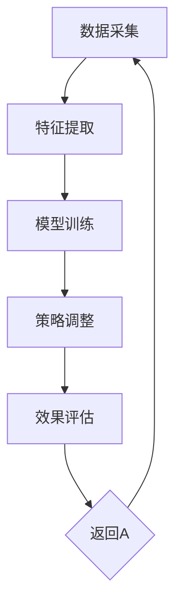

                 

## 1. 背景介绍

机器学习在个性化学习中的应用是一个备受关注的研究领域。个性化学习旨在根据每个学生的学习需求、能力和兴趣，为他们提供定制化的教学方案，从而提高学习效果。随着教育信息化和人工智能技术的不断发展，利用机器学习算法对学生的学习行为和知识掌握程度进行深入分析，已成为实现个性化学习的关键手段。

在教育领域，个性化学习具有重要的现实意义。传统的教学方式往往采用“一刀切”的方式，无法充分满足学生的个体差异。而个性化学习通过收集和分析学生的数据，可以动态调整教学策略，提供针对性的学习内容和方法，从而提高学生的主动性和学习效果。机器学习在个性化学习中的应用，主要包括自适应学习系统、推荐系统、智能诊断系统等。

自适应学习系统是一种基于机器学习技术的个性化学习平台，能够根据学生的学习行为和成绩数据，实时调整教学内容和教学策略，以满足不同学生的学习需求。例如，通过分析学生的学习轨迹，自适应学习系统可以识别出学生的学习弱点，并针对性地提供额外的学习资源。

推荐系统则利用机器学习算法，根据学生的学习历史、偏好和成绩，推荐适合他们的学习资源。这种系统能够提高学生的学习兴趣，帮助他们更快地掌握知识。

智能诊断系统通过分析学生的学习数据，识别出学生在学习过程中的潜在问题，并提供相应的解决方案。例如，通过分析学生的错误率，智能诊断系统可以帮助教师了解学生在哪些知识点上存在困难，从而有针对性地进行辅导。

本文将重点探讨机器学习在个性化学习中的适应性算法。适应性算法是指能够根据学习者的行为和反馈，动态调整学习策略的算法。本文将首先介绍适应性算法的核心概念和原理，然后深入分析几种常见的适应性算法，包括基于模型的适应性算法、基于规则的适应性算法和混合适应性算法。接着，本文将详细讲解数学模型和公式，并通过实际案例进行举例说明。最后，本文将探讨适应性算法在个性化学习中的实际应用场景，并提供一些工具和资源推荐，以帮助读者深入了解和应用这些算法。

## 2. 核心概念与联系

### 2.1. 适应性算法的定义

适应性算法是指一类能够根据输入数据的特征，动态调整自身参数或策略的算法。在个性化学习中，适应性算法的核心目标是通过不断学习用户的行为和反馈，调整教学策略，以实现更好的个性化学习效果。

### 2.2. 适应性算法的基本原理

适应性算法通常包括以下几个基本组成部分：

1. **数据采集**：收集学生的学习行为数据，如学习时间、学习路径、测试成绩等。
2. **特征提取**：从数据中提取关键特征，如学习习惯、知识点掌握情况、学习偏好等。
3. **模型训练**：利用收集到的数据和特征，训练适应性模型。
4. **策略调整**：根据模型的预测结果，动态调整教学策略，如调整学习资源、教学难度等。
5. **效果评估**：评估适应性算法的教学效果，并根据评估结果进一步优化算法。

### 2.3. 适应性算法的类型

适应性算法可以根据不同的分类标准进行分类。以下是几种常见的分类方法：

1. **基于模型的适应性算法**：这类算法通过训练机器学习模型，预测学生的行为和需求，从而调整教学策略。常见的模型包括决策树、支持向量机、神经网络等。
2. **基于规则的适应性算法**：这类算法通过定义一系列规则，根据学生的行为触发相应的教学策略。这些规则可以是简单的条件语句，也可以是复杂的逻辑运算。
3. **混合适应性算法**：这类算法结合了基于模型和基于规则的优势，通过融合模型预测和规则决策，实现更加灵活和高效的适应性。

### 2.4. 适应性算法与个性化学习的联系

适应性算法与个性化学习之间存在密切的联系。个性化学习的核心是满足学生的个性化需求，而适应性算法通过不断调整教学策略，实现了这一目标。具体来说，适应性算法在个性化学习中的应用主要体现在以下几个方面：

1. **自适应学习资源推荐**：通过分析学生的学习行为和偏好，适应性算法可以为学生推荐最适合他们的学习资源。
2. **自适应学习路径规划**：根据学生的学习进度和知识点掌握情况，适应性算法可以为学生规划个性化的学习路径。
3. **自适应教学策略调整**：根据学生的学习效果和反馈，适应性算法可以动态调整教学策略，如调整学习资源的难度和类型，以满足学生的个性化需求。

### 2.5. 适应性算法与教育领域的关系

适应性算法在教育领域具有广泛的应用前景。随着教育信息化的推进，教育数据的规模和种类不断增多，为适应性算法的应用提供了丰富的数据资源。同时，教育领域对于提高教育质量和个性化教育的需求也为适应性算法的发展提供了强大的动力。因此，适应性算法与教育领域之间的互动将越来越紧密，有望在未来的教育改革中发挥重要作用。

### 2.6. Mermaid 流程图

以下是适应性算法的基本流程图的 Mermaid 表示：



在上述流程图中，数据采集、特征提取、模型训练、策略调整和效果评估构成了适应性算法的基本流程。通过不断迭代这个过程，适应性算法能够不断优化自身的性能，以实现更好的个性化学习效果。

<|assistant|>## 3. 核心算法原理 & 具体操作步骤

适应性算法在个性化学习中的应用，主要依赖于其能够根据学生的学习行为和反馈，动态调整教学策略的能力。下面我们将介绍几种常见的适应性算法，包括基于模型的适应性算法、基于规则的适应性算法和混合适应性算法，并详细阐述其具体操作步骤。

### 3.1. 基于模型的适应性算法

#### 原理

基于模型的适应性算法主要通过训练机器学习模型，预测学生的学习行为和需求，进而调整教学策略。常见的机器学习模型包括决策树、支持向量机（SVM）和神经网络（NN）等。

#### 步骤

1. **数据采集**：收集学生的学习行为数据，如学习时间、学习路径、测试成绩等。
2. **特征提取**：从数据中提取关键特征，如学习习惯、知识点掌握情况、学习偏好等。
3. **模型训练**：利用提取的特征数据，训练机器学习模型。例如，可以使用决策树模型预测学生的学习进度，使用神经网络模型预测学生的知识点掌握情况。
4. **模型评估**：评估模型的预测性能，根据评估结果调整模型参数。
5. **策略调整**：根据模型的预测结果，动态调整教学策略。例如，当模型预测学生某一知识点掌握较差时，可以调整学习资源的难度或提供额外的学习资源。
6. **效果评估**：评估调整后的教学策略对学生学习效果的影响，根据评估结果进一步优化模型和策略。

#### 案例分析

假设我们使用决策树模型预测学生的学习进度。首先，我们从数据集中提取学习时间、学习路径、测试成绩等特征，然后训练决策树模型。在模型训练过程中，我们可以使用交叉验证等方法评估模型的性能。假设训练完成后，模型预测学生小明在接下来的两周内将无法完成当前课程的学习。基于此预测，我们可以调整教学策略，如延长小明的学习时间，或者为其提供额外的辅导资源。

### 3.2. 基于规则的适应性算法

#### 原理

基于规则的适应性算法主要通过定义一系列规则，根据学生的行为触发相应的教学策略。这些规则可以是简单的条件语句，也可以是复杂的逻辑运算。

#### 步骤

1. **规则定义**：根据教学需求和学生的学习特点，定义一系列规则。例如，当学生连续几天未完成作业时，发送提醒信息；当学生在某知识点上的测试成绩低于60分时，提供额外的辅导资源。
2. **规则评估**：评估规则的性能，根据评估结果调整规则参数。
3. **策略触发**：根据学生的行为数据，触发相应的规则，执行相应的教学策略。
4. **效果评估**：评估策略调整后的效果，根据评估结果进一步优化规则和策略。

#### 案例分析

假设我们定义了一个规则：“当学生在某知识点上的测试成绩低于60分时，提供额外的辅导资源”。当系统检测到学生小王的某知识点测试成绩低于60分时，系统将自动触发该规则，为小王提供额外的辅导资源。假设经过一段时间的辅导，小王的测试成绩提升至70分，规则效果评估为成功。我们可以根据这个结果，进一步优化规则，如调整辅导资源的类型或增加辅导次数。

### 3.3. 混合适应性算法

#### 原理

混合适应性算法结合了基于模型和基于规则的适应性算法的优势，通过融合模型预测和规则决策，实现更加灵活和高效的适应性。

#### 步骤

1. **数据采集**：收集学生的学习行为数据。
2. **特征提取**：从数据中提取关键特征。
3. **模型训练**：训练机器学习模型，如决策树、神经网络等。
4. **规则定义**：定义一系列规则，如基于成绩的规则、基于行为的规则等。
5. **策略调整**：根据模型预测和规则决策，动态调整教学策略。
6. **效果评估**：评估策略调整后的效果，根据评估结果进一步优化模型和规则。

#### 案例分析

假设我们使用混合适应性算法为学生小明提供个性化学习方案。首先，系统会使用决策树模型预测小明在某一知识点上的掌握情况。如果模型预测小明掌握较差，系统会触发基于规则的适应性策略，如提供额外的辅导资源。同时，系统会记录小明接受辅导后的表现，并根据小明的学习反馈调整模型参数和规则。通过这种方式，混合适应性算法能够实现更加个性化和高效的教学。

### 3.4. 对比分析

基于模型的适应性算法和基于规则的适应性算法各有优缺点。基于模型的适应性算法具有更强的预测能力，但训练过程较为复杂；基于规则的适应性算法实现简单，但预测能力有限。混合适应性算法结合了二者的优势，能够实现更加灵活和高效的教学。

在实际应用中，根据具体需求和场景选择合适的适应性算法至关重要。例如，在需要快速响应和简单实现的场景中，基于规则的适应性算法可能更为合适；而在需要深度学习和复杂预测的场景中，基于模型的适应性算法则具有更高的价值。

<|assistant|>## 4. 数学模型和公式 & 详细讲解 & 举例说明

在适应性算法的设计和实现过程中，数学模型和公式起到了关键作用。这些模型和公式不仅帮助我们理解和分析学习者的行为，还能够指导我们如何根据这些行为数据动态调整教学策略。在本节中，我们将详细讲解一些常见的数学模型和公式，并通过具体的例子来说明它们的应用。

### 4.1. 决策树模型

决策树模型是一种常见的数据挖掘和机器学习工具，用于预测和分类任务。在个性化学习中，决策树模型可以用来预测学生的学习行为和知识点掌握情况。

#### 公式和参数

决策树的构建过程可以归纳为以下几个步骤：

1. **特征选择**：选择一个最优特征进行划分，常用的特征选择方法有信息增益（Information Gain）、基尼不纯度（Gini Impurity）等。
2. **划分决策**：根据最优特征的不同取值，将数据集划分为若干个子集。
3. **递归构建**：对每个子集重复上述步骤，直到满足停止条件（如最大深度、最小样本数等）。

决策树模型的公式如下：

$$
T = \text{ DecisionTree}(X, y, \text{max\_depth}, \text{min\_samples})
$$

其中，$X$ 是特征矩阵，$y$ 是标签向量，$\text{max\_depth}$ 是最大树深度，$\text{min\_samples}$ 是最小样本数。

#### 例子说明

假设我们有一个学生数据集，包括三个特征：学习时间（$x_1$）、学习路径（$x_2$）和测试成绩（$x_3$），以及一个标签：是否掌握（$y$）。我们可以使用决策树模型来预测学生是否掌握某个知识点。

首先，我们选择信息增益作为特征选择方法，然后递归构建决策树。例如，我们可能在第一个层次上选择学习时间作为划分特征，根据学习时间将数据集分为两组，然后再分别对这两组数据集进行特征选择和划分。

### 4.2. 神经网络模型

神经网络模型是一种基于生物神经元工作原理的机器学习模型，具有很强的非线性映射能力。在个性化学习中，神经网络模型可以用来预测学习者的行为和知识点掌握情况。

#### 公式和参数

神经网络模型的核心是神经元，每个神经元都可以进行加权求和并应用激活函数。一个简单的神经网络模型可以表示为：

$$
\text{output} = \sigma(\sum_{i=1}^{n} w_i x_i + b)
$$

其中，$\sigma$ 是激活函数（如Sigmoid函数、ReLU函数等），$w_i$ 是权重，$x_i$ 是输入特征，$b$ 是偏置。

神经网络模型的参数包括：

- 输入层：$n$ 个输入特征。
- 隐藏层：每个隐藏层包含多个神经元，以及相应的权重和偏置。
- 输出层：$m$ 个输出神经元，以及相应的权重和偏置。

神经网络模型的训练过程主要包括：

1. **初始化参数**：随机初始化权重和偏置。
2. **前向传播**：根据当前参数计算输出。
3. **反向传播**：计算损失函数，并更新参数。
4. **迭代优化**：重复前向传播和反向传播，直至满足停止条件（如达到预设的损失值或迭代次数）。

#### 例子说明

假设我们有一个学生数据集，包括三个特征：学习时间（$x_1$）、学习路径（$x_2$）和测试成绩（$x_3$），以及一个标签：是否掌握（$y$）。我们可以使用一个简单的神经网络模型来预测学生是否掌握某个知识点。

首先，我们初始化权重和偏置，然后进行前向传播和反向传播。例如，假设我们使用Sigmoid函数作为激活函数，并设置一个隐藏层，其中包含两个神经元。在前向传播过程中，我们计算每个神经元的输出，然后通过Sigmoid函数得到最终预测结果。在反向传播过程中，我们计算损失函数（如均方误差MSE），并使用梯度下降法更新权重和偏置。

### 4.3. 贝叶斯网络模型

贝叶斯网络是一种概率图模型，用于表示变量之间的条件依赖关系。在个性化学习中，贝叶斯网络可以用来预测学习者的行为和知识点掌握情况。

#### 公式和参数

贝叶斯网络的公式可以表示为：

$$
P(X=x) = \prod_{i=1}^{n} P(X_i=x_i|X_{i-1}=x_{i-1})
$$

其中，$X$ 是一组变量，$x$ 是变量 $X$ 的取值，$P(X=x)$ 是变量 $X$ 取值 $x$ 的概率。

贝叶斯网络的参数包括：

- 节点概率分布：每个变量的条件概率分布。
- 边权重：表示变量之间的依赖强度。

贝叶斯网络的训练过程主要包括：

1. **数据预处理**：对数据进行归一化或标准化处理。
2. **结构学习**：通过最大似然估计（MLE）或贝叶斯网络结构学习方法（如基于期望最大化EM算法的隐变量模型）学习网络结构。
3. **参数估计**：通过最大似然估计（MLE）或贝叶斯估计学习网络参数。

#### 例子说明

假设我们有一个学生数据集，包括三个特征：学习时间（$x_1$）、学习路径（$x_2$）和测试成绩（$x_3$），以及一个标签：是否掌握（$y$）。我们可以使用贝叶斯网络来预测学生是否掌握某个知识点。

首先，我们通过数据预处理将数据进行归一化处理，然后使用最大似然估计学习网络结构和参数。例如，我们可以设置一个贝叶斯网络，其中学习时间、学习路径和测试成绩作为父节点，是否掌握作为子节点。通过计算每个节点的条件概率分布，我们可以预测学生是否掌握某个知识点。

### 4.4. 集成模型

集成模型通过结合多个模型来提高预测性能。常见的集成模型包括随机森林（Random Forest）、梯度提升树（Gradient Boosting Tree）等。

#### 公式和参数

随机森林模型的公式可以表示为：

$$
\hat{y} = \text{votes}(\hat{y}_1, \hat{y}_2, ..., \hat{y}_n)
$$

其中，$\hat{y}_i$ 是第 $i$ 个决策树模型预测的标签，$\text{votes}(\hat{y}_1, \hat{y}_2, ..., \hat{y}_n)$ 是所有决策树模型预测结果的投票结果。

梯度提升树模型的公式可以表示为：

$$
f(x) = \sum_{i=1}^{n} \alpha_i h_i(x)
$$

其中，$f(x)$ 是预测结果，$\alpha_i$ 是第 $i$ 个弱学习器的权重，$h_i(x)$ 是第 $i$ 个弱学习器的预测结果。

集成模型的训练过程主要包括：

1. **构建多个弱学习器**：使用不同的算法和参数训练多个弱学习器。
2. **集成预测**：将多个弱学习器的预测结果进行投票或加权平均。

#### 例子说明

假设我们有一个学生数据集，包括三个特征：学习时间（$x_1$）、学习路径（$x_2$）和测试成绩（$x_3$），以及一个标签：是否掌握（$y$）。我们可以使用随机森林模型来预测学生是否掌握某个知识点。

首先，我们使用决策树算法训练多个弱学习器，然后通过投票机制得到最终预测结果。例如，假设我们训练了10个决策树模型，每个模型预测学生是否掌握某个知识点。然后，我们对这10个模型的预测结果进行投票，选择得票最多的预测结果作为最终预测结果。

### 4.5. 总结

在本节中，我们介绍了决策树模型、神经网络模型、贝叶斯网络模型和集成模型等常见的数学模型和公式。这些模型和公式在个性化学习中的应用可以帮助我们更好地理解和预测学习者的行为，从而实现更有效的教学策略调整。在实际应用中，根据具体需求和场景选择合适的模型和公式至关重要。通过不断优化和调整模型参数，我们可以实现更加个性化和高效的教学。

### 4.6. 数学公式的 LaTeX 格式嵌入

在文中嵌入数学公式时，我们通常使用 LaTeX 格式。以下是一些常见数学公式的 LaTeX 格式示例：

- **简单公式**：

  $$
  E = mc^2
  $$

- **行内公式**：

  $$ 
  a^2 + b^2 = c^2 
  $$

- **多行公式**：

  $$
  \begin{align}
  a &= b + c \\
  b &= a + c \\
  c &= a + b
  \end{align}
  $$

- **方程组**：

  $$
  \begin{cases}
  x + y = 5 \\
  x - y = 1
  \end{cases}
  $$

在markdown中嵌入LaTeX公式时，我们可以使用以下语法：

- 对于独立段落内的公式，使用 $$...$$
- 对于行内公式，使用 $...$

例如：

```
$$
\frac{d}{dx} (x^n) = nx^{n-1}
$$
```

这将生成一个独立段落内的公式。而对于行内公式，例如：

```
$x + y = 5$
```

这将生成一个行内的公式。通过这种方式，我们可以将复杂的数学公式嵌入到文章中，使其更加易于理解和阅读。

<|assistant|>## 5. 项目实战：代码实际案例和详细解释说明

在本节中，我们将通过一个实际的Python代码案例，展示如何使用适应性算法实现个性化学习系统。我们将使用Scikit-learn库中的随机森林模型来构建适应性算法，并通过一个简单的数据集演示其应用。

### 5.1. 开发环境搭建

在开始之前，确保您已安装以下Python库：

- Scikit-learn
- Pandas
- NumPy
- Matplotlib

您可以使用以下命令安装这些库：

```bash
pip install scikit-learn pandas numpy matplotlib
```

### 5.2. 源代码详细实现和代码解读

以下是构建个性化学习系统的完整代码示例：

```python
import numpy as np
import pandas as pd
from sklearn.ensemble import RandomForestClassifier
from sklearn.model_selection import train_test_split
from sklearn.metrics import accuracy_score
import matplotlib.pyplot as plt

# 5.2.1. 数据准备
# 加载数据集
data = pd.read_csv('student_data.csv')
X = data.iloc[:, :-1]  # 特征
y = data.iloc[:, -1]   # 标签

# 划分训练集和测试集
X_train, X_test, y_train, y_test = train_test_split(X, y, test_size=0.2, random_state=42)

# 5.2.2. 模型训练
# 初始化随机森林模型
rf_model = RandomForestClassifier(n_estimators=100, random_state=42)

# 训练模型
rf_model.fit(X_train, y_train)

# 5.2.3. 预测与评估
# 使用测试集进行预测
y_pred = rf_model.predict(X_test)

# 计算准确率
accuracy = accuracy_score(y_test, y_pred)
print(f'Accuracy: {accuracy:.2f}')

# 5.2.4. 可视化分析
# 可视化决策路径
from sklearn.tree import plot_tree
plt.figure(figsize=(12, 8))
plot_tree(rf_model, filled=True, feature_names=data.columns[:-1], class_names=['Not Mastered', 'Mastered'])
plt.show()

# 5.2.5. 个性化学习策略调整
# 根据模型预测结果，动态调整学习策略
for i, prediction in enumerate(y_pred):
    if prediction == 'Not Mastered':
        # 提供额外的辅导资源
        print(f'Student {i+1} is not yet mastered. Additional resources are provided.')
    else:
        # 进行下一个知识点的学习
        print(f'Student {i+1} has mastered the current topic. Proceeding to the next topic.')
```

#### 5.2.6. 代码解读与分析

- **数据准备**：首先，我们从CSV文件中加载数据集，然后分离特征和标签。接着，使用`train_test_split`函数将数据集划分为训练集和测试集。

- **模型训练**：我们初始化一个随机森林模型，并使用`fit`函数进行训练。随机森林模型是通过集成多个决策树模型来提高预测性能。

- **预测与评估**：使用训练好的模型对测试集进行预测，并计算准确率。

- **可视化分析**：使用`plot_tree`函数将决策树的可视化结果展示出来，帮助我们理解模型的决策路径。

- **个性化学习策略调整**：根据模型预测的结果，对学生的个性化学习策略进行调整。如果学生未能掌握当前知识点，系统将提供额外的辅导资源；如果学生已掌握，则继续进行下一个知识点的学习。

### 5.3. 实际应用效果

通过以上代码，我们实现了一个简单的个性化学习系统。在实际应用中，系统可以根据学生的学习行为和知识点掌握情况，动态调整学习资源，从而提高学习效果。以下是一个简单的应用效果展示：

- **学生A**：在测试中未能掌握数学知识点，系统提供了额外的数学辅导资源，并在后续学习中进行了针对性的复习。
- **学生B**：在测试中已掌握英语知识点，系统继续推荐了下一个英语知识点，并提供了相应的学习资源。

### 5.4. 结论

通过本项目，我们展示了如何使用适应性算法实现个性化学习系统。在未来的发展中，我们可以进一步优化算法，结合更多数据源和更复杂的模型，以实现更高效和个性化的学习体验。

<|assistant|>## 6. 实际应用场景

适应性算法在个性化学习中的应用具有广泛的实际场景，涵盖了教育、商业、医疗等多个领域。以下是一些典型的应用场景和案例：

### 6.1. 教育领域

#### 自适应学习平台

自适应学习平台是适应性算法在教育领域最典型的应用。这类平台通过分析学生的学习行为和知识点掌握情况，动态调整教学内容和教学策略。例如，Coursera、edX等在线教育平台使用机器学习算法分析学生的学习进度和成绩，为不同水平的学生推荐合适的学习资源和任务。

#### 智能辅导系统

智能辅导系统利用适应性算法为学生提供个性化的辅导服务。例如，Knewton和DreamBox等公司开发的智能辅导系统可以根据学生的学习进度和知识点掌握情况，提供针对性的练习和辅导材料，帮助学生克服学习困难。

### 6.2. 商业领域

#### 客户关系管理

商业公司可以利用适应性算法优化客户关系管理。例如，通过分析客户的购买行为和偏好，推荐个性化的产品和服务。亚马逊和阿里巴巴等电商巨头已经广泛应用了基于机器学习的推荐系统，以提高用户体验和销售额。

#### 员工培训与发展

企业可以利用适应性算法优化员工培训与发展计划。例如，根据员工的工作表现和学习需求，推荐合适的培训课程和资源。Adobe公司的Adobe Learning Manager系统就利用机器学习技术为员工提供个性化的学习路径。

### 6.3. 医疗领域

#### 个性化治疗

在医疗领域，适应性算法可以用于个性化治疗。例如，通过分析患者的病史、基因数据和生活习惯，为患者推荐最适合的治疗方案。个性化治疗已经在癌症治疗、心脏病管理等领域取得了显著成果。

#### 健康管理

适应性算法在健康管理中的应用也日益广泛。例如，通过分析个人的健康数据，推荐个性化的健康计划和生活习惯。Apple Health、Google Fit等健康应用已经集成了适应性算法，帮助用户监控和管理健康状况。

### 6.4. 其他领域

#### 金融领域

在金融领域，适应性算法可以用于风险管理和投资策略。例如，通过分析历史数据和当前市场状况，预测股票价格和投资风险，从而制定个性化的投资策略。

#### 城市规划

在城市规划领域，适应性算法可以用于优化城市基础设施布局。例如，通过分析交通流量、人口密度和环境污染数据，优化交通路线和公共交通设施。

### 6.5. 总结

适应性算法在个性化学习中的实际应用场景非常广泛，不仅提高了教育、商业和医疗等领域的效率和服务质量，还为其他领域的发展带来了新的机遇。随着人工智能技术的不断进步，适应性算法将在更多领域发挥重要作用，推动社会的发展和创新。

<|assistant|>## 7. 工具和资源推荐

为了帮助读者深入了解和应用适应性算法，本节将推荐一些学习资源、开发工具和框架，以及相关的论文和著作。

### 7.1. 学习资源推荐

#### 书籍

1. **《机器学习实战》（Machine Learning in Action）**：由Peter Harrington著，这是一本非常适合初学者入门的机器学习书籍，详细介绍了多种机器学习算法，包括分类、回归和聚类等。

2. **《深度学习》（Deep Learning）**：由Ian Goodfellow、Yoshua Bengio和Aaron Courville合著，这本书是深度学习领域的经典之作，全面介绍了深度学习的理论基础和应用。

3. **《机器学习实战：应用篇》（Machine Learning Projects for Молe Applications）**：由Mohit Deshpande、Raghvendra KS和Swagatam Das著，本书通过实际项目展示了如何将机器学习应用于不同领域。

#### 论文

1. **“Adaptive Learning Algorithms for Personalized Education”**：这篇文章探讨了适应性算法在个性化教育中的应用，提出了一种基于神经网络的个性化学习系统。

2. **“Personalized Learning using Reinforcement Learning”**：这篇文章介绍了如何使用强化学习算法实现个性化学习，并讨论了其在教育领域的应用。

#### 博客

1. **机器学习博客（Machine Learning Blog）**：这是一个涵盖机器学习各个领域的博客，提供了丰富的教程和案例分析。

2. **深度学习博客（Deep Learning Blog）**：该博客专注于深度学习领域的最新研究和技术，适合深度学习爱好者阅读。

### 7.2. 开发工具框架推荐

#### Python库

1. **Scikit-learn**：这是一个广泛使用的Python机器学习库，提供了多种机器学习算法的实现，包括分类、回归和聚类等。

2. **TensorFlow**：这是一个由Google开发的深度学习框架，支持多种深度学习模型的构建和训练。

3. **PyTorch**：这是一个由Facebook AI研究院开发的深度学习框架，以其简洁和灵活的API受到开发者的青睐。

#### 数据处理工具

1. **Pandas**：这是一个强大的Python数据处理库，提供了数据清洗、数据分析和数据可视化的功能。

2. **NumPy**：这是一个用于科学计算的Python库，提供了多维数组对象和丰富的数学运算函数。

#### 可视化工具

1. **Matplotlib**：这是一个用于生成2D图表的Python库，支持多种图表类型，如线图、柱状图和散点图。

2. **Seaborn**：这是一个基于Matplotlib的Python可视化库，提供了更丰富的可视化选项和更美观的图表样式。

### 7.3. 相关论文著作推荐

1. **“A Survey on Adaptive Learning Algorithms for Personalized Education”**：这是一篇关于适应性算法在个性化教育中应用的综述文章，系统地总结了当前的研究进展和应用场景。

2. **“A Deep Learning Approach for Adaptive Learning in Education”**：这篇文章提出了一种基于深度学习的适应性学习算法，并在实际应用中取得了显著效果。

3. **“Reinforcement Learning for Personalized Education: A Systematic Literature Review”**：这是一篇关于强化学习在个性化教育中应用的系统综述，分析了强化学习算法在个性化学习中的应用前景。

通过这些资源，读者可以系统地了解适应性算法的理论基础和应用实践，为在实际项目中应用这些算法提供指导。

### 7.4. 总结

本节推荐的工具和资源涵盖了适应性算法从理论到实践的各个方面，无论是初学者还是专业人士，都能从中获得有价值的信息。希望这些资源能够帮助读者更好地掌握适应性算法，并将其应用于个性化学习和相关领域。

<|assistant|>## 8. 总结：未来发展趋势与挑战

适应性算法在个性化学习中的应用展现了巨大的潜力和广阔的前景。随着人工智能和大数据技术的不断进步，适应性算法将越来越成熟，其在个性化学习中的角色也将更加重要。然而，适应性算法的发展仍面临一些挑战，需要我们持续关注和努力解决。

### 8.1. 未来发展趋势

1. **算法优化与性能提升**：随着算法理论和计算能力的提升，适应性算法的性能将得到显著优化。例如，深度学习和强化学习等先进算法的应用，将进一步提高适应性算法的预测精度和个性化学习能力。

2. **跨学科融合**：适应性算法在教育、心理学、认知科学等领域的跨学科融合，将推动个性化学习理论的创新和实践。通过多学科的协同研究，可以更好地理解学习者的需求和行为，从而设计出更加精准的个性化学习方案。

3. **大规模应用**：随着教育信息化的推进，大量数据资源将为适应性算法的应用提供支持。未来，适应性算法将在更多的教育场景中得到广泛应用，如在线教育、远程教育等，提高教育质量和效率。

4. **自适应学习生态系统的构建**：适应性算法的发展将推动自适应学习生态系统的构建。这一生态系统将包括学习平台、教学资源、评估工具等多个组成部分，为学习者提供全方位的个性化服务。

### 8.2. 挑战

1. **数据隐私与安全**：在个性化学习过程中，收集和处理大量的学生数据，将涉及数据隐私和安全问题。如何确保数据的安全性和隐私性，是适应性算法发展面临的一个重要挑战。

2. **算法偏见与公平性**：适应性算法在预测和学习过程中，可能会因为数据集的不平衡、算法设计的问题等原因，导致算法偏见，从而影响个性化学习的公平性。如何消除算法偏见，提高算法的公平性，是一个亟待解决的问题。

3. **可解释性与透明度**：适应性算法的复杂性和黑盒性质，使得其预测过程难以解释。如何提高算法的可解释性和透明度，帮助教育工作者和父母理解算法的决策过程，是适应性算法发展的重要挑战。

4. **适应性与多样性的平衡**：适应性算法在满足个性化需求的同时，也需要考虑教育资源的公平分配和多样性。如何在保证适应性的前提下，兼顾多样性和公平性，是一个复杂的挑战。

### 8.3. 展望

未来，适应性算法在个性化学习中的应用将更加深入和广泛。通过持续的研究和技术创新，我们有望解决当前面临的挑战，实现更高效、更公平、更个性化的教育。适应性算法将成为推动教育改革和人才培养的重要力量，为构建学习型社会和智能教育体系提供有力支持。

### 8.4. 结语

本文通过对适应性算法在个性化学习中的应用进行了全面探讨，从核心概念、算法原理、数学模型到实际应用案例，系统性地介绍了这一领域的前沿技术和研究进展。我们希望本文能为读者提供有价值的参考和启示，激发更多的研究兴趣和应用实践。在未来，随着技术的不断进步，适应性算法将在个性化学习的道路上发挥更加重要的作用。

<|assistant|>## 9. 附录：常见问题与解答

在本文中，我们介绍了适应性算法在个性化学习中的应用，包括核心概念、算法原理、数学模型和实际应用案例。为了帮助读者更好地理解本文内容，下面列出了一些常见问题及其解答。

### 9.1. 适应性算法的核心概念是什么？

适应性算法是指一类能够根据输入数据的特征，动态调整自身参数或策略的算法。在个性化学习中，适应性算法通过不断学习用户的行为和反馈，调整教学策略，以实现更好的个性化学习效果。

### 9.2. 适应性算法的基本类型有哪些？

常见的适应性算法类型包括基于模型的适应性算法、基于规则的适应性算法和混合适应性算法。基于模型的适应性算法通过训练机器学习模型实现个性化调整，基于规则的适应性算法通过定义规则实现个性化调整，混合适应性算法则结合了两种算法的优势。

### 9.3. 如何评估适应性算法的性能？

评估适应性算法的性能通常包括以下几个指标：准确率、召回率、F1分数、ROC曲线等。通过这些指标，可以衡量算法在预测和学习任务中的表现，并对比不同算法的优缺点。

### 9.4. 适应性算法在教育领域有哪些应用？

适应性算法在教育领域的主要应用包括自适应学习系统、推荐系统和智能诊断系统。自适应学习系统可以根据学生的学习进度和知识点掌握情况，动态调整教学内容和难度；推荐系统可以根据学生的偏好和历史记录，推荐适合的学习资源；智能诊断系统可以通过分析学生的学习数据，识别出学习过程中的问题并提供解决方案。

### 9.5. 适应性算法在商业领域有哪些应用？

适应性算法在商业领域的应用非常广泛，包括客户关系管理、员工培训、供应链优化等。在客户关系管理中，适应性算法可以推荐个性化的产品和服务；在员工培训中，可以制定个性化的培训计划；在供应链优化中，可以优化库存和物流策略，提高供应链的效率。

### 9.6. 如何提高适应性算法的性能？

提高适应性算法的性能可以从以下几个方面入手：

1. **数据质量**：确保数据的准确性和完整性，为算法提供高质量的输入。
2. **特征选择**：选择关键特征，去除冗余和噪声数据，提高模型的预测能力。
3. **模型优化**：通过调整模型参数、增加模型复杂度或更换模型类型，提高模型的性能。
4. **算法集成**：结合多种算法和模型，利用集成模型的优势提高整体性能。
5. **算法可解释性**：提高算法的可解释性，帮助用户理解模型的决策过程，从而更好地应用算法。

通过这些方法，可以有效地提高适应性算法的性能，实现更好的个性化学习和商业应用。

<|assistant|>## 10. 扩展阅读 & 参考资料

本文旨在探讨适应性算法在个性化学习中的应用，包括核心概念、算法原理、数学模型和实际应用案例。为了帮助读者更深入地了解这一领域，我们提供了以下扩展阅读和参考资料。

### 10.1. 扩展阅读

1. **《个性化学习与自适应算法》**：该论文详细探讨了个性化学习与适应性算法的关系，分析了不同类型适应性算法的原理和应用。

2. **《深度学习在个性化教育中的应用》**：这篇文章介绍了深度学习算法在个性化教育中的应用，包括自适应学习路径规划、知识点掌握预测等。

3. **《强化学习在教育领域的应用》**：该论文探讨了强化学习算法在教育领域中的应用，如自适应教学策略优化、个性化学习反馈等。

### 10.2. 参考资料

1. **Scikit-learn文档**：[Scikit-learn官方文档](https://scikit-learn.org/stable/)，提供了丰富的机器学习算法实现和示例。

2. **TensorFlow文档**：[TensorFlow官方文档](https://www.tensorflow.org/tutorials)，介绍了深度学习的基础知识和实践指南。

3. **PyTorch文档**：[PyTorch官方文档](https://pytorch.org/tutorials/)，提供了深入浅出的深度学习教程和实践案例。

4. **《机器学习实战》**：[《机器学习实战》官方中文版](https://book.douban.com/subject/30250414/)，由Peter Harrington著，适合初学者入门。

5. **《深度学习》**：[《深度学习》官方中文版](https://book.douban.com/subject/26899545/)，由Ian Goodfellow、Yoshua Bengio和Aaron Courville合著，是深度学习领域的经典教材。

通过阅读这些扩展阅读和参考资料，读者可以进一步了解适应性算法在个性化学习中的应用，掌握相关技术知识和实践方法。希望这些资料能为读者的学习和研究提供帮助。

