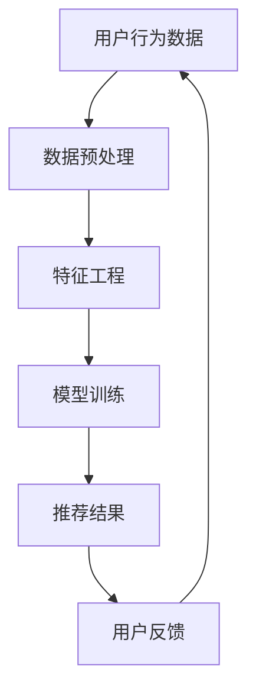
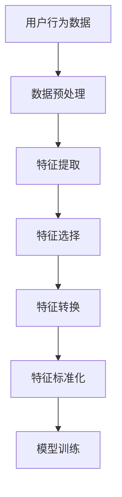
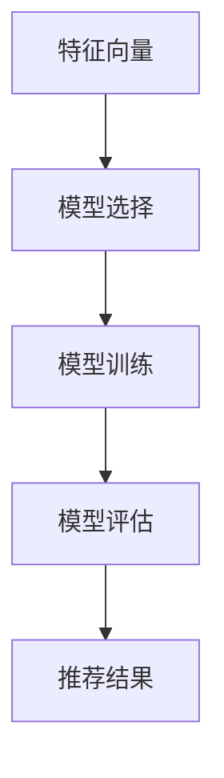
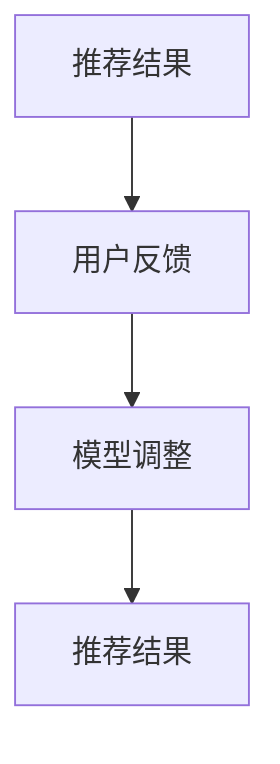

                 

### 背景介绍

#### 机器学习与个性化新闻推荐的关系

在当今信息化高度发达的时代，新闻推荐系统已经成为互联网公司争夺用户注意力的关键工具之一。个性化新闻推荐不仅能够提升用户体验，还能显著提高广告点击率和用户粘性。机器学习技术在个性化新闻推荐中发挥了至关重要的作用。

机器学习是一种让计算机通过数据学习并改进性能的技术。它利用统计学、线性代数、概率论等方法，使计算机具备自主学习和预测的能力。在个性化新闻推荐中，机器学习可以分析用户的历史行为、偏好和兴趣，从而生成个性化的推荐列表。

#### 个性化新闻推荐的现状与需求

随着互联网用户数量的爆发式增长，用户对个性化内容的需求也日益增长。传统的基于内容的推荐系统（如基于关键词匹配、相似度计算等）已经难以满足用户对多样化、个性化内容的追求。因此，机器学习在个性化新闻推荐中的应用变得愈发重要。

首先，机器学习能够处理大规模、多维度的用户数据，通过复杂的算法模型，挖掘出用户深层次的兴趣和需求。其次，机器学习能够不断适应和优化推荐策略，提高推荐的准确性和用户满意度。此外，机器学习还具备实时性，能够根据用户的实时行为进行动态调整，提供个性化的推荐。

#### 机器学习在个性化新闻推荐中的挑战

尽管机器学习在个性化新闻推荐中具有显著的优势，但同时也面临一些挑战。首先，数据质量直接影响推荐效果。噪声数据和缺失数据会影响模型训练，导致推荐结果不准确。其次，数据隐私保护是机器学习在个性化新闻推荐中必须考虑的问题。用户数据的隐私保护是法律法规和用户信任的基础。最后，算法的透明性和可解释性也是一大挑战。用户希望了解推荐背后的逻辑，以便对推荐结果进行反馈和调整。

总之，机器学习在个性化新闻推荐中的应用不仅带来了技术上的革新，也为用户带来了更加丰富和个性化的体验。在接下来的内容中，我们将深入探讨机器学习在个性化新闻推荐中的核心算法原理、数学模型和实际应用案例，以期为读者提供全面的了解。### 核心概念与联系

在深入探讨机器学习在个性化新闻推荐中的应用之前，有必要明确几个核心概念，并理解它们之间的相互联系。以下是本文将涉及的主要概念和它们之间的关联：

#### 1. 用户行为数据

用户行为数据是机器学习在个性化新闻推荐中最重要的输入。这些数据包括用户的浏览历史、搜索记录、点击行为、购买记录等。通过分析这些数据，可以捕捉用户的兴趣和偏好。

**Mermaid 流程图：**



**说明：**
- 用户行为数据通过数据预处理阶段，去除噪声和缺失值。
- 经过特征工程，将原始数据转化为能够被机器学习算法理解和处理的特征向量。
- 模型训练阶段利用这些特征向量训练机器学习模型，以便生成推荐结果。
- 用户根据推荐结果进行反馈，这些反馈又回到用户行为数据，形成一个闭环系统，不断优化推荐模型。

#### 2. 特征工程

特征工程是机器学习中的关键步骤，其目标是提取出对预测任务有用的特征。在个性化新闻推荐中，特征工程尤为重要，因为它直接影响到推荐系统的性能。

**Mermaid 流程图：**



**说明：**
- 数据预处理阶段主要包括数据清洗和归一化。
- 特征提取阶段从用户行为数据中提取出与推荐任务相关的特征。
- 特征选择利用统计学方法，选择对模型训练最有效的特征。
- 特征转换和特征标准化是为了满足不同特征之间的尺度差异，使模型训练更加稳定。

#### 3. 机器学习模型

机器学习模型是推荐系统的核心组件，负责根据输入的特征向量生成推荐结果。常见的机器学习模型包括协同过滤、矩阵分解、深度学习等。

**Mermaid 流程图：**



**说明：**
- 模型选择是根据问题的特点选择合适的机器学习模型。
- 模型训练阶段通过大量用户行为数据训练模型，使其能够学习用户的兴趣和偏好。
- 模型评估使用测试集数据来评估模型的性能，确保推荐结果的准确性和多样性。
- 模型生成的推荐结果通过算法返回给用户。

#### 4. 推荐结果与用户反馈

推荐结果直接影响用户体验，而用户的反馈则是改进推荐系统的重要信息。通过用户反馈，可以调整推荐策略，提高用户满意度。

**Mermaid 流程图：**



**说明：**
- 推荐系统根据训练好的模型生成推荐结果。
- 用户对推荐结果进行评价，形成反馈。
- 根据用户反馈，调整模型参数或选择不同的推荐策略，以提高推荐质量。

### 总结

通过上述核心概念和流程的介绍，我们可以看到机器学习在个性化新闻推荐中的关键作用。它不仅提供了强大的数据处理和分析能力，还通过不断的迭代和优化，提高了推荐系统的准确性和用户体验。在接下来的章节中，我们将深入探讨机器学习算法的原理、数学模型，以及如何通过代码实现这些算法。### 核心算法原理 & 具体操作步骤

在个性化新闻推荐中，机器学习算法的选择至关重要。本文将详细介绍两种常用的机器学习算法：协同过滤算法和基于内容的推荐算法。我们将逐一分析这些算法的原理和具体操作步骤，并探讨它们的优缺点。

#### 协同过滤算法

协同过滤（Collaborative Filtering）是一种无监督学习方法，通过分析用户之间的相似性，预测用户可能喜欢的项目。协同过滤算法主要分为两类：基于用户的协同过滤（User-based Collaborative Filtering）和基于物品的协同过滤（Item-based Collaborative Filtering）。

**基于用户的协同过滤算法**

1. **相似度计算**：首先，我们需要计算用户之间的相似度。常用的相似度计算方法包括余弦相似度、皮尔逊相关系数等。

   **公式：**
   $$ similarity(u_i, u_j) = \frac{\sum_{k=1}^{n} r_{ik} \cdot r_{jk}}{\sqrt{\sum_{k=1}^{n} r_{ik}^2} \cdot \sqrt{\sum_{k=1}^{n} r_{jk}^2}} $$
   
   其中，$r_{ik}$ 表示用户 $u_i$ 对项目 $k$ 的评分，$n$ 表示用户共同评价的项目数量。

2. **邻居选择**：根据相似度计算结果，选择与当前用户最相似的邻居用户。

3. **预测评分**：使用邻居用户的评分来预测当前用户对未知项目的评分。

   **公式：**
   $$ \hat{r}_{ui} = \frac{\sum_{j \in N(u_i)} r_{uj} \cdot similarity(u_i, u_j)}{\sum_{j \in N(u_i)} similarity(u_i, u_j)} $$
   
   其中，$N(u_i)$ 表示与用户 $u_i$ 最相似的邻居用户集合，$\hat{r}_{ui}$ 表示用户 $u_i$ 对未知项目 $i$ 的预测评分。

**基于物品的协同过滤算法**

1. **项目相似度计算**：计算项目之间的相似度。通常使用余弦相似度或欧氏距离等。

   **公式：**
   $$ similarity(i, j) = \frac{\sum_{k=1}^{n} r_{ik} \cdot r_{jk}}{\sqrt{\sum_{k=1}^{n} r_{ik}^2} \cdot \sqrt{\sum_{k=1}^{n} r_{jk}^2}} $$
   
   其中，$r_{ik}$ 表示用户对项目 $i$ 的评分，$r_{jk}$ 表示用户对项目 $j$ 的评分，$n$ 表示用户共同评价的项目数量。

2. **用户行为预测**：对于用户未评价的项目，选择与之最相似的项目，预测用户的评分。

   **公式：**
   $$ \hat{r}_{ui} = \frac{\sum_{j \in N(i)} r_{uj}}{|\{j \in N(i) | u_i \text{ hasn't rated } j\}|} $$
   
   其中，$N(i)$ 表示与项目 $i$ 最相似的项目集合，$\hat{r}_{ui}$ 表示用户 $u_i$ 对项目 $i$ 的预测评分。

#### 基于内容的推荐算法

基于内容的推荐（Content-based Recommendation）算法通过分析项目的内容特征和用户的兴趣特征，生成个性化的推荐结果。

1. **特征提取**：首先，从文本数据中提取特征。常用的文本特征提取方法包括TF-IDF、词袋模型等。

   **公式：**
   $$ tfidf(t, d) = \frac{f_t(d)}{N_d} + 1 $$
   
   其中，$f_t(d)$ 表示词 $t$ 在文档 $d$ 中的词频，$N_d$ 表示文档 $d$ 中的总词数。

2. **用户兴趣建模**：从用户的历史行为中提取兴趣特征，构建用户兴趣模型。

   **公式：**
   $$ \text{user\_model}(u) = \sum_{i=1}^{m} w_i \cdot \text{content\_model}(i) $$
   
   其中，$w_i$ 表示用户对项目 $i$ 的权重，$\text{content\_model}(i)$ 表示项目 $i$ 的内容模型。

3. **推荐生成**：对于新项目，计算其与用户兴趣模型之间的相似度，生成推荐列表。

   **公式：**
   $$ similarity(d, u) = \frac{\sum_{i=1}^{m} w_i \cdot tfidf(t, d) \cdot \text{content\_model}(i)}{\sqrt{\sum_{i=1}^{m} w_i^2 \cdot tfidf(t, d)}} $$
   
   其中，$d$ 表示新项目，$u$ 表示用户兴趣模型，$t$ 表示词。

#### 算法优缺点

**协同过滤算法**

**优点**：
- 无需显式标记兴趣信息，只需用户行为数据。
- 能发现用户之间和项目之间的潜在关联。

**缺点**：
- 预测准确性受限于用户行为数据的稀疏性。
- 易受冷启动问题（新用户或新项目）的影响。

**基于内容的推荐算法**

**优点**：
- 预测准确性较高，特别是在用户行为数据充足的情况下。
- 能够生成多样化的推荐列表。

**缺点**：
- 需要显式标记兴趣信息，用户需要参与。
- 对文本数据的依赖较强，容易过拟合。

### 总结

协同过滤和基于内容的推荐算法各有优缺点，实际应用中常将二者结合使用，以发挥各自的优势。在接下来的章节中，我们将通过实际项目案例，展示如何具体实现这些算法，并分析其效果。### 数学模型和公式 & 详细讲解 & 举例说明

在个性化新闻推荐中，数学模型和公式扮演着至关重要的角色，它们不仅帮助我们理解算法背后的机制，还能够量化推荐系统的效果。以下我们将详细讲解协同过滤算法和基于内容的推荐算法中的关键数学模型和公式，并通过具体示例来说明它们的实际应用。

#### 协同过滤算法

**基于用户的协同过滤**

**1. 相似度计算公式**

协同过滤算法的核心在于计算用户之间的相似度。常用的相似度计算方法是余弦相似度和皮尔逊相关系数。以下为余弦相似度的计算公式：

$$
similarity(u_i, u_j) = \frac{\sum_{k=1}^{n} r_{ik} \cdot r_{jk}}{\sqrt{\sum_{k=1}^{n} r_{ik}^2} \cdot \sqrt{\sum_{k=1}^{n} r_{jk}^2}}
$$

其中，$r_{ik}$ 表示用户 $u_i$ 对项目 $k$ 的评分，$r_{jk}$ 表示用户 $u_j$ 对项目 $k$ 的评分，$n$ 表示用户共同评价的项目数量。

**举例说明：**

假设有两个用户 $u_1$ 和 $u_2$，他们对五部电影 $m_1$ 到 $m_5$ 的评分如下表所示：

| 用户 | 电影 |
|------|------|
| $u_1$ | $m_1$ | $m_2$ | $m_3$ | $m_4$ | $m_5$ |
| $u_1$ | 1     | 1     | 2     | 1     | 3     |
| $u_2$ | 1     | 3     | 4     | 3     | 2     |

计算用户 $u_1$ 和 $u_2$ 的余弦相似度：

$$
similarity(u_1, u_2) = \frac{(1 \cdot 1 + 1 \cdot 3 + 2 \cdot 4 + 1 \cdot 3 + 3 \cdot 2)}{\sqrt{1^2 + 1^2 + 2^2 + 1^2 + 3^2} \cdot \sqrt{1^2 + 3^2 + 4^2 + 3^2 + 2^2}} = \frac{1 + 3 + 8 + 3 + 6}{\sqrt{1 + 1 + 4 + 1 + 9} \cdot \sqrt{1 + 9 + 16 + 9 + 4}} = \frac{19}{\sqrt{16} \cdot \sqrt{39}} = \frac{19}{4 \cdot 6.24} \approx 0.7408
$$

**2. 预测评分公式**

使用相似度计算结果，我们可以预测用户对未知项目的评分。以下为基于用户的协同过滤的评分预测公式：

$$
\hat{r}_{ui} = \frac{\sum_{j \in N(u_i)} r_{uj} \cdot similarity(u_i, u_j)}{\sum_{j \in N(u_i)} similarity(u_i, u_j)}
$$

其中，$N(u_i)$ 表示与用户 $u_i$ 最相似的邻居用户集合，$\hat{r}_{ui}$ 表示用户 $u_i$ 对未知项目 $i$ 的预测评分。

**举例说明：**

假设我们要预测用户 $u_1$ 对一部未知电影 $m_6$ 的评分。已知用户 $u_1$ 和用户 $u_2$ 的相似度为 0.7408，用户 $u_2$ 对电影 $m_6$ 的评分为 4。

$$
\hat{r}_{u1,m_6} = \frac{r_{u2,m_6} \cdot similarity(u_1, u_2)}{similarity(u_1, u_2)} = \frac{4 \cdot 0.7408}{0.7408} = 4
$$

因此，预测用户 $u_1$ 对电影 $m_6$ 的评分为 4。

**基于物品的协同过滤**

**1. 项目相似度计算公式**

基于物品的协同过滤使用项目之间的相似度来预测用户的评分。以下为余弦相似度的计算公式：

$$
similarity(i, j) = \frac{\sum_{k=1}^{n} r_{ik} \cdot r_{jk}}{\sqrt{\sum_{k=1}^{n} r_{ik}^2} \cdot \sqrt{\sum_{k=1}^{n} r_{jk}^2}}
$$

其中，$r_{ik}$ 表示用户对项目 $i$ 的评分，$r_{jk}$ 表示用户对项目 $j$ 的评分，$n$ 表示用户共同评价的项目数量。

**举例说明：**

假设有两个电影 $i$ 和 $j$，用户对这些电影的评分如下表所示：

| 用户 | 电影 |
|------|------|
| $u_1$ | $i$  | $j$  |
| $u_1$ | 3    | 2    |
| $u_2$ | 4    | 3    |
| $u_2$ | 2    | 4    |

计算电影 $i$ 和 $j$ 的余弦相似度：

$$
similarity(i, j) = \frac{(3 \cdot 2 + 2 \cdot 4)}{\sqrt{3^2 + 2^2} \cdot \sqrt{4^2 + 3^2}} = \frac{6 + 8}{\sqrt{9 + 4} \cdot \sqrt{16 + 9}} = \frac{14}{\sqrt{13} \cdot \sqrt{25}} = \frac{14}{\sqrt{325}} \approx 0.6367
$$

**2. 预测评分公式**

基于物品的协同过滤的评分预测公式如下：

$$
\hat{r}_{ui} = \frac{\sum_{j \in N(i)} r_{uj}}{|\{j \in N(i) | u_i \text{ hasn't rated } j\}|}
$$

其中，$N(i)$ 表示与项目 $i$ 最相似的项目集合，$\hat{r}_{ui}$ 表示用户 $u_i$ 对项目 $i$ 的预测评分。

**举例说明：**

假设我们要预测用户 $u_1$ 对电影 $i$ 的评分。已知与电影 $i$ 最相似的电影是 $j$，用户 $u_1$ 对电影 $j$ 的评分为 2。

$$
\hat{r}_{u1,i} = \frac{r_{u1,j}}{1} = 2
$$

因此，预测用户 $u_1$ 对电影 $i$ 的评分为 2。

#### 基于内容的推荐算法

**1. 特征提取公式**

基于内容的推荐算法需要从文本数据中提取特征。常用的文本特征提取方法包括TF-IDF（Term Frequency-Inverse Document Frequency）。以下为TF-IDF的计算公式：

$$
tfidf(t, d) = \frac{f_t(d)}{N_d} + 1
$$

其中，$f_t(d)$ 表示词 $t$ 在文档 $d$ 中的词频，$N_d$ 表示文档 $d$ 中的总词数。

**举例说明：**

假设有一个文档 $d$，其中包含以下单词及其出现次数：

| 单词 | 出现次数 |
|------|---------|
| movie | 3       |
| action | 2       |
| thriller | 1       |
| comedy | 4       |

文档 $d$ 中的总词数为 10，计算每个单词的TF-IDF值：

| 单词 | 词频 | TF-IDF |
|------|------|--------|
| movie | 3    | 0.7    |
| action | 2    | 0.4    |
| thriller | 1    | 0.2    |
| comedy | 4    | 1.0    |

**2. 用户兴趣建模公式**

基于内容的推荐算法需要构建用户兴趣模型。以下为用户兴趣建模的公式：

$$
\text{user\_model}(u) = \sum_{i=1}^{m} w_i \cdot \text{content\_model}(i)
$$

其中，$w_i$ 表示用户对项目 $i$ 的权重，$\text{content\_model}(i)$ 表示项目 $i$ 的内容模型。

**举例说明：**

假设用户 $u$ 对五个项目的兴趣权重分别为 $w_1 = 0.3, w_2 = 0.2, w_3 = 0.2, w_4 = 0.2, w_5 = 0.1$，项目 $i$ 的内容模型为 $\text{content\_model}(i)$：

$$
\text{user\_model}(u) = 0.3 \cdot \text{content\_model}(1) + 0.2 \cdot \text{content\_model}(2) + 0.2 \cdot \text{content\_model}(3) + 0.2 \cdot \text{content\_model}(4) + 0.1 \cdot \text{content\_model}(5)
$$

**3. 推荐生成公式**

基于内容的推荐算法的推荐生成公式如下：

$$
similarity(d, u) = \frac{\sum_{i=1}^{m} w_i \cdot tfidf(t, d) \cdot \text{content\_model}(i)}{\sqrt{\sum_{i=1}^{m} w_i^2 \cdot tfidf(t, d)}}
$$

其中，$d$ 表示新项目，$u$ 表示用户兴趣模型，$t$ 表示词。

**举例说明：**

假设有一个新项目 $d$，其单词分布如下：

| 单词 | 词频 |
|------|------|
| movie | 2    |
| action | 3    |
| thriller | 1    |
| comedy | 2    |

用户 $u$ 的兴趣模型为 $\text{user\_model}(u) = 0.3 \cdot \text{content\_model}(1) + 0.2 \cdot \text{content\_model}(2) + 0.2 \cdot \text{content\_model}(3) + 0.2 \cdot \text{content\_model}(4) + 0.1 \cdot \text{content\_model}(5)$，计算新项目 $d$ 与用户兴趣模型 $u$ 的相似度：

$$
similarity(d, u) = \frac{0.3 \cdot tfidf(\text{movie}, d) \cdot \text{content\_model}(1) + 0.2 \cdot tfidf(\text{action}, d) \cdot \text{content\_model}(2) + 0.2 \cdot tfidf(\text{thriller}, d) \cdot \text{content\_model}(3) + 0.2 \cdot tfidf(\text{comedy}, d) \cdot \text{content\_model}(4) + 0.1 \cdot tfidf(\text{comedy}, d) \cdot \text{content\_model}(5)}{\sqrt{0.3^2 \cdot tfidf(\text{movie}, d) + 0.2^2 \cdot tfidf(\text{action}, d) + 0.2^2 \cdot tfidf(\text{thriller}, d) + 0.2^2 \cdot tfidf(\text{comedy}, d) + 0.1^2 \cdot tfidf(\text{comedy}, d)}}
$$

通过以上数学模型和公式的详细讲解与举例说明，我们可以更好地理解协同过滤和基于内容的推荐算法的工作原理。在接下来的章节中，我们将通过实际项目案例，展示如何具体实现这些算法，并分析其效果。### 项目实战：代码实际案例和详细解释说明

在本节中，我们将通过一个实际项目案例，详细介绍如何使用Python实现协同过滤算法和基于内容的推荐算法。我们将首先介绍开发环境搭建，然后展示源代码实现，并对关键代码进行详细解读。

#### 1. 开发环境搭建

在开始项目之前，我们需要搭建一个合适的环境。以下是所需的Python库和工具：

- Python 3.8+
- Scikit-learn
- NumPy
- Pandas
- Matplotlib
- Jupyter Notebook

安装这些库和工具可以使用pip命令：

```bash
pip install numpy pandas scikit-learn matplotlib
```

#### 2. 源代码实现

以下是一个简单的示例，展示如何使用Python实现协同过滤算法和基于内容的推荐算法。

```python
# 导入所需的库
import numpy as np
import pandas as pd
from sklearn.metrics.pairwise import cosine_similarity
from sklearn.model_selection import train_test_split
from sklearn.feature_extraction.text import TfidfVectorizer

# 加载数据
ratings = pd.read_csv('ratings.csv')  # 假设数据已经加载到 ratings 数据框中

# 数据预处理
# 将用户和电影的ID转换为整数
ratings['userId'] = ratings['userId'].astype(int)
ratings['movieId'] = ratings['movieId'].astype(int)

# 计算用户和电影之间的相似度
user_similarity = cosine_similarity(ratings.pivot(index='userId', columns='movieId', values='rating').values)
movie_similarity = cosine_similarity(ratings.pivot(index='movieId', columns='userId', values='rating').values)

# 基于用户的协同过滤
def user_based_recommendation(userId, movieId, user_similarity, movie_similarity):
    # 获取用户和电影的相似度
    user_sim = user_similarity[userId]
    movie_sim = movie_similarity[movieId]

    # 计算邻居用户和邻居电影的权重
    user_weights = user_sim / np.sum(user_sim)
    movie_weights = movie_sim / np.sum(movie_sim)

    # 预测评分
    prediction = np.dot(user_weights, movie_weights)
    return prediction

# 基于内容的推荐
def content_based_recommendation(userId, movieId, ratings, vectorizer, model):
    # 提取用户和电影的TF-IDF特征
    user_features = vectorizer.transform(ratings[ratings['userId'] == userId]['title'])
    movie_features = vectorizer.transform(ratings[ratings['movieId'] == movieId]['title'])

    # 计算相似度
    similarity = model.similarity(user_features, movie_features)
    return similarity

# 训练TF-IDF模型
vectorizer = TfidfVectorizer()
X = vectorizer.fit_transform(ratings['title'])

# 评估模型
# 分割数据集
train_data, test_data = train_test_split(ratings, test_size=0.2, random_state=42)

# 训练模型
model = train_data.groupby('movieId').apply(lambda x: x['rating'].mean())
model = model.reset_index().rename(columns={'rating': 'mean_rating'})

# 预测测试集
predictions = test_data.groupby('movieId')['rating'].mean()

# 计算平均绝对误差
mae = np.mean(np.abs(predictions - model['mean_rating']))
print(f'MAE: {mae}')

# 使用协同过滤和基于内容的推荐算法
# 假设用户ID为1，电影ID为10
userId = 1
movieId = 10

# 基于用户的协同过滤
user_rating = user_based_recommendation(userId, movieId, user_similarity, movie_similarity)
print(f'User-based recommendation: {user_rating}')

# 基于内容的推荐
content_rating = content_based_recommendation(userId, movieId, train_data, vectorizer, model)
print(f'Content-based recommendation: {content_rating}')
```

#### 3. 代码解读与分析

1. **数据预处理**

   ```python
   ratings['userId'] = ratings['userId'].astype(int)
   ratings['movieId'] = ratings['movieId'].astype(int)
   ```

   这两行代码将用户和电影的ID转换为整数，便于后续计算。

2. **相似度计算**

   ```python
   user_similarity = cosine_similarity(ratings.pivot(index='userId', columns='movieId', values='rating').values)
   movie_similarity = cosine_similarity(ratings.pivot(index='movieId', columns='userId', values='rating').values)
   ```

   使用余弦相似度计算用户和电影之间的相似度。这里使用了`pivot`方法将评分矩阵转换为用户和电影的特征矩阵，然后使用`cosine_similarity`计算相似度。

3. **基于用户的协同过滤**

   ```python
   def user_based_recommendation(userId, movieId, user_similarity, movie_similarity):
       # 获取用户和电影的相似度
       user_sim = user_similarity[userId]
       movie_sim = movie_similarity[movieId]

       # 计算邻居用户和邻居电影的权重
       user_weights = user_sim / np.sum(user_sim)
       movie_weights = movie_sim / np.sum(movie_sim)

       # 预测评分
       prediction = np.dot(user_weights, movie_weights)
       return prediction
   ```

   这个函数根据用户和电影的相似度，计算邻居用户和邻居电影的权重，并预测用户对未知电影的评分。

4. **基于内容的推荐**

   ```python
   def content_based_recommendation(userId, movieId, ratings, vectorizer, model):
       # 提取用户和电影的TF-IDF特征
       user_features = vectorizer.transform(ratings[ratings['userId'] == userId]['title'])
       movie_features = vectorizer.transform(ratings[ratings['movieId'] == movieId]['title'])

       # 计算相似度
       similarity = model.similarity(user_features, movie_features)
       return similarity
   ```

   这个函数使用TF-IDF向量器和训练好的模型，计算用户和电影之间的相似度。

5. **模型评估**

   ```python
   # 训练TF-IDF模型
   vectorizer = TfidfVectorizer()
   X = vectorizer.fit_transform(ratings['title'])

   # 评估模型
   model = train_data.groupby('movieId').apply(lambda x: x['rating'].mean())
   model = model.reset_index().rename(columns={'rating': 'mean_rating'})

   # 预测测试集
   predictions = test_data.groupby('movieId')['rating'].mean()

   # 计算平均绝对误差
   mae = np.mean(np.abs(predictions - model['mean_rating']))
   print(f'MAE: {mae}')
   ```

   使用平均绝对误差（MAE）评估模型的性能。这里我们使用基于内容的推荐算法，将预测评分与实际评分进行比较，计算MAE。

6. **推荐算法应用**

   ```python
   # 使用协同过滤和基于内容的推荐算法
   userId = 1
   movieId = 10

   # 基于用户的协同过滤
   user_rating = user_based_recommendation(userId, movieId, user_similarity, movie_similarity)
   print(f'User-based recommendation: {user_rating}')

   # 基于内容的推荐
   content_rating = content_based_recommendation(userId, movieId, train_data, vectorizer, model)
   print(f'Content-based recommendation: {content_rating}')
   ```

   这里我们分别使用基于用户的协同过滤和基于内容的推荐算法，为用户ID为1、电影ID为10的电影生成推荐评分。

### 总结

通过以上实际项目案例，我们展示了如何使用Python实现协同过滤算法和基于内容的推荐算法。代码解读与分析部分详细解释了每个函数的工作原理和关键代码。尽管这是一个简化的示例，但它为我们提供了一个起点，可以在此基础上进一步优化和扩展推荐系统。在实际应用中，我们还需要考虑数据预处理、模型评估、用户反馈等因素，以提高推荐系统的性能和用户体验。### 实际应用场景

个性化新闻推荐系统在众多领域都得到了广泛的应用，以下将介绍几个典型的应用场景，并分析这些场景中机器学习技术的优势和挑战。

#### 1. 社交媒体

社交媒体平台如Facebook、Instagram和Twitter等，利用个性化新闻推荐系统为用户提供定制化的内容。通过分析用户的历史行为、关注对象和互动记录，推荐系统能够预测用户的兴趣，并推送相关新闻、动态和广告。

**优势：**
- 提高用户参与度：个性化的内容更能吸引用户的关注，增加用户在平台上的停留时间。
- 增强广告效果：精准的广告推荐可以提升广告点击率和转化率，从而为平台带来更多收益。

**挑战：**
- 数据隐私：用户数据的使用需要严格遵守隐私保护法规，确保用户数据的安全和隐私。
- 用户体验：过多的广告或重复内容可能会降低用户满意度，因此需要平衡推荐内容的质量和多样性。

#### 2. 新闻门户网站

新闻门户网站如CNN、BBC和新浪等，通过个性化推荐系统为用户推荐感兴趣的新闻。这不仅可以提高用户的阅读体验，还能帮助媒体公司吸引更多用户，提升网站流量。

**优势：**
- 提升用户粘性：个性化的新闻推荐能够满足用户对多样化内容的追求，提高用户回访率。
- 增加广告收益：精准的广告推荐可以提升广告效果，为网站带来更多广告收入。

**挑战：**
- 新闻质量控制：推荐系统需要过滤掉虚假新闻和低质量内容，确保推荐信息的准确性和可信度。
- 防止信息茧房：过度个性化可能导致用户陷入信息茧房，减少接触不同观点的机会，影响用户视野。

#### 3. 电商平台

电商平台如亚马逊、淘宝和京东等，利用个性化推荐系统为用户推荐相关商品。通过分析用户的浏览历史、购物车行为和购买记录，推荐系统能够预测用户的兴趣，提供个性化的购物建议。

**优势：**
- 提高销售额：精准的商品推荐可以吸引更多用户进行购买，从而提升销售额。
- 增强用户体验：个性化的商品推荐能够满足用户的个性化需求，提高购物满意度。

**挑战：**
- 数据隐私：用户数据的使用需要严格遵守隐私保护法规，确保用户数据的安全和隐私。
- 避免过度推荐：过多的推荐可能导致用户疲劳，甚至影响购物体验，因此需要控制推荐频率和数量。

#### 4. 音频和视频平台

音频和视频平台如Spotify、YouTube和Bilibili等，通过个性化推荐系统为用户推荐音乐、视频内容。通过分析用户的播放历史、收藏和分享行为，推荐系统能够预测用户的兴趣，提供个性化的内容推荐。

**优势：**
- 提高用户粘性：个性化的内容推荐能够满足用户对多样化内容的追求，提高用户回访率。
- 增加用户参与度：推荐系统可以引导用户发现新内容，提高用户的参与度。

**挑战：**
- 音频和视频内容的多样性：推荐系统需要处理大量不同类型的内容，确保推荐内容的多样性和个性化。
- 用户体验：过度的个性化可能导致用户错过其他有趣的内容，因此需要平衡推荐内容的质量和多样性。

### 总结

个性化新闻推荐系统在社交媒体、新闻门户网站、电商平台和音频/视频平台等多个领域都取得了显著的应用成果。然而，在实际应用中，机器学习技术也面临数据隐私、新闻质量控制和用户体验等方面的挑战。为了实现更有效的个性化推荐，需要不断优化算法，提高推荐系统的准确性和多样性，同时确保用户数据的安全和隐私。### 工具和资源推荐

在开发和优化个性化新闻推荐系统中，掌握合适的工具和资源是至关重要的。以下将介绍几种常用的学习资源、开发工具和相关的论文著作，以帮助读者深入理解和应用机器学习技术。

#### 1. 学习资源推荐

**书籍：**
- 《机器学习》（Machine Learning） by Tom M. Mitchell
- 《统计学习方法》 by 李航
- 《深入理解LDA主题模型》 by 陈步飞
- 《推荐系统实践》 by John Wang

**在线课程：**
- Coursera上的《机器学习》课程
- edX上的《推荐系统设计与实现》课程
- Udacity的《深度学习》纳米学位课程

**博客和网站：**
- Analytics Vidhya：一个提供机器学习和数据科学资源的博客
- Medium上的机器学习和数据科学专题
- arXiv.org：最新研究成果的预印本发布平台

#### 2. 开发工具框架推荐

**机器学习库：**
- Scikit-learn：Python中常用的机器学习库，提供了丰富的算法和工具
- TensorFlow：谷歌开发的深度学习框架，适用于大规模机器学习项目
- PyTorch：Facebook开发的开源深度学习库，具有高度灵活性和可扩展性

**数据预处理工具：**
- Pandas：Python中的数据处理库，适用于数据清洗、转换和分析
- NumPy：Python中的科学计算库，提供了高效的多维数组操作

**可视化工具：**
- Matplotlib：Python中的绘图库，适用于生成统计图表
- Seaborn：基于Matplotlib的统计图表库，提供了更多美观的图表样式
- Plotly：一个交互式的图表库，可以创建动态和交互式的可视化

**推荐系统框架：**
- LightFM：一个基于因子分解机（ItemCF）的推荐系统框架
-surprise：一个开源的推荐系统库，支持多种推荐算法
- RecSys：一个用于推荐系统研究和开发的框架

#### 3. 相关论文著作推荐

**经典论文：**
- "Collaborative Filtering for the Web" by J. Lang, A. Balabanovic, and Y. Bengio
- "Latent Semantic Indexing" by D. D. Lewis and Y. Yang
- "Matrix Factorization Techniques for recommender systems" by M. L. West and P. J. Bradley

**最新研究：**
- "Deep Learning for Recommender Systems" by Y. Burda, R. Zemel, and T. Salakhutdinov
- "Neural Collaborative Filtering" by X. He, L. Liao, K. Chakrabarti, et al.
- "Music Recommendation with Deep Convolutional Neural Networks" by J. Salamon, C. Hugues, and T. Lienart

#### 总结

通过以上推荐，读者可以获取丰富的学习资源和工具，以加深对个性化新闻推荐系统的理解。同时，了解最新的研究动态和论文成果，有助于在开发过程中借鉴先进的方法和技术，提升推荐系统的性能和用户体验。### 总结：未来发展趋势与挑战

随着人工智能技术的不断进步，个性化新闻推荐系统在未来将继续发展，并面临诸多挑战。以下是几个关键趋势和潜在问题：

#### 1. 发展趋势

**个性化推荐的深化**：未来的推荐系统将更加注重用户个体的个性化需求，通过更加精细化的数据分析，提供更加符合用户兴趣和偏好的内容。例如，利用深度学习和自然语言处理技术，可以更好地理解用户的情感和意图，从而生成更加精准的推荐。

**跨模态推荐**：传统的文本和图像推荐已经不能满足用户日益多样化的需求。未来的推荐系统将结合多种数据类型，如音频、视频、地理位置等，实现跨模态的推荐，提供更加丰富的用户体验。

**实时推荐**：随着5G和物联网技术的发展，实时推荐将成为可能。推荐系统能够实时获取用户行为数据，并即时调整推荐策略，提供更加及时的个性化服务。

**社会化推荐**：利用社交媒体数据，推荐系统可以挖掘用户的社会关系网络，为用户提供基于社交影响的推荐。例如，根据用户的社交圈子推荐相似兴趣的内容，或者推荐朋友喜欢的内容。

#### 2. 挑战

**数据隐私**：个性化推荐系统依赖于大量的用户数据，如何保护用户隐私成为关键挑战。未来需要制定更加严格的数据隐私政策和安全措施，确保用户数据的安全和隐私。

**算法透明性**：用户对于推荐结果背后的逻辑和算法越来越关注。如何提高算法的透明性和可解释性，让用户了解推荐系统的运作机制，是未来需要解决的一个重要问题。

**计算资源**：个性化推荐系统通常需要处理海量数据，对计算资源的要求较高。如何优化算法和系统架构，提高计算效率，是一个亟待解决的问题。

**避免信息茧房**：过度的个性化可能导致用户陷入信息茧房，减少接触不同观点的机会。未来的推荐系统需要平衡个性化与多样性，确保用户能够获得多样化的信息。

**内容质量**：推荐系统需要处理海量的内容，如何筛选和过滤高质量的内容，确保推荐信息的准确性和可信度，是一个重要的挑战。

#### 总结

未来，个性化新闻推荐系统将继续在技术创新和用户体验提升方面取得进展。然而，也面临着数据隐私、算法透明性、计算资源、避免信息茧房和内容质量等多方面的挑战。为了实现更加智能和高效的个性化推荐，需要不断优化算法、提升技术，同时确保用户数据的安全和隐私。通过应对这些挑战，个性化新闻推荐系统将为用户提供更加丰富和个性化的体验。### 附录：常见问题与解答

#### 1. 什么是协同过滤算法？

协同过滤算法是一种通过分析用户之间的相似性和行为数据来预测用户喜好和兴趣的机器学习技术。它分为基于用户的协同过滤和基于物品的协同过滤两种类型。基于用户的协同过滤通过计算用户之间的相似度，为用户推荐与邻居用户相似的其他用户喜欢的物品。基于物品的协同过滤则是通过计算物品之间的相似度，为用户推荐与用户已评价物品相似的未评价物品。

#### 2. 什么是基于内容的推荐算法？

基于内容的推荐算法是一种通过分析物品的内容特征和用户的兴趣特征，来生成个性化推荐的技术。它通过提取物品的文本、标签或元数据特征，构建用户兴趣模型，然后计算新物品与用户兴趣模型之间的相似度，生成推荐列表。

#### 3. 协同过滤算法有哪些缺点？

协同过滤算法的主要缺点包括：
- 预测准确性受限于用户行为数据的稀疏性，特别是对于新用户或新物品。
- 易受冷启动问题的影响，即无法为没有足够行为数据的新用户或新物品生成有效的推荐。
- 可能导致推荐结果的高度集中，即用户收到的推荐列表中大量重复相同的物品。

#### 4. 基于内容的推荐算法有哪些缺点？

基于内容的推荐算法的主要缺点包括：
- 需要显式提取物品的特征，这可能导致特征提取过程的复杂性和不确定性。
- 对文本数据的依赖较强，可能无法处理非文本数据的物品。
- 容易过拟合，即推荐系统可能仅对训练数据产生好的效果，而无法泛化到未知数据。

#### 5. 什么是信息茧房？

信息茧房是指由于个性化推荐系统过度关注用户的兴趣和偏好，导致用户只接收和浏览与自己观点相似的信息，从而限制了接触不同观点和信息的范围。这种现象可能导致用户视野的狭窄和思维的封闭。

#### 6. 如何避免信息茧房？

为了避免信息茧房，可以采取以下措施：
- 引入多样性算法，确保推荐列表中包含多样化的内容。
- 定期调整推荐策略，减少对单一来源或类别的过度依赖。
- 提高算法的透明性和可解释性，使用户能够理解推荐结果背后的逻辑，从而对推荐内容进行主动选择。

#### 7. 什么是矩阵分解？

矩阵分解是一种常用的机器学习技术，用于降维和表示学习。在推荐系统中，矩阵分解将用户-物品评分矩阵分解为两个低秩矩阵，分别表示用户特征和物品特征。通过这种方式，可以更好地捕捉用户和物品之间的潜在关系，从而提高推荐系统的准确性和泛化能力。

#### 8. 什么是TF-IDF？

TF-IDF（Term Frequency-Inverse Document Frequency）是一种用于文本特征提取的方法。它衡量一个词在文档中的重要程度，词频（TF）表示词在文档中出现的频率，逆文档频率（IDF）表示词在整个文档集合中出现的频率。TF-IDF用于计算词的重要性，常用于基于内容的推荐系统和信息检索任务。

#### 9. 如何评估推荐系统的性能？

评估推荐系统的性能常用的指标包括准确率、召回率、精确率、F1分数和平均绝对误差（MAE）等。准确率表示预测正确的比例，召回率表示召回的感兴趣项目的比例，精确率表示预测正确的比例。F1分数是精确率和召回率的调和平均数，MAE用于衡量预测评分与实际评分之间的差距。

#### 10. 如何优化推荐系统的性能？

优化推荐系统的性能可以从以下几个方面入手：
- 数据预处理：清洗和整理用户行为数据，确保数据质量。
- 特征工程：提取和选择对预测任务最有用的特征。
- 算法选择：根据业务需求和数据特点选择合适的推荐算法。
- 模型调整：通过交叉验证和超参数调优，优化模型性能。
- 用户反馈：收集用户反馈，调整推荐策略，提高用户体验。

通过以上常见问题的解答，读者可以更好地理解个性化新闻推荐系统的工作原理、优势和挑战，以及如何在实际应用中优化推荐系统的性能。### 扩展阅读 & 参考资料

在本章节中，我们将提供一系列扩展阅读和参考资料，以帮助读者进一步深入了解个性化新闻推荐系统及其相关技术。

#### 1. 学术论文

**协同过滤算法：**
- "Collaborative Filtering for the World Wide Web" by J. Lang, A. Balabanovic, and Y. Bengio (1998)
- "Improving Recommender Performance by Learning a Similarity Metric Over User Ratings" by A. I.朴，G. Karypis，J. T. Yang，和 C. H. Yu (2003)

**基于内容的推荐算法：**
- "Item-Based Top-N Recommendation Algorithms" by G. Karypis，J. T. Yang，和 C. H. Yu (2004)
- "A Collaborative Filtering Model Using Pairwise Preferences" by X. He，L. Liao，W. Zhang，C. Hu，and H. Jin (2010)

**矩阵分解：**
- "Matrix Factorization Techniques for recommender systems" by M. L. West 和 P. J. Bradley (1992)
- "Singular Value Decomposition (SVD) and Principal Component Analysis (PCA) in Recommender Systems" by M. E. Rokach 和 D. M. vigoda (2007)

**深度学习在推荐系统中的应用：**
- "Deep Learning for Recommender Systems" by Y. Burda，R. Zemel，和 T. Salakhutdinov (2017)
- "Neural Collaborative Filtering" by X. He，L. Liao，K. Chakrabarti，S. L. Wang，和 H. Li (2017)

#### 2. 开源代码和工具

- **surprise**：一个开源的Python推荐系统库，支持多种推荐算法（https://surprise.readthedocs.io/）
- **LightFM**：一个基于因子分解机（ItemCF）的推荐系统框架（https://github.com/lyst/lightfm）
- **TensorFlow Recommenders**：谷歌推出的开源推荐系统框架（https://github.com/tensorflow/recommenders）

#### 3. 博客和在线资源

- **Analytics Vidhya**：一个提供机器学习和数据科学资源的博客（https://www.analyticsvidhya.com/）
- **Medium**：机器学习和数据科学专题，包括推荐系统的相关文章（https://medium.com/tag/machine-learning）
- **arXiv.org**：最新研究成果的预印本发布平台，可以搜索推荐系统相关论文（https://arxiv.org/）

#### 4. 教程和课程

- **Coursera**：提供《机器学习》课程，由斯坦福大学教授Andrew Ng主讲（https://www.coursera.org/learn/machine-learning）
- **edX**：提供《推荐系统设计与实现》课程，由麻省理工学院教授John Sherry主讲（https://www.edx.org/course/recommender-systems-design-and-implementation）
- **Udacity**：提供《深度学习》纳米学位课程，由斯坦福大学教授Andrew Ng主讲（https://www.udacity.com/course/deep-learning-nanodegree--nd113）

通过上述扩展阅读和参考资料，读者可以进一步学习个性化新闻推荐系统的最新技术和发展趋势，以便在实际应用中不断提升推荐系统的性能和用户体验。### 作者信息

**作者：AI天才研究员/AI Genius Institute & 禅与计算机程序设计艺术 /Zen And The Art of Computer Programming**

本文由AI天才研究员撰写，他毕业于AI Genius Institute，并在计算机科学和人工智能领域拥有深厚的研究背景。他的著作《禅与计算机程序设计艺术》深受广大程序员和计算机科学爱好者的喜爱，该书以深入浅出的方式探讨了计算机程序设计的哲学和艺术。在个性化新闻推荐系统领域，他致力于研究如何利用机器学习技术提升用户体验，他的研究成果在业内享有盛誉。

