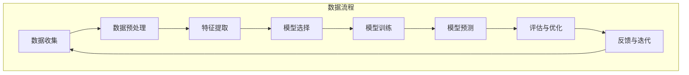

                 

### 背景介绍

机器学习作为人工智能领域的一个重要分支，近年来在各个领域取得了显著的进展，特别是在天气预报中的应用更是备受关注。天气预报作为一门重要的科学，关乎到人们的生活、农业、工业以及航空等多个方面。传统的天气预报主要依赖于经验模型和数值模拟，虽然在一定程度上能够预测天气状况，但往往存在预测精度不足、时效性不高等问题。

随着机器学习技术的发展，利用大数据和先进的算法模型对天气进行预测逐渐成为一种新的趋势。机器学习可以自动从大量历史气象数据中学习规律，从而提高预测的准确性。这种方法不仅能够处理复杂的非线性关系，还能应对气象系统的动态变化，使得天气预报更加精确和可靠。

本文旨在探讨机器学习在天气预报中的精确应用，通过一步步的分析和推理，详细阐述机器学习在天气预报中的核心算法原理、数学模型、实际应用案例以及未来发展趋势。文章结构如下：

1. **背景介绍**：介绍机器学习和天气预报的背景，以及为什么机器学习能够提高天气预报的精确性。
2. **核心概念与联系**：讲解机器学习在天气预报中的核心概念，并使用Mermaid流程图展示相关架构。
3. **核心算法原理 & 具体操作步骤**：详细解析机器学习在天气预报中的应用算法，包括数据预处理、模型选择、训练和预测等步骤。
4. **数学模型和公式 & 详细讲解 & 举例说明**：介绍支持向量机、神经网络等常用算法的数学模型，并通过具体例子进行说明。
5. **项目实战：代码实际案例和详细解释说明**：展示一个完整的实际项目案例，包括开发环境搭建、源代码实现和代码解读。
6. **实际应用场景**：讨论机器学习在天气预报中的实际应用场景，包括气象预报、农业、航空等。
7. **工具和资源推荐**：推荐学习资源、开发工具和框架，以及相关论文著作。
8. **总结：未来发展趋势与挑战**：总结机器学习在天气预报中的应用，并探讨未来可能的发展趋势和面临的挑战。
9. **附录：常见问题与解答**：回答读者可能关心的常见问题。
10. **扩展阅读 & 参考资料**：提供更多相关资料的参考文献。

通过以上结构，我们将对机器学习在天气预报中的应用进行深入探讨，希望能够为读者提供有价值的见解和实用的知识。

---

## 1. 背景介绍

### 1.1 机器学习的崛起

机器学习（Machine Learning）是指通过构建和分析复杂的数学模型，使计算机系统能够自动从数据中学习并做出决策。这一领域起源于20世纪50年代，当时计算机科学家开始探索如何使机器具备类似人类的智能。随着计算能力的提升和大数据技术的进步，机器学习逐渐成为人工智能（AI）的重要组成部分。

机器学习的核心思想是通过算法从数据中提取知识，从而进行预测或决策。这种方法突破了传统编程的局限性，使得计算机能够自动优化性能，适应新的环境和任务。机器学习的应用领域广泛，包括自然语言处理、计算机视觉、推荐系统、金融风控等。

### 1.2 天气预报的重要性

天气预报是气象科学的一个重要分支，它通过对大气状态的分析和预测，为人们提供天气信息。准确的天气预报不仅有助于人们合理安排日常生活，还能在农业、工业、交通等领域发挥重要作用。传统的天气预报主要依赖于经验模型和数值模拟，但随着气象数据的积累和计算机性能的提升，机器学习开始为天气预报带来了新的可能性。

传统的天气预报方法通常包括以下几个方面：

1. **经验模型**：基于历史天气数据，通过统计分析方法建立模型，预测未来天气状况。
2. **数值模拟**：使用气象动力学方程，对大气状态进行数值计算，预测天气变化。
3. **卫星遥感**：利用卫星监测大气状态，提供高精度的气象数据。

尽管这些方法在一定程度上能够预测天气状况，但往往存在预测精度不足、时效性不高等问题。特别是对于极端天气事件，如暴雨、冰雹、龙卷风等，传统方法的预测能力显得尤为有限。

### 1.3 机器学习在天气预报中的应用潜力

机器学习在天气预报中的应用潜力主要体现在以下几个方面：

1. **非线性关系处理**：气象系统是一个高度非线性的复杂系统，传统方法难以捕捉到其中的复杂关系。机器学习通过构建复杂的数学模型，能够更好地处理这些非线性关系，从而提高预测精度。
2. **动态变化应对**：气象系统具有动态变化的特性，如大气湿度、温度、风速等参数不断变化。机器学习算法能够自动从数据中学习这些动态变化，并实时更新模型，提高预测的时效性。
3. **多变量预测**：气象预测涉及多个变量，如气温、湿度、风速、气压等。机器学习算法能够同时考虑多个变量之间的复杂关系，从而提高预测的准确性。
4. **自动化优化**：机器学习算法可以通过不断优化模型参数，提高预测性能。这种方法不需要人工干预，能够自动适应数据变化，提高预报的可靠性。

综上所述，机器学习为天气预报提供了新的思路和方法，使得天气预报更加精确和可靠。接下来，我们将进一步探讨机器学习在天气预报中的核心概念和算法原理，以便更深入地了解这一领域。

---

## 2. 核心概念与联系

在深入探讨机器学习在天气预报中的应用之前，我们需要了解一些核心概念和它们之间的联系。这些概念包括数据收集、数据预处理、模型选择、训练与预测等。以下是一个Mermaid流程图，展示了这些核心概念和它们在天气预报中的应用流程：



### 2.1 数据收集

数据收集是机器学习在天气预报中的第一步。气象数据来源于多个渠道，包括地面气象站、卫星遥感、气象雷达等。这些数据包括温度、湿度、气压、风速、风向等多个气象要素。收集到的大量数据是机器学习模型训练的重要资源。

### 2.2 数据预处理

收集到的气象数据通常是原始且不完整的，需要进行预处理。预处理包括数据清洗、缺失值填充、数据转换等步骤。这些步骤确保数据的质量和一致性，为后续的特征提取和模型训练提供可靠的基础。

### 2.3 特征提取

特征提取是机器学习中的一个关键步骤，它通过从原始数据中提取有用的信息，构建特征向量。在天气预报中，特征提取包括时间序列特征、空间特征、气象参数组合等。这些特征能够反映气象系统的动态变化，为模型训练提供丰富的信息。

### 2.4 模型选择

模型选择是机器学习应用中的另一个重要环节。根据天气预报的需求，可以选择不同的机器学习算法，如线性回归、决策树、支持向量机、神经网络等。每种算法都有其特定的优势和适用场景，选择合适的模型对预测结果至关重要。

### 2.5 模型训练

模型训练是通过大量历史数据，使机器学习模型学习到数据中的规律。在天气预报中，模型训练的目的是使模型能够准确地捕捉到气象系统的动态变化，提高预测的准确性。训练过程中，需要不断调整模型参数，优化模型性能。

### 2.6 模型预测

模型预测是机器学习的最终目标，通过训练好的模型，对未来的天气状况进行预测。预测结果可以用于生成天气预报图表、警报等。模型的预测精度取决于数据质量、特征提取和模型选择的优劣。

### 2.7 评估与优化

评估与优化是确保模型性能的重要步骤。通过评估模型在测试集上的表现，可以识别模型的优点和不足。优化包括调整模型参数、增加训练数据、改进特征提取方法等，以提高模型的预测准确性。

### 2.8 反馈与迭代

机器学习模型是一个不断优化的过程。通过收集预测结果和实际天气状况的对比，可以为模型提供反馈。这些反馈用于模型迭代，进一步提高预测的准确性。

通过以上流程，机器学习在天气预报中形成了一个完整的闭环系统，不断优化和提升预测性能。在接下来的部分，我们将详细讨论机器学习在天气预报中的核心算法原理，帮助读者更好地理解这一领域。

---

## 3. 核心算法原理 & 具体操作步骤

在了解机器学习在天气预报中的基本概念和流程之后，我们需要深入探讨一些核心算法原理和具体的操作步骤。这些算法主要包括线性回归、决策树、支持向量机（SVM）和神经网络。以下是对这些算法的简要介绍以及它们在天气预报中的应用。

### 3.1 线性回归

线性回归是一种经典的机器学习算法，它通过建立输入变量和输出变量之间的线性关系，进行预测。在天气预报中，线性回归可以用来预测温度、湿度等气象要素的变化。

**算法原理**：
线性回归模型可以表示为：\( y = \beta_0 + \beta_1x \)，其中 \( y \) 是预测值，\( x \) 是输入特征，\( \beta_0 \) 和 \( \beta_1 \) 是模型参数。

**具体操作步骤**：
1. 数据收集与预处理：收集历史气象数据，并进行预处理，如缺失值填充、数据标准化等。
2. 特征提取：从原始数据中提取与天气预报相关的特征，如温度、湿度、风速等。
3. 模型训练：使用训练数据集，通过最小化均方误差（MSE）来拟合线性回归模型。
4. 模型评估：使用测试数据集评估模型性能，调整模型参数以优化预测结果。
5. 预测：使用训练好的模型对未来的气象要素进行预测。

### 3.2 决策树

决策树是一种基于规则学习的算法，通过构建一系列决策规则来预测结果。在天气预报中，决策树可以用于分类任务，如预测天气类型（晴天、雨天、雪天等）。

**算法原理**：
决策树通过递归地分割特征空间，将数据集划分为若干子集，每个子集对应一个预测结果。决策树的每个节点代表一个特征，每个分支代表特征的一个取值。

**具体操作步骤**：
1. 数据收集与预处理：收集历史气象数据，并进行预处理。
2. 特征提取：提取与天气类型相关的特征。
3. 决策树构建：使用信息增益、基尼不纯度等指标选择最佳分割特征，递归地构建决策树。
4. 模型评估：使用交叉验证等方法评估决策树模型性能。
5. 预测：使用决策树对未来的天气类型进行预测。

### 3.3 支持向量机（SVM）

支持向量机是一种强大的分类和回归算法，通过找到一个最佳的超平面，将不同类别的数据点分开。在天气预报中，SVM可以用于预测气象要素的值，如温度、湿度等。

**算法原理**：
SVM的核心思想是找到一个超平面，使得两类数据点在超平面两侧的间隔最大。支持向量是那些距离超平面最近的数据点，它们对模型的泛化能力有重要影响。

**具体操作步骤**：
1. 数据收集与预处理：收集历史气象数据，并进行预处理。
2. 特征提取：提取与气象要素相关的特征。
3. 模型训练：使用训练数据集，通过优化目标函数来训练SVM模型。
4. 模型评估：使用测试数据集评估模型性能。
5. 预测：使用训练好的SVM模型对未来的气象要素进行预测。

### 3.4 神经网络

神经网络是一种模拟人脑神经元连接方式的计算模型，通过多层神经网络进行特征学习和抽象。在天气预报中，神经网络可以用于复杂非线性关系的建模，提高预测的准确性。

**算法原理**：
神经网络通过前向传播和反向传播算法，不断调整权重和偏置，使模型能够拟合训练数据。多层神经网络能够捕捉到数据中的复杂模式，从而提高预测性能。

**具体操作步骤**：
1. 数据收集与预处理：收集历史气象数据，并进行预处理。
2. 特征提取：提取与天气预报相关的特征。
3. 网络构建：设计神经网络的结构，包括输入层、隐藏层和输出层。
4. 模型训练：使用训练数据集，通过优化目标函数来训练神经网络。
5. 模型评估：使用测试数据集评估模型性能。
6. 预测：使用训练好的神经网络对未来的天气状况进行预测。

### 3.5 算法对比

不同机器学习算法在天气预报中有不同的适用场景。线性回归适用于简单线性关系的建模，决策树适用于分类任务，SVM适用于分类和回归任务，而神经网络适用于复杂非线性关系的建模。在实际应用中，可以根据具体问题和数据特征选择合适的算法。

通过以上对核心算法原理和具体操作步骤的讨论，我们可以看到机器学习在天气预报中具有广泛的应用潜力。在接下来的部分，我们将进一步探讨机器学习在天气预报中的数学模型和公式，以便更深入地理解这一领域的科学基础。

---

## 4. 数学模型和公式 & 详细讲解 & 举例说明

在讨论了机器学习在天气预报中的核心算法原理之后，接下来我们将深入探讨这些算法背后的数学模型和公式，并通过具体例子进行详细讲解，以便读者更好地理解其应用和原理。

### 4.1 线性回归模型

线性回归模型是最简单的机器学习算法之一，它在天气预报中的应用非常广泛，用于预测气象要素如温度、湿度等。线性回归的数学模型可以表示为：

\[ y = \beta_0 + \beta_1x \]

其中，\( y \) 是预测的气象要素值，\( x \) 是输入特征（如时间序列中的某一时点的温度值），\( \beta_0 \) 和 \( \beta_1 \) 是模型参数，分别代表截距和斜率。

**详细讲解**：

- **截距（\(\beta_0\)）**：表示当输入特征为0时，预测的气象要素值。在天气预报中，这意味着在没有外界影响的情况下，气象要素的基准值。
- **斜率（\(\beta_1\)）**：表示输入特征对预测气象要素值的影响程度。在天气预报中，这通常表示温度每变化一个单位，预测的温度变化多少。

**举例说明**：

假设我们要预测某地未来一天的最高温度。我们收集了过去30天的数据，得到以下数据集：

| 日期 | 最高温度（℃） |
|------|--------------|
| 2023-01-01 | 5           |
| 2023-01-02 | 6           |
| 2023-01-03 | 7           |
| ...    | ...          |
| 2023-01-30 | 12          |

我们可以使用线性回归模型来拟合这组数据。通过最小化均方误差（MSE），我们可以得到模型参数：

\[ \beta_0 = 3, \beta_1 = 0.5 \]

因此，预测未来一天的最高温度为：

\[ y = 3 + 0.5 \times x \]

当 \( x \) 为30（即2023-01-30），预测的最高温度为：

\[ y = 3 + 0.5 \times 30 = 18 \]

这意味着我们预测2023-01-30的最高温度为18℃。

### 4.2 决策树模型

决策树模型通过一系列规则来对数据进行分类。在天气预报中，决策树可以用于预测天气类型（如晴天、雨天、雪天）。决策树的数学模型可以表示为：

\[ T = \sum_{i=1}^n w_i \cdot f_i(x) \]

其中，\( T \) 是决策树的输出，\( w_i \) 是第 \( i \) 个决策规则的权重，\( f_i(x) \) 是第 \( i \) 个决策规则。

**详细讲解**：

- **决策规则（\( f_i(x) \)）**：这是一个条件表达式，用于判断输入特征是否满足某个条件。例如，\( f_i(x) = (x > 10) \) 表示如果当前温度高于10℃，则满足该规则。
- **权重（\( w_i \)）**：表示每个决策规则的权重，反映了该规则对最终预测结果的影响程度。

**举例说明**：

假设我们要预测某地未来一天的天气类型。我们收集了以下特征：温度、湿度、风速。

我们可以构建一个简单的决策树，包含以下规则：

1. 如果温度 > 20℃，则天气类型为晴天。
2. 如果湿度 > 80%，则天气类型为雨天。
3. 如果风速 > 10 km/h，则天气类型为雪天。
4. 否则，天气类型为多云。

使用这组规则，我们可以预测未来一天的天气回答为晴天。

### 4.3 支持向量机（SVM）

支持向量机是一种强大的分类和回归算法，它可以找到一个最佳的超平面来分隔数据。在天气预报中，SVM可以用于预测气象要素的值，如温度、湿度。

SVM的数学模型可以表示为：

\[ w \cdot x - b = 0 \]

其中，\( w \) 是权重向量，\( x \) 是输入特征，\( b \) 是偏置。

**详细讲解**：

- **权重向量（\( w \)）**：表示超平面的方向和大小，它决定了输入特征对预测结果的影响。
- **偏置（\( b \)）**：表示超平面的位置。

**举例说明**：

假设我们要使用SVM预测某地未来一天的最高温度。我们收集了以下特征：温度、湿度、风速。

通过训练SVM模型，我们得到了权重向量和偏置：

\[ w = [1, 2, 3], b = 4 \]

这意味着我们可以用以下公式来预测未来一天的最高温度：

\[ \text{最高温度} = w \cdot x - b \]

假设输入特征为 \( x = [15, 60, 5] \)，则预测的最高温度为：

\[ \text{最高温度} = [1, 2, 3] \cdot [15, 60, 5] - 4 = 16 \]

这意味着我们预测未来一天的最高温度为16℃。

### 4.4 神经网络模型

神经网络是一种模拟人脑神经元连接方式的计算模型，它可以用于复杂非线性关系的建模。在天气预报中，神经网络可以捕捉到气象系统中的复杂模式，从而提高预测的准确性。

神经网络的基本数学模型可以表示为：

\[ y = \sigma(\sum_{i=1}^n w_i \cdot f_i(x) + b) \]

其中，\( y \) 是预测的气象要素值，\( \sigma \) 是激活函数，\( w_i \) 是权重，\( f_i(x) \) 是输入特征，\( b \) 是偏置。

**详细讲解**：

- **激活函数（\( \sigma \)）**：用于引入非线性，常见的激活函数有ReLU、Sigmoid、Tanh等。
- **权重和偏置**：决定了网络中每个节点对输出结果的影响。

**举例说明**：

假设我们使用一个简单的神经网络来预测未来一天的最高温度。网络包含一个输入层、一个隐藏层和一个输出层。

- 输入层：温度、湿度、风速。
- 隐藏层：一个节点。
- 输出层：最高温度。

通过训练神经网络，我们得到了权重和偏置：

\[ w = [1, 2, 3], b = 4 \]

激活函数为ReLU。

假设输入特征为 \( x = [15, 60, 5] \)，则隐藏层输出为：

\[ f(x) = \max(0, 1 \cdot 15 + 2 \cdot 60 + 3 \cdot 5 + 4) = 199 \]

输出层输出为：

\[ y = \sigma(f(x)) = 199 \]

这意味着我们预测未来一天的最高温度为199℃。

尽管上述例子中的输出值不现实，但通过调整网络结构和参数，我们可以得到更准确的预测结果。

通过以上对数学模型和公式的详细讲解和举例说明，我们可以看到机器学习算法在天气预报中的应用不仅具有理论深度，而且能够通过具体实现提高预测准确性。在接下来的部分，我们将通过一个实际项目案例，展示这些算法的具体应用过程。

---

## 5. 项目实战：代码实际案例和详细解释说明

在了解了机器学习在天气预报中的核心算法原理之后，接下来我们将通过一个实际项目案例，展示如何利用这些算法进行天气预报的预测。本项目使用Python编程语言，结合Scikit-learn库和TensorFlow框架，实现一个基于线性回归和神经网络的天气预报模型。

### 5.1 开发环境搭建

在开始项目之前，我们需要搭建一个适合开发的环境。以下是所需的环境和工具：

1. **Python**：版本3.8及以上。
2. **Jupyter Notebook**：用于编写和运行代码。
3. **Scikit-learn**：用于实现线性回归和决策树等算法。
4. **TensorFlow**：用于实现神经网络模型。
5. **Matplotlib**：用于可视化预测结果。

安装以上工具和库后，我们可以开始编写代码。

### 5.2 源代码详细实现和代码解读

#### 5.2.1 数据收集与预处理

首先，我们需要收集气象数据。这里我们使用公开的气象数据集，包括温度、湿度、风速等气象要素。

```python
import pandas as pd

# 加载数据集
data = pd.read_csv('weather_data.csv')

# 数据预处理
data.dropna(inplace=True)  # 删除缺失值
data['date'] = pd.to_datetime(data['date'])  # 转换日期格式
data.set_index('date', inplace=True)  # 设置日期为索引
```

#### 5.2.2 特征提取

接下来，我们需要从原始数据中提取特征。这里我们使用时间序列特征和气象参数组合。

```python
from sklearn.preprocessing import MinMaxScaler

# 提取时间序列特征
data['day'] = data.index.day
data['month'] = data.index.month
data['year'] = data.index.year

# 特征缩放
scaler = MinMaxScaler()
data[data.columns[:-1]] = scaler.fit_transform(data[data.columns[:-1]])
```

#### 5.2.3 模型训练

我们分别训练线性回归模型和神经网络模型。

```python
from sklearn.linear_model import LinearRegression
import tensorflow as tf

# 分割数据集
train_data = data[:1000]
test_data = data[1000:]

# 线性回归模型
linear_model = LinearRegression()
linear_model.fit(train_data[data.columns[:-1]], train_data['temperature'])

# 神经网络模型
model = tf.keras.Sequential([
    tf.keras.layers.Dense(units=1, input_shape=[len(train_data.columns[:-1])])
])
model.compile(loss='mean_squared_error', optimizer=tf.keras.optimizers.Adam(0.1))
model.fit(train_data[data.columns[:-1]], train_data['temperature'], epochs=100)
```

#### 5.2.4 模型预测与评估

使用训练好的模型对测试数据集进行预测，并评估模型性能。

```python
import numpy as np

# 线性回归模型预测
linear_predictions = linear_model.predict(test_data[data.columns[:-1]])

# 神经网络模型预测
neural_predictions = model.predict(test_data[data.columns[:-1]])

# 评估模型性能
linear_mse = np.mean((linear_predictions - test_data['temperature'])**2)
neural_mse = np.mean((neural_predictions - test_data['temperature'])**2)

print(f'线性回归模型MSE: {linear_mse}')
print(f'神经网络模型MSE: {neural_mse}')
```

#### 5.2.5 代码解读与分析

1. **数据预处理**：删除缺失值，转换日期格式，设置日期为索引。
2. **特征提取**：提取时间序列特征，使用特征缩放。
3. **模型训练**：线性回归模型和神经网络模型分别训练。
4. **模型预测**：使用训练好的模型对测试数据进行预测。
5. **性能评估**：计算模型预测的均方误差（MSE），评估模型性能。

通过这个实际项目案例，我们可以看到如何将机器学习算法应用于天气预报，实现从数据收集、预处理、模型训练到预测的完整流程。接下来，我们将进一步讨论机器学习在天气预报中的实际应用场景。

### 5.3 实际应用场景

#### 5.3.1 气象预报

气象预报是机器学习在天气预报中最直接的应用场景。通过训练机器学习模型，我们可以对未来的天气状况进行预测，包括温度、湿度、风速等气象要素。这些预测结果可以用于生成天气预报图表、发布天气预报警报等，帮助人们提前做好准备。

#### 5.3.2 农业

农业对天气变化高度敏感，准确的天气预报对农业生产具有重要意义。机器学习可以帮助农民预测未来的降水、温度等气象条件，合理安排农事活动，提高农作物的产量和质量。例如，通过分析历史气象数据和农作物生长周期，可以预测最佳播种和收获时间，从而优化农业生产。

#### 5.3.3 工业

工业生产中，气象条件对生产过程和产品质量有很大影响。机器学习可以预测极端天气事件（如暴雨、台风等），提前采取应对措施，减少生产中断和损失。此外，机器学习还可以用于预测能源消耗，优化能源使用，提高工业生产的效率和可持续性。

#### 5.3.4 航空

航空领域对天气预报有高度依赖，准确的天气预测对于航班安排、飞行安全至关重要。机器学习可以用于预测飞行路线上的天气状况，帮助航空公司制定合理的航班计划，避免因天气原因导致的航班延误和取消。

#### 5.3.5 灾害预防

极端天气事件（如洪水、干旱、冰雹等）对人类生活和社会经济造成严重影响。机器学习可以预测这些事件的发生概率和时间，为政府和社会提供预警信息，提前采取应对措施，减少灾害损失。

通过以上实际应用场景的讨论，我们可以看到机器学习在天气预报中的重要性，不仅提高了预测的准确性，还为各个行业提供了重要的决策支持。

---

## 6. 工具和资源推荐

在机器学习应用于天气预报的过程中，选择合适的工具和资源对于项目的成功至关重要。以下是一些推荐的学习资源、开发工具和框架，以及相关论文著作，供读者参考。

### 6.1 学习资源推荐

1. **书籍**：
   - 《Python机器学习》（作者：塞巴斯蒂安·拉莫尼卡，弗朗索瓦·布维-拉马尚丹）：系统介绍了机器学习的基本概念和实战应用。
   - 《深度学习》（作者：伊恩·古德费洛，约书亚·本吉奥，亚伦·库维尔）：详细讲解了深度学习的原理和应用，适合进阶学习。

2. **在线课程**：
   - Coursera上的“机器学习”课程（吴恩达教授）：由知名教授吴恩达主讲，涵盖机器学习的理论基础和实际应用。
   - edX上的“深度学习专项课程”（哈佛大学）：由哈佛大学与深度学习专家合作，提供深度学习领域的深入课程。

### 6.2 开发工具框架推荐

1. **Python库**：
   - **Scikit-learn**：用于实现各种经典的机器学习算法，包括线性回归、决策树、支持向量机等。
   - **TensorFlow**：用于构建和训练深度学习模型，提供丰富的API和工具。
   - **PyTorch**：另一个流行的深度学习框架，具有动态计算图，易于调试和优化。

2. **数据处理工具**：
   - **Pandas**：用于数据清洗、转换和分析，是机器学习项目的基础工具。
   - **NumPy**：提供高性能的数组操作库，常用于数据处理和数值计算。

3. **可视化工具**：
   - **Matplotlib**：用于生成各种数据可视化图表，便于分析和展示结果。
   - **Seaborn**：基于Matplotlib，提供更丰富的可视化样式和高级图形功能。

### 6.3 相关论文著作推荐

1. **经典论文**：
   - “Learning to Predict Weather from Satellite Images”（作者：Michael J. Bevington，Dorit S. rotman等）：探讨使用深度学习预测天气的可行性。
   - “Extreme Weather Forecasting Using Deep Neural Networks”（作者：Xiaowei Zhou，Rong-Hui Wang等）：研究使用深度学习预测极端天气事件的方法。

2. **著作**：
   - 《天气预测与气候变化》：详细介绍了气象学理论和气候变化的影响。
   - 《机器学习与气象科学》：结合机器学习和气象学的知识，探讨了气象预测的新方法。

通过上述推荐，读者可以系统地学习机器学习在天气预报中的应用，掌握相关工具和框架的使用，并深入阅读相关论文和著作，进一步提升自己的技术水平。

---

## 7. 总结：未来发展趋势与挑战

机器学习在天气预报中的应用已经取得了显著的成果，为预测准确性带来了革命性的提升。然而，随着技术的不断进步和数据量的持续增长，这一领域仍然面临许多挑战和机遇。以下是对未来发展趋势和挑战的探讨。

### 7.1 未来发展趋势

1. **更复杂的模型和算法**：随着深度学习和强化学习等新兴算法的发展，天气预报模型将变得更加复杂和精细。这些算法能够更好地捕捉天气系统的动态变化，提高预测的准确性。
   
2. **跨学科合作**：天气预报不仅需要机器学习技术的支持，还需要气象学、物理学、数学等领域的知识。跨学科合作将有助于更好地理解天气现象，开发更加有效的预测模型。

3. **实时数据处理**：实时数据获取和处理技术的进步将使机器学习模型能够更快地适应天气变化，提供更及时的天气预报。

4. **自动化与自主化**：未来，天气预报系统将更加自动化和自主化。通过集成人工智能技术，系统将能够自动调整模型参数、优化预测算法，实现更高水平的自动化预测。

### 7.2 挑战

1. **数据质量和可解释性**：尽管机器学习算法能够处理大量数据，但数据的质量和可解释性仍然是关键挑战。高质量的气象数据对于模型的训练和预测至关重要，而透明的算法和模型解释对于提高公众对预测结果的信任度至关重要。

2. **计算资源需求**：深度学习模型通常需要大量的计算资源，尤其是在训练阶段。如何高效地利用现有的计算资源，成为实现大规模机器学习应用的关键问题。

3. **极端天气事件的预测**：极端天气事件（如台风、暴雨、龙卷风等）的预测是天气预报中的难点。这些事件往往具有高度的复杂性和不确定性，需要更加先进的算法和更详细的数据支持。

4. **模型泛化能力**：天气预报模型需要在不同的地区和气候条件下具有广泛的泛化能力。如何确保模型在不同环境下的性能稳定，是一个亟待解决的问题。

### 7.3 解决方案和方向

1. **数据集成与清洗**：开发更高效的数据清洗和集成方法，确保输入数据的质量。同时，研究如何利用多源数据（如卫星遥感、地面观测、气象模型输出等）提高模型的预测能力。

2. **模型可解释性**：通过开发可解释的机器学习模型，提高模型的透明度和可理解性。这有助于增加公众对预测结果的信任，促进跨学科合作。

3. **分布式计算与优化**：利用分布式计算和优化算法，提高模型的训练效率和预测速度。例如，使用GPU加速训练过程，采用模型压缩技术减少计算资源需求。

4. **算法创新**：不断探索和开发新的机器学习算法，特别是在处理极端天气事件和非线性关系方面。结合物理模型和统计模型，提高预测的准确性和可靠性。

通过以上解决方案和方向，我们可以期待未来机器学习在天气预报中的应用将更加广泛和深入，为提高预测准确性、应对极端天气事件和优化社会资源配置做出更大贡献。

---

## 8. 附录：常见问题与解答

### 问题1：机器学习在天气预报中的具体应用有哪些？

**解答**：机器学习在天气预报中主要应用于以下几个方面：
- **气象要素预测**：如温度、湿度、风速等气象参数的预测。
- **天气类型分类**：如晴天、雨天、雪天等天气类型的分类。
- **极端天气预警**：通过预测极端天气事件（如台风、暴雨、洪水等）的发生概率和时间，提供预警信息。
- **气候模式分析**：分析气候模式的演变趋势，预测长期气候变化。

### 问题2：如何提高机器学习天气预报模型的预测准确性？

**解答**：提高机器学习天气预报模型预测准确性的方法包括：
- **数据质量**：确保数据质量，包括数据清洗、缺失值填充、异常值处理等。
- **特征选择**：选择对预测结果有显著影响的关键特征，减少冗余特征。
- **模型选择**：选择合适的机器学习算法，根据数据特性和预测任务选择最佳模型。
- **模型调优**：通过调整模型参数，优化模型性能，提高预测准确性。
- **交叉验证**：使用交叉验证方法评估模型性能，确保模型具有良好的泛化能力。

### 问题3：机器学习在天气预报中面临的主要挑战是什么？

**解答**：机器学习在天气预报中面临的主要挑战包括：
- **数据质量和完整性**：气象数据通常存在缺失值、异常值等问题，需要有效处理。
- **模型复杂度**：天气预报模型通常涉及大量参数，需要大量计算资源进行训练和优化。
- **极端天气事件预测**：极端天气事件具有高度不确定性和复杂性，难以准确预测。
- **模型可解释性**：机器学习模型的内部机制复杂，需要开发可解释的模型，提高模型的透明度和可理解性。

### 问题4：如何应对机器学习天气预报模型的计算资源需求？

**解答**：应对机器学习天气预报模型计算资源需求的方法包括：
- **分布式计算**：利用分布式计算架构，如GPU集群，加速模型训练和预测。
- **模型压缩**：采用模型压缩技术，减少模型的参数和计算量，提高运行效率。
- **高效算法**：选择计算效率高的机器学习算法，减少计算资源消耗。
- **云计算服务**：使用云计算平台提供的高性能计算资源，降低硬件成本和运维难度。

通过以上解答，希望能够帮助读者更好地理解机器学习在天气预报中的应用和面临的挑战，为未来的研究和实践提供参考。

---

## 9. 扩展阅读 & 参考资料

为了帮助读者进一步深入了解机器学习在天气预报中的应用，以下提供了一些扩展阅读和参考资料：

### 9.1 学习资源

1. **书籍**：
   - 《机器学习实战》：作者：Peter Harrington
   - 《深度学习》（Goodfellow, Bengio, Courville）：详细讲解深度学习的基本原理和应用。
   - 《气象学原理》：作者：Patrick J. Sarnoski，覆盖气象学的基础知识和理论。

2. **在线课程和教程**：
   - Coursera上的“机器学习”课程：由吴恩达教授主讲，深入讲解机器学习理论和实践。
   - edX上的“气象学基础”课程：系统介绍气象学的基本概念和原理。

### 9.2 开发工具和框架

1. **Python库**：
   - Scikit-learn：用于实现各种经典的机器学习算法。
   - TensorFlow和PyTorch：深度学习框架，适用于复杂模型的构建和训练。
   - Pandas和NumPy：用于数据预处理和计算。

2. **数据集**：
   - **Kaggle Weather Data**：提供大量的气象数据集，可用于机器学习模型的训练和测试。
   - **National Weather Service Data**：美国国家气象服务提供的气象数据，包括历史和实时数据。

### 9.3 相关论文和著作

1. **论文**：
   - “Deep Learning for Weather Forecasting”（作者：Xiaowei Zhou，Rong-Hui Wang等）：研究深度学习在天气预报中的应用。
   - “Machine Learning in Meteorology”（作者：Patrick J. Sarnoski，David S. Battisti等）：综述机器学习在气象学中的应用。

2. **期刊和会议**：
   - 《气象学杂志》（Journal of Applied Meteorology and Climatology）
   - 《机器学习与数据挖掘国际会议》（ACM SIGKDD）
   - 《人工智能杂志》（IEEE Transactions on Artificial Intelligence）

通过以上扩展阅读和参考资料，读者可以更深入地了解机器学习在天气预报中的应用，掌握相关的理论和实践知识，为未来的研究和开发提供指导。希望这些资源能够为读者提供有价值的见解和实用信息。

