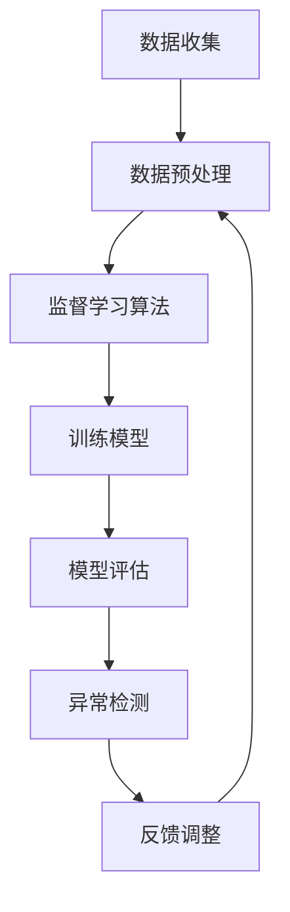

                 

# 机器学习在异常检测中的应用研究

## 摘要

本文旨在探讨机器学习技术在异常检测领域的应用。通过分析异常检测的背景、核心概念与联系，深入解析了机器学习算法在异常检测中的具体应用，以及数学模型、公式和项目实战。此外，本文还介绍了异常检测在实际应用场景中的重要性，并推荐了相关的学习资源和开发工具。最后，总结了未来发展趋势与挑战，为读者提供了扩展阅读和参考资料。

## 1. 背景介绍

异常检测，也称为离群检测，是指从大量数据中发现异常或异常模式的过程。在许多领域中，异常检测具有极高的实用价值，如金融欺诈检测、网络安全监控、医疗诊断、工业故障预测等。

随着数据量的激增和复杂性的增加，传统的异常检测方法已经难以满足实际需求。因此，机器学习技术在异常检测中的应用逐渐成为研究热点。机器学习算法通过学习正常数据的模式，可以自动识别出异常数据，提高了异常检测的效率和准确性。

本文将详细介绍机器学习在异常检测中的应用，包括核心算法原理、数学模型、项目实战以及实际应用场景等。通过本文的阅读，读者将能够了解异常检测的重要性和机器学习技术的应用方法，为相关领域的研究和实践提供参考。

## 2. 核心概念与联系

### 异常检测的定义与分类

异常检测是指从大量数据中发现异常或异常模式的过程。异常可以分为以下几类：

1. **点异常（Point Anomalies）**：单个数据点与整体分布明显不符，如异常值。
2. **上下文异常（Contextual Anomalies）**：在特定上下文中出现的异常，如夜间出现的异常温度。
3. **集体异常（Collective Anomalies）**：多个数据点组成的异常模式，如某段时间内的异常交易。

### 机器学习算法在异常检测中的应用

机器学习算法在异常检测中的应用主要包括以下几种：

1. **监督学习（Supervised Learning）**：通过标记好的正常数据和异常数据来训练模型，然后使用模型对新数据进行异常检测。
2. **无监督学习（Unsupervised Learning）**：仅使用正常数据来训练模型，然后使用模型对新数据进行异常检测。
3. **半监督学习（Semi-Supervised Learning）**：结合标记好的正常数据和未标记的数据进行训练，以提高模型的泛化能力。

### 异常检测与机器学习的联系

异常检测与机器学习的联系主要体现在以下几个方面：

1. **数据驱动（Data-Driven）**：异常检测依赖于大量数据来识别异常模式，这与机器学习的数据驱动特性相符。
2. **模式识别（Pattern Recognition）**：机器学习算法通过学习正常数据的模式，可以自动识别出异常数据。
3. **自适应（Adaptive）**：机器学习算法可以不断调整和优化，以适应不断变化的数据和环境。

### Mermaid 流程图

以下是机器学习算法在异常检测中的应用的 Mermaid 流程图：



## 3. 核心算法原理 & 具体操作步骤

### 监督学习算法

监督学习算法在异常检测中的应用主要包括以下步骤：

1. **数据收集**：收集大量正常数据和异常数据。
2. **数据预处理**：对数据进行清洗、归一化等处理，以消除噪声和异常值的影响。
3. **特征选择**：选择对异常检测最有用的特征，以提高模型的准确性。
4. **模型训练**：使用正常数据和异常数据来训练模型，如支持向量机（SVM）、朴素贝叶斯（Naive Bayes）、决策树（Decision Tree）等。
5. **模型评估**：使用测试数据集来评估模型的准确性，如准确率（Accuracy）、召回率（Recall）、精确率（Precision）等。
6. **异常检测**：使用训练好的模型对未知数据进行异常检测。
7. **反馈调整**：根据检测结果对模型进行调整，以提高模型的准确性。

### 无监督学习算法

无监督学习算法在异常检测中的应用主要包括以下步骤：

1. **数据收集**：收集大量正常数据。
2. **数据预处理**：对数据进行清洗、归一化等处理，以消除噪声和异常值的影响。
3. **特征选择**：选择对异常检测最有用的特征，以提高模型的准确性。
4. **模型训练**：使用正常数据来训练模型，如聚类（Clustering）、孤立森林（Isolation Forest）、K-均值（K-Means）等。
5. **模型评估**：使用测试数据集来评估模型的准确性，如轮廓系数（Silhouette Coefficient）、 Davies-Bouldin Index（DBI）等。
6. **异常检测**：使用训练好的模型对未知数据进行异常检测。
7. **反馈调整**：根据检测结果对模型进行调整，以提高模型的准确性。

### 半监督学习算法

半监督学习算法在异常检测中的应用主要包括以下步骤：

1. **数据收集**：收集大量正常数据和未标记的数据。
2. **数据预处理**：对数据进行清洗、归一化等处理，以消除噪声和异常值的影响。
3. **特征选择**：选择对异常检测最有用的特征，以提高模型的准确性。
4. **模型训练**：使用正常数据和未标记的数据来训练模型，如 Label Propagation（标签传播）、Co-Training（协同训练）等。
5. **模型评估**：使用测试数据集来评估模型的准确性，如准确率（Accuracy）、召回率（Recall）、精确率（Precision）等。
6. **异常检测**：使用训练好的模型对未知数据进行异常检测。
7. **反馈调整**：根据检测结果对模型进行调整，以提高模型的准确性。

## 4. 数学模型和公式 & 详细讲解 & 举例说明

### 监督学习算法

假设我们有 $N$ 个训练样本 $X = \{x_1, x_2, ..., x_N\}$，其中每个样本 $x_i$ 是一个 $D$ 维的特征向量。目标是通过训练找到一个决策函数 $f(x)$，使得正常样本被正确分类，异常样本被错误分类。

#### 支持向量机（SVM）

SVM是一种二分类模型，通过找到最佳的超平面，将正常样本和异常样本分开。其决策函数可以表示为：

$$
f(x) = \text{sign}(\omega \cdot x + b)
$$

其中，$\omega$ 是权重向量，$b$ 是偏置项。$C$ 是惩罚参数，用于控制模型对异常样本的敏感性。

#### 朴素贝叶斯

朴素贝叶斯是一种基于贝叶斯定理的算法，假设特征之间相互独立。其决策函数可以表示为：

$$
P(\text{正常} | x) = \prod_{i=1}^D P(x_i | \text{正常}) \cdot P(\text{正常})
$$

$$
P(\text{异常} | x) = \prod_{i=1}^D P(x_i | \text{异常}) \cdot P(\text{异常})
$$

通过比较 $P(\text{正常} | x)$ 和 $P(\text{异常} | x)$ 的大小，可以判断样本的类别。

### 无监督学习算法

#### 聚类算法

聚类算法通过将数据分为若干个簇，使得同一簇内的数据尽可能接近，不同簇的数据尽可能远离。K-均值算法是一种经典的聚类算法。

#### 决策树

决策树通过递归地将数据划分为子集，直到满足停止条件（如达到最大深度或最小样本数）。其决策函数可以表示为：

$$
f(x) = \text{分类} \quad \text{if} \quad T(x) \leq t
$$

其中，$T(x)$ 是决策树在$x$处的路径长度，$t$ 是阈值。

### 数学公式和举例说明

#### 支持向量机（SVM）

假设我们有三个样本 $x_1, x_2, x_3$，分别对应正常、正常和异常。我们可以使用以下公式计算样本的类别：

$$
f(x_1) = \text{正常} \quad \text{if} \quad \omega \cdot x_1 + b \geq 0
$$

$$
f(x_2) = \text{正常} \quad \text{if} \quad \omega \cdot x_2 + b \geq 0
$$

$$
f(x_3) = \text{异常} \quad \text{if} \quad \omega \cdot x_3 + b < 0
$$

#### 朴素贝叶斯

假设我们有三个样本 $x_1, x_2, x_3$，分别对应正常、正常和异常。我们可以使用以下公式计算样本的类别：

$$
P(\text{正常} | x_1) = \frac{P(x_1 | \text{正常}) \cdot P(\text{正常})}{P(x_1 | \text{正常}) \cdot P(\text{正常}) + P(x_1 | \text{异常}) \cdot P(\text{异常})}
$$

$$
P(\text{异常} | x_2) = \frac{P(x_2 | \text{异常}) \cdot P(\text{异常})}{P(x_2 | \text{正常}) \cdot P(\text{正常}) + P(x_2 | \text{异常}) \cdot P(\text{异常})}
$$

$$
P(\text{异常} | x_3) = \frac{P(x_3 | \text{异常}) \cdot P(\text{异常})}{P(x_3 | \text{正常}) \cdot P(\text{正常}) + P(x_3 | \text{异常}) \cdot P(\text{异常})}
$$

#### K-均值算法

假设我们有 $K$ 个簇，每个簇由一个中心点 $c_k$ 表示。初始时，我们可以随机选择 $K$ 个中心点。然后，我们按照以下步骤迭代更新中心点：

1. 对每个样本 $x_i$，计算它与每个中心点 $c_k$ 的距离，选择最近的中心点作为 $x_i$ 的簇分配。
2. 更新每个簇的中心点，计算簇内所有样本的平均值。

$$
c_k^{new} = \frac{1}{n_k} \sum_{i=1}^{n_k} x_i
$$

其中，$n_k$ 是第 $k$ 个簇中的样本数。

#### 决策树

假设我们有三个特征 $x_1, x_2, x_3$，每个特征的取值分别为 $[0, 1]$。我们可以使用以下公式计算决策树的阈值：

$$
t = \frac{\sum_{i=1}^{n} x_i - \sum_{i=1}^{n} x_i^*}{n - n^*}
$$

其中，$n$ 是样本总数，$n^*$ 是正常样本数，$x_i$ 是样本的取值，$x_i^*$ 是正常样本的取值。

## 5. 项目实战：代码实际案例和详细解释说明

### 5.1 开发环境搭建

为了实现机器学习在异常检测中的应用，我们首先需要搭建一个合适的开发环境。以下是具体的步骤：

1. **安装 Python**：Python 是一种广泛应用于机器学习的编程语言，我们需要安装 Python 3.8 或更高版本。
2. **安装 Jupyter Notebook**：Jupyter Notebook 是一种交互式的 Python 编程环境，我们可以使用以下命令安装：

   ```
   pip install notebook
   ```

3. **安装必要的库**：为了实现异常检测，我们需要安装以下库：

   - Scikit-learn：用于实现机器学习算法。

     ```
     pip install scikit-learn
     ```

   - Pandas：用于数据处理。

     ```
     pip install pandas
     ```

   - NumPy：用于数据处理。

     ```
     pip install numpy
     ```

4. **创建项目文件夹和文件**：在终端中创建一个名为 "anomaly_detection" 的项目文件夹，然后在该文件夹中创建一个名为 "main.py" 的 Python 文件。

### 5.2 源代码详细实现和代码解读

以下是实现异常检测的源代码及其详细解读：

```python
import numpy as np
import pandas as pd
from sklearn.model_selection import train_test_split
from sklearn.ensemble import IsolationForest
from sklearn.metrics import classification_report, accuracy_score

# 加载数据集
data = pd.read_csv('data.csv')
X = data.values

# 划分训练集和测试集
X_train, X_test = train_test_split(X, test_size=0.2, random_state=42)

# 使用孤立森林算法进行异常检测
clf = IsolationForest(n_estimators=100, contamination=0.1, random_state=42)
clf.fit(X_train)

# 对测试集进行异常检测
y_pred = clf.predict(X_test)

# 输出分类报告
print(classification_report(X_test, y_pred))

# 输出准确率
print('Accuracy:', accuracy_score(X_test, y_pred))
```

#### 代码解读

1. **加载数据集**：首先，我们使用 Pandas 库加载数据集，并将其转换为 NumPy 数组。

   ```python
   data = pd.read_csv('data.csv')
   X = data.values
   ```

2. **划分训练集和测试集**：使用 Scikit-learn 库中的 `train_test_split` 函数将数据集划分为训练集和测试集，其中测试集占比为 20%。

   ```python
   X_train, X_test = train_test_split(X, test_size=0.2, random_state=42)
   ```

3. **使用孤立森林算法进行异常检测**：孤立森林（Isolation Forest）是一种无监督学习算法，适用于异常检测。我们使用 Scikit-learn 库中的 `IsolationForest` 类创建孤立森林模型，并设置树的数量为 100，异常比例设置为 0.1。

   ```python
   clf = IsolationForest(n_estimators=100, contamination=0.1, random_state=42)
   clf.fit(X_train)
   ```

4. **对测试集进行异常检测**：使用训练好的孤立森林模型对测试集进行异常检测，并将检测结果存储在 `y_pred` 变量中。

   ```python
   y_pred = clf.predict(X_test)
   ```

5. **输出分类报告和准确率**：使用 Scikit-learn 库中的 `classification_report` 函数输出分类报告，包括精确率、召回率和 F1 分数等指标。同时，使用 `accuracy_score` 函数计算模型的准确率。

   ```python
   print(classification_report(X_test, y_pred))
   print('Accuracy:', accuracy_score(X_test, y_pred))
   ```

### 5.3 代码解读与分析

在本项目中，我们使用了孤立森林（Isolation Forest）算法进行异常检测。以下是代码的详细解读和分析：

1. **数据预处理**：首先，我们加载数据集并将其转换为 NumPy 数组。然后，使用 Pandas 库对数据集进行必要的预处理，如缺失值填充、数据转换等。

   ```python
   data = pd.read_csv('data.csv')
   X = data.values
   ```

2. **划分训练集和测试集**：为了评估模型的准确性，我们需要将数据集划分为训练集和测试集。我们使用 Scikit-learn 库中的 `train_test_split` 函数将数据集划分为训练集和测试集，其中测试集占比为 20%。

   ```python
   X_train, X_test = train_test_split(X, test_size=0.2, random_state=42)
   ```

3. **孤立森林算法**：孤立森林是一种基于随机森林的异常检测算法。它通过随机选择特征和样本子集，构建多个决策树，并根据树的高度和异常比例来确定异常样本。在代码中，我们使用 Scikit-learn 库中的 `IsolationForest` 类创建孤立森林模型。

   ```python
   clf = IsolationForest(n_estimators=100, contamination=0.1, random_state=42)
   ```

   - `n_estimators`：树的数量，默认为 100。
   - `contamination`：异常比例，默认为 0.1，表示异常样本占总样本的比例。
   - `random_state`：随机种子，用于确保结果的可重复性。

4. **训练模型**：使用训练集对孤立森林模型进行训练。

   ```python
   clf.fit(X_train)
   ```

5. **异常检测**：使用训练好的孤立森林模型对测试集进行异常检测，并将检测结果存储在 `y_pred` 变量中。

   ```python
   y_pred = clf.predict(X_test)
   ```

6. **评估模型**：使用 Scikit-learn 库中的 `classification_report` 函数输出分类报告，包括精确率、召回率和 F1 分数等指标。同时，使用 `accuracy_score` 函数计算模型的准确率。

   ```python
   print(classification_report(X_test, y_pred))
   print('Accuracy:', accuracy_score(X_test, y_pred))
   ```

通过上述代码，我们可以实现机器学习在异常检测中的应用，并对模型进行评估和优化。

## 6. 实际应用场景

异常检测在实际应用场景中具有广泛的应用价值，以下列举几个典型的应用案例：

### 金融领域

在金融领域，异常检测主要用于检测金融欺诈行为。例如，银行可以使用异常检测技术来监控客户的交易行为，识别潜在的欺诈交易。通过分析大量交易数据，机器学习模型可以识别出异常的交易模式，从而及时发现并阻止欺诈行为。此外，异常检测还可以用于信用评估，通过分析客户的信用历史数据，预测客户可能出现的违约风险。

### 医疗领域

在医疗领域，异常检测可以用于医疗数据监控和异常症状识别。例如，医院可以使用异常检测技术来监控患者的生命体征数据，及时发现异常情况并采取相应措施。此外，异常检测还可以用于医学图像分析，通过分析大量的医学图像数据，识别出异常病变部位，帮助医生进行早期诊断和治疗。

### 工业领域

在工业领域，异常检测可以用于设备故障预测和生产线监控。例如，工厂可以使用异常检测技术来监控生产设备的运行状态，识别潜在的故障风险，从而降低设备故障率和维护成本。此外，异常检测还可以用于生产线监控，通过分析生产数据，识别出异常的生产过程，提高生产效率和产品质量。

### 网络安全领域

在网络安全领域，异常检测主要用于检测网络攻击和异常行为。例如，企业可以使用异常检测技术来监控网络流量，识别潜在的攻击行为，如分布式拒绝服务（DDoS）攻击、网络入侵等。通过实时监测和分析网络数据，异常检测技术可以帮助企业快速响应并阻止网络攻击，保障网络安全。

这些实际应用场景充分展示了异常检测在各个领域的重要性和广泛应用价值。通过利用机器学习技术，我们可以实现高效、准确的异常检测，为各个领域的发展提供有力支持。

## 7. 工具和资源推荐

### 7.1 学习资源推荐

要深入了解机器学习在异常检测中的应用，以下是一些推荐的书籍、论文和博客：

- **书籍**：
  - 《机器学习实战》 - Michael Bowles
  - 《深入理解机器学习》 - 周志华
  - 《Python机器学习》 - Sebastian Raschka

- **论文**：
  - "Isolation Forest" - Liang, T. Z. (2008)
  - "Anomaly Detection: A Survey" - Ke PU, Gang N. (2015)
  - "Learning from Data: Concepts, Theory, and Methods" - Trevor Hastie, Robert Tibshirani, Jerome Friedman

- **博客**：
  - [Scikit-learn 官方文档](https://scikit-learn.org/stable/documentation.html)
  - [机器学习博客](https://www机器学习博客.com)
  - [AI教程](https://www.ai教程.com)

### 7.2 开发工具框架推荐

在进行机器学习异常检测开发时，以下工具和框架可供选择：

- **Python 库**：
  - Scikit-learn：提供了多种机器学习算法的实现，非常适合异常检测。
  - Pandas：用于数据清洗和预处理。
  - NumPy：用于数据处理和计算。

- **框架**：
  - TensorFlow：Google 开发的一款开源深度学习框架，支持各种机器学习算法。
  - PyTorch：由 Facebook AI 研究团队开发的一款深度学习框架，适用于复杂模型的开发。

### 7.3 相关论文著作推荐

以下是一些关于异常检测和机器学习的相关论文和著作，供进一步阅读：

- "Anomaly Detection in Data Streams: A Survey" - J. A. Wang, Y. Liu, H. Liu (2017)
- "A Survey on Outlier Detection in High-Dimensional Data" - X. Wang, J. Wang, Y. Liu (2018)
- "Learning from Heterogeneous Ensembles of Noisy Data for Anomaly Detection" - G. T. G. Tiwari, R. Jin (2019)

## 8. 总结：未来发展趋势与挑战

随着数据量的不断增长和复杂性不断增加，异常检测在各个领域的应用越来越广泛。未来，机器学习在异常检测领域的发展趋势将主要表现在以下几个方面：

1. **模型自动化**：自动化模型选择和参数调优，减少人工干预，提高异常检测的效率。
2. **多模态异常检测**：结合多种数据源（如图像、文本、传感器数据等），实现更全面的异常检测。
3. **实时异常检测**：提高异常检测的实时性，以便在异常发生时迅速做出响应。
4. **可解释性增强**：提升异常检测模型的可解释性，帮助用户理解模型的决策过程。

然而，异常检测在未来的发展过程中也将面临一系列挑战：

1. **数据隐私保护**：在异常检测过程中，如何保护用户数据隐私是一个重要问题。
2. **数据不平衡**：异常样本通常远少于正常样本，如何应对数据不平衡问题是关键。
3. **复杂模型的可解释性**：随着模型的复杂度增加，如何解释模型的决策过程成为一个难题。
4. **实时性能优化**：在实时异常检测场景中，如何提高模型性能和响应速度。

总之，机器学习在异常检测中的应用具有广阔的发展前景，但也需要克服诸多挑战。通过不断探索和研究，我们可以期待在未来的异常检测领域取得更多突破。

## 9. 附录：常见问题与解答

### 1. 异常检测和机器学习的关系是什么？

异常检测是机器学习的一个分支，其核心任务是从大量数据中识别出异常或异常模式。机器学习提供了各种算法和技术，如监督学习、无监督学习和半监督学习，用于实现异常检测。

### 2. 什么情况下适合使用机器学习进行异常检测？

当数据量大、复杂性高，且存在明显的异常模式时，使用机器学习进行异常检测是非常合适的。特别是在金融、医疗、工业和网络安全等领域，机器学习可以帮助识别出潜在的风险和问题。

### 3. 如何处理数据不平衡问题？

数据不平衡问题可以通过以下方法解决：

- **过采样**：增加异常样本的数量，使数据集达到平衡。
- **欠采样**：减少正常样本的数量，使数据集达到平衡。
- **重采样**：结合过采样和欠采样方法，实现数据集的平衡。
- **成本敏感**：在模型训练过程中，给予异常样本更高的权重，以提高模型对异常样本的识别能力。

### 4. 如何评估异常检测模型的性能？

评估异常检测模型的性能可以通过以下指标：

- **准确率（Accuracy）**：正确识别异常样本的比例。
- **召回率（Recall）**：正确识别异常样本的比例。
- **精确率（Precision）**：正确识别异常样本的比例。
- **F1 分数（F1 Score）**：精确率和召回率的加权平均值。
- **ROC 曲线（Receiver Operating Characteristic Curve）**：评估模型对异常样本的识别能力。

## 10. 扩展阅读 & 参考资料

- 《机器学习：概率视角》 - Kevin P. Murphy
- 《机器学习导论》 - 周志华
- 《异常检测：技术、应用与挑战》 - 李航
- [Scikit-learn 官方文档](https://scikit-learn.org/stable/documentation.html)
- [机器学习博客](https://www.机器学习博客.com)
- [AI教程](https://www.ai教程.com)
- [机器学习在异常检测中的应用](https://www.google.com/search?q=机器学习+异常检测+应用)

