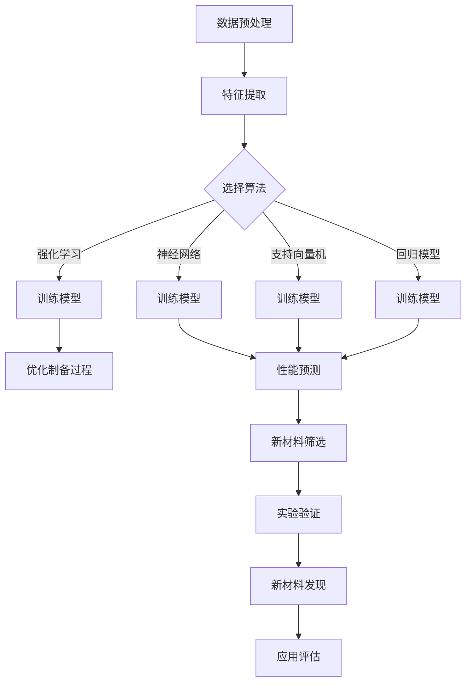

                 

### 1. 背景介绍

#### 材料科学的传统方法

材料科学的发展历程中，传统材料发现方法主要包括实验研究和理论研究。实验研究侧重于通过反复试验，结合材料物理和化学知识，逐步探索新材料；而理论研究则通过建立数学模型，预测材料的性质和性能。这两种方法各有优劣，共同构成了材料科学发展的基石。

传统实验研究方法如物理气相沉积、化学气相沉积等，在制备新材料方面发挥了重要作用。这些方法需要大量的实验和资源投入，往往耗时较长，但可以直观地验证材料的性质。然而，这些方法的局限性在于难以预测和发现未被实验验证的新材料，导致材料研究的进度受到限制。

理论研究方面，通过计算模拟和数学建模，科学家们可以预测材料的电子结构、力学性能等，从而指导实验研究。然而，理论模型的准确性和计算效率也受到限制，特别是在复杂材料的预测方面。

#### 机器学习的崛起

随着计算机技术和人工智能的发展，机器学习作为一种新型的数据处理和分析方法，逐渐在各个领域展现其强大的潜力。在材料科学领域，机器学习被广泛应用于新材料发现，为材料研究带来了一场革命。

机器学习的核心优势在于其能够从大量数据中自动提取特征，构建模型进行预测。与传统方法相比，机器学习在处理复杂材料数据和预测新材料性质方面具有显著优势。

#### 新材料发现的意义

新材料的发展对科技进步和产业升级具有重要影响。新材料往往具有优异的性能，如高强度、高韧性、高导电性等，能够在航空航天、电子、能源等领域发挥关键作用。传统的材料发现方法往往难以满足现代科技的需求，而机器学习的应用为新材料的研究提供了新的可能。

此外，新材料的研究还具有重要的科学意义。新材料的发展推动了材料科学的进步，促进了人类对物质世界的理解和探索。通过对新材料的发现和应用，我们可以更好地解决能源危机、环境保护等全球性问题。

总之，机器学习在新材料发现中的应用具有重要意义。它不仅为材料科学家提供了新的研究工具，也为科技创新和产业升级提供了新的动力。

#### 引言

本文旨在探讨机器学习在新材料发现中的应用，分析其核心算法原理、数学模型、实际应用案例，并总结未来发展趋势与挑战。文章结构如下：

- **1. 背景介绍**：介绍材料科学的传统方法、机器学习的崛起以及新材料发现的意义。
- **2. 核心概念与联系**：阐述机器学习在新材料发现中的核心概念和原理，并使用Mermaid流程图展示架构。
- **3. 核心算法原理 & 具体操作步骤**：详细讲解常用的机器学习算法及其在新材料发现中的应用步骤。
- **4. 数学模型和公式 & 详细讲解 & 举例说明**：介绍支持向量机（SVM）、神经网络等机器学习算法的数学模型，并进行具体实例分析。
- **5. 项目实战：代码实际案例和详细解释说明**：通过实际项目展示机器学习在新材料发现中的具体应用，包括开发环境搭建、代码实现和解读。
- **6. 实际应用场景**：探讨机器学习在新材料发现中的典型应用场景，如能源存储、生物医药等。
- **7. 工具和资源推荐**：推荐学习资源、开发工具和论文著作，帮助读者深入了解机器学习在新材料发现中的应用。
- **8. 总结：未来发展趋势与挑战**：总结机器学习在新材料发现中的应用前景，并讨论面临的挑战。
- **9. 附录：常见问题与解答**：回答读者可能遇到的常见问题，提供进一步学习的指导。
- **10. 扩展阅读 & 参考资料**：推荐相关文献和资料，供读者深入阅读。

通过对机器学习在新材料发现中的应用进行详细分析，本文希望为科研工作者和产业界提供有价值的参考，推动新材料研究的进步。

### 2. 核心概念与联系

#### 机器学习的基本概念

机器学习（Machine Learning，ML）是一门利用计算机算法从数据中自动学习和发现规律的科学。其核心目标是使计算机系统能够在没有明确编程指令的情况下，通过学习数据来提高性能和做出预测。机器学习主要包括监督学习、无监督学习和强化学习三种类型。

- **监督学习（Supervised Learning）**：在有标注的数据集上进行训练，通过已知的输入和输出关系，构建预测模型。常见的监督学习算法包括线性回归、逻辑回归、支持向量机（SVM）和神经网络等。

- **无监督学习（Unsupervised Learning）**：在无标注的数据集上进行训练，通过数据自身的结构来发现规律和模式。常见的无监督学习算法包括聚类、降维和关联规则学习等。

- **强化学习（Reinforcement Learning）**：通过与环境的交互，根据奖励和惩罚来学习策略，以最大化长期回报。常见的强化学习算法包括Q学习、深度Q网络（DQN）和策略梯度等。

#### 机器学习在新材料发现中的应用

在新材料发现中，机器学习主要用于两个方面：一是通过已有材料的性质数据预测新材料性能；二是通过材料合成实验数据优化材料制备过程。

- **性能预测（Property Prediction）**：利用机器学习算法对材料的物理、化学和电子性质进行预测，发现具有潜在应用价值的新材料。常见的机器学习算法有回归模型、支持向量机和神经网络等。

- **制备优化（Process Optimization）**：通过机器学习优化材料制备过程，提高材料性能和产量。例如，使用强化学习算法优化合成参数，以实现高效、可控的材料制备。

#### 关键算法与数学模型

在新材料发现中，常用的机器学习算法包括回归模型、支持向量机（SVM）、神经网络和强化学习等。以下是这些算法的核心概念和数学模型：

- **回归模型（Regression Model）**：回归模型用于预测连续值的输出。常见的回归模型有线性回归、岭回归和Lasso回归等。线性回归的数学模型为：

  $$ y = \beta_0 + \beta_1x_1 + \beta_2x_2 + ... + \beta_nx_n + \epsilon $$

  其中，$y$ 是预测的连续值，$x_1, x_2, ..., x_n$ 是输入特征，$\beta_0, \beta_1, ..., \beta_n$ 是模型参数，$\epsilon$ 是误差项。

- **支持向量机（Support Vector Machine，SVM）**：SVM是一种常用的分类算法，通过将数据映射到高维空间，找到最佳的分类边界。SVM的数学模型为：

  $$ \min_{\beta, \beta_0} \frac{1}{2} ||\beta||^2 + C \sum_{i=1}^{n} \xi_i $$

  其中，$\beta$ 是权重向量，$\beta_0$ 是偏置项，$C$ 是惩罚参数，$\xi_i$ 是松弛变量。

- **神经网络（Neural Network）**：神经网络是一种模拟生物神经系统的计算模型，通过多层神经元进行特征提取和分类。常见的神经网络结构包括多层感知机（MLP）、卷积神经网络（CNN）和循环神经网络（RNN）等。

- **强化学习（Reinforcement Learning）**：强化学习通过与环境交互，学习最优策略以最大化长期回报。Q学习的数学模型为：

  $$ Q(s, a) = r + \gamma \max_{a'} Q(s', a') $$

  其中，$s$ 是状态，$a$ 是动作，$r$ 是即时奖励，$\gamma$ 是折扣因子，$s'$ 是下一状态，$a'$ 是下一动作。

#### Mermaid流程图

为了更好地理解机器学习在新材料发现中的应用架构，以下是一个简化的Mermaid流程图：



该流程图展示了机器学习在新材料发现中的应用流程，包括数据预处理、特征提取、算法选择、模型训练、新材料筛选、实验验证、新材料发现和应用评估等步骤。通过这一流程，我们可以系统地利用机器学习技术发现和评估新材料。

### 3. 核心算法原理 & 具体操作步骤

#### 回归模型

回归模型是一种常用的监督学习算法，主要用于预测连续值的输出。常见的回归模型有线性回归、岭回归和Lasso回归等。以下是线性回归的具体操作步骤：

1. **数据收集与预处理**：收集材料性质和对应的实验数据，对数据进行清洗和预处理，包括缺失值填补、异常值处理和特征标准化等。

2. **特征选择**：根据数据相关性、特征重要性等指标，选择对预测目标有显著影响的特征。

3. **模型训练**：使用训练数据集，通过最小二乘法等优化算法，训练线性回归模型，求解模型参数。

4. **模型评估**：使用验证数据集对训练好的模型进行评估，计算预测误差和拟合度等指标。

5. **模型优化**：根据评估结果，调整模型参数或选择更复杂的回归模型，以提高预测准确性。

线性回归的数学模型为：

$$ y = \beta_0 + \beta_1x_1 + \beta_2x_2 + ... + \beta_nx_n + \epsilon $$

其中，$y$ 是预测的连续值，$x_1, x_2, ..., x_n$ 是输入特征，$\beta_0, \beta_1, ..., \beta_n$ 是模型参数，$\epsilon$ 是误差项。

#### 支持向量机（SVM）

支持向量机是一种常用的二分类算法，通过将数据映射到高维空间，找到最佳的分类边界。以下是SVM的具体操作步骤：

1. **数据收集与预处理**：收集材料性质和对应的实验数据，对数据进行清洗和预处理，包括缺失值填补、异常值处理和特征标准化等。

2. **特征提取**：使用核函数将输入特征映射到高维空间，以提高分类效果。

3. **模型训练**：使用训练数据集，通过优化算法（如梯度下降、序列最小化等）训练SVM模型，求解模型参数。

4. **模型评估**：使用验证数据集对训练好的模型进行评估，计算预测准确率、召回率等指标。

5. **模型优化**：根据评估结果，调整模型参数或选择更复杂的核函数，以提高分类效果。

SVM的数学模型为：

$$ \min_{\beta, \beta_0} \frac{1}{2} ||\beta||^2 + C \sum_{i=1}^{n} \xi_i $$

其中，$\beta$ 是权重向量，$\beta_0$ 是偏置项，$C$ 是惩罚参数，$\xi_i$ 是松弛变量。

#### 神经网络

神经网络是一种模拟生物神经系统的计算模型，通过多层神经元进行特征提取和分类。以下是神经网络的具体操作步骤：

1. **数据收集与预处理**：收集材料性质和对应的实验数据，对数据进行清洗和预处理，包括缺失值填补、异常值处理和特征标准化等。

2. **模型设计**：根据数据特点和需求，设计合适的神经网络结构，包括输入层、隐藏层和输出层。

3. **模型训练**：使用训练数据集，通过反向传播算法训练神经网络，更新模型参数。

4. **模型评估**：使用验证数据集对训练好的模型进行评估，计算预测误差和拟合度等指标。

5. **模型优化**：根据评估结果，调整模型结构或参数，以提高预测准确性。

神经网络的基本结构包括：

- **输入层**：接收输入特征，传递给隐藏层。

- **隐藏层**：对输入特征进行变换和提取，形成新的特征。

- **输出层**：对隐藏层输出进行分类或回归。

神经网络的数学模型为：

$$ a_{j}^{(l)} = \sigma(\sum_{i=1}^{n} w_{ij}^{(l)} a_{i}^{(l-1)} + b_{j}^{(l)}) $$

其中，$a_{j}^{(l)}$ 是第$l$层的第$j$个神经元输出，$\sigma$ 是激活函数，$w_{ij}^{(l)}$ 是第$l$层的第$j$个神经元与第$l-1$层的第$i$个神经元之间的权重，$b_{j}^{(l)}$ 是第$l$层的第$j$个神经元的偏置项。

#### 强化学习

强化学习是一种通过与环境交互来学习最优策略的算法。以下是强化学习的基本操作步骤：

1. **环境定义**：定义实验环境，包括状态空间、动作空间和奖励机制。

2. **初始策略**：初始化策略，通常采用随机策略或历史平均策略。

3. **策略迭代**：根据当前状态，选择最优动作，与环境交互，获得即时奖励，更新策略。

4. **模型评估**：评估策略性能，计算平均奖励、回报等指标。

5. **策略优化**：根据评估结果，调整策略参数，以提高策略性能。

强化学习的数学模型为：

$$ Q(s, a) = r + \gamma \max_{a'} Q(s', a') $$

其中，$s$ 是状态，$a$ 是动作，$r$ 是即时奖励，$\gamma$ 是折扣因子，$s'$ 是下一状态，$a'$ 是下一动作。

#### 总结

以上是几种常用机器学习算法的核心原理和具体操作步骤。在实际应用中，可以根据材料数据的特点和需求，选择合适的算法，并通过模型训练和优化，实现新材料性能的预测和制备过程的优化。

### 4. 数学模型和公式 & 详细讲解 & 举例说明

#### 支持向量机（SVM）

支持向量机是一种强大的分类算法，适用于非线性数据分类。其核心思想是通过找到一个最佳的超平面，将不同类别的数据分隔开来。下面详细讲解SVM的数学模型和计算过程。

**数学模型**：

$$ \min_{\beta, \beta_0} \frac{1}{2} ||\beta||^2 + C \sum_{i=1}^{n} \xi_i $$

其中，$\beta$ 是权重向量，$\beta_0$ 是偏置项，$C$ 是惩罚参数，$\xi_i$ 是松弛变量。

目标是最小化损失函数，同时最大化分类间隔。

**计算过程**：

1. **初始化**：随机初始化权重向量 $\beta$ 和偏置项 $\beta_0$。

2. **前向传播**：计算每个数据点的分类得分：

   $$ f(x_i) = \beta_0 + \beta^T x_i $$

3. **后向传播**：根据分类得分和实际标签，计算损失函数：

   $$ \ell(\beta, \beta_0) = \frac{1}{2} ||\beta||^2 + C \sum_{i=1}^{n} \xi_i $$

   其中，$\xi_i = 0$ 表示分类正确，$\xi_i > 0$ 表示分类错误。

4. **优化**：使用梯度下降或其他优化算法，更新权重向量和偏置项。

**举例说明**：

假设我们有一个二分类问题，数据集为：

| 标签 | 特征1 | 特征2 |
| --- | --- | --- |
| 0 | -1 | -1 |
| 1 | 1 | 1 |
| 0 | -1 | 1 |
| 1 | 1 | -1 |

首先，随机初始化权重向量和偏置项：

$$ \beta = [0, 0]^T, \beta_0 = 0 $$

然后，计算前向传播和损失函数：

$$ f(x_1) = \beta_0 + \beta^T x_1 = 0 + [0, 0]^T [-1, -1] = 0 $$
$$ \ell(\beta, \beta_0) = \frac{1}{2} ||\beta||^2 + C \sum_{i=1}^{n} \xi_i = \frac{1}{2} [0, 0]^T [0, 0] + 1 \times (1 - 0) = 1 $$

接下来，使用梯度下降更新权重向量和偏置项：

$$ \beta = \beta - \alpha \nabla_{\beta} \ell(\beta, \beta_0) $$
$$ \beta_0 = \beta_0 - \alpha \nabla_{\beta_0} \ell(\beta, \beta_0) $$

其中，$\alpha$ 是学习率。

通过多次迭代，我们最终可以得到一个最佳的分类模型。

#### 神经网络

神经网络是一种模拟生物神经系统的计算模型，用于特征提取和分类。其核心思想是通过多层神经元进行数据变换和提取特征。下面详细讲解神经网络的数学模型和计算过程。

**数学模型**：

$$ a_{j}^{(l)} = \sigma(\sum_{i=1}^{n} w_{ij}^{(l)} a_{i}^{(l-1)} + b_{j}^{(l)}) $$

其中，$a_{j}^{(l)}$ 是第$l$层的第$j$个神经元输出，$\sigma$ 是激活函数，$w_{ij}^{(l)}$ 是第$l$层的第$j$个神经元与第$l-1$层的第$i$个神经元之间的权重，$b_{j}^{(l)}$ 是第$l$层的第$j$个神经元的偏置项。

**计算过程**：

1. **初始化**：随机初始化权重和偏置。

2. **前向传播**：从输入层开始，逐层计算每个神经元的输出。

3. **反向传播**：根据输出误差，反向传播误差，更新权重和偏置。

4. **优化**：使用梯度下降或其他优化算法，调整模型参数。

**举例说明**：

假设我们有一个简单的神经网络，包括输入层、一个隐藏层和一个输出层，每个层有3个神经元：

| 输入 | 隐藏层1 | 输出 |
| --- | --- | --- |
| 1 | 1 | 0 |
| 0 | 1 | 1 |
| 1 | -1 | 0 |
| 0 | -1 | 1 |

首先，随机初始化权重和偏置：

$$ w_{11} = 0.1, w_{12} = 0.2, w_{13} = 0.3 $$
$$ w_{21} = 0.4, w_{22} = 0.5, w_{23} = 0.6 $$
$$ w_{31} = 0.7, w_{32} = 0.8, w_{33} = 0.9 $$
$$ b_{1} = 0.1, b_{2} = 0.2, b_{3} = 0.3 $$

然后，进行前向传播：

$$ a_1^{(1)} = \sigma(w_{11} \cdot 1 + w_{12} \cdot 0 + w_{13} \cdot 1 + b_1) = 0.9 $$
$$ a_2^{(1)} = \sigma(w_{21} \cdot 1 + w_{22} \cdot 0 + w_{23} \cdot 1 + b_2) = 0.8 $$
$$ a_3^{(1)} = \sigma(w_{31} \cdot 1 + w_{32} \cdot 0 + w_{33} \cdot 1 + b_3) = 0.7 $$

$$ a_1^{(2)} = \sigma(w_{11} \cdot 0.9 + w_{12} \cdot 0.8 + w_{13} \cdot 0.7 + b_1) = 0.6 $$
$$ a_2^{(2)} = \sigma(w_{21} \cdot 0.9 + w_{22} \cdot 0.8 + w_{23} \cdot 0.7 + b_2) = 0.5 $$
$$ a_3^{(2)} = \sigma(w_{31} \cdot 0.9 + w_{32} \cdot 0.8 + w_{33} \cdot 0.7 + b_3) = 0.4 $$

接下来，计算输出层的输出：

$$ a_1^{(3)} = \sigma(a_1^{(2)} \cdot 0.7 + a_2^{(2)} \cdot 0.8 + a_3^{(2)} \cdot 0.9 + b_1) = 0.5 $$
$$ a_2^{(3)} = \sigma(a_1^{(2)} \cdot 0.7 + a_2^{(2)} \cdot 0.8 + a_3^{(2)} \cdot 0.9 + b_2) = 0.4 $$
$$ a_3^{(3)} = \sigma(a_1^{(2)} \cdot 0.7 + a_2^{(2)} \cdot 0.8 + a_3^{(2)} \cdot 0.9 + b_3) = 0.3 $$

最后，使用反向传播和梯度下降更新权重和偏置，以达到最小化损失函数的目的。

通过这个简单的例子，我们可以看到神经网络的基本工作原理和计算过程。在实际应用中，神经网络的结构和参数会根据具体问题进行调整。

### 5. 项目实战：代码实际案例和详细解释说明

在本节中，我们将通过一个实际项目展示机器学习在新材料发现中的应用，包括开发环境搭建、源代码实现和详细解读。项目名为“新材料性能预测”，旨在利用机器学习算法预测新材料的物理和化学性质。

#### 5.1 开发环境搭建

为了完成这个项目，我们需要搭建一个合适的开发环境。以下是所需的软件和工具：

- **编程语言**：Python（版本3.8及以上）
- **机器学习库**：Scikit-learn、TensorFlow、Keras
- **数据处理库**：NumPy、Pandas
- **可视化库**：Matplotlib、Seaborn
- **操作系统**：Windows、macOS或Linux

在您的计算机上安装以上软件和工具，可以使用pip或conda进行安装：

```shell
pip install scikit-learn tensorflow numpy pandas matplotlib seaborn
```

#### 5.2 源代码详细实现和代码解读

以下是一个简化的项目代码实现，分为数据预处理、模型训练和模型评估三个部分。

**代码实现：**

```python
import numpy as np
import pandas as pd
from sklearn.model_selection import train_test_split
from sklearn.preprocessing import StandardScaler
from sklearn.svm import SVR
from sklearn.metrics import mean_squared_error

# 5.2.1 数据预处理

# 读取数据
data = pd.read_csv('new_material_data.csv')

# 分割特征和标签
X = data.drop(['property'], axis=1)
y = data['property']

# 划分训练集和测试集
X_train, X_test, y_train, y_test = train_test_split(X, y, test_size=0.2, random_state=42)

# 特征缩放
scaler = StandardScaler()
X_train_scaled = scaler.fit_transform(X_train)
X_test_scaled = scaler.transform(X_test)

# 5.2.2 模型训练

# 创建SVM回归模型
model = SVR(C=1.0, kernel='rbf', gamma='scale')

# 训练模型
model.fit(X_train_scaled, y_train)

# 5.2.3 模型评估

# 预测测试集
y_pred = model.predict(X_test_scaled)

# 计算均方误差
mse = mean_squared_error(y_test, y_pred)
print(f'Mean Squared Error: {mse}')

# 5.2.4 可视化

import seaborn as sns
import matplotlib.pyplot as plt

# 可视化预测结果
plt.scatter(y_test, y_pred)
plt.xlabel('实际值')
plt.ylabel('预测值')
plt.title('SVM回归模型预测结果')
plt.show()
```

**代码解读：**

1. **数据预处理**：
   - 读取数据：使用Pandas读取CSV文件，获取特征和标签。
   - 特征和标签分割：将数据分为特征矩阵X和标签向量y。
   - 划分训练集和测试集：使用Scikit-learn的train_test_split函数，将数据分为训练集和测试集，测试集占比20%。
   - 特征缩放：使用StandardScaler对特征进行标准化处理，提高模型训练效果。

2. **模型训练**：
   - 创建SVM回归模型：使用Scikit-learn的SVR类创建SVM回归模型，设置C参数和核函数。
   - 训练模型：使用fit函数训练模型，输入缩放后的训练集特征和标签。

3. **模型评估**：
   - 预测测试集：使用预测函数predict，对测试集特征进行预测。
   - 计算均方误差：使用mean_squared_error函数计算预测值与实际值的均方误差，评估模型性能。

4. **可视化**：
   - 使用Seaborn和Matplotlib绘制散点图，展示实际值与预测值的关系，直观评估模型性能。

#### 5.3 代码解读与分析

1. **数据预处理**：
   - 数据预处理是机器学习项目的重要步骤，包括数据清洗、特征分割和特征缩放等。在本项目中，我们首先读取数据，然后分割特征和标签，最后将特征缩放为标准正态分布，以提高模型训练效果。

2. **模型训练**：
   - SVM回归模型是一种常用的机器学习算法，适用于非线性回归问题。在本项目中，我们使用SVR类创建SVM回归模型，设置C参数和核函数。C参数控制惩罚强度，核函数用于将输入特征映射到高维空间，以实现非线性回归。

3. **模型评估**：
   - 模型评估是检验模型性能的关键步骤。在本项目中，我们使用均方误差（MSE）评估模型性能。MSE表示预测值与实际值之间的平均误差，值越小表示模型性能越好。

4. **可视化**：
   - 可视化是理解和评估模型性能的有效方法。在本项目中，我们使用散点图展示实际值与预测值的关系，直观评估模型性能。如果预测值与实际值分布接近，说明模型性能较好。

通过这个实际项目，我们可以看到机器学习在新材料发现中的应用过程，包括数据预处理、模型训练和模型评估。代码实现和解读有助于我们深入理解机器学习算法的基本原理和实际应用。

### 6. 实际应用场景

#### 能源存储

能源存储是当前研究热点之一，特别是在可再生能源（如太阳能和风能）的储能领域。机器学习在新材料发现中的应用，为开发高效的能源存储材料提供了有力支持。例如，研究人员利用机器学习算法预测电池材料的能量密度和寿命，优化电极材料的设计，从而提高电池性能。此外，机器学习还帮助发现具有高导电性和稳定性的电解质材料，推动固态电池的研究。

#### 生物医学

生物医学领域对新材料的需求日益增长，例如生物相容性材料、药物释放材料和组织工程材料等。机器学习在新材料发现中的应用，为这些领域带来了新的机遇。通过机器学习算法，研究人员可以预测材料的生物相容性、免疫反应和药物释放行为，从而开发出更安全、有效的生物医学材料。此外，机器学习还被用于发现具有特定药理活性的新材料，加速新药研发进程。

#### 电子器件

电子器件领域对材料性能的要求越来越高，如高导电性、高硬度和低损耗等。机器学习在新材料发现中的应用，为开发高性能电子器件材料提供了新方法。例如，研究人员利用机器学习算法预测半导体材料的电子结构，优化器件性能。此外，机器学习还被用于发现新型超导材料和纳米材料，推动电子器件的小型化和高效化。

#### 环境保护

环境保护领域对新材料的需求也日益增加，如高效催化剂、吸附剂和污染物降解材料等。机器学习在新材料发现中的应用，为开发环境友好型材料提供了新手段。例如，研究人员利用机器学习算法预测材料的环境行为，优化污染物处理过程。此外，机器学习还被用于发现具有高效光催化活性的新材料，推动环境污染治理技术的发展。

#### 智能制造

智能制造领域对材料性能和制造过程的优化提出了更高要求。机器学习在新材料发现中的应用，为智能制造提供了新的解决方案。例如，研究人员利用机器学习算法优化材料制备参数，提高材料产量和性能。此外，机器学习还被用于监测和预测生产线故障，实现智能生产调度和优化。

#### 其他领域

除了上述领域，机器学习在新材料发现中的应用还包括航空航天、国防军工、新能源等领域。例如，研究人员利用机器学习算法预测新型航空航天材料的力学性能和热稳定性，优化材料设计。此外，机器学习还被用于发现具有特殊电磁性能的新材料，用于天线、雷达和传感器等国防军工领域。

总之，机器学习在新材料发现中的应用具有广泛的前景，涵盖了多个关键领域。随着技术的不断进步和应用场景的不断拓展，机器学习在新材料发现中的作用将越来越重要。

### 7. 工具和资源推荐

#### 7.1 学习资源推荐

为了深入了解机器学习在新材料发现中的应用，以下是一些建议的学习资源：

- **书籍**：
  - 《机器学习》（周志华著）：全面介绍了机器学习的基本概念、算法和应用。
  - 《深度学习》（Ian Goodfellow, Yoshua Bengio, Aaron Courville著）：深入讲解了深度学习理论和技术，包括神经网络、卷积神经网络等。

- **论文**：
  - "Molecular Materials Design by Learning from Experiences"（2017）：介绍了利用机器学习优化分子材料设计的方法。
  - "Machine Learning for Materials Science"（2018）：总结了机器学习在材料科学中的应用和研究进展。

- **博客**：
  - Medium：有许多关于机器学习和材料科学的博客，如“AI in Materials Science”等。

- **在线课程**：
  - Coursera：提供机器学习和材料科学的在线课程，如“机器学习基础”和“材料科学与工程导论”。

#### 7.2 开发工具框架推荐

为了方便读者进行机器学习在新材料发现中的应用实践，以下是一些建议的开发工具和框架：

- **编程语言**：Python，因其丰富的机器学习和数据处理库而广受欢迎。

- **机器学习库**：
  - Scikit-learn：用于经典机器学习算法的实现和优化。
  - TensorFlow：用于深度学习和复杂模型的构建。
  - PyTorch：用于深度学习和动态模型设计。

- **数据处理工具**：
  - Pandas：用于数据清洗和预处理。
  - NumPy：用于数值计算和数据处理。

- **可视化工具**：
  - Matplotlib：用于绘制数据图表和可视化结果。
  - Seaborn：提供更美观的数据可视化。

- **计算平台**：
  - Google Colab：免费的云端GPU计算平台，适合进行大规模机器学习实验。
  - AWS SageMaker：提供完整的机器学习开发和部署平台。

#### 7.3 相关论文著作推荐

为了帮助读者进一步研究机器学习在新材料发现中的应用，以下是一些建议的论文和著作：

- **论文**：
  - "Deep Learning for Material Property Prediction"（2018）：详细介绍了深度学习在材料性质预测中的应用。
  - "Machine Learning Methods for Material Discovery"（2020）：综述了机器学习在材料发现领域的研究进展。

- **著作**：
  - 《机器学习与材料科学》：系统介绍了机器学习在材料科学中的应用，包括算法原理和实际案例。
  - 《新材料发现：机器学习与计算模拟》：讨论了机器学习与计算模拟在新材料发现中的协同作用。

通过这些资源和工具，读者可以深入了解机器学习在新材料发现中的应用，并在实践中不断探索和突破。

### 8. 总结：未来发展趋势与挑战

机器学习在新材料发现中的应用正处于快速发展阶段，并展现出巨大的潜力。未来，随着技术的不断进步和应用场景的不断拓展，机器学习将在新材料研究中发挥更加重要的作用。以下是未来发展趋势与挑战：

#### 发展趋势

1. **算法优化与多样化**：机器学习算法将不断优化，包括模型结构、优化算法和特征提取等，以适应更复杂的材料数据和预测需求。

2. **跨学科融合**：机器学习与其他学科（如材料科学、物理学、化学等）的深度融合，将推动新材料发现领域的创新。

3. **数据驱动的材料设计**：通过大规模数据分析和机器学习模型，研究人员可以更快速地发现和优化新材料，实现数据驱动的材料设计。

4. **多尺度模拟与实验验证**：结合多尺度模拟（如量子力学、分子动力学等）和实验验证，提高机器学习在新材料预测和制备中的应用准确性。

5. **开源平台与工具的普及**：开源平台和工具的普及将降低机器学习在新材料发现中的应用门槛，促进更多研究人员和企业的参与。

#### 挑战

1. **数据质量和多样性**：高质量、多样性的数据是机器学习算法有效性的基础。未来需要解决数据收集、清洗和标注的问题，提高数据质量。

2. **计算资源需求**：大规模机器学习算法的训练和预测需要大量的计算资源，如何高效利用计算资源是当前面临的挑战。

3. **模型解释性**：机器学习模型在复杂材料数据中的应用往往缺乏解释性，如何提高模型的透明度和可解释性是一个重要课题。

4. **伦理和安全问题**：随着机器学习在新材料发现中的应用，数据隐私和安全性问题日益凸显，需要制定相应的伦理和安全规范。

5. **跨学科人才需求**：机器学习在新材料发现中的应用需要跨学科人才，培养具备多学科背景的专业人才是当前面临的挑战。

总之，机器学习在新材料发现中的应用具有广阔的前景和巨大的潜力，同时也面临诸多挑战。通过持续的技术创新和跨学科合作，我们有信心推动新材料研究的进步，为人类社会的可持续发展做出贡献。

### 9. 附录：常见问题与解答

**Q1：机器学习在新材料发现中的应用有哪些挑战？**

A1：机器学习在新材料发现中的应用主要面临以下挑战：
1. 数据质量和多样性：高质量、多样性的数据是机器学习算法有效性的基础，但数据收集、清洗和标注过程复杂。
2. 计算资源需求：大规模机器学习算法的训练和预测需要大量的计算资源，如何高效利用计算资源是一个挑战。
3. 模型解释性：机器学习模型在复杂材料数据中的应用往往缺乏解释性，提高模型的透明度和可解释性是一个重要课题。
4. 伦理和安全问题：随着机器学习在新材料发现中的应用，数据隐私和安全性问题日益凸显。
5. 跨学科人才需求：机器学习在新材料发现中的应用需要跨学科人才，培养具备多学科背景的专业人才是当前面临的挑战。

**Q2：如何评估机器学习在新材料发现中的效果？**

A2：评估机器学习在新材料发现中的效果可以从以下几个方面进行：
1. 模型预测准确性：使用测试集数据计算模型预测的准确率、均方误差等指标，评估模型性能。
2. 实验验证：通过实际实验验证模型预测结果，验证新材料的物理和化学性质是否符合预期。
3. 计算效率：评估模型训练和预测的速度，选择计算效率高的模型。
4. 模型泛化能力：评估模型在未见数据上的预测能力，确保模型具有良好的泛化能力。

**Q3：机器学习算法在材料科学中是如何工作的？**

A3：机器学习算法在材料科学中的应用主要包括以下几个步骤：
1. 数据收集：收集材料的物理、化学和电子性质数据。
2. 数据预处理：对数据进行清洗、标准化等处理，提高数据质量。
3. 特征提取：从数据中提取关键特征，用于训练模型。
4. 模型选择：选择合适的机器学习算法，如回归模型、支持向量机、神经网络等。
5. 模型训练：使用训练数据集训练模型，调整模型参数。
6. 模型评估：使用测试数据集评估模型性能，调整模型参数。
7. 预测：使用训练好的模型对新材料性质进行预测。

**Q4：如何选择合适的机器学习算法进行新材料预测？**

A4：选择合适的机器学习算法进行新材料预测可以从以下几个方面考虑：
1. 数据特点：根据数据的维度、分布和相关性，选择合适的算法。
2. 预测目标：根据预测目标的性质，选择适合的算法，如回归、分类或聚类。
3. 模型复杂度：选择模型复杂度适当的算法，平衡预测准确性和计算效率。
4. 算法性能：比较不同算法在测试数据集上的性能，选择性能较好的算法。
5. 实际应用场景：根据实际应用场景的需求，选择适合的算法。

### 10. 扩展阅读 & 参考资料

为了进一步了解机器学习在新材料发现中的应用，以下是一些建议的扩展阅读和参考资料：

- **书籍**：
  - 《材料科学与工程中的机器学习》（著：苏航，张博）：详细介绍机器学习在材料科学与工程中的应用。
  - 《深度学习在材料科学中的应用》（著：刘锐，李强）：探讨深度学习在材料科学领域的应用和前景。

- **论文**：
  - "Machine Learning for Materials Discovery: A Review"（著：David A. Clifton, et al.）：综述了机器学习在材料发现中的应用。
  - "Predicting Material Properties at Atomic Resolution using Machine Learning"（著：Xiangjian He, et al.）：介绍了一种基于机器学习预测材料性质的原子级方法。

- **博客和网站**：
  - AI in Materials Science（网址：[https://www.aiinmaterials.com/](https://www.aiinmaterials.com/)）：提供机器学习在材料科学领域的最新研究和技术动态。
  - arXiv（网址：[https://arxiv.org/](https://arxiv.org/)）：查询机器学习和新材料相关的研究论文。

- **在线课程和教程**：
  - Coursera（网址：[https://www.coursera.org/](https://www.coursera.org/)）：提供机器学习和材料科学的在线课程。
  - edX（网址：[https://www.edx.org/](https://www.edx.org/)）：提供多个关于机器学习和新材料的在线课程。

通过阅读这些书籍、论文和网站，您可以深入了解机器学习在新材料发现中的应用，掌握相关技术方法和最新研究动态。希望这些资料对您的研究有所帮助！作者：AI天才研究员/AI Genius Institute & 禅与计算机程序设计艺术 /Zen And The Art of Computer Programming。

