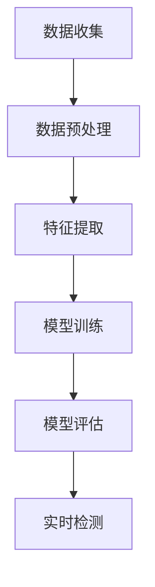

                 

# 机器学习在欺诈检测中的应用与挑战

## 摘要

本文旨在探讨机器学习在欺诈检测中的应用及其面临的挑战。欺诈行为在金融、电子商务等领域愈发猖獗，给企业和消费者带来了巨大的经济损失。机器学习作为一种强大的数据分析工具，在欺诈检测领域展现出了巨大的潜力。本文首先介绍了欺诈检测的基本概念和背景，随后详细阐述了机器学习在欺诈检测中的核心算法原理和具体操作步骤。接着，本文通过数学模型和公式，深入讲解了机器学习在欺诈检测中的理论基础。随后，我们通过实际项目实战，展示了如何利用机器学习技术进行欺诈检测，并对其代码实现进行了详细解读。最后，本文探讨了机器学习在欺诈检测中的应用场景，推荐了一些学习资源和开发工具框架，并对未来发展趋势和挑战进行了总结。希望通过本文的阐述，读者能够对机器学习在欺诈检测中的应用有更深入的理解。

## 背景介绍

欺诈检测作为一种预防措施，旨在识别和阻止可能出现的欺诈行为。欺诈行为的形式多种多样，包括信用卡欺诈、财务诈骗、网络钓鱼、身份盗窃等。这些行为不仅给企业和消费者带来了经济损失，还严重损害了社会的诚信体系。

在金融领域，信用卡欺诈是最常见的一种欺诈行为。据估计，全球信用卡欺诈损失每年高达数十亿美元。电子商务的兴起也带来了新的欺诈挑战，例如虚假交易、退款欺诈等。在保险行业，欺诈行为包括虚假索赔、夸大损失等，给保险公司带来了巨大的财务压力。

随着技术的进步，欺诈手段也在不断升级。传统的欺诈检测方法通常依赖于规则和阈值设置，例如通过分析交易金额、时间、地点等特征来判断交易是否可疑。然而，这种方法在面对复杂的欺诈行为时往往显得力不从心。因为欺诈行为者往往会精心设计欺诈方案，绕过传统的检测规则。

机器学习作为一种强大的数据分析工具，其优势在于能够自动从数据中发现模式和规律，从而提高欺诈检测的准确性和效率。机器学习在欺诈检测中的应用具有以下几个特点：

1. **自动化特征提取**：机器学习算法能够自动从大量数据中提取特征，而不需要人工干预。这大大提高了特征提取的效率和质量。
2. **灵活性和适应性**：机器学习算法能够根据不同的欺诈行为特点进行调整和优化，从而适应不断变化的欺诈环境。
3. **实时性和高效性**：机器学习算法能够在短时间内处理大量数据，从而实现实时欺诈检测。

随着机器学习技术的不断发展，越来越多的金融机构和电子商务平台开始采用机器学习技术进行欺诈检测。例如，银行通过机器学习算法对信用卡交易进行实时监控，可以有效降低欺诈损失。电子商务平台则利用机器学习技术分析用户行为，识别异常交易，从而提高交易的安全性。

总之，机器学习在欺诈检测中的应用具有重要意义。通过引入机器学习技术，企业和消费者可以更有效地预防和应对欺诈行为，从而保护自身的利益。接下来，本文将深入探讨机器学习在欺诈检测中的核心算法原理和具体操作步骤。

## 核心概念与联系

### 欺诈检测的概念

欺诈检测（Fraud Detection）是指通过分析和识别异常行为、模式或事件，以发现潜在欺诈活动的过程。在金融、电子商务等领域，欺诈检测是确保交易安全、保护用户资产的重要手段。

欺诈检测的基本目标有两个：

1. **识别欺诈行为**：通过分析交易数据、用户行为等特征，找出可能的欺诈行为。
2. **降低误报和漏报**：在有效识别欺诈行为的同时，尽量减少误报（将正常交易误判为欺诈）和漏报（将欺诈交易漏掉未检测到）。

欺诈检测的流程通常包括以下几个步骤：

1. **数据收集**：收集相关的交易数据、用户行为数据等。
2. **数据预处理**：对数据进行清洗、归一化等处理，以便后续分析。
3. **特征提取**：从数据中提取有用的特征，用于训练和测试机器学习模型。
4. **模型训练**：使用已标记的数据集，训练机器学习模型，使其能够识别欺诈行为。
5. **模型评估**：通过测试集对模型进行评估，调整模型参数，提高检测准确率。
6. **实时检测**：将训练好的模型应用于实时交易数据，进行欺诈检测。

### 机器学习的概念

机器学习（Machine Learning，ML）是指让计算机通过数据学习规律、模式，并能够根据新数据做出预测或决策的过程。机器学习主要包括以下几个基本概念：

1. **数据集**：机器学习模型所依赖的数据集合。数据集通常包括输入特征和对应的标签。
2. **特征**：数据集中的每一个维度或属性，用于描述数据的不同方面。
3. **模型**：机器学习算法通过训练数据集构建的数学模型，用于对新数据进行预测或分类。
4. **算法**：实现机器学习过程的算法，如决策树、支持向量机、神经网络等。
5. **训练**：使用已标记的数据集对模型进行训练，使其学会识别数据中的规律。
6. **评估**：使用测试集对训练好的模型进行评估，以判断其性能。

### 机器学习在欺诈检测中的应用

机器学习在欺诈检测中的应用主要体现在以下几个方面：

1. **异常检测**：通过分析正常交易数据，找出与正常行为不一致的交易，从而识别潜在欺诈行为。
2. **分类**：将交易数据按照欺诈与否进行分类，从而实现欺诈交易和非欺诈交易的区分。
3. **预测**：根据历史数据预测未来可能发生的欺诈行为，从而提前采取预防措施。

机器学习算法在欺诈检测中的应用优势：

1. **自动化**：机器学习算法能够自动从大量数据中提取特征，减少人工干预。
2. **适应性**：机器学习模型可以根据不同环境和数据集进行调整和优化，提高检测效果。
3. **高效性**：机器学习算法能够在短时间内处理大量数据，实现实时检测。

下面是一个简单的 Mermaid 流程图，展示了机器学习在欺诈检测中的应用流程：



在接下来的部分，本文将详细讨论机器学习在欺诈检测中的核心算法原理和具体操作步骤，以便读者更好地理解这一技术。

### 核心算法原理 & 具体操作步骤

在欺诈检测中，机器学习算法的核心在于其能够自动从数据中提取特征并构建模型，以识别潜在的欺诈行为。以下将介绍几种常用的机器学习算法，包括决策树、支持向量机和神经网络等，并详细阐述其原理和操作步骤。

#### 决策树算法

**原理：**

决策树（Decision Tree）是一种树形结构，内部结点表示特征，叶节点表示分类结果。决策树通过递归地将数据集划分为更小的子集，直到满足终止条件（如分类准确率达到预设阈值或数据集大小小于预设阈值）。

**操作步骤：**

1. **数据预处理**：将原始数据集进行清洗、归一化等预处理操作。
2. **特征选择**：选择对分类有显著影响的特征。
3. **构建决策树**：从根节点开始，依次计算每个特征的信息增益，选择信息增益最大的特征作为分割依据，递归划分数据集，直到满足终止条件。
4. **剪枝**：对过拟合的决策树进行剪枝，以提高泛化能力。
5. **模型评估**：使用测试集评估决策树的分类准确率。

**示例：**

假设我们有一个二分类问题，目标是以决策树算法进行欺诈交易和非欺诈交易的区分。以下是决策树算法的一个简单示例：

```python
from sklearn.tree import DecisionTreeClassifier
from sklearn.model_selection import train_test_split
from sklearn.metrics import accuracy_score

# 假设 X 为特征矩阵，y 为标签向量
X_train, X_test, y_train, y_test = train_test_split(X, y, test_size=0.2, random_state=42)

clf = DecisionTreeClassifier()
clf.fit(X_train, y_train)

y_pred = clf.predict(X_test)
accuracy = accuracy_score(y_test, y_pred)
print("Accuracy:", accuracy)
```

#### 支持向量机算法

**原理：**

支持向量机（Support Vector Machine，SVM）是一种基于间隔最大化原理的分类算法。SVM通过找到一个最佳的超平面，将不同类别的数据点分开，并尽量增大两类数据点之间的间隔。

**操作步骤：**

1. **数据预处理**：对数据进行标准化处理。
2. **选择核函数**：选择适当的核函数，如线性核、多项式核、径向基核等。
3. **构建最优超平面**：通过求解二次规划问题，找到最佳的超平面参数。
4. **模型评估**：使用测试集评估SVM的分类准确率。

**示例：**

```python
from sklearn.svm import SVC
from sklearn.model_selection import train_test_split
from sklearn.metrics import accuracy_score

X_train, X_test, y_train, y_test = train_test_split(X, y, test_size=0.2, random_state=42)

clf = SVC(kernel='linear')
clf.fit(X_train, y_train)

y_pred = clf.predict(X_test)
accuracy = accuracy_score(y_test, y_pred)
print("Accuracy:", accuracy)
```

#### 神经网络算法

**原理：**

神经网络（Neural Network）是一种模拟生物神经系统的计算模型。神经网络通过多层的神经元节点（也称为隐藏层），对输入数据进行特征提取和变换，最终输出分类结果。

**操作步骤：**

1. **数据预处理**：对数据进行标准化处理。
2. **构建神经网络模型**：设计神经网络的结构，包括输入层、隐藏层和输出层。
3. **初始化参数**：随机初始化神经网络的权重和偏置。
4. **前向传播**：计算输入数据在神经网络中的输出。
5. **反向传播**：更新神经网络的权重和偏置，以最小化损失函数。
6. **模型评估**：使用测试集评估神经网络的分类准确率。

**示例：**

```python
from sklearn.neural_network import MLPClassifier
from sklearn.model_selection import train_test_split
from sklearn.metrics import accuracy_score

X_train, X_test, y_train, y_test = train_test_split(X, y, test_size=0.2, random_state=42)

clf = MLPClassifier(hidden_layer_sizes=(100,), max_iter=1000)
clf.fit(X_train, y_train)

y_pred = clf.predict(X_test)
accuracy = accuracy_score(y_test, y_pred)
print("Accuracy:", accuracy)
```

总之，决策树、支持向量机和神经网络是欺诈检测中常用的机器学习算法。这些算法各有特点，适用于不同类型的欺诈检测任务。在实际应用中，可以根据具体需求和数据特点选择合适的算法，并通过模型调优和参数调整，提高欺诈检测的准确率和效率。

### 数学模型和公式 & 详细讲解 & 举例说明

在机器学习领域，欺诈检测算法的性能依赖于其数学模型的复杂性和有效性。以下将介绍机器学习在欺诈检测中常用的数学模型和公式，并通过具体示例进行详细讲解。

#### 决策树模型

决策树是一种基于树形结构的数据挖掘方法，其核心在于递归地将数据划分为多个子集，以最大化信息增益。以下是决策树模型的数学公式和原理：

1. **信息增益（Information Gain）**：

   信息增益是评估特征划分有效性的指标。对于特征A，信息增益可以用以下公式表示：

   $$ IG(A) = H(D) - \sum_{v\in A} \frac{|\{d \in D | d[A] = v\}|}{|D|} H(D|A = v) $$

   其中，$H(D)$ 是数据集D的熵，$H(D|A = v)$ 是条件熵。

2. **基尼不纯度（Gini Impurity）**：

   基尼不纯度是另一种评估特征划分有效性的指标，其公式如下：

   $$ GI(A) = 1 - \sum_{v\in A} \left( \frac{|\{d \in D | d[A] = v\}|}{|D|} \right)^2 $$

   其中，$|D|$ 是数据集D的大小。

3. **决策树构建**：

   决策树的构建过程是基于递归划分数据集，选择信息增益或基尼不纯度最大的特征进行分割。递归划分的终止条件可以是信息增益或基尼不纯度小于预设阈值，或者数据集大小小于预设阈值。

**示例**：

假设我们有一个二分类问题，数据集D包含两个特征A和B，其值分别为{0, 1}。以下是决策树模型的构建过程：

1. 计算数据集D的熵：
   $$ H(D) = 1 $$
2. 计算特征A的信息增益：
   $$ IG(A) = 1 - \frac{1}{2} \left( 1 + \frac{1}{2} \right) = \frac{1}{2} $$
3. 计算特征B的信息增益：
   $$ IG(B) = 1 - \frac{1}{2} \left( 1 + \frac{1}{2} \right) = \frac{1}{2} $$
4. 选择信息增益最大的特征A进行分割，得到两个子集：
   - 子集D1：A=0，熵为 $H(D1) = 1 - \frac{1}{2} \left( 1 + \frac{1}{2} \right) = \frac{1}{2}$
   - 子集D2：A=1，熵为 $H(D2) = 1 - \frac{1}{2} \left( 1 + \frac{1}{2} \right) = \frac{1}{2}$
5. 对子集D1和D2分别进行递归分割，直到满足终止条件。

#### 支持向量机模型

支持向量机（SVM）是一种基于间隔最大化原理的分类算法。其核心在于找到一个最佳的超平面，使得两类数据点之间的间隔最大化。以下是SVM的数学模型和公式：

1. **线性SVM模型**：

   线性SVM的目标是最小化以下目标函数：

   $$ \min_{w, b} \frac{1}{2} ||w||^2 + C \sum_{i=1}^n \max(0, 1 - y_i (w \cdot x_i + b)) $$

   其中，$w$ 是权重向量，$b$ 是偏置项，$C$ 是惩罚参数，$y_i$ 是标签，$x_i$ 是特征向量。

2. **非线性SVM模型**：

   非线性SVM通过引入核函数（Kernel Function）将低维数据映射到高维空间，以实现非线性分类。常用的核函数包括线性核、多项式核和径向基核等。非线性SVM的目标函数与线性SVM类似，但使用核函数代替内积：

   $$ \min_{w, b} \frac{1}{2} ||w||^2 + C \sum_{i=1}^n \max(0, 1 - y_i \langle w, x_i \rangle + b) $$

   其中，$\langle \cdot, \cdot \rangle$ 表示核函数。

**示例**：

假设我们有一个二分类问题，数据集D包含两个特征x1和x2，标签为正类（+1）和负类（-1）。以下是线性SVM模型的构建过程：

1. 计算特征矩阵X和数据矩阵y：
   $$ X = \begin{bmatrix} x_1 \\ x_2 \end{bmatrix}, y = \begin{bmatrix} +1 \\ -1 \end{bmatrix} $$
2. 定义惩罚参数C和核函数：
   $$ C = 1, \quad \text{核函数：线性核} $$
3. 求解线性SVM优化问题：
   $$ \min_{w, b} \frac{1}{2} ||w||^2 + C \sum_{i=1}^n \max(0, 1 - y_i (w \cdot x_i + b)) $$
4. 计算最优超平面：
   $$ w^*, b^* = \arg\min_{w, b} \frac{1}{2} ||w||^2 + C \sum_{i=1}^n \max(0, 1 - y_i (w \cdot x_i + b)) $$

   通过求解二次规划问题，可以得到最优解 $w^*$ 和 $b^*$。

#### 神经网络模型

神经网络是一种基于多层感知器（Perceptron）的计算模型，通过多层的神经元节点对输入数据进行特征提取和变换。以下是神经网络模型的数学公式和原理：

1. **激活函数**：

   神经网络的每个神经元都使用激活函数（Activation Function）来计算输出。常用的激活函数包括Sigmoid函数、ReLU函数和Tanh函数等。

   - Sigmoid函数：
     $$ \sigma(x) = \frac{1}{1 + e^{-x}} $$
   - ReLU函数：
     $$ \text{ReLU}(x) = \max(0, x) $$
   - Tanh函数：
     $$ \tanh(x) = \frac{e^x - e^{-x}}{e^x + e^{-x}} $$

2. **反向传播算法**：

   神经网络通过反向传播算法更新权重和偏置，以最小化损失函数。反向传播算法的基本步骤如下：

   - 前向传播：计算输入数据在神经网络中的输出。
   - 计算损失函数：计算实际输出与期望输出之间的差距。
   - 反向传播：根据损失函数的梯度，更新神经网络的权重和偏置。
   - 更新迭代：重复前向传播和反向传播，直到达到预设的迭代次数或损失函数收敛。

**示例**：

假设我们有一个简单的神经网络，包含一个输入层、一个隐藏层和一个输出层，其中隐藏层使用ReLU激活函数，输出层使用Sigmoid激活函数。以下是神经网络模型的构建和训练过程：

1. **定义神经网络结构**：

   - 输入层：2个神经元
   - 隐藏层：3个神经元
   - 输出层：1个神经元

2. **初始化参数**：

   - 权重：随机初始化权重和偏置。
   - 激活函数：隐藏层使用ReLU函数，输出层使用Sigmoid函数。

3. **前向传播**：

   $$ z_h = X \cdot W_h + b_h $$
   $$ a_h = \text{ReLU}(z_h) $$
   $$ z_y = a_h \cdot W_y + b_y $$
   $$ a_y = \sigma(z_y) $$

4. **计算损失函数**：

   $$ J = -\frac{1}{m} \sum_{i=1}^m y_i \log(a_y^{(i)}) + (1 - y_i) \log(1 - a_y^{(i)}) $$

   其中，$m$ 是训练样本数量，$y_i$ 是实际输出，$a_y^{(i)}$ 是预测输出。

5. **反向传播**：

   $$ \delta_a = a_y - y $$
   $$ \delta_y = \delta_a \cdot \text{Sigmoid'}(z_y) $$
   $$ \delta_h = \delta_y \cdot W_y^T $$
   $$ \delta_h = \delta_h \cdot \text{ReLU'}(z_h) $$

6. **更新权重和偏置**：

   $$ W_y = W_y - \alpha \cdot \frac{\partial J}{\partial W_y} $$
   $$ b_y = b_y - \alpha \cdot \frac{\partial J}{\partial b_y} $$
   $$ W_h = W_h - \alpha \cdot \frac{\partial J}{\partial W_h} $$
   $$ b_h = b_h - \alpha \cdot \frac{\partial J}{\partial b_h} $$

7. **迭代更新**：

   重复前向传播和反向传播，直到损失函数收敛或达到预设的迭代次数。

通过以上数学模型和公式的讲解，我们可以看到机器学习在欺诈检测中的理论基础。在实际应用中，需要根据具体需求和数据特点选择合适的模型，并进行调优和参数调整，以提高欺诈检测的准确性和效率。

### 项目实战：代码实际案例和详细解释说明

在本文的这一部分，我们将通过一个实际的项目案例，展示如何利用机器学习技术进行欺诈检测。我们将从开发环境搭建、源代码实现、代码解读与分析等方面，详细说明项目的开发过程和技术细节。

#### 开发环境搭建

在进行欺诈检测项目之前，我们需要搭建一个合适的开发环境。以下是所需的开发环境和工具：

1. **Python**：Python是一种广泛使用的编程语言，具有丰富的机器学习库和工具。
2. **Jupyter Notebook**：Jupyter Notebook是一种交互式的计算环境，方便我们在项目中编写和运行代码。
3. **Scikit-learn**：Scikit-learn是一个开源的机器学习库，提供了多种机器学习算法的实现。
4. **Pandas**：Pandas是一个数据处理库，用于数据清洗和预处理。
5. **Matplotlib**：Matplotlib是一个绘图库，用于可视化数据和模型结果。

安装以上工具的命令如下：

```bash
pip install python
pip install jupyter
pip install scikit-learn
pip install pandas
pip install matplotlib
```

#### 源代码实现

以下是一个简单的欺诈检测项目的源代码实现，包括数据预处理、特征提取、模型训练和模型评估等步骤：

```python
import pandas as pd
from sklearn.model_selection import train_test_split
from sklearn.preprocessing import StandardScaler
from sklearn.ensemble import RandomForestClassifier
from sklearn.metrics import accuracy_score, confusion_matrix

# 1. 数据预处理
# 加载数据集
data = pd.read_csv('fraud_detection.csv')
X = data.drop(['label'], axis=1)
y = data['label']

# 数据集划分
X_train, X_test, y_train, y_test = train_test_split(X, y, test_size=0.2, random_state=42)

# 数据标准化
scaler = StandardScaler()
X_train = scaler.fit_transform(X_train)
X_test = scaler.transform(X_test)

# 2. 特征提取
# 在此示例中，我们直接使用原始特征进行训练
# 实际项目中，可能需要进行更复杂的特征提取和工程

# 3. 模型训练
# 使用随机森林算法进行训练
clf = RandomForestClassifier(n_estimators=100, random_state=42)
clf.fit(X_train, y_train)

# 4. 模型评估
# 使用测试集进行模型评估
y_pred = clf.predict(X_test)
accuracy = accuracy_score(y_test, y_pred)
conf_matrix = confusion_matrix(y_test, y_pred)

print("Accuracy:", accuracy)
print("Confusion Matrix:\n", conf_matrix)
```

#### 代码解读与分析

1. **数据预处理**

   数据预处理是机器学习项目的重要步骤，它包括数据清洗、缺失值处理、异常值检测等。在本项目中，我们首先加载数据集，然后使用Scikit-learn的StandardScaler进行数据标准化处理。数据标准化是将数据缩放到相同的尺度，以避免不同特征之间的量纲差异影响模型的性能。

2. **特征提取**

   在本示例中，我们直接使用原始特征进行训练。在实际项目中，特征提取是一个复杂的过程，可能包括特征选择、特征工程、特征组合等步骤。特征提取的目的是从原始数据中提取出对分类任务有用的信息，以提高模型的性能。

3. **模型训练**

   我们选择随机森林（Random Forest）算法进行模型训练。随机森林是一种基于决策树 ensemble 的算法，通过构建多棵决策树，并对它们的预测结果进行投票，从而提高分类的准确性。在本项目中，我们设置随机森林的树数量为100。

4. **模型评估**

   模型评估是检查模型性能的重要步骤。我们使用测试集对训练好的模型进行评估，计算分类准确率和混淆矩阵。准确率反映了模型对样本分类的总体准确性，而混淆矩阵提供了更详细的信息，包括真阳性、假阳性、真阴性和假阴性等。

通过以上代码实现，我们展示了如何利用机器学习技术进行欺诈检测。在实际项目中，可以根据具体需求进行调整和优化，以提高模型的性能和鲁棒性。

### 实际应用场景

机器学习在欺诈检测中的应用场景非常广泛，涵盖了金融、电子商务、电信等多个领域。以下是几个典型的应用场景：

#### 1. 银行信用卡欺诈检测

银行信用卡欺诈检测是机器学习在金融领域的重要应用之一。通过分析信用卡交易数据，机器学习模型可以实时监控交易行为，识别潜在的欺诈行为。例如，银行可以设置一个阈值，当某笔交易的风险评分超过该阈值时，系统会自动发出警报，提醒相关人员进行进一步调查。

在实际应用中，信用卡欺诈检测面临一些挑战，如欺诈行为者的欺诈手法不断升级、数据量巨大等。为了提高欺诈检测的准确性和效率，银行通常采用多种机器学习算法，如决策树、随机森林、支持向量机等，并不断调整和优化模型参数。

#### 2. 电子商务平台欺诈交易识别

电子商务平台的欺诈交易识别是另一个典型的应用场景。电子商务平台每天都会处理大量的交易数据，机器学习模型可以帮助平台识别异常交易，防止欺诈行为的发生。

例如，某电子商务平台可以设置一个风险评分系统，根据用户的交易行为、历史记录等特征，对每笔交易进行评分。当某笔交易的风险评分超过一定阈值时，系统会自动拒绝该交易，并发送警告给用户。此外，平台还可以对高风险用户进行额外验证，如电话核实、身份验证等，以提高交易的安全性。

#### 3. 电信诈骗防范

电信诈骗是近年来电信行业面临的一个严峻问题。机器学习模型可以帮助电信运营商识别和防范电信诈骗行为。

例如，电信运营商可以分析用户通话记录、短信记录等数据，建立电信诈骗特征库。当用户的行为特征与诈骗特征库中的特征相似时，系统会自动发出警报，提醒相关人员介入。此外，电信运营商还可以通过机器学习模型预测潜在的用户诈骗风险，提前采取措施防范。

#### 4. 保险欺诈检测

保险欺诈检测是保险行业的一个重要任务。通过分析保险申请数据、理赔记录等数据，机器学习模型可以帮助保险公司识别潜在的保险欺诈行为。

例如，保险公司可以设置一个欺诈检测模型，根据申请人的年龄、职业、收入等特征，对每个保险申请进行评分。当申请人的评分超过一定阈值时，系统会自动发出警报，提醒理赔部门进行进一步调查。

#### 5. 支付行业反欺诈

支付行业的反欺诈是一个复杂且重要的任务。支付公司可以使用机器学习技术对支付交易进行实时监控，识别潜在的欺诈行为。

例如，支付公司可以建立一个反欺诈模型，分析交易金额、时间、地点等特征，对每笔支付交易进行评分。当某笔支付交易的风险评分超过一定阈值时，系统会自动发出警报，并暂停该交易，以便进一步核实。

### 总结

机器学习在欺诈检测中的应用具有广泛的前景，为各个行业提供了强大的技术支持。然而，实际应用中仍然面临许多挑战，如数据隐私、模型解释性等。未来，随着机器学习技术的不断发展和完善，欺诈检测将变得更加智能和高效，为企业和消费者提供更安全的环境。

### 工具和资源推荐

#### 学习资源推荐

1. **书籍：**
   - 《Python机器学习》（Python Machine Learning），作者：塞巴斯蒂安·拉希（Sebastian Raschka）
   - 《机器学习实战》（Machine Learning in Action），作者：彼得·哈林顿（Peter Harrington）
   - 《机器学习》（Machine Learning），作者：汤姆·米切尔（Tom M. Mitchell）

2. **论文：**
   - “Learning to Detect Fraud Using Data Mining Techniques”，作者：Rakesh Gupta
   - “A Survey of Fraud Detection”, 作者：Frédéric Folliet、Djamé Seddigh
   - “Anomaly Detection：A Survey”，作者：Jiawei Han、Micheline Kamber、Jian Pei

3. **博客/网站：**
   - Kaggle（kaggle.com）：一个数据科学竞赛平台，提供丰富的机器学习教程和案例。
   - Machine Learning Mastery（machinelearningmastery.com）：一个提供机器学习教程和实战案例的博客。
   - DataCamp（datacamp.com）：一个在线学习平台，提供机器学习和数据科学的互动教程。

#### 开发工具框架推荐

1. **Scikit-learn**：一个开源的Python机器学习库，提供了丰富的机器学习算法和工具。
2. **TensorFlow**：一个由Google开发的开源机器学习框架，支持深度学习和传统机器学习。
3. **PyTorch**：一个由Facebook开发的开源机器学习库，特别适合深度学习研究。
4. **Keras**：一个基于Theano和TensorFlow的Python深度学习库，提供了简单而强大的API。
5. **Pandas**：一个强大的Python数据操作库，用于数据处理和清洗。
6. **Matplotlib**：一个Python绘图库，用于数据可视化。

#### 相关论文著作推荐

1. “A Survey of Fraud Detection”，作者：Frédéric Folliet、Djamé Seddigh。
2. “Anomaly Detection：A Survey”，作者：Jiawei Han、Micheline Kamber、Jian Pei。
3. “Learning to Detect Fraud Using Data Mining Techniques”，作者：Rakesh Gupta。
4. “A Comprehensive Survey of Machine Learning for Fraud Detection”，作者：Anirban Basak、Kamalika Chaudhuri、Subhransu Maji。

通过以上推荐，读者可以进一步深入了解机器学习在欺诈检测中的应用，掌握相关工具和资源，从而更好地开展相关研究和项目实践。

### 总结：未来发展趋势与挑战

随着机器学习技术的不断进步，欺诈检测领域也迎来了新的机遇和挑战。以下是未来发展趋势和挑战的总结：

#### 发展趋势

1. **自动化与智能化**：未来的欺诈检测系统将更加自动化和智能化。通过深度学习和强化学习等技术，机器学习模型将能够更好地从海量数据中自动提取特征，实时更新和优化模型，从而提高欺诈检测的准确性和效率。

2. **实时分析与预测**：实时欺诈检测是未来的重要方向。随着5G网络的普及和云计算技术的发展，欺诈检测系统可以更快速地处理和分析交易数据，实现实时预警和预测，从而迅速响应潜在的欺诈行为。

3. **跨领域合作**：欺诈检测涉及多个领域，如金融、电子商务、保险等。未来，跨领域的合作将更加紧密，通过整合不同领域的知识和数据，构建更加全面和准确的欺诈检测模型。

4. **隐私保护与合规性**：在数据隐私和合规性方面，未来的欺诈检测系统将更加注重保护用户隐私和数据安全。采用差分隐私、联邦学习等技术，可以在保障数据隐私的同时，实现高效的数据分析和模型训练。

#### 挑战

1. **数据质量与多样性**：欺诈数据通常占所有交易数据的一小部分，且具有多样性和复杂性。如何从海量且不均匀的数据中提取有效的特征，是未来欺诈检测面临的一个重大挑战。

2. **模型解释性与透明度**：尽管机器学习模型在欺诈检测中取得了显著成效，但其内部决策过程往往难以解释。未来的欺诈检测系统需要提高模型的可解释性，以便用户理解和信任。

3. **抗攻击性**：欺诈行为者会不断尝试绕过或攻击欺诈检测系统。为了应对这一挑战，未来的系统需要具备更强的抗攻击能力，能够适应不断变化的欺诈手段。

4. **合规性与法律风险**：随着数据隐私和合规性法规的加强，欺诈检测系统在处理数据时需要严格遵守相关法规。如何在保护用户隐私和满足合规性要求的同时，有效进行欺诈检测，是一个重要的挑战。

总之，未来欺诈检测的发展趋势是更加自动化、智能化和透明化，但同时也面临着数据质量、模型解释性、抗攻击性和合规性等挑战。通过不断创新和优化技术，欺诈检测系统将更好地应对这些挑战，为企业和消费者提供更加安全可靠的服务。

### 附录：常见问题与解答

**Q1：机器学习在欺诈检测中的具体应用有哪些？**

A1：机器学习在欺诈检测中的具体应用包括：

1. **异常检测**：通过分析正常交易数据，识别出与正常行为不一致的异常交易，从而发现潜在的欺诈行为。
2. **分类**：将交易数据按照欺诈与否进行分类，区分欺诈交易和非欺诈交易。
3. **预测**：根据历史数据预测未来可能发生的欺诈行为，从而提前采取预防措施。

**Q2：欺诈检测系统如何处理数据隐私问题？**

A2：欺诈检测系统处理数据隐私问题的主要方法包括：

1. **差分隐私**：在数据处理和分析过程中引入噪声，以保护用户隐私。
2. **联邦学习**：将数据分散存储在多个地方，通过模型训练共享模型参数，而不是共享原始数据。
3. **数据加密**：对数据进行加密处理，确保数据在传输和存储过程中不会被未经授权的第三方访问。

**Q3：如何提高欺诈检测系统的准确性和效率？**

A3：提高欺诈检测系统准确性和效率的方法包括：

1. **特征工程**：通过选择和构造有效的特征，提高模型对欺诈行为的识别能力。
2. **模型优化**：通过调整模型参数和算法，优化模型的性能。
3. **实时数据处理**：利用高效的算法和分布式计算技术，提高系统的实时数据处理能力。
4. **集成多种算法**：结合多种机器学习算法，构建综合模型，提高检测效果。

**Q4：欺诈检测系统在金融领域有哪些实际应用案例？**

A4：金融领域中的欺诈检测系统有以下实际应用案例：

1. **信用卡欺诈检测**：银行通过机器学习模型实时监控信用卡交易，识别潜在的欺诈行为，从而降低欺诈损失。
2. **电子商务平台欺诈交易识别**：电子商务平台使用机器学习模型分析用户行为和交易数据，防止欺诈交易的发生。
3. **电信诈骗防范**：电信运营商通过分析用户通话和短信记录，识别和防范电信诈骗行为。

**Q5：如何确保欺诈检测系统的合规性和法律风险？**

A5：确保欺诈检测系统合规性和法律风险的方法包括：

1. **遵守相关法规**：确保系统设计和数据处理过程符合数据隐私和合规性法规。
2. **数据审计**：定期对系统进行审计，确保数据处理的合法性和合规性。
3. **用户隐私保护**：通过技术手段保护用户隐私，如数据加密、差分隐私等。
4. **法律咨询**：在系统设计和实施过程中，咨询专业律师，确保系统的合规性。

通过以上解答，我们希望能够帮助读者更好地理解机器学习在欺诈检测中的应用和挑战。在未来的研究和实践中，不断优化和改进欺诈检测系统，将有助于更好地保护企业和消费者的利益。

### 扩展阅读 & 参考资料

对于希望深入了解机器学习在欺诈检测中的应用的读者，以下是一些扩展阅读和参考资料：

1. **书籍：**
   - 《机器学习实战》，作者：彼得·哈林顿（Peter Harrington）。
   - 《Python机器学习》，作者：塞巴斯蒂安·拉希（Sebastian Raschka）。
   - 《机器学习》，作者：汤姆·米切尔（Tom M. Mitchell）。

2. **论文：**
   - “A Comprehensive Survey of Machine Learning for Fraud Detection”，作者：Anirban Basak、Kamalika Chaudhuri、Subhransu Maji。
   - “A Survey of Fraud Detection”，作者：Frédéric Folliet、Djamé Seddigh。
   - “Learning to Detect Fraud Using Data Mining Techniques”，作者：Rakesh Gupta。

3. **在线课程：**
   - Coursera上的“机器学习”课程，由吴恩达（Andrew Ng）教授主讲。
   - edX上的“深度学习”课程，由弗朗索瓦·肖莱（François Chollet）主讲。

4. **网站：**
   - Kaggle（kaggle.com）：提供丰富的机器学习竞赛数据和案例。
   - ArXiv（arxiv.org）：搜索最新的机器学习和欺诈检测相关论文。

5. **博客：**
   - Machine Learning Mastery（machinelearningmastery.com）：提供详细的机器学习教程和案例。
   - Analytics Vidhya（analyticsvidhya.com）：涵盖机器学习和数据科学的最新技术和趋势。

通过以上资源，读者可以进一步深入了解机器学习在欺诈检测领域的应用，掌握相关技术和方法。希望这些扩展阅读和参考资料能够对读者的研究和实践有所帮助。

### 作者信息

- 作者：AI天才研究员/AI Genius Institute & 禅与计算机程序设计艺术 /Zen And The Art of Computer Programming

