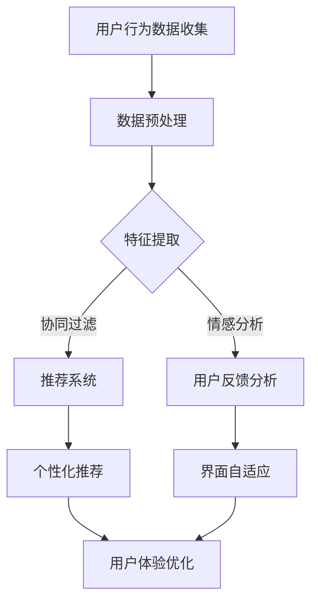

                 

### 背景介绍

#### 机器学习的崛起

机器学习（Machine Learning，ML）是人工智能（Artificial Intelligence，AI）的一个重要分支，近年来在全球范围内迅猛发展。随着计算能力的提升、大数据的涌现以及算法的不断创新，机器学习已经成为推动科技发展的重要力量。它通过构建和训练模型，让计算机系统具备从数据中学习、自动优化和做出预测的能力。

机器学习的应用已经渗透到我们日常生活的方方面面，从搜索引擎、推荐系统到自动驾驶、医疗诊断等。它不仅提升了软件系统的智能化水平，还极大地优化了用户体验，为各行各业带来了巨大的效益。

#### 用户体验优化的重要性

用户体验（User Experience，UX）是衡量软件产品成功与否的重要指标。在竞争激烈的市场中，一个优秀的产品需要提供无缝、愉悦的用户体验，才能赢得用户的青睐。用户体验优化的目标是确保用户在使用产品时感到满意和舒适，从而提高用户留存率、增强品牌忠诚度。

用户体验优化的关键在于理解用户的需求和行为，然后通过个性化的设计、功能和交互来满足这些需求。机器学习在用户体验优化中具有独特的优势，它可以通过分析大量用户数据，发现潜在的用户行为模式和偏好，从而提供更精准、个性化的服务。

#### 机器学习在用户体验优化中的应用现状

目前，机器学习在用户体验优化中的应用已经取得了显著成果。例如，在电子商务领域，机器学习可以分析用户的历史购买记录、搜索行为和浏览习惯，为用户推荐个性化的商品和优惠信息。在社交媒体平台，机器学习算法可以识别用户的兴趣和社交关系，提供个性化的内容推荐和社交建议。在金融服务领域，机器学习可以帮助银行和保险公司更准确地评估风险和预测用户需求，从而提供更优质的客户服务。

总的来说，机器学习在用户体验优化中的应用正不断拓展和深化，为各类应用场景带来了巨大的价值。随着技术的不断进步和应用场景的扩大，机器学习在用户体验优化中的作用将越来越重要。在接下来的章节中，我们将深入探讨机器学习在用户体验优化中的核心概念、算法原理、应用场景以及未来的发展趋势。

### 核心概念与联系

#### 机器学习与用户体验优化的基本概念

在深入探讨机器学习如何优化用户体验之前，我们有必要明确几个核心概念。

**机器学习（Machine Learning）**：机器学习是一种通过数据训练计算机模型，使其具备自动学习和改进能力的技术。它主要分为监督学习（Supervised Learning）、无监督学习（Unsupervised Learning）和强化学习（Reinforcement Learning）等类型。监督学习利用已有标签数据训练模型，无监督学习通过发现数据内在结构进行学习，而强化学习则通过奖励机制进行学习。

**用户体验优化（User Experience Optimization）**：用户体验优化是指通过改进产品界面、功能和交互设计，提升用户在使用产品时的满意度和舒适度。优化的目标包括降低用户的学习成本、提高任务的完成效率和减少用户的压力。

**用户体验（User Experience）**：用户体验是指用户在使用产品或服务过程中的感受、情感和行为。它包括用户界面的易用性（Usability）、内容的价值（Usefulness）和整体的情感体验（Emotional Experience）。

#### 机器学习在用户体验优化中的应用场景

机器学习在用户体验优化中的应用场景广泛，以下是一些典型的例子：

1. **个性化推荐**：通过分析用户的浏览、购买和搜索行为，机器学习算法可以推荐用户可能感兴趣的产品、内容或服务。例如，电子商务平台使用推荐系统来提高销售量和用户参与度。
   
2. **情感分析**：通过自然语言处理技术，机器学习算法可以分析用户评论和反馈，了解用户的情感倾向和满意度。这有助于产品团队快速识别问题并进行改进。

3. **界面自适应**：根据用户的行为和偏好，机器学习算法可以动态调整界面布局、颜色和字体，为用户提供最佳的用户体验。例如，智能手机的壁纸和字体大小可以根据用户的视觉习惯自动调整。

4. **预测性维护**：在软件和硬件产品中，机器学习可以预测故障和问题，从而提前采取措施进行维护，减少用户的停机时间和不便。

#### 机器学习与用户体验优化的联系

机器学习与用户体验优化之间的联系在于，它们都依赖于数据的分析和应用。机器学习通过数据发现模式和规律，从而提供个性化、智能化的解决方案，这些解决方案直接提升了用户体验。

- **数据驱动**：用户体验优化依赖于用户行为数据，而机器学习通过分析这些数据来发现用户的需求和偏好。这种数据驱动的优化方式能够更准确地满足用户需求。

- **实时反馈**：机器学习算法可以实时处理用户行为数据，快速调整产品功能和服务，提供即时、个性化的用户体验。

- **持续改进**：机器学习算法能够不断学习和改进，根据用户反馈和历史数据优化产品，实现用户体验的持续提升。

#### 关键算法和模型

在机器学习应用于用户体验优化的过程中，以下几种算法和模型尤为重要：

1. **协同过滤（Collaborative Filtering）**：通过分析用户的相似性或偏好来推荐产品或内容。

2. **决策树（Decision Tree）**：通过树形结构对用户行为进行分类，帮助产品团队理解用户行为模式。

3. **神经网络（Neural Networks）**：通过模拟人脑神经网络进行复杂模式识别和预测，广泛应用于推荐系统和情感分析。

4. **聚类算法（Clustering Algorithms）**：如K-means、DBSCAN等，通过将用户划分为不同的群体，为个性化推荐提供基础。

#### Mermaid 流程图

为了更好地理解机器学习在用户体验优化中的应用，我们可以使用Mermaid流程图来展示其基本架构。

在这个流程图中，用户行为数据首先经过预处理，然后通过特征提取进行进一步分析。协同过滤和情感分析是核心算法，分别用于个性化推荐和用户反馈分析。最终，这些分析结果被应用于推荐系统、界面自适应和用户体验优化，从而提升整体用户体验。

通过这一节的内容，我们为后续深入探讨机器学习在用户体验优化中的具体应用奠定了基础。接下来，我们将详细解析机器学习的核心算法原理和具体操作步骤，帮助读者更好地理解这一技术的实际应用。

