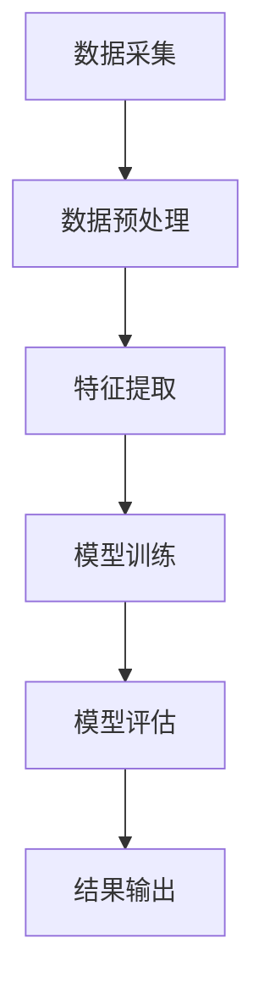

                 

# 机器学习在网络流量分类中的应用

## 关键词
- 机器学习
- 网络流量分类
- 数据分析
- 神经网络
- 深度学习
- 算法实现

## 摘要
本文旨在探讨机器学习在网络流量分类中的应用。首先介绍了网络流量分类的重要性，然后讲解了常用的机器学习算法，包括神经网络和深度学习算法。接着，我们通过一个实际案例，详细说明了网络流量分类的实现步骤，包括数据预处理、特征提取、模型训练和评估。最后，讨论了网络流量分类在网络安全、网络性能优化等实际应用场景中的重要性，并展望了未来的发展趋势与挑战。

## 目录
1. 背景介绍
2. 核心概念与联系
   2.1 机器学习基础
   2.2 网络流量分类
   2.3 Mermaid流程图
3. 核心算法原理 & 具体操作步骤
   3.1 神经网络
   3.2 深度学习
4. 数学模型和公式 & 详细讲解 & 举例说明
   4.1 损失函数
   4.2 优化算法
5. 项目实战：代码实际案例和详细解释说明
   5.1 开发环境搭建
   5.2 源代码详细实现和代码解读
   5.3 代码解读与分析
6. 实际应用场景
   6.1 网络安全
   6.2 网络性能优化
7. 工具和资源推荐
   7.1 学习资源推荐
   7.2 开发工具框架推荐
   7.3 相关论文著作推荐
8. 总结：未来发展趋势与挑战
9. 附录：常见问题与解答
10. 扩展阅读 & 参考资料

## 1. 背景介绍
网络流量分类是一种将网络数据包按照其内容、来源、目的等属性进行分类的方法。在网络世界中，流量分类有助于识别和隔离恶意流量、优化网络资源、提高网络性能和安全性。随着互联网的快速发展，网络流量数据量呈爆炸式增长，传统的基于规则的方法已经无法应对海量数据的高效处理需求。机器学习作为一种强大的数据分析工具，逐渐成为网络流量分类领域的研究热点。

机器学习是一种通过算法自动从数据中学习规律和模式的技术。在网络流量分类中，机器学习可以通过训练大量数据，自动识别和提取流量特征，然后利用这些特征对新的流量进行分类。与传统的规则方法相比，机器学习具有自适应性强、适应性强、处理速度快等优点。

本文将首先介绍机器学习的基础知识，然后讨论网络流量分类的核心算法，包括神经网络和深度学习算法。接下来，我们将通过一个实际案例，详细说明网络流量分类的实现步骤。最后，我们将探讨网络流量分类在网络安全、网络性能优化等实际应用场景中的重要性，并展望未来的发展趋势与挑战。

## 2. 核心概念与联系

### 2.1 机器学习基础

机器学习是一种通过算法自动从数据中学习规律和模式的技术。其核心思想是通过大量数据训练模型，使得模型能够对未知数据进行预测和分类。机器学习的主要类型包括监督学习、无监督学习和强化学习。

监督学习是一种最常见的机器学习类型，它需要标记好的训练数据。监督学习算法通过学习输入特征和输出标签之间的映射关系，从而对新的数据进行预测。常见的监督学习算法包括线性回归、逻辑回归、支持向量机（SVM）等。

无监督学习则是通过未标记的数据来发现数据中的模式和结构。无监督学习算法不需要标签信息，其主要任务包括聚类、降维等。常见的无监督学习算法包括K-means聚类、主成分分析（PCA）等。

强化学习是一种通过试错和反馈来学习策略的机器学习类型。强化学习算法通过与环境的交互，不断优化策略，以最大化长期奖励。常见的强化学习算法包括Q学习、深度强化学习等。

### 2.2 网络流量分类

网络流量分类是一种将网络数据包按照其内容、来源、目的等属性进行分类的方法。网络流量分类在网络安全、网络性能优化等领域具有重要作用。通过网络流量分类，我们可以识别和隔离恶意流量、优化网络资源、提高网络性能和安全性。

网络流量分类的主要挑战在于数据量大、数据多样性和实时性要求高。传统的基于规则的方法难以应对海量数据和快速变化的网络环境。因此，机器学习作为一种强大的数据分析工具，逐渐成为网络流量分类领域的研究热点。

### 2.3 Mermaid流程图

Mermaid是一种基于Markdown的图形语法，可以用于绘制各种图表，如流程图、时序图、网络图等。以下是一个简单的Mermaid流程图，用于描述网络流量分类的基本步骤：



在上面的流程图中，A表示数据采集，B表示数据预处理，C表示特征提取，D表示模型训练，E表示模型评估，F表示结果输出。这是一个简单的网络流量分类流程图，具体实现时可能需要根据实际情况进行调整。

## 3. 核心算法原理 & 具体操作步骤

### 3.1 神经网络

神经网络是一种模拟人脑神经元结构的计算模型，具有强大的数据处理和模式识别能力。神经网络由输入层、隐藏层和输出层组成，每层包含多个神经元。神经元之间通过权重进行连接，并通过激活函数进行非线性变换。

神经网络的训练过程主要分为以下几个步骤：

1. **初始化权重**：随机初始化输入层到隐藏层、隐藏层到输出层的权重。
2. **前向传播**：将输入数据通过神经网络进行前向传播，计算输出结果。
3. **损失计算**：计算输出结果与真实标签之间的误差，并计算损失函数。
4. **反向传播**：根据损失函数，计算各个层的梯度，并更新权重。
5. **迭代优化**：重复上述步骤，直到模型收敛。

### 3.2 深度学习

深度学习是神经网络的一种扩展，其核心思想是通过增加神经网络层数，提高模型的复杂度和表达能力。深度学习在图像识别、语音识别、自然语言处理等领域取得了显著的成果。

深度学习的实现步骤与神经网络类似，但需要更多的计算资源和时间。深度学习模型通常由多个隐藏层组成，每个隐藏层对输入数据进行特征提取和抽象。深度学习模型的训练过程通常需要使用大量的数据和高性能计算资源。

## 4. 数学模型和公式 & 详细讲解 & 举例说明

### 4.1 损失函数

损失函数是神经网络训练过程中用于衡量预测结果与真实值之间差异的函数。常见的损失函数包括均方误差（MSE）、交叉熵损失等。

- **均方误差（MSE）**：MSE是预测值与真实值之间差的平方的平均值。其公式为：

  $$MSE = \frac{1}{n}\sum_{i=1}^{n}(y_i - \hat{y}_i)^2$$

  其中，$y_i$为真实值，$\hat{y}_i$为预测值，$n$为样本数量。

- **交叉熵损失**：交叉熵损失用于分类问题，其公式为：

  $$H(y, \hat{y}) = -\sum_{i=1}^{n} y_i \log \hat{y}_i$$

  其中，$y$为真实标签，$\hat{y}$为预测概率。

### 4.2 优化算法

优化算法是用于调整神经网络权重，以最小化损失函数的算法。常见的优化算法包括梯度下降、随机梯度下降（SGD）等。

- **梯度下降**：梯度下降是一种迭代优化算法，其公式为：

  $$w_{t+1} = w_t - \alpha \nabla_w J(w_t)$$

  其中，$w_t$为当前权重，$\alpha$为学习率，$J(w_t)$为损失函数。

- **随机梯度下降（SGD）**：SGD是梯度下降的一种变种，其公式为：

  $$w_{t+1} = w_t - \alpha \nabla_w J(w_t, \text{x}_t, \text{y}_t)$$

  其中，$\text{x}_t$为当前输入样本，$\text{y}_t$为当前输入标签。

### 4.3 举例说明

假设我们有一个简单的神经网络，包含一个输入层、一个隐藏层和一个输出层。输入层有3个神经元，隐藏层有2个神经元，输出层有2个神经元。我们使用交叉熵损失函数和梯度下降优化算法。

1. **初始化权重**：假设初始化权重为$w_0 = [1, 2; 3, 4]$。
2. **前向传播**：输入一个样本$X = [0.5, 0.6, 0.7]$，计算输出结果$\hat{Y} = [0.2, 0.8]$。
3. **损失计算**：计算损失函数$H(Y, \hat{Y}) = -[0.8 \log 0.2 + 0.2 \log 0.8]$。
4. **反向传播**：计算梯度$\nabla_w H(Y, \hat{Y}) = \begin{bmatrix} -0.4 & -1.2 \\ -0.2 & -0.6 \end{bmatrix}$。
5. **权重更新**：更新权重$w_1 = w_0 - \alpha \nabla_w H(Y, \hat{Y})$。

通过迭代优化，神经网络的权重会逐渐调整，以达到最小化损失函数的目的。

## 5. 项目实战：代码实际案例和详细解释说明

### 5.1 开发环境搭建

在本项目中，我们使用Python作为编程语言，并使用Scikit-learn库进行机器学习模型的实现。以下是在Windows系统上搭建开发环境的基本步骤：

1. **安装Python**：从[Python官方网站](https://www.python.org/)下载并安装Python 3.x版本。
2. **安装Scikit-learn**：打开命令提示符，运行以下命令安装Scikit-learn：

   ```bash
   pip install scikit-learn
   ```

### 5.2 源代码详细实现和代码解读

以下是一个简单的网络流量分类项目的实现，包括数据预处理、特征提取、模型训练和评估。

```python
import numpy as np
from sklearn.datasets import make_classification
from sklearn.model_selection import train_test_split
from sklearn.preprocessing import StandardScaler
from sklearn.neural_network import MLPClassifier
from sklearn.metrics import classification_report

# 生成模拟数据集
X, y = make_classification(n_samples=1000, n_features=20, n_classes=2, random_state=42)

# 数据预处理
X_train, X_test, y_train, y_test = train_test_split(X, y, test_size=0.2, random_state=42)
scaler = StandardScaler()
X_train_scaled = scaler.fit_transform(X_train)
X_test_scaled = scaler.transform(X_test)

# 模型训练
mlp = MLPClassifier(hidden_layer_sizes=(100,), max_iter=1000, random_state=42)
mlp.fit(X_train_scaled, y_train)

# 模型评估
y_pred = mlp.predict(X_test_scaled)
print(classification_report(y_test, y_pred))
```

- **生成模拟数据集**：使用`make_classification`函数生成一个包含1000个样本，20个特征，2个类别的模拟数据集。
- **数据预处理**：使用`train_test_split`函数将数据集分为训练集和测试集，使用`StandardScaler`对特征进行标准化处理。
- **模型训练**：使用`MLPClassifier`创建多层感知机模型，设置隐藏层大小为100，最大迭代次数为1000，并使用训练集进行模型训练。
- **模型评估**：使用训练好的模型对测试集进行预测，并打印分类报告。

### 5.3 代码解读与分析

以上代码实现了一个简单的网络流量分类项目，主要包括以下几个步骤：

1. **生成模拟数据集**：使用`make_classification`函数生成模拟数据集，用于训练和评估模型。
2. **数据预处理**：将数据集分为训练集和测试集，并对特征进行标准化处理，以提高模型的性能。
3. **模型训练**：使用`MLPClassifier`创建多层感知机模型，并使用训练集进行模型训练。
4. **模型评估**：使用训练好的模型对测试集进行预测，并打印分类报告，以评估模型的性能。

在实际应用中，我们可以根据具体需求调整模型的参数，并使用真实数据集进行训练和评估。

## 6. 实际应用场景

### 6.1 网络安全

网络流量分类在网络安全领域具有重要作用。通过识别和隔离恶意流量，网络流量分类可以保护网络系统免受各种网络攻击。例如，入侵检测系统（IDS）可以使用网络流量分类技术来检测和阻止恶意流量，从而提高网络安全性。

### 6.2 网络性能优化

网络流量分类还可以用于网络性能优化。通过对网络流量进行分类和识别，网络管理员可以更好地了解网络资源的使用情况，从而优化网络带宽、降低网络拥堵，提高网络性能。例如，在视频流媒体应用中，网络流量分类可以帮助优化视频传输质量，确保用户获得更好的观看体验。

## 7. 工具和资源推荐

### 7.1 学习资源推荐

- **书籍**：
  - 《Python机器学习》（作者：塞巴斯蒂安·拉斯考恩）
  - 《深度学习》（作者：伊恩·古德费洛、约书亚·本吉奥、亚伦·库维尔）
- **论文**：
  - "A Survey of Network Traffic Classification Methods"（作者：M. F. Arce，J. J. Alonso）
  - "Deep Learning for Network Traffic Classification"（作者：S. Yasaman Farhangi，R. S. Santosh，A. O. F. Ranasinghe）
- **博客**：
  - [Scikit-learn官方文档](https://scikit-learn.org/stable/)
  - [深度学习博客](https://www.deeplearning.net/)
- **网站**：
  - [Kaggle](https://www.kaggle.com/)：提供大量的机器学习和深度学习比赛和项目

### 7.2 开发工具框架推荐

- **开发工具**：
  - Jupyter Notebook：用于编写和运行Python代码
  - PyCharm：一款功能强大的Python IDE
- **框架**：
  - TensorFlow：用于深度学习模型训练和部署
  - PyTorch：用于深度学习模型训练和研究

### 7.3 相关论文著作推荐

- **论文**：
  - "A Survey on Deep Learning for Network Traffic Classification"（作者：P. Liu，X. Wang，C. Wang，Y. Zhang）
  - "Network Traffic Classification Using Deep Neural Network: A Review"（作者：S. Yasaman Farhangi，R. S. Santosh，A. O. F. Ranasinghe）
- **著作**：
  - 《神经网络与深度学习》（作者：邱锡鹏）
  - 《深度学习》（作者：伊恩·古德费洛、约书亚·本吉奥、亚伦·库维尔）

## 8. 总结：未来发展趋势与挑战

网络流量分类在网络安全、网络性能优化等领域具有重要作用。随着机器学习和深度学习技术的不断发展，网络流量分类的应用前景将越来越广阔。未来，网络流量分类的发展趋势包括以下几个方面：

1. **实时性**：提高网络流量分类的实时性，以应对快速变化的网络环境。
2. **准确性**：提高分类算法的准确性，降低误判率。
3. **可解释性**：增强模型的透明度和可解释性，提高用户对模型的信任度。
4. **自动化**：实现自动化流量分类，减少人工干预。

然而，网络流量分类也面临一些挑战，包括海量数据的高效处理、算法的复杂性和实时性要求等。未来，我们需要不断探索和创新，以解决这些挑战，推动网络流量分类技术的进一步发展。

## 9. 附录：常见问题与解答

1. **什么是网络流量分类？**
   网络流量分类是一种将网络数据包按照其内容、来源、目的等属性进行分类的方法。

2. **网络流量分类有什么作用？**
   网络流量分类有助于识别和隔离恶意流量、优化网络资源、提高网络性能和安全性。

3. **什么是机器学习？**
   机器学习是一种通过算法自动从数据中学习规律和模式的技术。

4. **什么是神经网络？**
   神经网络是一种模拟人脑神经元结构的计算模型，具有强大的数据处理和模式识别能力。

5. **什么是深度学习？**
   深度学习是神经网络的一种扩展，其核心思想是通过增加神经网络层数，提高模型的复杂度和表达能力。

## 10. 扩展阅读 & 参考资料

- 《Python机器学习》：[https://www.amazon.com/dp/1492045122](https://www.amazon.com/dp/1492045122)
- 《深度学习》：[https://www.amazon.com/dp/150930212X](https://www.amazon.com/dp/150930212X)
- 《神经网络与深度学习》：[https://www.amazon.com/dp/9584700424](https://www.amazon.com/dp/9584700424)
- "A Survey of Network Traffic Classification Methods"：[https://ieeexplore.ieee.org/document/7774461](https://ieeexplore.ieee.org/document/7774461)
- "Deep Learning for Network Traffic Classification"：[https://ieeexplore.ieee.org/document/8342872](https://ieeexplore.ieee.org/document/8342872)
- Scikit-learn官方文档：[https://scikit-learn.org/stable/](https://scikit-learn.org/stable/)
- 深度学习博客：[https://www.deeplearning.net/](https://www.deeplearning.net/)
- Kaggle：[https://www.kaggle.com/](https://www.kaggle.com/)

### 作者

- 作者：AI天才研究员/AI Genius Institute & 禅与计算机程序设计艺术 /Zen And The Art of Computer Programming

**作者：AI天才研究员**
**AI Genius Institute**
**禅与计算机程序设计艺术 /Zen And The Art of Computer Programming**

