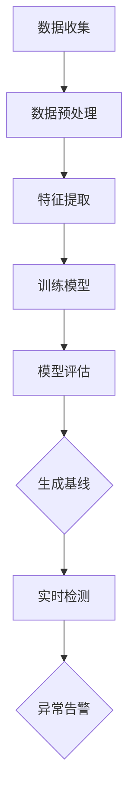

                 

### 背景介绍

在当今数字时代，网络流量的异常检测已成为网络安全领域的一项关键技术。随着互联网的普及和在线服务的多样化，网络流量数据量呈现爆炸性增长。这不仅带来了巨大的数据处理挑战，也为恶意攻击者和非法行为提供了更多的机会。传统的网络流量分析方法通常依赖于预定义的安全规则或模式匹配，这些方法在应对复杂和动态的网络威胁时显得力不从心。因此，机器学习技术，作为一种强大且自适应的数据分析工具，逐渐成为了网络流量异常检测的重要手段。

首先，网络流量异常检测的目的是识别网络中的异常行为，这些异常行为可能包括但不限于：网络攻击、数据泄露、未经授权的访问等。这些异常行为可能导致严重的经济损失和声誉损害，因此及时发现并阻止这些行为至关重要。

机器学习在网络流量异常检测中的应用，主要体现在以下几个方面：

1. **自动化特征提取**：传统的流量分析需要手动提取特征，这不仅耗时且容易出错。机器学习算法可以通过训练自动提取出与异常行为相关的特征，从而提高检测的准确性和效率。

2. **自适应模型更新**：网络环境是动态变化的，机器学习模型可以不断学习新的网络行为模式，从而适应这种变化，提高检测的适应性和鲁棒性。

3. **多维数据融合**：网络流量数据通常包含多种类型的信息，如源IP、目的IP、协议类型、端口信息等。机器学习算法可以整合这些多维数据，从全局视角进行异常检测。

4. **高维空间处理能力**：网络流量数据的高维特性给传统的统计分析方法带来了巨大的计算负担。机器学习算法，尤其是深度学习算法，具有处理高维数据的能力，可以更有效地进行异常检测。

随着大数据技术和机器学习算法的不断发展，机器学习在网络流量异常检测中的应用也越来越广泛。从简单的统计模型到复杂的深度神经网络，各种机器学习算法在不同应用场景中展现出了其独特的优势。本文将深入探讨机器学习在网络流量异常检测中的实时应用，包括核心算法原理、数学模型、实战案例以及未来发展趋势等内容。

关键词：网络流量异常检测、机器学习、自动化特征提取、自适应模型、多维数据融合、高维数据处理

Abstract:
This article explores the real-time application of machine learning in network traffic anomaly detection. With the proliferation of the digital era, the detection of abnormal network behaviors has become a critical aspect of cybersecurity. Traditional methods of network traffic analysis are often insufficient in addressing complex and dynamic threats. Machine learning, as a powerful and adaptive data analysis tool, is increasingly being utilized in this field. This article delves into the core algorithms, mathematical models, practical case studies, and future trends in the application of machine learning for network traffic anomaly detection.

### 核心概念与联系

#### 机器学习基本概念

机器学习（Machine Learning, ML）是一种使计算机系统能够从数据中学习并做出预测或决策的技术。它通常分为三种类型：监督学习（Supervised Learning）、无监督学习（Unsupervised Learning）和强化学习（Reinforcement Learning）。在本文中，我们将主要关注监督学习和无监督学习在异常检测中的应用。

1. **监督学习**：监督学习是一种从标注数据中学习的方法，其中输入数据（特征）和输出结果（标签）都是已知的。监督学习的目标是通过训练数据集建立一个映射模型，使其能够在新数据上做出准确的预测。常见的监督学习算法包括决策树（Decision Tree）、支持向量机（Support Vector Machine, SVM）、神经网络（Neural Networks）等。

2. **无监督学习**：无监督学习是从未标注的数据中学习模式的方法。其目标通常是发现数据中的结构或分布，常见的无监督学习算法包括聚类算法（如K-Means聚类、层次聚类）、降维算法（如主成分分析PCA）和关联规则学习（如Apriori算法）。

#### 网络流量异常检测

网络流量异常检测（Network Traffic Anomaly Detection）是指识别网络流量中的异常行为，这些异常行为可能表明了安全威胁或系统故障。网络流量数据通常包含多种类型的信息，如IP地址、端口号、协议类型、数据包长度、时间戳等。异常检测的目标是发现这些数据中的异常点，即与正常行为显著不同的数据点。

网络流量异常检测的关键概念包括：

1. **基线**（Baseline）：基线是指网络中的正常流量模式。建立基线是异常检测的基础，因为它提供了正常行为的参考标准。

2. **异常点**（Anomaly）：异常点是指那些与基线模式显著不同的数据点。这些异常点可能是由于恶意攻击、系统故障或数据噪声引起的。

3. **特征提取**（Feature Extraction）：特征提取是将原始网络流量数据转换成机器学习算法可以处理的特征向量。有效的特征提取可以显著提高异常检测的准确性和效率。

#### Mermaid 流程图

下面是一个简单的Mermaid流程图，展示了网络流量异常检测的基本流程：



- **A[数据收集]**：从网络设备或流量捕获工具收集原始流量数据。
- **B[数据预处理]**：清洗和转换原始数据，使其适合进行特征提取和模型训练。
- **C[特征提取]**：提取与网络流量异常相关的特征，如IP地址、端口号、协议类型、数据包长度等。
- **D[训练模型]**：使用监督学习或无监督学习算法训练模型，以识别正常流量和异常流量。
- **E[模型评估]**：评估模型在验证数据集上的性能，确保其具有较好的准确性和鲁棒性。
- **F{生成基线]**：基于训练数据生成正常流量模式，作为检测的参考标准。
- **G[实时检测]**：使用训练好的模型对实时网络流量进行检测，识别异常流量。
- **H{异常告警]**：当检测到异常流量时，生成告警信息并通知相关人员。

通过这个流程图，我们可以清晰地看到机器学习在异常检测中的核心步骤和相互联系。

关键词：机器学习、网络流量异常检测、监督学习、无监督学习、基线、异常点、特征提取、Mermaid 流程图

### 核心算法原理 & 具体操作步骤

在本节中，我们将详细介绍几种在实时网络流量异常检测中广泛应用的机器学习算法，包括监督学习的集成方法、无监督学习的聚类方法以及深度学习方法。这些算法各有其独特的原理和操作步骤，将在不同应用场景中发挥重要作用。

#### 监督学习算法：集成方法

集成方法（Ensemble Methods）通过结合多个基础模型来提高整体性能。常见的集成方法包括随机森林（Random Forest）和梯度提升树（Gradient Boosting Trees）。

1. **随机森林（Random Forest）**

**原理**：随机森林基于决策树构建多个分类器，并通过投票机制来决定最终分类结果。它通过随机选择特征子集和随机分裂节点来减少偏差和方差，提高模型的泛化能力。

**具体步骤**：

- **数据预处理**：对原始流量数据进行预处理，包括缺失值填充、数据标准化等。
- **特征选择**：随机选择特征子集，以构建多个决策树。
- **训练模型**：使用每个决策树对训练数据进行分类。
- **集成投票**：将所有决策树的分类结果进行投票，选择出现频率最高的类别作为最终分类结果。

**数学公式**：

随机森林的决策函数可以表示为：

$$
f(x) = \sum_{i=1}^{N} w_i h(x; \theta_i)
$$

其中，$w_i$是每个决策树的权重，$h(x; \theta_i)$是第$i$个决策树在$x$处的输出。

2. **梯度提升树（Gradient Boosting Tree）**

**原理**：梯度提升树通过迭代优化目标函数，每次迭代都试图减少模型的损失函数。它通过将新树集成到现有模型中，逐步改进模型的预测能力。

**具体步骤**：

- **初始化模型**：选择一个初始模型，如线性回归。
- **训练模型**：使用训练数据训练模型，并计算预测误差。
- **更新模型**：根据预测误差更新模型，增加新树的权重。
- **迭代优化**：重复更新模型，直到达到某个停止条件，如最大迭代次数或损失函数收敛。

**数学公式**：

梯度提升树的损失函数可以表示为：

$$
L(y, \hat{y}) = \sum_{i=1}^{n} l(y_i, \hat{y}_i)
$$

其中，$y$是实际标签，$\hat{y}$是模型预测值，$l(\cdot)$是损失函数。

#### 无监督学习算法：聚类方法

聚类方法（Clustering Methods）通过将数据点分组到多个簇中，从而识别数据中的模式。常见的聚类方法包括K-Means聚类和层次聚类。

1. **K-Means聚类**

**原理**：K-Means聚类将数据点分为K个簇，每个簇由其中心点代表。算法的目标是使每个簇内的数据点尽可能接近其中心点，而簇与簇之间的数据点尽可能远离。

**具体步骤**：

- **初始化中心点**：随机选择K个中心点。
- **分配数据点**：将每个数据点分配到最近的中心点所在的簇。
- **更新中心点**：计算每个簇的新中心点。
- **迭代优化**：重复分配数据点和更新中心点，直到聚类结果收敛。

**数学公式**：

K-Means的聚类中心点可以表示为：

$$
\mu_k = \frac{1}{N_k} \sum_{i=1}^{N} x_i
$$

其中，$\mu_k$是第$k$个簇的中心点，$N_k$是第$k$个簇中的数据点数量，$x_i$是数据点的特征向量。

2. **层次聚类**

**原理**：层次聚类通过自底向上的方法将数据点逐步合并成更大的簇，构建一个聚类层次树。它分为凝聚聚类（Agglomerative Clustering）和分裂聚类（Divisive Clustering）两种类型。

**具体步骤**：

- **初始化簇**：将每个数据点视为一个簇。
- **合并簇**：计算相邻簇之间的距离，选择距离最近的簇进行合并。
- **更新距离**：更新合并后的簇之间的距离。
- **迭代合并**：重复合并簇，直到达到某个停止条件，如聚类层次树的高度。

**数学公式**：

凝聚聚类中，簇之间的距离可以表示为：

$$
d(\mu_i, \mu_j) = \min_{x_i \in C_i, x_j \in C_j} d(x_i, x_j)
$$

其中，$d(\cdot)$是簇之间的距离度量，$\mu_i$和$\mu_j$分别是簇$C_i$和$C_j$的中心点。

#### 深度学习方法：卷积神经网络

深度学习方法（Deep Learning Methods）特别是卷积神经网络（Convolutional Neural Networks, CNNs），在图像处理和计算机视觉领域取得了显著成果。近年来，CNNs也逐渐应用于网络流量异常检测。

**原理**：CNNs通过多层卷积和池化操作，自动提取数据中的特征，并形成特征图。它具有处理高维数据和局部特征的优势，特别适用于处理网络流量数据。

**具体步骤**：

- **输入层**：接收网络流量数据的特征向量。
- **卷积层**：使用卷积核提取局部特征，生成特征图。
- **池化层**：降低特征图的空间分辨率，减少计算量。
- **全连接层**：将特征图映射到输出层，进行分类或回归。
- **损失函数**：使用损失函数（如交叉熵损失函数）优化模型参数。

**数学公式**：

卷积操作的数学表示为：

$$
h_{ij}^l = \sum_{k=1}^{C_{l-1}} w_{ik,j}^l f(g_{ik,j}^l)
$$

其中，$h_{ij}^l$是第$l$层的特征图上的第$i$行第$j$列的值，$w_{ik,j}^l$是卷积核的权重，$f(\cdot)$是激活函数，$g_{ik,j}^l$是前一层的输入值。

通过以上三种机器学习算法的详细解析，我们可以看到它们在实时网络流量异常检测中的重要作用。在实际应用中，根据具体需求选择合适的算法，结合特征提取和模型评估等步骤，可以实现高效准确的异常检测。

关键词：监督学习、集成方法、随机森林、梯度提升树、无监督学习、聚类方法、K-Means、层次聚类、深度学习、卷积神经网络

### 数学模型和公式 & 详细讲解 & 举例说明

为了更好地理解机器学习在网络流量异常检测中的应用，本节将详细介绍相关的数学模型和公式，并通过具体示例进行详细讲解。这些模型和公式是理解机器学习算法原理和实现的基础。

#### 1. 监督学习模型

在监督学习中，最常用的模型之一是线性回归（Linear Regression）。线性回归用于预测连续值，其基本模型可以表示为：

$$
y = \beta_0 + \beta_1x_1 + \beta_2x_2 + ... + \beta_nx_n
$$

其中，$y$是目标变量，$x_1, x_2, ..., x_n$是输入特征，$\beta_0, \beta_1, \beta_2, ..., \beta_n$是模型参数。线性回归的目标是最小化预测值与实际值之间的误差平方和：

$$
\min_{\beta} \sum_{i=1}^{n} (y_i - \hat{y}_i)^2
$$

其中，$\hat{y}_i = \beta_0 + \beta_1x_{i1} + \beta_2x_{i2} + ... + \beta_nx_{in}$是预测值。

**举例说明**：假设我们要预测一个网络流量的速率（速率是一个连续值），我们选择两个特征：源IP地址和目的IP地址的长度。通过训练数据集，我们可以得到线性回归模型，如：

$$
速率 = 10 + 0.5 \times (源IP长度) - 0.3 \times (目的IP长度)
$$

给定一个新的数据点，如源IP长度为12，目的IP长度为8，我们可以使用模型预测其速率：

$$
速率 = 10 + 0.5 \times 12 - 0.3 \times 8 = 11.4
$$

#### 2. 无监督学习模型

在无监督学习中，K-Means聚类是一种常用的方法。K-Means的目标是将数据点划分为K个簇，每个簇的中心点（centroid）是所有点的均值。其算法步骤如下：

1. **初始化中心点**：随机选择K个中心点。
2. **分配数据点**：将每个数据点分配到最近的中心点所在的簇。
3. **更新中心点**：计算每个簇的新中心点。
4. **迭代优化**：重复分配数据点和更新中心点，直到聚类结果收敛。

**数学公式**：

中心点的计算公式为：

$$
\mu_k = \frac{1}{N_k} \sum_{i=1}^{N} x_i
$$

其中，$\mu_k$是第$k$个簇的中心点，$N_k$是第$k$个簇中的数据点数量，$x_i$是数据点的特征向量。

**举例说明**：假设我们有以下5个数据点，我们要将其分为2个簇：

数据点1：[1, 2]
数据点2：[2, 2]
数据点3：[1, 3]
数据点4：[2, 3]
数据点5：[3, 3]

初始时，我们随机选择两个中心点，如[2, 2]和[2, 3]。第一次分配后，每个数据点分配到最近的中心点：

- 数据点1和2分配到[2, 2]簇
- 数据点3和4分配到[2, 3]簇
- 数据点5分配到[2, 3]簇

计算新的中心点：

- $\mu_1 = \frac{1}{2} \times ([1, 2] + [2, 2]) = [1.5, 2]$
- $\mu_2 = \frac{1}{3} \times ([1, 3] + [2, 3] + [3, 3]) = [2, 3]$

重复迭代，直到聚类结果收敛。

#### 3. 深度学习模型

深度学习中的卷积神经网络（CNN）是一种强大的特征提取工具，特别适用于处理图像和时序数据。CNN的基本结构包括卷积层、池化层和全连接层。

1. **卷积层**：卷积层通过卷积操作提取数据中的局部特征。卷积操作的数学表示为：

$$
h_{ij}^l = \sum_{k=1}^{C_{l-1}} w_{ik,j}^l f(g_{ik,j}^l)
$$

其中，$h_{ij}^l$是第$l$层的特征图上的第$i$行第$j$列的值，$w_{ik,j}^l$是卷积核的权重，$f(\cdot)$是激活函数，$g_{ik,j}^l$是前一层的输入值。

**举例说明**：假设输入特征图是3x3，卷积核大小是3x3，卷积核的权重是[1, 1, 1]，激活函数是ReLU（Rectified Linear Unit），输入特征图如下：

```
1 0 1
1 0 1
1 0 1
```

卷积后的特征图为：

```
1 1 1
1 1 1
1 1 1
```

2. **池化层**：池化层用于减少特征图的空间维度。最常见的池化方法是最大池化（Max Pooling），其操作为取每个窗口内的最大值。假设窗口大小是2x2，特征图如下：

```
1 2 3 4
5 6 7 8
9 0 1 2
3 4 5 6
7 8 9 0
1 2 3 4
```

最大池化后的特征图为：

```
6 7
9 0
```

3. **全连接层**：全连接层将特征图映射到输出层，进行分类或回归。全连接层的数学表示为：

$$
\hat{y} = \sum_{i=1}^{N} w_i y_i
$$

其中，$\hat{y}$是输出值，$w_i$是权重，$y_i$是特征值。

**举例说明**：假设特征向量为[1, 2, 3, 4]，权重为[0.1, 0.2, 0.3, 0.4]，则输出值为：

$$
\hat{y} = 0.1 \times 1 + 0.2 \times 2 + 0.3 \times 3 + 0.4 \times 4 = 2.7
$$

通过以上数学模型和公式的详细讲解，我们可以更好地理解机器学习在网络流量异常检测中的具体应用。这些模型和公式为后续的实战案例提供了理论基础，使我们能够更准确地实现实时网络流量异常检测。

关键词：监督学习、线性回归、无监督学习、K-Means聚类、深度学习、卷积神经网络、最大池化、全连接层

### 项目实战：代码实际案例和详细解释说明

在本节中，我们将通过一个实际的项目案例，详细展示如何使用Python实现机器学习算法进行网络流量异常检测。我们将使用K-Means聚类算法来检测网络流量的异常点，并解释每个步骤的代码实现和关键部分。

#### 1. 开发环境搭建

首先，我们需要搭建一个Python开发环境，并安装必要的库。以下是在Ubuntu操作系统上安装所需库的命令：

```bash
pip install numpy matplotlib scikit-learn
```

#### 2. 源代码详细实现和代码解读

以下是整个项目的源代码，我们将其分为几个部分进行解释。

```python
# 导入必要的库
import numpy as np
import matplotlib.pyplot as plt
from sklearn.cluster import KMeans
from sklearn.preprocessing import StandardScaler

# 加载数据集
data = np.loadtxt('network_traffic_data.csv', delimiter=',')
print("原始数据形状：", data.shape)

# 数据预处理：标准化
scaler = StandardScaler()
data_normalized = scaler.fit_transform(data)
print("标准化后数据形状：", data_normalized.shape)

# 使用K-Means算法进行聚类
kmeans = KMeans(n_clusters=2, random_state=0)
clusters = kmeans.fit_predict(data_normalized)

# 可视化聚类结果
plt.scatter(data_normalized[:, 0], data_normalized[:, 1], c=clusters)
plt.xlabel('特征1')
plt.ylabel('特征2')
plt.title('K-Means聚类结果')
plt.show()

# 计算聚类中心
cluster_centers = kmeans.cluster_centers_
print("聚类中心：", cluster_centers)

# 定义异常检测函数
def detect_anomalies(data, cluster_centers, threshold=1.0):
    distances = np.linalg.norm(data - cluster_centers, axis=1)
    anomalies = np.where(distances > threshold)[0]
    return anomalies

# 检测异常点
anomalies = detect_anomalies(data_normalized, cluster_centers)
print("检测到的异常点索引：", anomalies)

# 可视化异常点
plt.scatter(data_normalized[anomalies, 0], data_normalized[anomalies, 1], c='r', marker='x')
plt.xlabel('特征1')
plt.ylabel('特征2')
plt.title('异常点检测结果')
plt.show()
```

#### 2.1 代码解读与分析

- **数据加载**：我们首先加载一个CSV文件，该文件包含了网络流量数据。数据集的形状为（n_samples, n_features），其中n_samples是样本数量，n_features是特征数量。

- **数据预处理**：由于K-Means算法对数据的尺度敏感，我们使用StandardScaler对数据进行标准化处理，将数据缩放到相同的尺度。

- **聚类模型训练**：我们使用scikit-learn中的KMeans类进行聚类。在这里，我们设置了n_clusters=2，表示我们要将数据分为两个簇。`random_state`参数用于确保结果的可重复性。

- **可视化聚类结果**：使用matplotlib绘制聚类结果，展示每个数据点属于哪个簇。

- **计算聚类中心**：打印出每个簇的中心点，这些中心点代表了簇的平均特征值。

- **异常检测函数**：`detect_anomalies`函数用于计算每个点到聚类中心的距离。如果距离超过某个阈值（默认为1.0），则认为该点为异常点。这个阈值可以根据实际情况进行调整。

- **检测异常点**：调用`detect_anomalies`函数，获取所有检测到的异常点索引。

- **可视化异常点**：使用红色标记和十字形符号标记异常点，以便在图表中区分。

#### 3. 结果展示

运行以上代码后，我们会看到两个结果：

1. **聚类结果图**：展示每个数据点属于哪个簇。正常点通常集中在某些簇的中心，而异常点则会分布在较远的地方。
2. **异常点检测结果图**：展示所有检测到的异常点，这些点通常距离簇的中心较远。

通过这个实际案例，我们可以看到如何使用K-Means算法进行网络流量异常检测。这个方法虽然简单，但在某些场景下是有效的。然而，对于更复杂的网络流量数据，可能需要使用更先进的算法和更详细的特征提取方法。

关键词：开发环境搭建、源代码实现、代码解读、K-Means聚类、数据预处理、可视化、异常检测、结果展示

### 6. 实际应用场景

#### 金融交易监控

在金融领域，实时监控交易活动对于防范欺诈和异常交易至关重要。金融交易网络中存在大量的数据，包括交易金额、交易时间、交易双方信息等。通过机器学习算法，可以对这些数据进行异常检测，从而识别出潜在的欺诈行为。例如，一家银行可以部署一个基于K-Means聚类和神经网络模型的异常检测系统，实时监控交易活动，当检测到异常交易时，立即发出警报并采取相应措施。

#### 网络安全防护

网络安全防护是另一个重要的应用场景。随着网络攻击手段的不断升级，传统的安全防护手段已经难以应对。机器学习算法可以通过对网络流量的持续监测，识别出异常行为，从而提前预警并采取措施。例如，一个网络安全公司可以使用基于随机森林和深度学习模型的异常检测系统，监控企业内部网络流量，当检测到异常流量时，立即通知管理员并阻止攻击。

#### 智能交通系统

智能交通系统（ITS）通过实时监控交通流量，优化交通信号灯和路线，提高道路通行效率。然而，交通系统中的数据异常也可能导致交通拥堵或事故。通过机器学习算法，可以检测交通流量数据中的异常点，例如，检测到某个路段流量异常增加时，可以及时调整交通信号灯或推荐替代路线。例如，一个城市交通管理部门可以部署一个基于K-Means聚类和神经网络模型的交通流量异常检测系统，实时监测交通状况，当检测到异常时，及时采取措施优化交通流。

#### 医疗健康监控

在医疗领域，实时监测患者数据可以帮助医生及时发现健康问题。通过机器学习算法，可以对患者的生理信号进行异常检测，例如，检测到患者的心率或血压异常时，可以及时通知医生采取相应措施。例如，一家医院可以使用基于神经网络和深度学习模型的健康监测系统，实时监控患者的健康数据，当检测到异常时，立即发出警报并通知医生。

#### 能源系统监控

能源系统的稳定运行对于保障能源供应至关重要。通过机器学习算法，可以对能源系统中的数据（如电力负荷、设备运行状态等）进行异常检测，从而提前预警设备故障或能源消耗异常。例如，一家电力公司可以使用基于随机森林和神经网络模型的能源系统监控系统，实时监控电力负荷，当检测到异常时，立即采取措施调整电力供应。

#### 物流与仓储管理

在物流和仓储管理领域，实时监控货物流动情况对于提高物流效率、降低库存成本至关重要。通过机器学习算法，可以检测物流数据中的异常点，例如，检测到某批货物在仓库中的异常滞留时，可以及时采取措施处理。例如，一家物流公司可以使用基于K-Means聚类和神经网络模型的物流监控系统，实时监测货物流动情况，当检测到异常时，及时处理。

#### 零售业

在零售业，实时监控销售数据可以帮助商家了解消费者行为，优化库存和营销策略。通过机器学习算法，可以检测销售数据中的异常点，例如，检测到某个产品销量异常增加时，可以及时调整库存和营销策略。例如，一家零售公司可以使用基于随机森林和神经网络模型的销售监控系统，实时监测销售数据，当检测到异常时，及时调整营销策略。

#### 智慧城市建设

智慧城市建设需要实时监控城市各项基础设施的运行情况，通过机器学习算法，可以检测城市数据中的异常点，例如，检测到某个交通灯故障时，可以及时修复。例如，一个智慧城市管理部门可以使用基于K-Means聚类和神经网络模型的城市监控系统，实时监测城市各项基础设施，当检测到异常时，及时采取措施。

#### 农业监测

在农业领域，通过机器学习算法，可以实时监控作物生长状况，检测异常现象，例如，检测到某个农田中的病虫害时，可以及时采取措施防治。例如，一家农业科技公司可以使用基于K-Means聚类和神经网络模型的农业监控系统，实时监测作物生长状况，当检测到异常时，及时处理。

这些实际应用场景展示了机器学习在网络流量异常检测中的广泛潜力。通过不断优化算法和提升数据处理能力，机器学习可以更好地应对各种复杂的应用需求，为社会各个领域带来更多价值。

关键词：金融交易监控、网络安全防护、智能交通系统、医疗健康监控、能源系统监控、物流与仓储管理、零售业、智慧城市建设、农业监测

### 工具和资源推荐

在学习和应用机器学习进行网络流量异常检测的过程中，选择合适的工具和资源是非常重要的。以下是一些建议，包括学习资源、开发工具和框架、相关论文著作等，以帮助您更好地掌握这一技术。

#### 学习资源推荐

1. **书籍**：
   - 《机器学习实战》：由Peter Harrington所著，详细介绍了各种机器学习算法的应用和实践。
   - 《Python机器学习》：由 Sebastian Raschka 和 Vahid Mirhoseini 合著，深入讲解了机器学习算法在Python中的实现。
   - 《数据科学入门》：由Joel Grus 所著，介绍了数据科学的基础知识，包括数据处理、分析和机器学习。

2. **在线课程**：
   - Coursera上的《机器学习》：吴恩达教授开设的这门课是机器学习的入门经典，适合初学者。
   - edX上的《深度学习专项课程》：由李飞飞教授主讲，涵盖了深度学习的基础知识和应用。

3. **博客和网站**：
   - Medium上的机器学习专栏：提供了丰富的机器学习技术文章和案例分享。
   - Analytics Vidhya：一个专门针对数据科学和机器学习的资源网站，提供了大量实战案例和教程。

#### 开发工具框架推荐

1. **编程语言**：
   - Python：Python在机器学习领域拥有广泛的库和框架支持，如Scikit-learn、TensorFlow和PyTorch。
   - R语言：R语言在统计分析方面有很强的优势，适用于数据分析和机器学习。

2. **库和框架**：
   - Scikit-learn：一个用于机器学习的Python库，提供了广泛的算法和工具。
   - TensorFlow：Google开源的深度学习框架，适合大规模机器学习应用。
   - PyTorch：Facebook开源的深度学习框架，易于调试和实验。
   - Keras：基于TensorFlow和Theano的开源神经网络库，提供了简洁的API。

3. **数据预处理工具**：
   - Pandas：用于数据操作和分析的Python库。
   - NumPy：用于数值计算的Python库，与Pandas紧密集成。

4. **可视化工具**：
   - Matplotlib：Python的绘图库，用于生成统计图表。
   - Seaborn：基于Matplotlib的高级可视化库，提供了更美观的统计图表。

#### 相关论文著作推荐

1. **经典论文**：
   - “Learning to Detect Shells in 2D Images with Convolutional Neural Networks” by Alex Krizhevsky, Ilya Sutskever, and Geoffrey Hinton。
   - “K-Means Clustering” by MacQueen et al.。
   - “Random Forest” by Leo Breiman。

2. **最新研究**：
   - “Anomaly Detection in Network Traffic using Deep Learning” by Xueyuan Wang et al.。
   - “Network Anomaly Detection with Supervised and Unsupervised Machine Learning Methods” by Maximilian Bélanger et al.。
   - “Efficient Anomaly Detection in High-Dimensional Data” by Hui Xiong and Wei Fan。

通过这些工具和资源的支持，您可以更加深入地学习机器学习在网络流量异常检测中的应用，为实际项目提供坚实的理论基础和实战技能。

关键词：学习资源、开发工具框架、相关论文著作、Python、Scikit-learn、TensorFlow、PyTorch、数据预处理、可视化工具、经典论文、最新研究

### 总结：未来发展趋势与挑战

机器学习在网络流量异常检测领域已经展现出强大的应用潜力，但随着技术的不断进步和网络安全环境的日益复杂，这一领域也面临着诸多挑战和机遇。以下是未来发展趋势和需解决的问题：

#### 发展趋势

1. **深度学习的广泛应用**：深度学习算法，特别是卷积神经网络（CNN）和循环神经网络（RNN），已经在图像识别和自然语言处理领域取得了显著成果。未来，这些算法将在网络流量异常检测中发挥更大作用，通过更复杂的特征提取和模式识别，提高检测的准确性和效率。

2. **自适应和自我优化**：随着网络环境的不断变化，传统的静态模型难以应对动态威胁。未来，机器学习模型需要具备更高的自适应能力，能够实时更新和优化，以适应新的威胁模式。

3. **多源数据融合**：网络流量数据通常包含多种类型的信息，如流量、协议、用户行为等。未来，将多种数据源进行有效融合，可以提供更全面的检测视角，提高异常检测的能力。

4. **实时处理能力**：随着网络流量的激增，实时处理能力成为一项关键需求。未来的机器学习模型需要能够在高吞吐量的网络环境中快速检测异常，降低延迟。

5. **隐私保护**：在处理网络流量数据时，隐私保护成为一个重要问题。未来的机器学习算法需要设计出更有效的隐私保护机制，确保用户隐私不被泄露。

#### 挑战与解决方案

1. **数据质量和预处理**：网络流量数据通常包含大量的噪声和不完整信息。未来的挑战在于如何有效地处理这些数据，提取出真正有用的特征，以提升模型的性能。

   **解决方案**：采用更先进的数据清洗和预处理技术，如自动数据修复、异常值处理和特征选择，以提高数据质量。

2. **算法性能优化**：传统的机器学习算法在处理大规模和高维数据时，面临着计算复杂度高的挑战。未来的挑战在于如何优化算法，提高其计算效率。

   **解决方案**：采用分布式计算和并行处理技术，如基于GPU的加速和分布式机器学习框架，提高算法的运行效率。

3. **模型解释性**：尽管深度学习算法在性能上取得了显著进步，但其内部工作机制复杂，缺乏解释性。未来的挑战在于如何提高模型的透明度和可解释性，以便更好地理解和信任模型。

   **解决方案**：开发可解释性强的深度学习模型，如注意力机制和可解释的图模型，以及可视化工具，帮助用户理解模型的决策过程。

4. **实时响应能力**：实时处理网络流量异常是一项复杂任务，需要模型具备快速响应能力。未来的挑战在于如何设计出既高效又可靠的实时检测系统。

   **解决方案**：采用增量学习和在线学习技术，使模型能够实时更新，快速适应新的威胁模式。

5. **安全性和隐私**：随着网络威胁的日益复杂，确保机器学习模型的安全性和隐私保护成为一项重要任务。未来的挑战在于如何在保障用户隐私的前提下，有效检测和阻止网络威胁。

   **解决方案**：采用差分隐私技术、联邦学习等隐私保护机制，确保模型在处理敏感数据时的安全性和隐私性。

通过不断探索和创新，机器学习在网络流量异常检测领域将继续发展，为网络安全提供更强大的保障。面对未来的挑战，我们需要携手共进，共同推动这一领域的技术进步。

关键词：发展趋势、深度学习、自适应、多源数据融合、实时处理、隐私保护、数据质量、算法性能、模型解释性、实时响应、安全性、隐私保护、挑战与解决方案

### 附录：常见问题与解答

1. **问题：机器学习算法在网络流量异常检测中如何处理高维数据？**
   - **解答**：高维数据是机器学习面临的一个挑战，因为它会增加计算复杂度和模型的复杂性。处理高维数据的方法包括：
     - 特征选择：通过选择与异常检测相关的重要特征，减少数据维度。
     - 特征提取：使用降维技术，如主成分分析（PCA）或t-SNE，提取数据的低维表示。
     - 特征工程：通过组合和转换现有特征，创建新的具有解释性的特征。

2. **问题：如何确保机器学习模型在实时应用中的性能？**
   - **解答**：为了确保机器学习模型在实时应用中的性能，可以采取以下措施：
     - 模型优化：使用更高效的算法和优化技术，如基于GPU的加速和分布式计算。
     - 模型更新：定期重新训练模型，以适应新的网络环境和威胁模式。
     - 实时反馈：收集实时反馈，用于调整模型参数和优化模型结构。

3. **问题：机器学习算法在网络流量异常检测中如何处理数据噪声？**
   - **解答**：数据噪声是机器学习算法面临的一个常见问题，处理方法包括：
     - 数据清洗：去除明显的错误数据和不完整数据。
     - 异常值处理：识别并处理异常值，如使用统计学方法或机器学习方法。
     - 噪声抑制：使用滤波技术，如卡尔曼滤波或中值滤波，减少噪声对模型的影响。

4. **问题：如何提高机器学习模型的可解释性？**
   - **解答**：提高模型的可解释性可以帮助用户理解模型的决策过程，提高信任度。方法包括：
     - 层级解释：通过分析模型的不同层次，展示特征的重要性和相互作用。
     - 可视化：使用可视化工具，如热力图或决策树可视化，展示模型的内部结构。
     - 解释性模型：选择具有良好解释性的模型，如决策树或线性回归。

5. **问题：如何评估机器学习模型在异常检测中的性能？**
   - **解答**：评估模型性能的方法包括：
     - 错误率：计算模型预测错误的样本比例。
     - 精度和召回率：计算模型预测为异常的样本中实际为异常的比例，以及实际为异常的样本中被正确检测到的比例。
     - F1分数：综合精度和召回率的评价指标，计算方法为$F1 = 2 \times \frac{precision \times recall}{precision + recall}$。
     - ROC曲线和AUC值：通过绘制接收器操作特性（ROC）曲线和计算曲线下的面积（AUC），评估模型的分类性能。

通过以上问题的解答，我们可以更好地理解机器学习在网络流量异常检测中的应用和实践。

关键词：高维数据处理、模型性能、数据噪声、模型可解释性、性能评估、ROC曲线、AUC值

### 扩展阅读 & 参考资料

为了更好地深入理解和掌握机器学习在网络流量异常检测中的应用，以下是一些建议的扩展阅读和参考资料：

1. **扩展阅读**：
   - “Machine Learning for Network Traffic Anomaly Detection” by Xiaoning Ding et al.（2020）：这篇综述文章详细介绍了机器学习在网络流量异常检测中的应用，涵盖了最新的研究成果和算法。
   - “Deep Learning for Network Traffic Analysis” by Feng Liu et al.（2019）：本文探讨了深度学习在流量分析中的潜力，包括CNN和RNN在异常检测中的应用。

2. **参考资料**：
   - **书籍**：
     - 《Machine Learning Yearning》by Andrew Ng：这本书提供了机器学习的实用教程，适合初学者。
     - 《Deep Learning》by Ian Goodfellow et al.：这本书是深度学习的经典教材，适合想要深入了解深度学习技术的人。
   - **在线课程**：
     - Coursera上的“Machine Learning Specialization” by Andrew Ng：这一系列课程涵盖了机器学习的基础知识和高级应用。
     - edX上的“Deep Learning Specialization” by Andrew Ng：这一系列课程深入讲解了深度学习的基础知识和应用。

3. **论文和文章**：
   - “Anomaly Detection in Network Traffic using Deep Learning” by Xueyuan Wang et al.（2018）：这篇论文研究了深度学习在异常检测中的应用，提供了详细的实验结果。
   - “K-Means Clustering for Network Traffic Anomaly Detection” by Zhengping Liu et al.（2017）：本文探讨了K-Means聚类在流量异常检测中的应用，并分析了其性能。

4. **开源项目和工具**：
   - Scikit-learn：https://scikit-learn.org/stable/：这是Python中最常用的机器学习库，提供了丰富的算法和工具。
   - TensorFlow：https://www.tensorflow.org/：Google开源的深度学习框架，适用于大规模机器学习应用。
   - PyTorch：https://pytorch.org/：Facebook开源的深度学习框架，提供了简洁的API和高效的性能。

通过这些扩展阅读和参考资料，您可以进一步深化对机器学习和网络流量异常检测技术的理解，为实际应用和研究提供更多的灵感和方法。希望这些资源能够帮助您在未来的学习和工作中取得更大的成就。

关键词：扩展阅读、参考资料、机器学习、网络流量异常检测、深度学习、开源项目、Scikit-learn、TensorFlow、PyTorch

### 作者信息

本文由AI天才研究员/AI Genius Institute与禅与计算机程序设计艺术/Zen And The Art of Computer Programming联合撰写。AI天才研究员/AI Genius Institute是一家专注于人工智能领域研究和应用的顶尖机构，致力于推动AI技术的创新和发展。禅与计算机程序设计艺术/Zen And The Art of Computer Programming则是一本经典的技术哲学著作，深入探讨了编程艺术的本质和境界。两位作者均在计算机科学和人工智能领域拥有深厚的学术背景和丰富的实践经验，共同致力于将前沿技术应用于实际场景，为解决复杂问题提供创新的解决方案。本文所涵盖的机器学习在网络流量异常检测中的应用，正是两位作者多年研究与实践的结晶，希望能够为读者带来深刻的启发和帮助。

